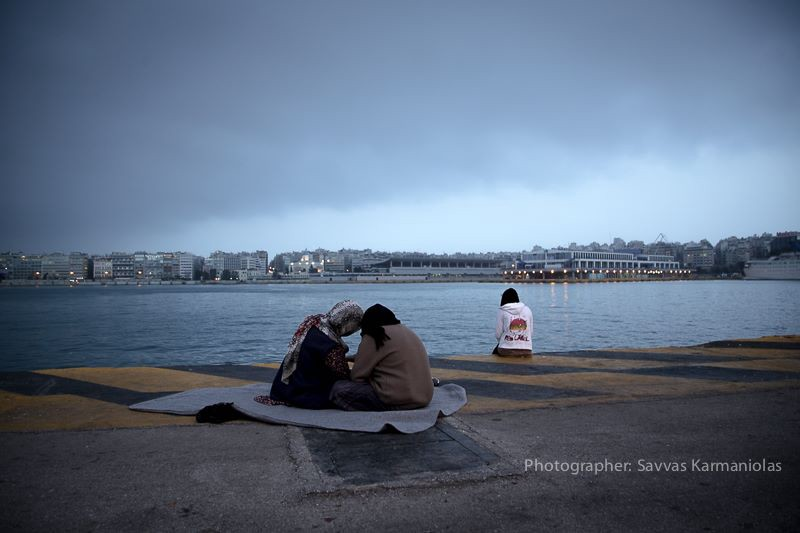
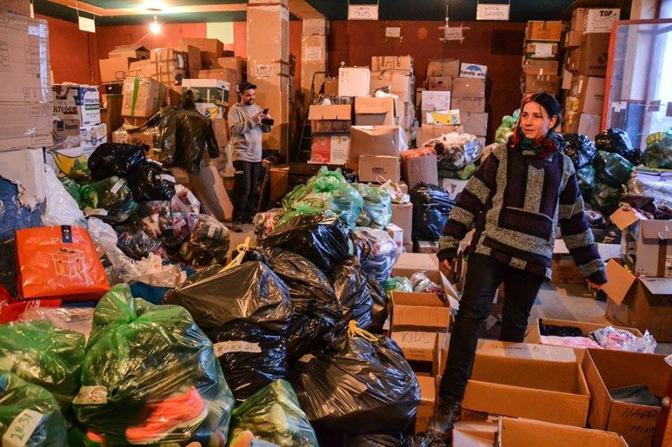
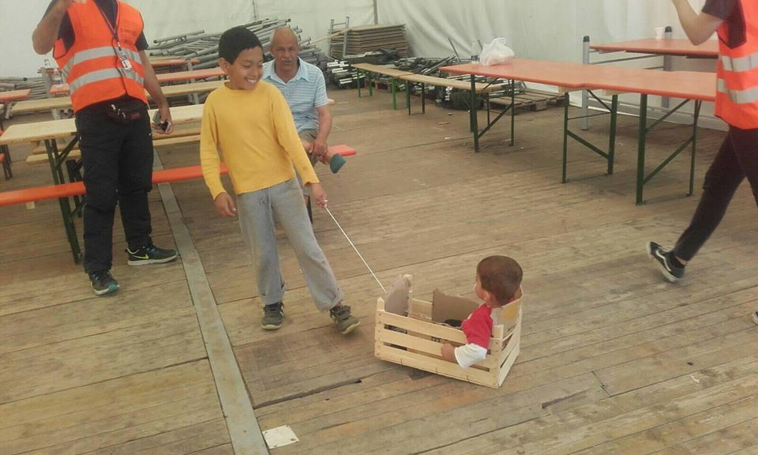

### AYS DAILY NEWS DIGEST 12\.4\.2016
#### The Syrian people continues to face casualties in spite of the ceasefire\. EU Parliament passes a symbolic resolution condemning current EU\-Turkey deal, while simultaneously voting to allow intervention in EU countries not stringent enough in preventing refugees from flowing into Europe\.

Refugees left stranded at Piraeus port, near Athens\. Photographer: Savvas Karmaniolas\.
#### **Syria**
### **instances of ceasefire violations have been reported so far this week, resulting in deaths and casualties, showing that so\-called safe zones remain unsafe\.**

> Since the beginning of this week, [the \#Syriaceasefire monitor has logged six instances of violations which resulted in casualties and injuries of civilians](http://www.syriaceasefiremonitor.org/) , as reported by the Syria Civil Defence\. In \#Daraa, mortar rounds injured two civilians, while an airstrike on Al Myassar killed one girl and one woman, and injured many others\. Barrel bombs were dropped on \#Sfouhen, \#Idlib, killing four civilians and injuring many others, including a Syria Civil Defense volunteer\. Airstrikes hit the town of \#Talbiseh on Monday morning, killing three and injuring ten civilians\. Talbiseh was targeted again by artillery bombardment that same afternoon, this time three children were killed and many civilians, including children and infants, were injured\. In Idlib province, an IED, planted by unknown perpetrators killed one and injured four civilians, while six were injured in airstrikes across the province\. 

### Impeding freedom of movement by establishing “safe zones” on the Turkish\-Syrian border constitutes a possible violation of international law

> Safe zones established for geopolitical purposes may put refugees in danger, aid workers and rights groups warn\. [“Such ‘safe zones’ are often established with geopolitical, and not humanitarian, goals,”](http://www.theguardian.com/world/2016/apr/12/human-rights-groups-sound-alarm-over-safe-zones-for-syrian-refugees) said Bill Frelick, refugee rights director at Human Rights Watch\. “But this means using vulnerable civilians like pawns on a chess board\. “Calling an area ‘safe’ does not make it so\. A safe zone in name only will put people in need of protection in the way of danger\.” Experts warn that a safe zone imposed without the consent of all warring factions will make it a target and that barrel bombs can be dropped from helicopters\. Demilitarisation, one of the main principles of a “safety zone” according to the Geneva conventions, seems near impossible as numerous armed groups vie for supremacy\. 

### IOM director calls on promises of aid to Syria to be fulfilled

> [IOM’s Director General William Lacy Swing today concluded a three\-day visit to Syria calling for humanitarian access to all areas of conflict, while expressing hope that the international community will deliver on aid promises\.](https://www.iom.int/news/ioms-swing-visits-conflict-scarred-syria-calls-humanitarian-access-increased-aid) “Despite the devastation caused by the armed conflict and their suffering, Syrians everywhere want respite and the opportunity to rebuild their country,” Swing said\. “The international community wants to help them to do so, as soon as conditions allow,” he added, after meeting the UN’s Syria peace envoy Staffan de Mistura in Damascus, ahead of a new round of talks between the government and the armed opposition\. 

#### Turkey
### Wage thieves are taking advantage of refugees forced to work illegally in Turkey

> Teams of volunteers visited several illegal camps, finding that the most of the refugees living in the camps live like nomads, moving to wherever they can find work\. Some people act as “managers”, who find the jobs\. Refugees earn from 7 to 13 Euros per day, the “manager” who organized the job and the employer both take a cut of the earnings\. Because of the tight regime on work permits, refugees are forced to work illegally, and have no access to medical assistance\. 
 

> Our source asked to remain anonymous\. 

#### **Greece**

> [According to government sources](http://media.gov.gr/index.php/%CF%85%CF%80%CE%B7%CF%81%CE%B5%CF%83%CE%B9%CE%B5%CF%83/%CF%80%CF%81%CE%BF%CF%83%CF%86%CF%85%CE%B3%CE%B9%CE%BA%CF%8C-%CE%B6%CE%AE%CF%84%CE%B7%CE%BC%CE%B1/%CF%83%CF%85%CE%BD%CE%BF%CF%80%CF%84%CE%B9%CE%BA%CE%AE-%CE%BA%CE%B1%CF%84%CE%AC%CF%83%CF%84%CE%B1%CF%83%CE%B7-%CF%80%CF%81%CE%BF%CF%83%CF%86%CF%85%CE%B3%CE%B9%CE%BA%CF%8E%CE%BD-%CF%81%CE%BF%CF%8E%CE%BD-12-04-2016) , at 8am there were 53,381 refugees stranded in Greece\. There were 7,055 people stranded on the islands — 4,041 on Lesvos, 704 on Samos, 1,828 on Chios, 319 on Leros, 44 on Kos, 77 on Rodos, 12 on Kalymnos and 30 on Kastellorizo\. 

> The Government reports 14,404 in Attica of whom 3,806 are in Piraeus and 795 in a new camp named Skaramagka\. Furthermore, there is 2,376 people in Central Greece, with Koutsochero rising to 1196, and 340 in Southern Greece \(in Kyllini\) \. Finally, the Government reports 29,205 in Northern Greece of whom 11,194 in Idomeni, 298 in new camp Eski Kapou — Chalkero and 195 in new camp Petra in Pieria\. Number of new arrivals on the islands in 24h period until 07:30am was 80, of which 75 on Lesvos, 1 on Samos and 4 on Chios\. 

**72 “irregular migrants” deported to Turkey\.**

> [72 refugees, 71 of whom were Pakistanis and one Bangladeshi were deported from Greece today through the border crossing of Kipi in Evros in accordance with the provisions of the Bilateral Readmission Protocol between Greece and Turkey\.](http://www.naftemporiki.gr/story/1092517/epistrofi-72-metanaston-stin-tourkia-meso-kipon-ebrou) Greek officials have made it clear that the deportations are only just beginning, and we can expect to see significantly higher numbers in the near future\. In addition to the terms imposed by the EU\-Turkey treaty giving new arrivals slim chances of remaining in Europe, refugees of several nationalities, Pakistanis among them, are being barred in particular from continuing their journey, because they are not believed to be facing life\-threatening conditions\. 

**17 volunteers arrested in Idomeni today, all but one have been released**

> [Police arrested 17 volunteers in \#Idomeni today, mostly foreign nationals\.](http://www.independent.mk/articles/30394/Greece+Arrests+Activists+Who+Encouraged+Migrants+to+Violence#sthash.gkJegopb.dpuf) They were suspected of spreading malicious rumors among the agitated refugees on the border with Macedonia\. 16 suspects have been released without charges, while a German national was held in custody for possessing weapons\. Volunteers regularly experience forms of harassment by police, such as police checkpoints at various locations and vehicle searches\. 

### Unease spreads in Idomeni as clashes happen among refugees

> The aftermath of disturbances that occurred on Monday and early Tuesday in \#Idomeni near the Greek\-Macedonian border led to the destruction of an old and several sustained injuries\. [Groups of refugee Kurds and Afghanis started a fight between each other, with metal pipes and stones being used as weapons\.](http://www.independent.mk/articles/30370/War+at+Idomeni+Migrant+Groups+Fight+Each-other%2C+Set+Train+on+Fire#sthash.kr5UeL3n.dpuf) During the fight, part of a train was set on fire\. The train was allocated by the Greek government to accommodate the refugees\. Footage of the fight shows stones flying towards the train wagons and the train being set on fire\. The Greek police quickly responded and managed to deescalate the conflict\. Several foreign and Greek media outlets reported that Idomeni camp is becoming a dangerous place\. The Greek Police is present in the camp, but mostly as an observer\. 

### Greek government continues evacuation efforts of Piraeus port

> Greek authorities are working on the evacuation of the \#Piraeus port, in \#Athens\. Authorities are distributing leaflets in the port to persuade refugees to move out from Piraeus\. 

> Around 4,500 refugees are still waiting at port, according to UNHCR data, based on based on figures from the Greek Coordination Centre for the Management of the Refugee Crisis\. Authorities previously announced that they are planning to fully evacuate the port by the end of April\. 

> Yesterday, the Gate E2 was cleared from refugees, mostly Yazidis and Syrians, according to humanitarians on the field\. Authorities transferred around 700 people by bus to the Skaramagas camp, a former military facility\. Greek authorities plan to transfer another 1,500 refugees from the port to \#Skaramagas camp\. The Greek army is currently working on expanding Skaramagas, as its initial capacity was only 800\. The camp could accommodate up to 3,500 refugees by the end of the week\. According to humanitarians on the field, few refugees received the information leaflet yesterday, however some were verbally informed\. Some people say they do not have problems with going to the camps, as long as the authorities show them videos and pictures to verify that conditions in the camps are good\. 

**500 refugees transferred from Idomeni**

> Evacuation of \#Idomeni is also under way\. Today, 500 people have now been transferred from Idomeni to other camps\. Refugees largely move voluntarily\. Volunteers note that, after the mess these days, many more refugees want to leave\. They have not only lost hope for border\-opening, but they also face too many problems in Idomeni\. Still, about 30 refugees started a hunger strike in Idomeni\. 

**40 refugees in Samos forced to sleep in the open**

> [Last night at \#Samos 40 refugees slept in the open because volunteers were prevented from giving them tents\. MSF asks, “Why so, cruel Europe?”](https://twitter.com/MSF_Sea/status/719851019082035200) 

**382 refugees refuse to move to Koutsochera**

> [382 Syrian refugees have refused today to be moved from \#NeaKarvali camp to \#Koutsochera\.](http://www.newsit.gr/topikes-eidhseis/Sta-Ioannina-kateythynontai-oi-382-Syroi-prosfyges-poy-arnithikan-na-egkatastathoyn-stin-anoixti-domi-filoksenias-sto-Koytsoxero/600300) Upon arriving to Koutsochera, refugees refused to leave the bus and have blocked the road Larissa\-Trikala for about an hour\. Refugees were then rerouted to \#Ioannina, and Koutsochera remained housing its 805 refugees\. 

Warehouses are in desperate need of organizing\.
### Volunteers needed in Polykastro warehouse

> Storage management is important task and that we urge volunteers to join teams in \#Calais, \#Polykastro and \#Eliniko\. A call for volunteers today came from Polykastro\. They rent a huge storage in Polykastro and need more people for unloading trucks, sorting the boxes, loading vans going to the camps and also direct distribution at the camps \(in cooperation with other NGO and groups\) \. They provide a decent accommodation, but you need to have your own means of transportation\. Contact [petra\.quirke@gmail\.com](mailto:petra.quirke@gmail.com) \. TeamBrit Athens can be contacted for Eliniko\. 

### Advice for refugees in Greece who have been victims of torture

> If you are an asylum seeker or a refugee **in Greece** and you were **subjected to torture in your country of origin** you can be referred by any organisation \(for example UNHCR\) in the reception centres and camps, to the Greek NGO [META\-Action](http://www.metadrasi.org/eng/content/torture_victims_certification) \. 

> META\-Action can provide you with an **official certificate** that certifies that you are a **victim of torture** \. 

> **As A Victim Of Torture Do I Have Special Rights?** 

> Your asylum application may be proceeded faster due to the vulnerability of your situation\. 

> You are the only person entitled to decide whether to use the certificate in order to support your asylum application\. 

> **How Is The Procedure?** 

> The procedure involves several consecutive interviews conducted by META\-Action experts: 

> A social worker records your personal history 

> A legal expert carries out a legal investigation 

> A qualified physician will examine you and will diagnose any existing physical consequence that might be attributed to particular methods of torture\. 

> Finally, a qualified psychiatrist will examined you, evaluating any psychological issues resulting from torture\. 

> Each expert makes a final evaluation of the findings, on the basis of the Manual on the Effective Investigation and Documentation of Torture and Other Cruel, Inhuman or Degrading Treatment or Punishment, otherwise known as the “ [Istanbul Protocol](http://physiciansforhumanrights.org/issues/torture/international-torture.html) ”\. 

> META\-Action will issue a certificate with the consensus of all experts, which you will receive in person\. 

> **META\-Action in Greece:** 
 

> Tel: \+30 210 5201792 / \+30 210 5201794 / \+30 210 5138404
 

>  Email: [metadrasi@gmail\.com](mailto:metadrasi@gmail.com) \. 

> Source text: [https://newsthatmoves\.org/en/?p=2200](https://newsthatmoves.org/en/?p=2200) 

### Greece to begin new round of processing asylum applications

> Greece said authorities would start ruling on asylum applications from hundreds of refugees in the next two weeks, in a major test of a new deal to try and control the flow of people trying to reach Europe\. 

> Asylum applications in Greece have been piling up since March, when the European Union and Turkey signed an agreement intended to close off the main route into Europe for over a million refugees and migrants since last year\. 

> Under the deal, those who arrive to Greece from March 20 will be screened, registered and detained in holding centers until their asylum applications are processed\. Rejected applicants, and those who do not apply, are returned to Turkey\. 

> Amnesty International has called the situation in Greece “very chaotic,” without enough attention for individual processing, and has voiced concerns that the process will be a “rubberstamping exercise” to send people back\. 

> So far, around 325 people who did not request asylum have been returned from the Greek islands under the accord, which the UN refugee agency \(UNHCR\) has condemned and rights advocates say may violate international law\. 

> “The first results of the asylum applications will be ready in about 15 days and the next phase of the implementation of the agreement will begin,” government spokeswoman Olga Gerovasili told a news briefing\. 

> A spokesman for the European Asylum Office \(EASO\), a partner in implementing the deal, said the timeframe was “feasible\.” EASO officials have been deployed on the island of Lesvos since last week carrying out “admissibility assessments” of arrivals\. 

> Source text: [http://www\.ekathimerini\.com/207831/article/ekathimerini/news/greece\-expects\-first\-asylum\-decisions\-under\-eu\-deal\-in\-two\-weeks](http://www.ekathimerini.com/207831/article/ekathimerini/news/greece-expects-first-asylum-decisions-under-eu-deal-in-two-weeks) 

#### **Macedonia**
### Plans made to impede movement into Macedonia

> [The Regional Crisis Management Center in \#Gevgelija will prepare a plan for preventing an eventual large influx of refugees onto the territory of municipality Gevgelija, it was concluded at Tuesday’s meeting\.](http://www.independent.mk/articles/30378/Macedonia+Preparations+of+Plan+for+Prevention+Against+Huge+Migrant+Inflow+to+Commence#sthash.b9zQn8Ah.dpuf) The situation on the Macedonian side of the border with Greece is now peaceful and stable\. It is secured by the army and police members and it is constantly being monitored by helicopters\. 

#### **Bulgaria**
### Footage shows armed vigilantes tying up refugees, telling them to return to Turkey

> [Amateur video shot in Bulgaria shows vigilantes arresting three refugees and tying their hands behind their backs as they lie on the ground in a wood\.](http://www.bbc.com/news/world-europe-36013852) The vigilantes — at least one of them armed with a machete — stood over the three and one was heard telling them in broken English to return to Turkey\. The refugees appeared frightened and were not resisting\. The video was shot in \#Strandja, a mountainous area near the Turkish border, the Bulgarian BTV news website reported\. Bulgarian border police chief Antonio Angelov, quoted by BTV, said such an arrest of migrants was illegal\. 

#### **Hungary/Serbia**
### A call to action

> We ask the Serbian and Hungarian Authorities and UNHCR on both sides to facilitate access for NGO’s and Volunteer groups to the stranded people in Kelebija and Horgos\! We do not want a repetition of summer 2015\! 

> Between 60 to 200 people are waiting in front of the two official Tranzit Zones on the Hungarian\-Serbian border in Kelebija and Horgos since days, some of them since weeks\. The Hungarian authorities reduced the number of accepted entrances from 30 to 20 recently and often they accept only 12 or 15 people\. Usually they chose one or two families, take them in and close the doors for another day\. During the last few days, the practice was that they let only Syrian or Iraqi families in\. The Afghan, Pakistani, Iranian, Somali families are left waiting, and eventually return exhausted to Belgrade\. One Afghan family is stranded there since 4 days and nights with several small children\. The mother is pregnant\. They have been talking to UNHCR on both the Serbian and the Hungarian side with no success\. 

> So far only MSF and UNHCR get access to the people stranded on the Serbian side of the Hungarian Tranzit Zone\. No other support structures are in place\. Nobody is allowed to hand out tents, which means that people are exposed to all weather conditions\. There are no sanitary facilities at all\. The situation is deteriorating daily\. 

> In Belgrade we witnessed 200–300 new arrivals daily during the last week\. The actual number might be double as high\. Numbers are increasing, not decreasing\! Most of the newly arriving people come through Bulgaria, where they have been jailed and tortured, chased through forests, walked for many hours and lacked food and water\. Nevertheless, NGO’s are planning to withdraw in many places, closing their missions, while numbers show that the need for support is increasing\. 

> **Be aware and react early enough everywhere in Serbia and Hungary\! We do not want a repetition of summer 2015\!** 

#### **Croatia**

Children spend their last day in Slavonski Brod camp playing \. Photographer: Gabriela Banic
### Slavonski Brod Camp scheduled to close tomorrow morning

> There were 62 refugees at \#Slavonskibrod Camp today\. Tomorrow morning, around 10 a\.m\., the remaining refugees will be transported to \#Zagreb, \#Porin\. In the last few days, Slavonski Brod volunteers tried to welcome those refugees arriving to Porin, while they remained in phone contact with those single men refugees transferred to \#Jezevo\. Tomorrow is the last day of Slavonski Brod camp\. 

#### **Italy**
### **2154 refugees rescued in the Mediterranean Sea today in 17 operations**

> The Italian Coast Guard reported today that more than 2,000 refugees have been rescued in a single day in 17 different operations in the \#Mediterranean Sea\. A Maltese ship, a redirected cargo vessel and a ship that is part of the EU’s Frontex operation joined forces with Italian coast guard, navy and customs rescue ships\. Warm weather and calm seas have resulted in a rebound in the number of people who pay smugglers to cross the Mediterranean to Europe from Libya\. The Coast Guard said the 2,154 rescued Tuesday were found on 16 rubber dinghies and one boat, each crammed with around 100–200 people\. 

#### **Germany**

**30 reports of war crimes reported to the German criminal police \(BKA\) by refugee newcomers per day**

> The BKA’s specialist war crimes division, based in the small town of \#Meckenheim, near \#Bonn, told the “Hessische Rundfunk” that they “weren’t prepared for this mass traffic,” and that additional officers had had to be called in to deal with all the reports from refugees\. Some 2,800 testimonies have already been registered in Germany, with most of the evidence coming via the routine interviews that all asylum seekers give to the Federal Office for Migration and Refugees \(BAMF\) when applying for asylum in Germany\. But the BKA also admitted that only a fragment of the reports came with hard evidence — corroborated by photos or other witnesses — and that many reports amounted to no more than rumors\. Nevertheless, the BKA confirmed to DW that it has launched 13 investigations based on testimony from refugees\. The BAMF’s standard questionnaire for all asylum seekers from Syria includes questions on whether the refugee fought in the Syrian army or used to be a member of the country’s security forces, whether they have witnessed any potential war crimes, including the use of chemical weapons, and whether they possess any documentary evidence to back this up\. Answering these questions is optional; the BAMF automatically passes on any answers to the German police\. 

#### **Austria**

**250 meter long fence being built on the Italian border based on fears in light of the closing of the Balkans route\.**

> Austria has begun building an anti\-migrant barrier across the Brenner pass at the Italian border\. [“The structure will be 250 meters long and will cover both the motorway and the main road,”](http://www.thelocal.at/20160412/austria-begins-building-migrant-fence-on-italian-border) Helmut Tomac, the head of the police in the southern Austrian state of \#Tyrol was reported by Italian newspaper La Stampa as saying\. The guardrails of the motorway and main road are already being taken apart to make way for the barrier and road signs are set to be modified\. In addition to the barrier, a new registration center will also be built on the Austrian side of the border, while traffic checks could be carried out as early as May from a car park just inside Austria\. The new barrier comes amid Austrian fears that the country is set to see a wave of asylum seekers from Italy following the closure of the so\-called ‘Balkan route’ earlier this year\. These fears have been unfounded\. 

#### **EU**
### **EU Parliament declares the Union’s right to intervene if a state “** persistently failed to protect the bloc’s external boundaries”

> [The deployment of the EU’s new border force should be controlled by member states, not by the European Commission, an MEP’s report discussed in parliament on Monday \(11 April\) has concluded\.](https://euobserver.com/justice/133011) Artis Pabriks, rapporteur on the European Border and Coast Guard proposal, said in his report that the right to intervene should be decided by the Council, which represents member states, “to further emphasise the sovereignty”\. The European Commission had initially proposed last December that it should control interventions by the new border force\. EU leaders hope that the new border force will be operational by the summer, and will eventually replace the current Warsaw\-based border agency, Frontex\. It would have the right to intervene in emergencies if a member state persistently failed to protect the bloc’s external boundaries, if national action is lacking and if there is a threat to the Schengen area as a whole\. In a controversial aspect of the proposal, the border force could also be deployed even if the member state concerned rejected intervention\. If the member state does not comply with the council’s decision, reintroducing border controls in neighbouring member states “might be necessary” to protect the Schengen area\. The draft report says: “The Council may as a last resort, to protect the common interests within the area without internal border control and taking into account the principles of proportionality and necessity, recommend that one or more member states decide to reintroduce border control at all or specific parts of their internal borders for a period of up to six months\.” That period may be extended no more than three times\. Lawmakers in parliament’s civil liberties, justice and home affairs committee generally welcomed the his ideas, but emphasised the need for clear areas of responsibility and accountability between the new EU border agency and the member state concerned when European border guards “intervene”\. 

**95 thousand lone children submitted applications for asylum in the EU in 2015, quadrupling 2014’s figures\.**

> [At least 95,000 unaccompanied children applied for asylum in Europe last year, quadrupling the figures for 2014\.](https://www.thebureauinvestigates.com/2016/04/11/infographic-95000-unaccompanied-children-seeking-asylum-2015-voices-numbers/) The huge increase was discovered by the Bureau of Investigative Journalism during an investigation into the level of migration among unaccompanied children, defined as those under 18 years old, in Europe and the stark inconsistencies in the way they are treated\. By approaching 29 different governments for statistics, the investigators found that at least 95,070 applied for asylum in Europe in 2015, up from 23,572 in 2014\. The figure is much higher than previous estimates, and provides the clearest picture yet of the actual scale of migration among unaccompanied minors during last year’s refugee crisis\. Only 17 of the 29 countries provided data\. Spain refused to cooperate, while France said publication of official data would be later this year\. Eurostar will compile its own figures later this year\. 

### **The EU Parliament passes symbolic resolution in favor of an alternative set of policies to replace the EU\-Turkey deal**

> The European Parliament today voted in favor of the Committee on Civil Liberties, Justice and Home Affairs’ report and proposals, in a non\-legislative resolution, for an alternative set of policies to replace the EU\-Turkey deal\. [The EU Parliament advocates for a centralized EU asylum system and legal ways to migrate\.](http://www.europarl.europa.eu/news/en/news-room/20160407IPR21773/Parliament-advocates-a-centralised-EU-asylum-system-and-legal-ways-to-migrate) A centralized asylum system would allow the EU to better manage flows of migrants and asylum seekers, said the European Parliament on Tuesday\. It also asked for safe and legal ways to be found for third country nationals to enter the Union without resorting to human smugglers at the risk of their lives\. In a non\-binding resolution, MEPs acknowledge the failure of the EU asylum system to cope with ever\-rising numbers of migrant arrivals and call for a radical overhaul of the so\-called Dublin rules\. They propose establishing a central system for collecting and allocating asylum applications\. The scheme, which could include a quota for each EU member state, would work on the basis of “hotspots” from which refugees would be distributed\. The resolution, drafted by Roberta Metsola \(EPP, MT\) and Kashetu Kyenge \(S&D, IT\), was approved by 459 votes to 206, with 52 abstentions\. The European Commission is currently considering a revision of the Dublin III Regulation \(which determines which member state is responsible for processing which asylum application\) and has pledged to present a legislative proposal before the summer\. 

**Be sure to like and follow us on [Facebook](https://www.facebook.com/areyousyrious/) and [Twitter](https://twitter.com/areyousyrious) \!**

_Converted [Medium Post](https://areyousyrious.medium.com/ays-daily-news-digest-12-4-2016-bdb695ef9239) by [ZMediumToMarkdown](https://github.com/ZhgChgLi/ZMediumToMarkdown)._
