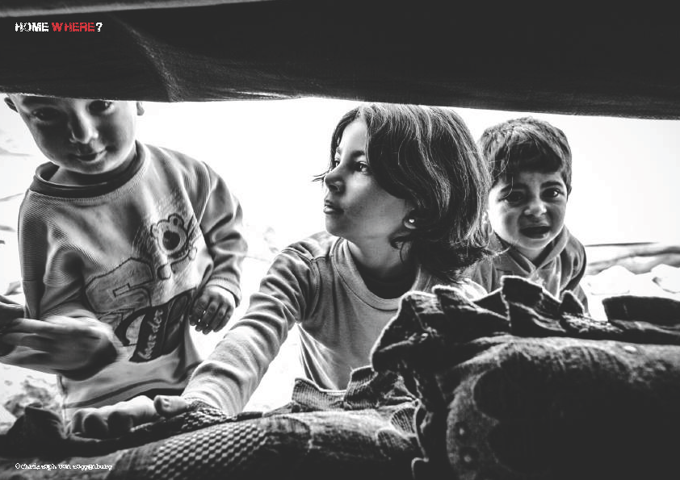
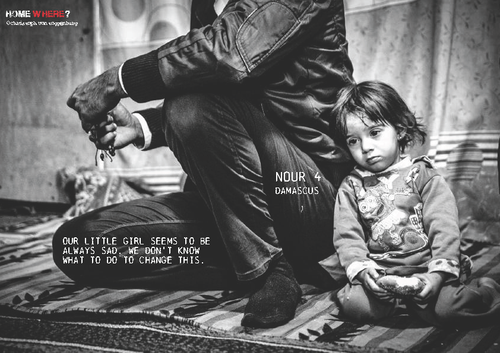
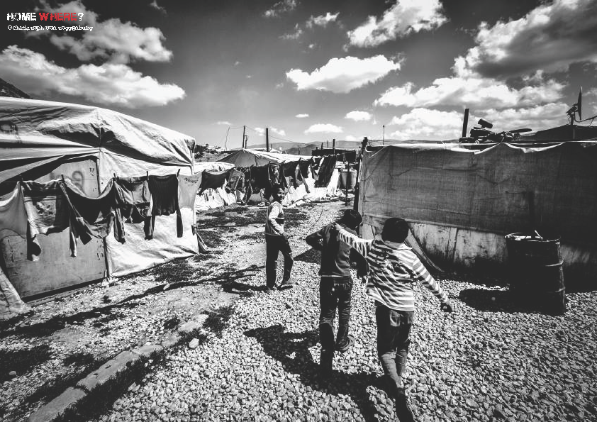

### AYS DAILY NEWS DIGEST 21/4/2016
#### Aid groups have launched the largest delivery of assistance yet in Syria\. Refugees break out from closed camp Vial on Chios ahead of the new deal according to which refugees cannot be detained in centers for longer than 25 days\. In camp Moria on Lesvos, insufficient food portions cause hunger and fights among refugees\. UK to take in 3,000 unaccompanied children from Middle East and North Africa\.

Camp on Lebanese\-Syrian border\. Photographer: Christoph von Toggenburg

> WEATHER WARNING: In the next 12\+ i 24\+ hours, waves in the Aegean Sea will go up to and over 1 m height near Chios, Samos, Leros and Kos\. Those trying to cross the sea are warned that waves over 0\.5 meters are deemed dangerous for sea voyage\. For a full weather report in English and Arabic, please refer to the [East Aegean weather report for potential passengers and volunteers from Sao and United Rescue Aid](http://bit.ly/1MLc7N7) 

#### SYRIA
### Largest delivery of assistance to Syria so far launched today\.

> Aid groups launched their largest delivery of assistance yet in Syria today after the UN evacuated hundreds of besieged residents, reports [France 24](http://www.france24.com/en/20160421-syria-humanitarian-groups-send-largest-ever-aid-evacuations) \. The International Committee of the Red Cross said that the 65\-truck convoy of food and medicines to the besieged rebel\-held town of \#Rastan was the first aid it had been able to deliver to the area’s 120,000 residents since 2012\. Earlier, the United Nations evacuated 500 people “in urgent need of life\-saving medical attention,” and their families, from four other besieged towns, two held by the government and two by rebels\. 

#### TURKEY

**110 million additional Euros to be delivered to Turkey by the European Commission\.**

> The European Commission announced it will deliver another 110 million Euros for the ‘Facility for Refugees in Turkey’\. The funding, an initiative aimed at supporting refugees in Turkey, is delivered as part of the EU\-Turkey agreement\. For a breakdown of the funding, read the full article on [News That Moves](https://newsthatmoves.org/en/?p=2335) \. 

#### GREECE

**214 arrivals to Greece yesterday confirm a slight rise in arrivals compared to previous weeks\.**

> Nearly 54,000 refugees are currently located on Greek territory, according to the Greek Government\. The highest concentration of refugees is still recorded in Idomeni, with 10,257 refugees inside the camp\. Even though NATO’s secretary general Jens Stoltenberg said today that the number of refugees crossing the Aegean Sea into Europe is [significantly down](https://www.washingtonpost.com/world/nato-says-number-of-migrants-significantly-down-just-after-news-that-500-may-have-drowned/2016/04/21/9a925184-074a-11e6-bfed-ef65dff5970d_story.html?postshare=5691461243173370&tid=ss_tw#irony) , new arrivals are still recorded on a daily basis\. According to the Greek Government, 196 new arrivals were recorded on Lesvos and 18 on Samos until 7:30 AM today\. That brings the total number of arrivals in the 24 hours until 7:30 AM to 214\. Volunteers report 34 new arrivals on \#Samos throughout the day today, mostly Syrian, Iraqi and Afghani\. 

### No reports on refugees leaving closed camp Moria on Lesvos yet\. Refugees on Chios broke free from closed camp Vial\.

> As we reported yesterday, the “administrative restriction” process for asylum applicants on Lesvos and Chios is in theory in effect as of Monday\. This means that refugees cannot be detained in registration centers after 25 days since their asylum applications take longer than that to process\. However, refugees from \#Moria camp on Lesvos have not heard of anyone leaving the camp so far\. Similarly, volunteers from \#Vial camp on Chios report that the authorities there have not opened the camp\. Earlier today, refugees themselves broke free from Vial camp\. For now, they are free to come and go from the inside to outside of the camp\. All of the NGOs active on site are having meetings on how to handle the situation\. The atmosphere is described as tense by the volunteers\. 

### Insufficient food in camp Moria on Lesvos causes hunger and fights among refugees\.

> On \#Lesvos, volunteers have been talking to refugees at \#Moria camp who report problems with food distribution\. Each day, they stand in line for two hours to receive small portions of often inedible food\. According to the refugees, every day they are told that food distribution is over after a couple of hours, even though not all of them have received food\. For this reason, some of them get nothing to eat\. Fights have been breaking out every day during food distribution because there are not enough portions for everyone and some have not eaten in days\. The police at the camp allegedly just observe the fights\. 

Camp on Lebanese\-Syrian border\. Photographer: Christoph von Toggenburg
### A 17\-year\-old Afghan refugee died on Tuesday at Laiko Hospital in Athens from what appears to be a series of complications\.

> She was staying with her family in the camp at the former Athens airport in \#Elliniko\. She was taken to hospital on 14th April for abdominal pain due to gastroenteritis\. She was kept in hospital for treatment and died yesterday\. The cause of death is and will remain unknown as her parents refused an autopsy\. The complications \(heart failure and four cardiac arrests\) were presumed to be caused by rheumatoid fever she was suffering from in Afghanistan\. Even though it seems that her death was not caused by camp conditions, Greek authorities in general worry about sanitary conditions and possible epidemics in the makeshift camp at the old airport\. There are currently some 4,000 refugees there whom the authorities are trying to transfer to official hospitality centers\. 

### Local residents near \#VictoriaSquare in Athens have been getting upset by loud children’s playing\.

> They are irked by an increased presence of volunteers who allegedly attract growing numbers of children who play there in the afternoon around 2 PM\. According to Greek law, creating noise is prohibited from 2 PM until 4–5 PM\. During that time, some parks and schools get locked up and no construction or building are carried out\. Because of this, local residents have threatened to call the police if the noise continues\. Volunteers in Victoria Square are invited to be mindful of local laws and regulations\. 

### After sustaining injuries in Idomeni, a refugee died in Thessaloniki today\.

> The Syrian\-Kurd man who suffered head injuries in \#Idomeni on Monday has sadly died in hospital in \#Thessaloniki today\. He was involved in an accident on the Idomeni site where a police van ran over him\. We express our deepest condolences\. 

### After yesterday’s fire, new UNHCR tents put up in camp Diavata today\.

> Yesterday, we reported on a large fire that broke out in camp \#Diavata in Northern Greece near Thessaloniki\. The fire burnt down 25 tents and allegedly spread after it was lit in order to prepare food\. It spread because of strong winds and tents placed very near to each other\. The army was setting up new white UNHCR tents on site today\. Many of the refugees in the camp lost valuable possessions, phones, documents and money in the fire\. 

### Missed asylum appointments have to be rescheduled, the agreed location of the appointment cannot be changed\.

> Reports keep pouring in regarding difficulties in accessing the asylum office services through Skype\. According to News That Moves, if a refugee was given an asylum appointment at the Asylum Service through Skype and missed the appointment, they have to make a new one via Skype\. The location of the appointment cannot be moved and the refugee has to appear at the office in the agreed location, even if they moved to another camp or city in the meantime\. Please be mindful of these two facts and inform refugees who ask you about asylum appointments\. 

### A quadripartite meeting between Greece, Albania, Bulgaria and Macedonia is in progress in Greece\.

> On the initiative of Greek Foreign Minister, a quadripartite meeting between Foreign Ministers and Interior Ministers of Greece, Albania, Bulgaria and Macedonia is being held in Thessaloniki, April 21–22 with the focus on border cooperation\. They will discuss the main challenges of migration and regional cooperation in the field of border management, combating trafficking and terrorist networks and management of the refugee crisis\. 

### Volunteers are still needed throughout Greece\.

> For example, the AdventistHelp mobile clinic is operational again in \#Oinofyta refugee camp north of Athens\. The clinic needs medical volunteers starting as soon as possible\. If you have a passion for humanitarian work and are available to join the team please contact the site co\-ordinator Markus Alt at [greece@adventisthelp\.org](mailto:greece@adventisthelp.org) \. Additionally, as of 23rd April, Dental\-Point Project will set up the first dental clinic at Idomeni camp in response to an urgent call for an emergency dental unit\. Dental or non\-dental volunteers who can help with the set\-up, please send an e\-mail to [dental@healthpointfoundation\.org](mailto:dental@healthpointfoundation.org) \. CK Team from Lesvos is helping at a campsite 80kms south of Thessaloniki\. There is very limited medical care but they will be given a medical room\. They need a medic/nurse starting tomorrow near Katerini, south of Idomeni\. If you are available within 24–48 hours please message Matt Llewellin\. It can be a short stay for the weekend or up to 1–2 weeks until their team medic is free\. 

#### SERBIA
### A lot of refugees, especially families, visited \#Miksalište in Belgrade today to have their needs met\.

> Volunteers from Miksalište report that they currently have enough food to serve breakfast and lunch to everyone who arrives\. However, they desperately need summer clothes for men, women and children of all ages\. Please contact them through their Facebook page “Refugee Aid Miksalište” or their website: [http://refugeeaidmiksaliste\.rs/](http://refugeeaidmiksaliste.rs/) 

Camp on Lebanese\-Syrian border\. Photographer: Christoph von Toggenburg
#### UK
### [The BBC](http://www.bbc.com/news/uk-politics-36102709) reports that that the UK will take up to 3,000 child refugees, as well as an additional 20,000, from the war\-torn Syria region by 2020\.

> These 3,000 vulnerable children are an addition to the 20,000 refugees David Cameron pledged to take in the same time period\. The government scheme will target unaccompanied children in the Middle East and North Africa, as well as those considered at risk of abuse and exploitation, such as children threatened with child labour and child marriage\. It will resettle children and their families “where the UNHCR deems resettlement is in the best interests of the child\.” The resettlement of several hundred people is expected within one year\. 

> After the news aired, critics of the scheme noted that this will ultimately not help thousands of lone refugee children already in Europe and who are also at risk of trafficking, sexual exploitation and abuse\. Estimates state that 30,000 unaccompanied child refugees already arrived in Europe, 10,000 of which have gone missing\. In March, Labour’s Lord Dubs moved the amendment to the Immigration Bill calling on the government to take in 3,000 child refugees already in Europe\. The vote on the amendment will take place on Monday 25th April from 2\.30 PM\. UK citizens are invited to write to their MPs and ask them to appear and vote for the Dubs Amendment\. 

#### FINLAND
### The Supreme Administrative Court in Finland has overturned the decision to return Afghan asylum seekers to Hungary\.

> The decision to return the asylum seekers was made by the Finnish Immigration Service and the Administrative Court of Helsinki\. Before coming to Finland, the asylum seekers arrived in Hungary via Serbia and applied for asylum in Hungary in September 2014\. According to the Supreme Administrative Court, there was a genuine threat that the asylum seekers would be deported from Hungary back to Serbia, if they were to be sent back\. 

_Converted [Medium Post](https://areyousyrious.medium.com/ays-daily-news-digest-21-4-2016-c7ddb5fb6b15) by [ZMediumToMarkdown](https://github.com/ZhgChgLi/ZMediumToMarkdown)._
