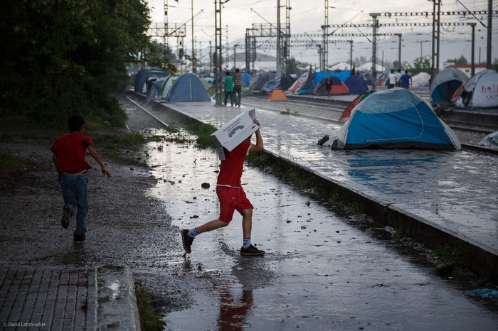
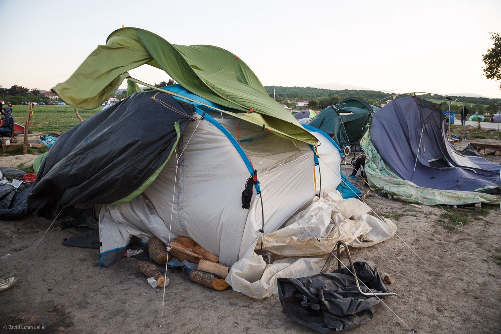
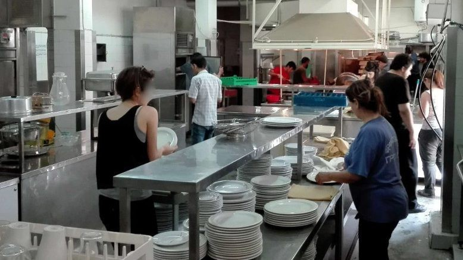

### [AYS DAILY NEWS DIGEST 2\.5\.2016\.](ays-news-digest-1-5-2016-72604bb84219)
#### Even as the war is still raging in Iraq and Syria, the first trial over war crimes in Syria is to be held in Germany\. All the while, the number of refugees stranded in Greece continues to rise, with new recorded deaths on the coast of Italy\. Eurostat came out with new data on unaccompanied minors with an all time high number\. With no real solution in sight, European governments are still trying to prolong ID check\-ups on Schengen borders, and while they wait, France evicts 1600 refugees from the camp in the north of the country\. Calais teams asking for help\. There are also many more calls for help from solidarity teams in Greece\.

Storm destroys tents in Idomeni\. Photo credit: David Lohmueller

#### GENERAL
### 88,300 unaccompanied minors came to Europe last year

Eurostat [reported](https://euobserver.com/tickers/133300) 88,300 unaccompanied minors were among the refugees who came to Europe last year, a figure four times greater than 2014\. About 91% of them were boys, 51% were aged 16 and 17, and 29% were between 4 and 15\.
#### GREECE

> **Weather report from Sao and United Rescue Aid WARNING:** 

> Strong winds and high waves of the coast of Chios, Lesvos, Kos, Kastelorizo and Leros\. Humid and rainy with possibility of thunderstorms\. 

### Numbers of refugees in Greece still high with 64 new arrivals on Greek islands

There is 46,900 stranded in Greece today with 7,450 stuck in the islands, 14,650 in Attica region, 3,400 in central Greece, 300 in the south and 21,100 in northern Greece\. There were 64 new arrivals as of 7:30 am, Monday with 12 in Samos and 52 on Chios\.
### **Volunteers are being harassed around Moria detention center**

There are no reports of situation in camps getting significantly better\. The volunteers who visited \#Moria report on being harassed by police, who asked for identification for no apparent reason and told them that if they had enough staff they would bring them in\. As they report, Moria still very much looks like a detention center, with barbed wire fences to boot\.
### **As the numbers in Greece are staying at their all time high, there are a lot of calls for help\. Volunteers needed all around\. Please read\.**

In \#Athens current volunteer need at places as listed here:

Port of \#Piraeus: 1\) Terminal E1: contact: Negia Milian; 2\) Schoolbox Project \(at E1\) — 11am to 6pm contact: Kirsty Turner; 3\) Terminal E1\.5 \(Stone Warehouse\): contact: Vilelmini\-vilma Andrioti; 4\) Mens Showers at E1\.5; 5\) Womens Showers at E1\.5; 6\) Schoolbox Project \(1\)from 6 May to E1\.5\) — 11am to 6pm; 7\) Translators at the port of Piraeus: contact: Ayren\-Marie Kelly

Help is also needed in the listed Squats: 1\) Notara 26; 2\) Themistokleous 58; 3\) Merlie Oktaviou 19; 4\) Aristotelous St; 5\) Hotel Plaza\.

Besides the port and the squats, we have received a call for volunteers to go to Ellinikon Warehouse — from 11–6pm and Womens Beauty Salon — Praxis homeless centre near Larissa station, contact: Mina Mohit \+30 695 5935494

Disaster Tech Lab is looking for volunteers with IT expertise to volunteer in Ritsona, OInofyta, Athens, Malakasa and Skaramangas\. For more follow the link [http://bit\.ly/1Ococ9o](http://bit.ly/1Ococ9o)

People from \#Polykastro warehouse are also sending a call for more help: “The warehouse needs your help\-there are mountains of boxes to be sorted, and only a few volunteers at the moment working there around the clock\. If you can spare a couple of hours, please drop by and lend a hand\! If you want to donate aid to the warehouse, it MUST be approved first by Aslam Obaid\. Message him through Facebook, or email at [aslam7891@hotmail\.com](mailto:aslam7891@hotmail.com) \.”

\#EkoProject team working in the Eko station near Idomeni is calling for volunteers, too\. If you can help with any kind of activity, contact them on \(0030\) 6931400005 and join the team\. Also, if you specifically want to work in a women’s space that is soon to be open or if you have any ideas and are willing to help, please call Giada on: 694 303 6673 or WhatsApp only: \+61 416 816 202\.

As we have already reported, bad weather conditions took their toll on \#Idomeni\. Heavy rain storms and strong winds have destroyed many tents and people’s belongings\. Volunteers are busy day and night to provide shelter for many families who had lost their homes\. There is a constant need for volunteers to help out our Shelter Team and the many other independent and small organizations providing humanitarian aid to refugees\. For more information, please visit: [http://bit\.ly/1TrxvnA](http://bit.ly/1TrxvnA)
### **Hotel Plaza, home to more than 220 people, is being run by a solidarity network of refugees and volunteers\. Volunteers are always needed\.**

Hotel Plaza Kitchen\. Photo credit: Moving Europe\.

In more promising news, the squatted Hotel Plaza in Athens is still operating\. Hotel Plaza is located at Acharnon 78 and Katrivanou, Athina 104 34 and it’s run by the Solidarity to Political and Economic Refugees \(initiative\) Refugee Accommodation and Solidarity Space City Plaza\. Contact address: [solidarity2refugees@gmail\.com](mailto:solidarity2refugees@gmail.com) \. Hotel Plaza is currently home to 220 people, 9 of whom are unaccompanied minors, 12 families with no husband and 107 children\. Afghans, Syrians, Iraqis, Iranians, Palestinians, Kurds, and Moroccans are living there together\. Some solidarity people are staying on the 1st floor\.

The hotel has strict rules if you want to stay there — no alcohol, no drugs, no sexism and no violence of any kind\. There might be capacity for more, but be aware that this will be decided by the reception committee\. Independent volunteers can go to help at any time\. They are welcome and needed\. Please report to the reception and you will be advised what needs to be done\. Volunteers can bring anything — can ask at reception first for needs list or see the published list on the Facebook page — for now, everything is welcome\. For further information, please visit their Facebook page\.
#### MACEDONIA

**800 attempts at illegal crossing from Idomeni have been undertaken in the last 48 hours\.**

Macedonian officials report 800 attempts for illegal crossing from \#Idomeni in 48hrs \( [reported](https://twitter.com/bopanc/status/727096074410811392) at 4:23 AM — 2 May 2016\)
#### HUNGARY
### First migrants arrive in Körmend camp\.

The first 20 or so migrants have arrived in new Körmend camp at [\#](https://twitter.com/hashtag/Hungary?src=hash) Hungary\- [\#](https://twitter.com/hashtag/Austria?src=hash) Austria some time before 3 PM, according to Boris Kalnoky, foreign correspondent \(Die Welt, Weltwoche, Die Presse\) who also [added on his Twitter](https://twitter.com/bkalnoky/status/727135411068395520) that the mayor told him “Guess they’ll probably walk to Austria”\.
### Judge orders new translation in Horgos\-Röszke case\.

[A judge ordered a new translation](http://budapestbeacon.com/news-in-brief/judge-orders-new-translations-of-testimony-given-by-roszke-defendants/34084) of the testimony of the defendants who were charged with throwing rocks at Hungarian police at Horgos\-Röszke border crossing with Serbia last summer\. It was determined the official translation contained numerous mistakes, some of which were apparently made on purpose\. For example, [Index\.hu](http://index.hu/belfold/2016/04/28/hazug_forditas_keszult_a_megvadolt_roszkei_migrans_karara/) , a translation company that has gone over the document found that translation contained information not present in the original statement and omitted other information\.
#### ITALY

**30 refugees may died in the Mediterranean Sea on the 29th of April\.**

According to the latest survivor testimonies, from 20 to 30 refugees have died in the Mediterranean Sea on the 29th of April, after a dinghy sank\. The smuggler from Mali, Yosuf Thiarè, has been arrested with the accusation of supporting clandestine migration and murder; the witnesses confirm that he could do nothing as the dinghy sank, but they also mentioned that he had had an agreement with some Libyans to lead a vessel too small for 120–130 people\. 99 survived to the event, saved by Spanish boat Numancia, which had already rescued 346 people\. For more info, see [Rai News in Italian](http://www.rainews.it/dl/rainews/articoli/Hofer-sui-migranti-mi-aspetto-responsabilita-Europa-01422da6-d28b-4960-986d-8099ec4d199a.html?refresh_ce) \.
### 700 migrants saved around Sicilian coasts\.

[On the1st May, 700 migrants were saved around the Sicilian coasts](http://gds.it/2016/05/02/migranti-in-700-salvati-in-un-giorno-renzi-da-palermo-un-patto-per-lafrica_507122/) \(249 people from a vessel on Sunday night, 200 miles East of Sicily; 454 people from the ship Siem Pilot 17 hours later, around Sicily channel\) \. Prime Minister Matteo Renzi, visiting today the island, invoked an “agreement for Africa” to be proposed to the European Union; he also asked the European states “not to turn their heads to the other side”\.
#### GERMANY
### First trial over war crimes in Syria to take place in Germany\.

On Tuesday, Germany will start its first war crimes trial over atrocities in Syria, which concerns a 21\-year\-old German national who posted on Facebook photos of himself next to two decapitated heads in Syria, reports Daily Star \(Lebanon\) \. The trials are made possible by the fact that “mass refugee influx brings not only witnesses and victims but also suspects into the country\.” Currently, ten investigations linked to Syria and Iraq are being examined by the federal prosecutor and more than 30 cases against former jihadists and their supposed membership in a terrorist group\.
### Germany, along with several EU states, to ask EU to prolong inter\-Schengen border controls for another 6 months\.

Germany, along with five other states \(France, Austria, Belgium, Denmark and Sweden\) will ask the EU to prolong border controls between Schengen members for another six months, thus suspending the passport\-free travel for members of the Schengen area\. German Interior Minister Thomas De Maiziere explained this move as being needed to protect their borders from migrant influx through other possible routes, [reports Deutsche Welle\.](http://m.dw.com/en/germany-wants-eu-border-controls-extended/a-19226814)
#### FRANCE
### 1600 people were evicted from Place de Stalingrad\.

New eviction were undertaken for the camp in Place de Stalingrad, northeast of Paris\. According to the prefecture, over 1,600 people have been evicted from the area, deemed dangerous as it is located in the middle of a high\-traffic road and under the railways of a metro flyover\. The people have been sent to refugee centers in the region\. Among them, 100 people \(women and children\) have been assessed as vulnerable and taken in custody from City of Paris\. Minister of House Politics Emmanuelle Cosse and representatives of NGOs for migrants’ rights oversaw the whole operation\. It is the third eviction of the area in the last two months, [reports Italian news agency Ansa\.](http://www.ansa.it/sito/notizie/mondo/2016/05/02/migranti-sgomberato-campo-stalingrad_0c23b85d-1ea8-4da9-8cd3-52c6953a255f.html)
### Calais needs your help\.

The legal center in Calais and refugee info bus \(extremely important because they give refugees valuable information and advice on things like legal status, asylum, and have so far contributed to many important things such as the arrests of fascist groups attacking refugees\) need your help\. The legal center needs funding for their car \(essential for their work\) and the info bus needs a gazebo\- waterproof and easy to put up\. For more information, see [http://bit\.ly/21r9Lph](http://bit.ly/21r9Lph)

People to People Solidarity — Action from UK kindly asks for donations of trousers: small sizes, slim fit, joggers are especially loved\. Please contact clare@care4calais\.org\.
#### UK
### Merseyside councils are willing to receive refugees from Syria\.

As part of the government’s resettlement scheme, [Merseyside councils are willing to receive hundreds of refugees from Syria](http://www.liverpoolecho.co.uk/news/liverpool-news/merseyside-welcome-hundreds-refugees-syrians-11192125) over the next four years \(with first ones possibly arriving this summer\), on the condition that government provides extra funds to support refugee families\. A Knowsley council spokeswoman said the council and their partners “were already taking steps to put support in place, which could include school places, health services, translation, emotional and practical assistance”\.

_Converted [Medium Post](https://areyousyrious.medium.com/ays-daily-news-digest-2-5-2016-58a670bbfe2a) by [ZMediumToMarkdown](https://github.com/ZhgChgLi/ZMediumToMarkdown)._
