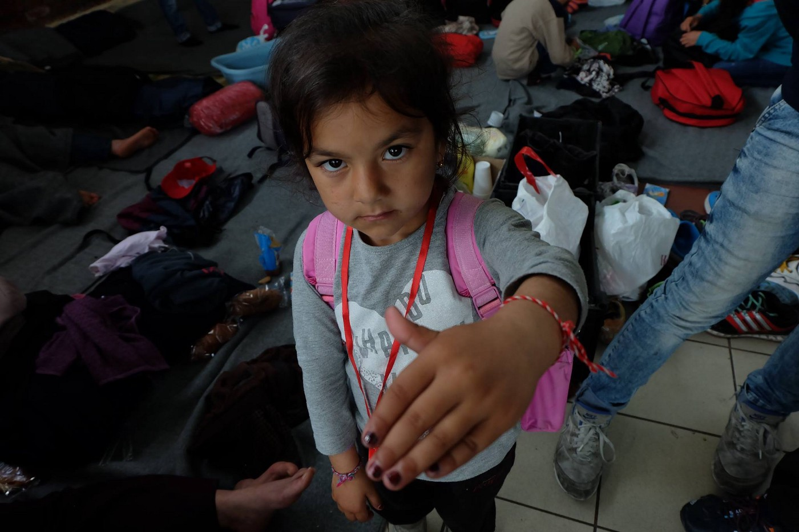
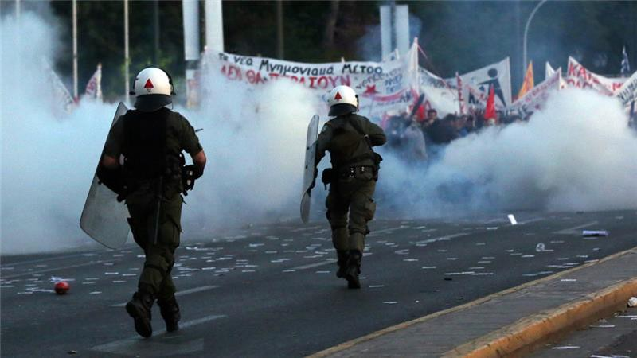
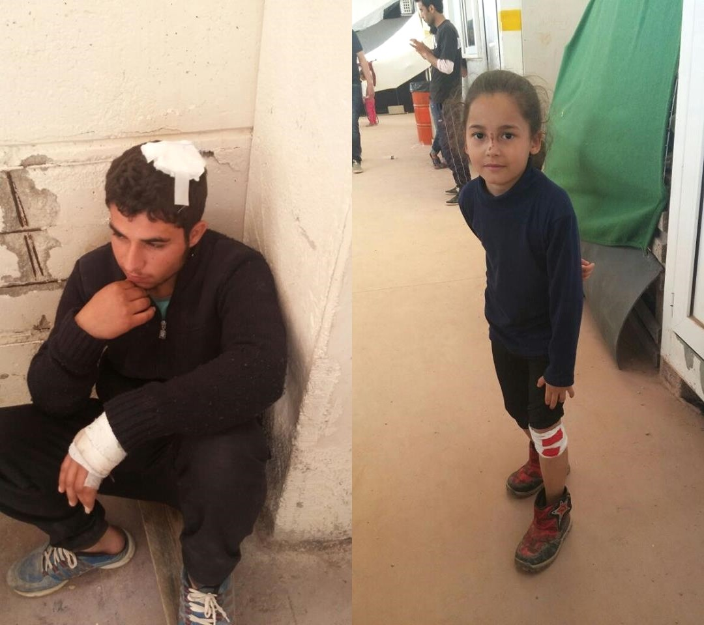
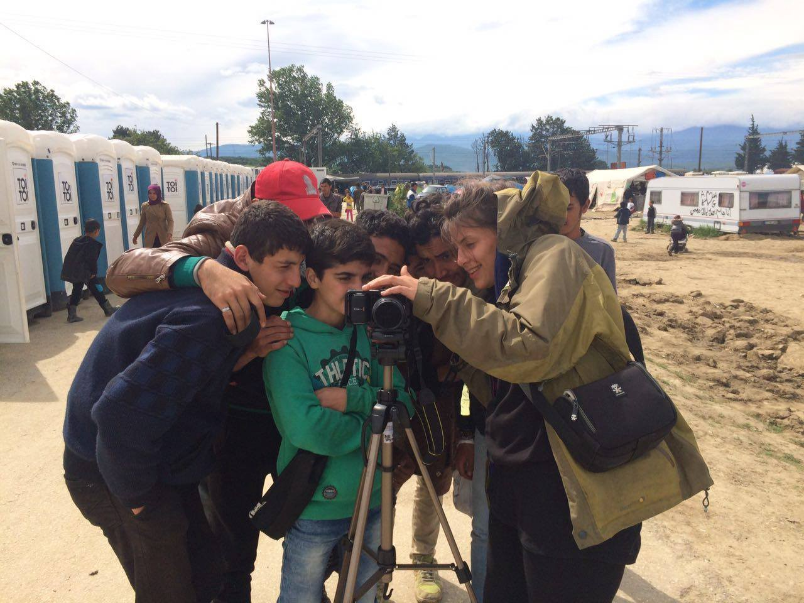
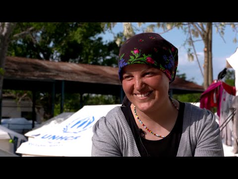
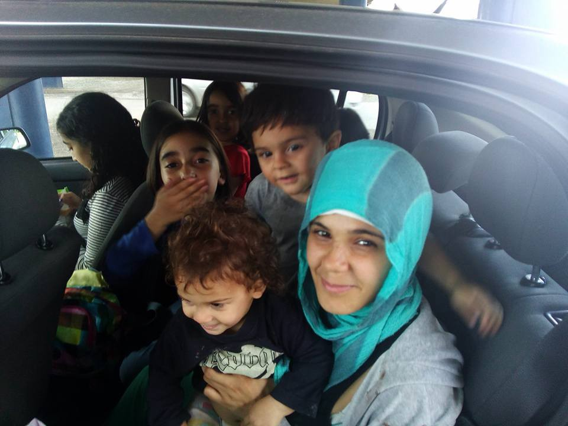
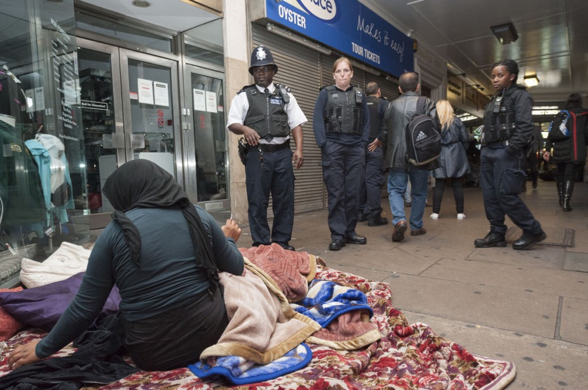

### AYS DAILY NEWS DIGEST 8\.5\.2016\.
#### More violence occurred in Vial camp on Chios, where lack of food and poor treatment of the refugees is reported\. UNHCR published a promo video for the new camp of Lagkadikia, luring refugees to leave Idomeni\. Refugees stuck in Albania, but those in Serbia still can continue their trip to Hungary\. AYS helping with integration of the refugees in Croatia\. Iranian man attempted suicide in Harmondsworth detention centre after being left without help for days\. At least 3,373 refugees left to beg for food and clothes in the streets of Great Britain\.

Refugee girl proudly showing her red and white bracelet, a symbol of Yazidi people, while waiting with her family in Athens; PHOTO: Nima Yaghmaei Photography
#### SYRIA
### At least three dead, 15 wounded in the government controlled district of Aleppo

On Sunday, Syrian rebels fired rockets into a regime\-held district of Aleppo, killing at least three civilians and wounding 15, according to Syrian Observatory for Human Rights\. Six civilians including 5 children were killed by International Coalition bombing targeting Ihtimalat village on Saturday in northern Aleppo countryside, according to Zaman al\-Wasl and Sirius News\. They were the first casualties since a ceasefire took hold on Thursday in the battleground northern city, where regime forces control western districts and the rebels are entrenched in the east\. The ceasefire is due to expire at 2101 GMT on Monday\. Syria’s five\-year war has killed more than 270,000 people and displaced millions\.
#### INTERNATIONAL
### Is the EU sending anti\-terrorist agents to refugee camps in Italy and Greece?

Columnist Manuel Navarrete and the director of the European Counter\-terrorism Centre reports on the EU sending anti\-terrorism agents in refugee camps in “several points in Italy and Greece”, in order to “identify possible jihadist warriors”\. The authorities of the two countries will be supported by Europol “in order to identify possible terrorists who could use the migration flow to hide amog the refugees and enter Europe\.“
#### GREECE
### Riots and strikes after new austerity measures

Riots in the streets of Athens; PHOTO: Orestis Panagiotou/EPA

Today is the the third day of a general strike in Greece against the new austerity measures\. Tonight, the Parliament in Athens passed the controversial austerity bills\. 153 parliamentarians voted “yes” according to an official Greek radio station\. According to international press, protesters have hurled petrol bombs at police who responded with tear gas outside the parliament ahead of vote on austerity measures required for bailout\. The situation intensified after the vote\. Mass protests have been announced in Athens and Thessaloniki\. If you are traveling, please check the news regularly\.

There were 53,726 registered refugees in Greece today, including 7,756 on the islands, 14,450 in Attica region, 1,915 in Central Greece, 228 in Southern Greece and as many as 29,267 in Notrhern Greece\.
### Boat crossing attempts may have intensified yesterday, prompting fear of reopening of Aegean Sea route\.

According to Platanos Refugee Solidarity volunteers, who have welcomed a boat with 39 refugees on Northern Lesvos shores yesterday, around 7 boats attempted the crossing at the same time as they did, but others were intercepted by Turkish coastguard\. Volunteers are concerned that this might indicate a restart of the Aegean Sea route, but no new crossings were registered today to support this theory\. It is still unknown if there were any boats intercepted by Turkish authorities today\.
### More violence today in Vial hotspot on Chios\.

Hurt refugees in Vial; PHOTO: Benjamín Julian

Volunteers have reported more fights in Vial last night, and police reportedly didn’t intervene to calm down the situation\. According to one volunteer’s testimony, when refugees asked the police today why they didn’t intervene, the reply was, “nobody asked you to come to Greece\.” The atmosphere in the camp is still tense, with lack of food and poor treatment of the refugees\. Some refugees say they have decided to sign their deportation papers just to get away from Vial\. After such a bad night, a small miracle happened today: refugees were served warm chicken and rice, making them feel like humans for a moment\. Sometimes they need so little, but if authorities fail to provide them with basic necessities, it can lead to more frustration and violence\.
### Calm days in Idomeni despite slow eviction

The slow eviction is underway in Idomeni, where 9,893 refugees are being held, remains the main topic of conversation these days\. Fortunately, everything seems really calm in the field\. Idomeni Cultural Center is doing wonderful job in keeping the youngest entertained\. Today, a group of teenagers was really busy, making their own documentary about the camp and wrapping up their first short film\.

Young refugees shooting a documentary about Idomeni camp; PHOTO: Idomeni Cultural Center
### UNHCR lures refugees to the new camp\.

The video released by UNHCR titled “Greece: Safe Haven” depicts the new camp of Lagkadikia, where refugees from Idomeni are being transferred\. According to the video, which was probably made as part of the attempts to encourage refugees to move to the new camp, accommodation is provided in the form of tents, each meant for a family of 6 persons, but there are plans for container accommodation in later stages of the camp\.

#### ALBANIA
### Information updates on Albanian camps needed for refugees and volunteers

According to information we received from both refugees and activists, there are several camps with refugees \(including children\) in Albania\. In some of them, people cannot move freely and they are asking for help, unsure if they have any right of movement\. As we are having difficulties obtaining more information on the situation and the conditions in the camps in Albania, we would appreciate your help with more exact information or useful contacts\. Refugees who are stuck in the country might need more support\.
#### SERBIA
### Slow, but possible transit to Hungary\.

In Preševo, only around 30 people are left as of today, and during the last week approximately 20–30 were passing through Preševo in transit towards western Europe\. Those who reach Preševo undergo the usual procedures with the police in the camp, but do not stay longer than one day before they continue their journey, usually towards Hungarian border\. Volunteers report on around 50 people waiting in Horgos, Serbian\-Hungarian border, to pass over to Hungary\. The conditions are reportedly very bad, and UNHCR is still the only organization with access to the refugees who are waiting, sometimes for a few days, on the Serbian side of Horgos border\.
#### CROATIA
### AYS making sure refugees feel good in Zagreb\!

After a very successful day trip the refugees had to the rock concert in nearby town of Zabok, with the trip, concert tickets and bus transportation organised by AYS volunteers, we spent today in the park with refugees from Iran and Syria, playing sports and enjoying the day with kids\. The day before, only those who have asked for asylum in Croatia were allowed to join the group who went to a concert\. All the others must return to the “Porin” Centre/Hotel for refugees by 10 pm in the evening, so they were sadly left behind\. We hope that the picnic in the Bundek park that which we organized today helped at least a little bit to have a nice weekend in our town, even if they had to skip the concert, which — we hear — was a very enthusiastically received change\! We are also planing more visits to theater, zoo, sports events etc\. to make them feel at home in our country\.

A refugee family on their way to Bundek park; PHOTO: Magda Sindicic / AYS
#### ITALY
### Violations of the right to asylum reported in Milan\.

European Council on Refugees and Exiles \( [ECRE](http://ecre.org/) \) reports on the violation of the right to asylum reported at the police station in Milan:

> “…On arrival at the police station, asylum seekers are handed a very short questionnaire allegedly used to determine whether there is a clear need of international protection or whether the person is an ‘economic migrant’\. In the latter case, people are immediately handed an expulsion order\. According to information provided by the organisations to ECRE, this practice seems particularly common with people who are not accompanied by a lawyer or social worker when making their asylum claim, and are thus more vulnerable and have less knowledge of their legal rights in the matter\. When the expulsion order has been challenged by legal practitioners on behalf of the claimants, such orders have been quashed…” 

### Red Cross center in Tagliate overcrowded\.

The Red Cross in Tagliate \(Lucca\) is in a somewhat of a state of emergency: it has hosted 160 refugees and migrants in a structure that receives up to 100 people, and 12 more people have arrived today\. In order to address the issue, the mayor Antonio Sichi presented the case to the national association of italian municipalities \(Anci\), stating that Red Cross’s structure may implode if numbers grow too much\. He therefore asked of other municipalities to share the burden\. Moreover, the RC stated that among 308 migrants \(mainly Pakistani, but also from Nigeria, Gambia, Ivory Coast and Ghana\), only 148 are within the system which takes care of them, whilst Red Cross has to carry the burden or the remaining 160 all by itself\.
#### FRANCE
### Situation in Calais camp is worsening

The group Help Refugees has started a crowdfunding campaign in order to provide a continuous help for the refugees in Calais, as they did since August 2015\. They report on the worsening of the situation in the wild camp of Calais, and on the dropping off of the donations needed to remain on\-site\. Volunteers are burning out and leaving as well — if you want to help and volunteer in Calais, please contact Tom Radcliffe on Facebook\. In case you can donate, [follow this link](https://crowdfunding.justgiving.com/jungle-outreach) \.

Donations are also needed in Grande Synth, as explained [under a video](https://www.facebook.com/asso.utopia56/videos/1156811927683931/) posted by [Utopia 56 group](http://www.utopia56.com/en/) , one of the most active in the field\.
#### UNITED KINGDOM
### At least 3,373 refugees left to beg for food and clothes in the streets of Great Britain

Some of the UK’s 3,300 refugees who are denied jobs or benefits are turning to Street Kitchens and volunteer centres like the Dalston Centre in east London for food; PHOTO: STREETS KITCHEN

The British Red Cross says that “at least 3,373 refugees and asylum seekers in the UK have been destitute over the past three months\. It warns that government plans to remove support payments for families refused asylum, regardless of whether or not they can safely leave the UK, will plunge even more into poverty”\. The Guardian has published [an extensive article](http://www.theguardian.com/uk-news/2016/may/07/homeless-asylum-seeker-refugees-forced-red-cross-food) about the homeless refugees, and Streets Kitchen [has expanded to it with its own stories](http://streetskitchen.co.uk/no-money-for-food-clothing-or-a-home-how-asylum-seekers-are-left-destitute-on-uk-street/) and photo documentation of the misery refugees are enduring\.
### Could the suicide attempt of the Iranian man in Harmondsworth have been prevented?

Yesterday afternoon, there was an attempted suicide in Harmondsworth detention center, according to [The Unity Centre](http://unitycentreglasgow.org/attempted-suicide-at-harmondsworth-detention-centre/) \. Reports from detainees inside say that an Iranian man, who speaks no English, cut his wrists and lay down in the courtyard outside, falling unconscious\. He had been protesting as an individual for 4 days — refusing to eat or drink — and 3 days ago he requested to be transferred to a room to be with someone who also speaks his language, and was very upset when staff ignored this\. With no access to translation, detainees are forced to rely on other detainees, who may also speak little English, in order to understand daily life in detention\. Detainees report that staff members were aware how upset he was — unable to talk to anyone and scared to enter his room — and that he was refusing to drink or eat\. Staff failed to act in response\. One officer told a detainee that they were aware how worried about his case the man was, yet no officers asked him how he was, or came to check on him before he attempted suicide\.
#### FURTHER READING

If ou are interested in more news or/and summaries from this week, please follow this link to read our friends’ [RefuComm’s weekly update](http://us5.campaign-archive1.com/?u=8b78e9a34ff7443ec1e8c62c6&id=0e16052d66&e=c21a1c3729) \.

_Converted [Medium Post](https://areyousyrious.medium.com/ays-news-digest-8-5-2016-96a9470c61d) by [ZMediumToMarkdown](https://github.com/ZhgChgLi/ZMediumToMarkdown)._
