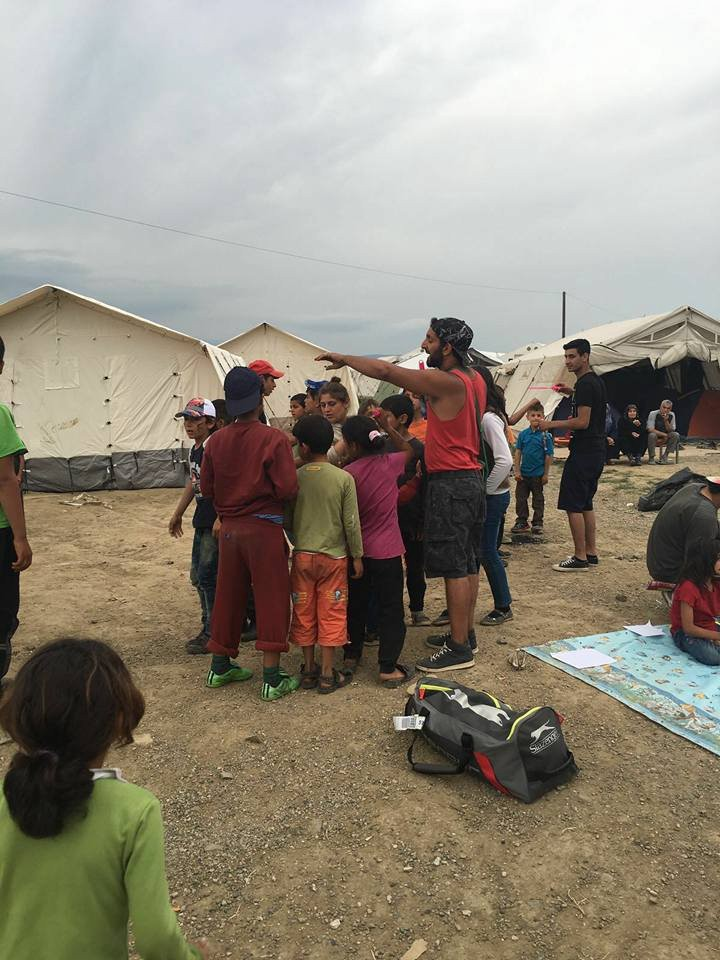

### AYS DAILY NEWS DIGEST 16\.5\.2016
- The EU Civil Liberties Committee is traveling to Greece to study the facts on the ground following the EU/Turkey agreement, but the data clearly show that the deal is not working\.
- New and improved registration process announced for Greece starting in a couple of weeks\.
- List of solidarity groups in Greece asking for help\.
- Skala camp is closing\.
- Troubles in new hotspot in Kos\.
- Hunger strike in Schisto\.
- Accommodation for two boys needed in Thessaloniki\.
- 1153 people rescued off the coast of Sicily, 51 off the coast of Libya\.
- UNHCR report raises “serious concerns” about Hungarian policies towards refugees and their “compatibility with international and European law”\.
- Camp Liniere in France launches a crowdfunding campaign for building a legal centre\.
- 87 people to be relocated from Greece to Spain by the beginning of June\.

Amazing kids’ party in Idomeni camp’s cultural centre, organized by Road to Freedom\. Photo credit: Neezo Swansea Dhan
#### GENERAL
### **EU Civil Liberties Committee is traveling to Greece**

A Civil Liberties Committee delegation will travel to Greece from 18 to 20 May to check the situation of refugees at the external borders of the EU and assess how the EU\-Turkey deal to manage migrant and asylum\-seeker flows into the EU is being implemented\. MEPs will visit the Greece/FYROM border, the island of Lesvos, and Athens\. They will also meet representatives of the Greek Government, EU and international bodies, and NGOs\.
#### GREECE
### **Only around 400 out of some 8,500 people have been sent back to Turkey from Greece since the implementation of EU/Turkey deal**

While the EU officials are planning a field trip, data shows that EU/Turkey deal luckily has some troubles when it comes to implementation\. Even though Brussels has succeeded in an almost 90% decrease of refugee flow to Greek islands since the EU/Turkey deal has been put in place, numbers show that only around 400 out of some 8,500 people have been sent back to Turkey since\. As Financial Times reports “Greece has instead approved over 30% of 600 asylum applications from Syrian migrants\. Greek officials say the slow pace of returns reflects their own policy on asylum requests and say that Greece’s migration laws do not recognise Turkey as a safe third country for refugees\. Maria Stavropoulou, a former UN official who heads the Greek asylum service, said: “We fully understand the \[EU\] concerns but if you look at it from the perspective of the rule of law, it is going exactly as it should\.”
### **Weather report warning\!**

High waves of the coast of Leros, Kastelorizo, Samos, Kos and Chios\.
### **49 new arrivals on Greek islands**

Number of people still stuck in Greece remains pretty much the same with 49 new arrivals today: 2 in Kos and 47 in Chios\. Total number of refugees in Greece today is 54,469 with 8,556 in the islands, 14,475 in the Atika region, 2,039 in central Greece, 324 in southern Greece and 29,075 in the north\.
### **New and faster process of registration inside the camps announced**

Due to the small number of cases processed, the Greek Asylum Service will conduct a pre\-registration exercise for international protection in the mainland from end of May to end of July\. The announcement was made in a joint press release today by the Greek Asylum Service, the United Nations High Commissioner for Refugees \(UNHCR\), and the European Asylum Support Office \(EASO\) \. The exercise will be funded by the European Commission \(DG Home\), The United Nations High Commissioner for Refugees \(UNHCR\) and the European Asylum Support Office \(EASO\) \.
### **Volunteers needed in Greece**

There is still a growing number of volunteers in different solidarity organizations throughout Greece as well as those willing to work with our digest team\. If you can help in any way, follow the link: [http://bit\.ly/1XmlVzM](http://bit.ly/1XmlVzM) to see the complete list of organizations calling for help\.

Platanos refugee solidarity team in Lesvos has decided to deconstruct their structures in Skala camp due to no new arrivals on the island\. They need help with deconstruction costs and moving the materials places which need them more urgently\. Follow their Facebook page and look for our updates on cost estimates\.

Starfish has been sending volunteers to a safe camp in Lesvos, where Save the Children, Medecins Sans Frontiers, and Praksis are overseeing a group of 75 unaccompanied children who have recently been released from Moria Detention Center\. Photocredit: Starfish Foundation\.
### **Troubles with the new hotspot in Kos**

At the new hotspot opened on the island of Kos, volunteers estimate that there will be hundreds of new arrivals\. The report from ground says that “minors who arrived at Kos island from Turkey are still staying in a small hotel and avoiding both the hotspot and prison, but were told to pack and prepare to move to the hotspot\. So far they can move freely throughout the island\. The refugees held in the local prison will be transferred to the hotspot, too\. To date, no volunteers have been able to enter the hotspot\. It is located close to the airport\. Pictures and more information will follow as soon as possible\. Today, there is a meeting of local volunteers to discuss how to proceed under the new circumstances\.”
### **Hunger strike in Schisto hotspot**

There are reports of a hunger strike in the hotspot Schisto in Attika region as reported by refugees in the camp\. They say they are protesting the worsening conditions in camps\.

There is a call for donations from the the Orange House team\. They need:
- For bedrooms: side tables, storage furniture \(cupboards, book shelves, etc\. \)
- For kitchens : glasses and cups,
- For their activities : musical instruments, a small stereo, tables, chess, backgammon/tavli or other board games
- For their courtyard: raised bed to grow vegetables\.

“To make sure we don’t get the same furniture donated twice, please get in touch with Daniel Pitt \(speaks English, Arabic, Farsi\) \+30 69 48 98 72 69 or with [https://www\.facebook\.com/zaatarngo/?fref=ts](https://www.facebook.com/zaatarngo/?fref=ts&hc_location=ufi) ”
### **Accommodation for two boys from Syria needed in Thessaloniki**

Solidarity group of [Micropolis](https://www.facebook.com/%CE%91%CE%BB%CE%BB%CE%B7%CE%BB%CE%B5%CE%B3%CE%B3%CF%8D%CE%B7-%CF%83%CE%B5-%CE%A0%CF%81%CF%8C%CF%83%CF%86%CF%85%CE%B3%CE%B5%CF%82%CE%9C%CE%B5%CF%84%CE%B1%CE%BD%CE%AC%CF%83%CF%84%CE%B5%CF%82-%CE%9C%CE%B9%CE%BA%CF%81%CF%8C%CF%80%CE%BF%CE%BB%CE%B9%CF%82-1534348356868415/?fref=nf) has issued a call for accommodating two boys from Syria in Thessaloniki\. They are brothers aged 15 and 19\. The group says they will support the boys’ supplies, medical care and legal consulting; they just need a place to stay\. “Whoever can offer a space for some time, please call at 6983383169 or send mail to mgfdthes@gmail\.com\.
#### ITALY
### **1153 people saved off the coast of Sicily**

A total of 1153 people were rescued throughout the day in the strait of Sicily in 11 different rescue operations\. The operations were coordinated by the Maritime Rescue and Coordination Center in Rome\.

The Italian Navy ship “Nave Borsini” in the course of “Mare Sicuro” \(safe sea\) rescued 223 migrants from two plastic dinghies\. The “Dignity” from the NGO MSF rescued three dinghies with a total of 437 migrants on board\. The Irish ship “Le Roisin”, active in the course of EunavforMed rescued 125 from one rubber boat\. Furthermore the German ship “Frankfurt” also in the frame of EunavforMed rescued 115 people and “Aquarius” from the NGO “SOS Méditerranee” rescued 253 people\.
#### LIBYA
### **51 people saved off the coast of Libya**

Search and Rescue team of SOS MEDITERRANEE evacuate African migrants from an overcrowded dinghy during an operation in Mediterranean sea 51 miles Northeast of Tripoli, Libya\.
#### HUNGARY
### **Hungarian policies towards refugees “raise serious concerns” as stated in the new UNHCR report**

Hungarian national legislation and policies towards refugees “raise serious concerns” in relation to their “compatibility with international and European law” and may conflict with the “country’s international and European obligations,” [a new UNHCR report said last week \.](http://www.refworld.org/country,,,,HUN,,57319d514,0.html)

In its report “Hungary as A Country of Asylum”, UNHCR stressed that the legal measures introduced in Hungary between July 2015 and March 2016 “have had the combined effect of limiting and deterring access to asylum in the country\.” Among the worst measures Hungary has put in place, ones which we have reported on heavily and those that many organizations and volunteers have been warning refugees about, include fencing the border, so\-called “transition zones” as the only places to ask for asylum, and detaining refugees under the provisions of criminal law\. For a summary, follow the link: [http://bit\.ly/1TdhpDM](http://bit.ly/1TdhpDM) \.
#### FRANCE
### **Crowdfunding campaign in Camp** Linière **— building a new legal center**

Although the crews working around Camp Linière in the city of Grand Synthe still do not know what the government plans for this camp, they are working diligently on improving it\. Camp Linière is the first humanitarian camp in France established by the MSF\. Doctors Without Borders created the platform which welcomes the whole camp, housing and toilets, as well as health center\. All other facilities were built by British associations: communal kitchens, dining rooms, multi\-purpose hall, and an education center\. The teams working there have started a crowdfunding campaign for building a legal center; if you can contribute, please follow the link: [http://bit\.ly/1V6KTCC](http://bit.ly/1V6KTCC) \. The construction of the legal center by the students of the graduate school of Architecture of Paris Belleville is planned from Monday, June 13th through Saturday, June 18th and they are asking for help\.

The humanitarian camp of Linière was run by the all\-volunteer association UTOPIA 56 until the beginning of May\. The French government had promised to reassume control of the camp at the beginning of May, but no real action has been taken\.
#### SPAIN
### **87 people to be relocated to Spain from Greece by beginning of June**

Moves reports that Spain has announced that the country is ready to receive the first group of refugees from Greece\. A group of 87 people currently in Greece will be relocated to Spain “between May 24th and 26th, and 63 more would arrive at the beginning of June,” the Spanish Interior Minister Jorge Fernandez Diaz said\.

\.

_Converted [Medium Post](https://areyousyrious.medium.com/ays-daily-news-digest-16-5-2016-4ce24d6a136f) by [ZMediumToMarkdown](https://github.com/ZhgChgLi/ZMediumToMarkdown)._
