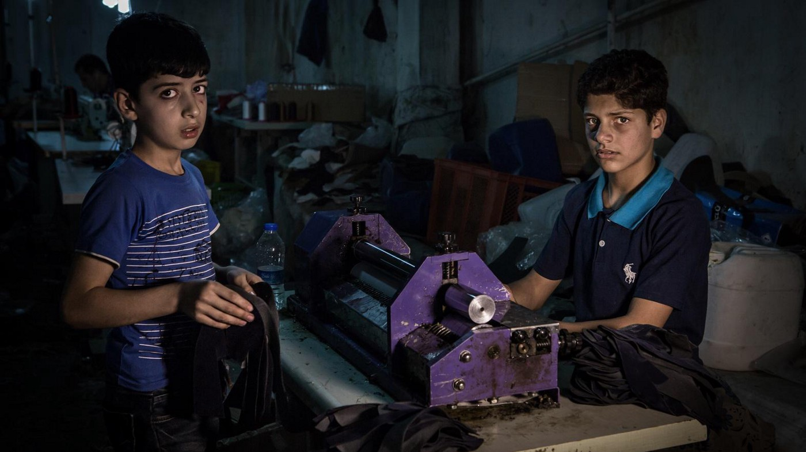
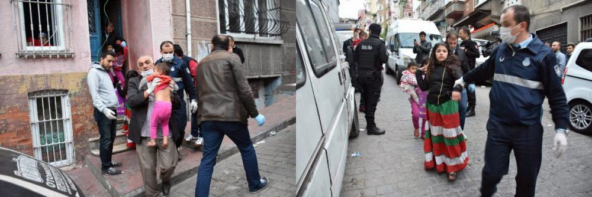
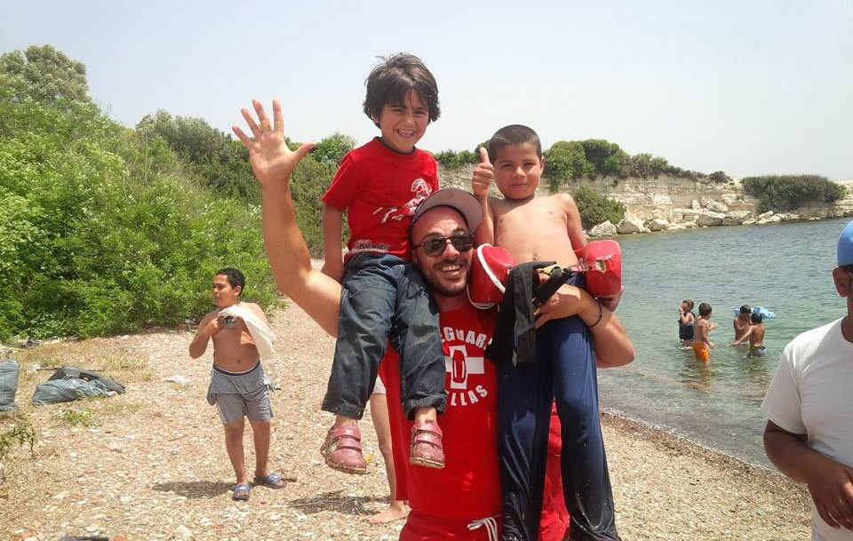
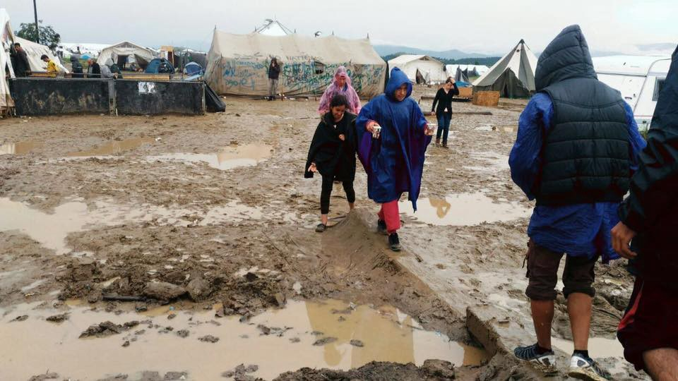
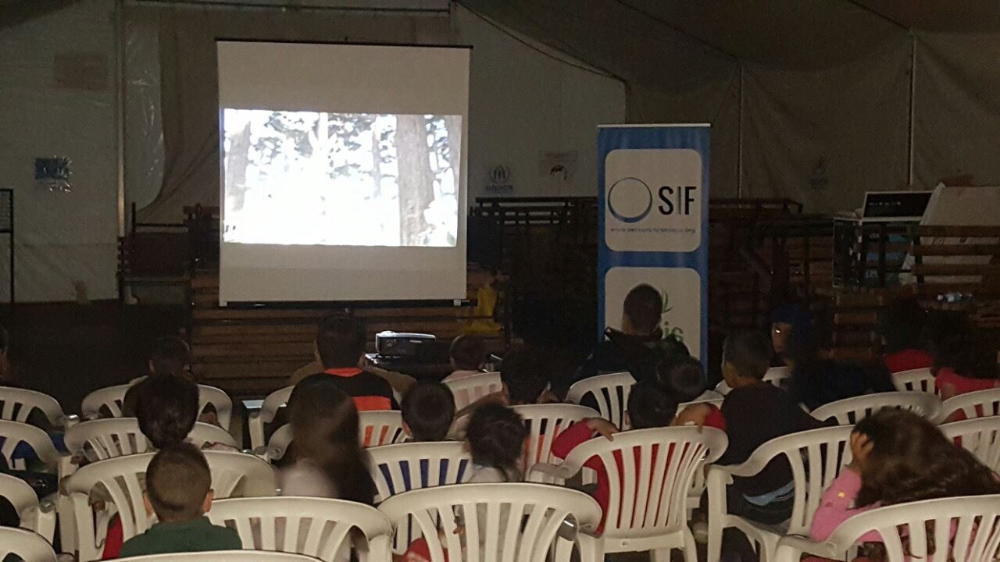

### AYS DAILY DIGEST 21\.5\.2016
#### Turkey is sending away poor and sick refugees but keeping well educated ones; children are being forced to work in factories\. Refugee families evicted from their homes in Istanbul ahead of World Humanitarian Summit\. Translators and law experts still urgently needed on Chios\. Asylum seekers disappearing from Bulgaria and Macedonia in huge numbers\. Refugees dying in desperate attempts to reach UK\. After getting the asylum in England, 80% of them end up being homeless\.

Morad \(11\) and Hassan \(14\), both from Aleppo, forced to work in Turkish factories to support their refugee families; PHOTO: Cigdem Yuksel for de Volkskrant
#### TURKEY
### Child labour rampant among Syrian refugees

According to the most recent data of the United Nations refugee organisation UNHCR, 325,000 Syrian children currently attend school in Turkey\. That is roughly one third of the Syrian population in Turkey of that age group\. The hundreds of thousands of children who do not attend school are often unable to do so because they have to work\.

Human Rights Watch has confirmed that child labour is ‘rampant’ among Syrian refugees, but there are no exact figures\.

> Almost all Syrians that I spoke to either had their own children working or knew of underage family members doing the same — said Stephanie Gee, a refugee program fellow at Human Rights Watch, for de Volkskrant 

In all seven factories in the textile and shoe industry visited by [de Volkskrant](http://www.volkskrant.nl/economie/syrian-children-refugees-are-put-to-work-en-masse-in-turkish-factories~a4304700/) in the east Turkish city of Gaziantep last week, children were at work\. Families in Gaziantep say that they need the extra income from their children, if only because the rents in the city keep rising with the influx of refugees: this city, with a population of 1\.5 million, has seen half a million Syrians arrive over the past few years\. According to UNICEF, before the war 99 per cent of Syrian children finished primary education and 80 per cent of them received some form of secondary education\. Child labour was not at all common in Syria\.
### Refugee families evicted from Istanbul city centre ahead of World Humanitarian Summit

Turkish volunteer initiatives and NGO’s held a press conference today, warning about cases of refugee families being evicted from their homes in Instanbul\. Refugee families, often with small children, are being forcibly taken away by police and put in refugee camps without a prior warning\.

> We have often witnessed refugees being taken from the city centers against their will to be placed in refugee camps\. It is remarkable that these efforts of “sterilising” poor refugees from city centres and “cleaning the city image” coincide with the World Humanitarian Summit that will be held in Istanbul on the 23rd and 24th of May — says the statement sighed by 16 Turkish volunteer initiatives and NGO’s 

Eviction of Syrian families from Tarlabaşı neighbourhood on 10th of May: PHOTO: Ülkücü Medya

One such incident occured on 10th of May, Tuesday at 6\.00 in the morning, when police and city police raided the homes of four Syrian families in Tarlabaşı \(a neighbourhood in the Beyoğlu district in Istanbul\), taking families with children and babies in microbuses with tinted windows\. One day later, volunteers learned that they were sent to a camp in Osmaniye\.
### Ankara banning highly\-skilled refugees from going to EU, sends away uneducated people

German media [has reported](http://www.dw.com/en/turkey-refuses-eu-travel-to-highly-skilled-syrian-refugees-report/a-19274693?maca=en-rss-en-all-1573-rdf) that Ankara is banning Syrian academics from leaving Turkey, while sending mostly uneducated, sick and poor people to EU countries\. According to information from Germany, the Netherlands and Luxembourg, Turkish authorities have repeatedly withdrawn permits which had already been granted, because the refugees had been found to be well\-trained engineers, doctors or skilled workers\. Top EU officials have expressed anger at Turkey’s selective approach to sending Syrian refugees to Europe, according to Spiegel magazine\. They insist that most refugees coming from Turkey under the “one in, one out” deal are people with severe illnesses and a low educational background, stressing that it is Turkish officials who are exclusively in charge of selecting candidates for leaving for the EU\.

Presenting the EU\-Turkey deal two months ago: Did they really think it was going to work? PHOTO: New Europe

This all happens under the controversial EU\-Turkey deal which is condemned by many individuals and NGO’s, including AYS, for being profoundly inhumane and degrading to the refugees, but also ineffective in tackling the crisis\. This time we also want to condemn EU response to Turkish selective approach to their ping\-pong deal\. Saving lives of underpriviledged people seems to be of less interest then attracting highly educated refugees for both sides, and this debate is just exposing their hypocrisy\.
#### GREECE

23 **people were returned to Turkey** from the Greek island of Lesvos by boat on Friday, in the fourth such readmission this spring under the EU\-Turkey deal to cope with the refugee crisis, local authorities announced\. The refugees hadn’t expressed any asylum will, according to the Greek police\. They are from Afghanistan, Iraq, Iran, Algeria and Morocco\. Before Friday’s action, they were in camps on the islands of Lesvos, Samos and Chios\.
### Translators, lawyers urgently needed on Chios

Situation on the overcrowded island is still very bad due to mistreatment of the refugees and significant lack of relevant information about their legal possibilities\. In order to tackle this, Kurdish, Farsi, Arabic and Dari translators are urgently needed, as well as migration law experts\. Kurdish interpreters and legal experts should contact [Gabrielle Tan of Action from Switzerland directly](https://www.facebook.com/gabrielle.tan?fref=ts) , while Farsi, Arabic and Dari translators are invited to contact [Chios Eastern Shore Response Team](https://www.facebook.com/chiosesrt/?fref=ts) \. If you are willing to sponsor a skilled translator or legal volunteer, feel free to contact Gabrielle or CESRT as well\.
### Little refugees of Lesvos learning to swim, equipment needed for swimming lessons

Kids learning how to swim with Lifeguard Hellas Save & Rescue Team; PHOTO: Bikof Mania\-Maria

Lifeguard Hellas Save & Rescue Team is running the “Swim safe — love the sea” project in Kara Tepe for the 300 kids that stay there\. They need children’s swimming suits and props, but also volunteers who would support them in their learning process\. You don’t have to be a lifeguard, but you need to be a good swimmer and good with kids, having in mind they have experienced severe trauma recently\. Accommodation and logistics is provided by [the team](https://www.facebook.com/lifeguardhellas/) \.
### Heavy rain bringing more misery to the North

Refugees in Northern Greece are heavily affected by the rain that has been pouring since yesterday\. Conditions are especially bad in the makeshift camp in Idomeni, where 9,007 refugees are still residing, many sleeping in tents that are not suited for heavy rain and low temperatures\.

Idomeni is covered in mud once again after heavy rain that pored since yesterday; PHOTO: Refugees\.tv
#### BULGARIA
### Refugees disappearing in huge numbers

So far, 5305 applications for asylum were submitted in Bulgaria until April 2016\. But nearly 3/4 of the procedures are being cancelled at the moment, because the refugees continuously disappear, according to [Bordermonitoring Bulgaria](http://bulgaria.bordermonitoring.eu/2016/05/21/bulgaria-still-going-to-be-a-poor-guardian-of-europeans-external-borders/) \. The quota\-system of relocation from other European countries on which the country agreed, foresees that Bulgaria has to host 1\.200 asylum seekers under such regulation\. Until now, Bulgaria took four refugees via the relocation system, but [one of them has already escaped to Western Europe](http://www.novinite.com/articles/174512/FT:+Asylum+Seekers+Refuse+Relocation+to+Bulgaria,+Romania) \.
#### MACEDONIA
### Only 300 refugees still left in camps

With many people seeking unofficial ways to continue their trip towards western EU countries, the number of refugees is decreasing in both Gevgelija and Tabanovce camps\. There are around 300 refugees left in Macedonia, out of 1,400 that were stuck there after the border closure\. Legis is one of the teams providing constant support to the refugees\. Today they have distributed a lot of warm tea to fight the rain and cold\. Days seem to be very slow for the refugees who are still stuck in Macedonia\. Once full tents are now being transformed into small sports arenas and makeshift cinemas to fight boredom\.

Children watching cartoons in a makeshift cinema in Tabanovce camp; PHOTO: Legis
#### ITALY
### Only one Sicilian hotspot working properly, fears of mafia infiltration rising

Delegation of the parliamentary committee for the refugees has visited the hotspot of Milo in the province of Trapani, Sicily, witnessing the boat landing of 435 refugees \(143 of them minors\) from the MSF ship Dignity\. Trapani was singled out as a good example of NGO’s and authorities working together to ensure fast transfer of the new arrivals, as opposed to other two Sicilian hotspots Lampedusa and Pozzallo where refugees are detained for longer periods of time, waiting for their placement in reception centers\.

> Hotspots must remain centers of identification and not turn into detention centers\. Otherwise we won’t be able to absorb the flow of migrants which is expected to increase in the coming months — said Federico Gelli of Democratic party after visiting Trapani today 

The delegation also warned about the possibility of mafia infiltration in the hotspots, which could lead to further endangering refugees\.
#### FRANCE
### Refugees dying in attempts to reach UK

In what they say is the first ever quantitative survey at a refugee camp in Europe, MSF found that 82 per cent of Calais’ 6,000 refugees are still aiming to reach Britain\. Many have been run over, hit by trains and drowned in desperate attempts to swim to England but those in the Jungle camp of Calais remain determined to make the journey\.

> They said ‘look how we are living here, we are like animals\. They all know someone who has been able to reach the UK so they still have hope\. They know it’s tough but it’s possible\. It’s nothing compared to what they have already been through — said Jihane Ben Farhat of MSF to [Independent](http://www.independent.co.uk/news/uk/home-news/calais-crisis-first-ever-quantitative-survey-in-the-jungle-reveals-thousands-of-refugees-still-a7041541.html) 

#### FRANCE/UK
### Refugees evicted from state accommodation after getting the asylum, end up homeless

A new report has been [published the British Refugee Council](http://www.refugeecouncil.org.uk/assets/0003/7935/England_s_Forgotten_Refugees_final.pdf) on the risks of homelessness and destitution faced by refugees who are granted asylum in the United Kingdom\. The Refugee Council’s research has namely found that when their asylum claim is granted, refugees are given just 4 weeks to secure an income and somewhere to live before the Government evicts them from their asylum accommodation\. Newly granted refugees can apply for a one\-off loan to help with integration, but Government admits it has ‘no target’ for processing these loans — though it ‘aspires’ to do so in 6 weeks — 2 weeks longer than refugees have before eviction\. This results in many refugees becoming homeless and destitute\. 81 of 100 of the new refugees surveyed by the Refugee Council were homeless or about to be when they came to us\. Newly recognised refugees are being forced to rely on food banks, charities or friends for access to food, money and accommodation\. They estimate that these problems could have affected 9,768 refugees last year alone\.

_Converted [Medium Post](https://areyousyrious.medium.com/ays-digest-21-5-turkey-sending-away-poor-and-sick-refugees-but-keeping-well-educated-ones-164cb7a0751f) by [ZMediumToMarkdown](https://github.com/ZhgChgLi/ZMediumToMarkdown)._
