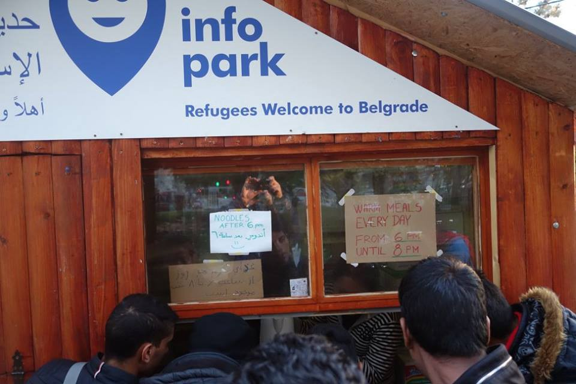
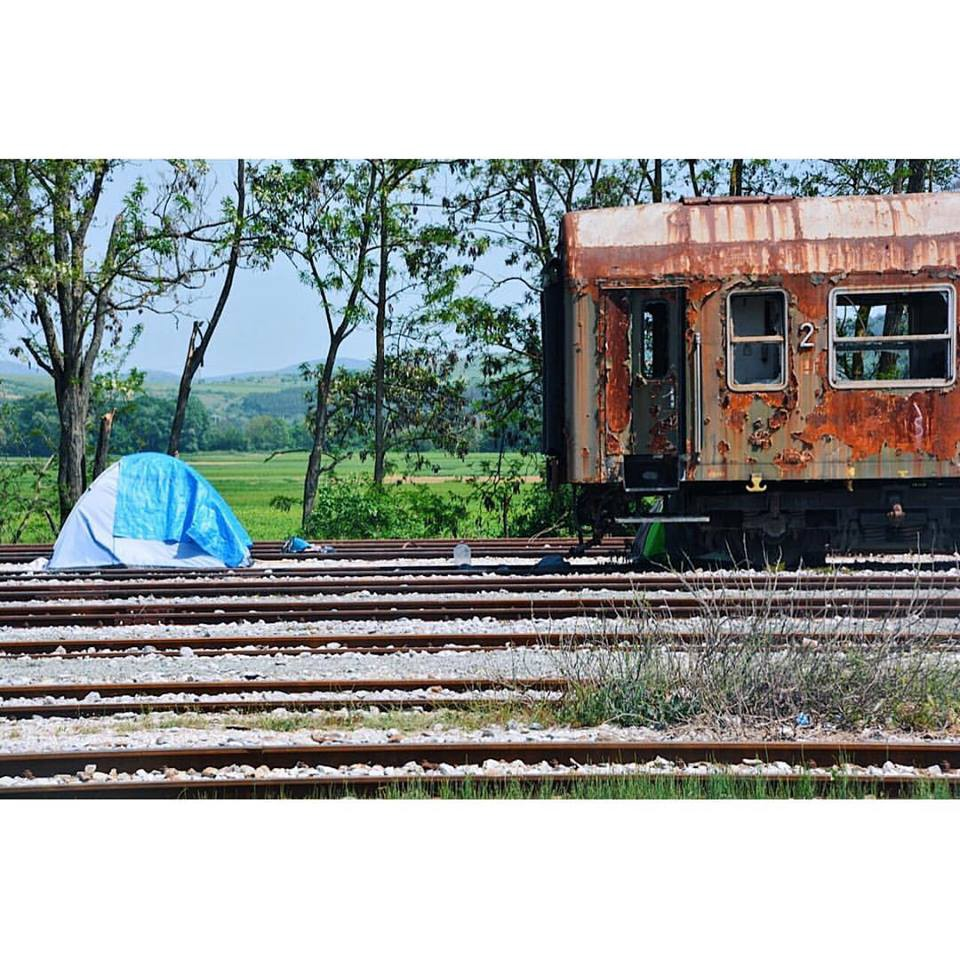
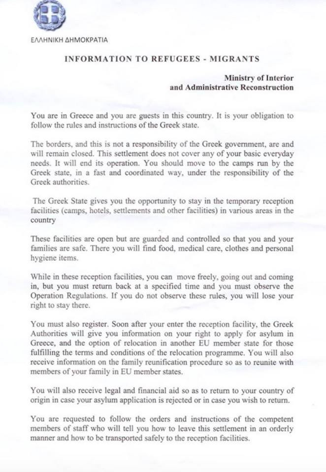
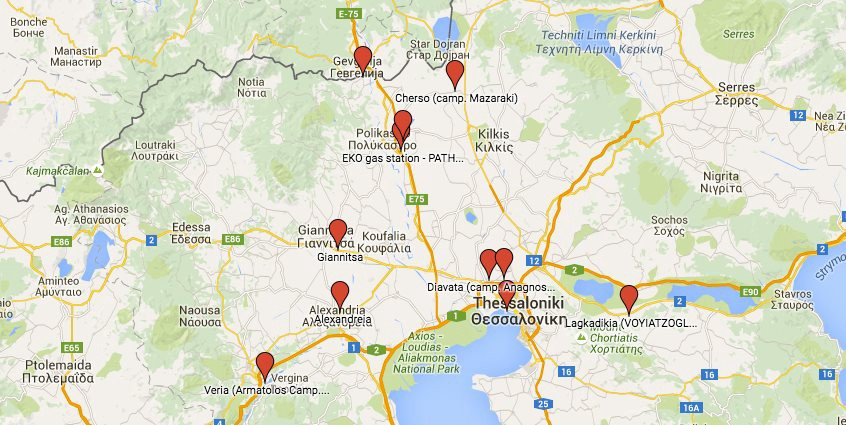
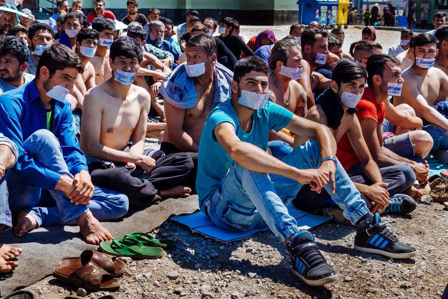

### AYS Daily News Digest — Idomeni evacuation
#### 23\.5\.2016: Final eviction from the Idomeni camp is scheduled to start Tuesday morning\. New attacks in Syria while Ban Ki\-moon opens the World Humanitarian Summit believing that they are there “to shape the future”\. Turkey threatening to stop any future deal with the EU\. Hunger strike continues in Chios\. Number of refugees in Belgrade is rising and are now highest since the beginning of this year\. Help is needed\. Austria did not elect the right\-wing president, even though he lost by a small margin\. Italy and Austria once again disputing the number of refugees crossing their mutual border\. USA receives 499 refugees\.

Volunteers distributing meals at Info Park, Belgrade\. Photo credit: Info Park
### Idomeni Evacuation

Photo Credit: Aida Kristina Ničija

**When and how will it take place**

Several newspapers report that the Greek government’s plan is to empty Idomeni within three to ten days, starting tomorrow \(Tuesday, May 24th\) \.

In a statement today, government spokesman George Kiritsis said that the new accommodations for those staying in Idomeni is now ready and they will force people to relocate there starting Tuesday or Wednesday\. The new camps are able to house around 6,000 people but more than 8,000 refugees are believed to be in Idomeni at the moment\. More places are promised to open up as the action proceeds\. Reports say that large numbers of riot police have assembled to handle the eviction, but Kiritsis insisted force will not be used\.

Several weeks ago, the government said during a meeting with volunteers that all people will be relocated from Idomeni by May 31st, adding that relocation would be voluntarily, while the UNHCR was told that relocation would be done by the 15th of June\.

Leaflet distributed several weeks ago

While independent volunteers and official organizations have been able to help these last couple of days, there has been an increase in controls by the police and intermittent access for both NGO and independent volunteers as part of a strategy to “clean up” the border area\. The number of organizations with access to the camp has been considerably reduced, while independent volunteers are not allowed in any more\. Journalists have reportedly been ordered to leave the camp\. Volunteers also report that some refugees have been leaving the camp on their own, while others are resolved to remain\. The feeling over the last week has been that the quality of life is being reduced on purpose, in order to pressure refugees and volunteers to leave on their own\.

**What are the options for asylum seekers?**

The Alternate Minister of Immigration Policy Ioannis Mouzalas has previously promised that people whose papers have expired will get new ones only after relocation to official camps\. He clarified that “the papers that these people there were given, to a proportion of about 70%, have expired\. In other words, their papers are no longer valid\. We say that if they come to the camps, their papers will be automatically renewed\. The difference is that we are not threatening; we are offering a prospect of legality”\.

Most of the new “facilities” are located in the surrounding areas of Kilkis, Giannitsa and Thessaloniki\. From there they will have access to a pre\-registration service program, involving EASO and UNHCR\. Some of the facilities include warehouses such as the Oreokastro camp, and also hotels in the Thessaloniki region\.

Map with current camps in the Thessaloniki region

The Greek Asylum Service is responsible for providing opportunities for pre\-registration to refugees on the mainland of Greece\. They are being assisted by UNHCR and EASO\. The Asylum Service has assembled two mobile teams of 80 workers each to travel to camps across the mainland to conduct pre\-registration\. It will take between two to three months for all camps on the mainland to go through pre\-registration, with the two mobile teams traveling around the country\. The Asylum Service has said that pre\-registration via Skype calls will continue to be available during pre\-registration\. It has been stressed that all camps will be served, so there is no advantage in going to other camps than the one where people already reside\.

If you are looking to volunteer outside of Idomeni, volunteers are still needed throughout the region and rest of the country\. While volunteers are naturally anxious about what the future holds, some have already adapted and many organizations are already present in some of the new camps\. You can always find out about volunteer needs in the [Volunteer Digest](https://docs.google.com/spreadsheets/d/10KILcdjelREj2pusx9pAeabm6vjfEXtVsHCrXVs4cm0/edit#gid=0) \.
#### GENERAL
### **World Humanitarian Summit opened in Istanbul**

“We are here to shape a different future,” said Ban Ki\-moon in his opening address at the start of the World Humanitarian Summit\. We worry about the future they will envision as refugees are evicted from neighborhoods in Istanbul in order to host this Summit\. While they drink and dine, more sinking boats full of people are trying to reach European shores, with 417 people narrowly rescued from drowning as MSF reported\. Also today, prime Minister Alexis Tsipras held brief talks with German Chancellor Angela Merkel at the sidelines of the conference where the two discussed the refugee crisis\. We are not holding our breath\.
#### SYRIA
### **Attacks in Syria with civilian casualties**

Several attacks reported in Tartrous \(car bombs\) and Jableh \(rockets\) have caused casualties of over 100\. The attack in Tartrous happened in a bus station with majority of victims being civilians\.
#### TURKEY
### **Turkey threatening to block any deals with the EU**

Even though Turkish president is asking for more help with almost 3 million refugees in Turkey and with reports on severe human rights violations in Turkey and with Europe fearing refugees more than child labour, Turkey could suspend all of its agreements with the European Union, including a customs union, if the bloc continues its “double standards” in talks with Ankara, an adviser to President Tayyip Erdogan said on Monday\.
#### GREECE
### **50 new arrivals on Greek islands**

There are 54,195 people still stuck in Greece with 50 new arrivals, 35 in Lesvos and 15 in Samos\.
### **7th day of hunger strike in Souda camp in Chios**

Hunger strike in Souda camp\. Photo credit: greekreporter\.com

Fifty people still stuck in \#Souda camp in \#Chios island are continuing their already seven day long hunger strike\. Two hunger strikers have had to receive medical attention so far\. The hunger strikers are demanding clarification about their future after the implementation of the EU–Turkey agreement, the implementation of the international regulations for protection, and the relocation program to Europe and North America\. In addition, they request a speed\-up of the evaluation procedure for asylum requests\.
### **Thousands of children without the opportunity to go to school for over a year**

As we have already reported registration and asylum processes are supposed to be sped up soon, starting at the end of May\. These announcements with no clear operational plan in sight are not really helpful to the thousands of children stranded in Greece where, as Save the Children reports, child refugees have been out of school for an average of 1\.5 years, and many of them “cannot even hold a pencil”\. Syrian child refugees have been away from the classroom for the longest — with an average of over two years \(25\.8 months\) out of the classroom\. Afghan child refugees have been out of school for an average of 10\.7 months\.
### **Detention of those willing to go back to Turkey**

While people are waiting for yet another “solution”, volunteers are reporting that around 8 men from Algeria are being held in detention in \#Moria camp in Lesvos\. They have been held for over a month even though they’ve expressed a clear wish to be returned to Turkey\.
### **Preparations for final evictions from Idomeni camp**

With all this, the biggest new development in the mainland is an attempt to empty out the informal camp in Idomeni and move people to another facility near Thessaloniki\. Those that wanted to go voluntarily have been transferred, but there are still over 8000 people staying near the border with Macedonia hoping that the situation is going to change\. People are scared, as we have reported, to be sent to camps where they will be forgotten\. There are no real assurances that conditions in other places will be better than Idomeni\. As Moving Europe reports, in the hope of avoiding clashes with those who do not want to move, the government has employed somewhat dubious tactics — they have turned down the water supply and slowed the distribution of food hoping that such a situation will force people to accept relocation to other camps\.

There are reports that another tactic will be employed also — dividing the camp into sectors so as to gradually move smaller groups of people\.

MSF has issued a statement that they do not oppose dissolving Idomeni camp only if people go voluntarily and are placed in better conditions than those they are living in currently\.

As for further information on evictions, as Spiegel online reports, volunteers and NGOs will be banned from the camp in Idomeni starting tonight \(Monday\) \. We will report what we can tomorrow\.
### **No work for refugees in Greece**

Further more, News That Moves has published basic information about labor rights for asylum seekers in Greece\. In Greece, recognized refugees, asylum seekers and persons who have been granted subsidiary protection have the right to work under the conditions set by Greek law, with the same social rights and obligations regarding social security as Greek citizens and they can be issued a work permit immediately, but only if “there are no unemployed nationals, EU citizens, refugees or legally resident third country nationals who are interested to work in a relevant specialty for which the work permit has been submitted\.” As the country with the highest unemployment rate in EU, chances of getting a job in Greece are very slim\.
#### BULGARIA

**Borisov playing into the myth of a gatekeeper of all that is European with David Cameron generously helping him**

In a right wing European frenzy, Bulgarian prime minister Borisov said today that “Bulgaria protects the European Union’s external border as efficiently as if it were member of the EU’s free\-travel Schengen Zone\. Borisov highlighted the importance of the readmission agreement with Turkey and thanked British Prime Minister David Cameron for the donation of 40 SUVs to Bulgarian Border Police for patrolling the border\.
#### SERBIA
### **High number of refugees in Belgrade**

Info Park reports that “People are arriving and the numbers are steadily rising in Belgrade\. Most of the new arrivals are from Eidomeni, practically all assisted or organized by smugglers for sums starting from 1000 euro per adult person and more\. To illustrate the rising numbers: in the hotel Bristol park area alone, Info Park and associated organizations distributed 818 meals this Saturday, and more than 1500 for the weekend in total\! These are tremendous numbers, by far the highest in 2016, and they show how close we are to the situation last summer\. Right now, there are no doubts that Belgrade is the main refugee transit spot in Serbia with an estimated 600 to 800 people at any given time\. Our friends from Praxis/NRC reported 627 refugees leaving Belgrade for Subotica over the weekend\. In the park we have Miksaliste, Refugee Aid Serbia, Asylum Info Center, APC, Praxis/NRC, NSHC/Terre des Hommes/CARE, HCIT, Evangelist Church, MSF, MdM, RMF and many others \(apologies to those we omitted\) who are on duty to ensure that no human being is left without support while in Belgrade\. This is a great informal coalition of the humanitarians, professionals, or simply people of good will, who are working to protect and help all of the people in need who are once again on the move in our city\.” Due to high numbers of people arriving, the Info Park team said that help is always needed\.
#### AUSTRIA
### **No country for right wing president**

Austria came within a hair’s breadth of having its first far\-right head of state in the post\-war era\. Austria’s Interior Minister Wolfgang Sobotka announced that right\-wing Freedom Party candidate Norbert Hofer has lost the second round run\-off election to Alexander van der Bellen after more than 700,000 absentee ballots were tabulated\. This is shallow consolation for those concerned about the rise of far\-right policy in Austria, given that the margin of victory was 31,000 votes out of more than 4\.6 million ballots cast\. Van der Bellen won 50\.3 percent, yet again proving the deep divide growing in Europe\. In his concession speech, Hofer said Austria’s far\-right would “live to fight another day”\.
#### ITALY
### **New disputes over Austro — Italian border**

Austrian authorities have reported that 40–50 migrants attempt to cross Brennero daily while Italy pegs the estimate at 2–3 people per day\. Austria speaks about an “invasion”, while Italian PM Matteo Renzi accuses Vienna of “demagogy” and “lies”\. Governor of Tirol Günther Platter has just deployed other 80 Austrian police on the border, to stop the migrants from crossing it; he declared that this decision was taken since “Italy has made deceiving moves to avoid Austrian controls”\. He referred to the agreement between Ministers of the Interior Alfano and Sobotka, which blocked the construction of a barrier at the border\. With his statement, Platter brought this issue to the fore once again in an election season\. He added that he really cares about the efficacy of the controls at the south part of the border\.
#### USA
### **499 Syrian refugees arriving to USA**

The Obama administration has admitted 499 Syrian refugees so far this month totaling 2,235 Syrian refugees resettled in the United States since October\.

_Converted [Medium Post](https://areyousyrious.medium.com/ays-daily-news-digest-23-5-2016-9fe8c024961e) by [ZMediumToMarkdown](https://github.com/ZhgChgLi/ZMediumToMarkdown)._
