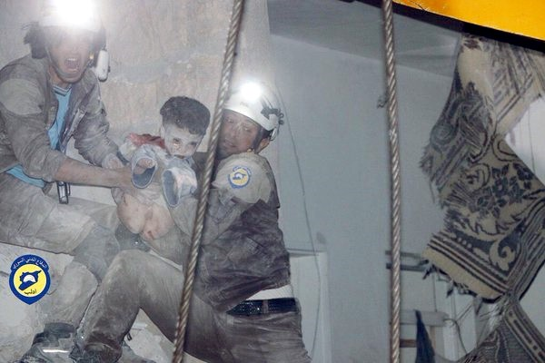
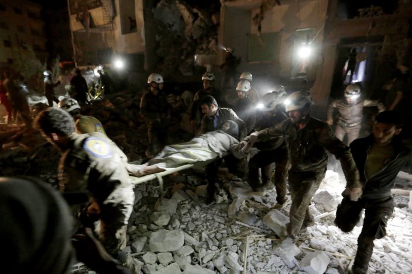
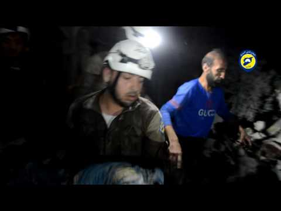

### AYS: Civilians, children killed in Idlib hospital
#### At least 23 people, 60 according to some sources, are dead following the airstrikes\. Around 250 injured, death toll expected to rise\. Russia claims no responsibility for the attacks\.

White helmets rescuing an injured boy from the ruins of Idlib hospital

Allegedly Russian warplanes stormed a rebel held city in north\-west Syria before dawn on Tuesday, in what people on the ground describe as the deadliest of the recent attacks\. At least 23 civilians, including 7 children, were killed in “no less than 10 Russian airstrikes” which targeted the national hospital area in Idlib city, al\-Mutanabi and al\-Baitara turnings, and al\-Jalaa park, according to Syrian Observatory for Human Rights\. The Turkish foreign ministry claims the strikes had killed more than 60 civilians in what they call “indefensible crimes of the Russian and Syrian governments”\. With around 250 injured and many still missing, the number of the dead is likely to rise\.

Evacuation of injured woman from the hospital in Idlib

Different sources from the ground are describing planes that attacked the hospital as Russian, but Russia is denying involvement:

> “Russian planes did not carry out any combat missions, to say nothing of any air strikes, in the province of Idlib,” Igor Konashenkov, a Russian Defence Ministry spokesman, said in a statement following reports from the ground\. 

According to the first reports from the ground, “half of the hospital” is destroyed by the blast\. Amateur photos taken by people on site show dead children and dozens of heavily injured civilians who were treated in the hospital at the time of attack\. First videos of rescue efforts are also emerging\.

As of December 2015, 57% of public hospitals and 51% of public health centers in Syria are either partially functioning or closed down, according to the World Health Organization\. AYS has previously reported about several incidents involving direct attacks on Syrian hospitals, including the attack MSF\-supported Al Quds hospital in the northern Syrian city of Aleppo in the late April, when at least 14 patients and two doctors were killed\.

_Converted [Medium Post](https://areyousyrious.medium.com/ays-civilians-children-killed-in-idlib-hospital-1c77ce714985) by [ZMediumToMarkdown](https://github.com/ZhgChgLi/ZMediumToMarkdown)._
