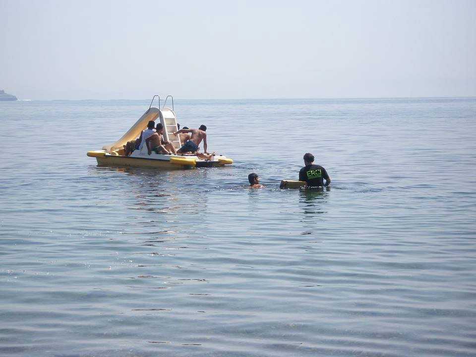
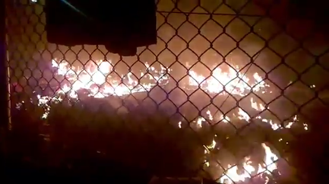
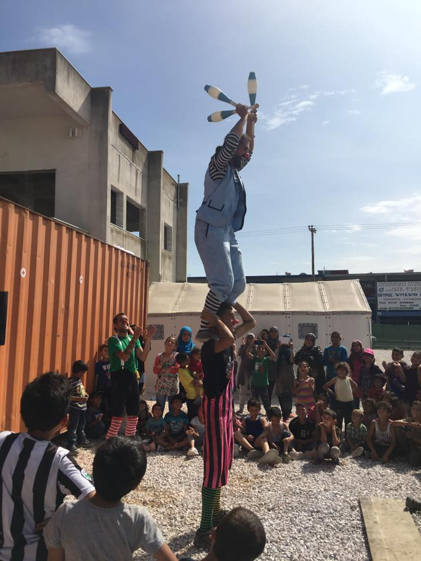
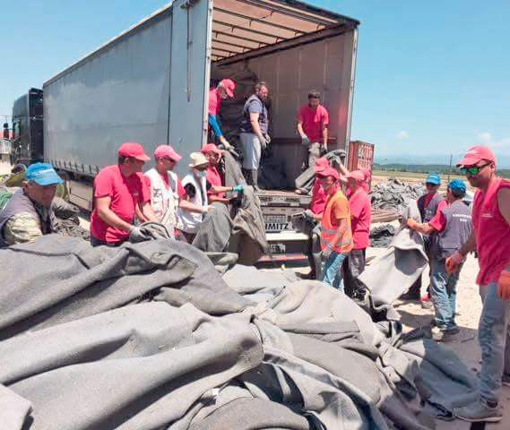

### AYS News Digest: Moria burning\.
#### Syria’s besieged Daraya gets first aid since 2012, but no food\. Alert Phone reports on shift in refugees’ routes after the EU\-Turkey deal\. Greek appellate court halts deportation of three Syrians, ruling Turkey ‘unsafe’\. Hundreds of refugees wait at Serbian border with Hungary\.

The fifth excursion for unaccompanied minor refugees allowed them a few hours of freedom outside Moria’s fences\. Thanks to ERCI rescuers, they swam and played in the calm, wonderful sea\. Photo Credit: Christina Chatzidaki
### Fire reported inside Moria

People at Moria report serious violence and an ongoing fire inside the camp\.

Photo Credit: Will Horner

This comes as [News that Moves](https://newsthatmoves.org/en/mounting-frustration-among-refugees-in-lesvos/) says refugees in Lesvos are getting frustrated by the lack of reliable information and legal assistance in both Kara Tepe and Moria, adding they have no idea how long they will be kept there\. Many are unable to leave the Moria hotspot and one Afghan woman comments “we are kept here like animals in cages\. I always have migraines and I feel like killing myself\.”
#### Afghanistan
### 10 people killed by Taliban militants

10 people were killed after Taliban militants kidnapped more than 185 bus passengers near the city of Kunduz in northern Afghanistan\. Residents told the AFP that the militants were holding passengers in a local mosque, inspecting documents and questioning them for any government links\. These news are important to cover, as Afghans are often seen as ‘opportunists’, while their legitimate claims to asylum are disregarded\.
#### Syria
### Syria’s besieged Daraya gets its first aid since 2012, but no food

[Reuters](http://www.reuters.com/article/mideast-crisis-syria-ceasefire-idUSL8N18T2W3) says the first U\.N convoy since 2012 arrived in Daraya, thanks to a 48\-hour local ceasefire\. British Foreign Secretary Philip Hammond said Syria’s government had “cynically allowed limited amounts of aid” into the two besieged areas and said air drops “are now the last resort to relieve human suffering across many besieged areas”\. The government did not allow food for the first delivery, but another convoy with food is planned for Friday\.
#### Greece
### Alarm Phone reports on changing escape routes and Europe’s inaction

For the first time in months, Syrians and Iraqis are now among those trying to cross from North Africa to Italy\. The [Alarm Phone report](http://alarmphone.org/fr/2016/05/29/weekly-reports-changing-escape-routes-alarm-phone-experiences-in-the-mediterranean-sea-2/?post_type_release_type=post) states that ‘border violence has merely been displaced’ as Turkey stops people from escaping Syria and going to Greece, forcing refugees to try the perilous journey from Libya to Italy\. More than 13,000 people arrived in the last week alone, and at least 1,100 died in May\. The media have ignored most of these tragedies, only reporting on shipwrecks when several hundred people drown\. Meanwhile, European governments expand military operations that focus on stopping smugglers instead of using these assets for rescue operations\.
### Greek appellate court halts deportation of three Syrians, ruling Turkey ‘unsafe’

Lawyers of the Pro Asyl project “RSPA” represented nine asylum\-seekers in this case, with Pro Asyl saying the deportation was stopped despite pressure from the European Commission and the Greek Ministry of Immigration\. In earlier news, the Dutch broadcaster NOS, had published an [interview](http://nos.nl/nieuwsuur/artikel/2107585-greek-appeals-committee-turkey-not-safe-for-syrians.html) with the Greek Minister of Immigration Policy Mouzalas, where he stated that in four of five cases, the court halted deportations, adding that “this could put Greece in a very difficult situation\.”

Clowns at the Softex Camp near Thessaloniki\. Photo Credit: Chloe Kousoula

**113 mostly Afghan refugees land in Creta**

[Ekathimerini](http://www.ekathimerini.com/209212/article/ekathimerini/news/over-100-migrants-land-on-crete-island) reports that the refugees said they had set off from Antalya, on Turkey’s southwestern coast\. Greek coastguards believe that more boats could be blown off course and land on the island, despite trying to reach Italy from Libya\. A separate group of 64 migrants and refugees, including 17 children, landed on Crete last Friday\.
### Andravida camp needs volunteers

Andravida needs help from three or four experienced volunteers and a few others\. Three volunteers are currently helping and the community is organizing itself, but they need some help for food and organizing activities\. Many people rely on catering and would like to cook if provided with basic ingredients\. Volunteers are therefore needed to check and identify needs around the camp and source them via donations, among other things\. Sports activities and other ideas are welcomed\. You can contact Nadia Baltazzi on Facebook for more details\.
### Volunteers’ Digest

Meanwhile, a lot of organizations are still looking for volunteers all around Greece\. You can check out the list [here](https://docs.google.com/spreadsheets/d/10KILcdjelREj2pusx9pAeabm6vjfEXtVsHCrXVs4cm0/edit#gid=0) \.
### Donations needed in Athens

Squats in Athens needs:
1. Multivitamins for pregnancy
2. Antibiotics for UTI’s and chest infections
3. Calamine lotion for chicken pox,
4. Condoms,
5. Co\-codamol or similar mixes,
6. Iron tablets
7. Vitamins for the immune system
8. Sun protection

You can contact [Maeve Eksts](https://www.facebook.com/maeve.eksts?fref=ts) on Facebook to learn where to drop them off\.
### New Democracy leader calls for evacuation of Elliniko camp

According to [Ekhatiremini](http://www.ekathimerini.com/209207/article/ekathimerini/news/nd-leader-calls-for-evacuation-of-elliniko-migrant-camp) , New Democracy leader Kyriakos Mitsotakis has called for the evacuation of the reception center for refugees and migrants at the site of the capital’s old airport in Elliniko, saying “living conditions are unfortunately tragic, and as the summer sets in things will only get worse”\.

**10,000 used UN blankets recycled by Dirty Girls of Lesvos**

The legendary [Dirty Girls of Lesvos](https://www.facebook.com/dirtygirlslesvos/) had the great idea of collecting more than 10,000 used UN blankets from Idomeni and cleaning them to hospital standards\. They will be distributed from a MSF warehouse near Thessaloniki\. Saving these blankets will help people in the government camps, create less landfill waste for Greece, and save UNHCR’s donors and taxpayers the cost of 10,000 new blankets\.

Photo Credit: Dirty Girls of Lesvos
#### Bulgaria
### Authorities prevent 215 “illegal migrants” from crossing the Bulgarian border\.

According to [Novonite](http://www.novinite.com/articles/174684/Authorities+Prevent+215+Illegal+Migrants+from+Crossing+Bulgarian+Border) , 155 tried to cross the border through Turkey while 62 tried to cross via Greece\.
#### Serbia
### Hundreds of refugees wait at Serbian border with Hungary

[News that Moves](https://newsthatmoves.org/en/hundreds-of-refugees-waiting-at-serbian-border-with-hungary/) says more than 300 refugees are waiting near the Serbian city of Subotica, at the Hungarian border\. They are camped in informal sites without toilets and electricity, near the border crossings of Röszke and Tompa and are waiting Hungarian authorities to allow them to cross into Hungary through the two open transit zones\. UNHCR Serbia spokesperson Mirjana Milenkovski says refugees prefer to stay in tents because they are afraid of ‘losing their turn’, as Hungary allows only around 30 people to enter per day\.
#### Italy
### ‘Welcome to Italy’ guide for migrants published

[The new guide](http://cds.redattoresociale.it/File/Associato/439930.pdf) has been created by the ‘Welcome to Europe’ network and includes information on fundamental rights, on how to ask for international protection, and other legal issues\. It also includes practical information, such as places to sleep, transportation prices, etc\.
### EU Commission requests information on new hotspots and increased capacity in Italy

According to [Il Sole 24 Ore](http://ilsole24ore.) , the EU Commission asserted that the pace of relocations needs to accelerate; only 1% of the 160,000 refugees that need to be relocated have actually been moved so far\.
#### Austria
### Reception center for refugees set on fire

A building in northern Austria that was due to house dozens of asylum seekers was deliberately set on fire, the Red Cross said on Wednesday\. 48 people had been due to move into the building in two weeks’ time\.
#### Germany
### German Interior Minister laments ‘sluggish’ refugee returns

Interior Minister Thomas de Maiziere says more police officers will be tasked with returning migrants to home countries, adding that states have ‘’little political will to apply the residence law’, contributing to a ‘sluggish’ deportation rate\. The German government believes some 27,000 people will be deported by the end of the year, while 61,000 will leave of their free will\.

Meanwhile, [ABC News](http://abcnews.go.com/International/wireStory/syrian-refugees-return-home-stuck-germany-39522124) says hundreds of Syrian refugees want to go home because of the time it takes to bring their families to Germany\. However, while Afghan and Iraqi asylum seekers get financial support and organized plane trips to go home, the German government says it cannot send Syrians back to a war zone\.

Karim Hamed, from the blog [Blicktausch\.com](http://blicktausch.com/2016/06/01/tag-43-waldkraiburg-willkuer-und-gleichgueltigkeit/) , recently reported on the situation inside the new Waldkraiburg camp, where many refugees from the now closed Dornach camp were brought\. A Somalian refugee told him about a lack of water, food, and hygiene products, adding that there is no information on the next steps of their asylum procedure\. A Nigerian woman complained about the insecurity and lack of support from the staff, adding that security personnel are extremely aggressive\. Another woman said that there is no access to baby formula, diapers, and other hygiene products\. Most women reported on the insecurity of the camp, while many said they are running out of money\. The reception center’s director was also described said to behave aggressively\.

The [TAZ](http://www.taz.de/Fluechtlingsbabys-in-Berlin/!5305237/) says Berlin doctors count more than 400 refugee babies without birth certificates since last Autumn, which creates problems for the payment of doctors’ bills\. Often parents do not have the necessary papers or are not registered in the Berlin Regional Office for Health and Social
Affairs\. The German Institute for Human Rights published a pamphlet today which explains how refugees can register their newborn babies\. The information is available in [German](http://www.institut-fuer-menschenrechte.de/publikationen/show/so-registrieren-sie-ihr-neugeborenes-kind/) , [English](http://www.institut-fuer-menschenrechte.de/publikationen/show/how-to-register-your-newborn/) , [Arabic](http://www.institut-fuer-menschenrechte.de/publikationen/show/so-registrieren-sie-ihr-neugeborenes-kind-arabisch/) and [Farsi](http://www.institut-fuer-menschenrechte.de/publikationen/show/so-registrieren-sie-ihr-neugeborenes-kind-farsi/) \.

[A new free online course has opened for volunteers who want to teach German to refugees](https://open.sap.com/courses/than1) \. It includes downloadable learning materials and practical examples of how to design a language course\.

_Converted [Medium Post](https://areyousyrious.medium.com/ays-news-digest-moria-on-fire-ad41522a2e76) by [ZMediumToMarkdown](https://github.com/ZhgChgLi/ZMediumToMarkdown)._
