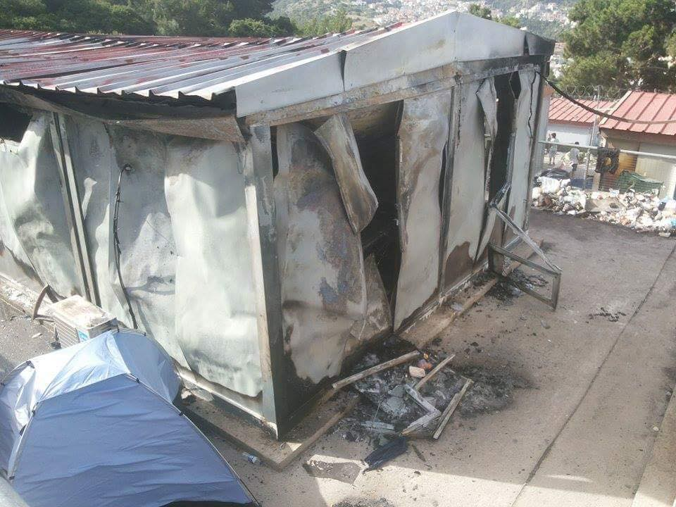

### AYS News Digest: 100\+ Cases of Abuse on EU Doorstep — Hungarian Border

The United Nations to formally request approval from the Syrian government to conduct humanitarian aid airdrops to besieged areas\. 55 and more casualties reported in and around Baghdad as four suicide bombings rocked the capital\. Confirmed death toll climbs to ten in shipwreck off Crete\. Her Highness Qatari Sheikh Moza bint Nasser met with Italian prime minister discuss ensuring educational access to refugees\. Rumors about post\-20/3/2016 Greece arrivals ineligible for relocation FALSE\. 100\+ abuse cases at the Serbian\-Hungarian border\. Swiss vote on “more fair, faster” asylum procedures\.

Sindos Refugee Camp Photo Credit: Ignacio Marin Photography
#### SYRIA
### The United Nations [to formally request approval from the Syrian government](http://www.theguardian.com/world/2016/jun/03/un-to-ask-syria-approve-airdrops-humanitarian-aid) to conduct humanitarian aid airdrops to besieged areas\.

The request came after a closed meeting of the UN security council in New York\. Although the government has said that the airdrops are unnecessary and that reports of starvation are fabricated, other reports by the UN contest this\. Approximately 400,000 people are trapped behind government forces and 200,000 are trapped by opposition forces and IS factions\.

Director of the Syrian Observatory for Human Rights [suspects US and Russian\-backed forces acting in concert](http://www.dw.com/en/syrian-troops-backed-by-us-and-russia-press-into-raqqa-province/a-19307168) in attack on the “Islamic state”\. Russian\-backed Syrian troops advanced into Raqqa province, now 80 kilometers from the provincial capital\. US\-backed SDF forces are pushing into Manbij, gaining over 100 square kilometers of territory\.
#### IRAQ

55 and more casualties reported in and around Baghdad as four suicide bombings rocked the capital\.

Targets included a police checkpoint — [killing eight and wounding fifteen](http://www.aljazeera.com/news/2016/06/iraq-bombings-kill-15-baghdad-isis-160604132507734.html) , as well as a restaurant and two markets\. The death toll currently stands at fifteen\.
### Thousands of civilians are trapped between ISIL fighters and the advancing Iraqi army in Fallujah\.

As many as 50,000 civilians are trapped in the city, with thousands of civilians attempting to escape by swimming across the Euphrates, scores having been trapped [without food and water as no humanitarian aid](http://www.telegraph.co.uk/news/2016/06/03/islamic-state-sex-slaves-rescued-from-fallujah-so-deprived-they/) has reached Fallujah since September of 2015\.

There have been many reports of escaped sex slaves from Fallujah, with some women and minors being brought from as far as Sinjar, nearly 300 miles away\.

Destruction after Samos Fires\. Photo Credit: Calais Aid
#### MEDITERRANEAN
### Death toll climbs to ten in shipwreck off Crete\.

In the aftermath of the ship that capsized off the shores of Crete on Friday, the death toll has officially [risen to ten](http://www.ekathimerini.com/209328/article/ekathimerini/news/death-toll-in-capsizing-of-smuggling-boat-rises-to-10) , with 340 survivors having been saved\. Those refugees saved are being taken to Italy, Malta, and Egypt, with the first group of over 200 [being safely delivered to Italy](http://www.stltoday.com/news/national/tanker-carries-shipwreck-survivors-to-safety-in-italy/article_287e7ef0-19e9-523d-8102-8aed11a1053b.html) by a Norwegian oil tanker\.

[NewsThatMoves reports a high wave warning](https://newsthatmoves.org/en/weather-forecast-46/) through Sunday for the Libya — Meditteranean route, with swells of up to \+2\.3 meters\. Swells over \+0\.5 meters are considered to be dangerous\.
#### ITALY
### Her Highness Qatari Sheikh Moza bint Nasser met with Italian prime minister Renzi to discuss ensuring educational access to refugees\.

Both officials acknowledged the breadth and complexity of the issue, with 121 million children being trapped away from school worldwide\. Her Highness Moza bint Nasser is president of the “Education Above All” foundation, which has offered education to 7 million children, hoping to expand its reach to 10 million by the end of the year\. This includes the target of 1 million Syrian refugee children\.

Idomeni Post\-Eviction Photo Credit: Ignacio Marin Photography
#### GREECE
### Rumors about post\-20/3/2016 arrivals ineligible for relocation FALSE\.

Volunteers report that there is a rumor going around that refugees arriving in Greece or Italy after 20/3/3016 and fulfill all other eligibility requirements are no longer eligible for relocation\. This is not the case as no legal updates have been made to bar post\-20th arrivals from relocation\. “The serious problems with the EU relocation scheme are political and procedural,” reports one volunteer, “not about legal eligibility for post\-20th arrivals…\. \[post\-20th arrivals being barred\] would require valid legislation to amend the Relocation Decision 2015\. A press statement or an opinion from an official or a politician cannot legally have that effect\.” There is concern that this rumor could inadvertently pressure refugees into “voluntarily” returning to Turkey, where they may face great harm\.

Refugees in Belgrade enjoy a Falafel Sandwich\. Photo credit: Info Park
#### SERBIA
### 100\+ cases collected by UNHCR [documenting severe abuse](https://twitter.com/iBabarBaloch/status/739088550851928064) at the Serbian\-Hungarian border\.

Allegations of an unannounced pushback hit UNHCR radar after an Iraqi mother and her children had to be rescued from a river by Hungarian police\. The mother and children were part of a larger traveling group, and one member remains missing\. UNHCR has called for further investigation into multiple reports of inhumane methods of border protection and enforcement\.

Independent, local volunteers report that around 200 refugees come to the border per day\. Although volunteers are restricted from camp access or any access within reasonable proximity, a dedicated couple work to ameliorate the suffering of refugees trapped in the backlog before they reach the camp\. A group of independent volunteers based in Serbia are re\-opening a fundraiser, previously used to provide support to Dimitrovgrad and Preševo to support these efforts\. For those who cannot provide material aid, [this fundraiser](https://www.gofundme.com/qc54ns3g) is one way to help support their efforts\. Money collected from the beginning of June to beginning of July will be specifically ear\-marked for Hungarian\-Serbian border relief\.

Supplies for Children at Hungarian\-Serbian Border\. Photo Credit: Levente Csipak
#### SWITZERLAND
### Swiss vote on “more fair, faster” asylum procedures\.

Today, Swiss voters were able to vote on [whether to speed up asylum procedures in Switzerland](http://www.swissinfo.ch/eng/speedier-process_should-asylum-procedures-once-again-be-reformed-/42200404) \. The measures, according to supporters, say that the system overhaul will make the system more fair\. Asylum requests would be decided within 140 days of being submitted compared to 400 days, and the new program would also provide free legal aid to applicants\. The cost of the new measures would amount to CHF 500 million but are predicted to save CHF 200 million per year in the long term\. Opposers to the new legislation argue that it may incentivize more asylum seekers to come to Switzerland\.

_Converted [Medium Post](https://areyousyrious.medium.com/ays-news-digest-100-cases-of-abuse-on-eu-doorstep-97512a98ec1c) by [ZMediumToMarkdown](https://github.com/ZhgChgLi/ZMediumToMarkdown)._
