### AYS SPECIAL REPORT: Desperate situation in camps around Thessaloniki

](assets/7e49d989ac9e/1*AjuafWfxgBLAplFImiqrUQ.jpeg)

Photo by [**Clément Martz**](http://www.clementmartz.com)

Relocations of refugee camps in several places around Greece are still going on\. People are relocated voluntarily at this moment, but soon everybody will have to leave\. Those who agree are moved, by buses, to different government controlled camps around the country\. However, many of these camps are lacking basics, including running water or enough space for people\. People are protesting and asking for human life conditions\. IN may of these camps access is limited, while it is often forbiden for anybody to take photos inside\.

After camp in Idomeni, Greek — Macedonian border, was relocated, a group of independent volunteers started traveling in the area of Thessaloniki, where most of government run camps are, in attempt to collecting information about the situation\. Some of the camps are “new”, others have already existed before the closure of Idomeni\. This is their report\.

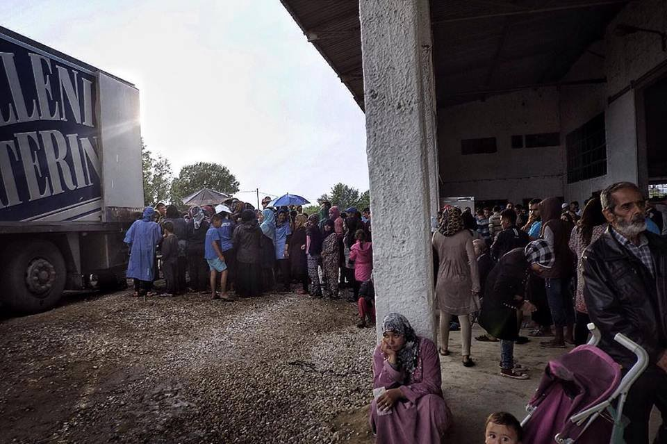

](assets/7e49d989ac9e/1*PpN_yIu54lfTBymniR9Aqw.jpeg)

[**Clément Martz**](http://www.clementmartz.com)

_It is difficult to give a unique and general overview about the situations in these camps, therefore we decided to write something about each one of them\. The situation in the new camps is changing continuously and we hope it will also get better\. These information were collected during the last week and we are aware of the fact that probably something has already changed\. We will continue monitoring the situation day by day, thanks to the help of some contacts inside the camps\._

_Overall we can say that inside the camps there are several needs, in particular: food, hygienic\-sanitary, clothes and basic necessities and information\. We are also interested in discovering how the legal assistance will proceed in regard to the international protection for the refugees\._

_We kindly ask to all those who have some information to share them with everyone\._

_Thank you\._
### _Port of Thessaloniki_

_About 340 refugees live at the port of Thessaloniki; most of them are from Iraq and Syria\. They were not in Idomeni before, but they have lived in the port since about 2 months, after spending a period in Kavala\._

_As in other camps, some people live inside of a warehouse, while others live in tents\. The police did not allow us to enter the camp, but we were able to speak with some refugees on the outside\. The information collected give us news about a positive situation in comparison to other camps\. The medical assistance is present for some hours during the day, there is enough water for all and also hot water, internet and electricity\. A Greek organization distributes food two times a day\. We have been informed that it is of a poor quality and not enough\. Some refugees have been “lucky” and they were able to have a skype appointment in an office in Thessaloniki\. They are waiting for news for the beginning of June\._
### _Syndos Frakapori_

_We were not allowed to enter the camp, therefore we collected information from some refugees on the outside of the camp\._

_It is settled in an industrial zone near Thessaloniki\. It is a real desert of abandoned warehouses\. Inside one of them a camp for 800 people with Kurdish origins have been set up\. The tents were pitched both inside and outside the hangar\. It is not allowed to use naked flames, neither burners nor gas\. The only voluntary association that operates inside the camp is MSF that is working for installing electric burners and kettles for warming the milk for kids\._

_For some days water was missing, because the cisterns are insufficient for the number of inhabitants\. The hygienic situation is totally neglected\. Sinks do not drains the water and garbage is not taken away for days, creating the perfect habitat for mosquitos and other insects\. Children are forced to play \(with nothing\) around the garbage\. There are 20 chemical toilets for 800 people\. The food is scarce and bad\. Drinking water is distributed as following: 3 liters per day for a family of 7 people\. There is no internet connection and only a few sockets\. Even the continuous complaints of refugees, police keeps making empty promises\._

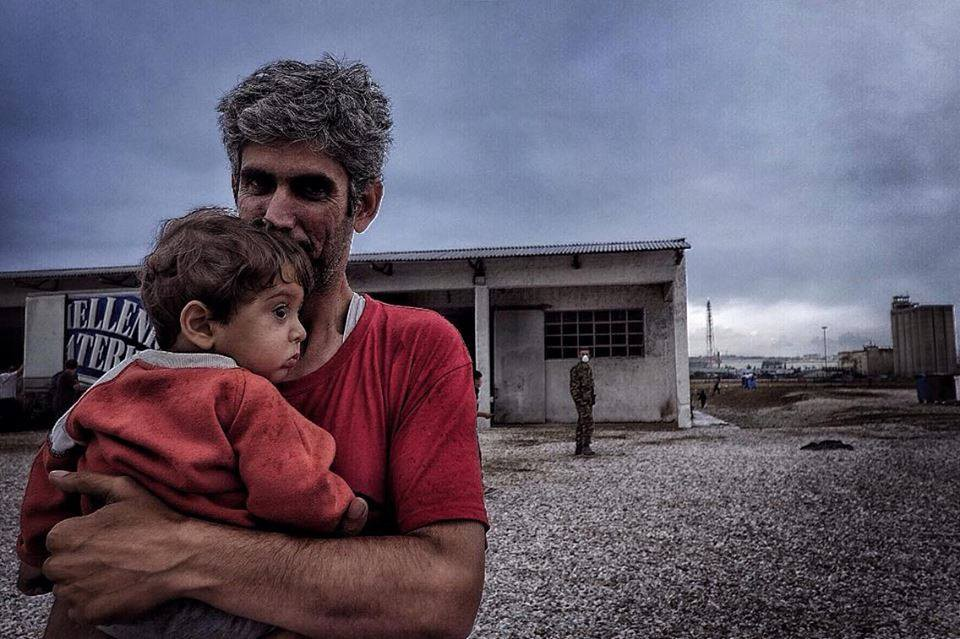

](assets/7e49d989ac9e/1*g_UgvomkjSttnF1nC9Af-Q.jpeg)

[**Clément Martz**](http://www.clementmartz.com)
### _Sindos Karamanli_

_Also the camp of Sindos karamanli is located in the industrial zone near to Thessaloniki\. The military allowed us to enter in the camp\._

_Tents are all pitched inside the hangar\. It is not possible to cook, make a fire, or use electric burners\. In the camp live 600 people, Syrians and Iraqis\. The cleaning service is managed by the refugees themselves, but they complain of a very scarce availability of water\. All the refugees we have talked with say that the food is insufficient and bad\. There is no milk for the newborn\. At the time we were there the Wi\-Fi was being installed\._
### _Oreokastro_

_We were not allowed to enter the governmental camp of Oraiokastro\. According to the refugees we met on the outside, the capacity of the camp is 1500 people\._

_However the inhabitants are 1580; and these 80 people in addition have to access to any service\. Due to the reason they are not registered, they do not receive any food, water or blankets\. Each of them only receive one bottle of water per day\. Also this camp is divided into a protected area \(hangar\) and an external one\._

_Medical assistance is provided only for some hours a day and by a unique doctor\. Water is brought in the camp with huge jerry cans, and often is not enough for everybody\. There are only a few showers and there is no division between men and women\. The Wi\-Fi is present but the connection is weak\. The electric system is insufficient\. So is the cleaning service and there are several mosquitos and snakes\._
### _Kavallari — Sintex_

_We were not able to enter this camp\. According to refugees no volunteers have entered the camp, only military and police\._

_The camp is located in a rural zone 20 km far from Thessaloniki\. The tents are pitched both inside and outside the hangar but they are insufficient, for this reason families have to be split in order to grant a place for everyone\. Through the photos we have seen a similar image to other camps: no care for hygienic conditions\. There are about 250 people in the camp, most of them are Kurdish\. There are 10 toilets and 4 showers that are superficially cleaned every 2 days\. According to the military that monitor the camp, the refugees have to care about cleaning of the toilets and the camp\._

_All the refugees we have talked with say that the food is not enough and bad\. Two times a day they receive a prepackaged sandwich and for lunch a portion of “maccheroni” that has a very unpleasant taste\. Running water does not always work, while drinking water is distributed 1 time a day: 1 liter per person\._

_The medical assistance is provided only by a military doctor that visits the camp every 2 days\. His works consists in distributing paracetamol to anybody who has a problem, even 1 year’s old kids\. Refugees report some cases of diabetes, hypotension and pregnant women\. Besides the insufficient food and the absence medical staff, the ambulances take several hours to reach the camp\._

_There is no internet connection and the sockets are insufficient\. When refugees have tried to ask the military for information the answer was: “ We cannot make promises, but maybe you will be moved to another camp in 3 months\.”_

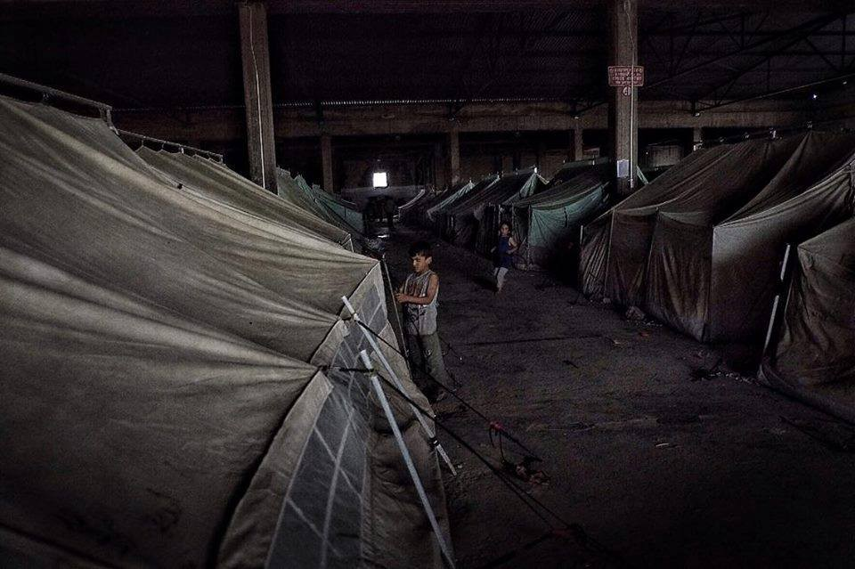

](assets/7e49d989ac9e/1*ZyWLWsnRsa9cLsug0sDqxQ.jpeg)

[**Clément Martz**](http://www.clementmartz.com)
### _Kalahori_

_The camp of Kalahori is located in the industrial zone of Thessaloniki, near to the camps of Sindos Frakapori e Karamanli\) \._

_Also in this camp some tents are inside the hangar and some others on the outside\. Some of them have no floor and they are not equipped for potential bad weather\. The camp is clean and hosts about 400 Kurdish\. Refugees reported us that water is dispensed from the morning to 1 p\.m\. We verified that there was no water in the afternoon\. In any case there were no hot water\. We were present during the distribution of dinner, which consists in a prepacked sandwich and a bag of fruits\. All the refugees we have talked with say that the food is not enough\. Save the Children has the permission to give support to children, giving them the possibility to warm milk and other food\. There are some sockets but no internet connection\. The military granted us the possibility to help them out\._
### _Softex_

_Also this camp is located in the industrial zone of Thessaloniki\. We were able to enter the camp but only for a short time and the information we have come from the refugees\._

_There are 1100 people, most of them have Arabic origins and around 40 people are Kurdish\. Some of the tents are still empty\. There are 58 chemical toilets and while we were there some showers were being installed\. Drinking water is available only in bottles\. During our visit the International Red Cross were in the camp, but according to refugees it is present only for some hours per day\. Also here Save the Children is active, together with Intervolve and other volunteers who distribute the food\. There is no internet connection and anybody have get any information about the request for international protection\._
### _Petra Olympus_

_The camp is located 30 km far from Thessaloniki, in a hill country, not a lot inhabited and quite isolated\. It hosts 1100 Yazidi, some of them coming from Idomeni\._

_All the tents are pitched on the outside\. There is no hot water and the food is insufficient but it is the same of the other camps\. There is a cleaning service but it is absolutely insufficient\. Inside the camp there are 100 cases of scabies that imply the scarce hygienic condition\._

_The access to the camp is forbidden to independent volunteers \(we entered from a secondary entrance\) \. The only NGO operating inside the camp are Cyci and Adra \(which provides medical and psychological support\) \. There is the Wi\-Fi\._
### _Piera \(camping\)_

_The camp is located inside a campground on the sea, 50 km far from Thessaloniki\. There are about 300 Iraqi and Syrian people, of which 150 are children, and some of them were in Idomeni before\. The camp is clean, there is always water and the food is sufficient\._

_Refugees report us that the access to the camp has been forbidden to the volunteers since about 1 month\. For this reason there is a lack of medicines, toilet paper, sanitary and children products\. Refugees have protested 3 times during the last month but nothing have changed\. They are very worried because the Ramadan will start soon \(already started at the time of writing\) \. The police, however, is telling the people they will be moved soon\. The medical service is insufficient: there is only one doctor who visits the camp 3 times a week\. There is the Wi\-Fi\._

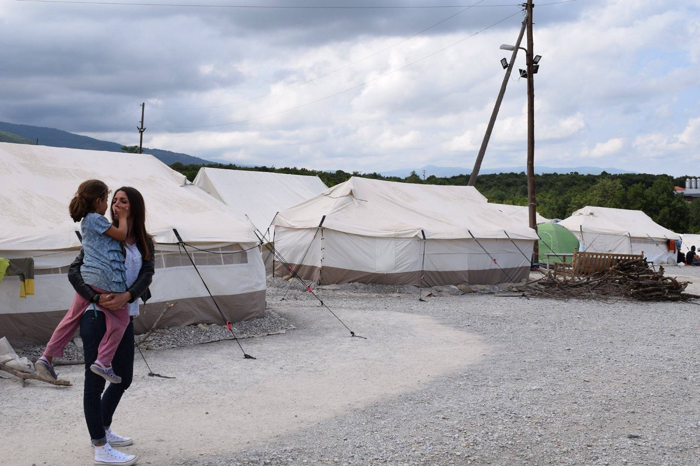

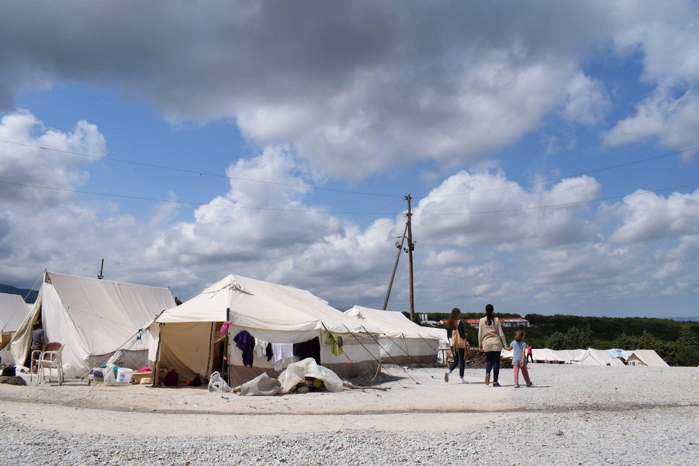

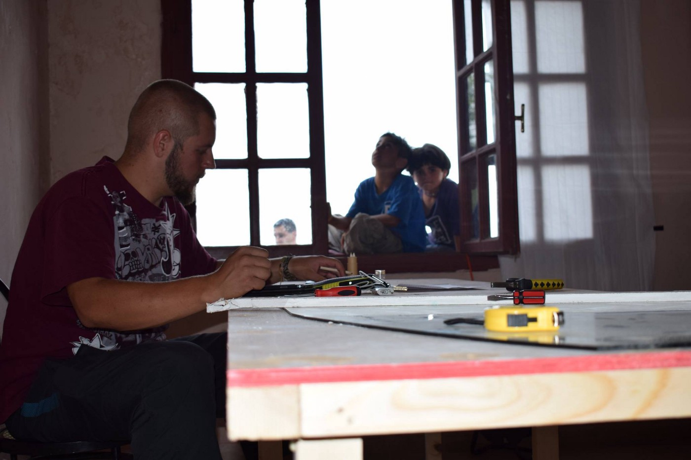

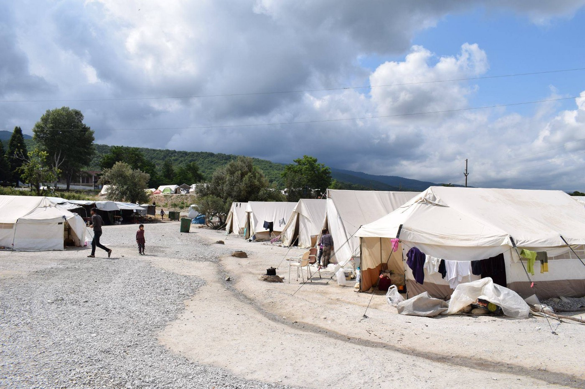

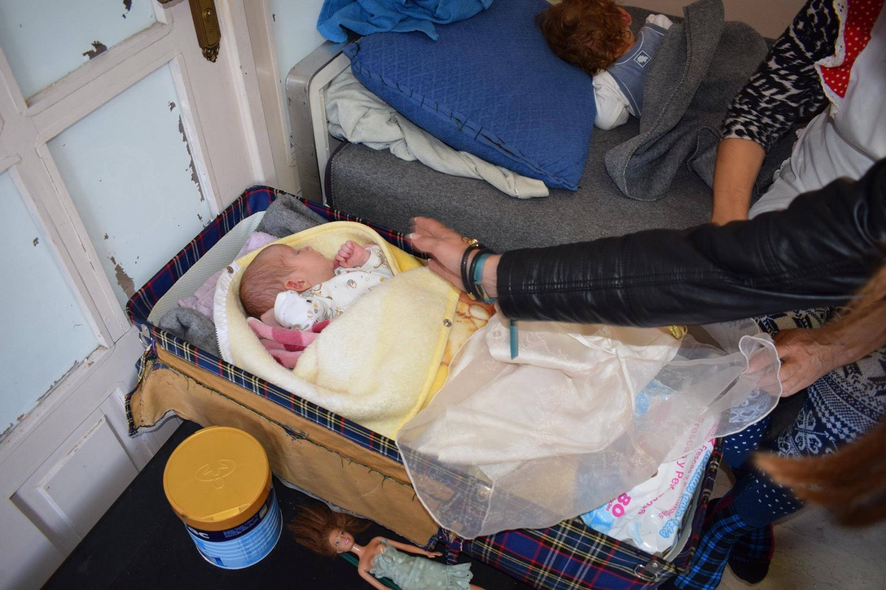

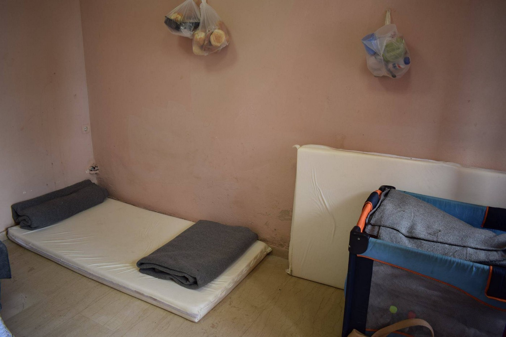

Photo Borderfree Association
### _Piera \(hotel\)_

_The camp is located inside an hotel 50 km far from Thessaloniki, very bear to the sea\. It hosts 200 Afghan people, some of them come from Idomeni\._

_The conditions inside the camp are better than in others\. The camp is managed by the hotel’s owners and by some volunteers of Praxis and UNHCR\. In the camp there is also a school managed by volunteers and refugees women\. Some volunteers told us that probably all the refugees will be soon moved to another camp\. The security is entrusted to the hotel’s staff\. There is no police nor military\. Also the Wi\-Fi is present\._
### _Giannitsa_

_We were not allowed to enter this camp, because is surveilled by the military\. Refugees outside the camp told us that the entrance is forbidden for volunteers and journalists\._

_The camp is located 40 km far from Thessaloniki\. There are about 500 Syrian and Iraqi people\. Nobody of them have been in Idomeni before\. Inside the camp there are 20 toilets\. The refuges we have talked with say that last month they found worms in the food\. After asking for explanations, the situation have changed and both the quality and the quantity of food have improved\. Water is insufficient\._

_The medical assistance is provided by a doctor that is present only in the morning\._

_There is internet connection and the social activities are better thank to a school managed by some volunteers\._
### _Diavata_

_In the camp there are 2000 people, from Syria and Palestine\. The access is forbidden to volunteers without any authorization\. However, we were able to enter the camp from a secondary access\._

_The information we have, have been collected from 2 Syrian and one Palestinian families\. The tents are spacious and each family has its own one\. Medical assistance is provided by 2 doctors that are present in the camp only for some hours a day\. The food, as in the other camps, is distributed 3 times a day and is from a scarce quality and quantity\. There are chemical toilets and showers but they are not always working\._

_It is possible to cook with gas burners, but pots and cutlery are not provided\._
### _Derveni_

_The camp of Derveni is located in the industrial zone in the north of Thessaloniki\. It hosts 800 refugees with Kurdish origins\. The access to the camp were us forbidden by the military at the entrance\. The information collected come from some refugees we met on the outside\._

_During the first days the food were not enough and bad, now it is slightly better thanks to the help of an organization of volunteers that distributes fresh food\. Refugees are allowed to use fire and electrical burners, but no wood or gas is provided\. Drinking water is provided by the military in sufficient quantity\. Hygienic and cleaning services are provided only occasionally\._

_Refugees told us that the tents are not enough for everybody and some families have to share their tent\. For this reason some fathers sleep on the outside\. There is no internet connection, while sockets are sufficient\. Medical assistance is provided only for some hours a day by a service of paramedics\._
### _Vagioxori_

_The camp is located in the east of Thessaloniki, in a rural zone\. At the moment it hosts 40 people: 2 Syrian families with Kurdish origin and others coming from Afghanistan\. The camp has a capacity of 500 people\. The military at the entrance allowed us to enter and according to the Syrian refugees they are very helpful\._

_We have noticed a difference in the opinions between the people of the 2 nationalities: Syrians say they are ok, while Afghans would like to change the camp \(as some of them have already done\) \. Unfortunately we mostly talked with Syrian people\. They say they receive the same food as in the other camps, 3 times a day and of a bad quality and quantity\. They also have the possibility to cook using gas burners inside a dedicated tent\. Drinking water is sufficient\._

_Refugees told us that some inhabitants of the village near the camp have brought food and water to the camp\. There are chemical toilets and showers and the hygienic conditions are more than good\. The camp looks clean\._

_There is no internet connection, while in a tent there are several sockets\. Syrian refugees told us they had a conversation with a military who told them they will be the firsts to do the registration for the request of international protection\._
### _Alexandria_

_The camp is located 50 km far in the east of Thessaloniki, in an ex\-military base\. The camp already exists since 3 months and therefore looks more organized that other camps in Thessaloniki\. T_

_he majority of the inhabitants were not in Idomeni, only in the last weeks 150 people have come from there\. The capacity of the camp is 800 people, all coming from Syria; half of them are Arabic and half are Kurdish\. Military did not allow us to enter, therefore we have collected information from some refugees we have met on the outside\. The food is the same of the other camps: 3 portions per day and of a bad quality \(often people do not eat\) \. Refugees have no possibility to cook, with exception of some electric burners and kettles for warming the Chai\. They receive 1 liter of drinking water per day\. There are only 20 showers and 30 chemical toilets that are cleaned 1 time a day\. They report us that in these days a system for hot water is being installed, but is still do not work\._

_From the outside it is possible to see the absolute lack of shadows and when it rains a big part of the camp floods\. This involves the presence of a lot of insects and mosquitos\._

_The medical assistance is provided only for some hours a day and not every day as in the other camps\. The main activity consists in distributing paracetamol\. In emergency cases, the ambulance takes several hours to arrive\. There is no internet connection\. A guy told us that probably he was the only one in the camp who get an answer from the “Skype” service\. After a first appointment were he could choose 8 European countries, they told him they will contact him in some months\. He is still waiting\._

_Besides this unique case, nobody get any information about the request of international protection\. Inside the camp there are different organization, among which Intersos and Foodkind\. Since some days a school has been opened for teaching English, Greek, German and Arabic\._
### _Veria_

_The camp is located in an ex\-military base near to a lake\. Military forbids the access to non\-authorized volunteers\._

_The camp hosts about 400 Syrian and Iraqi people who live inside the ex\-military building, each family has its own room\. There are showers with hot water and enough toilets\. The food, as in the other camps, is divided in 3 meals a day: quality and quantity are bad\. There is an internet connection and several sockets\. According to the refugees they are waiting for doing the request for international protection\. We have noticed that Intersos is present inside this camp\._
### _Cherso_

_The camp is located in the near of the city of Polikatro \(about 30 min by car\) in an isolated position in the mountains\. The access to the camp is allowed to everybody\._

_There are around 3000 people from Syria and Iraq that live in the camps since 2 months\. The organization of the tents has improved with the time, for example floors were added only 1 months ago\. The medical assistance is provided by the International Red Cross, but it is not clear if they operates also during the night\. Food is distributed 3 times a day and it is of a bad quality\. Drinking water is distributed 1 time a day\. There are chemical toilets and showers\. There is no possibility to get some clothes\._

_There is a school for children, a point where is possible to charge the phones and also internet connection\. They do not have enough information about the requests of international protection\._
### _Nea Kavala_

_The camp is located near Polikastro and hosts 4000 Syrian and Iraqi refugees \(maybe also Afghans\) since about 2 months\. The entrance is forbidden to volunteers with no authorization\. The information have been collected through interviews and talks with the refugees on the outside\._

_There are chemical toilets and shower\. The food is distributed 3 times a day and it is of bad quality\. There is a school that organizes activities for the children and a point where to charge phones\. It has not been possible to verify if there is an internet connection\. The medical assistance is provided by the International Red Cross\. The refugees have the opportunity to reach the city of Polikastro by walking for 1 hour\._

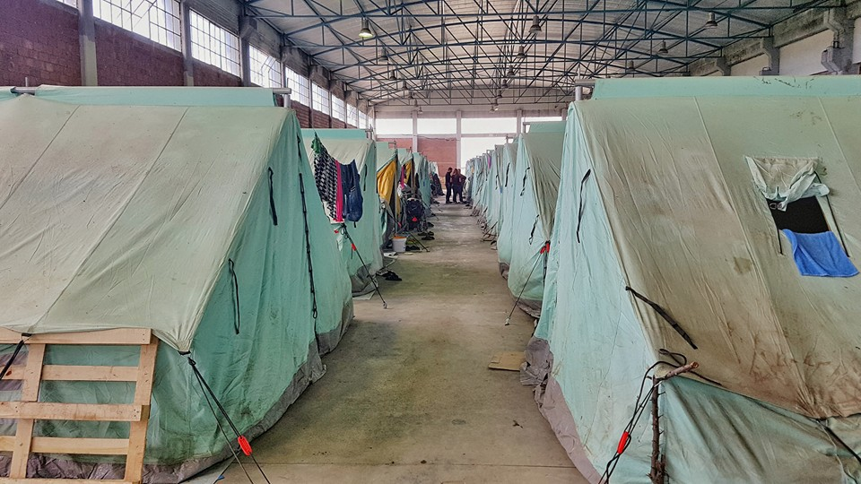

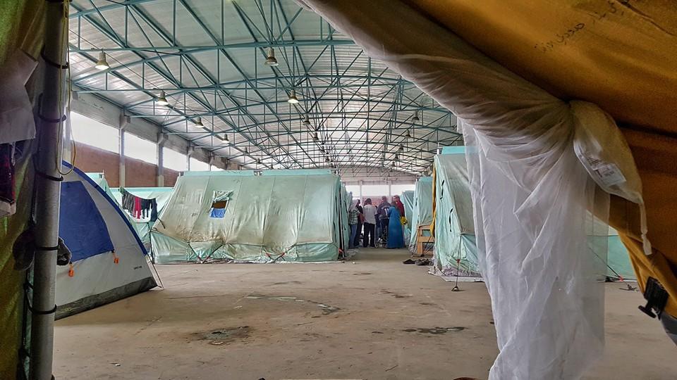

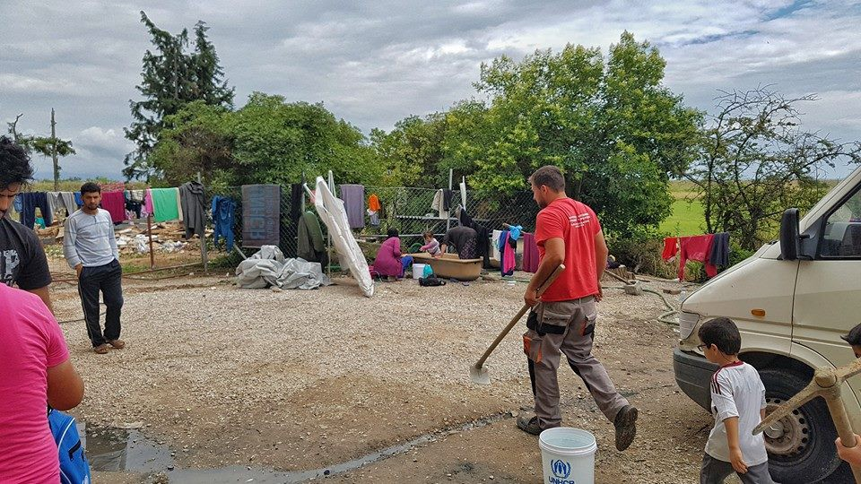

Photo Geo Mesmeric, Camp Kalochori

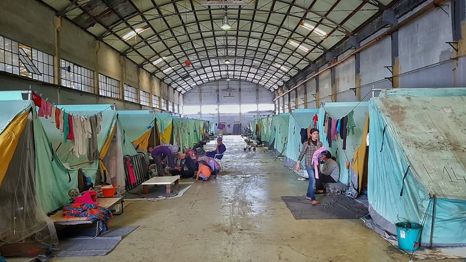

_Converted [Medium Post](https://medium.com/are-you-syrious/ays-special-report-desperate-situation-in-camps-around-thessaloniki-7e49d989ac9e) by [ZMediumToMarkdown](https://github.com/ZhgChgLi/ZMediumToMarkdown)._
