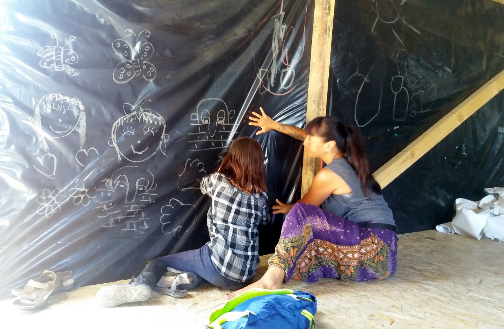
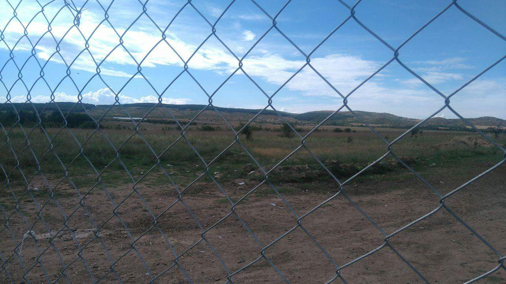
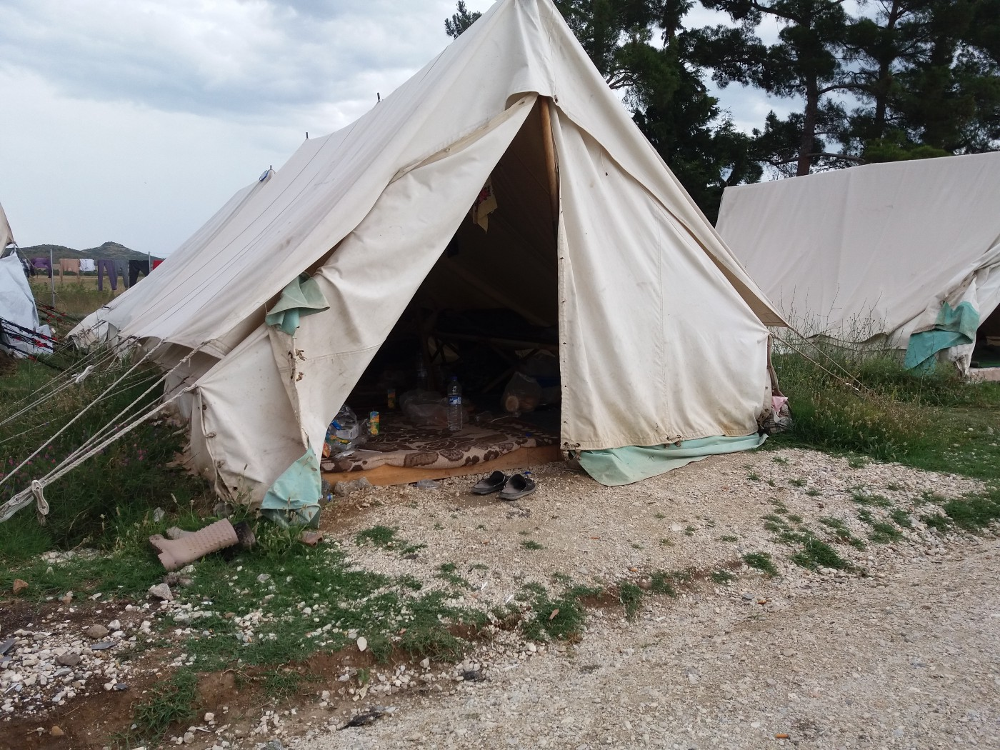
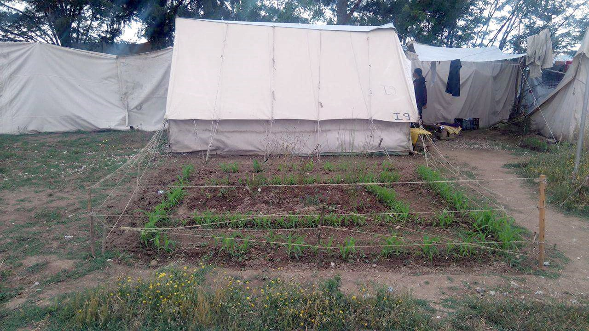

### AYS Special: Stories from Cherso

**Cherso is refugee camp near Polikastro where around 2,500 people are living, including around 700 children\. Most of the children are between the ages of 7 to 12 years, and none of them have gone to school for months, some even for years\. Some of them have come from Iraq, most from Syria\. There are around 300 Yazidis and many Kurds\.**

Volunteer playing with a kid stuck in Cherso camp\. Photo: AYS

Many of the families living today in Cherso were in Idomeni until several weeks ago when this camp was evacuated and people relocated around Thessaloniki area\. In Cherso they are waiting, and that is the feeling one gets after walking among tents — as if you are in some huge waiting room\. People are just waiting, stuck in between different worlds, the one they left and in many ways miss, the one they are forced to live in, and the world they hope to reach soon\.

> “We just want to go from here\. Anywhere\. Just to go and continue living,” Abdul Aziz, a geophysicist from Syria who has been a refuge for over two years, told AYS\. 

He and Ahmed, an engineer from Syria, are teaching Arabic in refugee camps\. Before coming to Greece, Abdul Aziz lived in Turkey for two years doing the same, teaching Arabic in camps\. He enjoyed doing that, but it is not his true profession\. He is eager to leave this camp and go anywhere where he will start his real life and stop waiting\.

Everyday view from Cherso camp: vast terrain behind wire fences\. Photo: AYS

The camp is run by the military, but they have no guns and are mostly friendly, but reserved\. Access is limited only to those who are registered with one of the organizations allowed to work inside\. Red Cross from Germany runs a small but very busy emergency room\. They have two doctors everyday from 8am to 6pm, and couple of nurses\. During the night there are no doctors inside\. One of the nurses told us there are at least 60 pregnant women in camp\. They will be taken to nearby hospital to give birth to their babies, and than come back to live under tents\. There are many people with diabetes in the camp, and no food or basic medicines are available for them\.

It is very hot and suffocating under tents\. People sleep, eat, pray, play… do everything on the pressed wooden palettes\. Everything they have is in bags on the floor, too\. Water bottles, baby wipes, some clothes… But they do not have much\. Many are fasting for Ramadan\. They say the food, provided by the Greek government, is very scarce, but that is the only thing they have\. We entered some of the tents\. Inside one small tent, family of four lives\. One child is 5 months old, born in Idomeni\. Besides Red Cross, inside of the camp are, among others, Save the Children, Praksis, Norwegain Refugee Aid, and Intereuropean Human Aid Association from Germany \(IHA\) \. On Wednesday, UNHCR will start the pre\-registration process that should last three days\. Many are eager for this process to start since for them it means possibility to apply for asylum or family reunification\. It means new hope\.

Typical makeshift home in a military tent\. Photo: AYS

In the meantime, IHA, with the help from AYS, is trying to build cultural centre, place that will also be a school run by volunteers and refugees together\. Volunteers will provide English classes, refugees Arabic classes\. Together they will try to organize sport activities\. Refugees are running a school that starts each morning at 9\. Some of them are teachers, some are trying their best to be good teachers\. Surprisingly, people who live in the camp, some of them, would like to learn tae\-kwan\-do\. Among them is former champion, and they want to learn from him\. However, military thinks martial arts are too aggressive to be taught in the camp\.

A small garden hidden among numerous tents\. Photo: AYS

Kids are everywhere in Cherso\. They are eager to speak with newcomers, to drag anybody to play, and it is easy to get carried away by them\. Volunteers have built a small playground with swings and slides\. Maryam has four kids\. Her husband is in Germany and she is hoping they will soon be reunited\. We ask her if she has everything she needs for kids and herself\. “How long?” she ask us\. “How long this will last? Can you please tell me\. We have no information\. Can you just tell us how long we will be here?” Hardly anybody can answer her\.

_Written by Nidzara Ahmetasevic, AYS_

_Converted [Medium Post](https://medium.com/are-you-syrious/ays-special-stories-from-cherso-40bb655c4160) by [ZMediumToMarkdown](https://github.com/ZhgChgLi/ZMediumToMarkdown)._
