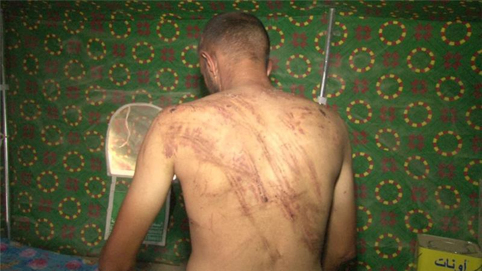
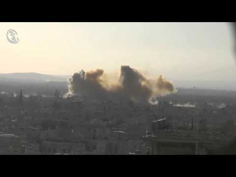
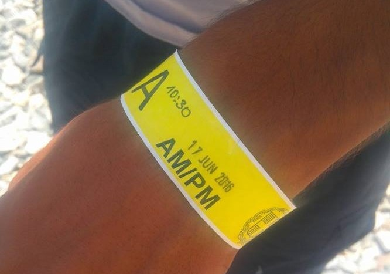
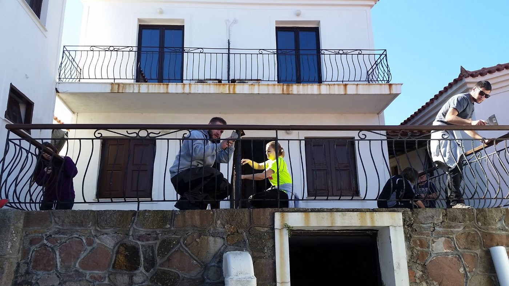
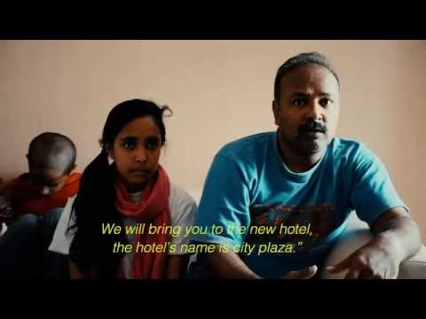

### AYS News Digest 16/06: This is why men flee war\.
#### New testimonies of torture in Fallujah\. Ceasefire doomed, MSF hospital shut down after attacks on Aleppo\. Greece passed legislation to replace members of an asylum appeals board with a new three\-member body, fears of more returns to Turkey\. Volunteers sued by government after renovating Elpis Hotel to accommodate refugees\. French authorities trying to ban 250\-vehicle aid convoy from UK to Calais over ‘security concerns’
#### Editorial
### Fallujah civillians describe torture under both ISIS and Iraqi government regime

Three men say they have been tortured while held captive by sectarian militia\. Photo: Salam Khoder/Al Jazeera

As the Iraqi armed forces and allied militias continue their battle to take Fallujah from ISIS, a growing number of civilians have said that they were tortured after escaping the besieged city, according to [Al Jazeera report](http://www.aljazeera.com/news/2016/06/iraq-civilians-recall-days-hell-militia-160616060343081.html) \. This article comes days after the extensive [Human Rights Watch report](https://www.hrw.org/news/2016/06/09/iraq-fallujah-abuses-test-control-militias) about summary executions, beatings of unarmed men, enforced disappearances, and mutilation of corpses by government forces\. Put together, those testimonies, hopefully, explain why men are fleeing war in Iraq, Syria and elsewhere\. Some are running from ISIS\. Some flee government regimes\. Some are running from rebels\. In the end, it often comes to the simple choice between life and death\. But what awaits them after they embark on tremendously dangerous journey to safety? While refugee families with small children are still welcomed to EU, men, especially young, single men, are more likely to be turned down\. People often ask: Why didn’t they stay and fight? AYS believes no person should be expected to stay in the middle of an armed conflict just because he or she can carry a gun\. Sometimes, all that is left to defend is your own life\. And that’s when you run\.
#### Syria
### Allepo ceasefire doomed, MSF\-supported hospital out of service after the attacks

Just hours after the 48\-hour ceasefire was announced, air strikes hit rebel\-held parts of Aleppo, wounding an unconfirmed number of civilians and reportedly killing some\. Only a few hours later, shells fired by rebels fell on regime controlled areas of Suleiman al\-Halabi neighborhood, with confirmed reports of one wounded person in addition to material damages\.

> According to Local Coordination Committees in Syria, a total of 15 people were killed in ‪‎Aleppo‬, 13 in ‪‎Idlib‬, 3 in ‪‎Deir Ezzour‬, 2 in Homs‬, 1 in ‎Damascus and 1 in ‪‎Hama‬ today\. 

Unfortunately, MSF\-supported Omar Bin Abdulaziz hospital in Aleppo is out of service after today’s attacks\. The 64 bed hospital is one of the biggest in Aleppo, and one of only few medical facilities still standing\. Following today’s attacks on Aleppo, MSF has announced they are “extremely worried about potential impact on people’s access to healthcare”\.
### Government helicopters have dropped 32 barrel bombs on the besieged city of Daraya

According to Daraya Council, regime helicopters have dropped 32 barrel bombs to the beseiged city of Daraya\. This attack comes only a week after the the first delivery of aid since the start of a siege in 2012\. was allowed to enter Daraya\. Donated food will be sufficient only for the next three weeks\.
### Brave civil reporters from occupied Raqqa receive One World Media Special Award\!

Reporters from the amazing citizen journalist group “ [Raqqa Is Being Slaughtered Silently](https://www.facebook.com/Raqqa.Sl/?fref=nf) ”, committed to exposing human rights abuses by ISIS and documenting life in occupied Raqqa have received the One World Media Special Award today\. Winners were presented at the Awards ceremony at BAFTA in London\. Congratulations to our brave colleagues\!

> WEATHER WARNING has been issued today for the Mediterranean route from North Africa to Italy\. The waves are very high, refugees, please do not attempt the crossing\! 

#### Greece
### New asylum appeals body will include two judges and one person chosen by UNHCR

Today, Greece’s parliament passed legislation to replace members of an asylum appeals board that has held up efforts to swiftly send refugees who cross the Aegean Sea back to Turkey\. The “reform” comes after the 20 current committees have blocked the vast majority of returns to Turkey on the basis that it was not a safe country for refugees\. To be precise, the previous asylum appeals body has ruled that all but two of the 57 asylum seekers whose cases it has considered should have their asylum claims evaluated in Greece, rather than in Turkey\. Under measures adopted in 2011 to ensure the independence of such bodies, they have until now comprised a civil servant, a member of the national human rights committee and a UNHCR representative\. The new appeals body will include two judges chosen by the justice ministry and one person chosen by the UNHCR, a shake\-up meant to “speed up the process”\. Some volunteers and lawyers fear this might result in more returns to Turkey\.
#### A total of 56,622 refugees are registered in Greece, including 8,319 on the islands, 9,947 in the Attica region, 2,172 in Central Greece, and as many as 23,881 in the Northern Greece\. This only applies to official government camps\. A total of 4,923 refugees are staying in “non official settlements” Elliniko and Pireaus\. Approximately 1,500 are “self\-settled” in makeshift camps around evicted areas\. Additionally, there are 5,632 refugee users of UNHCR accommodation, including hotels, apartments, host families and the Vogiatzoglou camp in Thessaloniki\.
### 57 **refugees rescued off the coast of Lesvos**

Greece’s coast guard says it rescued about 60 refugees from a sailboat which ran aground off the coast of Lesvos, and all passengers were being taken to the island\. The coast guard said the vessel ran aground south\-southwest of Lesvos\. Two fishing boats in the area were assisting two coast guard patrol boats\. According to volunteers, 57 people were on board\.
### US Navy ship joins NATO in the Aegean

US military ship Grapple set sail from Souda Bay in Greece, with the primary mission of conducing maritime surveillance and reconnaissance\. He said the U\.S\. is deploying USNS Grapple as a “tangible demonstration” of its support for the NATO mission to shut down smuggling operations in the Aegean\.
### Pre\-registrations already done in Cherso, bus shuttles to Thessaloniki starting tomorrow

Following suprisingly fast pre\-registration procedure in Cherso, all of the 3,987 refugees in Cherso camp have got their pre\-registration bracelets\. First registrations in Thessaloniki will start tomorrow, with bus shuttles for refugees pre\-registered in Cherso, according to AYS volunteers on site\.

Suprisingly fast: pre\-registered two days ago, interview scheduled for tomorrow\. Photo: Azra Ayyash, AYS

Pre\-registration is also happening in Elliniko \(despite it being a “non\-official” camp\), Oreokastro and Nireas, with Thessaloniki and Athens being main registration hubs for residents of surrounding camps\. The pre\-registration is open to people who entered Greece from 1 January 2015 and prior to 20 March 2016, according to a press release from the Asylum Service\.
### Piraeus awaiting eviction, volunteers needed, there will be no pre\-registration in the port

Volunteers from port Piraeus have published an urgent appeal for reinforcements, in order to support the refugees currently being evicted from E1 terminal and moved to a nearby E1\.5 terminal, also known as the Stone Warehouse\. Volunteers are also needed to prepare the Stone Warehouse, to transport, clean, set up tents and also make sure there is no problems amongst refugees\. If you are able to help, [Negia Milian](https://www.facebook.com/negia.milian) and her team are coordinating the move and close down of E1\.

According to the [News That Moves](https://newsthatmoves.org/en/no-pre-registration-at-piraeus-port/) , pre\-registration currently taking place in mainland Greece will not be carried out at Piraeus Port in Athens\. The Office of the Spokesperson of the Greek Coordinating Body for the Refugee Crisis Management confirmed that Piraeus is “an unofficial camp and the pre\-registration process is done only in organized camps\.” Greek authorities are suggesting people in Piraeus remain patient and wait until the authorities will move them to organized sites\. There is currently no timeframe publicly available for the evacuation of Piraeus, but it will be done in the upcoming weeks, the Spokesperson’s Office confirmed\.
### Volunteers sued by the government after renovating Elpis Hotel to house refugees

Yesterday, the decision was made by the EOT Ministry of Culture and Tourism \(Licensing Committee\) that never, under any circumstances, will they allow the Hope Centre Elpis to be used to assist the refugees on Lesvos, not even as a warehouse\. They made it perfectly clear in the meeting that the officials in Molyvos will do everything within their power to destroy any volunteer efforts to support the refugees, as reported by The Hope Centre volunteers\. In addition to the ban, they are being personally sued for 10,000 Euros by the Hotel Licensing committee for “running a hotel without a licence”\.

Volunteers have spent months renovating the abandoned facility\. Photo: The Hope Centre

> We are devastated that they have smashed the dream that we all shared, just as we felt devastated when they tore down Better Days For Moria and all of the other wonderful camps that were providing support and hope to the refugees\. But, as ever, we remain committed to helping the refugees no matter what obstacles and threats are thrown our way, wrote the volunteers of The Hope Centre in an emotional [statement on Facebook](https://www.facebook.com/HopeCentreElpis/posts/1721939618087163) \. 

The Hope Centre was envisioned as a safe, warm space offering dignified support for refugees arriving to Lesvos\. Volunteers have spent months cleaning, disinfecting, renovating and equipping the abandoned facility in order to accept refugees\. We wish them many great projects in the future\.
### The City Plaza hotel squat in Athens, currently housing 400 refugees, needs donations

The City Plaza is a hotel located in the heart of Athens\. It was a symbol of the Greek crisis\. For years it was closed because the owner could no longer pay out wages\. The hotel was occupied in April by an activist group and it currently houses 400 refugees, including 185 children\.

Volunteers of City Plaza have started a [fundraising campaign](http://best-hotel-in-europe.eu/) , allowing you to “book a room” or make an individual donation to support their efforts\.
#### Serbia
### A van with 33 refugees from Afghanistan and Pakistan intercepted by police near Zaječar

According to Serbian Ministry of interior, a van smuggling 33 refugees from Bulgaria Afghanistan and Pakistan was intercepted near Zaječar today\. A young smuggler from Belgrade was taken to detention, where he will wait for the hearing\. Yesterday, a van with 23 Afghan refugees was intercepted by Serbian police in the city of Bor, arresting three young local smugglers\.
#### Germany
### German Interior Minister calls for tougher treatment of refugees facing deportations

German Interior Minister Thomas de Maiziere said that doctors were handing out too many certificates to refugees who face deportation saying they were too ill to travel\.

> “Doctors are still issuing too many certificates where there is no real health reason not to deport someone\. It can’t be true that 70 percent of men under the age of 40 are declared sick and not fit to travel before deportation\. Experience suggests this is not the case,” he said in an interview for the Rheinische Post\. 

De Maiziere also said refugees should have their benefits cut if they do not cooperate on establishing their identity or if they do not leave the country after their asylum application is rejected\.
#### UK/France
### French authorities trying to ban 250\-vehicle aid convoy to Calais over ‘security concerns’

According to [The Guardian](https://www.theguardian.com/world/2016/jun/16/uk-aid-convoy-to-calais-faces-ban-over-security-concern) , a 250\-vehicle convoy taking aid from Britain to the main refugee camp in Calais faces a last\-minute ban by the French authorities at Dover, who are citing security concerns\. The French prefecture of Pas\-de\-Calais says those organising the convoy have called for a public demonstration and have invited organisations that support refugees from all over Europe\. [Organisers of the convoy](http://www.convoytocalais.org/) , which has been planned for months, deny that it is a demonstration\. They say it was scheduled to leave the UK on 18 June in response to calls for more volunteers and donations\.

_Converted [Medium Post](https://areyousyrious.medium.com/ays-news-digest-16-06-this-is-why-men-flee-war-5396c542bb55) by [ZMediumToMarkdown](https://github.com/ZhgChgLi/ZMediumToMarkdown)._
