### AYS News Digest 17/06: “They killed my husband\. If you deport us, they will kill my son as well\.”

 and Beat Bronson](assets/65ea5736837/1*BYbeYH2OsyTKm6J9kOsNmQ.jpeg)

Photos: [Nusrat Durrani](https://www.facebook.com/nusrat.durrani) and Beat Bronson
#### General
### Doctors Without Borders \(MSF\) to no longer take funds from EU Member States and institutions

> [_Médecins Sans Frontières \(MSF\)_](http://www.msf.org/en/article/20160617-eu-states%E2%80%99-dangerous-approach-migration-places-asylum-jeopardy-worldwide) _announced today that it will no longer take funds from the European Union and Member States, in opposition to their damaging deterrence policies and intensifying attempts to push people and their suffering away from European shores\._ 

> _This decision will take effect immediately and will apply to MSF’s projects worldwide\._ 

> _Three months into [the EU\-Turkey deal](http://www.msf.org/en/article/europe-dont-turn-your-back-asylum-takepeoplein) , which European governments are claiming as a success, people in need of protection are left counting its true human cost\. On the [Greek](http://www.msf.org/en/greece) Islands, more than 8,000 people, including hundreds of unaccompanied minors, have been stranded as a direct consequence of the EU\-Turkey deal\. They have been living in dire conditions, in overcrowded camps, sometimes for months\. They fear a forced return to Turkey yet are deprived of essential legal aid, their one defense against collective expulsion\. The majority of these families, whom Europe has legislated out of sight, have fled conflict in [Syria](http://www.msf.org/en/syria) , [Iraq](http://www.msf.org/en/iraq) and [Afghanistan](http://www.msf.org/en/afghanistan) \._ 

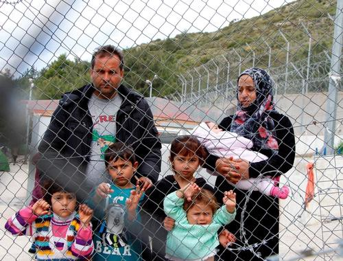

Photo: _Mohammad Ghannam/MSF_
### Weather Forecast: High Wave Warning\!

> _Saturday June 18th & Sunday June 19th_ 

> _MID\-MEDITERRANEAN — LIBYA TO ITALY SEA ROUTE_ 

> _HIGH WAVE WARNING\!_ 

> _WAVES VARIABLE 0\.6\+ TO 2,1\+ METERS, SATURDAY INTO SUNDAY_ 

> _Moving generally Southward both days, waves at your front\._ 

> _Winds: Variable, between 6 and 42 kph, gusts up to 55 kph, blowing Southward both days\._ 

> _SEA SAFETY: Waves over 0\.5 meters are considered dangerous_ 

> _THESSALONIKI & SURROUNDING AREA_ 
 

> _Saturday: Sunny 23C / 36C_ 
 

> _Sunday: Mostly sunny 24C / 36C_ 

> _LESVOS & ISLANDS_ 
 

> _Lesvos & nearby Turkish coast, sunny\. Saturday through Sunday temperatures from 22C / 34C\._ 

> _WAVES VARIABLE FROM 0\.1\+ TO 0\.3\+ METERS SATURDAY INTO SUNDAY_ 

> _Moving mostly Southward both days\. Leaving from Turkish coast of Canakkale to Lesvos, waves at your back\. Leaving from the west coast of Turkey to the Greek islands, waves at your right\._ 

> _Winds: From 6 to 14 kph, gusts up to 20 kph, blowing mostly Southward both days\._ 

> _Further north in the Balkans, Saturday through Sunday mostly sunny, a few showers in central Serbia\. Low 13C Šentilj, Slovenia, high 33C FYROM\-Serbia border\._ 

> _Key locations, Saturday through Sunday lows & highs:_ 
 

> _Athens, Greece: sunny 23C / 38C_ 
 

> _FYROM\-Serbia border: sunny 15C / 33C_ 
 

> _Belgrade, Serbia: mostly sunny 17C / 27C_ 
 

> _Šentilj, Slovenia: partly cloudy, chance of showers 13C / 25C_ 
 

> _Hungary\-Serbia border: partly cloudy, chance of showers 15C / 26C_ 

#### Syria
### Assad’s regime prevent the entry of medical supplies and agricultural seeds to the besieged neighborhood of Waer

> _The UN sent a humanitarian aids convoy to the besieged neighborhood of Waer in Homs city during the evening, loaded with food parcels and heath materials\._ 
 

> _An LCC correspondent said that the convoy consists of 7500 food parcels, 7500 flour bags, 600 biscuit boxes, 4000 parcels of health materials, 1800 mattresses, 4000 sheets, 2000 insulating mats, 2000 bulbs, 900 pots, and 1000 adult diapers\._ 
 

> _He pointed out that Assad regime did not allow the entry of medical supplies, surgical equipment, and agricultural seeds, which the neighborhood is in shortage of, especially blood bags since doctors had to transfer blood directly to the wounded\._ 
 

> _The total population of the neighborhood is 90000, most of them are IDPs from other neighborhoods in Homs city, according to Local Council statistics\. Assad’s regime have been imposing a siege on the neighborhood for 3 years, with some truces\._ 

### Syrian Journalists in critical condition after an assassination attempt

> _Two days after surviving an aerial attack, Syrian revolutionary citizen journalists Hadi Abdullah and Khaled Issa, are in critical condition after an assassination attempt \(this time a car bomb\) in [Aleppo](https://www.facebook.com/hashtag/aleppo?hc_location=ufi) \._ 

> _Update: Both Hadi Al Abdullah and Khaled Isa are said to now be in stable condition after being transferred to Turkey for treatment\._ 

> _Both of these journalists have gone to great extremes towards shedding light on the crimes committed against innocent civilians\. they risk their lives every moment to show the world the agony that [Syrians face](https://www.facebook.com/ramijarah/posts/10154383378077873?hc_location=ufi) \._ 

#### Lebanon
### Volunteers, circus, and a juggling school come together to bring joy to refugees in Beqaa Valley

> Salam LADC is very excited to have been joined by the incredible [cirquenciel](https://www.facebook.com/cirquenciel/) circus and movement school\. 

> We visited two local settlements in the Beqaa Valley together where they put on exciting juggling and music performances\. Afterwards we got everyone to participate in hands\-on workshops learning diabolo, playing trust games, juggling, singing and dancing\. 

> Children and volunteers alike had a brilliant time as you can see from massive grins on our faces\. 

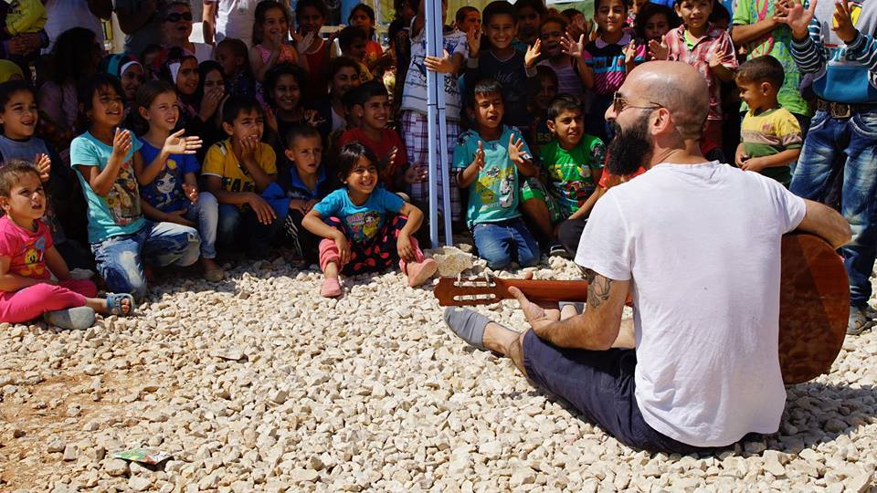

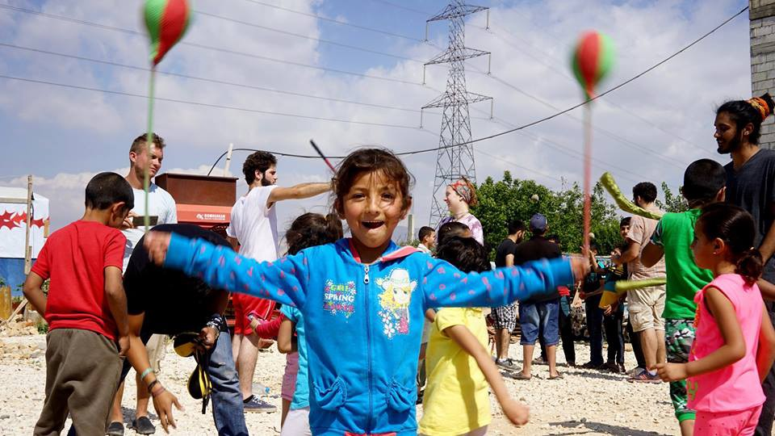

 and Beat Bronson](assets/65ea5736837/1*xnrrjv7frfG6YtXs_semJQ.jpeg)

Photos: [Nusrat Durrani](https://www.facebook.com/nusrat.durrani) and Beat Bronson
#### Greece
### Increase in arrivals to Greece overstrains volunteers’ capacities in the region

> _Lighthouse Relief: At 7\.10 this morning, Portugese Frontex brought in 52 people that they had intercepted at sea as they entered Greek waters from Turkey\. They landed in Skala Sikamineas and were held on the boat while waiting for transportation to the detention camp, but we were allowed to assist with bringing them water, nutrition, diapers, clothes and blankets\._ 

> _We are seeing an increase in arrivals, and we desperately need your support again to upscale our reception and be prepared if there is a new influx to offer many more people immediate relief, assist in finding vulnerable people that need extra protection and distribute much needed water, nutrition and non\-food items after the horrific journey people have taken\. We have kept a high presence on Lesvos while many other organisations left, to support the local residents in cleaning the island and be prepared for whatever might come\._ 

> _Talking to a Syrian family from the boat, they asked how long they would stay in the camps on Lesvos\. We cannot give them any answers on their future\. Now, they will see their children detained in terrible conditions, but at this moment their eyes were filled with relief as it had taken them two months to get here\. ”At least we are safe\. Anywhere but Syria”\._ 

> _To support us in staying here and giving people immediate relief and protection, visit [www\.lighthouserelief\.org/donations](http://l.facebook.com/l.php?u=http%3A%2F%2Fwww.lighthouserelief.org%2Fdonations&h=hAQHGJGiuAQFOMA2wbw_o10Piwt0bjuqd1haAxAM1uyZIdQ&enc=AZNHpfGmVRB9jhvg2PcxPLqNPgOtK5dyG4zB_645xipOCAlMlOudVXMUM2uLMh1ANq22sR92aXYDPpw01-TZT_Req9jLrAXkSNJBwxMuBVtgCjLM4WNtZXFP1uDs1MM9JL-5i62Y54noYrOQedA8yY60BgOTFOV0sZFvN6Gvy0bH_kHlqFtRexmAmTPejms01fI&s=1) \._ 

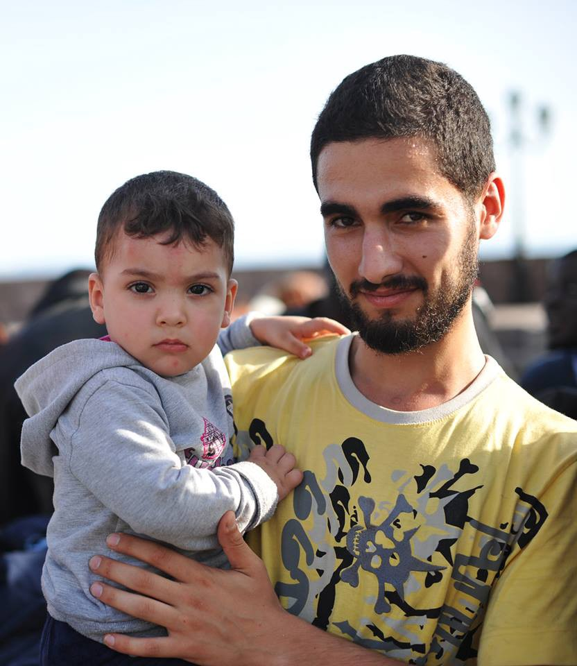

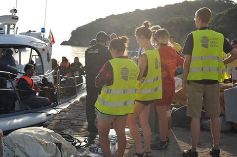

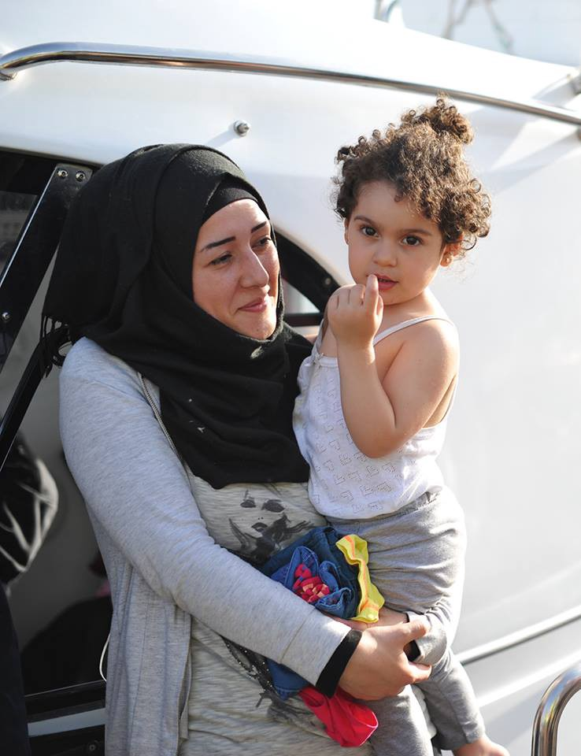

Photos: Lighthouse Relief
### Boat Reports in Greek Islands

> _Lesvos: 60 people were brought in by Frontex in the north\._ 
 

> _No information available on south\._ 

> _Samos: 4 new arrivals\. 7 of the volunteers helped out serving tea and coffee and playing games with the children at the evening cafe run by Friendly Humans, a sister volunteer group of Samian locals\._ 
 

> _Luckily volunteers were present when 4 new arrivals came to camp\. They appeared dry and well dressed, but volunteers made sure they received sleeping mats and bags, tents and hygiene kits\._ 

### Arabic or Farsi interpreter\(s\) needed on Chios\.

> _A volunteer legal information team that is part of the Chios Eastern Shore Response Team is looking for interpreters after their only Arabic interpreter’s departure\. In coordination with the authorities, this team has been doing great work that aims at empowering refugees through detailed enough information for their asylum process\. If you speak Arabic, Farsi or Kurmanji please provide your support for this great team\._ 

### Thousands of people joined march organized by refugee\-hosting squats in Athens

> _Thousands of refugees and people standing in solidarity with them marched today in Athens, Greece\. The demonstration was organized by five refugee\-hosting squats\._ 

> _Dozens of similar initiatives have emerged in Greece, in an effort to offer a decent living to as many refugees as possible\._ 

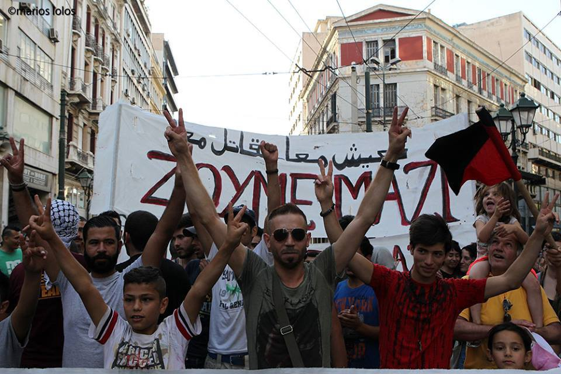

Photo: Marios Lolos
### Registration ongoing in Thessaloniki

> _Cherso: 400 people went to Thessaloniki for registration today\. The process for all the people in the camp will be done in 4 days\. There were no problems\. When the buses arrived people formed a line and everything went smoothly\._ 

#### Serbia
### Refugee Aid Group Info Park celebrates their 9 months\!

> The 16th of June was a special day for us — it was exactly nine months since our operation was launched\. We remember the 16th of September like it happened yesterday\. Hungary just closed its border and we were wondering if we would make the three months we originally planned\. Nine months later, Info Park is alive and kicking, we work more than ever, have new goals and new achievements\. Last but not least, we have permits for work renewed and valid until the end of 2016 so we are here to stay\. We raised glasses and cheered for that\! 

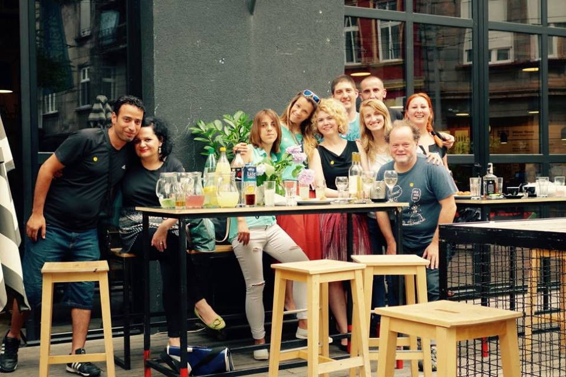

Photo: Info Park
#### Italy
### Refugees arrive to Rome through the Project Humanitarian Corridors

> _81 migrants, most of them Syrian refugees, arrived to Fiumicino airport \(Rome\) this morning from Beirut, thanks to project “corridoi umanitari” \(humanitarian corridors\) \. They will be hosted by a network of houses and receiving centres located not only in Italy \(Lazio, Tuscany, Piedmont, Liguria, Campania, Puglia\), but also in San Marino republic\. It’s the fourth group that, from February 2016, has been able to reach Italy safely and legally, thanks to the agreement between the Italian government, the community of Sant’Egidio, the Federation of the Evangelic Churches and Tavola Valdese\. The total amount of people helped through this project are 281\. Around one thousand are expected to come, also from Libano, Morocco and [Ethiopia](http://www.ansa.it/lazio/notizie/2016/06/16/migranti-altri-81-profughi-a-fiumicino_b2eb2a10-47f5-4b1b-8e0d-c50cbf7988e3.html) \._ 

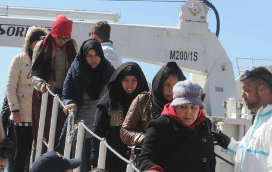

Photo: Ansa
### Developments about the situation of refugees and refugee aid in Ventimiglia

> _The debate around the situation in Ventimiglia goes on, while the new temporary centre for migrants is being set up in Park Roja, close to Bevera, north of the town\. Workers’ unions have written a letter to prefect Silvana Tizzano, to the health local unit and to the municipalities of Ventimiglia, Vallecrosia, Camporosso and Bordighera: they ask an official meeting; meanwhile, bishop Antonio Suetta, ensures the availability of a fully equipped structure \(ex hospital Carità in Taggia\) to host migrant women and children\. Senator Buemi is acting at the policy level, proposing an amendment to support financially all the municipalities which are spending a lot for the assistance to migrant minors\. Like Ventimiglia, a town that spent 220,000 euro on this [need](http://www.lastampa.it/2016/06/16/edizioni/imperia/migranti-prosegue-lemergenza-a-ventimiglia-sNMPJ2TIgPyQX7CTVbPMWJ/pagina.html) \._ 

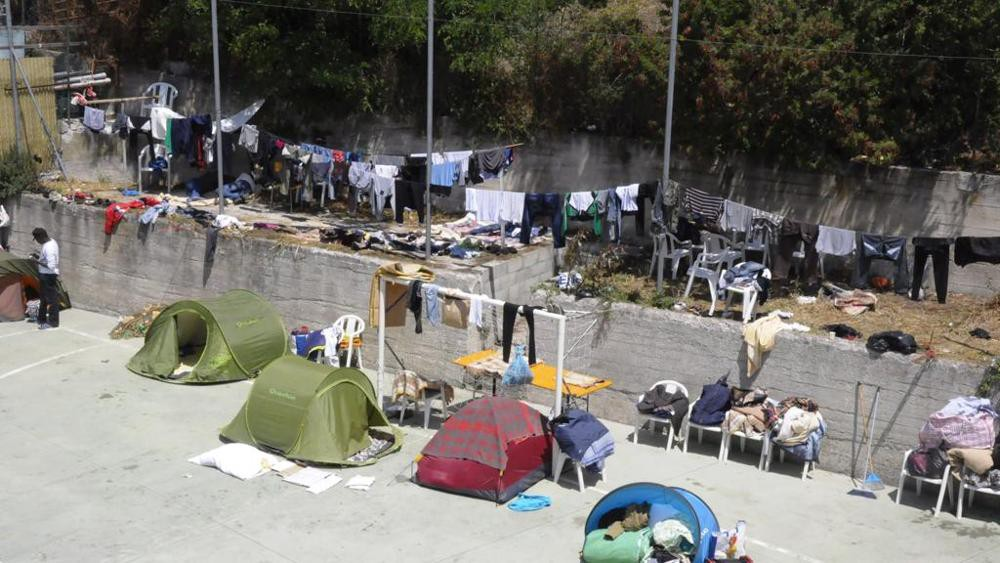

Photo: La Stampa
### Two smugglers arrested in Pozzallo

> _Two migrant smugglers have been arrested in Pozzallo, accused of having led a dinghy with 140 migrants on board last night\. The migrants have been rescued by the supply vessel “Bourbon Argos”\. The smugglers, a Malian and a Senegalese, are under arrest for illegal delivery of migrants, and for inhuman and humiliating treatment while holding them\. Migrants are now hosted at Pozzallo’s hotspot to be visited, identified and transferred to other centers; 38 of them are women \(some are pregnant\), and 38 are minors\. Each passenger paid 800 dollars and have been residing for a long time within abandoned barns, waiting for good weather [conditions](http://ragusa.gds.it/2016/06/17/migranti-sbarcati-a-pozzallo-arrestati-due-presunti-scafisti-video_527351/) \._ 

### _Transfer of refugees from_ Greece to Rome

> _Following the visit of the Pope to the Island of Lesvos, in Greece, when he accompanied three families of refugees back to Rome, a second group of nine refugees has arrived in Rome yesterday, June 16th, [2016](http://media.gov.gr/index.php/%CF%85%CF%80%CE%B7%CF%81%CE%B5%CF%83%CE%B9%CE%B5%CF%83/%CF%80%CF%81%CE%BF%CF%83%CF%86%CF%85%CE%B3%CE%B9%CE%BA%CF%8C-%CE%B6%CE%AE%CF%84%CE%B7%CE%BC%CE%B1/transfer-of-refugees-from-greece-to-rome) \._ 

### Foreign Entrepreneur chosen to be the Best Entrepreneur of the Year

> _Madi Sakande is a foreign entrepreneur in Italy who has been awarded with prize Moneygram, as best entrepreneur of the year\. His motto is “take cold to Africa”: in 2011 he and other mates took over a historical Italian firm in the field of refrigeration, now New Cold System, which plans and realizes refrigerating systems for food and pharmaceutical firms\. His last project, launched in short time, foresees the food conservation with solar\-panel\-charged systems, so that “70% of what is produced in Sub\-Saharan Africa won’t be wasted any longer”, as Sakande explained\._ 

> _According to president of the house of deputies Laura Boldrini, who delivered the prize, people like him support the Italian demography, the income, and they should receive the Italian citizenship, since they truly belong to the Italian social fabric\. In Italy, 350,000 firms belong to foreigners, who contribute for 9% of the national GDP\. President of the instate for pensions Tito Boeri added that migrants deposit 8 billion euros into the national social safety funds every year, and they withdraw only 3 of them; some of them came back to their country, thus not receiving the money they deposited [back](http://www.ilsole24ore.com/art/notizie/2016-06-16/migranti-miglior-imprenditore-e-manager-burkina-faso-203940.shtml?uuid=ADJ92Ud) \._ 

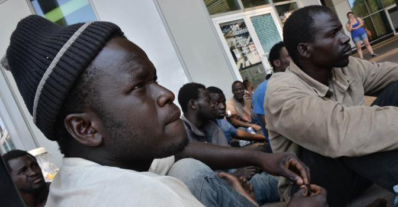

Photo: Il Sole 24 Ore Italia
#### Austria
### Refugees turned back at the Austrian Border: Legally or Illegally?

> _Minister for the Interior, Mr\. Sobotka, thinks that a decision by the National Council including emergency ordinance is necessary to push back asylum seekers directly at the Austrian border\._ 

> _Austrian state radio Ö1 reported in today’s Morgenjournal about plans of the Department of the Interior, to have the controversial ordinance enacted by Parliament in order to enforce the upper limits\._ 

> _What kind of light does this shed on the practices by the registration authority in Spielfeld between February and March of 2016 where in the space of only 24 days more than 580 Syrians, Iraqis and Afghans were randomly sorted out by Austrian officials and sent back to Slovenia?_ 

> _The Styrian Administrative Court is currently also preoccupied with this question\. More than 20 cases are currently pending here where such rejections are disputed and those affected are asserting their right to an asylum hearing in [Austria](http://oe1.orf.at/artikel/442627) \._ 

#### Slovenia
### Asylum seekers protesting during the press conference, organized by authorities

> _The banner says “They killed my husband, if you deport us they will also kill my son”_ 

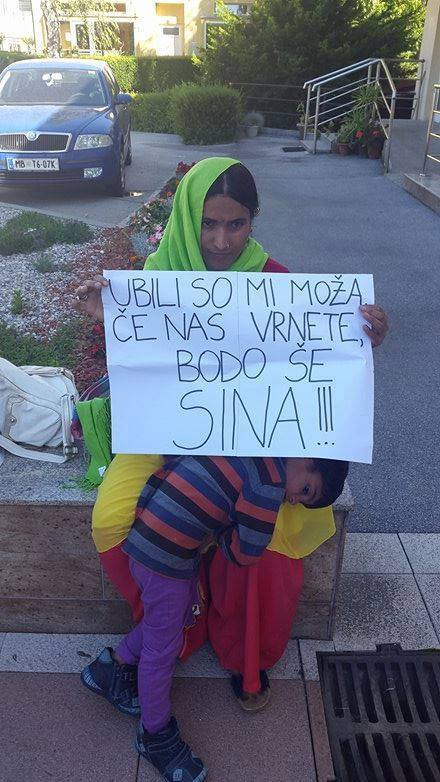

#### France
### Kesha Niya Kitchen needs our help\!

[Kesha Niya Kitchen](https://www.facebook.com/keshaniya/) is a community kitchen run by volunteers and refugees in the refugee Camp de la Liniere in Grande Synthe, Northern France\.

> Since March the 7th we have been preparing and serving 1000 meals a day, including breakfast, lunch, dinner and also an additional 2 AM meal during the month of Ramadan\.
 

> Our kitchen includes a bakery equipped with two tandoori ovens for making naan bread and our menus are created by our Kurdish refugee team The Jungle Brothers from the refugee community in the camp\.
 

> We are independent, non\-paid volunteers and our kitchen project is supported by L’Auberge des Migrants, Volxkűche Műnchen, Utopia 56 and Verein für eine Schönere Willkommenskultur\.
 

> We are constantly looking for volunteers that can commit to stay with us for at least one month\.
 

> Donations needed at the moment:
 

> rice, lentils, dry white beans, chickpeas, tomato concentrate, small pasta, sunflower oil, ketchup, lemon juice, tahini\. Fresh produce:orange, melon, lemon, banana, apple, kiwi, pears, aubergine, zucchini, red pepper, paper towels, desinfectant, gloves, washing up liquid, sponges, cling film \(plastic wrap\), spoons, plates\.
 

> Our contact e\-mail is vokue\-dunkerque@vokue\-muc\.de and you can reach us by telephone at \+4915756840726 

#### Great Britain
### British Syrian Community Mourning British MP Jo Cox: “She fought on our side”

> Yasmine Nahlawi from Rethink Rebuild at the vigil for Jo Cox in Manchester Piccadilly, “We are a community that has become used to loss, whether that be our homes, country, and loved ones but Jo’s death has opened wounds\. Jo represented a beacon of hope when there was not enough to go around in the Syrian community\. 

> Jo listened to what we had to say\. She related with us on a personal level\. 

> She did not just sympathise with Syria — she fought on our side and sometimes even pushed us when we thought we could not go on\. 

> Jo’s legacy is that of a uniter and she will be remembered across the country\. Let us work for what she worked for and we hope MPs will take on what she has\. 

> For those who will honour her Legacy please do not forget the passion she had for the Syrian cause” 

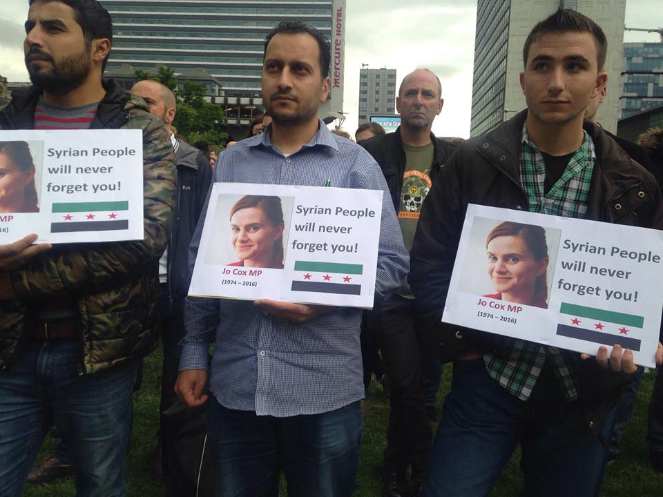

Photo: British Syrian Community of Manchester

_Converted [Medium Post](https://areyousyrious.medium.com/ays-news-digest-17-06-they-killed-my-husband-if-you-deport-us-they-will-kill-my-son-as-well-65ea5736837) by [ZMediumToMarkdown](https://github.com/ZhgChgLi/ZMediumToMarkdown)._
