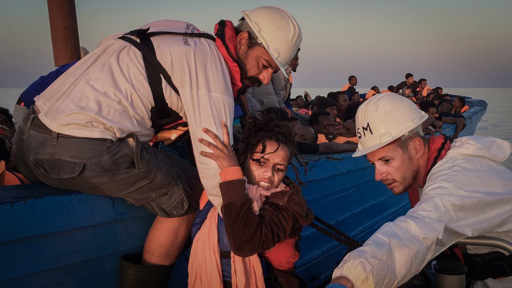
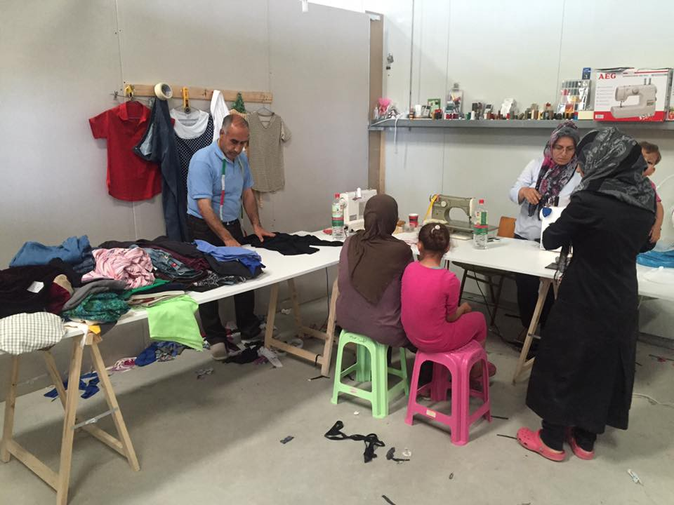
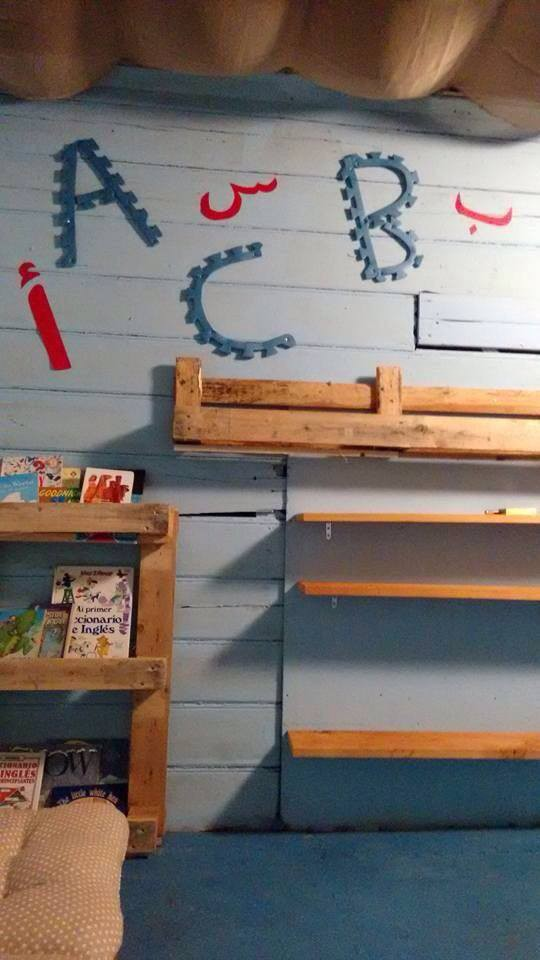
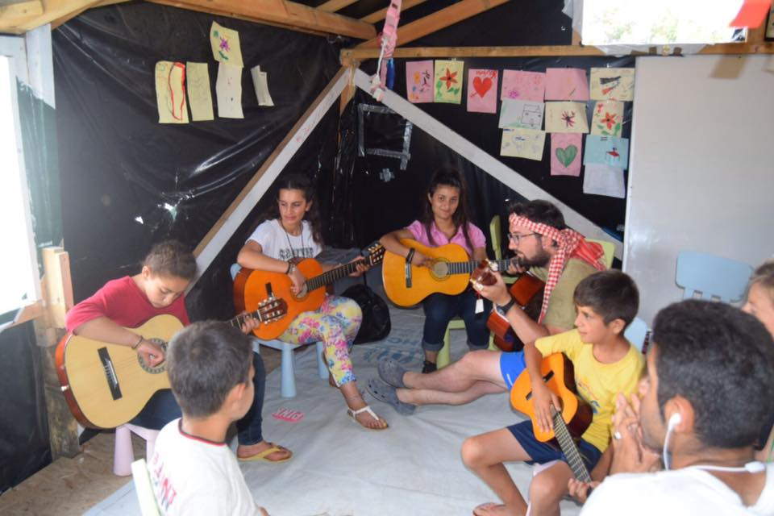
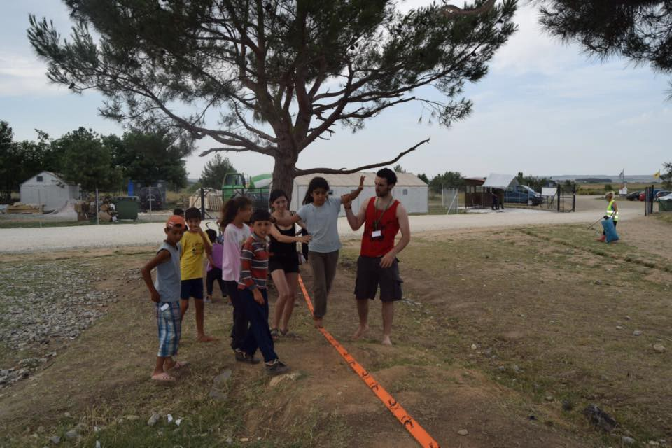
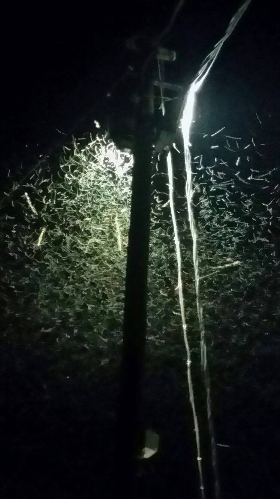
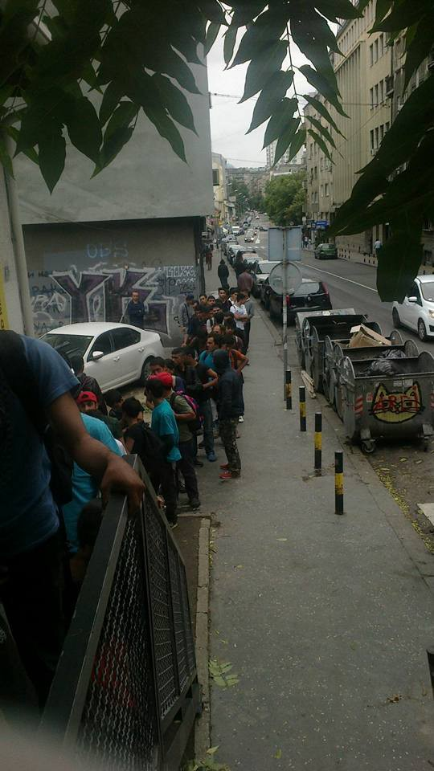
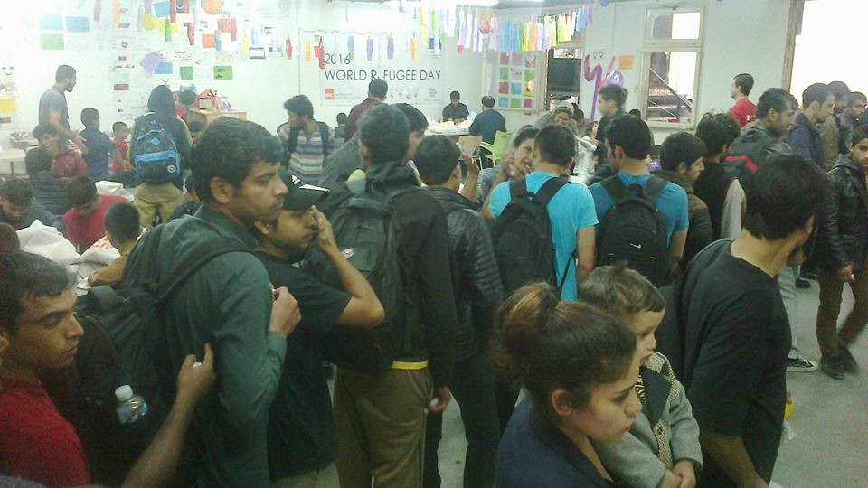

### AYS DAILY DIGEST 29/06: The number of unaccompanied children crossing the Mediterranean increases

MSF Sea photo

_While the Mediterranean route is becoming increasingly busy, two organizations are warning about unaccompanied children arriving in Italy and being placed with adults de facto detention centers\. According to the UNHCR, the number of unaccompanied children crossing the Central Mediterranean has more than doubled this year\. Meanwhile, new attacks in Syria suggest possible new refugee arrivals\. No signs of peace\. AYS supports more than 100 NGOs who signed a petition to call upon the European Commission to put a stop to its controversial migration plan\._
### SPECIAL: Children in Danger

[The European Council on Refugees and Exiles \(ECRE\)](http://www.ecre.org/unaccompanied-minors-in-the-hotspot/) warns about unaccompanied minors who are being placed in “closed” camps \(a euphemism for de facto detention centers\) together with adults\. The ECRE claims this is an open violation of Italian Constitutional law\.

The warning came after the Italian Council for Refugees \(CIR\) visited Trapani, a city on the west coast of Sicily\. By the existing law, unaccompanied children cannot be placed in detention centers or in reception centers that are designated for adults\. They should be placed under the responsibility of the municipality in which they arrive\. While adults generally remain in the hotspots for between two to six days, minors often have to stay for several weeks due to the lack of proper accommodation for them\.

The same organizations also warned about the living conditions in the centers\.

The Ministry of Labour and Social Policies officially counts 11,921 unaccompanied minors who arrived in Italy in 2015\. The year before the number was 10,536, and in 2013, there were 6,319\. This year, UNHCR claims, the number of unaccompanied children crossing the Mediterranean is twice as high as for the same period last year\. In their report [Danger Every Step Of The Way](http://www.unicef.org/emergencies/childrenonthemove/files/Child_Alert_Final_PDF.pdf) , they also write about the growing threat of abuse, exploitation, and death faced by unaccompanied children crossing the Central Mediterranean to Europe\.

According to the report:

> • Over 92 percent of the 7,567 children who crossed the sea to Italy between January 1 and May 31 were unaccompanied
 

>  • The number of unaccompanied children crossing the Central Mediterranean has more than doubled to over 7,000 in the first five months of 2016 when compared with the same period of 2015
 

>  • Unaccompanied children generally rely on human smugglers, often under a system of “pay as you go”
 

>  • Children are held behind bars — in detention centers or in police custody because of the lack of space in child protection centers
 

>  • Children often spend long periods of time in a special welfare center and many have been out of school for months or even years
 

>  • The death toll rose to 2,427 in the first six months of 2016 as compared with 1,786 in the same period in 2015
 

>  • There is no clear way of accounting for all of the almost 96,000 unaccompanied minors who applied for asylum in Europe in 2015 

The report states that the numbers may well increase in the coming months due to improved weather conditions\. Another 235,000 migrants are currently in Libya, tens of thousands of whom are unaccompanied children according to the report\.
#### Syria
### New attacks on civilians

Syrian Observatory for Human Rights reports about six people killed in the aerial bombardment in Khan al\-Shekh Reef, Dimashq province\. Among those who were killed are one child and one woman\.

According to the same source, Turkish border guards have once again opened fire on Syrian citizens who were trying to cross into the Turkish lands\. The guards allegedly shot at dozens of civilians, including women and children\. Some were wounded in the attack, and some were arrested\.
#### Mediterranean
### 65 people rescued at sea

MSF Sea team was very active again helping 65 people who were rescued from a boat near Egypt\. The ship Argos received the group of people, including 39 women, 21 kids, and a man with a broken leg\.

> “60,000 people arrived in Italy so far this year\. 0\.012% of the European population\. Europe, you can do better,” MSF Sea reminds us\. 

#### Greece
### 57,155 refugees, migrants and asylum\-seekers in Greece

According to the latest data from the Greek government, out of this number, 23,675 persons are in northern Greece, 1,703 in central, and 240 in the southern part of the country\. It is estimated that 8,643 people are scattered around the Aegean islands\.

Volunteers and refugees in many of the places are doing their best to make life in camp easier\. In the camp Karamalis, Sindos, Ali, the 55\-year\-old tailor from Aleppo, for several weeks now have opened a shop in front of the Refugee center\. He provides clothes, free of charge, for refugees who are currently living in there\.

By Youth for Refugees

In camp Sounio there is a library built by and for refugees, and in Cherso today they had a new group of volunteers who provided workshops in balancing slack line, guitar, and taking care of the garden\.

Open Cultural Center Idomeni

### HELP NEEDED\! QUESTIONNAIRE ON CAMP ACCESS FOR VOLUNTEERS

> At the moment one of the most frequently asked questions is: Can I enter camp X or Y without any problems? Do I need to register? Unfortunately, the number of camps in Greece \(mainland\) has grown so fast and information on this subject is so limited, we can’t possibly answer this question for all locations\. Therefore, we need your help\. If you’ve accessed one or more camps recently, please fill out this short survey: [https://bit\.ly/295Ene9](https://bit.ly/295Ene9) 
 

> We will collect and organize the data in order to create a comprehensive and up\-to\-date overview of the requirements for each camp, based on the info that’s already available \+ your experiences\. Results will be made public for all\. Thanks in advance for your help; it will help many other volunteers\! \! Please note: you can select Spanish or English at the top of the form\. 

> JOTFORMEU\.COM 

### Mosquitoes pose a real threat

We repeat our warning about mosquitos in camps\. Distressingly high numbers of mosquitoes plague most of the camps in Greece\. It is important for people to eliminate standing water wherever they can, as well as stay inside during dusk and dawn\. Some camps do not allow insect repellant inside of the camp, but for those that do, education initiatives need to be taken in order to promote correct usage of insect repellant\. Insect repellent contains some toxins that are harmful for human consumption\. It is imperative that people wash their hands after applying insect repellant, as well as to keep it out of eyes, away from the nose, and mouth\. In locations where the military has forbidden the use of insect repellant, volunteers are encouraged to bring in citronella oil, lemon eucalyptus oil, and lavender oil\-based sprays \(not the oils themselves as most essential oils cannot be applied topically\) \. There is conflicting research on the efficacy of essential oil insect repellant\. Regardless, for those opting to use either essential\-oil based or regular insect repellant, reapplication is crucial\.

In 2015, the range of areas afflicted by West Nile Virus in Greece only expanded, and as mosquito season continues, we can expect to see cases showing up in the camp\. The symptoms of West Nile Virus include fever, headache, body aches, rash, and swollen lymph nodes\. Severe symptoms include stiff neck, sleepiness, disorientation, coma, convulsions, and paralysis\. Individuals who suspect they may have West Nile are encouraged to report to medical care immediately\.

Picture from one of the tents in Cherso camp
#### Serbia
### Urgent help needed for Miksaliste

Photo by Miksaliste

[Miksaliste, refugee aid center in Belgrade](https://www.facebook.com/RefugeeAidMiksaliste/?fref=ts) , will be closed down on July 1st due to the lack of funding\. Organization Mikser, which is running this center, announced they are forced to ask for state help to continue working\.

They need your help\. Any help is welcome since they, again, help over 500 people daily\.

Over 500 people arrives daily to Miksaliste
### Volunteers are needed on the border of Hungary and Serbia

If you are an independent volunteer you have to find an organisation with the permission to get to the border area, otherwise you can organize activities and distribution 500 meters far from the border area where there is a shop\. The people are gathering there; you can meet them easily\.

The daily food they get is bread, 1/2 liter of water and tuna or sardines\. Doctors are urgently needed too\. At the border crossing, Kelebija, there is a camp with 300 people\. The conditions are very bad: no doctors, no showers, only 10 toilets for all the people, no sanitation workers to pick up the trash, inadequate food distribution, and temperatures around 35°C every day\.

The crossing procedure is very slow, allowing only 15 people per day\. If you are a young male without a family, after you enter you have to wait 28 days detained in the transit zone before going to a Hungarian camp\.
#### Germany
### Help needed for refugees traumatized by right\-wing attacks

A German victim protection organization has called for more therapy to help traumatized refugees, Deutsche Welle reports\. One of the reasons is the rise in attacks against refugee shelters\.

> “When refugees who come from war zones are attacked again, it is the duty of the Federal Office for Migration and Refugees to ensure psychotherapeutic care,” Weißer Ring national chairwoman Roswitha Müller\-Piepenkötter told the daily “Neue Osnabrücker Zeitung\.” 

There is a shortage of trained trauma therapists in Germany, Müller\-Piepenkötter claims\.

Germany’s domestic intelligence service \(BfV\) released data which shows a 42 percent increase in violent attacks by far\-right extremists in 2015, including 894 crimes committed against refugee shelters — five times as many as were committed in the previous year\. The report said that these attacks did not generally appear to be systematically orchestrated, though many of the arson attacks did bear signs of careful planning and preparation\. Germany is home to an estimated 11,800 violent far\-right extremists, the report added\.
### German soldiers engaged with refugees

German military, 1450 soldiers, and employees, are involved in the work with refugees, the newspapers of Funke\-Mediengruppe reports\. According to the same source, the military has put more than 2\.2 million hours in refugee relief since June 2015\. Among other things, military provided 170,000 accommodation spaces, distributed 1 million meals and transferred 200,000 refugees in 4,300 tours\.
#### Latvia and Lithuania
### New arrivals of asylum seekers from Greece

On Tuesday, [18 people from Greece](http://m.baltictimes.com/article/jcms/id/137053/) arrived in Latvia under the international relocation program, according to the Office of Citizenship and Migration Affairs\. So far Latvia has taken in a total of 47 people under the EU relocation program\. The arrivals are from Syria and are accommodated in the refugee center in Mucenieki\. Among the arrivals there is a farmer, a car mechanic, an engineer, a teacher, a social worker, and a designer\. Latvia has agreed to accept 531 refugees from other European Union countries\. Most of these refugees will come from Greece and Italy, as well as Turkey\. Latvia will relocate the refugees within the next two years, which means that approximately 30 asylum\-seekers could arrive in Latvia per month\.

The day before, seven people arrived at Lithuania, all coming from Greece\. Lithuania has so far taken in 26 of the 1,105 refugees it has pledged to take in over two years\.
#### General
### Dark chapter in EU history

[More than 100 NGOs signed a petition](http://www.refugeecouncil.org.uk/latest/news/4666_reject_dangerous_migration_response_plan_more_than_100_ngos_tell_eu_leaders) warning the European Union against opening “dark chapter in its history”\. A coalition which includes Are You Syrious is calling upon the European Commission to put a stop to its controversial migration plan\.

> “The plan proposes using aid, trade, and other funds to encourage countries to reduce the number of migrants reaching EU shores\. It was put forward by the Commission at the beginning of June and will be discussed by European heads of state and government at the EU summit in Brussels this week\.
 

> It is inspired by the EU\-Turkey deal which has left thousands of people stranded in Greece in inhumane and degrading conditions\. Children are particularly affected, with many hundreds of unaccompanied children being held in closed detention facilities or forced to sleep in police cells\. 

> According to a coalition of 104 human rights, humanitarian, medical, migration and development agencies, Europe risks torpedoing its human rights foreign policy, and undermining the right to asylum internationally\.” 

EU leaders will discuss the plan this week at a summit in Brussels\. Meanwhile, [draft conclusion leaked into the media and published by the Statewatch\.org](http://www.statewatch.org/news/2016/jun/eu-council-draft-summit-conclusions-28-29-june-8471-16.pdf) \.
### Jobs for Arabic speaking refugees

The US\-based tech startup [NaTakallam](https://natakallam.com) \(“we speak” in Arabic\) is helping Arabic\-speaking refugees find work teaching online\. It is a Skype\-based Arabic language service co\-founded last year by Lebanese\-American Aline Sara\. It connects refugees and other Arabic speakers with Arabic students around the world\.

Students who wish to sign up for the NaTakallam can fill out a questionnaire on their web site\. They will be paired with a conversation partner\. Private virtual lessons cost 15 dollars an hour\. For more information [info@natakallam\.com](mailto:info@natakallam.com)
### Weather forecast for Thursday 30 June & Friday 1 July

High wave warning for mid\-Mediterranean, Lybia to Syria route\. Waves up to 1\.5m high\. Moving generally Westward both days, waves at your right\. Winds: Variable, between 17 and 28 kph, gusts up to 47 kph, blowing Westward both days\. Waves over 0\.5 meters are considered dangerous\. Hot weather continues over the Balkan route with up to 34˚C in Greece, 32 in Serbia, and 29 in Hungary and Serbia\. Report by SAO\.
### AYS needs you

Our friend Rando Wagner set up a crowdfunding site for AYS\. Please, consider donating to support our work\.

[https://www\.gofundme\.com/areyousyrious](https://www.gofundme.com/areyousyrious)

_Converted [Medium Post](https://areyousyrious.medium.com/ays-daily-digest-29-06-the-number-of-unaccompanied-children-crossing-the-mediterranean-increases-30deaf5a2425) by [ZMediumToMarkdown](https://github.com/ZhgChgLi/ZMediumToMarkdown)._
