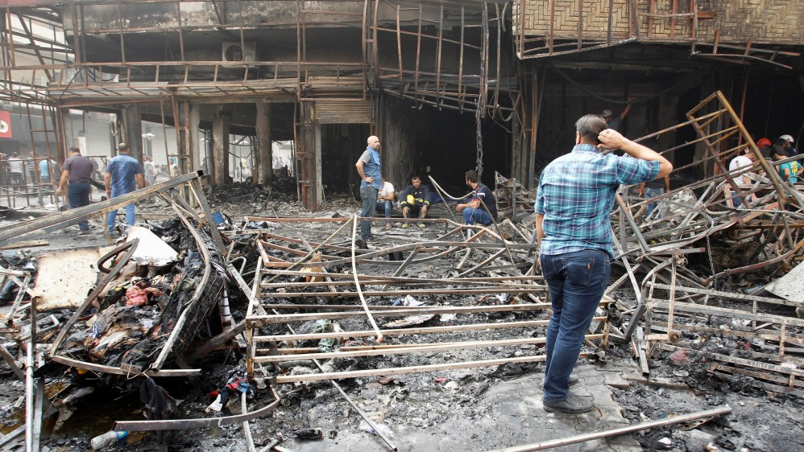
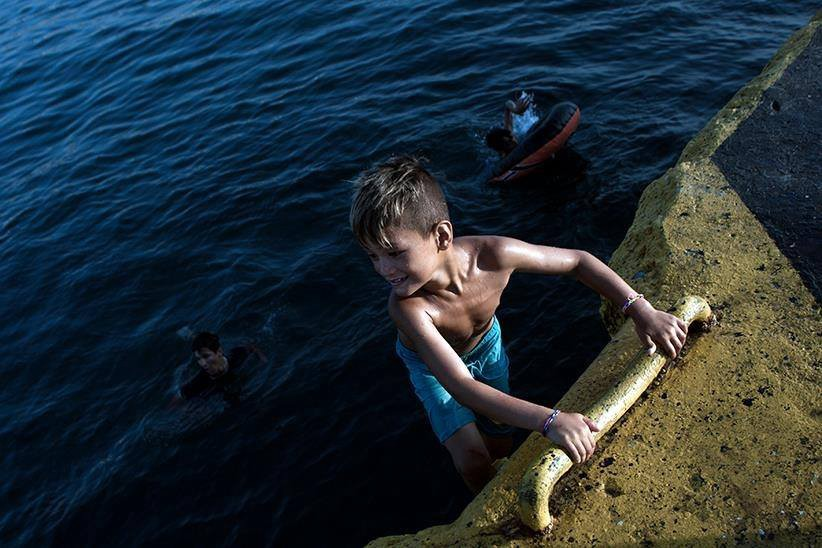
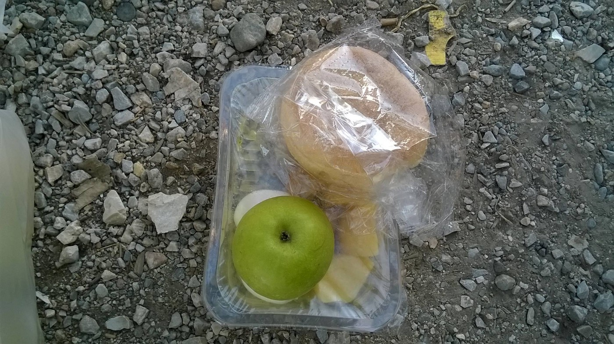
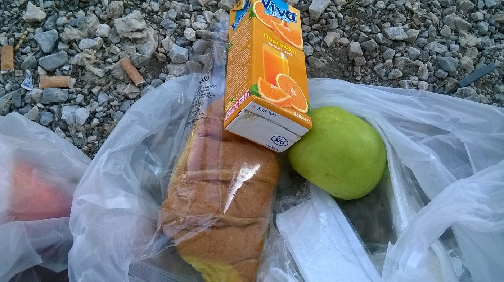
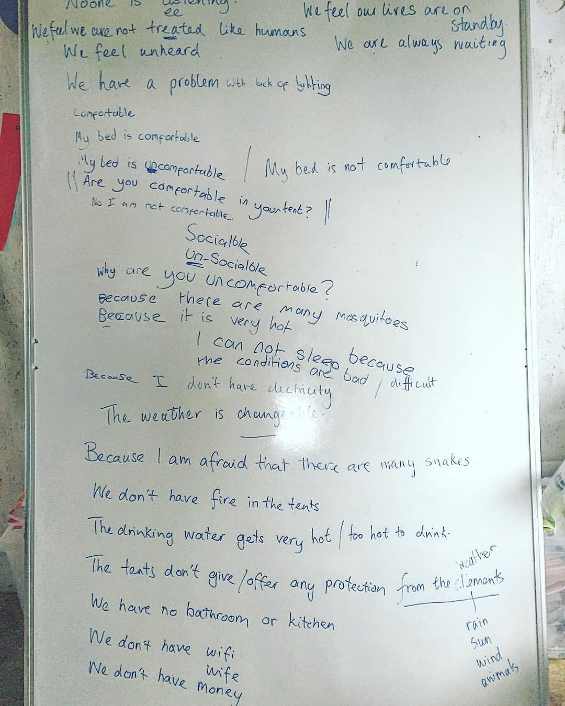

### AYS DAILY DIGEST 7/3: The death tolls continues to skyrocket\.
#### ISIS launched a deadly attack on a Baghdad market today, killing over 100 people\. 43 were also killed as a result of government airstrikes on a Syrian town, and ISIS had abducted tens of people from their homes\. 16 also died while crossing the Mediterranean\. With all of these tragic casualties happening in the course of a single day, it is important to remember how precarious life is for millions people around the world\. Calls for volunteers in Greece and info for those heading toward Serbian\-Hungarian border\.

The aftermath of the deadly bombinb in the Karada District\. Photo credit: Reuters
#### Iraq
### ISIS car bombs in a Baghdad market have killed at least 131 people and wounded another 200\.

The attack came in the final days of Ramadan during the early hours of the day, when families congregate together outside\. The larger of the car bombs hit a shopping street in Karada district, in central Baghdad\. It is important to note that the neighborhood is predominantly Shia, as ISIS targets Shia Muslims in particular\. A second bomb went off in the Shia majority al\-Shaab neighborhood, killing five and wounding 16\. ISIS has claimed responsibility for the attacks, making this one in a long string of massacres which the terrorist group has perpetuated against Baghdad, as well as the world at large\. These attacks come in light of ISIS’s complete defeat by the Iraqi army in Fallujah\.
#### Syria
### Regime airstrike against town of Jayrud have killed at least 43 people\.

The town, located near Damascus, became the target of Syrian regime bombing in the aftermath of the execution of an air force pilot\. The town had for two years up until that point a truce with the regime, but the killing of the pilot brought this to an end\. The town became a haven for internally displaced persons as a result of the arrangement, but the brutal retaliation may unfortunately lead to a change in the situation on the ground\.
### ISIS is abducting Syrians\.

Tens of people were abducted in al\-Bab village north of Aleppo, taking them to an unknown location\. Sources suggest that ISIS has arrested around 1,000 people in the past two weeks, which is believable given the increasingly paranoid nature of the terrorist group in light of massive defeats\.
#### Turkey
### Erdogan reveals Turkey’s intention to offer citizenship to Syrian refugees\.

The announcement was made on Saturday evening during an iftar, evening meal during month of ramadan, in the town of Kilis, which has seen its population double in size as a result of the arrival of Syrian refugees\. “Among our brothers and sisters, I believe there are those who would like to obtain citizenship of the Turkish Republic\. Our interior ministry is taking steps in that regard\.” He added: “Turkey is your home, too\.”

The specifics of the plan remain unclear, and such a move would likely spark tensions within Turkish society\. Opposition parties believe that such a move would lead to an increased number of people voting for Erdogan’s AKP party\.

Such a move also seems questionable in a time when hundreds of thousands of Syrians in Turkey are living in dreadful conditions, with their status as refugees meaning nothing in a country that rather than referring to them as refugees and accept the implications thereof under international law, refers to them simply as “guests”\. It is difficult to obtain a legal work permit, and those Syrians who work are often heavily exploited by their employers\. Children are often unable to attend schools, and amenities such as healthcare are often difficult to come by\. While the plan may lead to an improvement in the lives of some refugees, a complete overhaul of the current system is necessary to ensure that Syrian refugees may live in dignity, with or without citizenship\.

Refugees swim in the polluted water of Piraeus to escape the heat\. Photo Credit: Aggelos Barai
#### Greece
### Over 15,000 refugees in Greece have received their temporary residency cards\.

These cards give the recipients the right to remain in Greece for an additional year for their case to be more closely examined\. The pre\-registration campaign was launched on June 8 by the Greek Asylum Service with UNHCR’s supporting, and the numbers demonstrate that it has been quite successful thus far\. The pre\-registration plan aims to reach the 49,000 refugees in Greece who entered the country from January 2015 through March 2016\. Prior to this campaign, many of the refugees in Greece were there “illegally”, meaning that they could be arrested as a massive miscarriage of justice, although in practice this has thankfully seldom happened\. Pre\-registration is the first step in a wide range of procedures, such as relocations into other EU countries, of which there have been very few this year\.
### Food remains inadequate in the camps\.

A picture says a thousand words\. These daily rations, distributed in Cherso, are clearly far too small\.

Food portions at Mazaraki military camps in Cherso, Greece\.
### Call for volunteers to Ellinikon warehouse

Ellinikon warehouse will be closed every weekend in July\. However, volunteers are still needed to help sorting donations from Monday to Friday 11am to 6pm\. More info [here](https://www.facebook.com/groups/204202716585823/permalink/307936442879116/?__mref=message_bubble) \.
### Refugees about life in camps

English teacher in the camp, during the class for the adults English class, asked people living in the camp about condition\. The writing says it all really\.

Refugees about living conditions in camps\. Photo by Amanda Grady
#### Bulgaria
### Turkey is refusing to take back refugees who cross into Bulgaria\.

Of 314 transfer requests, Turkey yielded only 11, meaning that Turkey is reneging on the agreement which it signed with Bulgaria in May\. The Turkish government has not formally disavowed the agreement, but is instead simply blocking requests and not issuing a statement to explain what is happening\. The Bulgarian\-Turkey agreement is part of the framework of the larger EU\-Turkey deal, which increasingly looks to be teetering as a result of Europe’s insistence that Turkey loosens its anti\-terror laws, often used to repress journalists and other dissidents, before the agreed upon visa\-free travel is implemented\.
#### Serbia
### Refugee minors are endangered by smugglers\.

Refugee minors are entering arrangements with smugglers in Belgrade\. Smugglers are making them work for them in Belgrade in order to smuggle them to Hungary\. There is an increased number of substance abusers among young refugees and minors in Belgrade\. Young refugees who are traveling alone are under pressure by their families to reach Europe as soon as possible and find job there so they can help their families\. There are many reports by UNHCR of young refugees in Kelebija and Horgos who have been sent by their families from Belgrade to get a “number” in a queue to cross the border legally for the whole family\. They are telling UNHCR that family will be arriving soon\. UNHCR is reporting increased number of refugees who are being pushed back from Hungary\. However, only refugees who are crossing the border via smugglers, illegally, are being pushed back\.
#### Hungary
### A message from a Migszol regarding the trials of protesting refugees\.

We received in our inbox a new report about “Röszke trial” related to the events on 16th September 2015\. 11 people are on trial accused by the government for participation in “mass\-riot”\. According to human rights activists, the accused were brutally beaten up and arrested in a riot police attack at the serbian\-hungarian border Röszke/Horgoš 2 \(after the fence was completed and the border was closed down\), when about 5000 people were protesting and demanding their right to free movement\.

> “The local court found all 10 guilty\. Six of the accused got 1 year and 2 months long prison sentences and a year’s expulsion from Hungary\. The seventh accused, the one who was talking to a megaphone for 10 minutes, got a 3 year long prison sentence and 10 years of expulsion\. The rest of the accused are Fathoum the older lady, Faisal, the man in wheelchair and the other older man got suspended prison sentence\. Fathoum can stay in Hungary because she already has international protection, Faisal and the other man who has health problems got expulsion for 2 and 4 years\. Since they are in prison for 9 and a half months, after serving two thirds of of the sentence, they can have a conditional release\. This means that the first 6 accused should be released soon, on the court it was decided that except the man who talked into the megaphone, the others will be released until the next, second level trial\. 

> The decision is not final, the prosecutor made an appeal against the decision and asked for severe sentences for all of the accused, even for the three vulnerable cases \(the three who got the suspended prison sentence\) he asked for the prison sentence to be carried out\. The decision did not prolong the emergency measures of the imprisonment during the waiting period until the next trials\. The latest, not official information that we got about three accused is that even though the authorities have no right to keep them in prison anymore, they imprisoned them again, because “they might escape”\. 

> We cannot and will not accept it\. We organize a demonstration on Monday in Budapest in front of the building of the Upper Court \(Kúria\) \. It will take place at 18:30, 16 Markó street\! Come if you can\! Share the event\! Resist\! 

> [https://www\.facebook\.com/events/1343563382338579/](https://www.facebook.com/events/1343563382338579/?hc_location=ufi) 

[Here you have a detailed description of the trial](http://www.migszol.com/.../show-trial-in-hungary...) written by Migszol before the trials of the last week\.
### For all the volunteers heading toward Kelebija or Horgos

> Volunteers interested in assisting in Kelebija and/or Horgos are strongly encouraged to read and listen to the experiences of volunteers currently on\-site in order to find the best way to deliver aid\. Although the situation remains dire, this new attention in media will surely bring new waves of support and/or volunteer interest, and it is of utmost importance that chaos is kept to a minimum in order to best support the community of refugees there\. 

> A volunteer network has emerged that notifies volunteers on\-site of incoming refugees\. 

#### The Mediterranean
### 16 people have drowned today, 578 were saved and taken to Sicily, according to MSF\.

The wave of refugees continues, with hundreds if not thousands crossing the Mediterranean each day\. 16 people were not so lucky, as a vessel departing from the Libyan shore capsized, killing more than half of those hoping to make the journey\. This brings the number of refugees killed in 2016 as a result of the Mediterranean crossing to 2,859\.
### AYS needs you

Our friend Rando Wagner set up a crowdfunding site for AYS\. Please, consider donating to support our work\.

[https://www\.gofundme\.com/areyousyrious](https://www.gofundme.com/areyousyrious)

_Converted [Medium Post](https://areyousyrious.medium.com/ays-daily-digest-7-3-the-death-tolls-continues-to-skyrocket-6aafd13aaf30) by [ZMediumToMarkdown](https://github.com/ZhgChgLi/ZMediumToMarkdown)._
