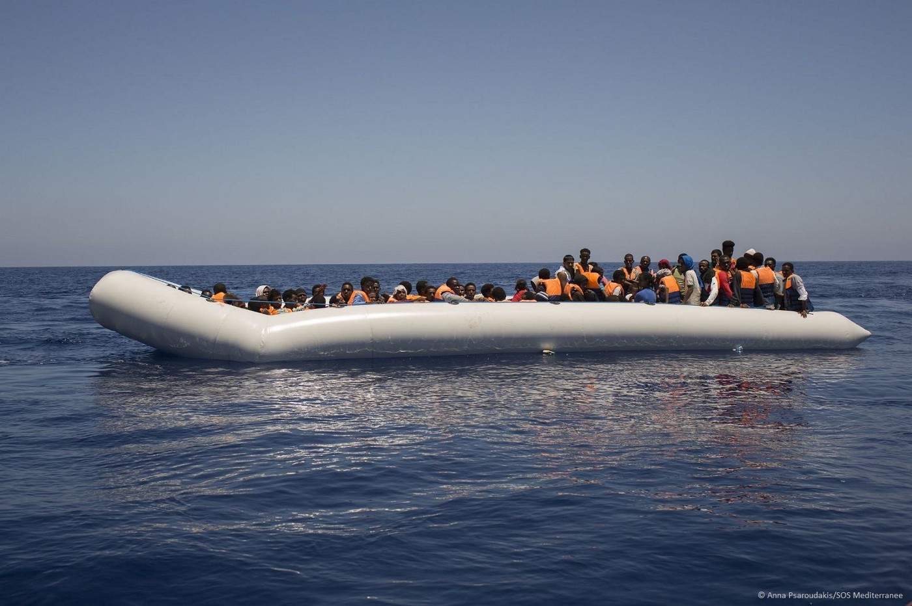
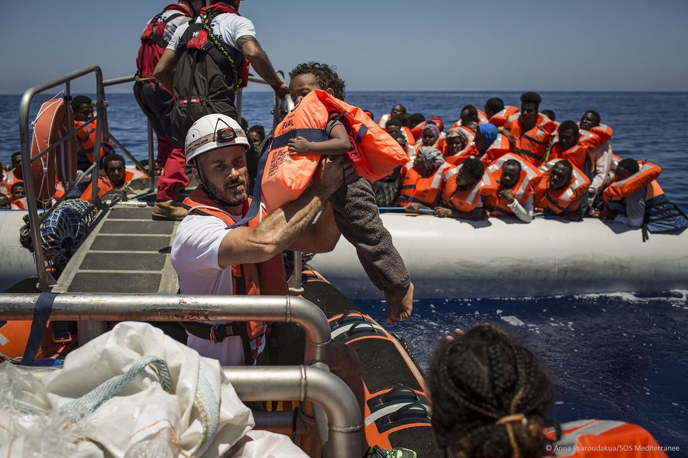
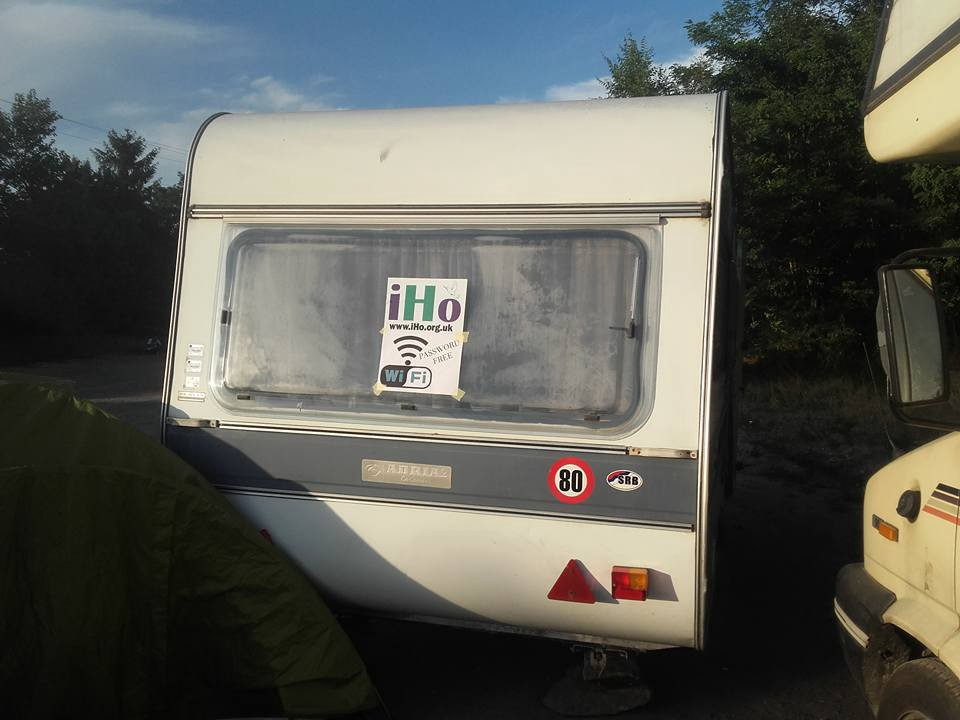
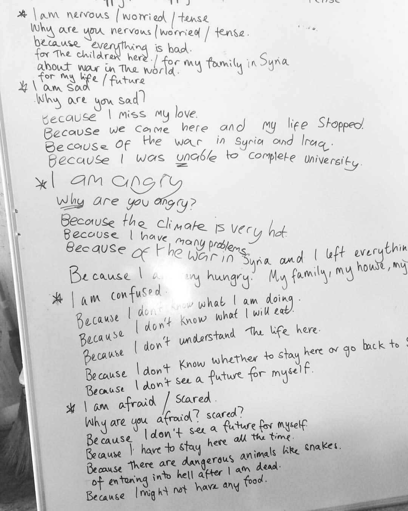
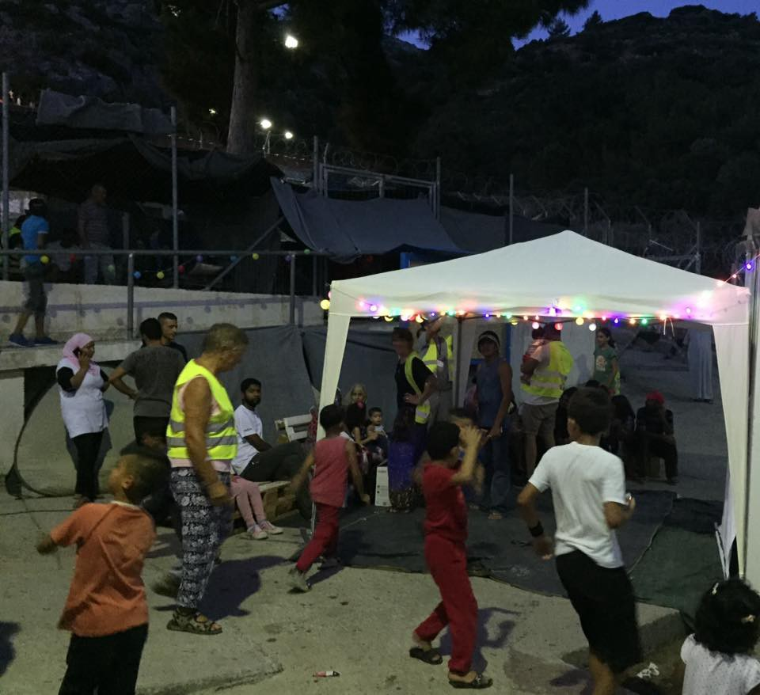

### AYS DAILY DIGEST 05/07: Hundreds of unaccompanied children among refugees in Greece

_In less than a month, 15,500 people were pre\-registered in Greece, including many children who are traveling alone\. In Italy, police discovered a huge organ trafficking ring\. One of the witnesses told the police that people who can’t pay for passage to Italy are sold to people who kill them and then sell their organs\. Help needed in Greece, Serbia, Hungary, France…_

MSF and SOSMedFrance today rescued 23 children from the rubber boat
#### Mediterranean

**120 people rescued from a rubber boat**

People were saved in a joint operation by MSF and SOSMedFrance\. Nearly one quarter \(23\) of those rescued are children traveling alone\.

Safepassage\. Photo MSFsea
### Human trafficking ring discovered in Italy

While the number of people who are trying to enter Europe is increasing every day, and borders remain closed, the smugglers are those who are profiting the most\. [Italian media](http://www.ansa.it/english/news/general_news/2016/07/04/traffickers-sell-organs-of-migrants_10fd1c95-2416-4a77-88af-ccd1f8635f58.html) are reporting about human trafficking ring was discovered by the Italian police in the city of Palermo\. According to the media reports, a former member of a migrant trafficking ring told police that people who can’t pay for passage to Italy are sold to people who kill them and then sell their organs\.

The Palermo anti\-mafia squad on Monday put 38 people in detention across Italy in connection with a migrant trafficking ring based in Rome\. The investigation has been going on for three years and has resulted in several convictions\.
#### Libya
### 2\.44 million people in Libya need protection, the UN warns

Since the beginning of the war against terrorism in Libya, the chaotic political and military situation has made access to basic necessities such as food, shelter, cash, electricity, and water extremely difficult in most parts of the country\. [The UN warns](http://www.irinnews.org/opinion/2016/07/05/aiding-libya-view-ground) of increases in prices of goods and commodities\. The healthcare system is also on the brink of collapse\. Conditions like these cause a huge number of people to leave their homes\. This has received scant attention, with the war on ISIS consuming the lion’s share of news coverage\.
#### Greece

**680 unaccompanied children identified**

According to the government numbers, there were 56,984 refugees and migrants today in Greece\.

In the pre\-registration process, which began on June 8th, 680 unaccompanied children were identified among 15,500 people who were pre\-registered by the Greek Asylum Service\. This is according to the UNHCR which provides support during the process\. The process is aimed at pre\-registering claims for asylum, family reunification, and relocation\.

The cards that were given to pre\-registered asylum seekers will allow them to: reside legally in Greece until the Asylum Service makes a final decision on their cases; freely move within Greece \(but not to leave the country\); access health care, paying a small fee for services and medicine; and enable registered asylum seekers’ children to attend school\.

The aim is to pre\-register 49,000 people living in organized sites on mainland Greece\. The pre\-registration process is expected to be completed in August\.
### Help for mothers in camps needed

The Amurtel project is giving out supplemental food packages for pregnant and breastfeeding moms at the Piraeus Stonehouse\. They provide 50–60 packs, 5–6 days a week\. Today they issued a call for donations of nuts and dried fruit\. For more, find them [on FB](https://www.facebook.com/AMURTEL-Ananda-Marga-Universal-Relief-Team-Women-Children-324948791060/) \.

> “ If anyone would like to supply some bulk nuts, seeds, or dried fruit of any kind, please bring them by the Amurtel caravans outside of Stonehouse or contact one of us to arrange pickup\. The Amurtel team can then break them into small bags for the women, or if you/your team are so inclined, you can package them in individual bags for our ladies\.” 

In Veria Camp baby milk powder is desperately needed for ages 0–12 months\. Veria is a camp run by local volunteers, who look after around 400 refugees\.

> Please help if you can and post baby milk to:
 

> Stratopedo Armatolou Kokinou
 

> Attn: Efi Kousidou/Christina
 

> 59100 Veria, Greece 

#### Serbia\-Hungary border
### Warning for volunteers heading toward the border

With the increase of the people at the border, there is more need for volunteers\. For all of you heading toward the border between Serbia and Hungary, please keep in mind that it is a dangerous border and volunteers need either to speak Serbian and/or Hungarian or have a reliable translator on site\.

Before thinking of going, check out [the new FB page](https://www.facebook.com/groups/576116159234354/) and connect with those already working there\.

If you are an independent volunteer, you will have to find an organization which has permission to get to the border area\. Alternatively, you can organize activities and distribution 500 meters away from the border area where there is a shop\. People are gathering there; you can meet them easily\.

We also received a message from all volunteers from Hungarian Helsinki Committee \(HCC\) \.

> “Dear Volunteers, please take some time to have a look at this\. If you’ve got any questions, feel free to get in touch with me here on FB or at [andras\.lederer@helsinki\.hu](mailto:andras.lederer@helsinki.hu) \. Thanks\! Since the beginning of this spring, the Hungarian Helsinki Committee \(HHC\) has been receiving a growing number of alarming reports from asylum\-seekers and various NGOs and individuals working at the Hungarian\-Serbian border about serious abuses and ill\-treatments committed against asylum\-seekers\. While these reports show a clear trend of increasing violence, more specific information is needed to trigger the authorities’ action to investigate abuses\. The HHC is releasing the “Reporting form on abuses committed at the Hungarian border” in order to provide a structured and standardized framework for NGOs and volunteers to report such incidents\. Our aim is to allow people to conduct interviews with victims of violence in a way that enhances the HHC’s work towards eliminating ill\-treatment against migrants and refugees\. The form can be downloaded [here](http://www.helsinki.hu/wp-content/ /react-text …/Form_to_Report_Abuse.pdf) \. 

> Completed forms should either be sent to us with any additional relevant materials \(photos, scans, videos, voice recordings\) to [helsinki@helsinki\.hu](mailto:helsinki@helsinki.hu) or you can fill it out online [here](http://goo.gl/forms/39IbPHaUzm3WwTp73 /react-tex) \. 

> The HHC keeps all personal information shared with the HHC fully confidential and will not disclose them to third parties\.” 

### Free Wi\-Fi at the border

IHO team is at the border helping to refugees to stay in touch with their friends and family

In the meantime, I’m Human Organization \(IHO\) arrived today to the border where they will provide different types of help\. The first step was to provide Wi\-Fi, free internet access, and communication tools \(such as laptops, phones, and phone charging\) \.
#### Hungary
### Referendum on EU plans to relocate refugees and migrants among member states

Hungary has made zero places available but is meant to take in 1,294 people\. The referendum will be held in October\. This is another victory for the Hungary right\-wing government who have been leading a massive pre\-referendum campaign for several months\.

Voters will be asked: “Do you want the EU to prescribe the mandatory relocation of non\-Hungarian citizens to Hungary without the approval of the Hungarian parliament?”

The right\-wing argument is that the plan violates its national sovereignty and that “terrorists” might enter the country disguised as refugees\.

The actual relocation plan is going extremely slowly and as of July 1st, fewer than 2,800 people have been relocated\.
#### Croatia
### The Mayor of Zagreb promised to help asylum seekers accommodated in Porin Hotel

After several e\-mails coming from different organisations, and following our pre\-agreement with City of Zagreb officials, the mayor has publicly promised to solve some of the lingering problems for asylum seekers: access to public transport and cleaning up the garbage around Porin Hotel, where 228 refugees are accommodated \(including 40 children\) \. Yesterday, our volunteers had a conversation with the mayor in front of Porin, where he arrived to celebrate the end of Ramadan with Muslim refugees\. He promised to fulfill our requests “within days”, immediately confirming it front of the cameras\.

Luka, Nancy and Marko of AYS after getting a promise from the mayor
#### France
### Call for volunteers in Calais

[The Little Ashram Kitchen](https://www.facebook.com/LittleAshramKitchen/) is calling for help\.

> “It has been a very long month for all of us but as 5 long\-termers, we feel that we might need some fresh energy to help us prepare earlier in the mornings and getting back into normal services for larger number of people during the day\.
 

> We are looking for people who can come and work with us for at least a week or more, who have high energy and are friendly and out\-going\! We are also looking for one or two long\-term volunteers who are prepared to dedicate at least a month or longer of their time to help run and organize Ashram and potentially take over some of the roles of some of our current team\. Please let us know about any relevant experience you may have\. Anyone who wants to come and join us at Ashram please drop us a private message with your email, age, and any relevant experience and we will get back to you as soon as we can\.” 

#### General
### Refugees should be allowed to work in Europe

The European Parliament adopted a non\-binding resolution calling for all member states to allow refugees and asylum seekers to work in their host countries\.

The idea is that this move “not only helps to restore their human dignity, but also reduces strain on public budgets by turning them into taxpayers”\.

The resolution was approved with a vote of 486 — 189, with 28 abstentions, so there is hope that some politicians in Europe are ready and willing to take different approaches\.

The resolution also stresses that “since youth and long\-term unemployment are still at alarming levels in some countries and regions, assistance to refugees and asylum seekers should not be financed at the expense of programs for other disadvantaged groups,” but the additional funding is proposed\. The MPs opposed the idea of creating special labour markets for refugees and argue that the national minimum wage should also apply to refugees\. Finally, it concludes that “the fight against all forms of discrimination, xenophobia and racism should be stepped up”\.
### More border and coast guards for the EU border agency Frontex

According to the plan, Frontex will have a pool of 1,500 guards\. Germany will contribute 225 guards, followed by France \(170\), and Italy \(125\) \. Malta will contribute the fewest with six while Cyprus and Luxembourg will provide eight each\.
### Eid Mubarak

Today is Eid UL\-Fitr and many people are celebrating it far away from their homes, their families, their friends, whether due to being refugees or migrants or being volunteers are who helping them\. We wish Eid Mubarak to all of you, peace and happiness\.

Did Eid UL\-Fitr is one of the most important holidays for Muslims\. It marks the end of the fasting month of Ramadan\.

In camp Cherso, today during the English class, they talked again about how refugees feel living in the camp and waiting\. Their words speak to us all and remind us about solidarity with those in need and to speak loudly against wars\.

Photo by Amanda Grady

At different places, refugees and volunteers celebrated Eid\. Samos volunteers organized celebration with homemade sweets with the tea and coffee and watermelon, and all the children received an Eid gift including soft toys and coloring books\.

Time for celebration\. Samos Volunteers photo
### AYS needs you

Our friend Rando Wagner set up a crowdfunding site for AYS\. Please, consider donating to support our work\.

[https://www\.gofundme\.com/areyousyrious](https://www.gofundme.com/areyousyrious)

_Converted [Medium Post](https://areyousyrious.medium.com/ays-daily-digest-05-07-hundreds-of-unaccompanied-children-among-refugees-in-greece-750f88e0659b) by [ZMediumToMarkdown](https://github.com/ZhgChgLi/ZMediumToMarkdown)._
