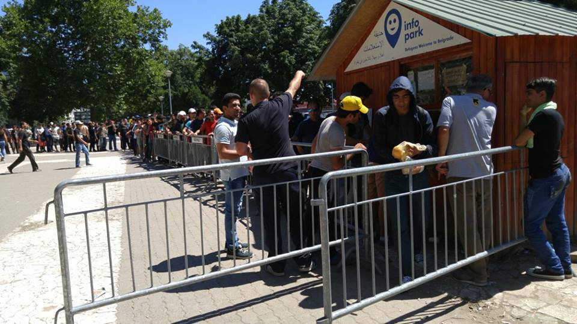
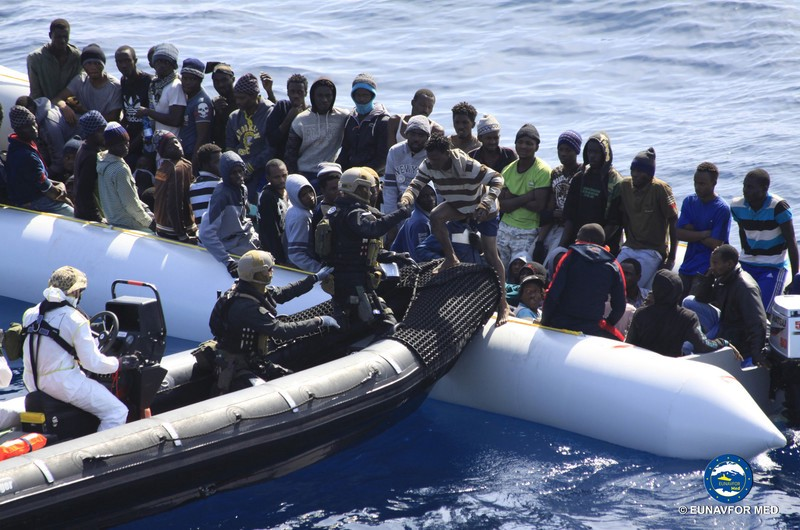
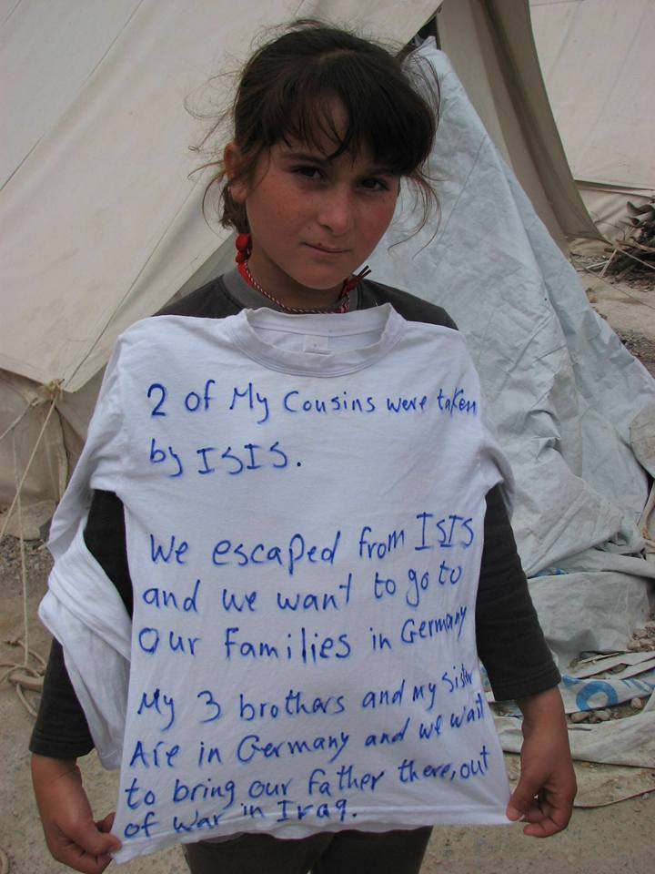
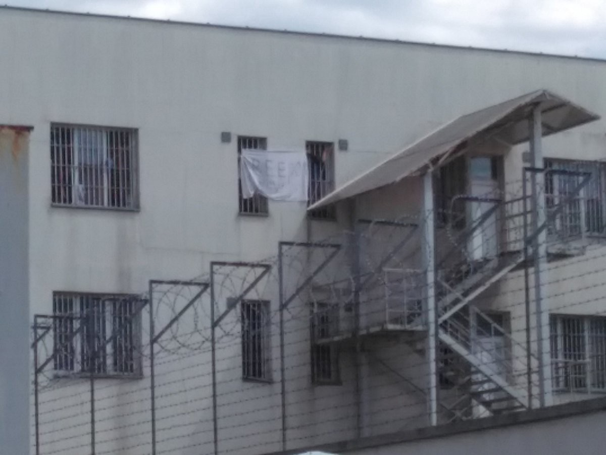

### AYS Digest 11/7: More border controls, less solidarity

Security barriers are in the place all around Info Park hut\. The queues are longer than ever, all the way through the park\. Photo: Info Park
#### General
### **Nato to launch operation Sea Guardian**

On the last day of a summit in Warsaw on Saturday, NATO head Jens Stoltenberg unveiled the new NATO project to be called operation Sea Guardian\. NATO warships and potentially drones are to help the EU control migrant flows across the Mediterranean in what critics have called the “militarization of a humanitarian crisis”\.

Rescue operations in Medditerenian\. Photo taken form euobserver web site
### **“Negative natural change” in Europe**

A new Eurostat report came out showing that, for the first time in its history, more people died in the EU than were born during 2015\. It is the first time the EU has recorded a “negative natural change” of its population\. The low birth rates were, however, offset by net migration\.
#### South Sudan
### **272 people have died in fighting between South Sudan’s rival factions**

As NATO is preparing to “secure” fortress Europe, there is more unrest in Africa\. There are reports of increasing violence in South Sudan and its capital city Juba, raising concerns that the country is heading to war again\. At least 272 people have died in fighting between South Sudan’s rival factions in the capital, including 33 civilians, a government source said on Sunday\. Heavy gunfire erupted again in the city and many residents sought shelter at a UN base\. In a press statement, the UN Mission in South Sudan reported that heavy fighting in Juba town, often in close proximity to the UNMISS compounds at UN House Jebel and Tomping, had prompted approximately 1,000 internally displaced people to flee from the UNMISS Protection of Civilians site \(PoC\) 1 into the UNMISS compound at UN House Jebel\. \[Civilian protection sites have been up and running in various parts of South Sudan for the past two years and according to its most most recent update, UNMISS estimates that the number of civilians seeking safety in the six sites located on UNMISS bases is 169,418\. \]
#### Syria
### **City of Darraya in Syria is under heavy artillery and on the brink of falling\. If that happens, a lot more bloodshed and tragedy is expected\.**

#### Greece
### **56,853 of people stranded in Greece\. Pre\-registration in camps with unknown result\.**

With the number of people stranded in Greece still not dropping \(currently 56,853 are stuck in this country\), and the summer getting hotter and hotter, there is not much good news to report on\. We are receiving reports of pre\-registration in some camps, but the results of pre\-registration are still largely unknown\. One volunteer reports the atmosphere in Vasilika camp as the pre\-registration day came: “You can sense a respect for institutions \(more respect than I have for those same institutions, seeing how they dishonor themselves on a daily basis\), and for the rare opportunity to be interviewed\. Mothers have dressed up their children with their best clothes and I witness the hair combing, the curly pig tails, the excitement of the little girl showing off her favorite dress \-white with navy blue embroideries,\- the clean outfits wiping the floor as soon as mum’s eyes get distracted”

Photo: Basel hilft mit
### **Unbearable heat in the tents**

The Housing Project reports of unbearable heat in the tents and babies as small as 6 days old suffering the crippling heat\.
### **Flying help organization asking for donations**

On a more positive note, we can bring you some news of how you can help: Flying help organization that is supporting refugees on the island since the summer of 2015 in co\-operation with locals\. The group organizes rides to doctors, visits hotspots, creates programs for unaccompanied minors, and so on\. Flying Help is asking for donations\. Check them out at on their website: [www\.flying\-help\.de](http://l.facebook.com/l.php?u=http%3A%2F%2Fwww.flying-help.de%2F&h=7AQG51ta3)
### **Job openings**

Alos, the ARSIS — Social Support of Youth launches 50 jobs with fixed\-term contracts under the program “Support to Refugees in Greece through Integrated Shelter Model — Rapid Mobility Solution \(ISM — RMS\)”\. The program will be implemented in Thessaloniki in cooperation with the ASB and WAHA and funded by the European Union\. Anyone interested is invited to email their CV and a cover letter to [infothes@arsis\.gr](mailto:infothes@arsis.gr) , with the subject “POSITION”\. Applications will be accepted until 19/07/2016 at 15:00 \. For more, follow the link [http://arsis\.gr/](http://arsis.gr/) or look at the official [PDF](http://arsis.gr/wp-content/uploads/2016/07/%CE%A0%CE%A1%CE%9F%CE%9A%CE%97%CE%A1%CE%A5%CE%9E%CE%97-%CE%A0%CE%A1%CE%9F%CE%A3%CE%9B%CE%97%CE%A8%CE%97%CE%A3-%CE%A0%CE%A1%CE%9F%CE%A3%CE%A9%CE%A0%CE%99%CE%9A%CE%9F%CE%A5.pdf) \.
#### Serbia
### **Park in Belgrade full, much more help needed**

With the infrastucture in Belgrade getting worse, it’s becoming more difficult to support everyone who needs help\. [Refugee aid Serbia](https://www.facebook.com/refugeeaidserbia/?hc_location=ufi) is asking for donations\. The Info Park crew is reporting on unbearable conditions for people who work there\. It seems that another aid worker was attacked yesterday\. They are calling for stronger involvement from aid organizations to shoulder increasing numbers of people in the Park\.
#### Bulgaria
### **Freedom now\!**

Moving Europe [reports](https://twitter.com/MovingEurope/status/752164223678054400) that refugees in Busmantsi detention center near Sofia have put a banner saying “Freedom now\!” on the wall, in protest against deportation and detention\.

Detention center, Bulgaria\. Banner reads Freedom now\. Photo: Moving Euope
#### Hungary
### **22,491 registered asylum seekers in Hungary since the beginning of 2016\.**

Hungarian Helsinki committee published the numbers of asylum approvals and returns for Hungary since the beginning of this year\. There have been 22,491 registered asylum seekers\. Nearly 17,472 of them have been apprehended as irregular migrants\. For more follow the link [http://bit\.ly/29KRUXD](http://bit.ly/29KRUXD)
#### Austria
### **New “border management” facilities at Nickelsdorf on the border with Hungary**

It seems that Austria has built new facilities for a so\-called “border management” policy\. This means that there are new containers at Nickelsdorf on the border with Hungary\. One container complex is supposed to facilitate registration and interviews\. A second container complex will be used for police processing and asylum appeals purposes\. They have also constructed a fence\. This border management facilities are a soft name for establishing border controls inside Schengen, but we are wondering if Austria is expecting a surge of refugees this summer\.
#### Germany
### **30,000 employed in Germany, many more to go**

Deutsche Welle reports that Germany’s employment agency has estimated that at least 30,000 refugees have found jobs in the country since spring 2015\. For more follow the link [http://bit\.ly/29tB3WP](http://bit.ly/29tB3WP)

_Converted [Medium Post](https://areyousyrious.medium.com/ays-digest-11-7-more-border-controls-less-solidarity-ed06b4224af4) by [ZMediumToMarkdown](https://github.com/ZhgChgLi/ZMediumToMarkdown)._
