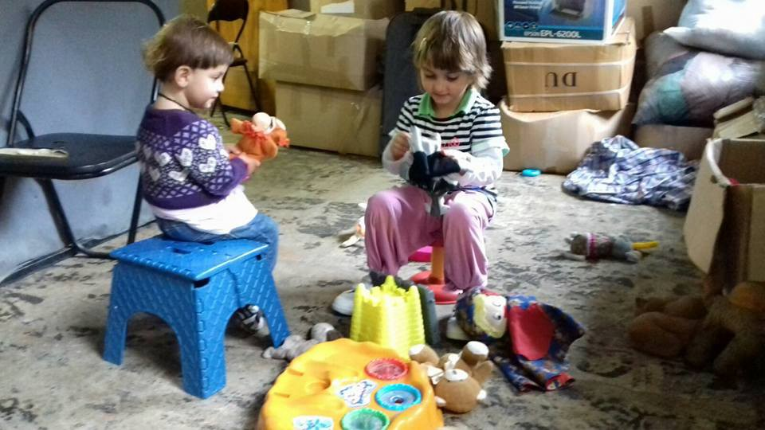
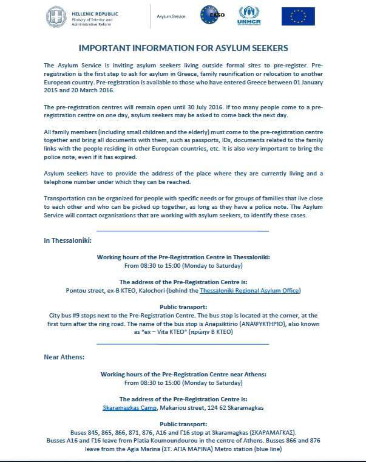
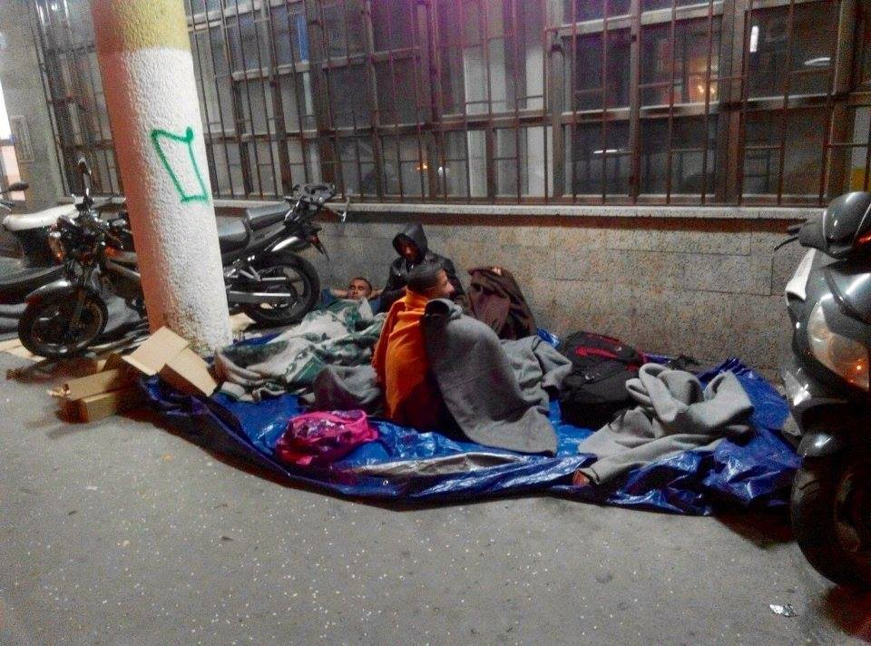
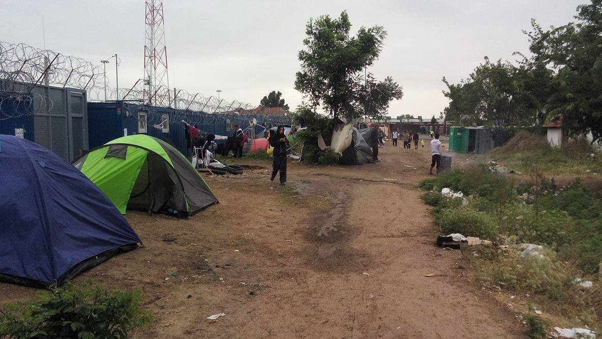
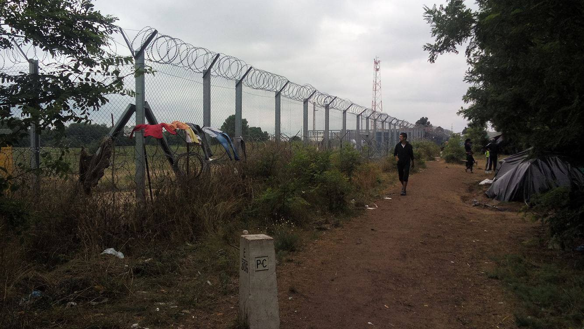

### AYS DAILY DIGEST 17/7: Three quarters of camps in Greece to be closed soon

_While the war in Syria is still raging, more people are forced to leave their homes and search for safety in Europe\. However, we do not hear about the plans to open the borders any time soon, or that somebody is seriously considering to stop the war\. More people arrived in Greece today while the local government is announcing plans to close some of the refugee camps by September\. More relocation announced, too\. Situation is getting worse in Belgrade\. Over 300 people slept in the park in Belgrade last night\. More than 400 are waiting at the border between Serbia and Hungary\. In Calais refugees are living in intolerable conditions\._

To many kids are among refugees who are asking for help in Serbia now\. Some of them are sleeping out in the open in Belgrade\. Photo Refugee Aid Mixaliste\.
#### Syria
### Peace is all we need\!

But peace is far away from Syria, and it does not look like the rest of the world is trying enough to help\. Air strikes on city of Aleppo took at least 28 lives, including children, according to the Syrian Observatory for Human Rights\. Some media are reporting that barrel bombs were dropped on several areas\. In one neighborhood, a hospital was hit in the bombing, wounding some staff and patients\.

> “All kinds of weapons were used to bomb the hospital, from midnight until about 11:00\. Now it’s unusable,” Mohammad Kheir, one of its doctors, told AFP\. 

**SEVERE WARNING for Leros, Kos and Kastelorizo\. 4–6 beaufort 22\.00–08\.00 Waves up to 2 meters\.**

**Weather in Greece tomorrow — from 25 to 35 C**

**You can find more detailed forecast from [Sao and United Rescue Aid](https://sao.ngo/weather)**
#### Greece
### Plans for closing down refugee camps reviled

This morning, boat landed near town of Molyvos with 17 people\. Volunteers in the area helped to all the refugees who were on the boat\.

[Local media in Greece](http://www.ekathimerini.com/210516/article/ekathimerini/news/most-migrant-centers-to-be-replaced) are reporting today about the government plans to lose down three quarters of “migrant reception centers” by September\. According to the plan, people who remain in Greece by that time should be transferred to small state facilities with better conditions\. These facilities, the media are reporting, are to be modeled on a center in Elaionas, near downtown Athens, where migrants live in prefabricated homes with electricity and running water\.

The government have already started assessing the country’s 42 reception facilities\. The centers at Schisto in Attica and Diavata and Lagadikia in Thessaloniki, are among those that will be kept open\. The camps at Nea Kavala and Herso, northern Greece, are among those set to close\.

The government also announced that some 3,500 people who are living at the site of the old Athens airport in Elliniko and more than 1,000 from the port of Piraeus are to be moved to three new camps within the next 10 days\. Volunteers, stay alert and help during relocations if you can\.
### Useful information for volunteers about continuation of the pre\-registration process

Pre\-registration continues in Greece\. We have a few things important for volunteers to share\.

> 1\. Getting into Skaramangas Camp and the registration centre 

> A number of those arriving from the city to register at Skaramangas have experienced significant difficulties at the security checkpoint \(manned by Hellenic Police and Navy Troops\) at the camp’s main gate\. To prevent these incidents from re\-occurring, registration centre staff will be waiting outside at the gate to assist those arriving in clearing security\. 

> If you know anyone going to register at Skaramangas: 

> Tell them to go to the security checkpoint outside the camp \(visible from highway 8 heading towards Corinth\) \. 

> Tell them to look for or wait for registration centre staff wearing white vests bearing the UNHCR Logo\. 

> A staff member will be there to clear them through the checkpoint and walk them in\. 

> Translators speaking Farsi and Arabic from the centre will also be there at the main gate and the reception area of the Centre to assist them\. 

> 2\.Closing time: 

> On the poster it states that the Registration Centre closes at 3 pm\. We strongly advise anyone turning up to register to arrive before 1pm\. 

> 3\. It is Important for all family members to the site to register together\. 

> Nuclear families can only register with all members present\. Those who arrive without all members present may experience significant delays or will most likely be asked to come back the next day with all members of their family\. 

For further information about who is included in this category of ‘Urban’ [please read this post](https://m.facebook.com/groups/204202716585823?view=permalink&id=298258920513535) \.

### Waiting area in Greece

New documentary about refugees is available\. The film titled Waiting Area \(Greece 2016\) is part of the project finacied through the crowdfunding Route to Europe, and it shown two weeks in Greece of a group of volunteers, from Athens to Thessaloniki\.

#### Serbia
### Hundreds of people asking for help in Belgrade

Situation in Serbia is not improving\. More and more people are arriving every day and they are asking for help\. Today, 300 people got food Mixaliste shelter\.

Last night in Belgrade, around 300 people slept in the open\. Among them were many women and children, including babies\. These pictures are made by volunteers from Info Park\. They say that it was only 14 C last night in the Serbian capital\.

> “We have seen a plenty of people, probably more than 300\. Some were already sleeping, some were still preparing cartons and plastic foil collected from the garbage bins that could be used if rain comes\. We were shocked, truly shocked to see women, children and even babies lying on the ground and sleeping in the park\. Adolescent Afghan boys are not the news anymore, who bothers about them, more or less — if they don’t comply with the rules of the unfair game \(the alternative for them is to go to a sort of a juvenile prison, infamous Vasa Stajić\) \. 

> But this was the first evening where we saw persons who fall under the top priority in any refugee protection handbook, several women and at least 8 children aged 2 do 8 without any protection, in open, without any roof or shelter\. “ 

Info House volunteers are warning that even though it is over a year since the crisis began, with tens of organitions and millions of euros spent, Belgrade still has no drop\-in shelter of sufficient capacity and no central distribution for all\.

> “We are clear about who is guilty for this situation — 100% state institution in charge of a refugee crisis — whose last bureaucratic decision to clear Krnjaca AC from the non\-registred migrants resulted in downtown Belgrade humanitarian catastrophe\. However we are very sad to see that there is no response from humanitarian community\. We are sure that a credibility of all of us is crumbling in these days as we do nothing and just point others as guilty\.” 

People are sleeping in the streets of Belgrade\. Hundereds are in need for help\. Photo Info House\.
#### Border are between Serbia and Hungary
### People lost shelter due to heavy rain

Situation at the border, Kalebija, is not improving even though volunteers and human rights organizations are warning for days about how bad it is\. IHO volunteers are still there helping in every possible way\. Currently, over 400 people are stuck in this area\.

Over the last three days, there have been heavy rain in the area, and many people lost their tents\.

> “Babies, children and women sleeping in no shelters as we don’t have enough tents to give everyone \(also hygiene packets urgently needed to avoid any kind of general and skin diseases with swamps caused by heavy rain and full of mosquitoes\! \) \.” 

List of items that are urgently needed in Kalebija:

> **Kids socks / kids shoes / kids clothes / Diapers and baby Milk / Milk & Water bottles / Hygiene Packets/Women clothes / Women Socks and Shoes / Hygiene Packets/Men Clothes / Socks and Shoes 41–42–43–44/Tents / Blankets\.** 

Or you can always donate to:

JA SAM COVEK ORGANIZATION

RS35265100000016247454 \(IBAN\)

RZBSRSBG \(BIC\)

RAIFFEISEN BANK AD

If you would like to join IHO team from 20th of July, send them an mail to info@iHo\.org\.uk

Nothing new from the border between Serbia and Hungary\. People are still stuck and waiting in unberable conditions\. Photo IHO\.
#### France
### Intolerable condition in Calais

[The National Consultative Commission on Human Rights \(CNCDH\) is warning](http://www.nordlittoral.fr/faits-divers/jungle-de-calais-toujours-des-milliers-de-migrants-aux-ia0b0n325475) that thousands of people are still living in the Jungle, Calais, in “intolerable conditions of distress and destitution,” while their fundamental rights are “violated”\.

The president of the CNCDH, Christine Lazerges\. said that they are alarmed in particular by “the increasing number of unaccompanied minors in Calais,” and requesting “the establishment in the shortest possible time, a stabilizing device to enable them to integrate structures common law child protection “\.

The CNCDH notes that “much has changed” since 2015, with the “creation of a temporary reception center and a health clinic,” and the “establishment of latrines, garbage containers, of additional water points\. “ But the state should “urgently engage human and financial resources to also provide decent accommodation, allow migrants to access the most basic care, enable children to go to school, parents to know their rights\.”

_Converted [Medium Post](https://areyousyrious.medium.com/ays-daily-digest-17-7-three-quarters-of-camps-in-greece-to-be-closed-soon-d4784fbb28e9) by [ZMediumToMarkdown](https://github.com/ZhgChgLi/ZMediumToMarkdown)._
