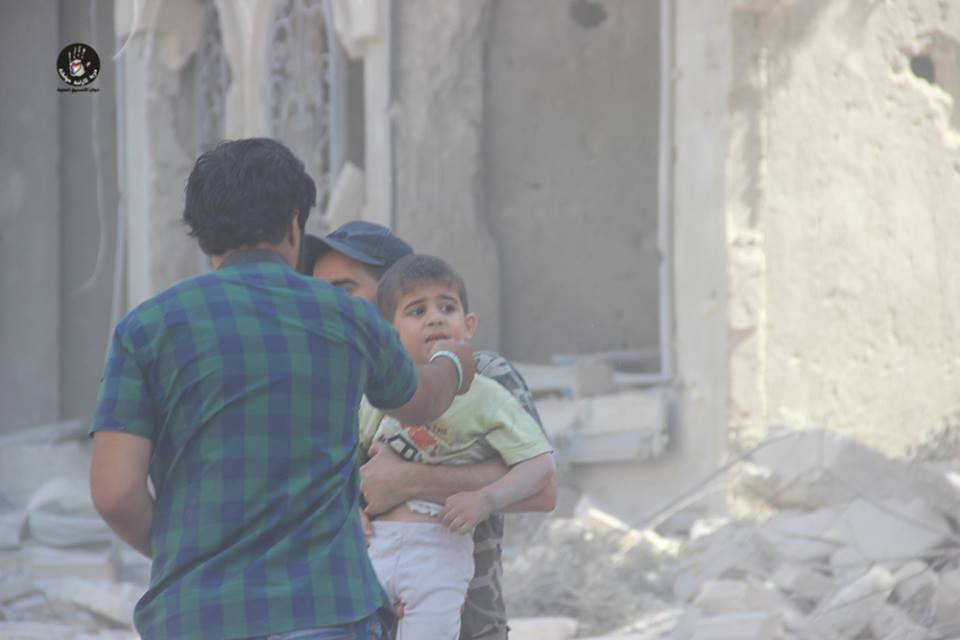
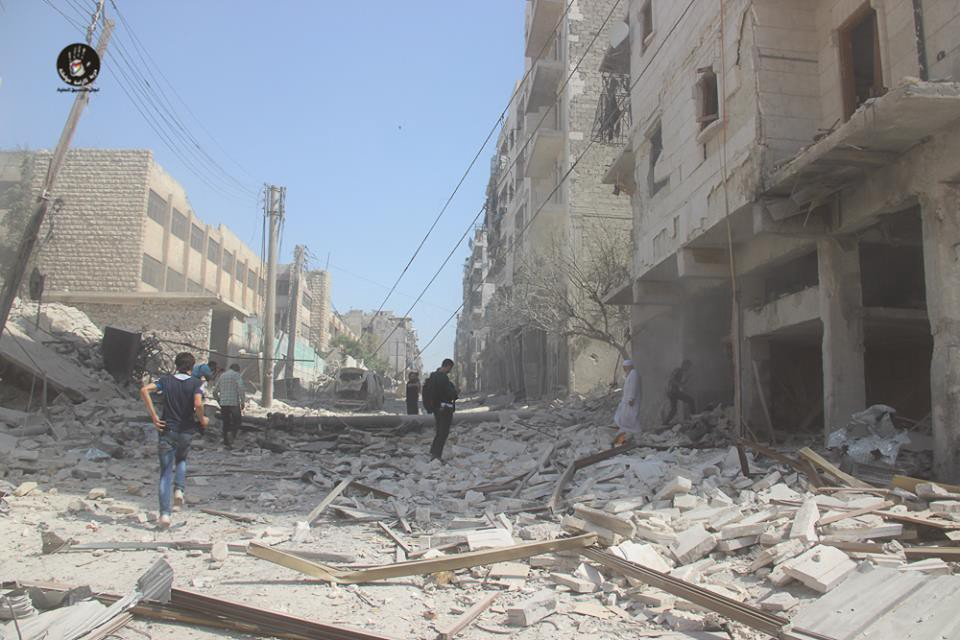
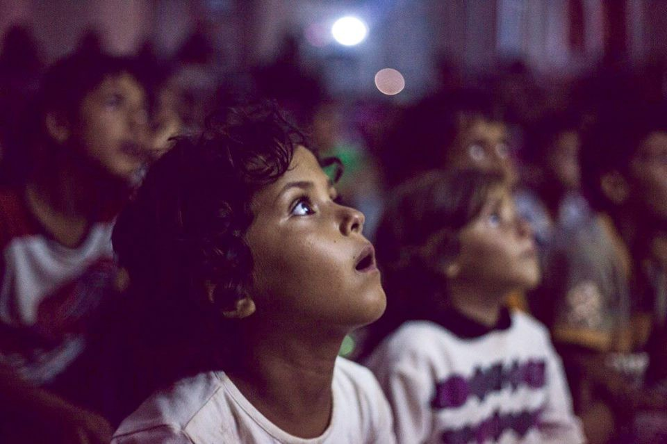

### AYS DIGEST 16/7 — Lest we forget, the Syrian people are under attack
#### Today, like most other days, was a difficult one for Syrians\. Dozens were killed and many more injured as a result of Russian and regime bombing of population centers\. Also as a result of the bombing, a hospital in Aleppo was put out of order\. Such brash killings ought to remind people whose doing this current war is\.

The aftermath of Saturday’s bombing of the Masakin Firdous neighborhood of Aleppo\. Source: LCC
#### Syria
### Innocent blood continues to be shed in Syria as a result of the regime’s and its Russian allies’ lack of concern\.

Those wishing to keep up with events in Syria ought to follow the Syrian Local Coordination Committee \(LCC\) Facebook page [The LCC page](https://www.facebook.com/LCCSy/posts/1439271012766697) reported today on the damage being done by regime attacks\. According to them, the largest number of casualties of Saturday’s is a total of 33 dead civilians in the various neighborhoods of Aleppo\. The shelling of Omar bin Abdulaziz hospital in Maadi yesterday and today has disabled the facilities, putting yet another hospital out of service\. The bombing of the SAMS hospital in Aleppo was also reported, with a total of 16 injuries\. Five civilians were killed in the bombing of Om Kasab and Birj Boqal in Homs\. Bombing also continues in Talihiya in Idlib Province, with two dead as a result of regime bombings and an unknown number of casualties have occurred in various locations such as Ehsim, Binnish, Mardikh, Has, Daraya, and Harasta neighborhood in Eastern Ghouta\. Kansab and Shalaf Castle were the targets of Russian airstrikes and artillery\. Airstrikes were reported in the city of Irbeen, also maiming civilians\.

The regime army and rebel forces have had several clashes today\. Rebels fought Assadist forces on Kurdish Mountain near Latakia, and an attempted advance on the town of Hirbinafsah south of Hama by regime forces was prevented\.
#### Greece
### Nearly 100 have arrived on the Greek islands today\.

Sources report that as of 7:30AM, 54 new arrivals made their way to Lesvos and 37 arrived on Chios\. A similar landing of a boat carrying 47 people similarly landed on the island on Friday morning\. Although it is nothing like what it once was, we seem to be witnessing a small increase in arrivals to the islands\. The situation could easily become even more drastic in the aftermath of the attempted coup in Turkey, when destabilization could easily spell trouble for refugees and raise their resolve to make their way to Europe\. For now, we must simply wait and see\.
### Lawyer volunteers are needed on Lesvos\!

Refugees continue to be in need of legal service on their behalf\. As such, there is a strong need for volunteers\. One may find information, posted on the [RefuComm Communication and Information for Refugees page](https://www.facebook.com/RefuComm-communication-and-information-for-refugees-145594569125687/?fref=nf) , below:

> _LESBOS — how to become volunteer lawyer_ 

> [_http://www\.ccbe\.eu/index\.php?id=12&L=0_](http://www.ccbe.eu/index.php?id=12&L=0) 

> [_http://www\.europeanlawyersinlesvos\.eu/how\-to\-become\-a\-volu…/_](http://www.europeanlawyersinlesvos.eu/how-to-become-a-volunteer-lawyer/) 

> _The team in Lesvos will consist of a small number of lawyers from European countries based on a roster for short term missions \(minimum two weeks\) \. These lawyers will work on a pro bono basis, though their expenses will be covered\. Their role is to distribute documentation, give legal advice to migrants requiring international protection and send weekly reports on their activities\._ 

> _They will be supported by ground staff engaged on a longer\-term basis in order to ensure more permanent support for the project\._ 

> _The project will be run in close cooperation with the Greek Bars, in particular the Lesvos Bar\._ 

> _How to become a volunteer lawyer?_ 

> _Lawyers who would like to participate in the project should meet the following criteria:_ 

> _Able to spend a minimum of two weeks in Lesvos_ 
 

> _Training and/or experience in Asylum Law and the law of international protection_ 
 

> _Good command of English_ 
 

> _Knowledge of Arabic would be an asset_ 
 

> _Please fill in the application form and submit it to your national Bar or Law Society or directly to info@europeanlawyersinlesvos\.eu\. The national Bar or Law Society will in turn identify volunteer lawyers who meet the above mentioned criteria and send the applications to the CCBE/DAV\. Please note that for any applications received directly to the project, the relevant Bar or Law Society will be notified of the application\._ 

> _The final selection will be made by group of experts from within the CCBE/DAV\. Priority will be given to lawyers who can stay for a longer period of time\._ 

> _For any further information please contact info@europeanlawyersinlesvos\.eu\._ 

Children watch Frozen on a projector fitted for the occasion by Refugees Foundation e\.V\. Photo credit: Kuba Kaliszewski
### Refugee children get some respite through cinema\.

Refugee Support Greece, operating in Alexandria camp since April, ran its first cinema night on 15 July for the children on the camp\. The premiere was Disney’s Frozen dubbed over in Arabic and they have a selection of other children’s films in Arabic to watch over the coming weeks\. The film title is ironic given the sweltering heat the residents have to endure but, after volunteers spent some time settling the kids, they were rapt\.
#### Serbia
### The Serbian military is to be deployed to Bulgarian and Macedonian borders to crack down on refugee passage\.

The report comes to us [via Tanjug](http://Serbian military to be deployed to Bulgarian and Macedonian borders to crack down on refugee passage) \(in Serbian\) \. According to the article, the Serbian government plans to send joint teams of police and the army to police the borders in order to severely curtail refugees’ entrance into the country\. Up until this point, Serbia has seemed to be the most benign of its neighbors when it comes to the plight of refugees, especially in comparison to Hungary and Bulgaria, however this move could mark a shift in policy and may ultimately lead to the same sort of violent pushback that the Hungarian police has become famous for\. The Serbian president says that the move is also intended to crack down on smugglers\. Speaking on smugglers, Vucic said that, “They will be strictly punished\. Our prosecutors and courts shall take all legal measures to stop the crime and to clearly show everyone that Serbia cannot be a parking lot for the Afghans and Pakistanis that nobody in Europe wants to see, let alone receive as refugees\.“
### Šid Camp has reached capacity\.

There are currently approximately 300 inhabitants in Šid Camp as a result of the emptying of Krnjaca and the transfer of some of its residents to Šid\. Sources on the ground tell us that this will likely lead to changes in conditions\.
#### Italy
### Almost 20 people drowned in the Sicily Channel\.

Yesterday, almost 20 people drowned in the Sicily Channel, before the arrival of Siem Pilot\. According to witnesses, the dinghy deflated and the migrants dived into the sea\. The ship’s arrival avoided further deaths\. On board were 366 refugees, 82 women and 25 minors among them, along with, tragically, the corpse of a child\. The police has already stopped seven smugglers driving four of the vessels rescued in Sicily channel\.

100 refugees have been transferred to Park Roja\.

Migrants were transferred to the Park Roja camp from church Sant’Antonio delle Gianchette\. The camp is managed by the Red Cross\. More small groups will be slowly transferred here, where living spaces have been constructed\. Within ten days of arriving, refugees may decide whether to request asylum or decide to leave\.

**500 migrants blocked by police in Principe station, Genua\.**

From May 2016, the police blocked 500 migrants in Principe station, Genua\. The foreigners, mainly from Syria, Maghreb and other African countries, had no documents and were attempting to reach Ventimiglia towards France\. The people have been taken to the police offices for identification\. These extraordinary controls have been decided by Ministry of Interiors in order to limit the migration flow to the bordertown, [according to Ilse Coloxix](http://www.ilsecoloxix.it/p/genova/2016/07/16/AShtWhWD-migranti_fermati_principe.shtml) \.
### [Rete Solidale Pordenone](https://www.facebook.com/retesolidalepn/?hc_location=ufi) meets representatives of Pordenone’s right\-wing\.

[Rete Solidale Pordenone](https://www.facebook.com/retesolidalepn/?hc_location=ufi) declared that Pordenone’s representatives from the right\-wing lied in their latest declarations about the organization’s intention of not cooperating\. RSP refers that an informal phone call proposed a meeting in a coffee bar, in order to discuss about the migrants still sleeping in the streets\. However, the speaker asked RSP to guarantee that, before the meeting:
\- the information posted online to support asylum seekers will be deleted
\- migrants will be kept far from the parks
\- migrants will be kept busy during the day, for example with Italian courses and other activities\. RSP assumes this last request should be realized for free\.
RSP accepted — notwitshtanding the requests — to meet the representatives, asking them for a formal invitation by email\. “As requested by you, I confirm and give my availability for a meeting,” they wrote\. This message suggests that the requests started from RSP, which where answered shortly thereafter, asking for a place and time”\. No answer followed\.
Few considerations made by RSP:
\- the municipality’s government seems to avoid any publicity in this meeting, with an informal call, a proposal to meet in a coffee bar, and no answer after RSP’s email\. This after 1 year and a half of official requests to the administration, demanding a fair treatment for people who need international protection: how come such a relevant issue is treated as a bar talk topic?
\- the requests are a shame, and RSP refuses the methods, the lies and above all the mentality beneath them\.
RSP conclude inviting the authorities to offer the structures, if available, to remove the people from the streets, especially because the volunteers are sick and tired of substituting the institutions in their duties, in an international receiving system Italy has subscribed\.
#### Slovenia
### NGOs must compensate where government fails to provide for asylum\-seekers\.

The framework for supporting refugees in Slovenia is extremely flawed, and in some ways quite similar to what is happening to Croatia\. Having received asylum in Slovenia and thus making the move from asylum centers to private accommodations, refugees become eligible for social welfare\. In the asylum centers, a refugee is fed three times per day and is offered some financial help\. The problem, however, is that the original welfare checks may take as long as several weeks to arrive\. Refugees often have no food and must often rely on the help of private organizations in the meantime\. This constitutes a serious oversight in the system, and something that the Slovenian government must work to figure out\.

_Converted [Medium Post](https://areyousyrious.medium.com/ays-digest-16-7-lest-we-forget-the-syrian-people-are-under-attack-7e15c24d64a0) by [ZMediumToMarkdown](https://github.com/ZhgChgLi/ZMediumToMarkdown)._
