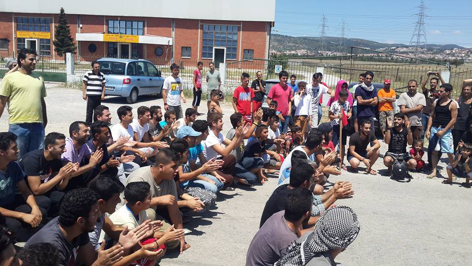
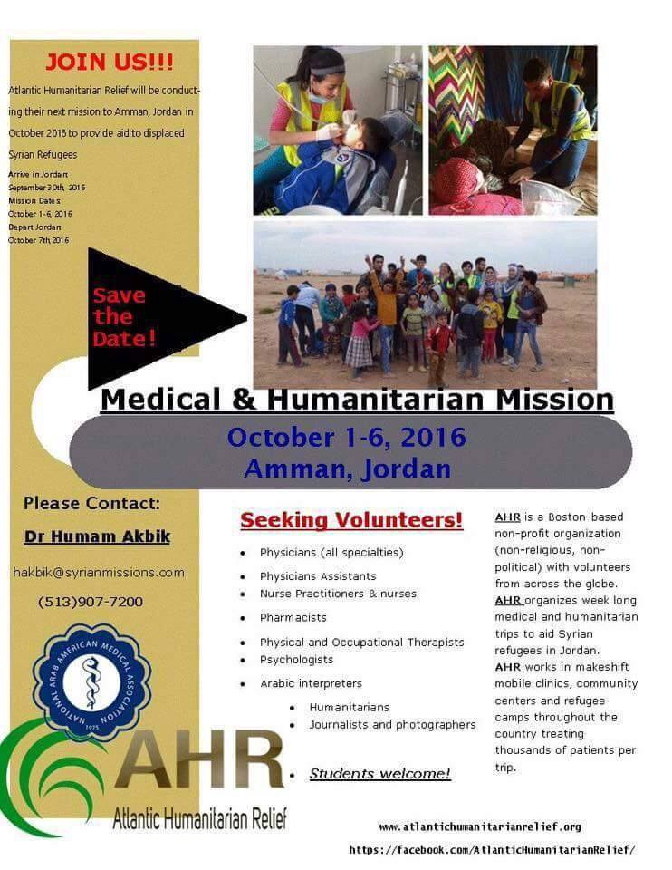
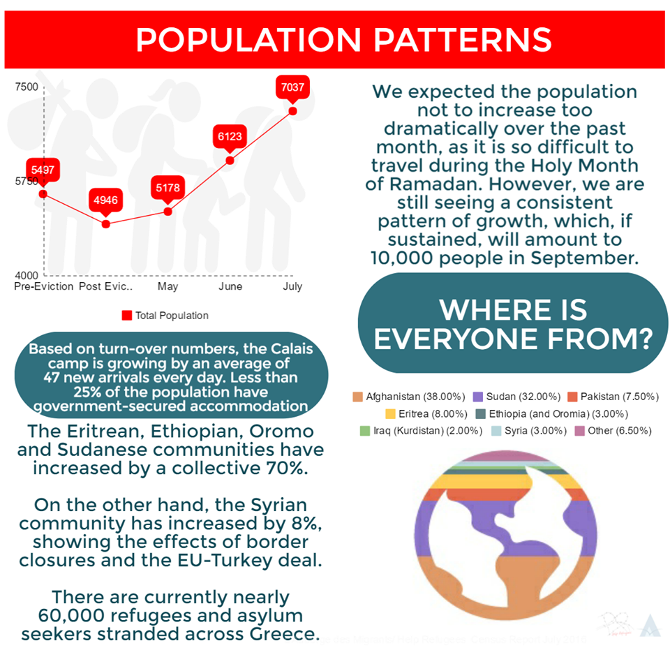
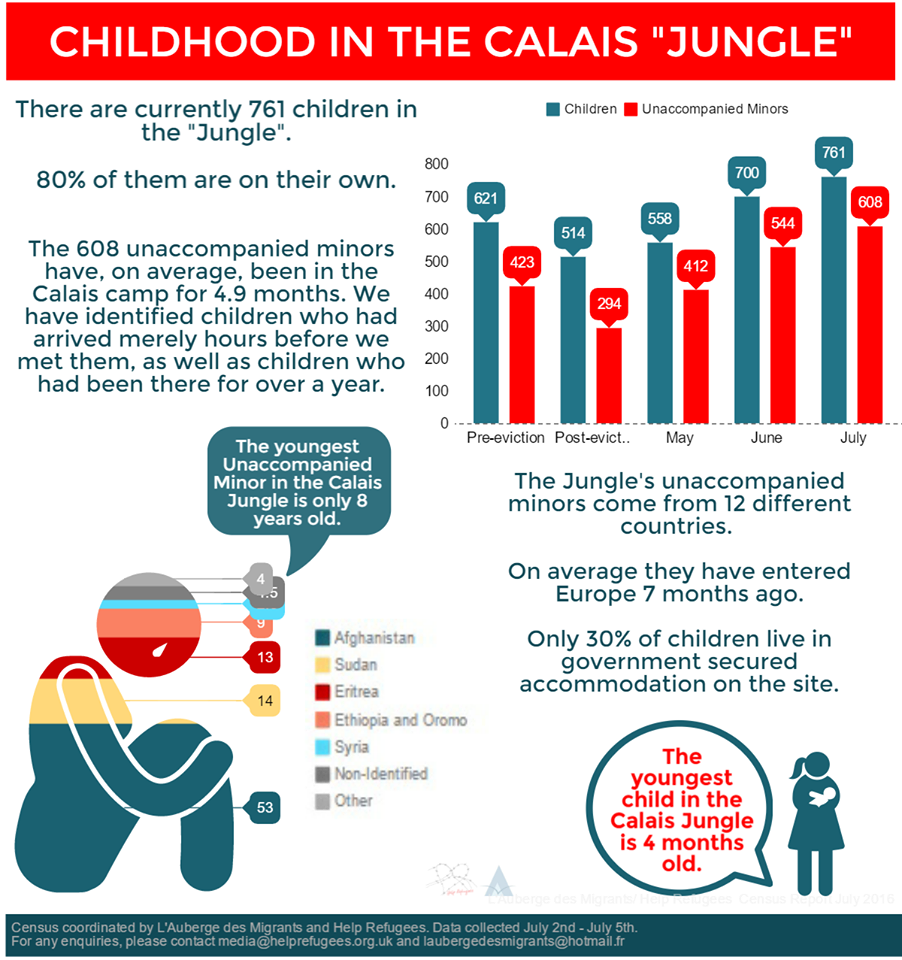
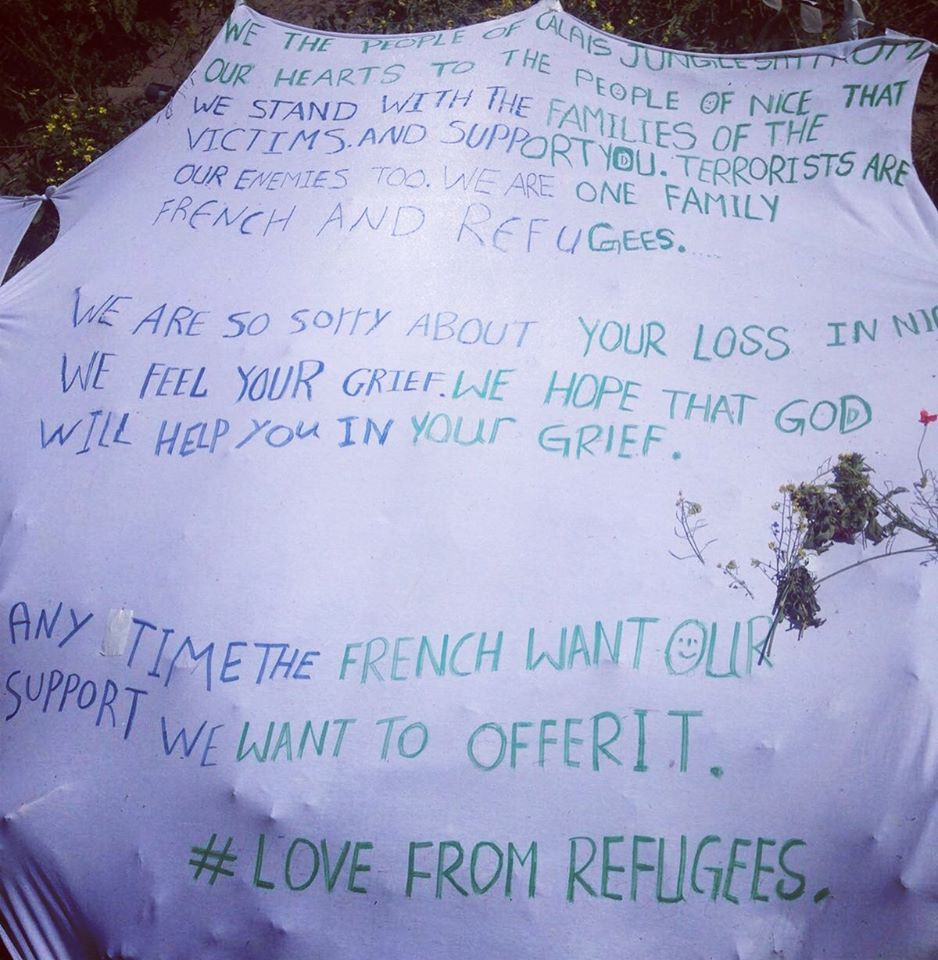

### AYS Daily News Digest 21\.07 — The terrorists are winning
#### Following last month’s bombing of the Rukban border crossing, which killed 7 guards, the last crossing point available for refugees has been closed and basic necessities such as food and water are scarce for those camping on the border\. Some of the children and elderly have died as a result of dehydration and malnutrition, and few organizations are able to help the refugees on location\. Reverting to base instincts and shutting down borders means that the terrorists have completed their objective, and may very well lead to the disillusionment of those who now find themselves with nowhere to go\.

Refugees protesting in Oreokastro Camp in Greece asking for better food\. The food provided in Greek camps is known to be of questionable quality\. Photo Credit: Rezan Boyraz
#### Jordan
### Refugees are stranded near the Jordanian border with little access to food and water\.

In the aftermath of last month’s detonation of a car bomb on the northeastern Jordanian border, authorities have treated Syrian refugees on the border with impunity\. Today, the Jordanian Al\-Azraq camp remains empty despite accommodations being in place, owing to Jordanian fears\. Instead, refugees who manage to make their way to the country’s borders, no small feat these days, are forced to stay in the desert where the borders of Syria, Jordan, and Iraq meet\. Deaths have been reported as a result of Jordanian authorities’ non\-delivery of food and water and lack of medical services\. Aid groups’ presence in the area is also very limited, with UNICEF only recently being allowed to deliver water, and even those who are wounded are often told to turn back\. Even though there are genuine security fears, the wholesale denial of entry to Syrian refugees will only produce more suffering\. Refugees are themselves fleeing from wars and bombs, and wholesale denial of entry only signals to terrorist groups that they are succeeding in their objective: striking fear and leading to lashing out against the innocent\.
### Medical volunteers are needed for October\!

The Atlantic Humanitarian Relief network is searching for doctors of all kinds who would volunteer their services from October 1 to October 6\. As highlighted by the above story, many refugees are in very desperate need of help, and your participation would go a long way\.

#### Greece
### HRW report details the shocking mistreatment that unaccompanied minors encounters\.

The report, which may be read [here](https://www.hrw.org/news/2016/07/19/greece-migrant-children-police-cells) , revealed that some unaccompanied minor refugees, who are by law supposed to be kept separated from the general refugee population, are locked up in filthy police station cells for as long as two months\. Over the course of interviews with the detainees, HRW learned of the conditions prevailing in these cells, namely overcrowding and filth, and the police’s refusal to let them go out\.

> “Babrak K\.,” a 16\-year\-old boy from Afghanistan, said that before being transferred to the station in northwest Greece where Human Rights Watch spoke to him, he spent five days in a nearby police station in a windowless, vermin\-infested basement cell\. He said that four people shared three mattresses on the floor, and that the toilet had no door\. He said that food was thrown into the cell through a small slot in the door and that because detainees were not provided with cups, he drank water from a discarded food container\. 

Holding refugee children in conditions which would be considered cruel in their application on criminals naturally has consequences, including psychological distress\. Such despicable practices must be discarded immediately\.
### Reminder: pre\-registration for refugees living outside the camps will end on July 30\!

Those who have been in Greece since January 10, 2015 and March 20, 2016 are still eligible for pre\-registration, which will give refugees status and permission to stay in the country until their case is able to be considered more closely by the authorities\. The asylum services have already visited registered camps, but refugees living elsewhere have not been reached\. Pre\-registration is the first step to ask for asylum in Greece, family reunification or relocation to another European country\. Those seeking status should bring their entire family as well as all relevant documents to the location, even expired police notes will be accepted, and refugees are asked to provide their address as well as a phone number where they may be reached\. The centers will operate at the following locations until July 30:

THESSALONIKI
Pontou Street, \(former B\-KTEO building\), Kalochori \(behind the Thessaloniki Regional Asylum Office\)
Monday to Saturday, 8\.30–15\.00
Bus No 9\. Get off at ANAPSYKTIRIO stop

ATHENS 
Scaramangas Camp, Makariou street, 124 62 Skaramangas
Monday to Saturday, 8\.30–15\.00
Buses A16 and Γ16 from Plateia Koumoundou\. 
Buses 845, 865, 866, 871, 876 from Aghia Marina metro station on the Blue Line \(ΑΓΙΑ ΜΑΡΙΝΑ\) 
Get off at Skaramangas stop
### A message for potential short\-term volunteers\.

Summer is the season when many people find themselves with free time, and so there are many who come to volunteer for a week or two before leaving\. While the volunteers’ willingness to help is certainly commendable, we would like to make it clear that donations in\-lieu of commitment for a short period of time would go a much further way for improving the refugees’ lot\. Travel costs can be significant, and the money spent on arriving to the location would often cover costs for many of the already\-existing efforts which are chronically underfunded\. If you are already on location, you will find many opportunities available to you at [www\.greecevol\.info](http://www.greecevol.info) , but otherwise please do make your decision with this consideration in mind\!
#### Macedonia
### 19 suspected members of a gang suspected of smuggling hundreds have been arrested\.

In addition to the smuggling, the group is accused of robberies and the smuggling of drugs and weapons\. According to the Macedonian interior minister, they have transported 500 people\.
#### France
### Help Refugees and L’Auberge des Migrants have released the results of a population of “The Jungle” of Calais\.

The survey shows the difficult conditions refugees are subjected to, and once more reiterates that current government handling of the camp is severely lacking\.

> _Data collected by our teams on the ground reveals that at the time of census\-taking there were 7,037 people living in the camp in Calais, a 15% increase in population since last month\. To see an increase this great during the Holy Month of Ramadan was unexpected and if people continue to arrive in Calais at this rate, we estimate that there will be 10,000 people temporarily residing there by September\._ 

> _There are 761 children living in the “Jungle” and of these 608 are unaccompanied\. The youngest of these unaccompanied minors is just 8 years old and the youngest child is 4 months old\._ 

> _The government\-run facilities are at capacity with 1500 people living in the containers and 230 in the Jules Ferry Centre, the latter only accommodating women and their children\._ 

> _There are 5307 people living in unofficial “Jungle” camp \(outside of the two government facilities\), 425 of these are unaccompanied minors\. This is the group who would be affected by an eviction, were it to take place\. Both the mayor and representatives from the police force last week spoke of an imminent eviction however there has been no official confirmation of when this will take place\. It could still be a number of months before we see any bulldozers\._ 

> _Help Refugees, working alongside partners [L’auberge des migrants international](https://www.facebook.com/laubergedesmigrantsinternational/) urges anyone considering volunteering, giving financial or physical donations to do so\. The consistent distribution of goods, food, bedding and shelter in the camp for residents new and old relies upon your generosity\. No one wants to be in the camp in Calais\. It is not a permanent solution nor a pleasant place to live\. We try to make it a little more comfortable and ensure that the basics are provided as far as possible but we need your ongoing support to do so\._ 

> _Email volunteerincalais@gmail\.com to volunteer_ 
 

> _Email calaisdonations@gmail\.com to donate_ 

> _Click here to make a monthly or one\-off donation : [https://mydonate\.bt\.com/donation/start\.html?charity=127188](https://mydonate.bt.com/donation/start.html?charity=127188)_ 

The results of a survey conducted by the population of “The Jungle” in Calais\.

Also coming out of the camps this week is the following statement of solidarity by residents to those affected by the terrorist attack carried out in Nice\. Refugees who came to be in Calais after fleeing from war zones understand better than most what it means to live one’s life in fear of themselves or a loved one becoming a victim of reckless violence\. The statement reads as follows:

Statement of solidarity from Calais refugees in the aftermath of the dreadful Nice attack\. Photo Credit: Help Refugees

“We the people of Calais Jungle give our hearts to the people of Nice\. 
 
 We stand with families of the victims and support you\. 
 
 Terrorists are our enemies too\. We are one family French and Refugees\. 
 
 We are so sorry about your loss\. We feel your grief , we hope that God will help you in your grief\. 
 
 Any time the French want our support we want to offer it\.

\#lovefromrefugees”

_Converted [Medium Post](https://areyousyrious.medium.com/ays-daily-news-digest-21-07-the-terrorists-are-winning-cc981c1bb9e3) by [ZMediumToMarkdown](https://github.com/ZhgChgLi/ZMediumToMarkdown)._
