### AYS SPECIAL: Last tent folded: refugees evicted from Piraeus port

By L\. Mertes

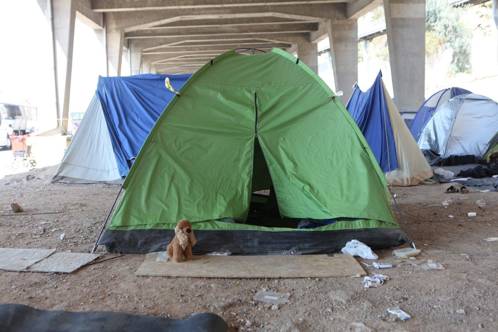

Piraeus Port, turned into refugee camp, is now empty\. Photo credit : Alpkhan Photography
#### July 27, 2016
### PIRAEUS

Buses lined the empty parking lot\. Tearful volunteers hugged tearful camp residents in the hot morning sun\.

Piraeus, Greece’s largest port, ceased to be a makeshift refugee camp today, a historic development in the evolution of the European refugee crisis\.

Authorities completed the final evacuation of camp residents this morning\.

Afghan nationals went to Oinofyta, a camp of approximately 58km north of Athens\. Syrians were sent to the town of Trikala, in central Greece\. Ninety people left the camp today and over 500 were transferred in the last week, according to a government official\.

By all accounts the transfer went smoothly\.

> “It went well, they informed people two days ago\. Everyone who wanted to go left and everyone who didn’t want to go left the port,” according to a coast guard officer in charge of the operation\. 

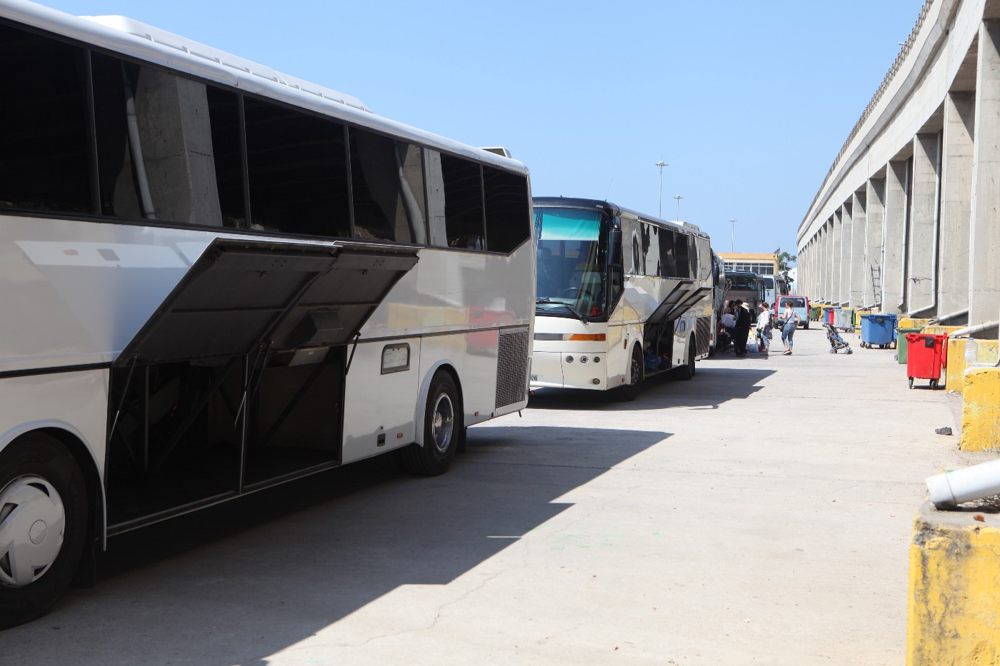

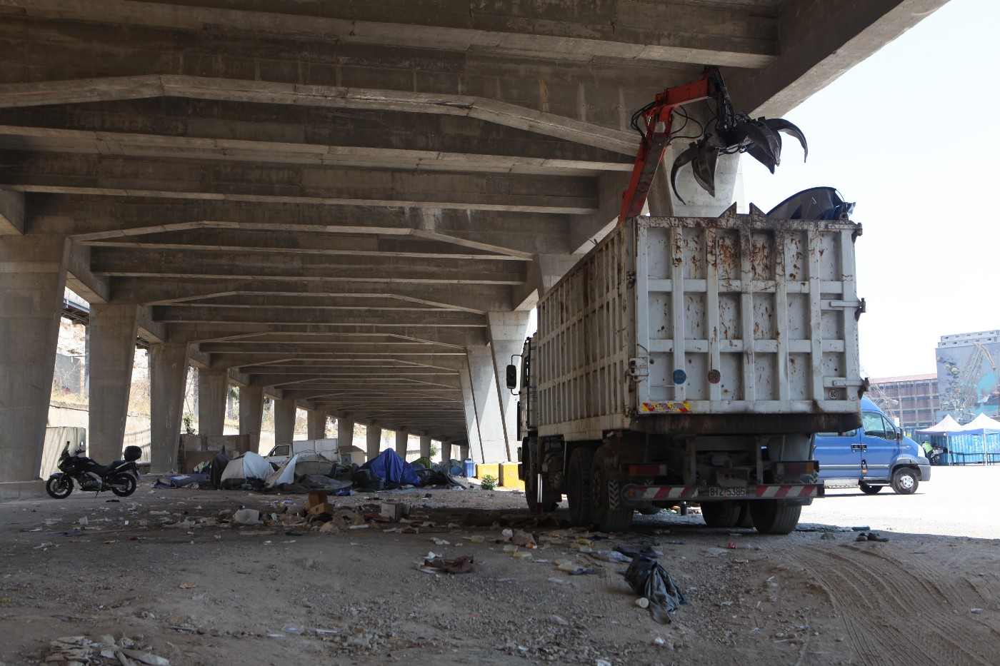

The refugees left Piraeus on buses arranged by the Greek authorities\. Soon after, the abandoned tents were cleared\. Photo credit : Alpkhan Photography

**Change of Plans**

The closure of the camp wasn’t without hiccups, however\.

Piraeus’ Syrian residents were initially supposed to go to the Skaramagas camp on Monday morning, a location prized for its proximity to Athens and good facilities\.

In order to make space for Piraeus’ residents, authorities planned to transfer the camp’s Yazidi residents to Trikala\. However, they secured only half of the places they needed\. The Yazidis refused to be transferred if there weren’t enough places for everyone, according to a UNHCR official\.

UNHCR was in charge of informing camp residents of the transfer and providing information about the camp, nearby cities, the closest supermarkets, and other amenities\. The operation was developed over the last five days, the agency noted\.

> “Today went as planned\. People are very tired and frustrated\. I think most are happy to go to a camp with \[containers\] where they will have a proper environment\.” 

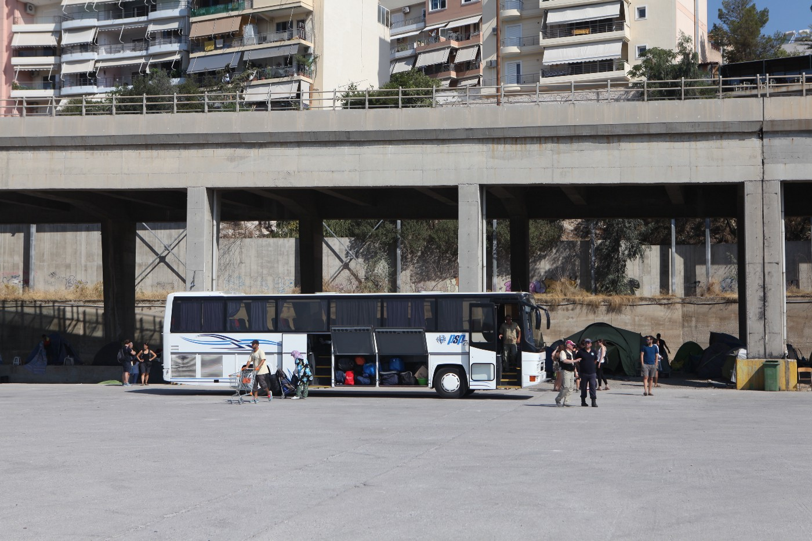

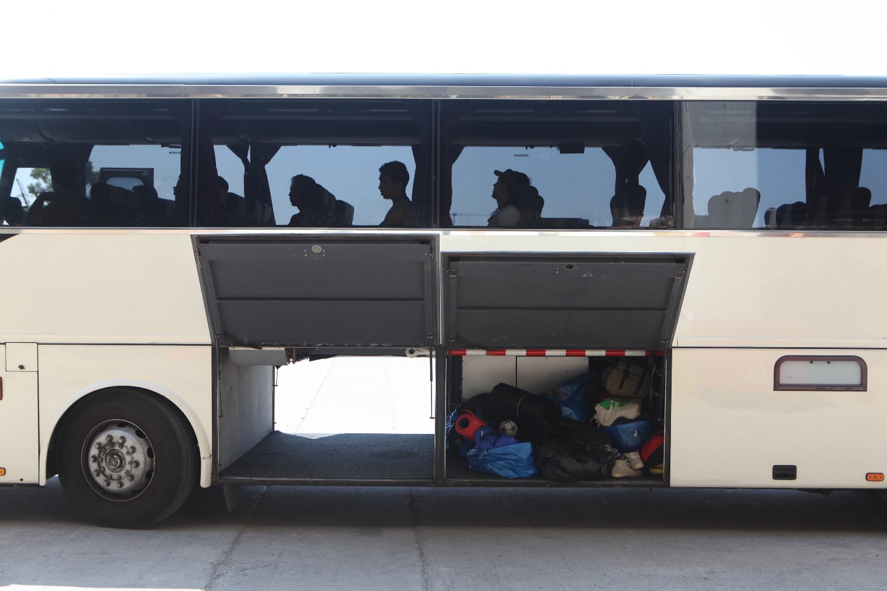

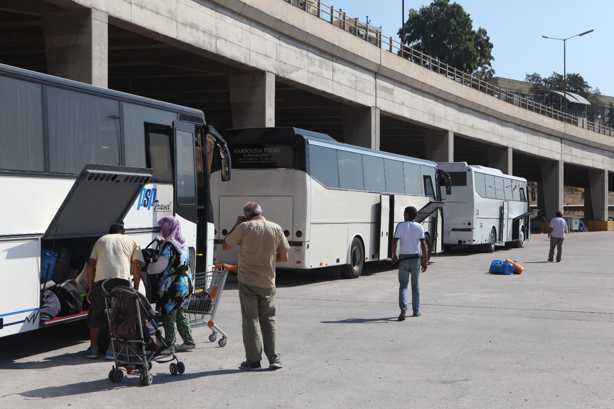

After months of living in extreme conditions, buses took all the people from the Port to different camps around Greece\. Photo credit : Alpkhan Photography

UNHCR representatives had to tell refugees of the change of plans on Tuesday after they had already issued cards stating that people would go to Skaramagas\.

“Someone else makes the plans, changes the plans and we have to inform people,” the UNHCR official added\.

Not everyone felt the change of plans was in the refugees’ favor, however\.

“I think it was done peacefully and quickly but I’m upset that they promised Skaramagas and now they will be disadvantaged by being far from Athens\. These are people who have been navigating the city for a while and have friends and people in town, which means they have to start over again\. Also, they didn’t have a choice about where they were going,” said Lauren Santucci, a volunteer with Khora who has been working in the port managing a kitchen that supplements the government’s meals\.

As a major tourist destination, Piraeus was a stopover for many independent volunteers who, as part of the solidarity movement, contributed long hours in kitchens, taught English, and played with children often before heading off on holiday\. A core group of long\-term volunteers, many with experience on the Greek islands at the height of the crisis last summer, provided Piraeus’ residents with a consistent group of familiar faces\. Greek and international NGOs easily integrated into camp life, providing services on a daily basis\.

“I think the sense of community that was found here will be hard to be replicated but I hope it can be,” Santucci said\.

Whether or not people will stay in the new camps is unclear\.

“I believe a lot people will come back, not to the port, but to Athens,” Santucci added\.

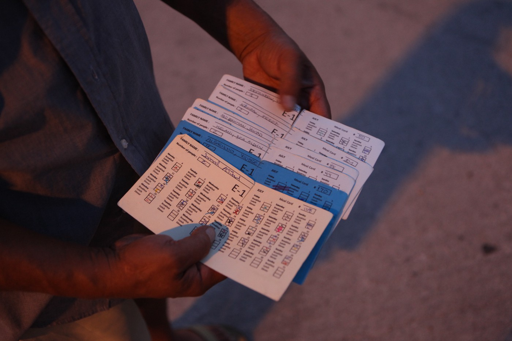

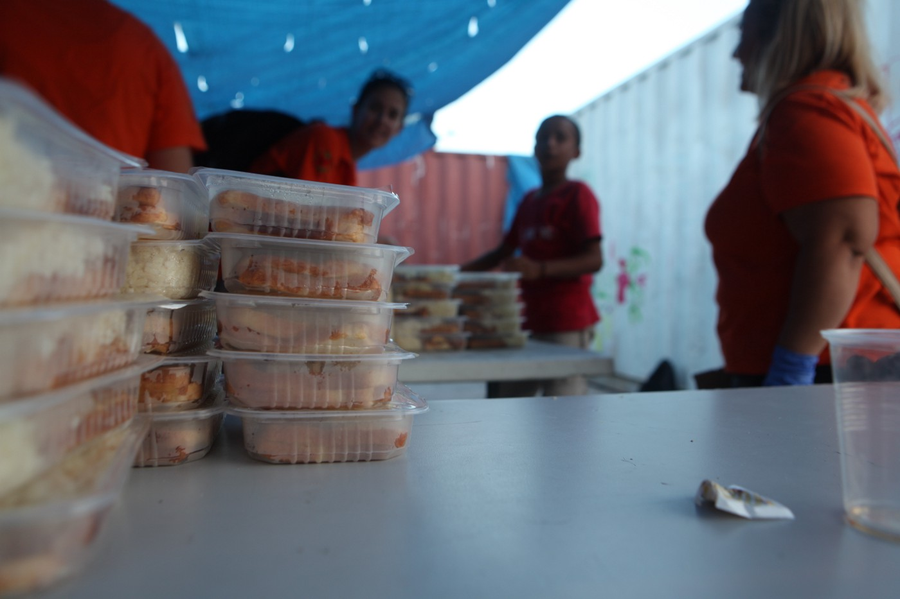

Food ration cards and the last dinner that was served in the port\. Photo credit : Alpkhan Photography

Some of Piraeus’ residents chose not to leave today\.

“A lot of people didn’t go on the bus\. When the first people go to Trikala and send their impressions, they will want to go,” said Sotiris Alexopoulos, a social worker with Refugees Welcome to Piraeus\.

Around three hundred people chose not to go to the camps, and packed their things and left very early this morning, likely for the squats in the center of Athens, he added\.

For Alexopoulos and others, today was long overdue\. The port is a punishing environment in the summer heat\.

“This should have taken place three months ago\. These people were exposed at the worst time of the year,” he added\.

**Squats Not Camps**

As Greek authorities were moving Piraeus’ residents, police in the northern city of Thessaloniki raided three squats\. Buildings occupied largely by leftist activists in Greece provide another model for housing the country’s stranded refugees, one that many argue is better\.

Many members of the solidarity movement are critical of the government’s willingness to put Greece’s refugees in isolated camps far away from the cities\. Squats offer urban locations, integration into Greek society and easier access to schools\. Refugees have the right to education in Greek schools and access to public health care after they obtain their preregistration cards from UNHCR that indicate their intent to apply for asylum\.

“Maybe it is time for the state to realize they must back these movements,” to provide squats for refugees, Alexopoulos said\. “It’s unacceptable to have people on the street and have empty buildings\.”

Piraeus became an unofficial camp when the borders closed on the so\-called Western Balkan route\. First, Afghan nationals were prevented from taking the route, and then the borders were closed for all would\-be European asylum seekers in March\.

At its height, the port housed 7000 refugees\.

One of the main gates in the port, E1, was closed in June after the traffic made it a dangerous environment for the port’s refugees\. The beginning of the final operation to close Piraeus started with the evacuation of the so\-called Stonehouse on July 13 \( [see AYS digest 7/13](https://medium.com/@AreYouSyrious/ays-digest-13-7-refugees-evacuated-from-piraeus-port-4f06c06abb11#.z7ilbdbm3) \) \.

The worst part about life in Piraeus was the refugees’ lack of security about their future\.

“They didn’t know what the next day will bring\. They had to wait and wait and the feelings of frustration accumulated,” according to Eleni Panagiotakopoulou, a psychologist working the camp for the last two months, with Solidarity Now, an NGO funded by UNICEF\.

She noted that there have been a handful of suicide attempts by camp residents over the last few months, drug use, reports of prostitution, and fights among residents\.

“It was not easy to live here\. This was also the easiest place for people to come and do whatever they want,” she added\.

**Historical Context**

This is not the first time the port has housed refugees\. Piraeus was home to refugees when Greeks fled Asia Minor in 1922\.

> “This is a circle which closed today\. This circle must be seen in the context of the wave of refugees who arrived in 1922 after the destruction of Izmir in Asia Minor,” the coast guard official said\. 

**Close Connections**

Many of port’s refugees became an integral part of the lives of the volunteers and those who worked there\. After goodbyes were said and people had started cleaning up their containers in the port, there was a sense it would take some time to process the day’s events\.

“We were here all day together and worried about every aspect of the residents’ lives\. It was not one problem, one hour,” a typical workday pattern for a psychologist\. “You have to remember that you are working and that you might never see \[the camp’s residents\] again,” Panagiotakopoulou said\.

Another long term volunteer, Renata Blazkova, wrote in a Facebook post: “Port is finished\! No glamorous speeches, no crying, no laughing… Only important thing to mention, I have never been so proud in my life about \[everything\] we did\! And special thanks to people who joined us in Golden era of Stonehouse\!”

It was eerily quiet in the port by early afternoon\.

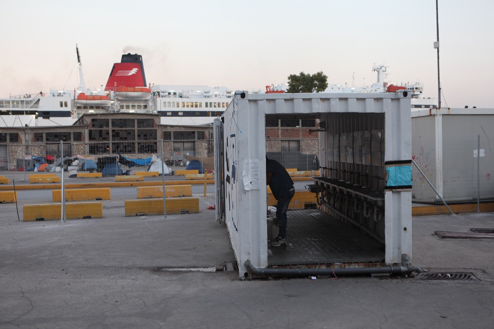

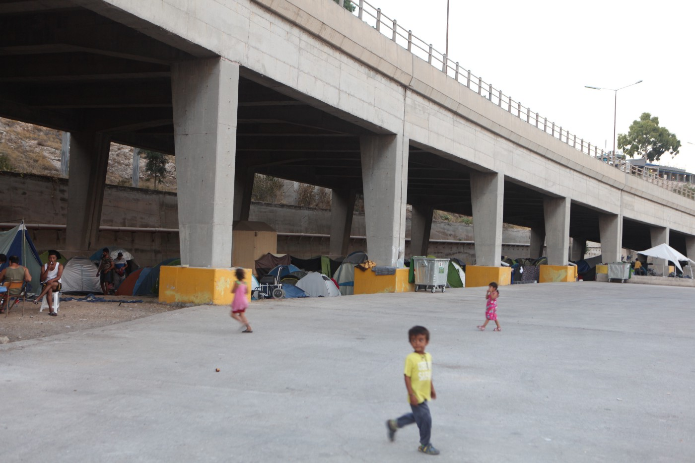

Photo credit : Alpkhan Photography

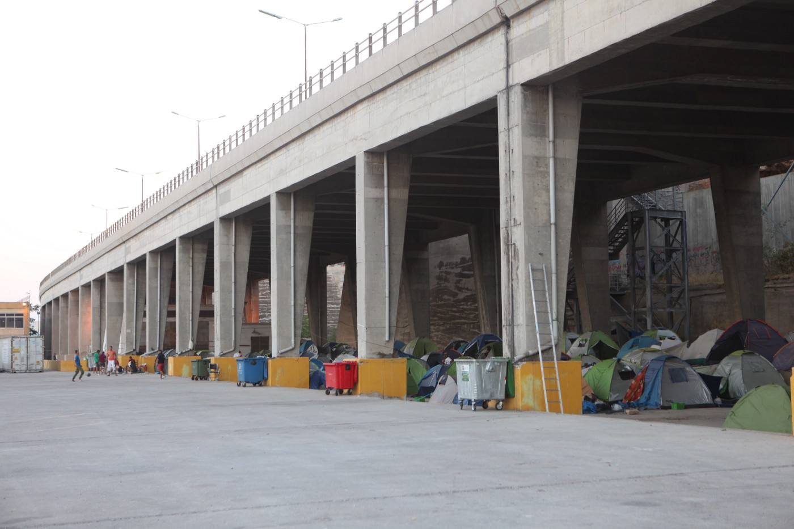

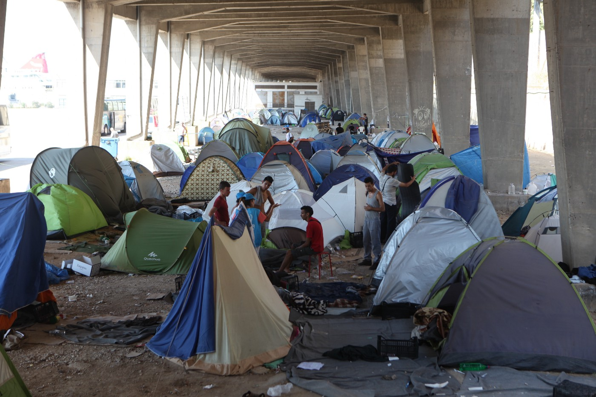

> “It’s strange because the tents are here and I still think people are in them\.” Alexopoulos said\. 

By nightfall, the tents were gone and dinner had been served to refugees in their new homes\.

_Converted [Medium Post](https://medium.com/are-you-syrious/ays-special-last-tent-folded-refugees-evicted-from-piraeus-port-75384d490db0) by [ZMediumToMarkdown](https://github.com/ZhgChgLi/ZMediumToMarkdown)._
