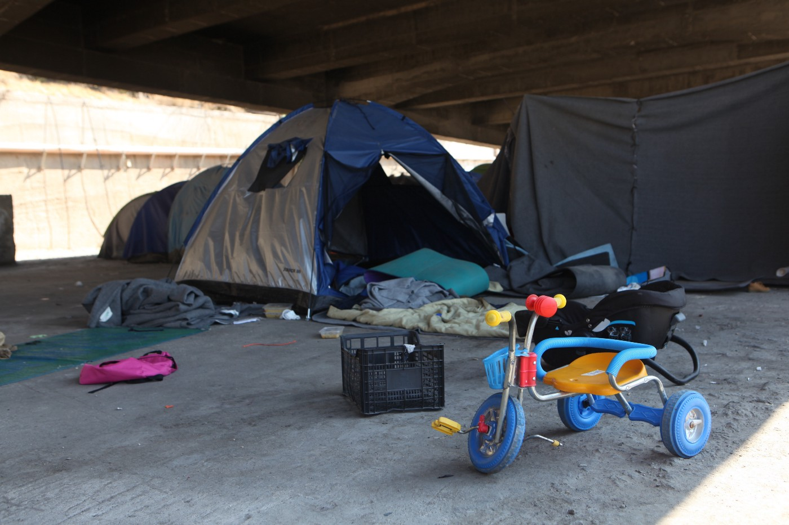
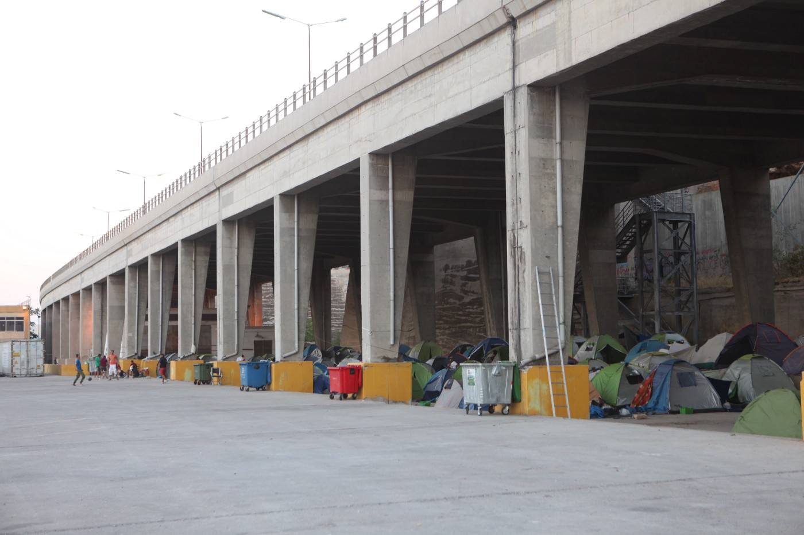
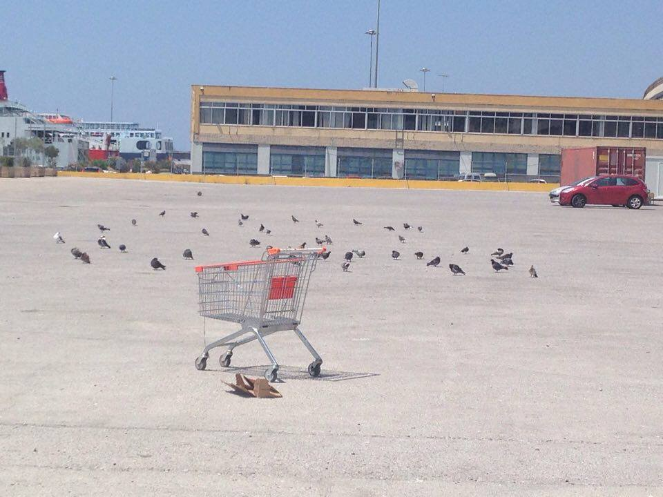
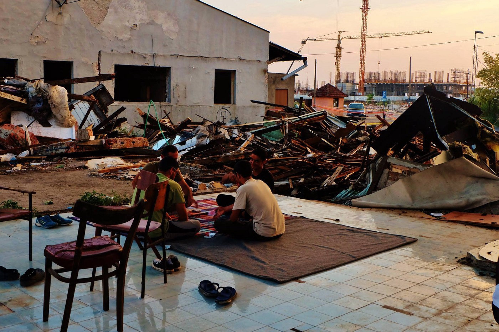
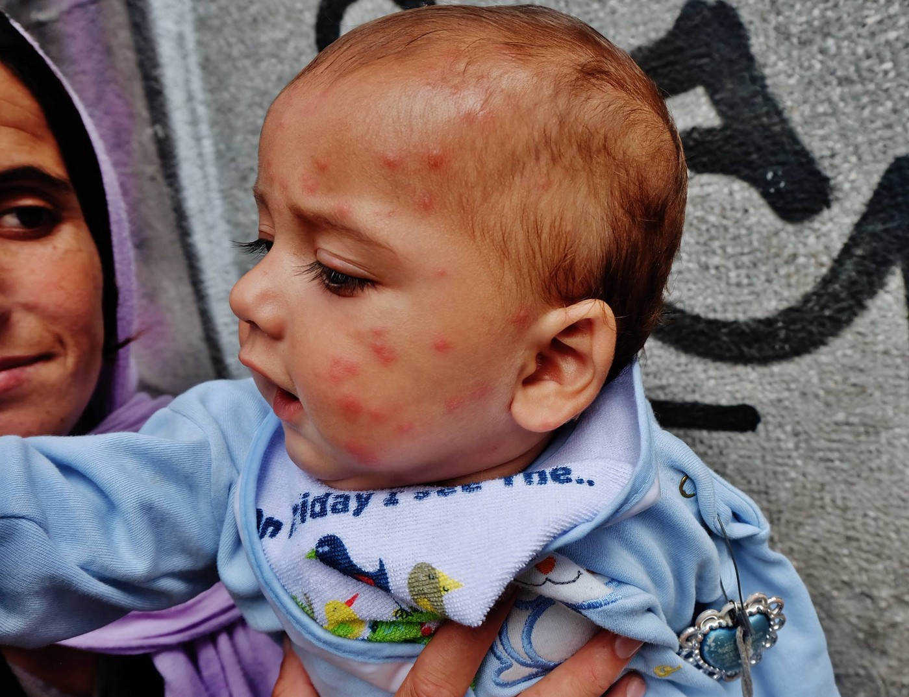
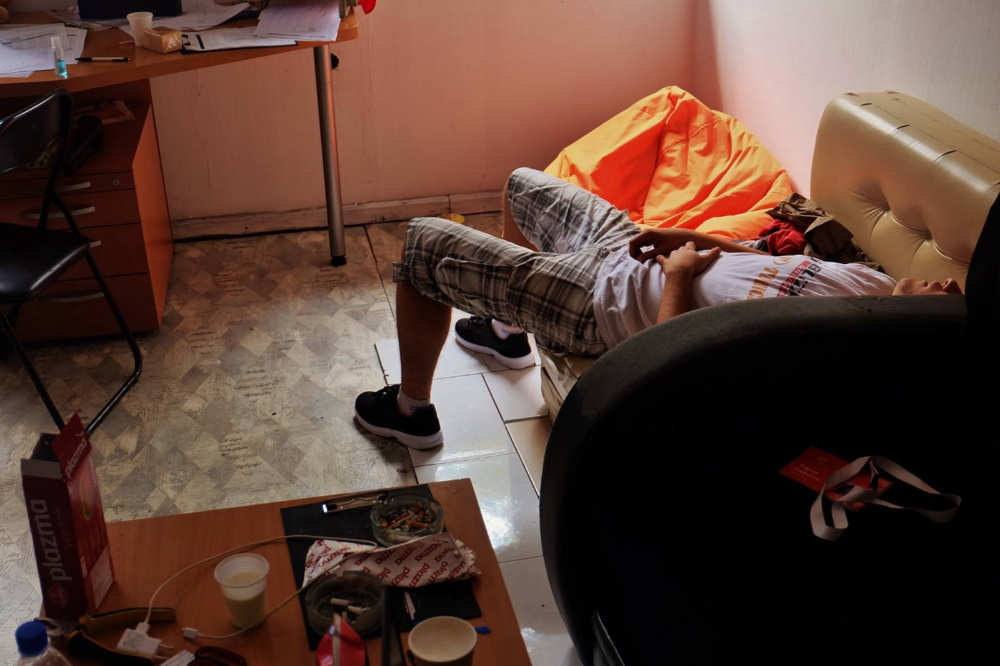
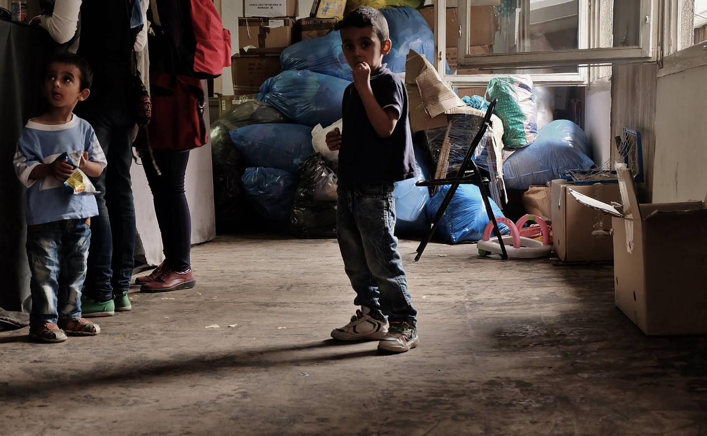
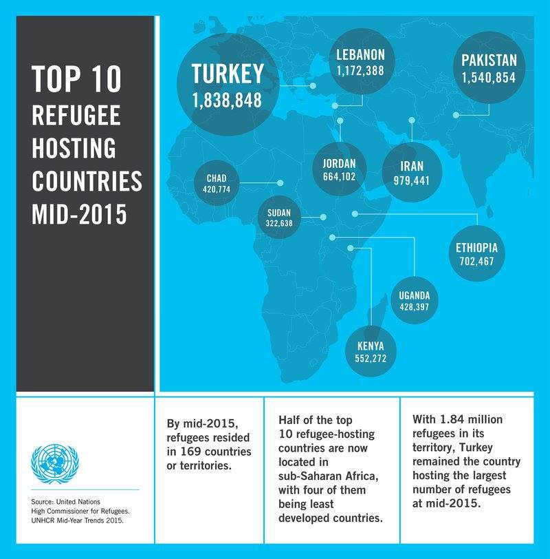

### AYS DAILY DIGEST 27/7: Evictions and poor conditions in camps urge proper housing

_New victims of the growing refugee crisis on two continents: 87 bodies wash up on Libyan shores as the conflicts and lack of security drive more people to dangerous waters in hope of safety in Europe, while at least 48 people are killed and many injured in a truck bomb blast in the largely Kurdish Syrian city of Qamishli\. Meanwhile, Greece evacuates the last refugees from its largest port in Piraeus, and on mainland, the refugee squats in Thessaloniki are evicted in police raids, followed by arrest and protests\. Greek Prime minister announces schools opening their doors to the refugee children the coming autumn, while his Hungarian counterpart labels migration as poison_

Piraeus port after everybody left\. Photo credit : Alpkhan Photography
#### Libya
### **Sufferings of Africans continue**

The number of bodies of refugees recovered on a Libyan beach since the weekend has risen to 87, according to a media official from the coastal city of Sabratha\.

The conflict and lack of security within Libya and along its borders has led to a greater number of refugees and migrants using the country as an exit point to reach Europe\.

Human traffickers have been taking advantage of the desperate people trying to reach Europe and it resulted in more than 10,000 people going missing or losing their lives in the Mediterranean since the 2014, according to the UN\. Many have faces killings, torture, rape and starvation, as Amnesty International [reported](https://www.amnesty.org.uk/press-releases/libya-new-testimonies-reveal-horrors-inflicted-refugees-and-migrants-traffickers) earlier this month\.

Violence and brutality to the most barbaric and unconscionable extent, perpetrated by Boko Haram in Sub\-Saharan Africa is resulting in massive forced displacement\. Over 9 milion people need humanitarian assistance across the Lake Chad Basin, spanning parts of Nigeria, Niger, Chad and Cameroon\. Seven million of the nine million people in need across the Lake Chad Basin, are in Nigeria\. The affected communities are rapidly running out of food, especially in Nigeria, which has recently declared a nutrition emergency\. Out of 1\.7 million displaced children, each day 134 children die, top UN emergency aid official Stephen O’Brien stressed in a [statement](http://reliefweb.int/report/nigeria/under-secretary-general-humanitarian-affairs-and-emergency-relief-coordinator-stephen) to the Security Council today, saying:

> „Personally, I have been travelling throughout this region on and off for the past 37 years — I have never heard such fear and desperation\. This is a new terrible\.“ 

According to the Humanitarian Response Plan, 1\.28 million people within Libya are at risk of food insecurity, of which 210,000 are in need of food assistance\.

Continuation of the food delivery operation organized by the [World Food Program](http://www.wfp.org/) will be in question from September due to underfunding, severely limiting their capacity to deliver much\-needed food assistance, WFP warns in their latest [report](http://reliefweb.int/sites/reliefweb.int/files/resources/wfp285703.pdf) \.
#### **Syria**
### More victims of war in Syria

At least 48 people were killed in the latest truck bomb blast claimed by Islamic State in the northeastern Syrian city of Qamishli near the Turkish border earlier today\.

According to [Reuters](http://uk.reuters.com/article/uk-mideast-crisis-syria-hasaka-idUKKCN1070R5) , IS claimed responsibility for what it said was a suicide truck bomb attack, and added that it targeted Kurdish security forces\. The blasts caused massive damage to the area and rescue teams are working to recover victims from under the rubble\. The death toll is expected to rise because of a large number of those seriously injured among more than 160 people who were injured in the attack\.

Widespread civilian deaths, injury and displacement are a daily reality for Syrians, as a result of the continuing fighting and violence from all sides\. Dozens of people were reportedly killed by US airstrikes in northern Syria last week in what may amount to the greatest loss of civilian life in the coalition’s two\-year war against so\-called Islamic State, Irin News reports\.

UK\-based group [Airwars](https://airwars.org/) monitors coalition action in Iraq and Syria against the IS and is one of the groups who have undertaken the tough job of trying to establish the number of deaths in Syria and the causes of death of the Syrian people, along with teams like the one at [Violation and Documentation Centre](http://www.vdc-sy.info/index.php/en/) \.
#### **Greece**
### 107 New Arrivals

**Lesvos**

One boat with 33 people, including 2 children, arrived today to the Skala Sikamineas harbor, Lesvos\. At Chios, 26 people arrived at port and 48 to Gridia beach\.

**Last Piraeus refugee residents evicted**

Piraeus, Greece’s largest port, ceased to be a makeshift refugee camp today, a historic development in the evolution of the European refugee crisis\.

Authorities completed the final evacuation of camp residents this morning\.

Afghan nationals went to Oinofyta, a camp of approximately 58km north of Athens\. Syrians were sent to the town of Trikala, in central Greece\. Ninety people left the camp today and over 500 were transferred in the last week, according to a government official\.

The closure of the camp didn’t go too smoothly, however\. Continue reading our [AYS special](https://medium.com/@AreYouSyrious/ays-special-last-tent-folded-refugees-evicted-from-piraeus-port-75384d490db0#.anwquqxhg) for a full story on the closing of Pireus\. \(Thank you L\. Mertes\. Photo credit : Alpkhan Photography\) \.

Emptines of the Piraeus port where around 7\.000 people lived until today\.

Photo: L\. Mertes
### **Schools are soon to be opened for the refugee children in Greece**

“The inclusion of all refugee children in the public school system will begin in September“, Greek Prime minister Alexis Tzipras said on TV today, adding that „around 800 backup teachers will be hired to meet the additional needs“\.

In the first year the refugee children will initially be schooled separately as the integration process will take time, the education minister stated, according to [Ekathimerini\.](http://www.ekathimerini.com/210784/article/ekathimerini/news/tsipras-greece-to-school-migrant-children-from-september)

According to the NGO Save the Children, which has warned of the risk of a lost generation, the refugee children stuck in camps in Greece on average have not been in school for a year and a half\.
### **Health agency says migrant centers must be closed**

The Center for Disease Control and Prevention \(KEELPNO\) called for the closure of reception centers for refugees across the country after its officials carried out inspections on 16 centers in northern Greece and found the conditions there to pose a public health risk, according to [Ekathimerini](http://www.ekathimerini.com/210759/article/ekathimerini/news/health-agency-says-migrant-centers-must-be-closed) \.

> „Most of the centers are also close to areas that attract large mosquito populations, exposing migrants further to diseases“, Vice President and author of the report Andreas Benos said, adding: “We believe that, for reasons of public health, reception centres should be closed”\. 

### **Evacuation of squats in Thessaloniki opposition of the ruling**

At the same time as more of those involved in the refugee situation in Greece seen to share the conclusion that it is a matter of urgency to find proper housing for those staying in camps and provisional accommodation, the evacuation of three refugee housing squats in Thessaloniki \(the now\-defunct Megas Alexandros orphanage in the Ano Toumba neighborhood, the Mandalideio mansion on the coastal Nikis Avenue, and an eight\-story building in downtown Thessaloniki\) by the police started earlier today\. A number of volunteers and those staying at the squats were detained by the police during the raid and their hearing is supposedly scheduled for tomorrow\.

The ruling SYRIZA party, however, has condemned the operation by police in Thessaloniki\.

“Criminalizing solidarity projects is a method that has nothing to do with the principles and values of the Left,” the party [reportedly](http://www.ekathimerini.com/210783/article/ekathimerini/news/syriza-condemns-police-raid-on-thessaloniki-squats) said in a statement\.

](assets/4b511392cc13/1*ij6SnJE3NWGXB0rOHhHUXw.jpeg)

From Trento \(Italy\) to Thessaloniki solidarity with migrants and activists of Kinotita Hurriya\. This morning the squat has been evacuated by police in Thessaloniki\.
Now fifty activists are still in detention\.
From Italy to Greece the right to housing can not be touched\. 
Freedom for all\. Photo [**Centro Sociale Bruno**](https://www.facebook.com/centro.bruno/)
### **Volunteers and funds needed in camps**

The Mobile Info Team are looking for Arabic translators to help them during their weekly visits, which take around 3 hours, in the following camps: Sinatex, Diavata, Sindos karamanlis, Softex, Lete, Elpida, Frakaport, Oreokastro and Vaiochori\.
#### NeaKavala

A group of volunteers who were working there are leaving next week, so they need more volunteers\. They run the camp school activities, play with children in the mornings and organize a women space\. Contact: Isa Mordia on Facebook\.
#### Mazaraki \(Cherso\)

According to some of the refugees staying at Mazaraki, the camp is emptying slowly as refugees leave in a search for better accomodation, hoping to move to other camps near the big cities or go back to Turkey\. The remaining inhabitants of the camp in Cherso are suposedly scheduled to be transferred to another camp sometime in October\.

A group that has been working non\-stop in Mazaraki camp in Cherso as well as other places in Greece is the Open Cultural Centre team\. They need support to function and evolve from a short\-term solution into a long\-term commitment to the people living in the camps\.

> „We are grateful for in\-kind contributions, but need funding to cover operational costs such as transport and maintenance that are absolutely necessary to keep going\.“ 

If you are interested in making a donation to the OCC project, please visit these sites [https://www\.youcaring\.com/idomeni\-cultural\-center\-561260](https://www.youcaring.com/idomeni-cultural-center-561260) \(for any amount\) or [https://www\.teaming\.net/openculturalcenter](https://www.teaming.net/openculturalcenter) \(to make a donation of 1 euro/month\)
#### Bulgaria
### Bulgaria and Greece joining forces in fear of potential migration pressure

Bulgaria and Greece have agreed to hold a joint exercise of their Special Forces at the common border „to demonstrate unity and strength in the face of a potential surge in migration pressure“, Bulgarian Defence Minister Nikolay Nenchev has said\.

“We have common conclusions regarding the refugee crisis and a recent surge in terrorist acts,” Nenchev said on Tuesday after a meeting with his Greek counterpart Panagiotis Kammenos in Sofia, according to a statement from the Bulgarian Defence Ministry\.

The two countries share the view that they protect not only their own borders but the external border of the European Union as well, Nenchev added\. [Reportedly](http://www.novinite.com/articles/175633/Migration-Wary+Bulgaria%252C+Greece+Agree+to+Hold+Joint+Special+Forces+Exercise+at+Border) they have agreed to express common positions on “specific issues” at the European Union and the forthcoming October meeting of NATO, according to the statement\.
#### Serbia
### No improvement in situation in Serbia

Serbia continues to struggle with the growing number of refugees stranded in the city parks and warehouses in Belgrade, in poor conditions exposing children to disease and exhauster, in spite of the continuing efforts of many volunteers helping on site\.

Syrian boys in Belgrade warehouse and Afghan baby slept outside for many nights is now covered in mosquito bites\. Photo by Nima Yaghmaei\.

Exhausted volunteer takes a nap in the abandoned buildings of Belgrade it is shower time\. Photo by Nima Yaghmaei\.
#### Hungary
### Orban against refugees

While all the member states of the EU confidently rely on the common finance policy of the EU, for example including Hungarians, who in 2014 enjoyed the 6\.620 billion euros of the EU spending, their Prime minister Viktor Orban confidently claimed on Tuesday there is no need for a common European migration policy\.

The Hungarian PM [reportedly](https://euobserver.com/tickers/134498) summarized his stance on that matter saying:

> “For us migration is not a solution but a problem … not medicine but a poison, we don’t need it and we won’t swallow it”\. 

This statement comes at the same time while hundreds of refugees starved, tired and previously beaten by the Hungarian police on the Serbian\-Hungarian border still await in hope for a change of hearts and policies in this country\.
#### General
### The top 10 refugee\-hosting countries may surprise you\.

Misconceptions about the refugee crisis \(and especially the position of the EU countries in welcoming those fleeing war and persecution\) are many and, whether they come from lack of information, fear or other reasons, it is necessary to avoid drawing coclusions without the entire picture in mind\. Check out the current official [UNHCR infographics](http://refugeesmigrants.un.org/infographics) \.

UNHCR

_Converted [Medium Post](https://areyousyrious.medium.com/ays-daily-digest-28-7-evictions-and-poor-conditions-in-camps-urge-proper-housing-4b511392cc13) by [ZMediumToMarkdown](https://github.com/ZhgChgLi/ZMediumToMarkdown)._
