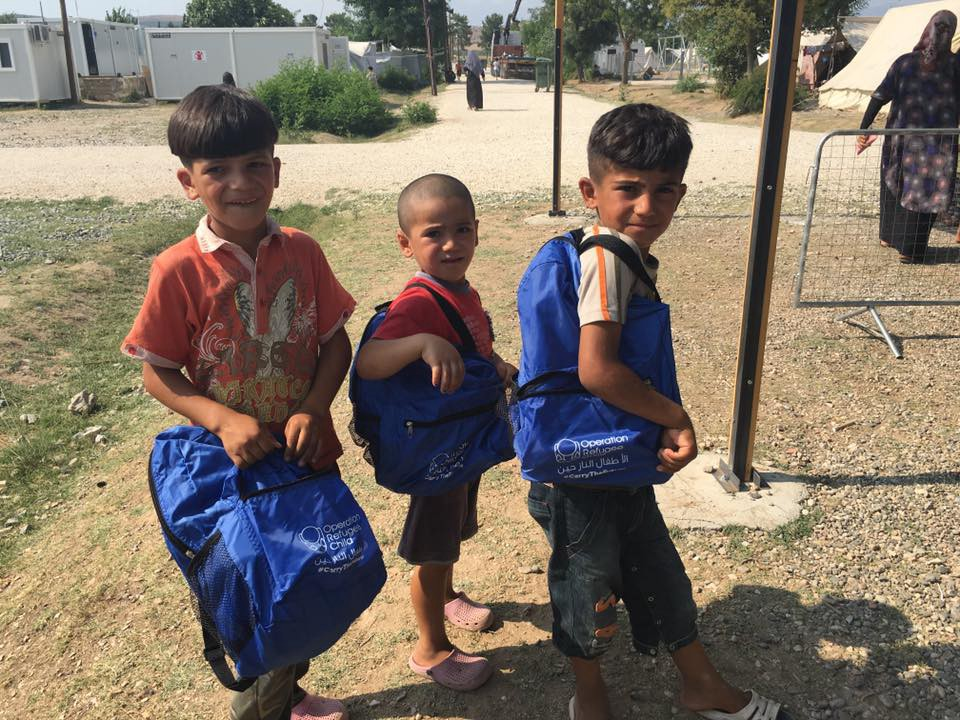
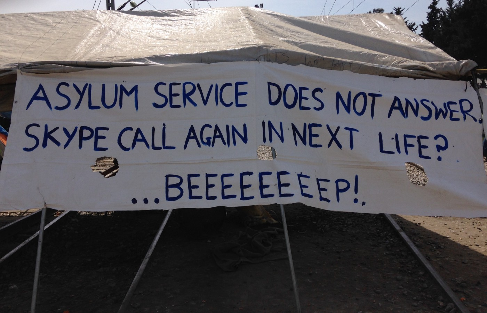
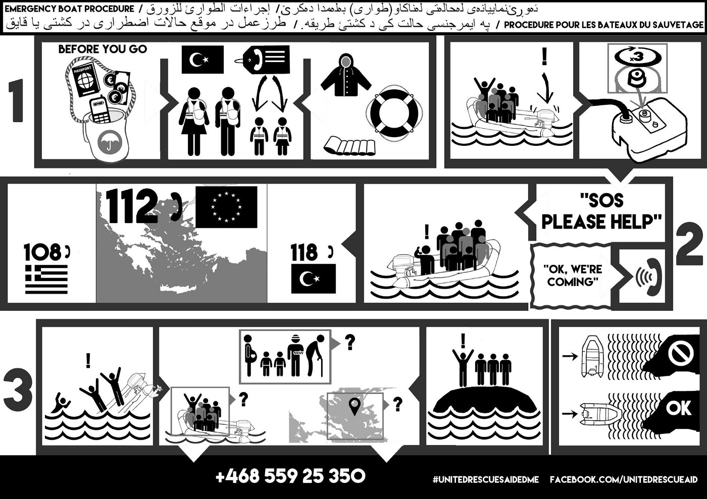
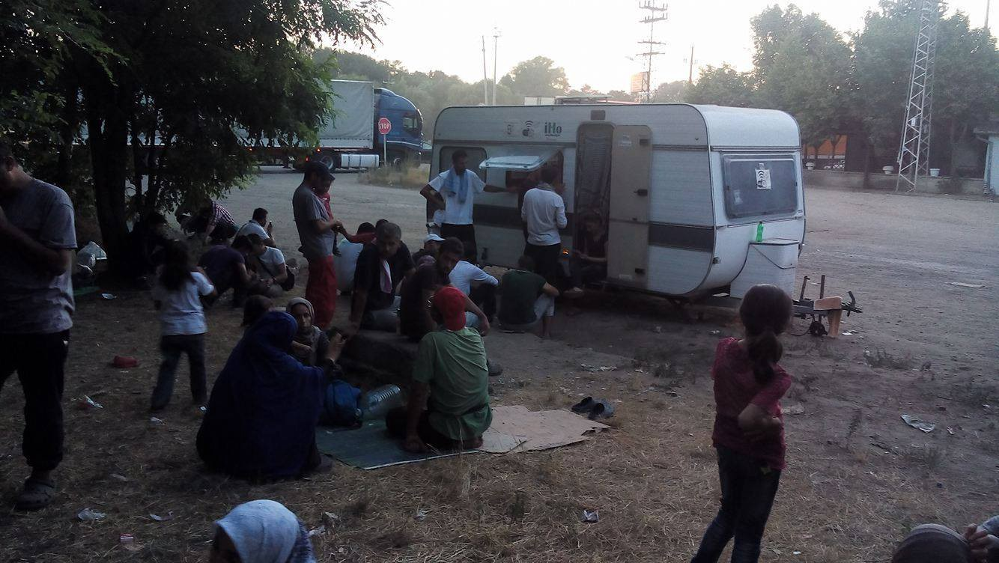

### AYS DAILY NEWS DIGEST 29/07 — Violence in Syria, Iraq, Afghanistan continues, while migrant deaths rise in 2016\.

_As long as war and violence continues, people will continue to flee to Europe\. News in Syria, Iraq, Afghanistan show us what people are fleeing from\. Meanwhile, 3,034 have died so far, trying to cross the Mediterranean to reach Europe\._

Operation Refugee Child sent backpacks filled with gifts to Northern Greece\. Photo by Kayra Martinez
### 251,557 migrants entered Europe by sea in 2016, over 3,000 die

The IOM reports that 251,557 migrants have reached Europe by sea until the 27th of July, arriving mostly in Italy and Greece\. Close to 20,000 people arrived during the month of July alone\.

3,034 migrants and refugees have died so far in 2016\. This year’s total is significantly higher than last year\. At the end of July 2015, some 1,917 people had lost their lives at sea\.

These numbers are not a deterrent for migrants who want to flee violence in their home countries or discrimination and terrible living conditions in their current host countries\. As one Syrian, explains in the book “The New Odyssey”, “even if there was a \(European\) decision to drown the migrant boats, there will still be people going by boat because the individual considers himself dead already\. Maybe not physically, but psychologically and socially \(a Syrian\) is a destroyed human being, he’s reached the point of death\. So I don’t think that even if they decided to bomb migrant boats it would change people’s decision to go”\. News in Syria, Iraq, Afghanistan and Lebanon show us why people flee and will continue to flee, no matter what hurdles are in their way\.
#### Syria
### 4,357 people executed by ISIL

The Syrian Observatory for Human Rights says that since June 2014 and the creation of its alleged ‘caliphate’, ISIL has executed 4,357 people, among them 2,350 civilians, including 85 children and 130 women\. The executions were done by shooting, beheading, stoning, throwing off high place and burning\.

According to Irin, almost 3,600 people were killed by airstrikes in Syria so far this year, while around 1,200 were killed by shelling/explosion, and 500 by detention, kidnapping or execution\.
### Situation in Aleppo continues to deteriorate

As the battle for Aleppo continues to rage on, people are stranded in the city, with few willing or able to use the “humanitarian corridors” proposed by Russia, according to [Middle East Eye](http://www.middleeasteye.net/news/us-sceptical-russias-proposed-humanitarian-passages-aleppo-1645775870) \. The head of Aleppo City Council, Haji Hassan, says the setting up of humanitarian corridors is a lie, adding that “civilians are being targeted in all locations, especially around hospitals, schools and markets”\. Civilians also face shortages of food, water and electricity, while recent air strikes have targeted hospitals and medical facilities\.
### Two dead after maternity hospital hit by air strikes

Save the Children tells [The Independent](http://www.independent.co.uk/news/world/middle-east/syria-wa-maternity-hospital-save-the-children-bombed-idlib-casualties-injuries-assad-russia-rebels-a7162506.html) that two people died in an air strike on maternity hospital supported by the NGO\. The hospital delivers more than 700 babies a month\. An aid worker from the Shafak charity, which runs an ambulance network, also says the death rate in Aleppo is rising, as medics are no longer able to evacuate patients from surrounded rebel areas for treatment\.
#### Afghanistan
### Afghan government loses 5% of its territory to the Taliban

A report by the Special Inspector General for Afghanistan Reconstruction \(SIGAR\) says the area under Afghan government “control or influence” decreased to 65\.6 percent by the end of May from 70\.5 percent last year\. Meanwhile, access to asylum remains difficult for people fleeing Afghanistan, as Afghans are denied access to the EU relocation program, since it is only available to those from a country whose nationals win asylum 75% of the time — in 2015, Afghans won asylum 67% of the time\.

Afghans are refused access to the relocation program, but The U\.N\. Mission in Afghanistan says that 11,000 people were killed or injured in fighting in the country this year, a 45% increase since 2012\.
#### Iraq
### Iraq Body Count Project

A look at the [Iraq Body Count Project](https://www.iraqbodycount.org/) shows why people also continue to flee Iraq\. Violent civilian deaths are reported daily, with 60 killed on Thursday, 53 on Wednesday and 22 on Tuesday\. As an example, 40 bodies of police recruits were found in a mass grave in Ajehlh on Thursday, while 17 were executed in Mosul on Wednesday\.
#### Lebanon
### Syrians face attacks and discrimination in Lebanon

After fleeing their home country, Syrian refugees often find themselves in neighboring countries, such as Turkey and Lebanon\. There, they often encounter discrimination, violence and find it extremely difficult to feed their families\. [Irin](https://www.irinnews.org/feature/2016/07/28/syrians-make-easy-scapegoats-lebanon) reports on the Syrian refugees in the wider governorate of Baalbek\-Hermel who face a 8pm to 6am curfew and have experienced scattered reprisal attacks after the multiple suicide attacks that hit the village of al\-Qaa near the Syrian border a month ago\. One person describes such a reprisal attack: “They made us kneel like this \(he put his hands behind his back\) and started beating each of us, in groups of three or four, with wrenches and knives\.”

Lebanon’s security forces have also detained at least 600 Syrians in the aftermath of the suicide attacks\. It is “difficult and expensive to renew residency papers” of refugees, making them vulnerable to constant arrests and fines\.
### IOM Turkey and the German consulate in Istanbul launch family reunification program

People will continue to flee as long they face violence at home and a secure way for migrants to reach Europe is therefore essential if we want to avoid further drownings\. Only a massive relocation program provides both a safe route for refugees and incentivizes people to wait, rather than risk the dangerous route to Europe\. In a small but important step, IOM Turkey and the German consulate in Istanbul have launched a program to help reunite up to 35,000 families in the region with a close Syrian relative granted asylum in Germany\.

IOM’s “Family Assistance Programme \(FAP\) for Syrians” project, “aims to dissuade Syrian families from seeking unsafe, irregular migration channels to reach Europe”\. IOM offices in Turkey and Lebanon will advise Syrian families on how to prepare documents needed to apply for a German family reunification visa and is offering classes to facilitate integration in Germany\.

You can find more information under Familyreunion\-syria\.diplo\.de
#### Greece
### Pre\-registration has ended

UNHCR says pre\-registration was meant to be a time\-bound large\-scale exercise and has now ended\. However, those who have not been able to pre\-register yet and wish to access the asylum procedure, apply for family reunification or relocation can continue to do so through the Skype system, as per the regular procedure\.

UNHCR claims that since the vast majority of those who wish to pre\-register have done so by now, access to the Skype system should function more efficiently\.

Provisions have been made that the people transferred from Piraeus to Oinofyta and Trikala will be able to pre\-register\.

**Refucomm has written\-up a [great guide](https://www.facebook.com/notes/refucomm-communication-and-information-for-refugees/greece-the-first-steps-to-applying-for-asylum-29072016-update/294630887555387?hc_location=ufi) on how to use Skype to make an appointment with the Asylum office\.**

We hope that the Skype calls will indeed function better than in Idomeni\.

Idomeni\. Photo by AYS
### €11m awarded in emergency funding to Italy and Greece

The European Commission has awarded €7\.3m to bolster the capacity of reception and medical services, particularly on the eastern Aegean islands\. An additional €500,000 are earmarked for technical projects aimed at improving the water supply network and sewage system connection at the hot spot on Samos island according to [Ekathimerini](http://www.ekathimerini.com/210845/article/ekathimerini/news/commission-awards-11-mln-euros-in-emergency-funding-to-greece-and-italy) \.

118 **arrive on Greek Islands**

104 arrived on Lesvos, one on Chios and 13 in Leros\.

The AFP argues the increase in arrivals can be linked to the failed coup in Turkey, since the average rate of migrant arrivals has increased to 90 people per day, up from 30 before the attempted coup\.

As the number of arrivals seems to pick up again, United Rescue Aid is asking for their alarm number and safety flyers to be shared\.

Even sharing the flyer with refugees who are already in Europe could prove useful, as they remain in contact with people who might risk the journey in the future\.

é
### _Weather report_

High waves and strong winds forecast for Leros today and tonight\. Strong winds and high waves forecasted tonight in Kos\.
### Disaster Tech Lab faces difficulties in new camps

The Disaster Tech Lab, who install wifi in refugee camps, have faced difficulty accessing the military\-run camps\. After a meeting with government officials, they seem to have access to “all camps” in the Attica region\. With the renewed importance of the now famous Skype calls, their work is as important as ever\. They are currently [looking for donations to continue their work](https://www.gofundme.com/refugeewifigreece) \.
#### Serbia
### Help needed in Kelebija

Volunteers are still needed in Kelebija as the situation remains extremely difficult\. The camp is meant for 300 people but there are currently 1,300 people there\. IMO, one of the only NGOs there, says 20 people arrive daily, but only 15 per day are allowed to enter Hungary’s transit zone\. Human Rights Watch has reported extensively on the situation at the Hungarian\-Serbian border, describing “cruel, violent pushbacks”, as well as the “ lack of sanitary facilities and even basic shelter for those stuck outside the transit zones”\. IMO says they were able to install internet for more than 100 devices and electricity to charge up to 50 mobile phones \- 2 shelters and learning centres are currently being build\. They plan to start a similar operation in Horgos, the area outside the other transit zone at the border\. The organization needs urgent help from other NGOS, focused on legal assistance in particular\. Donations are welcomed as well\. You can contact them through their [Facebook page](https://www.facebook.com/imhumanIHO/) \.

The “I’m Human Organization” trailer in Kelebija\. Photo by IMO

_Converted [Medium Post](https://areyousyrious.medium.com/ays-daily-news-digest-29-07-violence-in-syria-iraq-afghanistan-continues-undeterred-while-61abc998fe5e) by [ZMediumToMarkdown](https://github.com/ZhgChgLi/ZMediumToMarkdown)._
