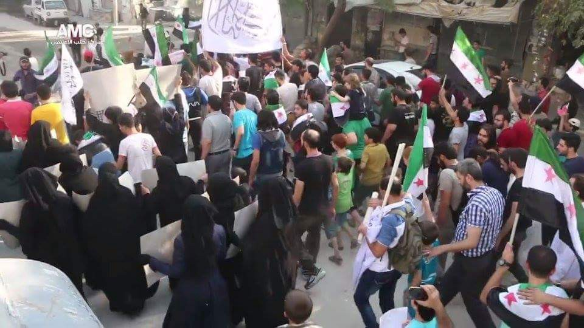
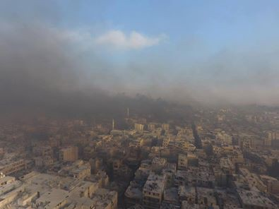
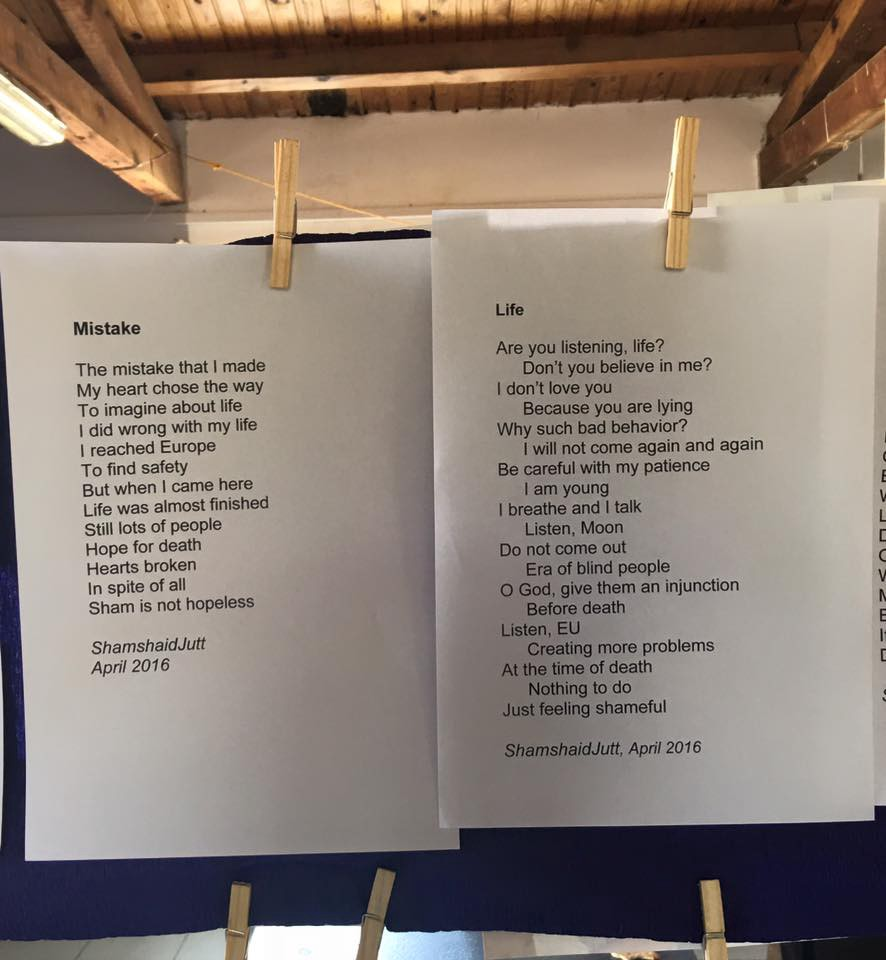

### AYS digest 01/08: Follow the people of Aleppo, not the breaking news

_Syrians tirelessly trying to break the siege of Aleppo\. Yemen on the brink of a peace deal\. Turkey threatening once again to break the fragile EU/Turkey deal\. A family with a newborn coming needs accommodation in Greece\. Large pre\-registration process in Greece has come to an end\. Poems of war and refuge in Lesvos\._

Protests in the streets of Aleppo demanding the end of the siege\. Photo: Free SyriaSalam
#### Syria
### **Aleppo burning \(tires\) to create their own no fly zone and break the siege**

As many news outlets have reported today, Syrian rebels have launched an offensive aimed at breaking a government siege of eastern Aleppo\. The UN estimates that in this part of Aleppo, some 300,000 people are trapped with dwindling food and medical supplies\.

It is not a coincidence that media is finally paying attention to this since many activists on the ground and around the world are spreading the news about this long\-ignored situation as it happens\.

Aleppo burning \(tires\)
### **Share the news about people’s needs and demands in Aleppo\! Follow their stories**

Campaigns on twitter, FB and other social networks helped to spread the word about people on the ground organizing with all their might to break the siege\. After begging the international community for years in vain, the citizens of Aleppo have created their own no\-fly zone by burning tires\. In addition to burning tires, there are also reports of civilians are gathering in the street to protest the siege\. Aleppo is in chaos right now and we urge the media to report more on this popular movement inside the city\. We hope that this could be the beginning of the end of the siege\.

Boys of Aleppo\. Photo\. Free SyriaSalam
#### Yemen
### **Peace treaty for Yemen accepted by exiled government**

Al Jazeera reports that “Yemen’s exiled government says it has accepted a peace deal proposed by the UN that calls on Houthi rebels — who control large swaths of the country — to concede power after more than 14 months of war\. The announcement came on Sunday after a high\-level meeting in Riyadh chaired by Yemen’s President Abd\-Rabbu Mansour Hadi, the AFP news agency said\.” Amidst all of this war, we hope this peace becomes a reality\.
#### Turkey
### **Turkey threatens to break the fragile EU/Turkey deal once again**

Even though Turkish ruling party is vigorously denying human rights to its own citizens and calling for reinstatement of capital punishment, the EU is once again frightened that Turkey would withdraw from the fragile EU/Turkey deal\. We have already reported that there is a slight upsurge of arrivals from Turkey to Greek islands and this is something that Turkey now “holds” over the EU’s head\.
#### Greece
### **End of large scale pre\-registration process in Greece**

On today’s Joint Press Release: Greek Asylum Service, United Nations High Commissioner for Refugees \(UNHCR\), European Asylum Support Office \(EASO\) announced that today is the end of large scale pre\-registration\. The statement asserts that the temporary offices have been shut down because the majority of people have now been pre\-registered\.
### **Skype is supposed to be active again for those who did not pre\-register\.**

Those who have not yet been pre\-registered can ask for a Skype meeting\. Immigration institutions believe that Skype will work this time because there are fewer people who still need to use it\.
### **Those who have** pre\-register **ed wait for a text message**

Those who have pre\-registered will receive a text message on their mobile phones telling them of their next appointment at the Asylum Service to lodge their asylum claim, including claims for family reunification or relocation\.
### 48% of those who have pre\-registered are children

For those interested in the statistics, UNHCR has published some preliminary findings dated to July 5th showing, among other things, that 48% of those pre\-registered are children\. To learn more about what happens after pre\-registration, [follow this link](http://bit.ly/2amWmf1) \.
### Syrian family about to give birth needs accommodation in Greece

There is a call for help to accommodate a Syrian family as mother is about to give birth\. An activist is trying to find some accommodation, but are unable to find an available hotel or hostel during this peak tourism season\. If you are able to help, please contact Simona Bonardi on FB; all costs will be covered\.
### **Poems of war and refuge**

In somewhat brighter news, today the Lesvos Solidarity — Pipka team published pictures of their Today photographs and poems exhibition\. “These poems were written by our very own residents — Hoda and Shamshaid Jutt\. Please read their amazing poems and applaud them for their honesty and creativity\.” If you’d like to move towards some more poetic forms of reporting from the ground, go to the Lesvos Solidarity — Pipka FB page\.

_Converted [Medium Post](https://areyousyrious.medium.com/ays-digest-01-08-follow-the-people-of-aleppo-not-the-breaking-news-25aa8c1d09c2) by [ZMediumToMarkdown](https://github.com/ZhgChgLi/ZMediumToMarkdown)._
