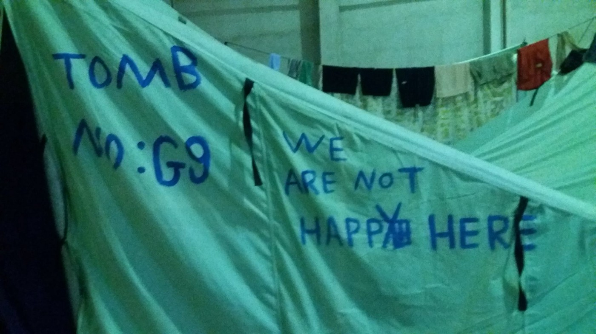
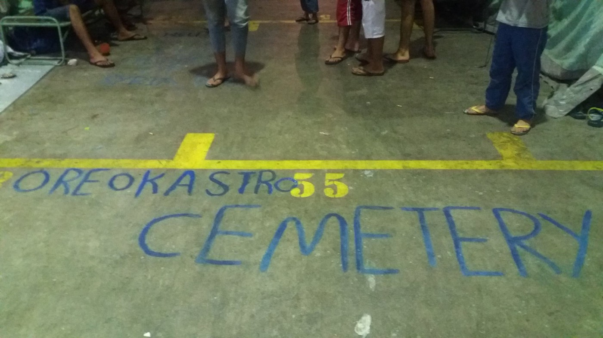
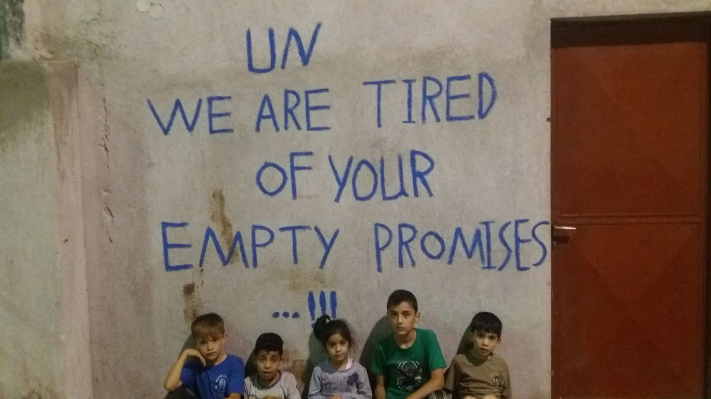
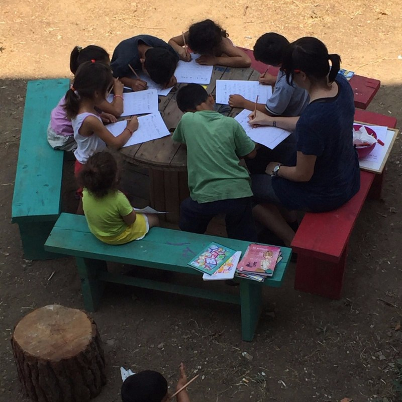
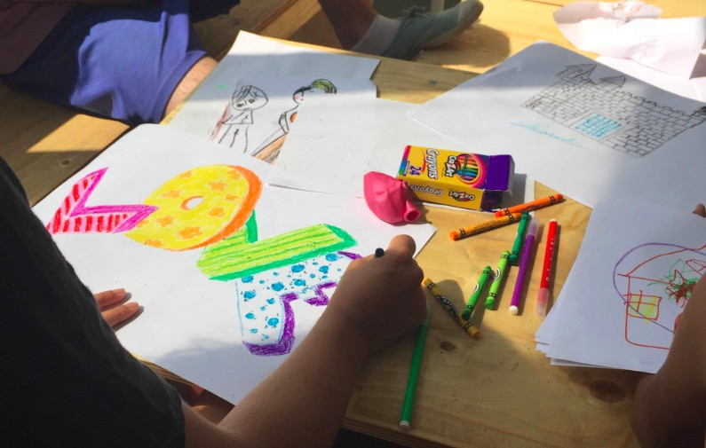
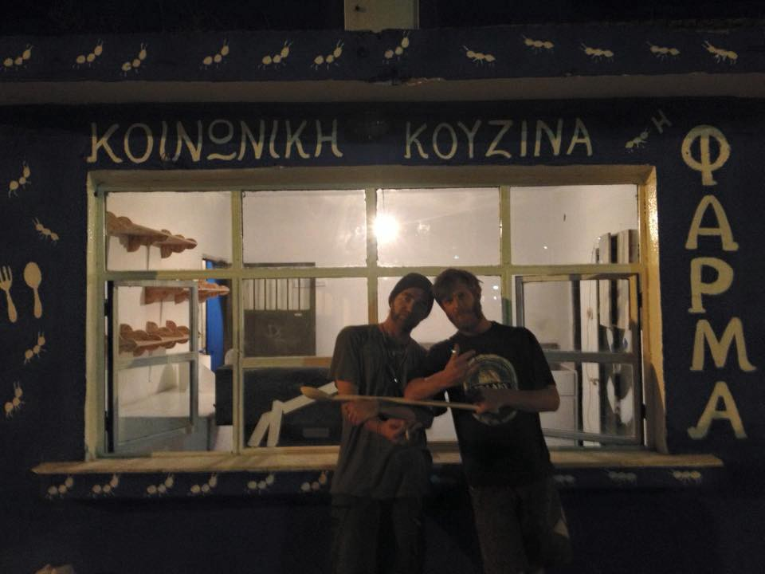
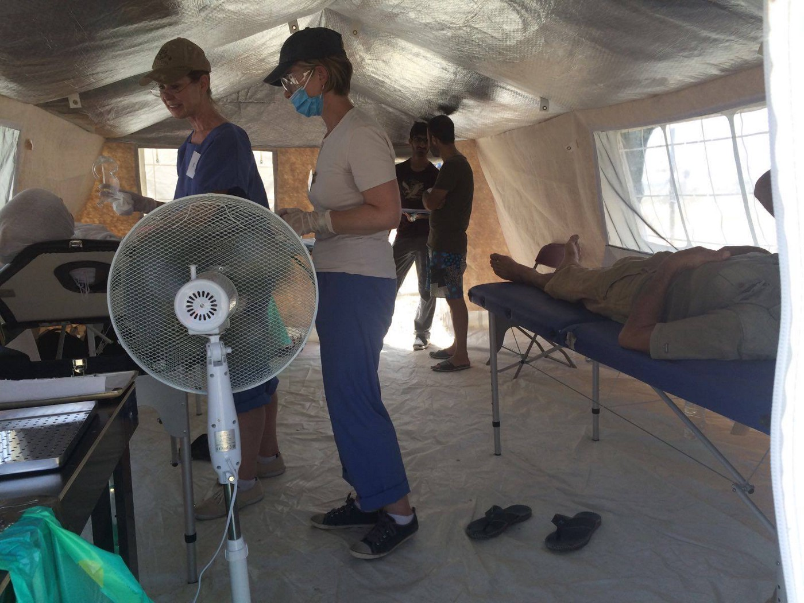
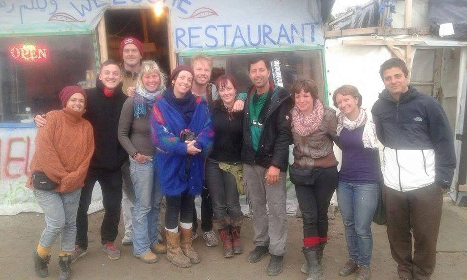
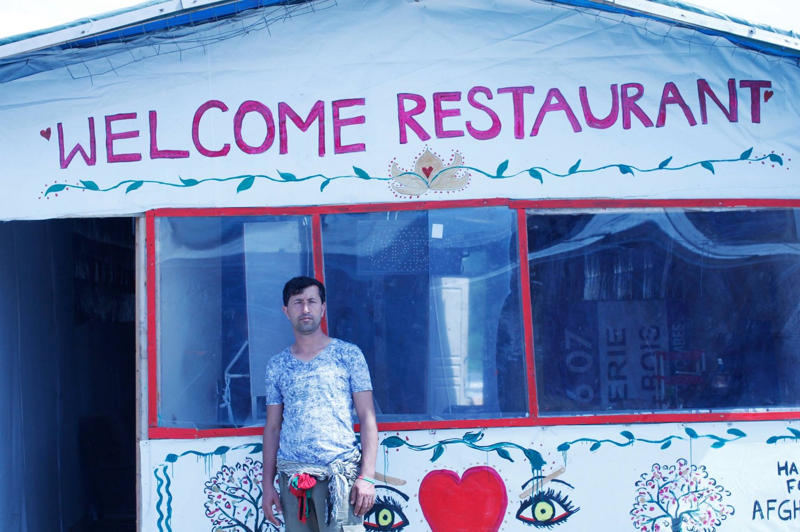

### AYS Daily Digest 7/8: Closed borders = money for smugglers

_Severe weather warning for Greece\. Construction of the wall at the Turkish border with Syria in its final stage\. Closed borders is very profitable business for smugglers\. Help needed in Greece and Calais\. Refugees are compering Oreocastro camp with cemetery\._

Photo by Refugees\.tv: Tents turned into tombs in a sign of protest\.
### Turkey
#### Separation wall almost completed

Kurdish [Ara News Agency reports](http://aranews.net/2016/08/turkish-forces-open-fire-syrian-kurds-trying-cross-border/) that Turkish government continues building the separation wall along its borderline with Syria\. The building started in Fall 2015\. Previously the government announced that the wall will be stretching the length of the border between the two countries\. Plans included barbed wire, a dedicated patrol road, and a reinforced fence\. Additionally, the was has a 24\-hour surveillance system, with drones, mobile surveillance vehicles, and an integrated command and control center\.

Previously, human rights organizations have criticized Turkish government for not allow civilians fleeing Syria to enter, among them [Human Rights Watch \(HRW\) that called on Turkey](https://www.hrw.org/news/2016/04/14/turkey-open-borders-syrians-fleeing-isis) to open its borders\.
### Greece
#### Severe weather warning

The Greek Meteorological Services has issued a severe weather warning alert for the regions of western Greece, the Ionian Sea, and Thessaly for the next 72 hours\.

The forecast speaks of heavy rains, strong winds, and hail\. The extreme weather phenomena started on Sunday and will continue on Monday before fading out on Tuesday\.
#### Over 150 new arrivals

Volunteers from Lesvos informed us about 60 new arrivals yesterday, and 97 this morning\. Everybody is taken care off\.

For those who are already in Greece, the life conditions are not improving\. People forced to live in Oreokastro camp turned their tents into protest\.

Photo by Refugees\.tv: This camp is compared to cemetery by its residents\.

Not long ago, Refugees\.tv [posted a story \(only in Arabic\)](https://www.facebook.com/refugees.tv/videos/782930835182618/) from this camp about Ibrahim, a Syrian refugee who suffers from asthma, and has war wounds\. He claims that he did not get any help from organizations present in this camp\.

The same crew visited [Softex camp recording the story \(video only in Arabic\)](https://www.facebook.com/refugees.tv/videos/782444975231204) about a child in this camp which has a heart problem and needs the operation, but did not get any treatment\.

**_REMINDER_**

Refucomm informs that an updated Skype schedule is released for applicants, and it will be effective from August 8th\. We bring you a very good explanation of how pre\-registration and registration works, and which is just being translated now into several languages\.

You can find [more info useful](http://refucomm.com/infopacks/greece-mainland/asylum-in-greece/preparing-for-your-asylum-interview/en/greece-mainland_asylum-in-greece_preparing-for-your-asylum-interview_EN.pdf) for refugees and volunteers at their website\.
#### Resistance by NoBorder Social Center

[NoBorder Social Center in Mytilini, Lesvos announced today](http://mpalothia.net/lesvos-greece-noborder-social-center-remains-resistance/) that despite the police notification according to which they have to leave the place within several days, they will not go\.

> “In Moria, the situation is disastrous: there is the insufficient provision of food, the place is overcrowded, basic necessities cannot be met\. Yes, our activity indeed is needed\! Under the current circumstances, there is no way we will stop our activities\. NoBorder Social Center remains in resistance\!” 

Good news from new [camp Elpida](http://us13.campaign-archive1.com/?u=bd8ba251def3497140fd25bed&id=fb939501d8) \. First 121 residents arrived in the early hours of July 24th and right away they started building a place for themselves, together with volunteers\.

Photo by Camp Elpida: Children are getting settle in this new camp run by refugees and volunteers together\.

Elpida is a new camp established in an abandoned textile factory near Thessaloniki\. Elpida Home Project is founded by the group of private investors and philanthropists\. The place has a room for 700 people, and it is co\-managed by refugees and volunteers\.

Refugee families have their own rooms but work with volunteers to maintain common spaces, like the children’s play area, the kitchen, and the toilets and showers\. The Greek government covers utilities and rent, and a number of nonprofits provide services to residents\. Together for Better Days provides volunteers, and Medecins du Monde sends psychologists three days a week\. Refugees who are living here have been referred to the government by local NGOs because they’re too vulnerable to live in camps, and letter the government recommends them to the Elpida\.

> UPDATES on yesterday’s call for medical staff for EKO Project\. 

> “The medical staff and teams required needs to have all the legal permissions to operate in Greece\. It’s important to consider that to avoid creating problems with the project itself due to legal reasons\. Therefore the call for medical staff is now suspended\.” 

### Calls for volunteers and donations

A small and experienced team of volunteers opened up a kitchen near Kalachori camp where they are feeding hundreds of people daily\. They deliver food at various places in Thessaloniki, too\. [In order to continue doing this wonderful job, they need your help](https://www.generosity.com/volunteer-fundraising/helping-refugees-in-greece) \.

Photo by Koyzina team\. Cooking for refugees in Thessaloniki area\.

[Dirty Girls of Lesvos](https://www.facebook.com/dirtygirlslesvos/photos/a.563279673830537.1073741826.563268907164947/677019985789838/?type=3&hc_location=ufi) needs your help in order to provide refugees with clean things\. You help them by helping them to pay the laundry bills\.

“Every €30 means 10 clean blankets for ten people\. Multiply that and see how many people you and your friends can help\.”

> Donations can be [her](http://www.cardeacenterforwomen.org/Donate.html.) e\. 
 

> or
 

> Cardea Center for Women
 

> Acct \#: 2000041390120
 

> Direct to routing \#: 121000248
 

> International SWIFT code: WFBIUS6S
 

> Bank: Wells Fargo, N\.A\.
 

> Bank address: 420 Montgomery St\., San Francisco, CA 94104 

Volunteers and teachers volunteers are needed in [Early Learning Centre](https://www.facebook.com/LayhingSiu?hc_location=ufi) \. They say that you need to be fluent in English/ se habla Español también\. But the last is not required\.

> “You would want to work with children of all ages and adults who want to learn English too\. Be fully independent and self\-fund yourself\. We can provide you with information about cheap accommodation and help out with transport to the camp\. But we encourage you to team up and rent a car\. If you can fundraise for your expenses that would be great\.” 

There will be a little more support in terms of accommodation and transport for teacher volunteers who can commit for more than a month\.

They are also looking for a manager who would help to make sure the school is running smoothly and that the teachers and the students have all they need in terms of teaching materials\.

Qualified dentists, dental nurses, and Arabic speakers are urgently needed for a [Dental\-Point project](http://www.healthpointfoundation.org) , to join their team from September\.

Dental\-Point runs outreach clinics in Northern Greece and see hundreds of patients every week\.

If you want to apply, get in touch with them by 
[dental@healthpointfoundation\.org](mailto:dental@healthpointfoundation.org)

Photo Dental team: Dentists and nurses needed for this amazing project\.
### Bulgaria
#### Man sentenced to two years for smuggling

Bulgarian Supreme Court of Cassation sentenced to two years in prison a Kemal Turan who tried to smuggle 41 people into Romania, [local media are reporting](http://www.novinite.com/articles/175797/Bulgaria+Jails+Man+over+People+Smuggling%2C+Attempted+Bribery) \. The ruling cannot be appealed\. He was arrested in April last year after trying to bribe a customs official\.

Among people found in the truck he was driving, were four children\. Turan refused to plead guilty and appealed the sentence two times\.
#### Cross border cooperation

Bulgarian and Serbian interior ministers met today to discuss the situation at the common border and check security measures there\. Previously, Serbia accused Bulgaria of lacks of proper border controls\.

Last month, Belgrade approved the creation of the joint army and police patrols along the borders with Bulgaria and Macedonia\. Since then, Bulgarian police is reporting high numbers of detained refugees\.

Nevertheless, a number of people at the Balkan Rout is higher every day\. Tighter controls make smuggler rates higher and job more lucrative\. According to the recent [Europol data](https://www.europol.europa.eu/content/latest-trends-migrant-smuggling-nearly-7000-suspected-smugglers-reported-increased-exploitat) , people have to pay up to 3000 Euro for just one part of the journey, while the last year they were paying between 2\.000 and 5\.000 for the entire trip\. 5 percent of refugees declared that they have to work to pay back smugglers\.
### France
#### Call for volunteers stories and photos from Calais

The local authority in Calais has called for the eviction of people living and working in 72 Calais jungle shops and restaurants\. Volunteers are launching the legal appeal and there will be a court case on Wednesday, August 10, in Lille\. [Residents and volunteers are gathering testimonies](https://www.facebook.com/RefugeeInfoBus/) about the shops and restaurant that they will deliver to the judge\. They argue that the place is needed for all the refugees and that it serves as community center, too\. If you ever volunteered with them, please get in touch with Refugee Info Bus\. You can help to save these community spaces\.

Photo by Refugee Info Bus: Calais community center\.

Earlier this year, French authorities dismantled the southern half of the Calais camp, known as “The Jungle”, where thousands of refugees lived waiting and hoping to be able to find their home in a safe country soon\.
### UK
#### Call to protect children of Calais

Actress and activist Vanessa Redgrave in an open letter called the British prime minister to bring to the country unaccompanied children from Calais if they have families in Britain\.

> “There’s 170 children who have relatives in this country and they’ve been in Calais under terrible conditions, for about nine months some of them\. It’s an appalling situation,” Redgrave told Reuters explaining the reason for the letter\. 

In the UK, organization Citizens UK is helping to children to reunited with their families\. This year they helped more than 40 children or on average three children a week, which is very slow\.

A committee of lawmakers recommended this week unaccompanied minors should be welcomed to the UK in “a one\-off action”\.

_Converted [Medium Post](https://areyousyrious.medium.com/ays-daily-digest-7-8-people-have-to-pay-smugglers-up-to-3000-euro-for-just-one-part-of-their-169f3f3d75b5) by [ZMediumToMarkdown](https://github.com/ZhgChgLi/ZMediumToMarkdown)._
