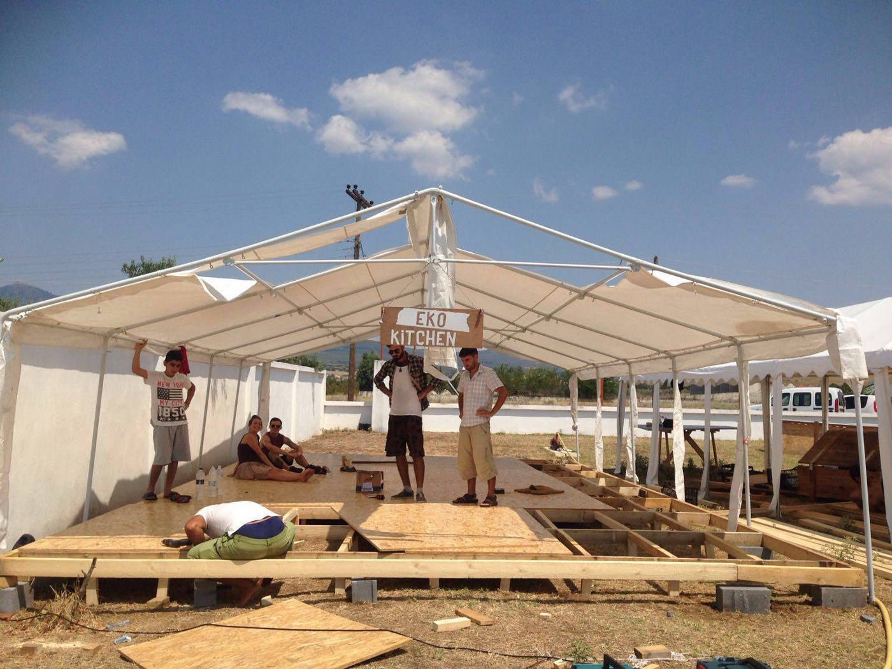
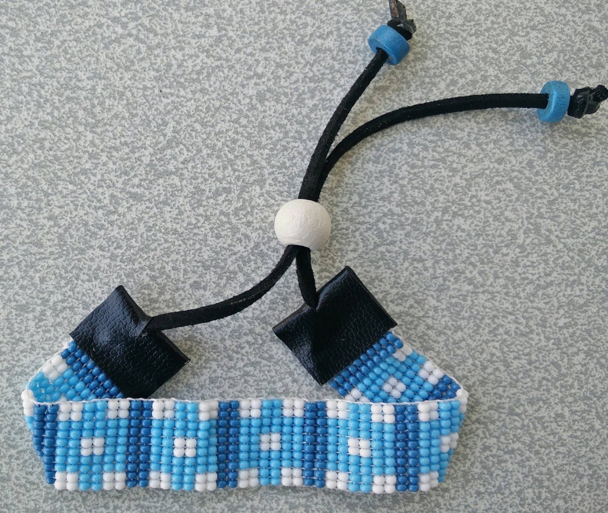
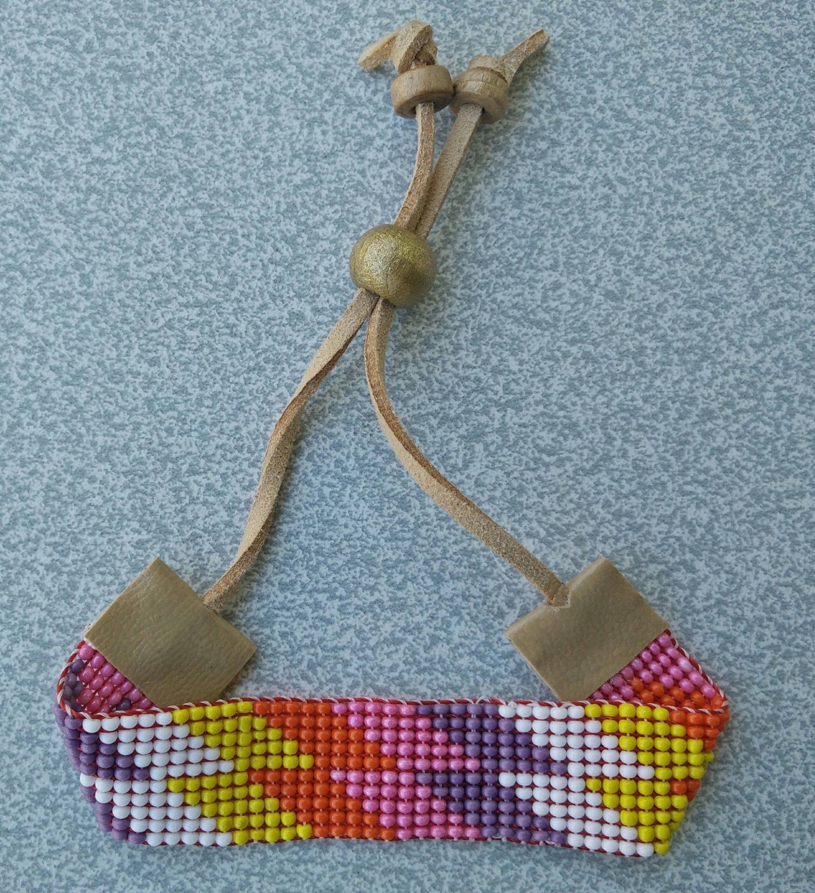
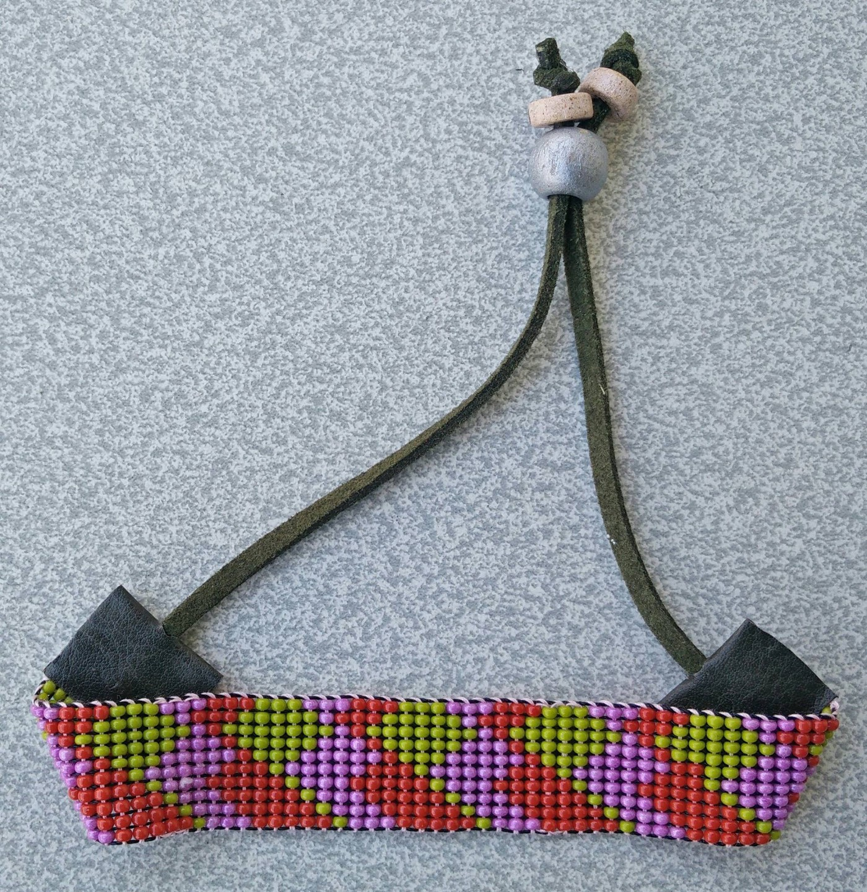
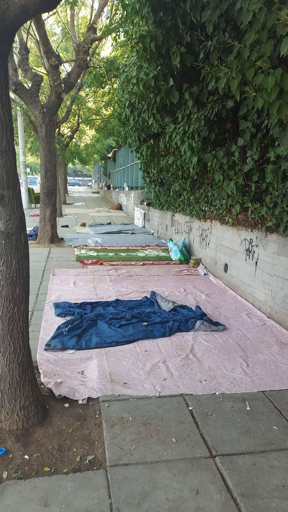
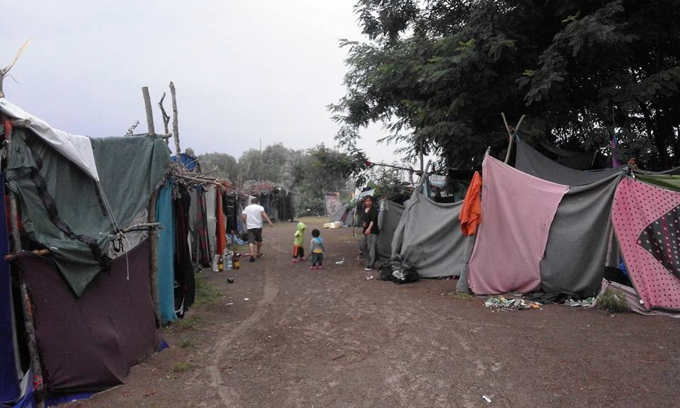
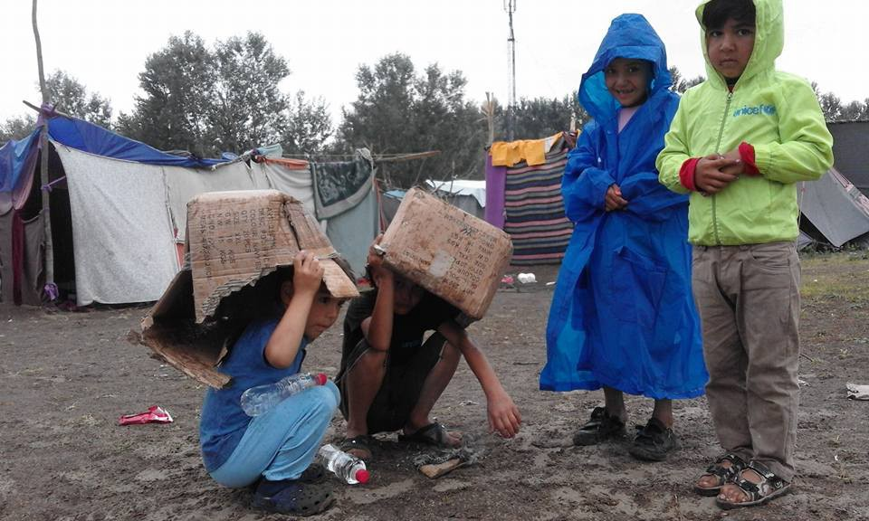
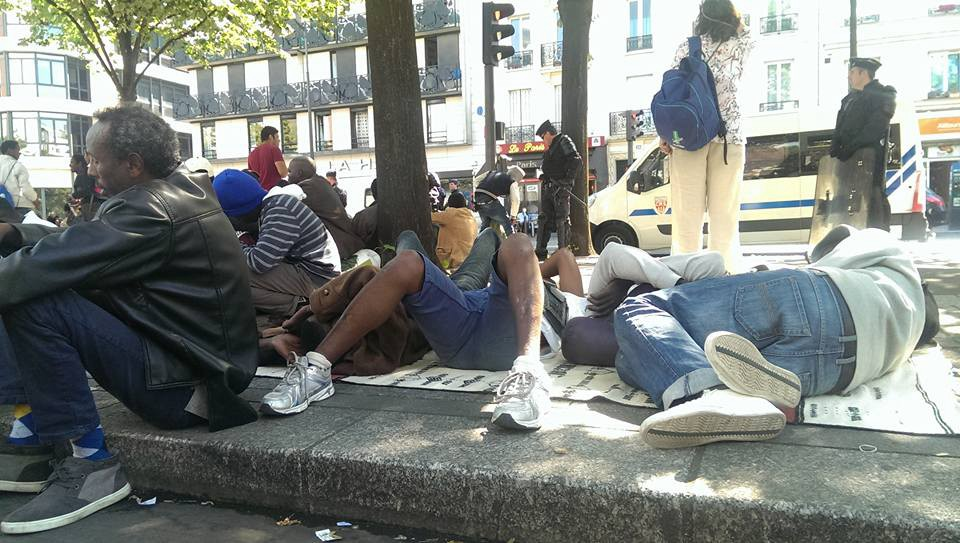

### AYS DIGEST 17/8: Police evictions across many fronts\.

Photo Courtesy: EKO Kitchen
### SYRIA

We are happy to report that some progress has been made in the report of a young Syrian toddler who was in serious need of medical evacuation, which [we reported on 15/8](https://medium.com/@AreYouSyrious/are-you-syrious-digest-15-8-critically-ill-patients-stuck-in-syria-b493adecb55a#.w634vzcqd) \. He was evacuated from Berm/Rukban camp in Syria [by the Jordanian military to Jordan](http://hosted.ap.org/dynamic/stories/M/ML_JORDAN_REFUGEE_BOY?SITE=AP&SECTION=HOME&TEMPLATE=DEFAULT&CTIME=2016-08-17-10-42-46#cd0a6431-6066-4c2e-a317-f1256911d943) \.

Additionally, 30 containers of aid were dropped on the regime\-controlled area of Der Ezzor\. Al Qosur and Al Jora, also in the same province, were targeted in shelling raids by IS, [according to Syria Observatory for Human Rights](https://www.facebook.com/syriahroe/posts/923291124445893?hc_location=ufi) \.
### TURKEY

There’s [a new batch of beautiful ReVi bracelets in stock](https://www.facebook.com/revistore/) \. The organization works to provide crafting jobs to refugees in Turkey, ensuring that the income goes to replace income made by children in the family\. Hopefully, by receiving equitable pay for fine handicrafts, the need to send children to work in disturbingly criminal conditions can be diminished\.

Photos courtesy of ReVi

In other news, Germany’s European Affairs Minister said that the path to [visa\-free travel for Turkey will be very long](http://www.reuters.com/article/us-europe-migrants-turkey-germany-idUSKCN10R1PH?feedType=RSS&feedName=worldNews) , which is probably not in keeping with the October 1st timetable that Erdogan is offering as the deadline before discontinuing the EU\-Turkey deal\. We can only wait\.
### GREECE

NEW ARRIVALS: Today 44 people have landed in Lesvos, 59 in Kos and 44 in Kalymnos, for a total of 147\.

As options for refugees run out, many refugees are applying for asylum in Greece\. [According to NewsThatMoves](https://newsthatmoves.org/en/asylum-applications-in-greece-increase-over-264/) , asylum applications in 2016 have increased by 264% compared to last year, back when Greece was mostly a transit country\.

Safe Assist Outreach’s weather report now includes weather for Libya and Italy, in addition to Greece\. Be sure to bookmark [this page](http://saoweather.azurewebsites.net/) for important weather updates\.
#### Thessaloniki

Teams from multiple organizations, including AYS, report that police are evicting refugees from the park and treating volunteers with some hostility, blaming them for making the location habitable and therefore incentivizing more refugees to come and wait in the park\.

Thessaloniki\. Photo Credit: Ruhi Loren Akhtar

The term “people hunting” seemed fitting today to describe what’s happening at Thessaloniki Park’s unofficial gathering\. This morning, police came at 7 am without announcement and picked up refugees, taking them to other camps in northern Greece\. There were around 400 people in the camp last night\. Many kept trying to return throughout the day, but police stayed there during the whole day and through the evening, searching for people\. Many of the camps in northern Greece are in a state of decay — the smell is so bad that people cannot breathe without covering their noses and mouths to keep from coughing\. Furthermore, malaria cases are starting to appear in the camps\. More details will be released in upcoming AYS specials\.
#### Athens

First LGBTQ Workshop held in Athens\! Make sure to follow procedures in order to protect the safety of all involved\.

_“Dear volunteers, we are holding our first LGBTQ workshop in Exharchia, Athens on Monday 22nd August at 4pm to 6pm at the Orange House\. The workshop will be run by my friend Dan Steiner, a highly trained volunteer from the UK\. A psychotherapist will also be available at the session should any refugee feel the need for more support\._

_If you know of any LGBTQ refugees that will benefit from some support then please PM \[Sumita Shah\] \. Spaces are limited, so only PM if your refugee friend is definitely able to attend\. I will then confirm their place\. Only confirmed people will be allowed to attend\. Location will only be provided when I confirm\.”_

Read the first\-hand account of some of the good people that live in one of the squats that have popped up in Athens\.

> Today dawned with most of Athens and Greece in shut\-down mode due to a Church holiday\. Nothing other than the smallest of convenience stores was open\. 

> Not wishing to lose any time and having established where one of our families were now located, we headed for another squat\. 

> Squats were a feature of life in the 60’s, 70’s and 80’s, and usually conjured up images of broken windows, no doors, no electricity, little furniture, poverty, homelessness, drugs and alcohol\. Here in Athens, only the drugs and alcohol are missing\. 

> We found our family, M, AA, and their children\. They live in a corner in a former Science Room, which they share with 4 other families\. They are lucky because they found 2 mattresses on which all of them sleep together\. The children seem fine now having recovered from some type of bites that left them with enormous welts all over their bodies\. M showed us pictures and it was not easy to look at them\. 

> Of course this situation is such an improvement from their situation at Chara near Idomeni when they spent 3 months in a tent at the side of the road\. At least they have a mattress and a roof over their heads here, but we must never allow ourselves to be dragged into complacency, thinking because they have such “luxury” now, they are ok; they are NOT and never will be while they lie in these sub\- human conditions\. 

> My guide for the day was R, our 17 year old UM\. Again and again I marvel
 

> At his ability in both Greek and English, him being a boy who arrived to Leros on March 4th without knowing a word of either language\. Confidently and with ease he switches from one language to another as he leads us through Athens finding various places and people using the metro\. 

> Again I can only wonder what this boy could achieve academically if only he had the chance\. His fervent wish in life is and has been from an early age is to become a surgeon\. I have no doubt that academically he will succeed if given the chance and would suggest, given his nature and his experiences here over the last 6 months, that he will be a caring and nurturing professional if the day ever comes that he gets his parchment\. 

Story courtesy of [**Carmel Nic Airt Island To Island**](https://www.facebook.com/CarmelNicArtIslandtoisland/) **\. Consider donating to their work if you wish to support families like this\.**

Speaking of Squats, a volunteer has set up a TeamUp page in an effort to better coordinate volunteer activity in and around various squats and camps\. If you’re interested, check it out [here](https://teamup.com/ks4c7a2bc9d74dd609) , and sign up in an effort to minimize duplicated care and effort\.
#### Thiva

In response to protests on Crete about opening a camp to house 2000 in order to reduce the stress on the overburdened camp system, a new camp in Thiva is slated for construction\. Those currently residing in Elliniko will probably be moved, [according to government plans](http://www.ekathimerini.com/211248/article/ekathimerini/news/new-migrant-center-to-open-near-thiva-as-cretan-authorities-protest-plans-for-four-local-camps) \.
#### Ritsona

Local papers cover the success of volunteers helping people in Ritsona\.

After discussing how volunteers and small organizations cared for the needs of people since April, [the article highlighted how](http://www.efsyn.gr/arthro/i-dipsa-gia-mathisi-de-gnorizei-ethnikotita) largescale NGOs did little to alleviate the boredom and educational neglect of some 200 children in Ritsona\.

> The ELME Evia found that children’s educational needs are not covered by state apparatus nor the NGOs who were active in the camp, so on its own initiative, proceeded to count the children to record their age and level of education and immediately began lessons in Halkida school\. 

> The aim of this action was to stop the isolation and ghettoization of children by facilitating formal schooling for them, within the urban fabric\. 

> The students aged 5–25 years were transported every Wednesday with commuter bus Prefecture of Evia 2nd Lyceum Halkida, where 30 volunteer teachers teach basic speaking and writing structures in Greek and English\. 

> Refugee children were also able to use the computer lab of the school and learn about the education system in Greece and asylum services\. 

The children also go on archaeological visits and museum tours\. This is a great initiative that can hopefully be replicated\.
### SERBIA
#### New arrivals in Presevo\!

By this morning there were 404 refugees in the camp\. Throughout Wednesday, approximately 80 more refugees arrived, most of them from Dimitrovgrad, entering Serbia from Bulgaria \(22 children, 2 babies, 1 grandmother\) \. After police processing, they were sent to Reception Center Presevo\. Most of them traveled in transportation organized by UNHCR\. The Presevo camp is now a closed camp — no refugees are allowed outside of the camp\.

Photo Credit: Refugee Behind The Closed Borders

Next week, a new camp will open in Bujanovac and then in Vranje\. There will also be a 3rd phase of renovation starting up inside a tobacco factory, which is where most refugees are housed in the One\-Stop Center, Presevo\. With the increased pressure and recent “evacuations” of parks and unofficial camps across Serbia, it appears that the goal is to get everyone out of the public eye\.

If you are interested in assisting directly, take a look at this job opportunity: [http://www\.sos\-decijasela\.rs/ljudski\-resursi\-2/trenutni\-konkursi/](http://l.facebook.com/l.php?u=http%3A%2F%2Fwww.sos-decijasela.rs%2Fljudski-resursi-2%2Ftrenutni-konkursi%2F&h=xAQEjJm03)
#### Rains in Serbia affected distribution at every point\.

Miksaliste was able to run successful food delivery inside their space in Belgrade\.

At the Hungarian border, I’m Human Organization reports that many shelters were destroyed by recent storms\.

The project [Refugee Behind the Close Borders](https://www.facebook.com/Refugee-behind-the-closed-borders-1264829603528876/) gives an intimate look at one of the unofficial camps near the Serbian\-Hungarian border\. The page is administered by a “resident” of the camp himself, and can often answer questions\. If you want to learn about things from the perspective of the people going through them, this would be an excellent place to start\.

Photo Credit: Refugee behind The Closed Borders
### ITALY

A man has been arrested for attempting to bring people into France\. The man, [a native of Nice, France](http://www.thelocal.it/20160817/italian-police-arrest-man-for-smuggling-migrants-into-france) , was apprehended by Italian police near the French\-Italian border\. The man was previously known to police due to his affiliation with no\-border activist groups\. We have not yet seen a response from other no\-border groups across the world, but this could bring additional oversight and attention to their activities by authorities\.

Furthermore, as more and more refugees and migrants get trapped at the border with Switzerland, political tempers flare\. Switzerland maintains that it is not being discriminatory; however Italian officials and those on the ground argue that for all intents and purposes, [Switzerland’s border with Italy is shut](http://www.euractiv.com/section/global-europe/news/swiss-italian-frontier-becomes-flashpoint-in-europes-migrant-crisis/) \.
### GERMANY

According to Refucomm, there is good news from Germany\. On July 26th, the home office pressured the office managing refugees to delay Dublin\-III regulation removals back to Greece until January 8th\. Although that is still not ideal compared to “not happening at all,” we’re hoping that this longer time\-table gives refugees more time to explore their options\. The full statement can be found [here](https://www.facebook.com/permalink.php?story_fbid=304176889934120&id=145594569125687) \.
### FRANCE

Refugees and migrants were evicted from various locations across Paris\. Around 800 people all told were taken\. Police says most of them will be brought to “emergency shelters”\.

Refugees in Paris Photo Credit: Salam Quand Meme

The following [is a translated report from RFI\.](http://www.rfi.fr/france/20160816-migrants-calais-refugies-tension-palpable-france-?ns_campaign=reseaux_sociaux&ns_source=FB&ns_mchannel=social&ns_linkname=editorial&aef_campaign_ref=partage_user&aef_campaign_date=2016-08-16)

> A recent census shows 9,000 people are now in Calais, up 2,000 in a month\. Vice\-president of the Office for Migrants, François Guennoc says there are tensions in the camp due to the lack of food and clothes, but also because of stress linked to the difficulties in joining the UK or French reception centers\. Guennoc also says the massive arrivals are due in part to the situation in Paris, with police chasing refugees to prevent the establishment of camps\. Getting smuggled to the UK now costs €12,000, double the price of three months ago\. 

Utopia has announced that they will be leaving Liniere camp shortly, planning to depart by the end of September\. Their reasons for shutting down operations vary from moral \(not wanting to be complicit in executing a limited refugee policy\) to practical \(with the arrival and establishment of other groups, their services could be better used in other camps\) \. Learn more about the decision [here](http://www.utopia56.com/en/actualite/utopia-56-will-be-gradually-leaving-the-liniere-camp) \.

 Photo Credit: Ribhi Hazin](assets/b3ac1926dc7a/1*0Yu-BPVZOAUwJUeP2u5WUQ.jpeg)

[Two Weeks of Food for Softex\!](https://www.facebook.com/permalink.php?story_fbid=156244101479355&id=100012812979209&hc_location=ufi) Photo Credit: Ribhi Hazin
### UK

[The BBC reports councils say they should be involved](http://www.bbc.com/news/uk-37102551) in assessing the needs of child migrants in Calais before they arrive in the UK\.

About 4,000 lone children are claiming asylum in the UK, with their care and resettlement left to local authorities\.

The Local Government Association says earlier involvement will make it easier for councils to help children settle\. Councillors from the Local Government Association will visit the Calais camp with Calais mayor Natacha Bouchart tomorrow\.
### SWEDEN

[EU Observer reports a chilling case coming out](https://euobserver.com/tickers/134662) after the revamped Swedish immigration laws have gone into effect\. In this case, a child of 8 years old who was granted asylum was unable to bring his parents to Sweden through a reunification program\. This is a disappointing and disturbing decision and will lay the groundwork for future rejections\.

_Converted [Medium Post](https://areyousyrious.medium.com/ays-digest-17-8-police-evictions-across-many-fronts-b3ac1926dc7a) by [ZMediumToMarkdown](https://github.com/ZhgChgLi/ZMediumToMarkdown)._
