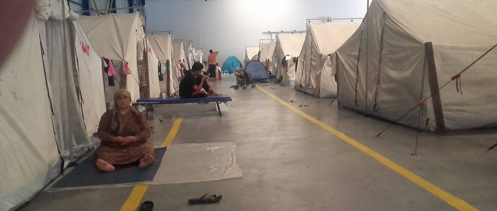
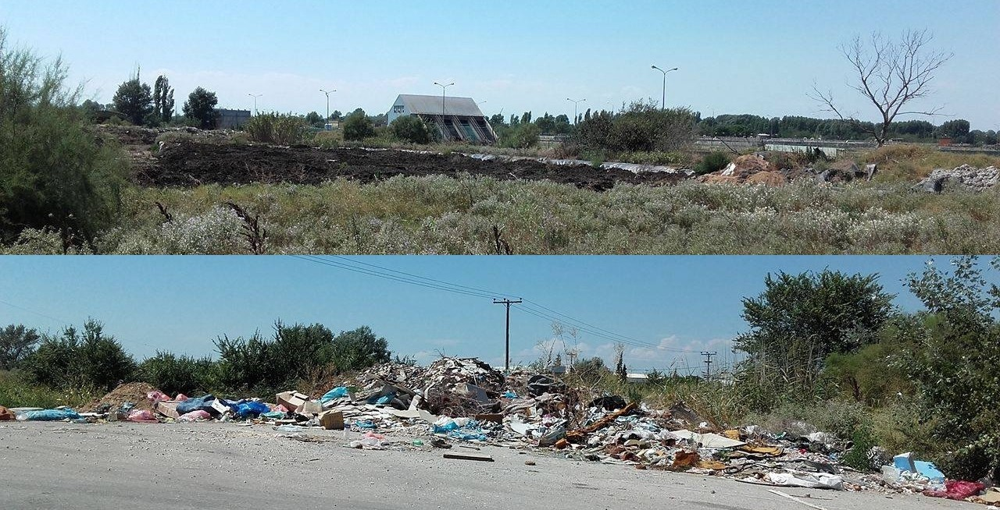
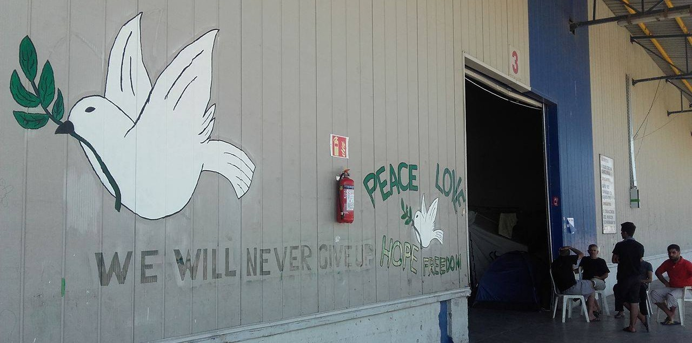
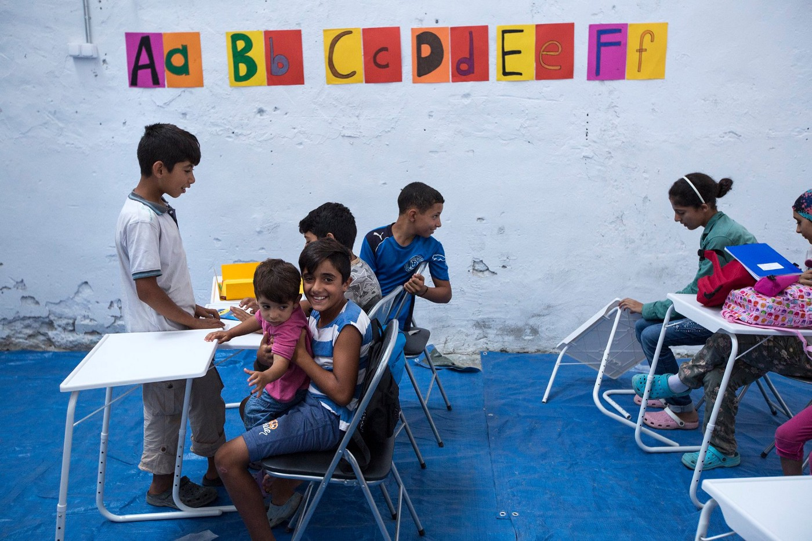
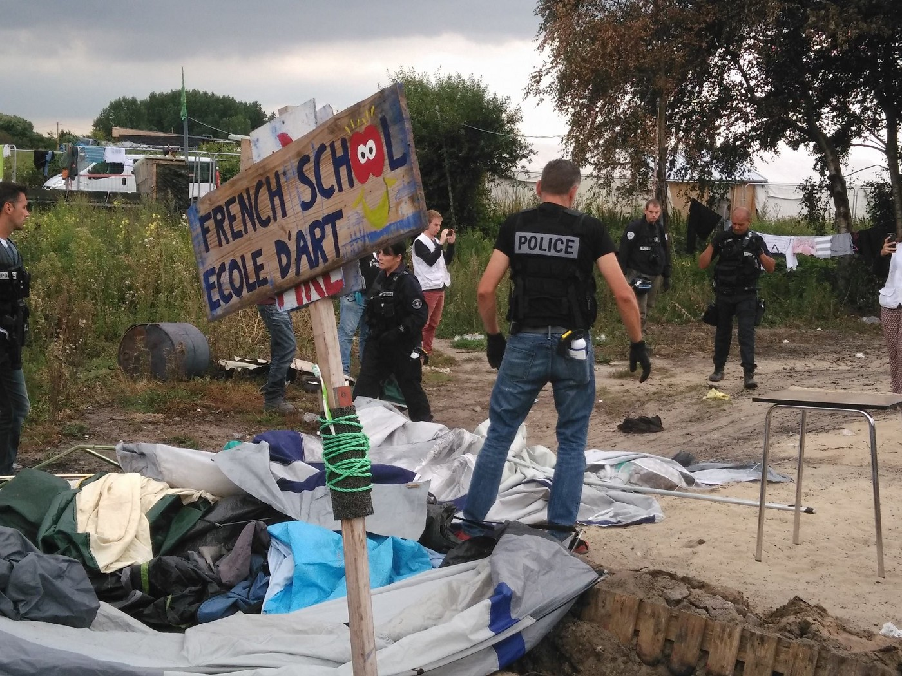

### AYS 19/8: Malaria unofficially confirmed in Sindos\-Frakapor camp

Our staff has visited refugees in Sindos\-Frakapor, where cases of malaria were unofficially confirmed by independent medical professionals\. Photo: AYS
### **Sindos\-Frakapor cam** p: unbearable stench, malaria and newborn babies in the middle of nowhere

AYS voluneers have visited 550 refugees from Idomeni who are accomodated in Sindos\-Frakapor in Northern Greece, where multiple cases of malaria were unofficially confirmed to us by independent medical professionals, but still not officialy acknowleged by the authorities\.

Approaching the camp by abandoned road, one can feel the unbearable stench rising from nearby heaps of fertilizer\. We were appalled to see at least 20 newborn babies in completely unacceptable living conditions in Sindos\-Frakapor, in the middle of nowhere, surrounded by swamp and piles of trash\.

Heaps of fertilizer and piles of trash surrounding Sindos\-Frakapor camp\. Photo: AYS

Medical support is very basic, and refugees are dependent solely on military food as there are no inhabited areas or gas stations with shops nearby\. Mosquitoes are swarming everywhere, and only recently refugees managed to get some repellents for individual use\. There are no electric insect traps \(bug zappers\) or ventilators\. If you can donate larger amounts of such devices, please do — it will make a huge difference for people in the camp\.

Peace, love, hope, fredom: We will nevergive up\. A graffiti on camp walls\. Photo: AYS

Sindos\-Frakapor is one of the worst camps we have encountered in a year of field work and yet everyone acts like there’s no better alternative for people trapped in Sindos\-Frakapor: conditions in the camp haven’t changed much since they were brought here three months ago\.

331 refugees have arrived to Greek islands between Thursday and Friday morning, according to government data\. This is a jump compared to recent figures, which had ranged from a few dozen to a maximum of 150 new people daily, bringing the official count of refugees stranded \(and registered\) in Greece to just over 58,000\. Today, volunteers on Lesvos have counted 146 new refugees on Lesvos alone, while our colleagues from Chios say they had 53 new arrivals\. Government has also recorded new arrivals to Samos, Leros and Karpathos\. About 70 people were saved from the small islet of Sapientza, hundreds of miles from the usual refugee entry points\. They have spent the night on the deserted islet off the southwestern tip of the Peloponnese before being [saved by Greek coast guard](http://www.ekathimerini.com/211310/article/ekathimerini/news/greek-coast-guard-rescues-dozens-of-migrants-stuck-on-islet) early this morning\.
### Volunteers backed off Chalkidas hospital squat

Following recent announcement of volunteers who had to make a tough decision to stop supporting Chalkidas hospital squat after it was taken over by a group of people who were misusing donations and making the atmosphere unsafe for both volunteers and families in the squat, a volunteer meeting was held in Athens to find the best way to approach the delicate situation\. Volunteers are urged to inform the families about options to move from the squat\. If they choose to stay, they will not get any support\.
### **Support for the new camp in Kavala needed**

After ending all of their activities in Thessaloniki, [Northern Lights Aid](https://www.facebook.com/Northernlightsaid/) has moved to a new camp in Kavala, where they are supporting the new camp that was opened on Friday, August 5 when about 200 people were moved from their previous residence at a nearby camp with limited resources and potential to sustain a community environment\.

Little residents of the new camp\. Photo: Northern Lights Aid

In a [lengthy and very enthusiastic post on Facebook](https://www.facebook.com/Northernlightsaid/posts/1826504637580158) , they have described all that was done and what still needs to be done, sop please find some time to read it and see if you can help\.
### Long term volunteers needed in Vasilika

Eko project is up and running once more, from 8:00–20:00 in Vasilika camp\. There is a space where the community can come together, breathe, play, relax in the shade and go to school\. They are working every day to make Vasilika better and brighter and now they need your help\. They are looking for long term volunteers to help run the children’s and women’s spaces, and if you are a teacher, or if you have a TEFL certificate, we would love to see you teaching in Eko school\. [Contact them](https://www.facebook.com/Ekommunity/?fref=nf) if you are interested\.
### Children held in detention center in Croatia

With the Balkan route being unofficially very active recently, we have seen many people arrive to Croatia illegally, but also refugees from asylum centers leaving to other countries by their own means\. Number of Dublin returns and push\-backs from Austria has also increased\. At the moment, there are 320 people in Porin asylum center in Zagreb, with additional 82 of people being accommodated in asylum center for families in Kutina\. Our colleagues from Welcome Initiative have managed to unofficially confirm there are around 10 children held in detention center Jezevo, in a facility built for minors\.
### More drownings off Lybian coast: how to call for help if you encounter distress at sea

Proactiva Open Arms reported about yet another harrowing case occurring on August 18th, off the coast of Libya\. Twenty people were rescued, while six have drowned and only four bodies have been recovered\. While the institutional disregard for the lives of those embarking on the dangerous sea journey to refuge continues, we once more urge anyone who finds themselves in distress at sea to contact Watch The Med Alarm Phone, at \+334 86 51 71 61\. Please take note of the fact that this is an alarm number to support rescue operations, and NOT a rescue number\. Alarm Phone’s aim is to help those in distress connect with the coast guard and attempt to monitor the rescue operation in order to avoid violations of human rights\.

> When facing distress at sea, Alarm Phone instructs to:
 

> 1\. First call the coast guards and tell them about your situation of distress\.
 

> 2\. Then call the Alarm Phone\. We will make sure that your distress call is noted and acted upon\.
 

> 3\. If you are not promptly rescued by the coast guards, call the Alarm Phone again\. We will inform the public media and politicians to put pressure on the rescue services\. 

You can see the informational video in Arabic [here](https://vimeo.com/178591834) \.
### Number of people in Calais rises above 9,000

In Calais, Refugee Info Bus reports, the local police and CRS riot squad were expeditious in demolishing the tents which were used as replacements for the recently burned down „French School Ecole D’Art“\. It is once more necessary to stress the fact that the number of people populating the „Jungle“ refugee camp in Calais has surpassed 9000 — the majority of them connected by an aspiration for making a better life for themselves in Europe, by learning English and French, in order to be able to work, continue their education and integrate into European society\.

Police today evict the French School Ecole D’Art\. Photo: Refugee Infoo Bus

As they are expanding their operation in Calais and Greece, Refugee Info Bus are recruiting a Refugee Info Bus Calais Coordinator with a minimum commitment of 2 months\. Accommodation and food will be provided, as well as additonal support according to demonstrated need\. If you are interested, please email recruitment@refugeeinfobus\.com with a CV and a cover letter\. You can read the outline of the key duties [here](https://www.facebook.com/RefugeeInfoBus/photos/a.1756184407950313.1073741828.1756144974620923/1817190501849703/?type=3&theater) \.
### Photos of little Omran trigger a wave of interest for Syrian crisis: here’s how anyone can help

You’ve all seen it\. Photo of a five\-year old rescued from under rubble, face covered with blood, still trying to grasp what happened\. His name is Omran and he was treated at a SAMS\-supported hospital in Aleppo\. SAMS stands for Syrian\-American Medical Society, one of the parties involved in providing support to people of Syria and definitely [worth donating to](https://www.sams-usa.net/foundation/index.php/how-you-can-help/donate) \.

Today, they have published a small peace of hope for people still trapped in the besieged city of Madaya: 18 people were evacuated from the city to receive urgent medical treatment\.

One of the greatest humanitarian priorities for the people inside Syria is frontline, emergency medical care\. People are dying because there aren’t enough ambulances to transport them to hospital and there aren’t enough hospitals in areas where civilians are being injured\. Medical equipment is desperately needed in hospitals in which are being targeted and bombed relentlessly\. Samara’s Aid Appeal is [raising money](http://www.samarasaidappeal.org/medical?mc_cid=98e17aaed0&mc_eid=454b29bfda) to support hospitals in Syria and also provide medical equipment to help save the lives of the people effected by this conflict\. Every penny raised for this appeal goes directly to supporting Syrian teams on the ground, as well as purchasing and transporting suitable medical equipment and medicines into Syria\.

There’s also the option of [dontating to MSF](http://www.msf.org/en/donate) , probably the only big international NGO that really makes the difference on the ground\.

_Converted [Medium Post](https://areyousyrious.medium.com/ays-19-8-malaria-unofficially-confirmed-in-sindos-frakapor-camp-7a2b45cd64b3) by [ZMediumToMarkdown](https://github.com/ZhgChgLi/ZMediumToMarkdown)._
