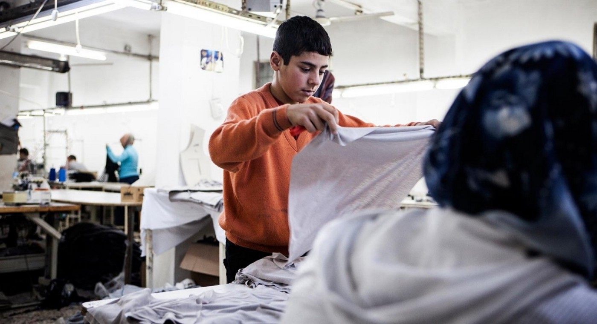
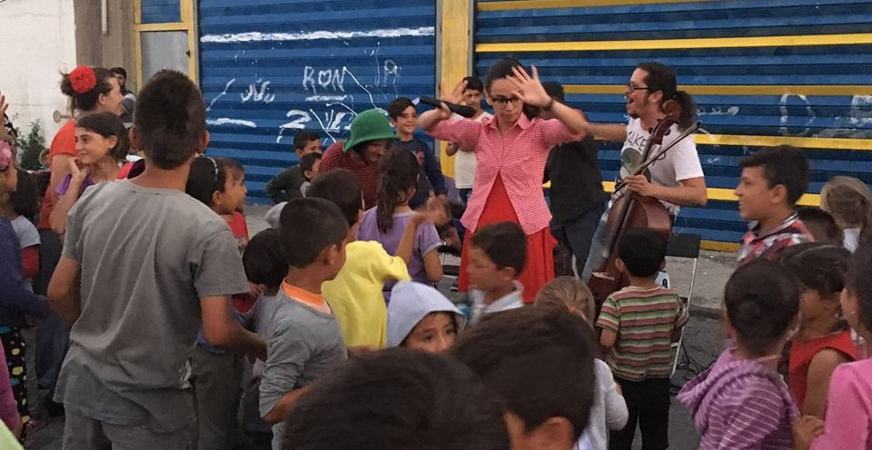
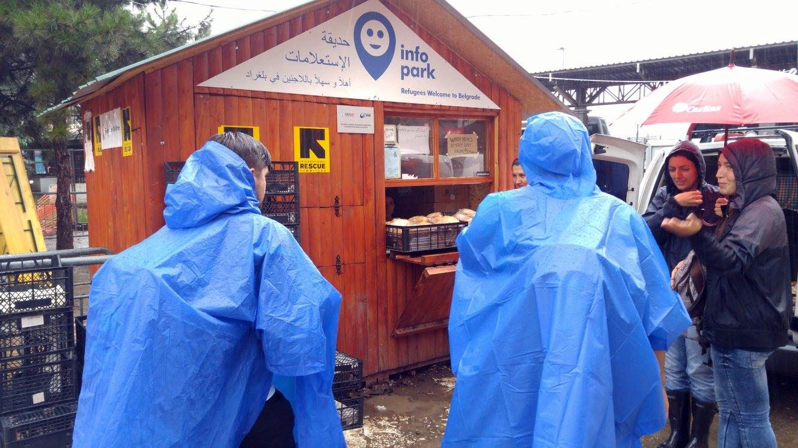
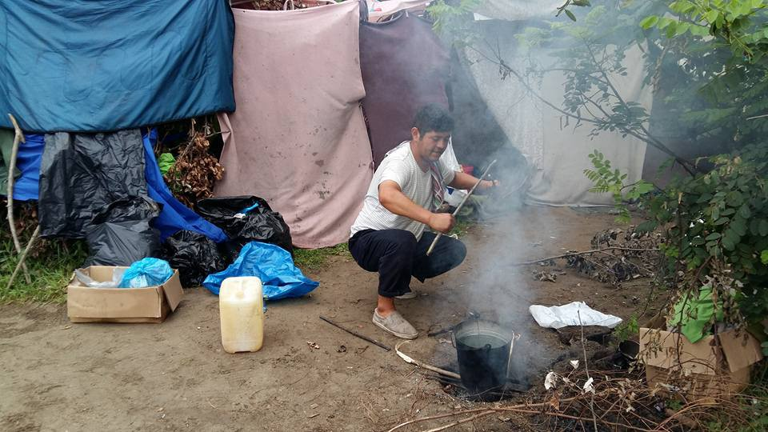
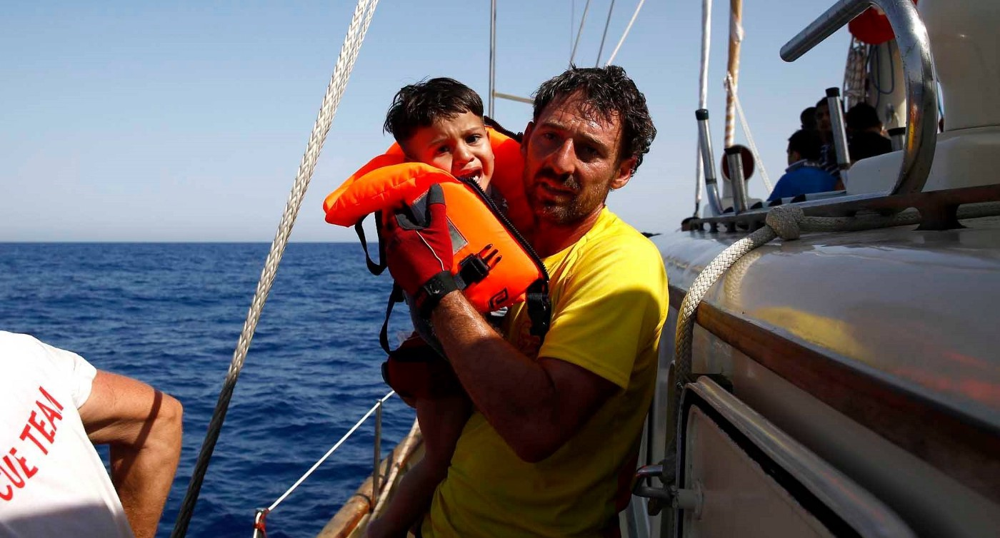
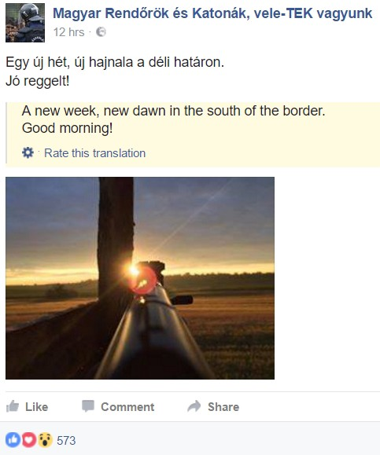
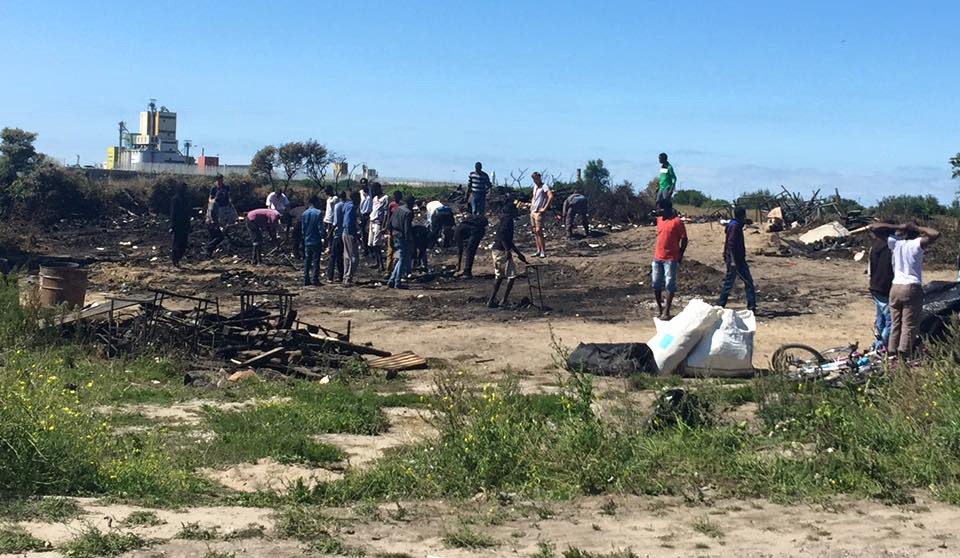
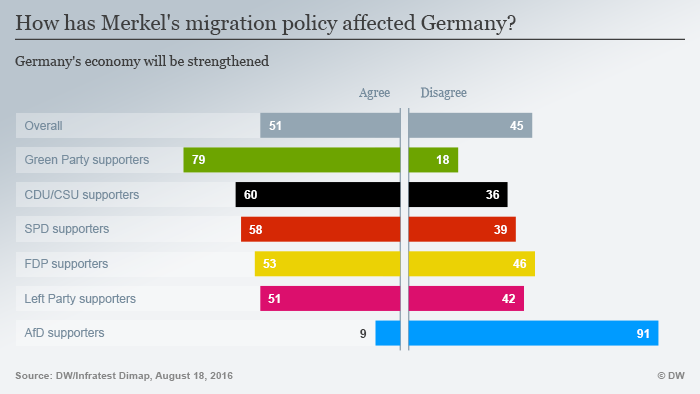

### AYS digest 22/8: Little Mohamad from Softex needs your help\!

](assets/348564b8ffa7/1*dwssoKXF4IYACX5wMDfmBw.jpeg)

Photo of a refugee child by our new colleague Abdulazez Dukhan, an 18\-year old Syrian refugee and soon to be famous photographer, and the autor of the blog [**Through refugee eyes**](https://www.facebook.com/throughrefugeeeyes/?fref=nf)

_Also in today’s AYS news digest: The official map of Greek camps\. Needs for volunteers and donations\. Opening of a new squat for single men in Athens\. Hungarian extremists post a photo of a gun pointed towards the border\. Burnt\-down school in Calais needs your help to be rebuilt\._
### Huge report from Turkey: forced labour and lack of schooling undermines future prospects of refugee children, Ambassador Boček warns

The Council of Europe has published [a lengthy report](https://search.coe.int/cm/Pages/result_details.aspx?ObjectId=0900001680699e93) of the fact\-finding mission to Turkey by Ambassador Tomáš Boček, Special Representative of the Secretary General on migration and refugees, who held a series of meetings with officials, NGO’s and refugees from 30 May to 4 June 2016\.

> “It has not been made clear to me how the quotas for Syrians are set and whether there is a centralised system for distributing them among provinces\. What became evident during the visit is that, once this number is reached in some provinces, the local branches of the Directorate General for Migration Management stop registering those who wish to apply for protection \(or slow the registration process down considerably\) \. When speaking with the authorities, it also became clear that the delays in the registration procedure were not to be attributed to lack of capacity \(…\) One additional cause for concern is that the registration system, including the pre\-registration phase, does not appear to contain any safeguards to ensure that vulnerable groups are identified and dealt with on a priority basis\. The special needs of unaccompanied children, in terms of information for example, are not catered for either”, the report states\. 

Child labour remains a huge issue in Turkey, Ambassador warns\. Photo: Al Jazeera

A special section of report is dedicated to children, from the lack of schooling and the problem of child labour, to the dangers of the sexual exploitation of vulnerable refugees and trafficking\. Of the 2\.75 million Syrians registered under temporary protection, the report says, more than half are children\. It is also reported that Turkey plays host to over 800,000 school\-age Syrian children\.

> Approximately 330,000 Syrians are enrolled in schools in Turkey\. The rate of participation in education among refugee children living in camps is 85%\. This rate decreases sharply for those who live outside camps\. The low level of enrollment in school for those outside the camps is a matter of particular concern\. A number of children have been out of education for several years\. Their future prospects are seriously undermined with each year of education missed\. \(…\) The employment of children under the age of fifteen remains a considerable problem in Turkey\. Although it also affects Turkish children, the influx of refugees has led to an explosion of Syrian children working, especially in textile factories and agriculture\. This is both a consequence of and a cause for children not attending school\. \(…\) I received testimony from families living outside camps that they find it hard to keep their children safe\. The vulnerability of single mothers, often responsible for several young children, is particularly concerning\. I cannot exclude that these women and their children may be targeted by criminals for sexual exploitation or trafficking, says the Ambassador in his report\. 

### Call for help from Softex: 8\-year old with severe heart failure and his family need a safe place to stay

AYS volunteers are very concerned about little Mohamad, an 8\-year old Syrian boy with a severe heart condition \(open ductus arteriousus\) \. Reports from the hospital clearly state that his pacemaker is malfunctioning, but he still has not managed to receive a replacement device\. He currently weights only 11 kg, and his pulse is 42 beats per minute\. His activity is massively reduced, with a very reduced appetite\. He was stranded in Idomeni when the border closed\. After his family’s eviction from the informal settlement at Idomeni, they was forwarded to the Softex camp, where they live in a tent, whose conditions are far from adequate for a very sick child\.

AYS is trying to find a way to arrange the surgery for Mohamad, but he and his family also need to be moved from the camp into decent accommodations where he can rest and recover\. If you can help in either speeding up the medical process, and/or providing accommodations in Greece or covering accommodation expenses, please [contact us](https://www.facebook.com/areyousyrious/) \.

68 **people arrived in Greece this morning,** according to official data\. The Greek government states that 61 new refugees have been registered on Lesvos, and 7 on Samos\.

Yesterday, a Syrian woman died and two persons went missing after a boat carrying 15 refugees capsized in the Aegean Sea, in a failed attempt to reach Chios\. According to figures released by the Turkish Coast Guard, a total of 279 refugees have lost their lives in the Aegean in 2016\.
### The official map of all the official Greek refugee sites\!

To provide a better understanding of the locations and capacities of official refugee camps in Greece, the government has published [an updated map](http://geochoros.survey.ntua.gr/ekepy/) , listing the numbers of officially registered residents in each camp, as well as their maximum capacities\.
### Opening of a new squat for single men in Athens announced after recent problems

Volunteers have announced opening of a new squat for single men in Athens\. The new site is an attempt to resolve problems that emerged in the old hospital squat, where some individuals misused given donations\. This new squat is located in Exarcheia area\. Volunteers will need donations of appliances such as fridges and laundry machines in order to start the new squat — a detailed list will be published after consultation with local volunteers\.
### A Drop in the Ocean needs volunteers in Sounio

[A Drop in the Ocean](http://www.drapenihavet.no/en/) is in need of volunteers in Camp Sounio, located about 40 minutes from Athens by car\. They are especially seeking English teachers to run classes in the camp\. Other potential volunteer projects include children’s activities, resource distribution and swimming lessons\. For more information, please send an e\-mail to siv@drapenihavet\.no\.
### Volunteers needed in Nea Kavala community centre

Volunteers are providing a constant stream of fun activities in Nea Kavala\. Photo: Pau de Nut

Volunteers are needed as soon as possible help out at the Nea Kavala community centre\. The We Are Here initiative runs educational, sports and artistic activities for adults and children in the community centre\. A month ago, they also introduced a women’s space in the camp\. Please visit [their Facebook page](https://www.facebook.com/WeAreHereCentre/) and get in touch if you are available to help them out\. Long term volunteers are needed, with a minimum commitment of two weeks\.
### Heavy rain in Serbia: Donations needed

Serbia has been hit with heavy rain in recent days, making the situation worse for many refugees\. Many are still sleeping in the streets of Belgrade, or waiting in the open at the transit areas of Kelebija and Horgos\.

In the coming days, AYS will publish a comprehensive guide for volunteers and prospective donors in which we’ll try to explain all the recent developments in the country\.

Info Park remains one of the few constant sources of support for refugees in Belgrade\. Photo:

Today, Miksalište has published a [call for donations](https://www.facebook.com/RefugeeAidMiksaliste/photos/a.1656591594607458.1073741828.1652129721720312/1750418358558114/) of warm clothes for men, women and children as well as shoes due to the recent rainfall and colder temperatures\. Donations can be delivered to Gavrila Principa 15 Belgrade between 09 and 16 h\. Meanwhile, Info park is doing their best to provide constant support for the refugees in Belgrade’s parks\.

Trying to keep dry and warm after heavy rains at the border\. Photo: Refugee behind the closed borders

Winter has come early to the Serbian border with Hungary, where hundreds are waiting in makeshift transit camps Kelebija and Horgos\. Tents, rain coats, shoes and warm socks are needed again\. If you can donate, [iHo](https://m.facebook.com/story.php?story_fbid=1092548140781212&id=905305309505497&__mref=message_bubble) will be happy to accept warm items for the refugees in transit zones\.
### Many children among the refugees arriving to Italy

A terrified child saved from the Mediterranean\. Photo: Proactiva Open Arms / Giorgos Moutafis

MSF, Proactiva and others who are tirelessly saving lives in the Mediterranean keep reporting the steady flow of refugees on one of the most dangerous refugee routes towards Europe\. Almost half of the refugees crossing the sea from Libya to Italy in packed boats are minors, MSF warns\.

‪Today, MOAS [has announced](https://www.facebook.com/migrantoffshoreaidstation/photos/a.272480022940687.1073741828.270783906443632/494769690711718/) the return of their Responder boat and its crew to Central Mediterranean, after few days of carrying out vessel maintenance and additional training of the rescues\.
### Baobab Experience from Rome needs food, clothes, plastic cups, and cleaning and disinfecting solutions

Baobab Experience, a grassroots initiative that helps refugees in Rome, has published a call for donations of specific items: disinfecting gels, brooms, big plastic trash bags, pellets, plastic cups, fruit juices in bricks, cartons of long\-life milk, boxer shorts, t\-shirts and trousers for smaller men\.

Please [contact them](https://www.facebook.com/BaobabExperience/?fref=nf) if you can donate anything from the list — they are an amazing volunteer crew and really appreciate all the support they can get\.
### Refugee flows to Hungary constantly on the rise despite the wire fence and border patrols

According to a [report](http://www.helsinki.hu/wp-content/uploads/HHC-Hungary-asylum-figures-1-August-2016.pdf) from the Hungarian Helsinki Committee for Human Rights, the number of irregular migrants apprehended by the Hungarian police has been constantly on the rise since the beginning of 2016, despite the construction of a fence on Hungary’s borders with Serbian and Croatian\.

However, since the [“8\-kilometre rule”](http://www.helsinki.hu/wp-content/uploads/HHC-info-update-push-backs-5-July-2016.pdf) legalizing push\-backs came into force on 5 July, the number of registered asylum applications has radically decreased\. In July alone, 575 irregular migrants were apprehended, while 4,396 entries were blocked by border patrols\. During the first six months of 2016, the majority of asylum\-seekers \(65%\) in Hungary came from war\-torn countries, including 16% from Syria, 37% from Afghanistan, 11% from Iraq and 1% from Somalia\. Of all the applicants, 26% were children and 20% women\.
### Hungarian extremists post a photo of a gun pointed towards the border; MEP says it would be “better to put pigs’ heads” on the border fence

Photos of macabre “scarecrows” made to frighten refugees trying to cross the wire fence between Serbia and Hungary have sparked international outrage after being uploaded to a [Facebook page](https://www.facebook.com/ittvagyunkveletek/posts/1765419877074752) that supports border patrol officers and praises push\-backs of refugees from Hungarian borders\. Hungarian journalist Szabolcs Panyi was the first person to warn the international readership about this new practice, suggesting that members of border patrols might be directly linked to the notorious extremist Facebook group\.

In response to criticism over the scarecrow tactic, Gyorgy Schopflin, a Hungarian MEP for the Christian Democratic European Peoples’ Party, tweeted: “Human images are haram… pig’s head would deter more effectively\.” The Twitter account is listed on the [official website](http://www.europarl.europa.eu/meps/en/28135/GYORGY_SCHOPFLIN_home.html) of the European parliament as Mr Schopflin’s account and there are no indications his account was hacked\.

Andrew Stroehlein from Human Rights Watch replied: “Your words are disgusting\. I would expect that from anonymous neo\-Nazi trolls but you’re an MEP\. Act like one\.” The dispute is still active on Twitter, so feel free to comment if you have any extra energy to waste on high\-profile trolls\.

New post on a FB group that supports border patrol officers\. Screenshot: FB/AYS

This controversy made us dig a bit more into [Magyar Rendőrök és Katonák, vele\-TEK vagyunk](https://www.facebook.com/ittvagyunkveletek/?ref=page_internal) , the Facebook group where the photographs were originally posted\. Apart from the photos of uniforms, which further imply that individuals in the border control forces might really be members of the group, we found a photo of a gun allegedly pointed towards the border with Serbia\. The photo [was posted](https://www.facebook.com/ittvagyunkveletek/photos/a.1633782660238475.1073741828.1633659206917487/1769308906685849/?type=3&theater) this morning, and has gained a significant support throughout the day\.
### Refugee Community Kitchen in Northern France needs financial support to keep on running

[Refugee Community Kitchen](http://refugeecommunitykitchen.com/) was created in the winter of 2015 to provide nutritious food for the refugees in the Calais and Dunkirk camps\. After five months of supplying up to 2500 meals a day at the height of winter, they are now serving 1,800 hot, healthy and nutritious meals a day\. They have also embarked on building communal kitchens, which will allow the residents in the camps to cook their own food\. These communal kitchens will not only give refugees the food they want to eat, but also provide them with the dignity of feeding their families\.

> On the visit we made to camp just a few days ago, our hearts were overjoyed to see all communal kitchens being used in full swing, different cultures sharing space, wood and ingredients, cooking in shifts and sharing times together eating and chatting\. Delicious foods of all sorts were being made, parathas, chips, curries, dal, rice, pasta, soups and salads\. The rockets stoves seem to have been mastered by all, achieving all power needs, from frying to boiling to simmering, the taste of the wood smoke adding to the delicious taste of the food, that was offered to us by all we met, Kurdish, Iranian, Iraqi, and Afghani alike\. The gratitude and thanks was overwhelming, says one of the volunteers of the project\. 

If you’d like to support their work, you can do so by clicking [here](https://mydonate.bt.com/charities/refugeecommunitykitchen) \.
### Burnt\-down school in Calais needs to be rebuilt

On 15th August the École d’Artes, a French language and art school in the Calais refugee camp, tragically burned down as a result of a fallen candle\. Volunteers now need to raise €3000 to rebuild this vibrant community space\.

The Ecole D’Artes taught French lessons and ran art classes for over 7,000 refugees in Calais\. Photo: Care4Calais

The Ecole D’Artes taught French lessons and ran art classes for the 7,000 plus refugees living in Calais\. French lessons are especially vital for the refugees as many are seeking asylum in France, and the art classes provide a therapeutic distraction to the often mind\-numbing daily routines of those living in the refugee camp\. The Ecole D’Artes was also home to 14 people who served as guardians, protecting the school from vandalism in the night\. These individuals lost everything, including their documents and few belongings\.

This building was a safe space, complete with a vegetable garden, piano and library\. Now, all that remains are burnt palettes and charred school books\. [Please donate](https://gogetfunding.com/rebuilding-ecole-dart/) what you can so that we can rebuild this vital community building\.
### Germany strongly divided over refugee policy; Greens and the AfD supporters at opposite poles

Following the admittance of over one million refugees, Germans are strongly divided over Chancellor Merkel’s refugee policy, with Greens and AfD supporters at opposite opinion poles, [a study](http://www.dw.com/en/survey-germany-divided-over-merkels-migrant-policy-changes/a-19489757) has revealed\.

The good news is that a majority of people still have an overall positive attitude towards the refugees\. Although 51% of respondents predicted an over\-stretching of social and education systems, most also predict a stronger economy and a more diverse country\. According to the poll, however, 58% Germans also expect more terror attacks\. Green Party supporters were the most optimistic about the potential contributions of refugees, while supporters of the far\-right AfD were overwhelmingly negative\.

[DW has published](http://www.dw.com/en/survey-germany-divided-over-merkels-migrant-policy-changes/a-19489757) the first comprehensive interpretation of the findings, saying that strengths and weaknesses of Merkel’s policy are evenly balanced for now\.

_Converted [Medium Post](https://areyousyrious.medium.com/ays-digest-22-8-little-mohamad-from-softex-needs-your-help-348564b8ffa7) by [ZMediumToMarkdown](https://github.com/ZhgChgLi/ZMediumToMarkdown)._
