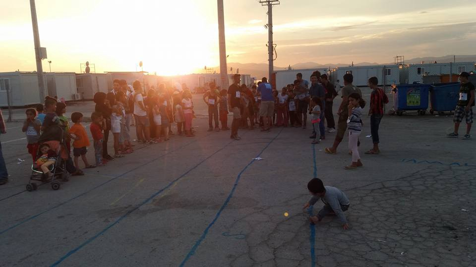

### AYS Digest 23/8: Still no clear longterm policy on relocation and resettlement of refugees

](assets/21db9b063748/1*1LBDk7tQM-kiNfNiHIdIQg.jpeg)

“Our life is like this cigarette” Photo credit: [Through Refugee Eyes](https://www.facebook.com/throughrefugeeeyes/?fref=ts)
### **GENERAL**

[**EU Commission**](https://www.neweurope.eu/article/eu-commission-reminds-e250000-fine-per-refugee-member-states-deny-relocation/) **reminds its is closely following migration issue developments**

Since 16 March 2016, the European Commission has adopted four monthly reports on relocation and resettlement, “the last of which shows some progress being made, to comply with the legal obligations as foreseen in the commitments taken but more efforts are needed\.”

However, there is information that only 1% of the refugees in the EU Commission’s emergency relocation programme have actually been relocated, while the target figure remains at 160,000\.

European Commissioner for Migration, Home Affairs and Citizenship Dimitris Avramopoulos therefore suggests a €250,000 fine per refugee for member states that deny relocation\. The Commission will continue to report regularly and reserves the right to take action where member states are not complying with their obligations\.

Concern over the viability of the EU\-Turkey pact is deepening, mainly because of tension over the question of visa\-free travel\. On Sunday, European Commission President Jean\-Claude Juncker said Turks will be granted visa\-free travel to EU states from October “only if all the conditions are met,” including reforming anti\-terror laws\.

**The European Asylum Support Office launched its first [mobile app](https://www.easo.europa.eu/news-events/press-release-easo-launches-%E2%80%98eu-relocation-programme%E2%80%99-mobile-app) for smartphones and tablets, allowing asylum seekers to quickly find information**

The information is available in English and various non\-EU languages \(English, Arabic, Sorani, Kumjani and Tigrinya\) about the EU Relocation Programme, their rights and obligations when applying, contact points and more\. With the app, EASO aims to promote relocation as the only safe and legal way from Greece and Italy to other EU Member States\.

**The UN Commissioner for Refugees, Filippo Grandi, will [visit](http://www.ekathimerini.com/211392/article/ekathimerini/news/unhcr-chief-in-greece-for-three-day-visit) Athens for three days this week, beginning Tuesday\.**

Mr\. Grandi will meet with President Prokopis Pavlopoulos, Prime Minister Alexis Tsipras, and local representatives, and will visit refugee centers in Athens and northern Greece\. He is there to assess the situation in Greece and the humanitarian needs of refugees\. He is also scheduled to visit refugee facilities in Attica and central Macedonia to meet with asylum seekers and representatives of local authorities, volunteers and other partners involved in managing the refugee flows\.

**International Organization for Migration \(IOM\) found that 14% of the respondents of an IOM have indicated that they have experienced some kind of human trafficking\-exploitation\.**

**I** OM carried out a survey along the Balkan Route and in Greece \(Eastern Mediterranean Route\) \. New and more dangerous smuggling practices and attempts to reach Europe by riskier routes have led to a spike in the number of migrants dying as they attempt to cross the Mediterranean, according to a new analysis released Tuesday\. The International Organization for Migration’s Global Migration Data Analysis Center in Berlin said 2,901 people died or disappeared crossing the Mediterranean in the first six months of 2016, a 37 percent increase over the first six months of last year\. Most of the deaths, 2,484, occurred on the so\-called Central Mediterranean route from North Africa to Italy, where some 70,000 people crossed in the first half of 2016\.

“The numbers have not increased hugely in terms of those crossing, but the risk of death remains high and is increasing,” said Frank Laczko, head of the Berlin center\. Adding to the problem now, however, are more frequent instances where smugglers are sending multiple boats at once, making rescue operations more difficult\. In addition, newer routes, particularly from Egypt, are longer and riskier, and search and rescue efforts are often carried out farther away from land\.

In the Eastern Mediterranean, however, few deaths have been reported since a March deal between the EU and Turkey, combined with Balkan border closures to migrants, has led to a dramatic drop in new arrivals\. Where some 885,000 migrants crossed from Turkey to Greece along the route in 2015, the IOM reported that new arrivals are down 98 percent since the March 20 agreement\. A total of 376 deaths were recorded in the Eastern Mediterranean in the first six months of 2016\. Laczko said the report shows there’s a need for more legal channels for migrants to be able to come to Europe, but also for better information campaigns to make sure would\-be migrants understand the dangers of the journey\.

[**Harvard Online Course**](http://hhi.harvard.edu/elearning/harvardx-course-humanitarian-response-conflict-and-disaster) **on humanitarian aid**

As the need for humanitarian aid grows, how can efforts to alleviate human suffering evolve with it? Harvard Humanitarian Initiative seeks to answer in an upcoming online course starting August 30, free to everyone through the HarvardX platform\. According to the course description, Humanitarian Response to Conflict and Disaster will prepare us to recognize and analyze emerging challenges in the humanitarian field and explore the ethics and principles that guide humanitarian response\.

](assets/21db9b063748/1*BepZxXfoXtrYKOyW8EY04w.jpeg)

Refugee Olympic Games, Photo credit: [**Hussain Jeqou**](https://www.facebook.com/hussain.ilgapk)
### **GREECE**

**Cherso Cultural Center has hosted a two weeks film making workshop**

The workshop included the Arab and Kurdish community responsible for developing a short movie or documentary, including the writing of the screenplay, the operation of the equipment, sourcing the background music \(provided by community singers\) and the acting\.

**Hundreds of children struggling with the psychological traumas of war\.**

In an effort to mitigate the plight of these victims of war, Arabic\-speaking and Farsi\-speaking professionals training in pediatric psychology or psychiatry are needed in Greece\. Those interested please send an email to the Welcome Foundation at: info@welcomefoundation\.org

**Greek authorities to construct a new migrant reception center in Thiv**

The center is set to be completed in the coming days, will ease congestion in camps on the country’s eastern Aegean islands, while plans are also under way to open a refugee facility on Crete\. Authorities are said to be drawing up plans to create so\-called “closed\-structure” detention camps on the islands to separate individuals who are scheduled to be repatriated — as well as troublemakers — from those who have passed a first screening in their claim for international protection\. Meanwhile, migrants with a criminal past will be transferred from the islands to pre\-departure centers on mainland Greece\. About 300 individuals have already been transferred and another 100 are to follow in the coming days\. In a joint statement Monday, Crete mayors said they wanted to see specific measures to address a wide range of migrant\-related challenges including accommodation, food, healthcare and a possible hike in arrivals\.

**Number of arrivals**

Despite a deal between the EU and Ankara, the number of arrivals on Aegean islands continues to soar\. A total of 1,138 migrants and refugees landed on Lesvos, Chios, Samos, Kos and Leros over the past 10 days, bringing the total number to 11,343\. Greece has at least 41,000 refugees and migrants who are seeking asylum, mostly Syrians eligible to relocate within the EU, the migration minister said on Tuesday\. Yiannis Mouzalas told a news conference that Greek and UN services had recorded 54,000 refugees and migrants on Greek territory between June and the end of July\. Over 41,000 of them on the mainland have expressed interest in asylum, or have made formal requests\. Another 2,000 have agreed to be returned home\. At the same time, there are another 11,000 people currently being processed on Greek islands after landing there from neighboring Turkey\. The migration minister admitted that there are additionally “around 4,000” people who are avoiding follow\-up registration as they hope to cross the border with the help of smugglers\. But denied reports that hundreds of people were being allowed to sneak across the border to the Republic of Macedonia and Bulgaria\. New arrivals, total of 18 today all landed on Lesvos

](assets/21db9b063748/1*NhZPloaHGn5aWQhTiFpUOQ.jpeg)

Clowns in the Camp\. Photo Credit: [**José Palazón**](https://www.facebook.com/jose.palazon.9)

**Volunteering opportunities in Athens**

If new to volunteering in Athens, please consider spending your first couple of days at the Ellinikon Warehouse helping with the sorting of donations\. If you can only volunteer for 1 day or a few hours then the Warehouse is the best place to help\. Please contact the project/team leaders directly to sort out your volunteering arrangements and more info can be found [http://www\.greecevol\.info/](http://www.greecevol.info/)

**RefuComm team looking for volunteers**

In Athens the team have been setting up in squats, printing, flyering, translating information building up new teams for advice clinics to go into the squats\. In Germany they have been getting ready to add new information on the Greek Islands, reunification and educational materials to the website and we have been improving ease of use for the website\. Volunteers are needed in the following area: Media Management, Social Media, Fundraising, Researchers, Writers, Translators, Administration if you can help out, email refucomm@gmail\.com

**Bad conditions in Samos camp**

The conditions in the camp are still very bad with very poor quality food, lack of drinking water and not enough capacity to house the many people there, some for over five months\!

There are still unattended minors living there, You can help out by: mobile pay: \+45 60 10 66 24 \(DK\), AL\-bank: reg\. nr\. 5358, konto nr\. 0244228\. \(DK\) or International donations: IBAN nr\. : DK4853580000244228 / SWIFT adr\. : ALBADKKK

](assets/21db9b063748/1*BGBn5uaImrFhpvIaqVdn2A.jpeg)

Photo Credit: [**José Palazón**](https://www.facebook.com/jose.palazon.9)
### TURKEY

**Donate to help in enrolling refugee children to school\!**

> The majority of children who made it out are living in Turkey now, with nearly 500,000 in Istanbul alone, and with only a minority of children attending any kind of school\. Help us at [Turkeyvolunteers\.org](http://l.facebook.com/l.php?u=http%3A%2F%2FTurkeyvolunteers.org%2F&h=2AQGRtRlO) to enroll them in the carefully selected schools that we personally have visited, and have seen what a true difference they make in their lives\. Click [here](https://www.generosity.com/volunteer-fundraising/turkey-volunteers-back-to-school-program) to donate\! 

**Art materials needed for Art Classes at PrVi Schools**

Two Syrian Artist volunteers, [Rami Alhajali](https://www.facebook.com/ralhajali) and [Watfaa Wahb](https://www.facebook.com/watfaa) , have been teaching art to the kids at ReVi Basmane and Kadifekale\. They have shared with the group that there are some children who have really shown strong talent and interest for arts and that art supplies are needed\. Small contributions welcomed [here](http://revifamily.org/futureartists) \.
### **CROATIA**

**Looking for volunteers in two new projects** 
JRS SE Europe is looking for volunteers for 1\. Integration of asylum seekers into Croatian society and 2\. Psychological and social help for asylum seekers\. To apply send an email accompanied with a CV and motivation letter to jrs@jrs\.hr\.
### **SERBIA**

**Numbers of refugees entering and exiting Serbia**

General Zelimir Glisovic has said Serbian joint police and army patrols have prevented nearly 3,000 migrants from entering the country illegally from FYROM since mid\-July\. The number of migrants and refugees waiting at the two ‘transit zones’ near Horgos and Kelebija, at the border with Hungary on Serbian territory, has significantly decreased, according to the most recent UNHCR official data\. Hungary is still allowing only 30 people a day to regularly cross into the country from Serbia through the transit zones\.

**Mikaliste is calling for warm and dry clothes and shoes\.**

People living in Belgrade without shelter are heavily affected recent rainfall and rapid temperature drops,, please find out how you can help [here](https://www.facebook.com/RefugeeAidMiksaliste/photos/a.1656591594607458.1073741828.1652129721720312/1750845761848707/?type=3) \.

](assets/21db9b063748/1*f8lk72aw0k8mEIXdKKwGug.jpeg)

Photo Credit: Kayra Martinez [Art Without Borders — Nea Kavala](http://Nea Kavala - Art Without Borders)
### **ITALY**

**Three young Egyptians attacked in Catania**

Three Italians attacked immigrants with clubs and doctors are not ruling out neurological damage to the victims\.

[**Young Afghan refugee**](http://www.thelocal.it/20160823/refugee-travels-400km-strapped-underneath-italian-lorry) **has been rescued by Italian police**

He was travelling 400km while hanging from the undercarriage of an articulated lorry\. Despite the ordeal, the refugee, who is thought to be in his early 20s, is in good health and has been released to a migrant reception centre\. He has however, been ordered to leave Italy within seven days after indicating he that did not want to register an asylum request in the country\.
### **FRANCE**

**A kitchen in Calais is looking for volunteers**

One long term volunteer from middle of August is needed\. Minimum stay is one month\. The other, project manager to help manage the kitchen\. 3 months stay\. Understanding about Halalan Tayibban is very important\. Send applications to kitcheninalais@gmail\.com

**A [van leaving from London](http://Mydonate.bt.com/fundraisers/calaisvan) to Calais tomorrow**

Want to send much needed goods to Calais but can’t get them there? [Saf Suleyman](https://www.facebook.com/safsuley) is London based and heading over with a van tomorrow\. If you can get the goods to him today he will take — much needed long life milk \(you can buy a crate quite cheaply\) \-Tents \-Sleeping bags \-Blankets \-Dry food \-Warm clothes \-Toiletries\. You can also donate towards the van drive\.

[**One Sudanese migrant killed**](https://www.yahoo.com/news/sudanese-migrant-killed-calais-clashes-095701961.html) **and another injured in clashes with Afghan migrants outside the French port of Calais**

The two migrants were among a group of people from the “Jungle” camp who tried to access a motorway to smuggle onto trucks crossing the Channel to Britain on Monday night\. In scenes that play out nightly, police pushed back the would\-be stowaways\.A fight later broke out between groups of Afghans and Sudanese returning to the sprawling “Jungle”\. The Sudanese man’s death brings to 11 the number of migrants who have died this year in and around Calais\.

](assets/21db9b063748/1*v2Fid7XaDURa-uydb7vjqA.jpeg)

Photo Credit: [**Hussain Jeqou**](https://www.facebook.com/hussain.ilgapk)
### **GERMANY**

**Germany to [accept more Asylum seekers](https://euobserver.com/tickers/134719)**

Germany will accept more asylum seekers from Italy under the relocation scheme from September onwards, according to Italy’s interior minister Angelino Alfano\. Alfano called the scheme a flop so far since only 961 people have been relocated with the target being with the target 39\.600\.

[**The German Chancellor signalled that the deal with Turkey could be implemented to others\.**](http://www.independent.co.uk/news/uk/politics/angela-merkel-refugees-north-africa-immigration-crisis-turkey-deal-a7205206.html)

[Angela Merkel](http://www.independent.co.uk/topic/AngelaMerkel) has called for the EU to sign Turkey\-style “one in, one out” deals with North African states in a bid to avert a growing summer immigration crisis\.

> “We saw billions of euros pledged to the country, and such a deal could form a blueprint for others\.” 

Ms Merkel’s call came following a meeting with leaders of France and Italy and after a UN warning that the immigration crisis in which thousands have drowned in the Mediterranean, is once again about to explode\.

_Converted [Medium Post](https://areyousyrious.medium.com/ays-digest-23-8-still-no-clear-longterm-policy-on-relocation-and-resettlement-of-refugees-21db9b063748) by [ZMediumToMarkdown](https://github.com/ZhgChgLi/ZMediumToMarkdown)._
