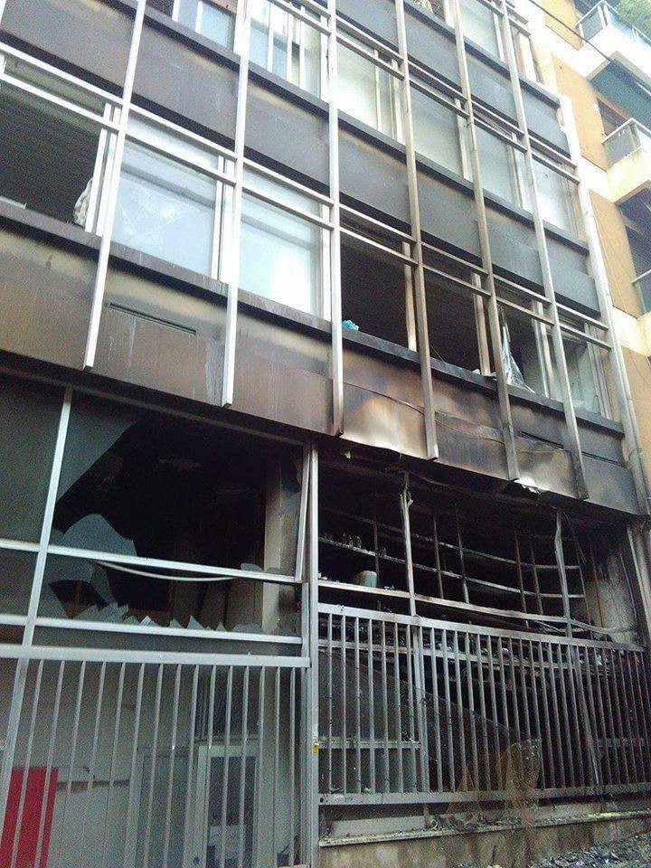
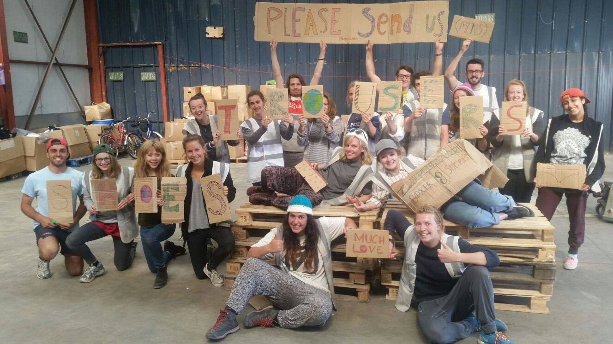

### AYS Digest 24/8: Could this be the last chance to speed up the processes…?
#### Turkey\-backed Syrian rebels entered IS held territory\. Greece and Italy trying to speed up the relocation with the EU member states\. Arson at the refugee squat in Athens\. While some European countries encourage the relocation process, others indifferently allow violence towards the refugees\. So far the largest number of refugees staying in Calais, Paris consistently raiding refugee makeshift camps

 \)](assets/9c0d57f75aaf/1*pnhikmJ-Ad8kWtlM4blvyQ.jpeg)

Large number of refugee children are suffering from the injuries caused by mosquito bites at the camps \(Photo: [Through Refugee Eyes](https://www.facebook.com/throughrefugeeeyes/) \)
#### New arrivals

One boat was brought to safely to Skala, the north shore of Lesvos with 36 people on board\. One boat with 10 people \(5 men, 2 women, 3 children\) landed between Skala Sikamineas and Eftalou\. Proactiva took part in [the rescue](https://www.facebook.com/proactivaservice/videos/1222795907751258/) \. Also, there is an ongoing search by several coast guard vessels for a boat believed to be carrying some 60 refugees and migrants off the coast of Rhodes\. In the past week at least 581 arrivals were registered, coming from Turkey across the Aegean\.
#### SYRIA

This morning at 4 a\.m\. a military operation started in northern Syria\. Turkish special forces, tanks and jets backed by planes from the U\.S\. \-led coalition launched their first coordinated offensive into Syria on Wednesday\. According to [Reuters](http://www.reuters.com/article/us-mideast-crisis-turkey-idUSKCN10Z07J) , they entered one of Islamic State’s last strongholds on the Turkish\-Syrian border on Wednesday, in Turkey’s first major U\.S\. \-backed incursion into its southern neighbor\.
#### GREECE

Arson was reported at the Athens’ Notara 26 squat in the night from Tuesday to Wednesday\. Nobody was hurt\. Two unidentified people set the fire to the lower part of the squat that is a home to over 100 refugees\. Other refugee squats of Athens have offered support and everyone is working to repair the damage as soon as possible\. We absolutely condemn any hostile behavior, regardless of the side it comes from, and we expect the police forces of all EU countries to always serve and protect not only the citizens of their countries, but also the people they are hosting, which has not always been the case thus far\.

Notara squat after its first floor was destroyed in the fire \(Photo: Marina Liaki\)

After a number of pleas and demands by the refugees and volunteers in Greek camps and squats for family reunification and relocation processes to speed up, even the Greek Minister for Migration Policy Yiannis Mouzalas [said](http://www.ekathimerini.com/211410/article/ekathimerini/news/as-pre-registration-concludes-mouzalas-urges-eu-to-speed-up-relocations) on Tuesday that the EU countries must proceed quickly with the relocation, in line with last year’s agreement\.

> At the moment we have 7,000 people ready to be relocated but we have yet to receive a response from the member\-states\. 

EU governments committed to relocate 160,000 individuals from Greece and Italy by September 2017\. So far fewer than 4,000 people have been resettled\.

Part of the answer to the slowness of the procedure lies in the number of people dealing with the applications\. An interesting fact was mentioned by the European Commission’s spokesperson for Migration, Natasha Bertaud:

> EASO has sent 54 experts on asylum, 48 interpreters and 16 additional people of its staff\. 

These figures naturally do not fully meet the needs expressed by the Greek government\. Bertaud said she expects member\-states to enhance their support in manpower\.

Instead of speeding up with those processes that will finally enable families to come together, put children in normal circumstances for learning and growing, and let people move on with their lives after having spent months in unbearable circumstances, [Spiegel](http://www.spiegel.de/politik/ausland/griechenland-die-schlimmen-bedingungen-im-fluechtlingslager-softex-a-1108965.html) confirms recent news that there are plans to renovate and rearrange the camps, thereby separating refugees from the rest of the society even more\. The plans include building provisional schools, despite previous announcements that refugee children would start school with their Greek friends in September\.

Many refugees are back in the parks of Thessaloniki, hoping to find a refuge for their children and themselves soon enough\. Last night the park was once again evicted, leaving the refugees to either sleep on the pavements or to move to remote parks far from the train station \(Photo: Arye Wachsmuth\)

Although a considerable number of refugees are known to have crossed the Greek border illegally, given the incredibly long and often dangerous period of waiting in military camps, Mouzalas rebuffed rumors that hundreds of people have been illegally crossing Greece’s northern border on a daily basis\.
#### SERBIA

A young, 20 year old man from Afghanistan seeking asylum was [reportedly](http://www.vesti.rs/Hronika/Stradao-Avganistanac-lovcu-odredjen-pritvor.html) shot by a hunter in south\-eastern Serbia, while traveling with his other 5 Afghani friends, crossing the border from Bulgaria to Serbia\. Tragically, the man died succumbed to the gunshot wounds soon afterwards\.

Star Hostel Belgrade urgently needs employees\. Local volunteers interested in forming a permanent team would be ideal, but long\-term volunteers would be of great help as well\.
#### CROATIA

The Croatian [Minister of Interior](http://www.mup.hr/242802.aspx) reports that on Tuesday Croatia welcomed 10 Syrians, following the EU Council decision to help Greece and Italy with the influx of refugees\. That makes a total of only 14 refugees accepted by Croatia so far under the relocation program\. According to the previous arrangement, more than 1500 people are supposed to arrive to Croatia from Greece and Italy\. For the time being, the newcomers will be temporarily placed at the Refugee Centre Porin in Zagreb\.

A much needed message at the Manu Chao concert on Tuesday in Varaždin, Croatia \(Photo: Emir Omanović/AYS\)

JRS Croatia is recruiting new staff, and they are particularly in need of an office manager\. The main responsibility of the office manager in Croatia is to create, coordinate, develop, support, and help implement JRS programmes and lead the JRS team\. Read their [ad](https://www.moj-posao.net/Posao/298413/Voditelj-ureda-mz/) for more information\.
#### ITALY

Italian minister of interior Alfano said an agreement to relocate refugees from Italy to Germany was reached between the two countries\. Alfano also urged the other EU countries to fully participate in the relocation of refugees, Repubblica [reports](http://www.repubblica.it/esteri/2016/08/23/news/migranti_alfano_europa-146474120/) in detail\.

Italy, the main entry point for Africans but rarely their planned destination, is struggling to house migrants turned back from neighboring countries, Switzerland and France\.

> A Europe that bases itself in egoism, like the one we see in the example of the Visegrad countries when it comes to the topic of refugees, cannot function — Manfred Weber of the European People’s Party 

#### FRANCE
#### Paris

Thousands of people, including infants, are sleeping on the pavements of Paris\. Many of those people have family members in the UK, but can’t join them until their asylum case is completed\. This can take up to one year\. While they wait, they will be living on the streets of Paris or in Calais, the two refugee hubs of France\. The local police frequently arrest and/or evacuate the refugees, explaining they would be brought to a shelter\. In fact, some of them are just arrested and released and a lot of refugees return to the camps after a few days or weeks\. The tents, however, are often destroyed\. The goal is probably to prevent these camps from becoming permanent street lodging\.

Paris refugee provisional homes \(Photo: Rando Walter\)
#### Calais

Although not as frequently talked about, Calais hosts the largest number of refugees so far, [Liberation](http://www.liberation.fr/france/2016/08/21/a-calais-les-migrants-plus-nombreux-que-jamais_1473881) confirms\. There are now more people crammed into 35% of the originally planned space\. Meanwhile, police prevent wood from entering the camp because they do not want permanent shelters to be built\. Only tents are authorized\. NGOs say there are more than 9,000 people and approximately 10 more tents put up per day\. Calais Kitchens are in need of [more tea](https://www.facebook.com/calaiskitchens/photos/a.1224302977587070.1073741828.1214750961875605/1417149704969062/?type=3&hc_location=ufi) , while the Care4Calais team has conducted a [survey](https://www.facebook.com/care4calais/photos/a.1046164975416459.1073741829.1046117708754519/1263858486980439/?type=3&theater) among the refugees and are now asking for the items mostly requested by the Calais residents: joggers, hoodies, shirts, boxers, spray deodorants, shampoo and shower gel, socks, shaving kits, torches and lanterns, SIM cards etc\. If you can help, contact them at: [www\.care4calais\.org](http://www.care4calais.org) \.

Care4Calais team \(Photo: Care4Calais\)

[The Irish Refugee Council](http://www.irishrefugeecouncil.ie/news/urgent-need-for-refugee-relocation-says-irish-refugee-council/5132) is calling on the Irish government to honour its commitment to relocate asylum seekers from Greece and Italy as quickly as possible\. To date, no people have been relocated from Italy, and only 38 people have been relocated from Greece\.

> “The EU relocation programme was established as an emergency response to an urgent humanitarian crisis and should be utilised as such\. These people have fled war and persecution\. We are aware that the relocation procedure will become more operational in the coming months but the urgency of the situation in Greece cannot be emphasised enough\. 

> We must act in solidarity with Greece by increasing the scale of the Irish response and effectively relocating asylum seekers to Ireland in a swift manner\.“ 

_Converted [Medium Post](https://areyousyrious.medium.com/ays-digest-24-8-could-this-be-the-last-chance-to-speed-up-the-processes-9c0d57f75aaf) by [ZMediumToMarkdown](https://github.com/ZhgChgLi/ZMediumToMarkdown)._
