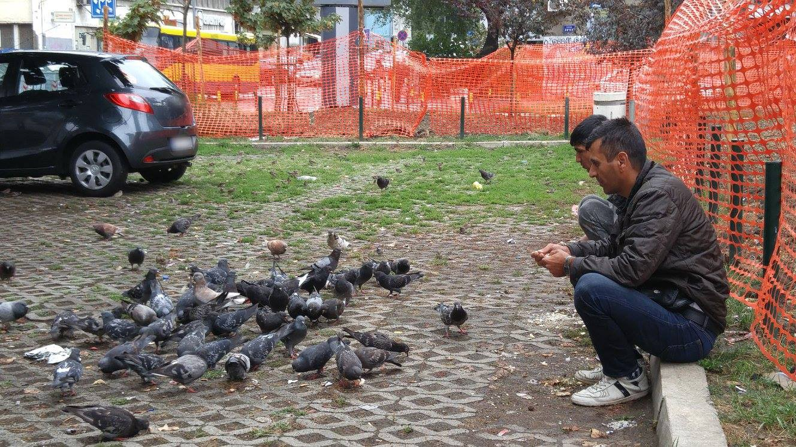
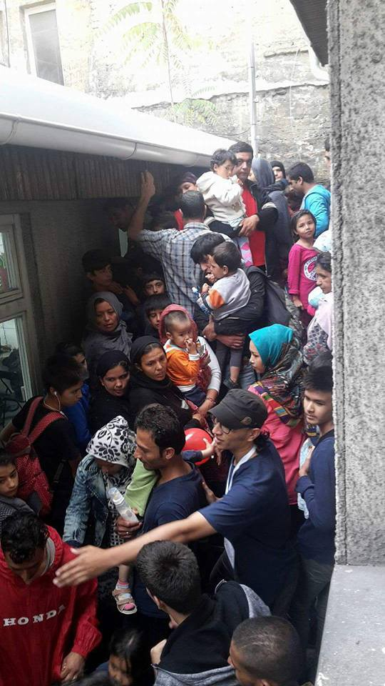
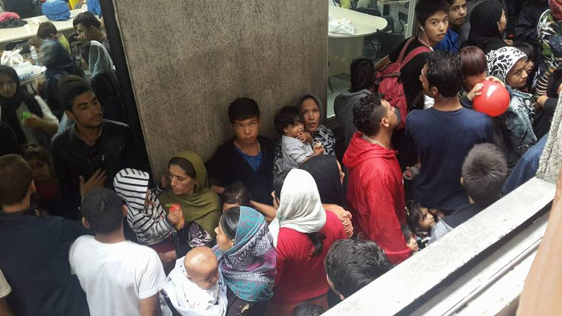
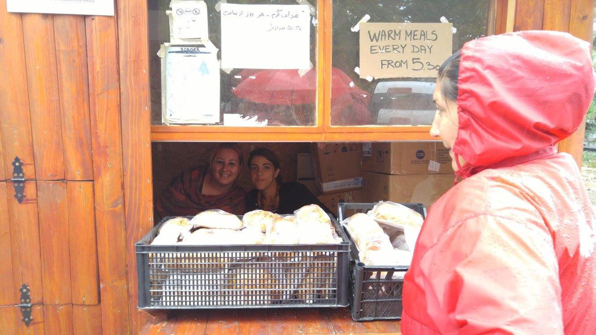
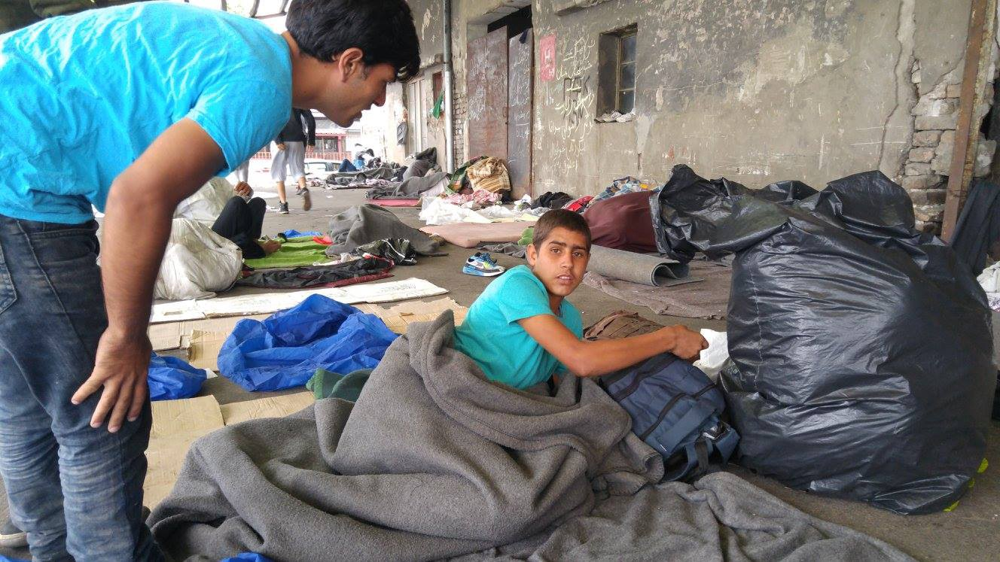
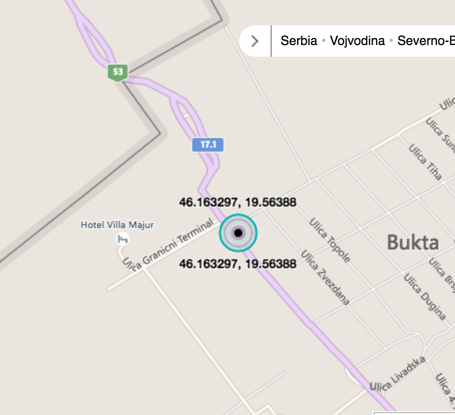
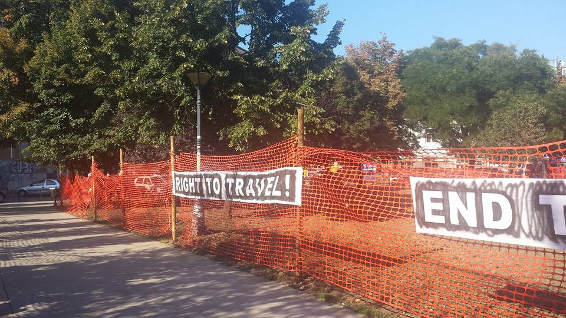

### AYS SPECIAL REPORT FROM SERBIA: Stacked on the Balkan Route

_Number of refugees arriving to Serbia increases every day\. All of them are passing through the Balkan Route, being exploited by smugglers, forced to hide from the police, humiliated, but full of hope to reach their final destination\. Along the way they are met with many volunteers who are doing their best, despite numerous obstacles, to help those who are in need\. Serbia is not final destination for most of the refugees, but facing closed borders they are forced to wait\. AYS volunteers team gathered information about situation in Serbia, pointing towards some of the most urgent issues and problems refugees but also volunteers are facing daily\._

Waiting to continue their journey\. Photo by Mohammed Saber

By the end of July, there have been roughly 3500 refugees in \#Serbia\. Out of this number, 300–700 remained in the parks of Belgrade, the majority were single men from \#Afghanistan, \#Bangladesh, \#Iran, \#Iraq and \#Pakistan\. They fork out thousands of dollars/euros to unscrupulous smugglers, only to put themselves at risk of being abused at the hands of security forces and pushed back down the route\. One of them, 18 years old Sajad \(who is now waiting in Horgoš to cross the border\) paid 2000 Euros from Athens to Belgrade\.

The reason why in Belgrade most of the refugees are men from these countries is that they have the least opportunities\. Families usually don’t waste much time in Belgrade and continue their journey\. At the list of the 15–30 people, who are allowed to enter Hungary daily, they are prioritized\. The waiting system itself is a mystery\.

Smugglers, who are visible in the streets of Belgrade as well as in the streets of cities in Greece, do not show any signs of fear they could be arrested, unlike refugees who are living in fear of arrest and possible deportations\. One of the AYS volunteers in \#Belgrade went with pictures and videos of smugglers to the police hoping that will encourage their action, but the answer he got was “we are understaffed”\.

Stuck in Serbia, refugees are greeted by volunteers who are trying to ease their journey and help in every possible way, despite obstacles\. Photo Info Park\.

In general refugees don’t have problems with police\. Compared to \#Bulgaria, where they get beaten and robbed, and Hungary, where they get pushed back and beaten\. But also police is uninformed on registration and not prepared for the situation\. Further they are overworked\.

While police usually doesn’t threaten the refugees, some locals do\. Reports of thefts and threats in the parks heaped\. Further some refugees told they got kicked out of shops and the public swimming pools\.

Refugees have possibility to register \(like showing the intention to apply for asylum\) at the border points and in every police station, but they refuse to do that being afraid they will be forced to go to camps, or even pushed back\.

One of the places in Belgrade where refugees get some rest and food is Info Park\. However, on August 23, they received an official paper from Belgrade City Council Greenery \(in charge of the green zones and parks\) stating that in the agreement with Commissariat for Refugees of Serbia they withdrew the permit for the wooden house they are using for food distribution\. They have to move it away by August 26 from the Hotel Bristol park\.

Info Park activated their lawyers believing there is not much to be done on a long run because it’s a political decision, but they will try to buy some more time\.

Along with \#InfoPark, a medical container run by \#UNHCR and \#DRC is apparently also to be evicted from the park, though they haven’t got anything official yet\.

> “This seems to be a final stage of the process that started on 11 Aug in downtown Belgrade, with an aim to clear the parks from people and make all the services to the refugees forbidden\. Info Park stand point is that we will move the hut away but we will keep all the work we are currently doing, except for those that will not be logistically possible, like power stations for charging the phones\. On the other hand, we will carry on working as mobile teams around the parks, sharing information, distributing food 3 times a day \(currently 1000 meals\), helping with the needs\. We will also keep a big internet router we set together with a Serbian mobile operator long time ago\.” 

### Volunteering Efforts in the Subotica\-Kelebija\-Horgoš area

_No unauthorized personnel are allowed inside of the Subotica One\-Stop Center, the Horgoš Transit Zone, or the Kelebija Transit Zone; thus far all efforts by independent and many NGOs to receive authorization have been unsuccessful\. The transit zones themselves are inaccessible due to their peculiar location that is technically on Hungarian territory, meaning that whenever access is requested, individuals are referred to asking the Hungarian authorities, which is an impossible request\. The campsites themselves are also monitored by various authorities, making regular trips/operations in them challenging as well\._

**](assets/113cd1a5e843/1*qZ8H0r70hA7XMHqbYGta0g.jpeg)

**Photo by [Refugee’s Anthem](https://www.facebook.com/refugeesanthem/)**

It is important to understand the difference between campsites, camps, and transit zones\. Transit zones are the locations where people can physically cross over\. There is only one official “camp” in the area, and this is the Subotica One\-Stop Center\. The others are unofficial campsites that are inhabited by individuals waiting to pass into Hungary\.
#### BACKGROUND:

The reason for this hotspot to emerge comes from the unique transit zones that allowed in originally 30 people per day, with numbers dwindling to 15\. The transit zones themselves are technically located on Hungarian territory, meaning that only Komisarijat and border police are allowed in the zone itself\. The system operates where individuals register on a specific list administered by Serbian officials\. This registration now can happen in \#Krnjača, \#Šid, and \#Subotica Centers/Camps\. The eligibility for this list is determined by a variety of changing factors, including traveler status \(family or alone\) and country of origin\. Formerly, only people who were physically present in the transit zones could register for this list\. This created a pull; however, now it is not necessary for people to be at these locations\. However, they still remain popular hubs due to 1\) people waiting to move up on the list if they had previously registered and 2\) the appearance of other means of transport\.

IOM and UNHCR have been providing regular basic care to individuals in and around the transit zone however, there are conflicting reports about the extent of their access due to the politically sensitive nature of the border zone\. MSF is also on\-site and providing minimal medical care\.

Other big NGOs are providing care and support to the Subotica One\-Stop Center\.

### SITUATION:

KELEBIJA

In order to ensure that there is not overlap of support, volunteers are encouraged to support ongoing efforts to provide aid and activities in the current locations: in front of Subotica One Stop Center and the “Kelebija Community Center” near the \#Kelebija campsites by “the Kafana\.”

Kelebija Community Center location

_The stable link of the location is found [here](https://www.bing.com/mapspreview?v=2&pc=FACEBK&mid=8100&where1=46.163297%252C+19.56388&FORM=FBKPL1&mkt=en-US) \._

The Kelebija Community Center location near Kelebija campsites is hosted and supported by I’m Human Organization which has set up a mobile charging unit, distributes tea, and runs several childrens’ programs in the afternoon on a daily basis\. In addition, I’m Human Organization is distributing Non\-Food Items also as needed from their supplies\. Several other organizations including CARE distribute food items from this location\.

SUBOTICA

Independent volunteer efforts are primarily operating out of Subotica, volunteers are encouraged to stay in a local Airbnb\. As of yet, there is no volunteer house established, however there is hope to do so\. Current coordinators for this team are Dan Song and Sonia Nandzik\.

Once per day, this team runs a distribution outside of Subotica One\-Stop center\. Distribution is timed to coordinate to not overlap with the timing of distribution of food inside the camp\.

Subotica Distribution Location

_Stable link for location can be found [here](https://www.bing.com/mapspreview?v=2&pc=FACEBK&mid=8100&where1=46.083878%252C+19.69419&FORM=FBKPL1&mkt=en-US) \._

The independent volunteer team out of Subotica also makes occasional visits to the Kelebija Community Center\. Individuals from the nearby Kelebija campsites will come to the Center, receive aid, and take it back to their campsites\.

Belgrade Park Photo by Refugee’s Anthem

HORGOŠ

The campsites at Horgoš are located directly adjacent to the transit zone, making it nearly impossible to access the campsites\. Initially volunteers sought to set up a location similar to that near Kelebija campsites that is located within safe walking distance but is still within the city\. This however has not yet been possible\.

_Efforts to provide stable distribution to Horgoš are ongoing_ , but it is preferable that volunteers consult with current teams on\-site in order to not risk escalating an already\-sensitive situation\.

CURRENT NEEDS:

If a group wishes to come and distribute from the Kelebija Community Center location, they are more than welcome, but just contact the team so that the distribution can be best coordinated with the schedule of operations\. If anybody else wishes to join the team for other activities please contact: info@iho\.org\.uk\.

The team of independent volunteers out of Subotica can be sustained with a crew of around 8\. If an operation for Horgoš opens up, then that number will increase to 16\. For more information on who to contact for that team, please contact Dan Song: dansong@gmail\.com\.

NEEDED BY SUBOTICA TEAM: Any teams with extensive experience in warehouse management are greatly welcomed in order to help manage the extensive warehouse that cannot be distributed until it is sorted\. Please contact dansong@gmail\.com\.

\(BY AYS VOLUNTEERS TEAM\)

_Converted [Medium Post](https://medium.com/are-you-syrious/ays-special-report-from-serbia-stacked-on-the-balkan-route-113cd1a5e843) by [ZMediumToMarkdown](https://github.com/ZhgChgLi/ZMediumToMarkdown)._
