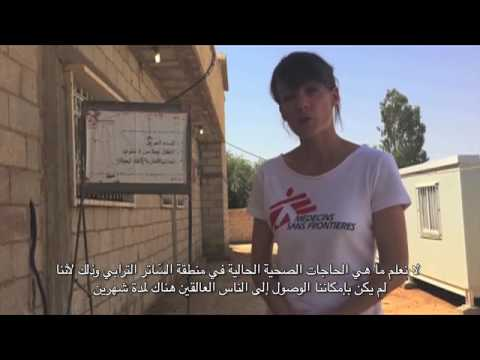
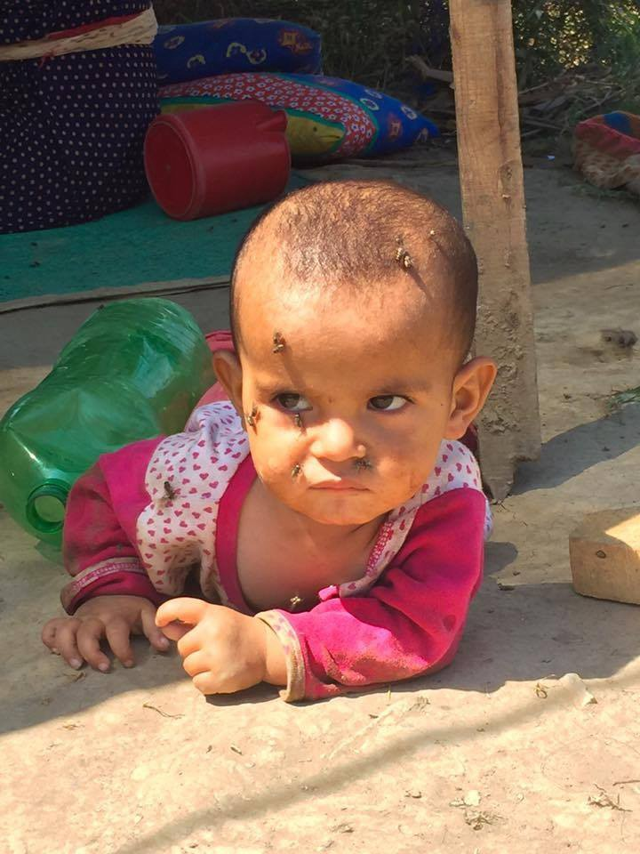
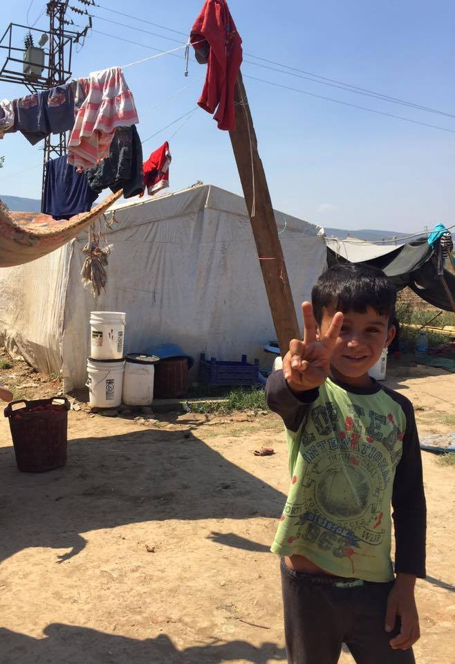
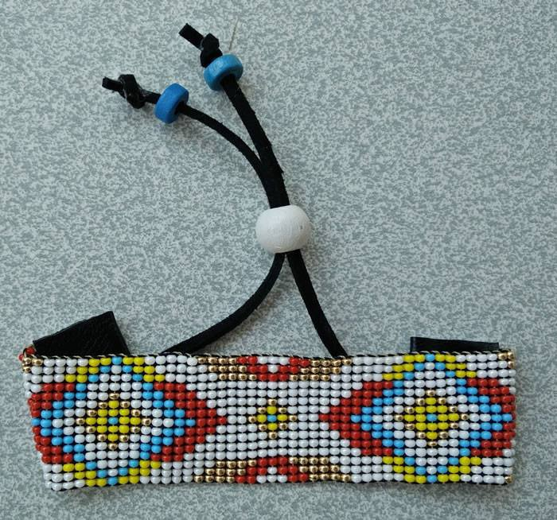
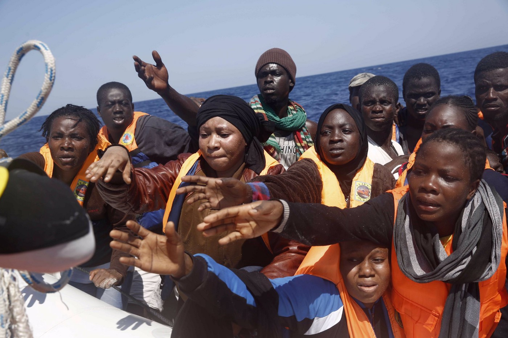
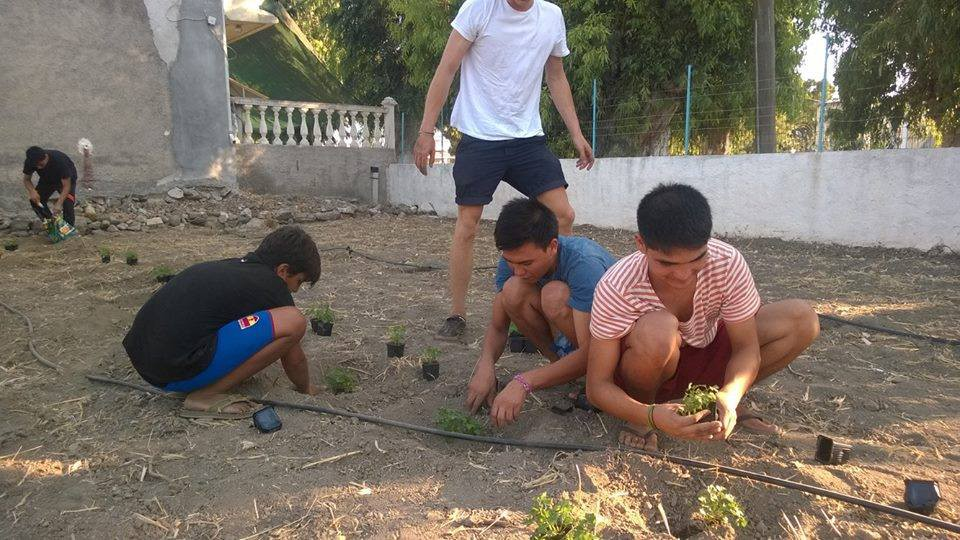
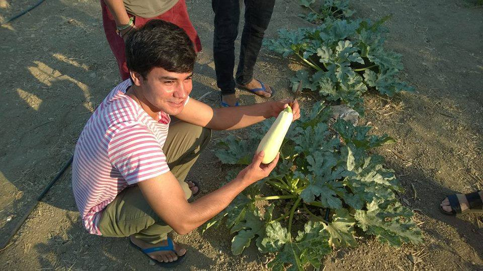
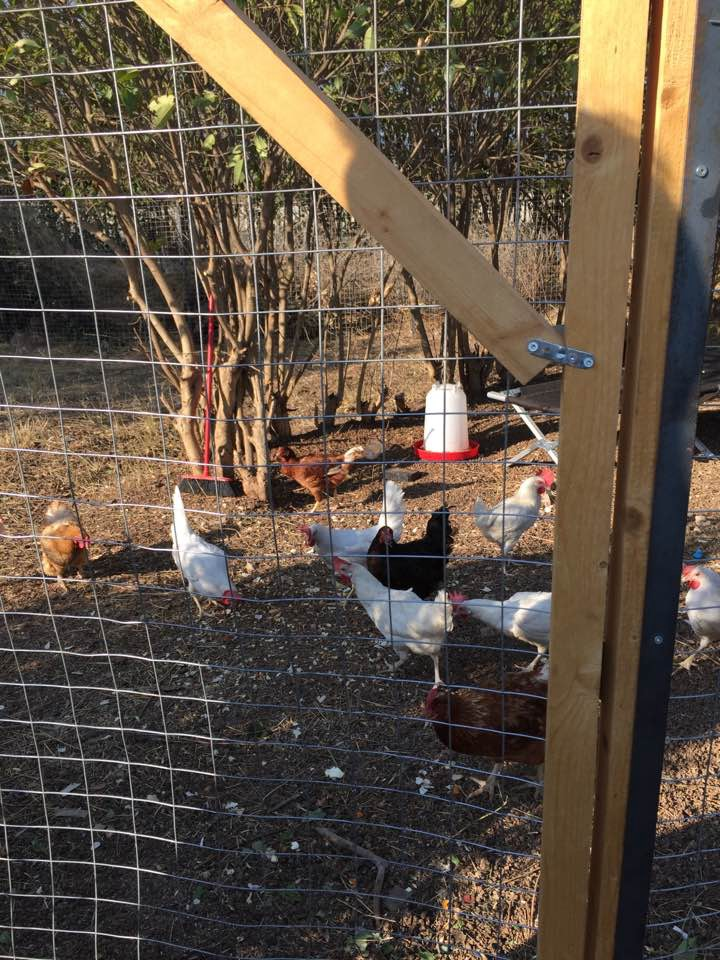
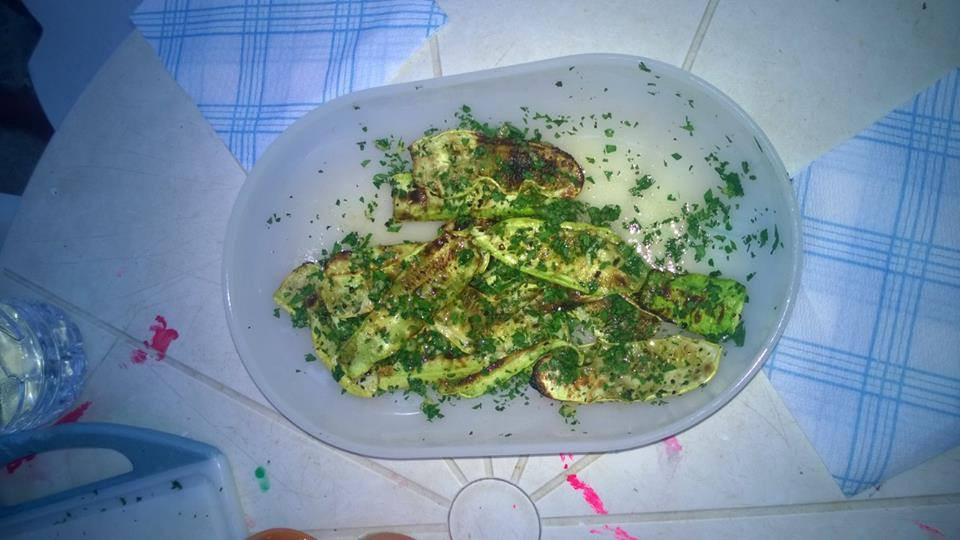
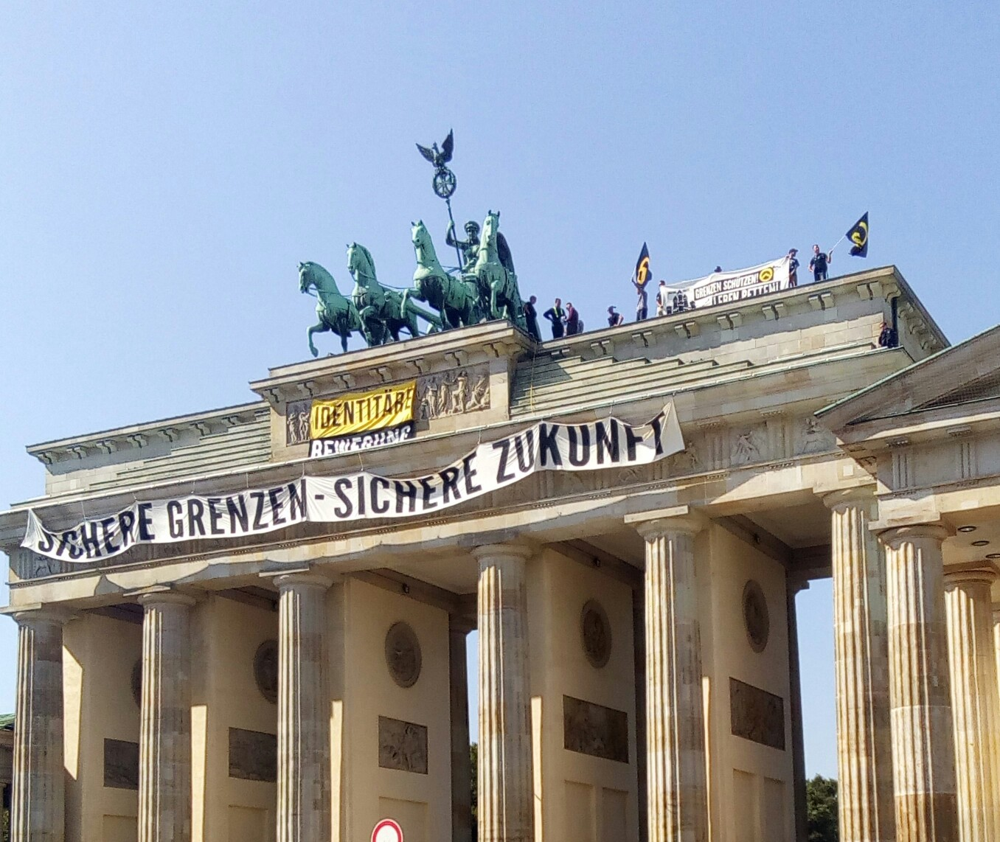

### AYS DAILY DIGEST 28/8: Food urgently needed in Dunkirk

_Thousands of people forgotten between closed borders\. We bring you MSF report from Syrian\-Jordan border and a volunteer report about refugees in Izmir\. Over 720 people rescued in Mediterranean\. Over 60 news arrivals to Greece\. Health hazard in Elliniko\. Urgent calls from help in camps in France\._

 s\.](assets/f6effdd48101/1*wfNl_0gmQYTKZoi2livAuw.jpeg)

Curt Salvador Soy: “For four times she left and she came back, every time she is back a lot of kids around her calling her “My friend “ always laughing, entertaining, helping and trying to spend the best time with refugees… You’re one of the real volunteers and we would love to say thanks for all of you\.” By [Through Refugee Eye](https://www.facebook.com/throughrefugeeeyes/photos/a.267469110309533.1073741828.266986607024450/318376651885445/?type=3&theater) s\.
### Jordan
#### Forgotten people at the border

Medical Sans Frontiers \(MSF\) team is helping people stranded at the Jordan\-Syria border where over 75\.000 people are stacked for two months in inhumane conditions\. In this short video, medical team leader explains the situation at the border\.

### Turkey
#### Dreadful conditions in Torbali camp

Western media do not report much about the conditions in which refugees are living in Turkey, too\. Volunteers are claiming the situation is terrible\. Achilles M\. Peklaris in Torbali, Izmir, brings some of the pictures from this forgotten place\.

By Achilles M\. Peklaris
#### Products made with love and care

For several months, the group of Syrian families in Izmir are making products and selling them online in order to make the living for themselves\. [Visit their page](http://revistore.org) and consider supporting them\. They promise, all products are made with love\.

Photo by ReVi
#### Help for Syrian kids to go to school

According to [recent Council of Europe](https://search.coe.int/cm/Pages/result_details.aspx?ObjectId=0900001680699e93) report, Turkey plays host to over 800,000 registered school\-age Syrian children, but only around 330,000 of them are enrolled in Turkish schools\. Our friend Alistair Muir and his colleagues from [The Turkey Volunteers](http://www.turkeyvolunteers.org) are trying to raise funds to make primary education accessible for more young refugees, who are often forced to work in sweatshops in order to support their families, instead of it being another way round\. [Donating to this fundraiser](https://www.generosity.com/volunteer-fundraising/turkey-volunteers-back-to-school-program) is a great way to directly support well\-being and education of those who are currently missing out on important years of schooling\. Kids will be enrolled in Syrian schools registered and approved by Turkish Authorities\. Currently, there are 70 such schools in Istanbul alone\.

> A donation of US$30 allows a Syrian child to attend a school for a month, US$300 for a year\! 

### Mediterranian

Proactiva Open Arms helped today in a rescue of over 720 people who were found on seven boats in the sea\.

By Proactiva Open Arms\.
### Greece

69 **new arrivals to Greece**

One boat with 28 people \(11 m, 8 w, 9 c\) was picked up north of Skala by Swedish Frontex and taken to Skala Sikamineas harbor\. The people were transferred to the UNHCR shelter and then to Moria camp\.

One man got arrested as suspected to be a smuggler and was transferred to Mytilene\.

Another boat, with 41 people, was rescued by the UK Protector vessel in the south\. The people were transferred to Moria by Port Police\.
#### Health hazard for people at Elliniko

Local officials in Athens are warning about health hazard at the old international airport at Elliniko\.

“The arrivals terminal at Elliniko is the first reception center in Attica that needs to be evacuated\. It is simply not suitable to accommodate people,” Deputy Regional Governor for Southern Athens Christos Kapantais told [Kathimerini](http://www.ekathimerini.com/211542/article/ekathimerini/news/health-warning-about-elliniko-migrant-site) \.

Warning about the conditions in this place were issued on several occasions by different parties\. Last week, a Health Ministry confidential report warned about the health risks to the migrants as well as to residents\. Authorities have since cleaned up the waste, but the number of mosquitoes in the area is said to have spiked\.

For a very long time, since May this year, authorities are promissing the palce will be evacuated\. The first plan was for September, but now it has been moved to December\. Nevertheless, this is only one of the sites where refugees are living that is not suitable for living\.
#### The first harvest in Pikpa garden

Good news from Pikpa where first vegetable was picked up from their garden\. About 4 weeks ago, Echo100Plus provided funding to start a vegetable garden across the road from Pikpa\. The first zucchinis were already on a menu for volunteers and refugees who take care of this garden\. The biggest help came from the Afghan kids who come to the garden every day for watering and maintenance\.

> “After declaring that the first harvest is up to standard, we are now almost ready to start to supply fresh vegetables to the PIKPA kitchen\. We will have more zucchini in a few days, the cucumbers are getting bigger every day, the tomatoes are now visible and the parsley is ready for cutting\. Now that the worst heat of summer is over, we will start planting again with some seasonal vegetables and also some flowers\!” 

Photos from Pikpa Garden\.
### CALLS FOR HELP

Our friend [Rando Wagner](https://www.facebook.com/rando.wagner) s busy at the streets of Athens with helping homeless people, including many refugees\. Last night, he managed to provide water for about 100 people\.

> “I came across a group of 6 Syrians guys, many many ‘ new’ Pakistanis, Greeks, a German guy, an Albanian and a Nigerian couple who I sat and talked with for the last hour… Anyway, this is one of the easiest ways to help directly and to show these guys that they are still seen as human beings and not written off\! I hope more volunteers from Greece and abroad will start doing the occasional ‘ before bedtime round ‘” 

If you want to join Rando or learn more about locations where to find people in Athens, contact him directly\.

Photo by Rando Wagner\.

[We Are Here, Cultural Center in Nea Kavala](http://react-text: 314 https://www.facebook.com/WeAreHereCentre/?fref=ts) , need volunteers to join them if possible now, and throughout mid\-September\. They need people to help with children’s activities, to work in the women’s space, to help teachers from the camp manage the running of educational classes for the children and people to help with some construction projects\. Also theater, artistic, musical and creative people with ideas and projects to share are very welcome\.

English Tutor for adults of all levels needed at Kara Tepe to start now\.

> “ [We run a well\-established program](http://humanitarian-support-agency.org/volunteer/) of four classes per day, five days per week: two beginner level and two intermediate level\. Class sizes and levels do fluctuate, and you will be expected to be flexible and able to adapt to changing needs\. We are looking for teachers holding the 120 hour TEFL qualification as a minimum, or with equivalent experience\. 

> If you think this sounds like the challenge for you then please download the TEFL application form from our website and send to [volunteer@humanitarian\-support\-agency\.org](mailto:volunteer@humanitarian-support-agency.org) ” 

### Hungary
#### Waiting list at the crowded border

I’m Human Organization [IHO published their report](https://www.facebook.com/notes/im-human-organization-iho/the-days-of-perplexity-and-improvements/1101223139913712?__mref=message_bubble) from the border between Serbia and Hungary, where hundreds of people are waiting to cross into EU\. Hungarian government allows 15 people a day to enter\. Long list is being formed and by now, a book of names has 25 pages X 88 names in each\. For more details see their report\.
### Germany
#### Less than a million people came to Germany as refugees in 2015

On the same day when the head of Germany’s Federal Office for Migration and Refugees \(BAMF\) told that he expected a maximum of 300,000 refugees to arrive in Germany this year, members of the far\-right Identitarian Movement scaled Berlin’s Brandenburg Gate and unfurled a banner to protest against the “Islamisation” of Germany\. Around 15 of them got on the top of the Brandenburg Gate, and hung a banner calling for “secure borders — secure future” and waving flags bearing the Identitarian Movement’s black and yellow logo\.

Photo AYS\.

In the same interview, the head of the BAMF told that Germany took in fewer migrants in 2015 than previously thought because some were registered twice and others had moved on to other destinations\. As he said, less than one million people came this way to the country\. It is estimated that about 10 percent of newcomers are university educated\.

He also stressed that all those deemed “economic migrants” would be deported\.
### France
#### CALLS FOR HELP

Food is needed for people in Dunkirk camp\.

This is the list of needed food:

> oil
 

> basmati rice
 

> fresh veggies
 

> tins of Tuna 
 

> chick peas
 

> beans
 

> eggs 

Fire extinguishers are needed in Calais, where more people are arriving every day\. Currently, they need 300 powder or water fire extinguishers\.

[You can help by donating](http://care4calais.org/donate/) \.

Help is needed to provide people in Calais with phone credit\.

> “We spent our last £2500 yesterday doing top\-ups leaving the pot empty\. The most common question we are asked as admins is “When will the top up come?” The only answer we can ever give to this question is “Hopefully soon, we are waiting for donations” A few months ago people were waiting for an average of a day or two\. Now it’s invariably more than a week\. All we can do is come to you all again asking please if there’s anybody reading this who can spare anything at all please donate today and help us make a difference\. Help us provide the service that thousands of people are coming to us desperate to receive\. This is a matter of safety, a matter of urgency and a matter of humanity\.
 

> PayPal — [phone\.credit\.1@gmail\.com](mailto:phone.credit.1@gmail.com) 
 

> [MyDonate](http://react-text: 196 https://mydonate.bt.com/charities/phonecreditforrefugees /react-text) 
 

> Text — CALA85 and the amount you want to donate to 70070 

_Converted [Medium Post](https://areyousyrious.medium.com/ays-daily-digest-28-8-food-urgently-needed-in-dunkirk-f6effdd48101) by [ZMediumToMarkdown](https://github.com/ZhgChgLi/ZMediumToMarkdown)._
