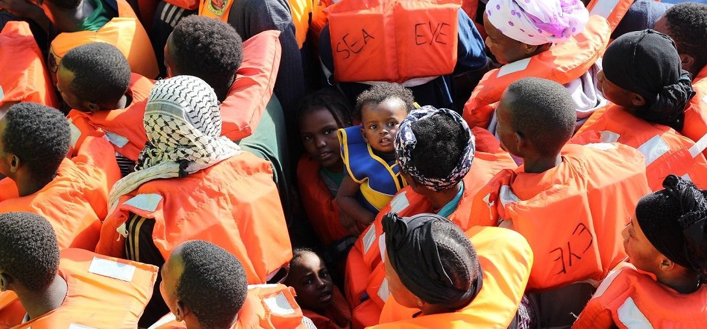
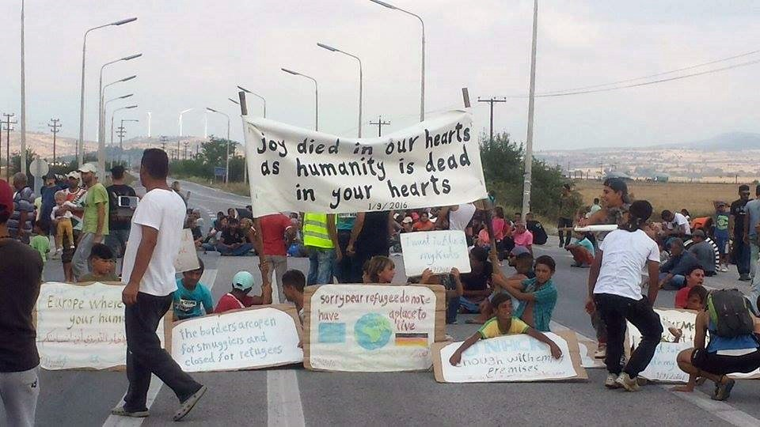
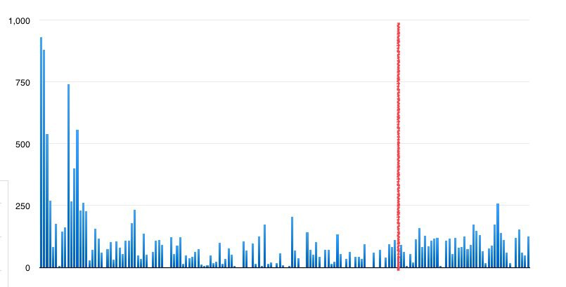
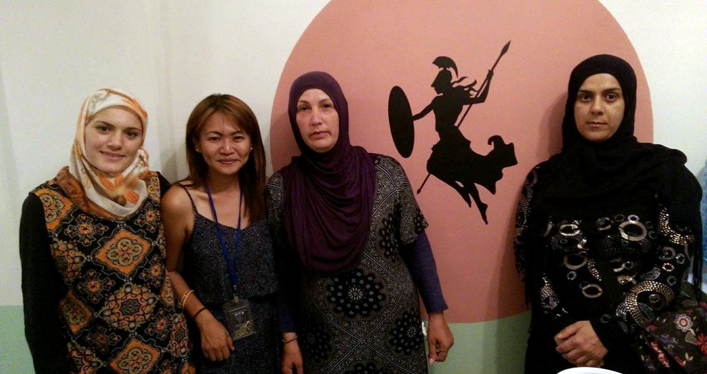
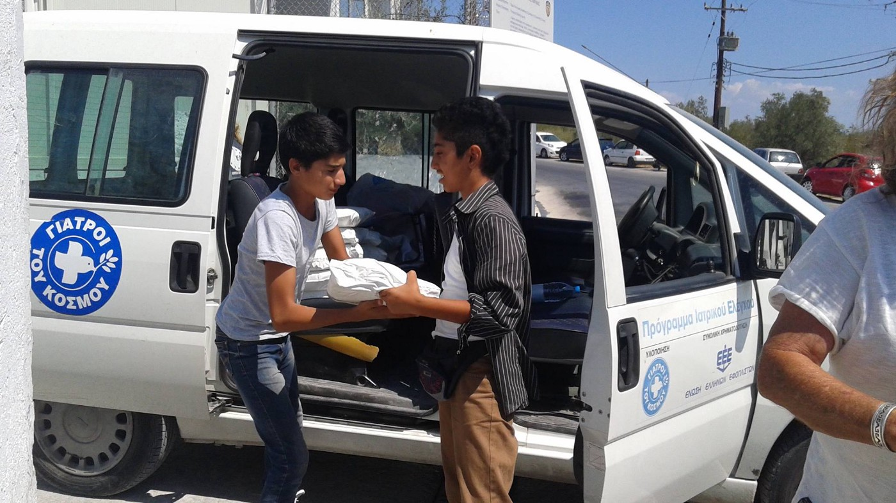
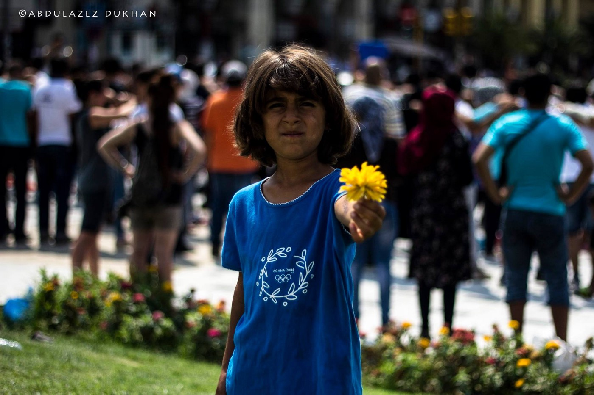
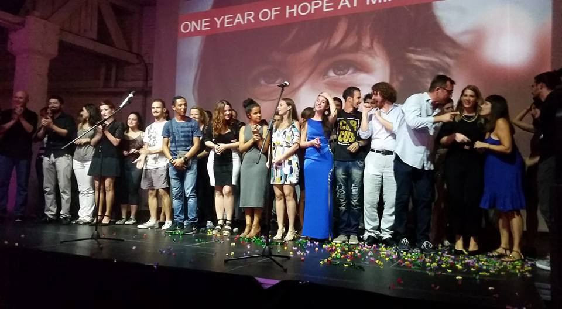
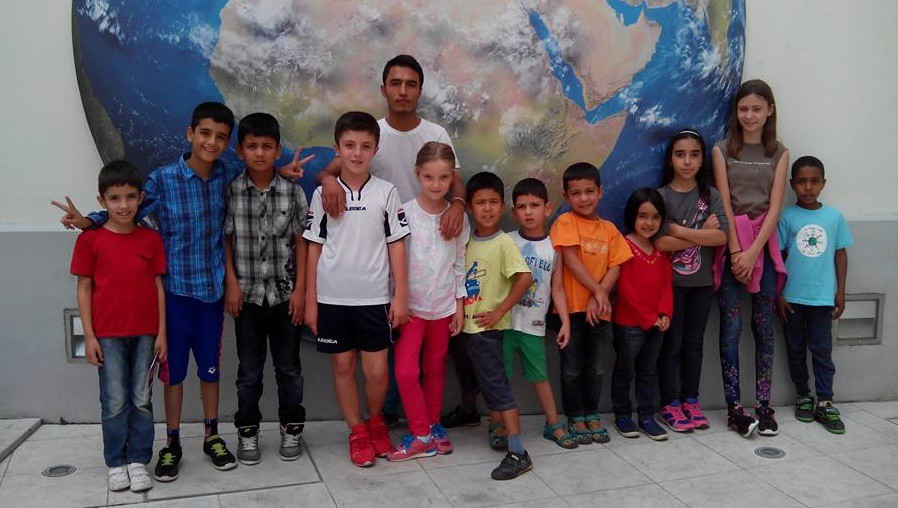
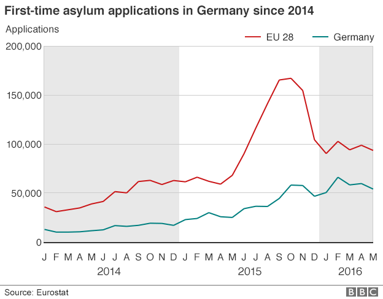
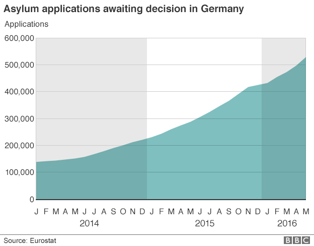

### AYS digest 1/9: Over 13,000 people saved in the past 4 days
#### Record number of refugees arrive to Italy\. Volunteer lifeguards needed in Greece again\. Food supply cut off, no running water in Vial\. Chicken pox reported in Athens\. Serbian state secretary: “Balkan route is not closed for migrants”\. Updated guide for ayslum procedure in Switzerland\. Bavaria to dictate residence of asylum seekers\. Donations of food needed in Calais\.

Entire families are risking their lives to cross the sea from Lybia to Italy\. Photo: Caitlin Ryan / MSF
#### MEDITERRANEAN

**13THOUSAND** refugees were saved off the Libyan coast in the last four days, most of them arriving from Somalia and Eritrea\. According to MSF, many people were separated from their families during Monday’s chaos, when 6,500 refugees arrived to Italy 24 hours\.

> The number of unaccompanied minors who have arrived since the beginning of this year is more than 14,700\. In the whole of last year, 12,300 arrived — Giovanna Di Benedetto from Save The Children [told Al Jazeera](http://www.aljazeera.com/news/2016/09/italy-rescues-13000-refugees-libya-peak-season-160901104807783.html) \. 

#### GREECE

96refugees arrived to Lesvos today\. 56 were picked up and brought to Skala Sikamineas by Coast Guard, including 15 women, 19 children and 3 medical cases\. Proactiva was present, and Lighthouse Relief welcomed refugees in the harbour\. Volunteers have also reported the landing of one boat carrying 40 people in the south\-east coast of Lesvos\. No landings on other islands were reported by volunteers or the government\.

Refugees protesting inhumane treatment in Greek camps\. Photo: Contaminando Sonrisas
### With EU\-Turkey deal effectively put on hold, volunteers and lifeguards are needed again

Following noticeable increase of new arrivals to overcrowded Greek islands and a widespread scepticism of Turkish political will to stop future crossings of the Aegean, the need for volunteers and volunteer lifeguards on Greek islands might be increased in the following weeks\. At the moment, Turkey is indirectly threatening to abandon the deal if EU doesn’t speed up promised favourable visa conditions for Turks travelling to Europe\.

> European politicians fear the deal will collapse should negotiations over the visa liberalisation with Turkey falter\. But in reality the arrangement has already stalled due to the departure of Turkish police from Greece following the failed coup in Ankara in mid\-July — the director of UNHCR Vincent Cochetel [said to The Guardian](https://www.theguardian.com/world/2016/aug/31/turkish-police-withdrawal-greece-stalls-eu-migration-pact-unhcr) , confirming information we got from the volunteers\. 

Number of refugee arrivals to Greece per day since the beginning of EU\-Turkey deal \(March 20th\) until today, the red line indicating the day of the attempted coup in Turkey\. Graph: Patrick Kingsley/Twitter

It is said that the Greek police and Frontex are re\-establishing contact with their Turkish counterparts, but the dates of their return to Greece keep changing, which is actually good news for refugees fearing deportation to Turkey\. Also, more refugee boats seem to avoid Turkish sea patrols, but the number of new arrivals still rarely exceeds 150 and is far from hundreds daily arrivals in the same period last year\. Unfortunately, weather conditions at the sea are getting worse as the winter approaches\.

> 10 months after our first day in Lesvos and autumn is here again… Refugee boats also\. Weather won’t be calm and warm for long, and we don’t want to have any more victims in the Aegean sea\. We are planning our winter rescue base and we need volunteers lifeguards and also your donations, said [Lifeguard Hellas Save & Rescue Volunteer Team](http://www.savelife.gr/donate/) in this morning’s statement\. 

For more elaborate list of volunteer needs, [try consulting this database](http://www.greecevol.info/task.list.php) \.
### No food in Vial hotspot today, no water for 4 days

Aggrieved Afghan refugees have blocked the gate and cut off food supply to Vial hotspot on Chios today\. According to reports from the ground, Afghans felt mistreated as only vulnerable groups and Syrian refugees were processed\. At the same time, Syrian refugees were frustrated by this event, leading to more tensions in the overcrowded camp\. According to volunteers, there also hasn’t been running water in Vial for 4 days\.
### Athena Centre for Refugee Women needs support

There are just a few more days left before an fundraising effort on behalf of the [Athena Centre for Refugee Women](https://www.youcaring.com/athena-centre-for-refugee-women-600411) on Chios comes to a close\. Volunteers have worked hard to set it up\. They still need donations in order to secure long\-term support to refugee women of Chios, many of whom have been severely traumatized and often abused on their way to Greece\. After reading a number of testimonies of grateful users of the centre, we’re sharing the appeal of the project’s founder and coordinator Gabrielle Tan\.

Gabrielle Tan with refugee women in Athena Centre on Chios\. Photo: Athena Centre for Refugee Women

> Having been in Chios since January, I’ve witnessed the impact of the EU\-Turkey deal on our fellow human beings\. They’ve been failed by the promise of humanity that Europe claims to stand for\. \(…\) Back in May, I dreamt of a place where the women can gather in a safe space\. Of protecting and empowering the women refugee population on the island\. To draw on their own power to create change, rather than be the passive recipient of circumstances\. To speak up against norms around violence and women’s rights\. \(…\) For almost month now, the vision has been realised through the power of solidarity\. The real work begins in aiding them to re\-ignite their spark\. However, this needs constant donations in order to keep it going\. \(…\) Every little helps\. On behalf of of the female refugee population on Chios, thank you — says Gabrielle, whom we admire greatly\. 

The link to their fundraiser can be found [here](https://www.youcaring.com/athena-centre-for-refugee-women-600411) \.
### Refugees in Moria finally get to wash their clothes

Two Syrian boys helping to unload donations in Moria camp\. Photo: Jim Henley

Following sucessful fundraiser organised by amazing [Dirty Girls of Lesvos](https://www.facebook.com/dirtygirlslesvos/?fref=ts) , donations of washing powder have arrived to Moria hotspot on Lesvos, allowing up to 3,500 refugees to have the dignity of washing their own clothes\. According to Dirty Girls, the donations came in from the United States, United Kingdom, Germany and Spain\.
### Chicken pox outbreak reported in Athens

According to independent volunteer reports, there has been a confirmed outbreak of chicken pox at [Jasmine school squat in central Athens](https://www.facebook.com/Jasmine-School-Athens-229869940740453/?fref=ts) \. If anyone has any spare funds and could purchase some calamine lotion, please contact local volunteers\. Please be advised that chicken pox is highly contagious and rather unpleasant\. If you are not vaccinated and/or have never had chicken pox, it would be wise to avoid the squat until the outbreak is over\.
### Through refugee eyes: protest in Thessaloniki

> “ We are together, today we are here, yesterday we were here, before we were suffering in our country from bomb and we found ourselves here suffering from waiting, today we are in the street because no another solution for us, we hope so the world will understand our situation “ — A\. Dukhan, Through Refugee Eyes 

\(There have been peaceful demonstrations of refugees all over Greece today\)
#### BALKANS
### Miksalište celebrating its first year of work, state secretary says “anyone can pass through Serbia”

Refugee center Miksalište, which proved to be invaluable support in the first months of the crisis, and was recently transformed into more structured support center for refugees passing through Belgrade, has celebrated its first year of work, throwing a big party in a partnering Mikser house venue\.

> We started out as an ad hoc civil initiative, without any sort of long\-term plan\. In the past year, approximately 1\.300 volunteers from 60 countries have provided support to 150\.000 refugees in Miksalište — said Ivan Lalić from Mikser house\. 

Volunteers and refugees celebrating the first year of Miksalište\. Photo: Miksalište

One of the guests at the party was Nenad Ivanišević, state secretary in the Ministry of Labour, Employment, Veteran and Social Policy, who made an interesting claim about recent refugee flows\.

> Balkan route is not closed for the migrants\. Serbia will help anyone who enters the country\. We won’t change our policy about this — Mr\. Ivanišević said, adding that the refugee crisis shouldn’t be linked to any terrorist threats, because refugees are people in need, in contrast to criminals who belong in jail\. 

This doesn’t mean the refugees will be able to cross the border to Hungary without waiting for weeks, maybe even months\. It also doesn’t mean they will be granted safe passage over Croatian and Slovenian borders\. But it shows that high\-ranked state officials are finally acknowledging that the route still works in its own peculiar ways, that people have continued to cross borders irregularly after the official border closure was imposed in March\. Now it is time for top\-ranked officials to accept and acknowledge their own mistakes and grant safe passage to those in need, instead of leaving them to smugglers and unsafe crossings of green borders in order to reach safety\.
### Refugee children to enter school in Croatia

According to unofficial information, 12 refugee children out of approximately 30 school\-age refugees in Zagreb will enter Croatian school system next week\. AYS volunteers have spent the summer preparing them for school, with a special focus on learning Croatian, because there will be no special program for them organised by the government and they will have to adjust to regular Croatian schooling system despite the language barrier\.

Kids of Porin refugee centre in Zagreb are getting ready for entering Croatian school system\. Photo: AYS
#### SWITZERLAND
### Updated detailed guide for ayslum procedure\!

Welcome to Europe has published an update about the asylum procedure in Switzerland, explaining it in detail, with a lot of links, charts and useful resources\. English web\-version of the text [can be found here](http://www.w2eu.info/switzerland.en/articles/switzerland_-asylum.en.html) \. French, Arab, Farsi and hopefully Tigrinya texts are expected to come soon\.
#### GERMANY
### Bavaria becomes the first German state to dictate residence of asylum seekers for a period of 3 years

Bavaria has become the first German state to implement a new integration law whereby the government can dictate asylum seekers’ place of residence for a period of three years\. All asylum seekers living in the southern German state will be affected by the rule except those who are engaged in job training or have employment and are working 15 hours a week or more\.

> This ruling allows us to ensure that migrants in Bavaria live with us, not alongside us\. This way we are preventing parallel societies forming, and at the same time we are fostering integration across Bavaria \- said Emilia Mueller, social affairs minister in the state\. 

Guenter Burkhardt, head of the refugee rights organisation [**Pro Asyl**](https://www.proasyl.de/en/) , told Bavaria’s state broadcaster BR that the ruling was not in keeping with the principles of a free society, where people choose where they want to live\.

The new rule is based on an integration law that was passed by the German government in early August\. According to DPA article that we’re quoting, it is up to the country’s 16 federal states to implement it\.
#### FRANCE
### Belgium Kitchen team needs food for Calais

The number of people in Calais has exceeded 9000\. According to [Belgium Kitchen team](https://www.facebook.com/BelgiumKitchen/?fref=ts) , the population is increasing and donations decreasing\. In order to keep going, they need aluminium containers to serve the meal, plastic plates and spoons, long or basmati rice, onions, potatoes, tomato sauce, oil, canned peas, canned carrots, canned red beans, eggs, flour, water, milk, coffee, sugar, tuna, bread, fruits, lemon, ginger, fresh garlic, laundry detergent, shampoo and dishwashing liquid, mattresses, tents and blankets\. Donations can be brought directly to the kitchen team, or to their headquarters in Chaussée de Gand 256 in Brussels\.

_Converted [Medium Post](https://areyousyrious.medium.com/ays-digest-1-9-over-13-000-people-saved-in-the-past-4-days-e878350d3bcf) by [ZMediumToMarkdown](https://github.com/ZhgChgLi/ZMediumToMarkdown)._
