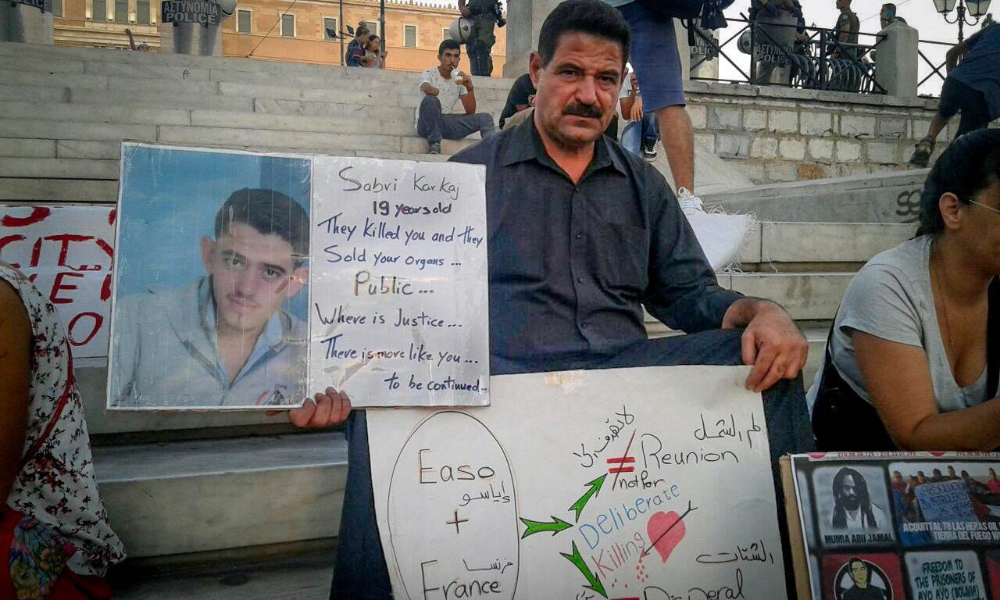
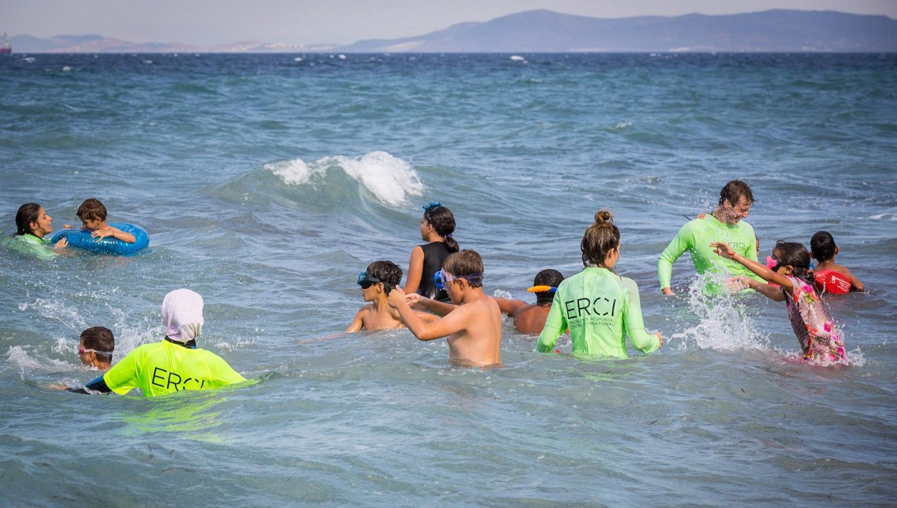
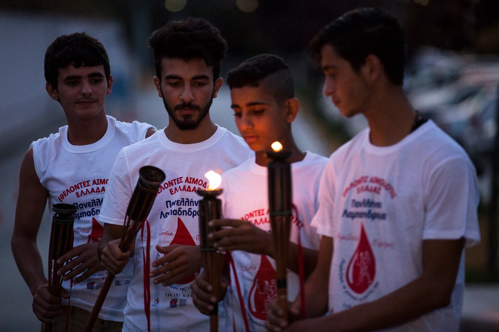
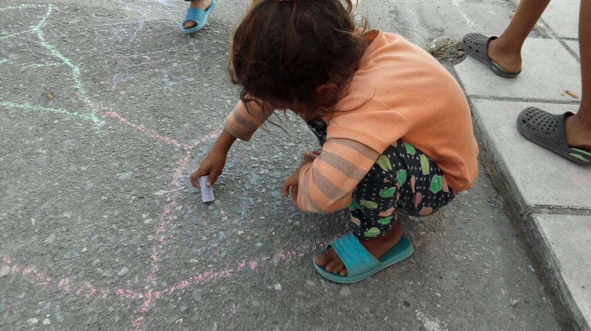
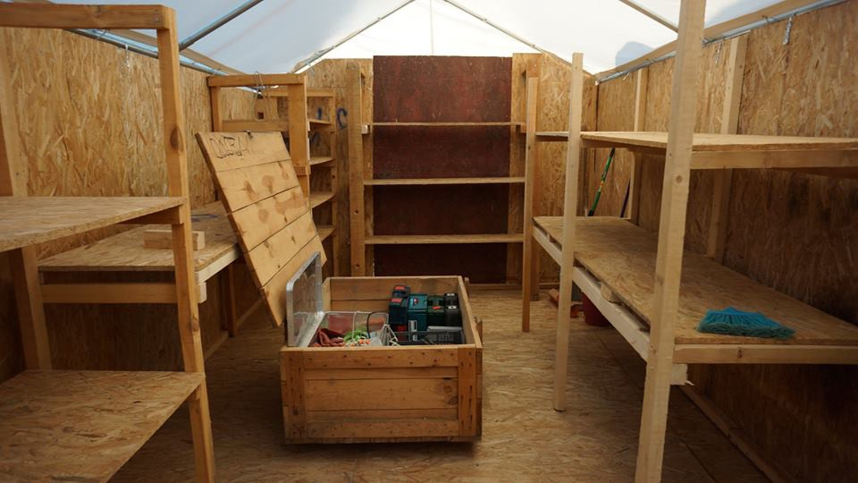
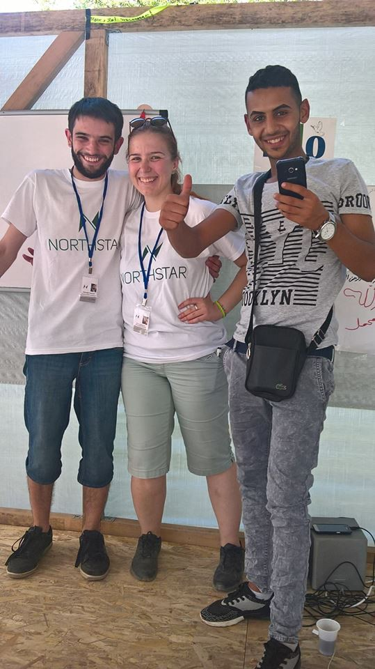
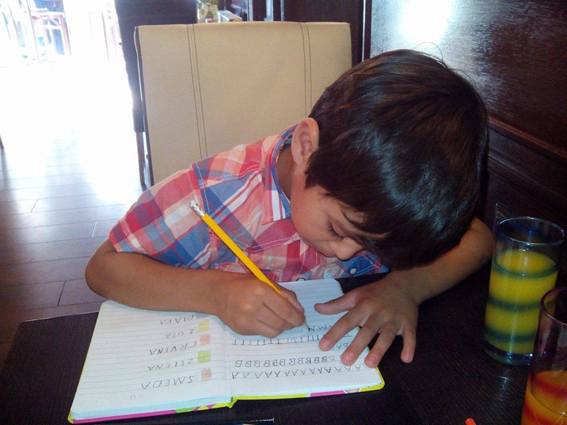
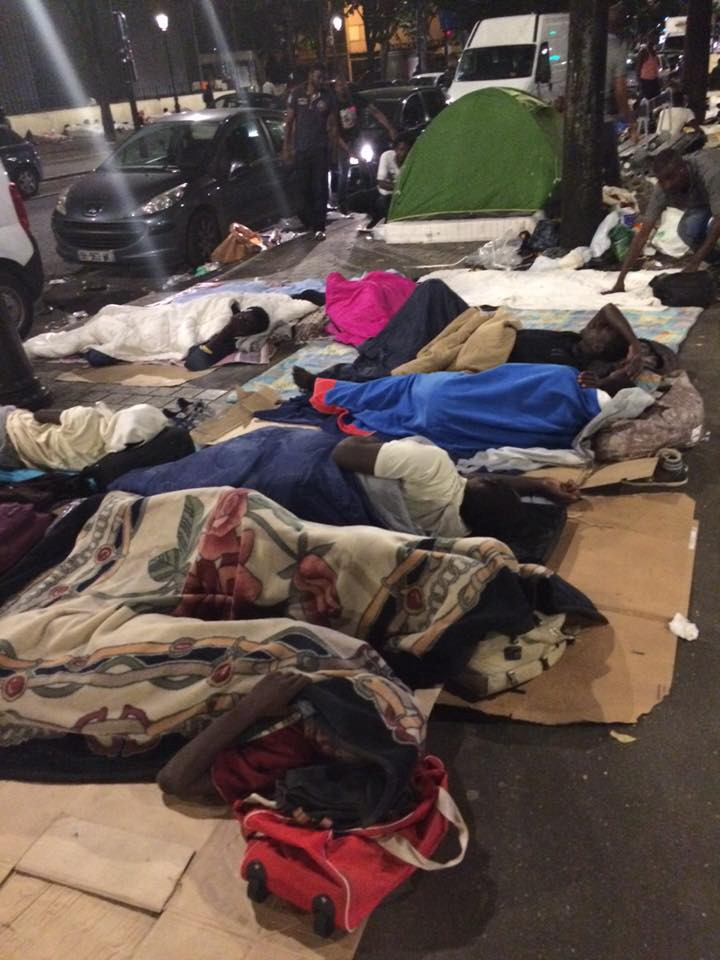

### AYS digest 4/9: EU “Solutions” that create problems

](assets/65d996c22a69/1*hc7SUfKWaOHoNef7X0IunA.jpeg)

“ Good morning humanity\! With a picture of a dawn from south coast of Lesvos island, we want to say that, together, we can make this planet a better place for everyone\.” Credits: [**United Rescue Aid**](https://www.facebook.com/unitedrescueaid/)
#### Syria
### Aleppo under siege again

 ‎](assets/65d996c22a69/1*vXeYCSLaBtgNHLD984agOg.jpeg)

Credits: [**Karam Hilly**](https://www.facebook.com/profile.php?id=100008210941112) ‎

Syrian government troops on Sunday seized a military academy south of Aleppo city, once again encircling the rebel\-held districts in the east and placing them under siege, a monitor said\.

The Syrian Observatory for Human Rights, a Britain\-based monitor, said government forces backed by Syrian and Russian air strikes had now severed the alternate route into the rebel east that opposition forces opened up in August\.

“The army took control of the artillery academy, so they control all the academies, and the eastern neighbourhoods are under a full siege,” said Observatory director Rami Abdel Rahman\.
#### Greece

102 refugees arrived to Greek islands today\. 46 people have landed on Samos and 12 on Leros making a total of 64 according to government sources\. Additionaly, volunteers have reported one boat picked up by Frontex this morning on the north coast of Lesvos, carryng 38 people, including 7 women, 4 children, and an infant with respiratory problems\. Ambulance was called to transport the baby to hospital\.
### A child refugee sleeps rough Theassaloniki Park

Remember, winter is coming\. Where will he go then?

](assets/65d996c22a69/1*-nINuofC8RfO4zqgXUaP-Q.jpeg)

Credits: [**Joost Rot**](https://www.facebook.com/joost.rot)
### Four days of peaceful protests in Syntagma Square

A man from Aleppo holding a picture of his dead son\. Photo: Refugee Solidarity Greece

Refugees assembled in Syntagma Square, Athens for the fourth consecutive day to protest closed borders and inhumane living conditions\. Similar protests are held all over Greece\. Over 50,000 refugees remain trapped in the country, unable to cross the northern border to continue their journeys to western Europe, leaving them vulnerable to homelessness, food scarcity and abuse\. On a touching picture shared by [Refugee Solidarity Greece](https://www.facebook.com/refugeesolidaritygreece/) , a man from Azaz, north of Aleppo, holds a picture of his son, Sabri, in Syntagma Square, Athens\. Missing for six months, Sabri’s body was allegedly found mutilated earlier this year near Alexandroupoli, where he had tried to cross the Greece\-Turkey border to join his family in Greece and northern Europe\.
### Peaceful refugee protest in Cherso

**](assets/65d996c22a69/1*vfGTQjB3B4ukJHOI_E0uMw.jpeg)

Credits: **‎ [AboHassan Alzobaa Smsm](https://www.facebook.com/alzobaa.hamada?fref=nf)**

**](assets/65d996c22a69/1*K5Ji33WO9ghFFR2V8lrilg.jpeg)

Credits: **‎ [AboHassan Alzobaa Smsm](https://www.facebook.com/alzobaa.hamada?fref=nf)**

**](assets/65d996c22a69/1*0Va3NGwBWI1mM5GUkUAJ8A.jpeg)

Credits: **‎ [AboHassan Alzobaa Smsm](https://www.facebook.com/alzobaa.hamada?fref=nf)**
### Medical concern: a 21\-year old refugee with kidney and bladder malfunction needs to be checked

Refugee community has raised a concern about 21 year old Mohammed, who has been living with only one kidney for the past six years — and now his only working kidney has also started to fail, and he also seems to have significant problems with his bladder\. [This](https://www.facebook.com/groups/1096358837095826/permalink/1142048935860149/?hc_location=ufi) is the link to a post with his story , with some medical documents in Greek and German attached — if there’s a medical team willing to investigate the case, it would be very appreciated\.
### ERCI needs volunteers on several locations

ERCI team providing support to young refugees of Pikpa, who are learning how to swim\. Photo: ERCI

After so many hard days, we have received beautiful photos from Lesvos, where [**Emergency Response Centre International**](https://www.facebook.com/ercintl/) provides lifeguard services to the minor residents of Pikpa camp while they enjoy a carefree day in the sea\. ERCI works in the waters south of Lesvos, but they also have offices in Athens, education team in Thessaloniki and many other fields of work\. If you are interested in donating or volunteering please see their [website](http://www.ercintl.org) \.
### Refugees and citizens of Kavala united in humanitarian run for local blood drives

Five young men from the Kavala camp were asked by the local community representatives to participate in this year’s Torch Bearer for Love run, put on by the Kavala Association of Blood Donation and Kavala General Hospital, which aims to raise support for local blood drives\. The directors of the Kavala General Hospital and Association of Blood Donation reached out to members on Medicins du Monde, who work in the camp, seeking five residents to participate in the 2km run\.

Five young residents of Kavala camp participated in a local humanitarian run\. Photo: Northern Lights Aid

> Our five friends from the camp did an amazing job carrying their torches alongside the citizens of Kavala\. This kind of willingness and encouragement by members of the community to involve residents of the camp in local activities makes us proud to work in such an open minded, welcoming and generous city as Kavala\! Last night was perfect example of how communities can come together in support of a common goal\! — wrote [Northern Lights Aid](https://www.facebook.com/Northernlightsaid/) volunteers\. 

### Volunteers needed in Thessaloniki area

[Mam Beyond Borders](https://www.facebook.com/MAMbeyondborder/) and [Firdaus](https://www.facebook.com/associazione.Firdaus/) are looking for volunteers for following positions: one carpenter, one midwife, one nurse, one pediatric, ten generic volunteers for different works, four generic volunteers for warehouse in Thermi\. Generic works may include cleaning camps and work with children\.

All volunteers must live in Thessaloniki or surrounding, have a good behavior and be available to work all day long\. English or Spanish speaking are a must\. 
Minimum 10 days for each position\. Apply with [private messages on FB](https://www.facebook.com/scatola.dellefoto?fref=nf) \.
### Call for donations for school in Alexandreia

[Refugee Support Greece](https://www.facebook.com/RefugeeSupportGreece/?hc_ref=PAGES_TIMELINE) is raising money for classrooms for the children aged 4–7 at Alexandreia camp\. The older children will be attending local schools soon, but 57 pre\-school kids will need to be educated on the camp\. The Ministry of Education will provide 3 teachers for classes that will will run from 8am\-12pm every weekday, but only if volunteers manage to convert 2 derelict rooms into functioning classrooms\. The large agencies can’t move quickly enough and these need to be ready in 2 weeks\.

One of 57 kids who need to be pre\-schooled in Alexandreia camp\. Photo: Refugee Support Greece

> Currently, all we can do is run activities like this — messing about with chalk on walls and floors\. [Please donate to this](https://mydonate.bt.com/events/schoolrooms/337691) — a private donor will double whatever we can raise — wrote Refugee Support volunteers in their call for help\. 

### Camp Cherso houseworks

Cleaning classrooms, building furniture, and putting the finishing touches on the community centre\. Great refugee\-volunteer teamwork, guys\!

](assets/65d996c22a69/1*xTj-qFoEA0KqyS8z6B-ZoA.jpeg)

Credits: [**Open Cultural Center**](https://www.facebook.com/OpenCulturalCenter/)

](assets/65d996c22a69/1*oBebTIG8bKkfepuglpqVgQ.jpeg)

Credits: [**Open Cultural Center**](https://www.facebook.com/OpenCulturalCenter/)

](assets/65d996c22a69/1*-PSMzAzn1i7MQiaRsF2xbA.jpeg)

Credits: [**Open Cultural Center**](https://www.facebook.com/OpenCulturalCenter/)

EKO kitchen have just a few finishing touches left to be completed\. This means more healthy meals for refugees\!

](assets/65d996c22a69/1*j1upGP_sjQUPXVipVbgBgg.jpeg)

Credits: [**Eko Kitchen**](https://www.facebook.com/Eko-Kitchen-1726250234285762/)

](assets/65d996c22a69/1*6QZeEwe5Dl6vU-4t2agupg.jpeg)

Credits: [**Eko Kitchen**](https://www.facebook.com/Eko-Kitchen-1726250234285762/)

EKO Kitchen is a community run field kitchen which supports refugees in Vasilika military refugee camp in Greece\. They cook healthy meals daily for 1300 people\. All of EKO kitchens ingredients are sourced locally in Thessaloniki supporting Greek farmers and producers\. Their chef Houssam is Syrian and the kitchen staff are a combination of refugees and visiting volunteers\. They create a place for collaboration and community and provide a small taste of home for those that have extremely limited options for food\.

0,35 € provides food for 1 person 
3,50 € provides food for 10 people 
35,00 € provides food for 100 people
175,00 € provides food for 500 people
350\.00 € provides food for 1000 people\.

Every contribution, however big or small, is hugely appreciated\. It is because of people like you that this project is possible\.

Check out their volunteer photos here on Tumblr and instagram:

[http://ekokitchen\.tumblr\.com/](http://ekokitchen.tumblr.com/) 
@ekokitchen
### My Experience Working in a Refugee Camp by [**Josh Lleb**](https://www.facebook.com/josh.lleb?fref=nf)

> I started writing this while on a ferry, leaving the Greek island of Samos, after volunteering for 5 weeks in a refugee detention centre\. It’s only now 3 weeks later that I can finally bring myself to finish these words, such is the impact the experience had on me\. 

> 5 weeks ago, while on this same ferry travelling to Samos, I could not have begun to imagine the impact this experience would have on me as a person\. 

> Sitting at home, watching the news headlines it’s easy to disassociate yourself from the people who are fleeing their homes, their friends, their relatives, their lives\. These are not people we know, these are not people we can relate to, they are not like us\. It’s natural to rationalise such atrocities like this because if we didn’t we would be crushed under the weight of the world’s problems\. It’s harder to care than to simply switch off\. Besides, what can YOU do to help anyway? This is EXACTLY how I felt\. 

> I have to tell you, my view has changed\. I now see these people, in this predicament, as my friends and it breaks my heart\. I don’t just mean friends in a literal sense, although for some this is true\. What I mean is that I look around the detention centre and interact with these HUMAN BEINGS and I see my friends and family and know that but for my fortunate circumstances it could be me or people I know and love sitting, waiting, wishing\. And now it is people I love in this situation\. 

> I will never ever forget the moment I spent with one of my new friends\. I found myself comparing the two of us and determined we have much in common apart from colour, race and religion\. This in itself was enough to condemn him to his fate and me to mine\. Sitting on the beach with him after celebrating his birthday with a mix of refugees and volunteers, he asked me if he could play some music through my portable speaker\. His choice of song, “Somewhere Over the Rainbow” not only moved me to tears for the first time in 12 years but also sums up the situation perfectly\. 

> It’s easy for us to sit in front of our televisions and label these people economic migrants looking for a better life\. And in a sense this is true, they are looking for a better life but do not mislabel them econimic migrants because their priorities are very different to ours\. Material possessions take a back seat to things we take for granted like safety and liberty\. ‘Better’ is a relative term\. 

> Of the refugees I spent time with only one could swim more than a couple of metres yet they all arrived in overcrowded boats\. I try to imagine what it must be like to put yourself through all of these things just to escape your situation\. 

> The organisation I worked with ‘Samos Volunteers’, really isn’t an organisation at all but rather a collection of independent volunteers\. They aren’t solving the world’s problems or even all the problems in the detention centre on Samos\. What they are doing is returning a bit of dignity and showing some human decency to the people living in this situation\. 

#### Serbia
### Kelebija learning centre to teach children for the whole of September

[I’m Human Organization iHo](https://www.facebook.com/imhumanIHO/) and [NorthStar](https://www.facebook.com/NorthStarSerbia/) ensured funding to teach children English, German, geography, and art during the months they spent in Kelebija\.

](assets/65d996c22a69/1*FcQ4mdpVblLqoxj_sdicgw.jpeg)

Credits: [I’m Human Organization iHo](https://www.facebook.com/imhumanIHO/)

](assets/65d996c22a69/1*ZjiZdteapGx60IaKgMDp6w.jpeg)

Credits: [I’m Human Organization iHo](https://www.facebook.com/imhumanIHO/)

](assets/65d996c22a69/1*gINqTLB_lEu6PqUQriW91Q.jpeg)

Credits: [I’m Human Organization iHo](https://www.facebook.com/imhumanIHO/)

](assets/65d996c22a69/1*U_BKsI7zRV5WRQhvOKgv3A.jpeg)

Credits: [I’m Human Organization iHo](https://www.facebook.com/imhumanIHO/)
#### Croatia
### School time for children in Croatia

Monday September 5th will be the first day of school for all children in Croatia — and thereby it should also be the first day of school for refugee children in Croatia\. Hereby AYS wants to accentuate the importance of access to quality education for refugee children and youth in the age from 0 to 18 — from preschool to high school\.

There are about a hundred of refugee children and minors in Croatia, to whom the access to quality education from preschool to high school is guaranteed by the Constitution, UN Child’s Rights Convention — ratified by the State, as well as by the national legal acts\.

> We especially want to point out the importance of access to integrated preschool and high school education — even though it seems that the state works in the direction of enabling the access to elementary schooling, it is still not clear what will happen with the access to preschool and high school education\. Despite the fact that the preschool education is a key to language learning and social integration, it is not clear whether and when the refugee children will join their peers in the kindergartens\. Also, it is not clear what will happen with the minors of high school age who are entitled to high school education, despite the fact that this level of education is not obligatory\. 

> And finally, it is not clear whether and when the refugee children will and minors who did not apply for asylum in Croatia, or who are placed in the detention center Ježevo be included into education system\. We repeat, UNCRC defines a child as a ‘ every human being below the age of eighteen years unless under the law applicable to the child, majority is attained earlier’\. 

We believe that in enabling access, the institutions must take into account:
\- the heterogeneity of the group; 
\- the fact that most probably a majority of children and their families have lived through some traumatic experience; 
\- the fact that majority of children live in physically segregated conditions;
\- the fact that the purpose of education is to enable a child to fulfil her/his full potential \(and not to simply fulfil a legal formality\);
\- the fact that child’s first language is important for child’s identity and self\-esteem, as well as for learning of foreign languages;
\- the fact that no child is tabula rasa, but a competent person with knowledge and experiences;
\- the fact that the foreign language \(in this case Croatian\) is most efficiently acquired in spontaneous language interactions with native speakers and therefore it is crucial to enable such interactions to refugee children\.
We believe that quality education to refugee children is a benefit of the entire society\.

AYS already conducts the educational support programme for children accommodated in the Reception Center Porin in Zagreb\. In the last two months we managed to enable professional teaching support over the summer for each child of school age\. Hereby we thank each teacher, child and his/her family — and we wish them a happy first day of school, while we remind the Ministry of Education about the obligations that Croatia has towards every single child\.

AYS volunteers are preparing kids for school\. Photo by AYS\.
### Locals suggest the recent increase in a number of refugee crossings from Serbia to Croatia

The locals of Tovarnik and Vladislavac have stated that they have been noticing a strike increase in the number of refugees crossing from Serbia to Croatia, as well as in number of policemen hunting down refugees and returning them to Serbia\.

We also got information about people being pushed back in the area of Vladislavac\. As we learned, people who were found in this area were sent back to Serbia\.
#### Germany
### Merkel says refugees not taking away benefits from Germans

German Chancellor Angela Merkel, whose conservative party faces possible defeat in an election in her home state on Sunday, rejected charges by anti\-immigrant critics that her government was spending less on Germans due to a large influx of refugees\.

In an interview published in Saturday’s edition of Bild newspaper, Merkel also strongly defended her decision, one year ago this weekend, to open the door to hundreds of thousands of refugees mostly fleeing conflicts in the Middle East\.

“We did not reduce benefits for anyone in Germany as a result of the aid for refugees\. In fact, we actually saw social improvements in some areas,” Merkel said\.

“We took nothing away from people here\. We are still achieving our big goal of maintaining and improving the quality of life in Germany,” she said, a day before a critical vote in the eastern state of Mecklenburg\-Vorpommern\.
#### France
### Refugees living in French camps want to know how to reach the UK without breaking the law

Some residents, including many children, have a legal right to claim asylum in Britain but are stuck in Calais, Dunkirk, or a smaller camp because they don’t have access to advice or information, a report seen by _The_ _Independent_ has found\.

Nearly half of more than 1000 people surveyed told researchers from the [Refugee Rights Data Project](http://refugeerights.org.uk/) \(RRDP\) the subject they most wanted information on was how to reach the UK legally, contradicting the [prevalent idea](http://www.dailymail.co.uk/news/article-3772571/Carnage-Calais-Horrific-crash-jungle-migrant-gangs-target-tourists-cars-MoS-journalists-badly-hurt-terrifying-new-ambush-technique.html) that refugees choose to try and sneak into the country illegally\.

The report explores in depth an ‘information gap’ which leaves refugees stranded in France because they don’t know how to reach their target country, how to claim asylum there, or even how to claim asylum in France\.

Researchers found three quarters of refugees they spoke to did not have access to information on how to improve their situation\.

In cases where individuals have direct family members in a specific European country, the government of that country is supposed to waive a rule which says the first EU Member State an asylum seeker arrives in is repsonsible for that person’s claim\. The rule is supposed to allow family reunification, but Marta Wallander of RRDP said in reality this wasn’t happening\.

Instead, a dearth of information leaves refugees trapped in the camps, she said, even if they have a right to claim asylum in the UK\. Many become desperate, and try to reach the country illegally, making dangerous, sometimes deadly, attempts to cross the channel\.
### Donations needed for refugees in Paris

Food: onions, potaotes, oil, tinned tomatoes, chick peas, lentils, pasta, rice

Clothes: T shirts, sweat shirts, jeans, \(S/M\), socks, boxers, shorts

Others: Backpacks, shoes

](assets/65d996c22a69/1*92CTdZWmoF2bz-RPerl-RA.jpeg)

Credits: [**Christine Dolan**](https://www.facebook.com/christine.dolan.10)

](assets/65d996c22a69/1*rOvB_YVeqR_I-M-QZ5bRhw.jpeg)

Credits: [**Christine Dolan**](https://www.facebook.com/christine.dolan.10)

](assets/65d996c22a69/1*BQarPwyLIUhqecytGIZLcg.jpeg)

Credits: [**Christine Dolan**](https://www.facebook.com/christine.dolan.10)
### Coming tomorrow: New data on refugees in France

](assets/65d996c22a69/1*XvzSzJAsnfLT5iCdYfQJ3g.jpeg)

Credits: [**Refugee Rights Data Project**](https://www.facebook.com/RefugeeRightsData/)

These data provide an overarching picture of the situation faced by refugees and displaced people living in limbo in northern France\.

Be among the first to read them tomorrow by checking [here](https://www.facebook.com/RefugeeRightsData/) , and by following them on Twitter \(@refugeedata\) \!
### Please help Care4Calais make Eid celebration for Calais refugee camp

](assets/65d996c22a69/1*lCHS5u6YSTT3CJztnQOaWQ.jpeg)

Credits: [**Care4Calais**](https://www.facebook.com/care4calais/)

For the upcoming Eid celebrations, Care4Calais would love the refugees in Calais’ camp to have what many of us take for granted: food and the ability to cook it\. Thusly, they want to distribute 5,000 food packs and 160 gas canisters but, to achieve this, they need to raise an ambitious total of €10,000 EUR\.

They need your help\! Eid is a time when communities come together and provide for each other\. Please help them provide and bring hope for those trapped in Calais\.

Please [donate](https://gogetfunding.com/help-us-make-eid-in-calais-refugee-camp/) , or get [involved](https://www.facebook.com/events/229041537493918/) \.
### **Resistance Fields, Saturday, September 10 from 11:30 in Norrent\-Fontes**

](assets/65d996c22a69/1*wZn7SkCsjTd5SB_vscKbpQ.jpeg)

Credits: [passeursdhospitalites](https://passeursdhospitalitesenglish.wordpress.com/author/passeursdhospitalites/)

While the spotlight is often pointed at Calais waiting for a new expulsion ever announced, it is the camps of the smaller ports or along the highway near the car parks that are destroyed: Dieppe, Cherbourg, Caen, Choques, and Steenvoorde\. The Norrent\-Fontescamp The [Norrent\-Fontescamp](https://goo.gl/maps/ughLmKmwQ7z) is within the scope of an expulsion procedure\. After two postponements, the hearing is scheduled for September 14\. A support day is planned next Saturday in the camp\.
#### UK
### Hundreds of refugee children are still stuck in Calais, months after being told they are eligible to come to the UK

Not a single child has been helped to leave the Calais migrant camp despite changes to the UK’s Immigration Act four months ago which were meant to assist them\.

“There are 800 unaccompanied children in this camp and 387 now have the right to go to Britain, but not one has,” the Labour peer Lord Dubs said to [_Sky News_](http://news.sky.com/story/no-child-helped-out-of-notorious-calais-camp-10564435) _\._

Around 70 new people are arriving in the camp each day and it is now home to nearly 10,000 people in total\. The Calais camp is planned to be dismantled by Christmas\. Where will these children go? Where will these people go?
### Hundreds of child refugees are missing in the UK

Over the past five years, 9,287 children have sought safety in the UK as “unaccompanied minor” asylum seekers travelling alone, without a parent or guardian\. Many of the children are fleeing war, poverty and persecution in their home countries\. During this period, 360 have gone missing and are still unaccounted for\. Of these, 81 of the children have been missing for five years, a further 77 children have been missing for four years and another 87 children have been missing for three\. These figures were released to [_The Independent_](http://www.independent.co.uk/news/uk/home-news/hundreds-of-child-refugees-missing-syria-alan-kurdi-aylan-theresa-may-have-vanished-since-arriving-a7222456.html) by the Home Office under freedom of information rules\.

[Research by the EU’s criminal intelligence agency Europol](https://www.theguardian.com/world/2016/jan/30/fears-for-missing-child-refugees) earlier this year found 10,000 child refugees have gone missing across Europe since registering with state authorities\. 5,000 children are missing in Italy, while a further 1,000 are missing in Sweden\.

Child refugees may disappear for many reasons, including falling prey to traffickers, running away due to trauma or distress, serious mistrust of authorities or fear of deportation\. After running away, these children are in serious danger og being abused and trafficked\. “If the now Prime Minister is serious about addressing modern slavery, she would urgently address this crisis,” says the Shadow Home Secretary\.
### Solidarity with Refugees: March to Parliament Square, London

](assets/65d996c22a69/1*nJFFwE2u9_toXq0Dm5vQ9w.jpeg)

Credits: [**Care4Calais**](https://www.facebook.com/care4calais/?fref=nf)

On September 17th, Care4Calais volunteers will be marching to Parliament Square, London\. The meeting point is at Starbucks on Berkeley street \(Green Park station\), where the volunteers will meet at 1 p\.m\.

> We want to tell the government that we are waiting to help\. The UK should be leading the way and working with other states to give refugees safe, legal routes to asylum, ending the trade in people smuggling\. We know that public pressure can make a difference\. So save the day and make your voice heard\! 

Join this important [event](https://www.facebook.com/events/332094377124657/) \!
### Join HackYourFuture: A free educational program that helps refugees learn computer programming

](assets/65d996c22a69/1*PliV6-36Uq_ZD9x4AzBD_A.jpeg)

Credits: [**Germán D’Jesús**](https://www.facebook.com/germandj)

](assets/65d996c22a69/1*yOX9JOkMM8L77coouNHZGw.jpeg)

Credits: [**Germán D’Jesús**](https://www.facebook.com/germandj)

The HackYourFuture program starts in London, at the end of September\. This is a 6\-month program, focused on teaching refugees how to program, as well it connects refugees with companies that hire programmers\.

The program started in Netherlands, and the first 7 graduates have already found internships and full\-time jobs at tech companies\!

In these 6\-months,a refugee will become a full\-stack JavaScript web developer\. They will learn programming languages, such as HTML/CSS, Javascript, Angular, Node\.js, MongoDB, and more\.

Requirements:
- Write and read English well
- Very motivated to become a programmer, because the program requires refugeesto study at least 25 hours per week \(evenings and weekends\)

Interested? E\-mail: london@hackyourfuture\.net
More info on [Hackyourfuture](https://www.facebook.com/hackyourfuturenow/)
### Under the [**Vulnerable Persons Relocation Scheme**](https://www.gov.uk/government/speeches/vulnerable-persons-relocation-scheme-for-syrian-nationals) , the UK will accommodate 20,000 Syrian refugees

Enough local authority places to resettle 20,000 Syrian refugees over the next four years have now been secured, the home secretary has said\.

The charity Refugee Action has welcomed Ms Rudd’s comments but the UK “must go further and faster”, said its chief executive, Stephen Hale\.

“The devastating war in Syria continues\. The government should go beyond the commitment to resettle 20,000 Syrians made one year ago\.”

But he added: “Whether we bring one or 100,000 we’ve got to do the best for those people\. We’ve got to integrate them to help them rebuild their lives\. A spokesman for the Local Government Association, which represents more than 300 councils in England and Wales, said the focus must now be on ensuring Syrian families are matched to the right placements\.”
#### Portugal
### Portugal to Syrians: Come\!

Plenty of European leaders have a problem with refugees, but António Costa’s is unusual: the Portuguese prime minister can’t get enough of them\.

Costa has unilaterally more than doubled the quota allocated to Portugal under a European Union program to relocate refugees languishing in Italy and Greece\.

The 10,000 he’s agreed to receive is a drop in the ocean compared to the over 1\.3 million people who have flooded into Europe over the past 14 months\.

Yet the offer from small, economically challenged Portugal looks generous set against the line taken by countries shunning the EU plan, which is designed to relieve the Greeks and Italians by resettling 160,000 refugees around the 28\-nation bloc\.

“This crisis is a threat to European values,” Costa told parliament before flying off to last week’s EU summit\. “We have to be resolute in tackling it, to maintain the essential value of human dignity\.”

He wants Portugal to set an example of European solidarity, as Poland, Hungary, Slovakia and others resist refugee relocation\.

So far, however, just 149 refugees have trickled in to Portugal under the relocation plan\.

That pitifully low number is due, Portuguese officials insist, more to the inefficiencies of the EU plan than any lack of readiness on their part\.

They point out that Portugal is still in third place — behind France and Finland — in receiving refugees under the plan\.

After welcoming a first planeload of 64 refugees flown directly from Greece on March 7, the government is studying an appeal from refugee support groups for an EU\-funded air\-bridge to bring in many more and serve as a model for other countries\.
#### Mediterranean
### Today’s rescue operation saves 123 lives

Today, the [Responder](https://www.facebook.com/hashtag/responder?source=feed_text&story_id=1748199265397439) crew conducted a rescue of 123 people in theCentral Mediterranean\. Thereafter, the Italian Red Cross \(Croce Rossa Italiana\), International Federation of Red Cross and Red Crescent Societies administered post\-rescue care to all on board\. Thankfully, everyone is stable and healthy\.

See video: [https://www\.facebook\.com/groups/1652972374920129/](https://www.facebook.com/groups/1652972374920129/)
#### General
### 3 countries = 50% of refugees
- Syria: 4\.9 million
- Afghanistan: 2\.7 million
- Somalia: 1\.1 million

### Join the Refugee Projects Fundraising Group

Are you passionate about fund raising? Do you love connecting with people to get them to part with their cash for good causes? Are you fantastic at coming up with strategy plans to access more sources of funding for refugee projects? Are you a social media superstar? Do you love helping other people? If so — we need you now\.

This group has been set up so more activists can get involved with an incredibly important aspect of helping to get more aid to the refugees in Europe particularly in Greece\. Volunteers on the ground understandably often find it difficult to fundraise and set up and run their various projects\. With their time being limited and only being able to do so much it can be mentally and emotionally exhausting trying to fundraise constantly on top of everything else\. Which is where you potentially come in\.

This group is for discussing and putting together action plans to help raise more capital for the volunteers on the ground to help their projects either see the light of day or to continue running without constantly worrying about funding issues all the time\. You and the team will devise fund raising strategies and organise fund raising via the various crowd funding platforms as well as contacting various companies and potential donors\. In short you will be fund raising on behalf of those independent long term volunteers who need all of the help they can get\. Taking this weight this burden off their shoulders you will be part of a team which carries out an incredibly important aspect of the work we all do on the ground\.

If you love communication, if you enjoy connecting with people, if you are passionate about copywriting so the target ‘market’ feels emotionally compelled to take your direct call to action this group is perfect for you\.

Volunteers on the ground can also post up info about their project ideas here to connect with fund raisers directly who can then start the process of getting more funding rolling in\. This is perfect for those individuals who might not necessarily be able to volunteer out in the field on location\.

Welcome to the [Refugee Projects Fundraising Group](https://www.facebook.com/groups/FundingForRefugeeProjects/?hc_location=ufi) \! Please join now if you are interested and send them a brief introductory message stating how you feel you might be able to help\. Together we can hope to achieve the near impossible and we couldn’t do it without individuals like you who care so passionately about helping out their fellow human beings\.

_Converted [Medium Post](https://areyousyrious.medium.com/ays-digest-4-9-eu-solutions-that-create-problems-65d996c22a69) by [ZMediumToMarkdown](https://github.com/ZhgChgLi/ZMediumToMarkdown)._
