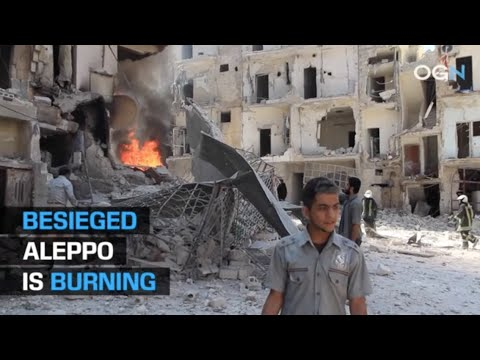
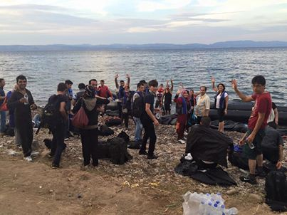
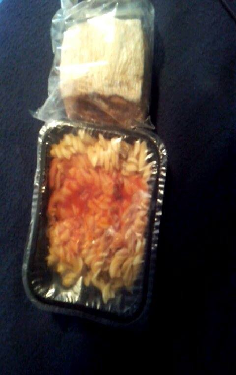

### AYS News Digest 6/9: Pervasive sense of abandonment

_As the number of people who are crossing Mediterranean increases, more dangerous situations are encountered by rescue teams\. Yesterday seven lives were lost at sea\. New research proves that Turkey is not safe place for refugees\. Warning from volunteers in Belgrade — Serbia could become a dangerous place for refugees\. French police used violence against people in camps, again\._

](assets/62f18d36e067/1*huTEBDSeBfHybr0AVfL5gg.jpeg)

“We are fighting for our future”\. For our country, ourselves and “human” word\. Credits: [**Through refugee eyes**](https://www.facebook.com/throughrefugeeeyes/?hc_ref=PAGES_TIMELINE&fref=nf)
### Syria

Once again, civilian lives are put in danger, while the siege of the Aleppo continues\. More has to be done to stop this war that is happening in the front of our eyes\.

### Mediterranean
### One of the toughest rescues at Mediterranean ever

[MOAS’ rescuer team](https://www.facebook.com/migrantoffshoreaidstation/posts/500003413521679:0?hc_location=ufi) reports about rescue of 354 people from 5 different vessels over the nigh\.

> “Refugees were crammed on board a sinking rubber boat\. Many of them were intoxicated by the fuel fumes leaking from the engine\. Out of panic, many people jumped from the boat, triggering chaos\.” 

Sadly, 7 people did not make it\. Their bodies were pulled on board of the Responder ship\.

> “This tragedy is yet another reminder of the need for alternatives to the deadly journeys in the Mediterranean\. Stop indifference and support safe and legal routes\.” 

#### Turkey
### Vulnerability Assessment of Syrian Refugees in Istanbul

Istanbul is the city with that hosts the highest number of Syrian refugees, around 500\.000 only from Syria\. New research, supported by Support to Life Association \(HDD, Hayata Destek Derneği\) pints out toward some of the needs of refugees in Istanbul, and warns about their bad position\.

Prof\. [Ayaan Kaya \(Istanbul Bilgi University\) and Aysu Kıraç \(HDD\) prepered an extensive report](http://researchturkey.org/vulnerability-assessment-of-syrian-refugees-in-istanbul/) , which warns about “anti\-immigrant, anti\-Arab, racist and xenophobic discourses” that have surfaced among the Turkish public\.

Furthermore, in the light of the current events in Turkey, and th government role in Syrian war, refugees are becoming closely linked with Turkish domestic politics and foreign policy\.

According to this report, the major problems of the Syrian refugees in Turkey are: exploitation in the labour market, the lack of Turkish language, discrimination in everyday life, lack of empathy among the locals towards their sufferings, stereotypes and prejudices generated by the locals, the lack of education facilities for the children, the lack of a proper legal status, the lack of the right to work legally, the lack of the right to health services, the lack of the right to housing, the lack of future prospects in this country, the lack of integration policies at central and local level, the lack of social and political recognition, respect, and acceptance, and the ways in which they are framed by the central state as “guests” are some of the problems they face in everyday life\.
#### Greece
### Boat report

One boat with 25 people, of whom 11 are men, 6 are women, and 8 are children, landed in the north\-east Lesvos around midnight\. They were found walking on the road passing Kapi Petro station\. Most of them have been already picked up by police\. It looks like more refugees are still walking and, therefore, land teams of volunteers are still searching for them\.

3 boats with a total of 107 people landed on Chios this morning\.
### Sign petition to allow Salam Aldeen, a volunteer punished for his humanity, to leave Greece

Salam Alden, from Denmark, who created Team Humanity that works to rescue people crossing the sea, is arrested with three other volunteers and criminally charged with human trafficking and jailed\. He is currently awaiting trial where can receive 10 years in prison\. Meanwhile, he continues with the daily tasks of Team Humanity, working in camps near Thessaloniki, as well as attending to those families who cannot live in camps for special circumstances\.

[The petition is initiated](https://www.change.org/p/council-of-the-european-union-allow-salam-aldeen-to-leave-greece?recruiter=129991170&utm_source=share_petition&utm_medium=facebook&utm_campaign=autopublish&utm_term=mob-xs-no_src-reason_msg) calling to the Greek government for Salam’s unconditional release\. Please, sign reminds the EU of the principles for which it was created\.

Photo by Team Humanity\.
### Full registration guide from RefuComm

Full registration, the next step in the process for applying for asylum, reunification or relocation in and from Greece, started from the September 1\. Full registration will guarantee you certain rights but will also change tour status in different ways\. Our friends from RefuComm gathered all necessary info in [an guide for refugees](https://www.facebook.com/notes/refucomm-communication-and-information-for-refugees/greece-mainland-full-registration-update-6th-september-2016/313859768965832?__mref=message_bubble) \.

There you will find all the info about what are tour rights, what is the process in the front of you, and local places where people will have to go for this next step\. You can find info in Arabic and English at their web site\.

If you did not yet pre\-registered, [please refer to their website](https://www.facebook.com/notes/refucomm-communication-and-information-for-refugees/greece-mainland-full-registration-update-6th-september-2016/313859768965832?__mref=message_bubble) for information on how to pre\-register\.

A frequently asked questions document which has been produced in conjunction with GAS and other information providers is [English](http://asylo.gov.gr/wp-content/uploads/2016/09/Qandanswers_ENG_Sep1_final.pdf) and [Arabic](https://drive.google.com/drive/fold...) \.

For more questions, ask [the Greek Asylum office](https://asylo.gov.gr/en) or a [RefuComm](http://www.refucomm.org) Representative\.

> If you have any questions about relocation, you can call the EASO hotline for more information\. If you are staying in the south of Greece \(near Athens\) call \+30 69 44 82 91 38\. If you are staying in the north \(near Thessaloniki\), call \+30 69 89 76 45 98\. The hotlines are open Monday to Friday from 09:00 to 17:00\. 

> **Important Information for the Iraq Nationals Relocation** 
 

> 
 

> Q13: I am from Iraq\. Can I be relocated?
 

> A13: Iraqis who have entered Greece before 20 March 2016 and have been pre\-registered until 16 June 2016 are eligible for relocation\. Iraqis who have entered Greece after 16 June 2016 will not be eligible for relocation\. Iraqis who entered Greece before 20 March 2016 and have been pre\-registered after 16 June 2016 might be eligible for relocation based on the date of entry of their police note\. 

> **Warning for the refugees** 
 

> Do NOT trust any third party to obtain faster appointment with the German Embassy in Greece\. Third parties promising such service do NOT work with with any external agency nor can they influence the visa issue\. Volunteers have reported several cases of fraudulent individuals who claim to work for the embassy and promise faster paperwork in exchange for 2,000–3,000 euro\. Refugees can book their appointment without any paid assistance, by writing to visa@athe\.diplo\.de 

### Volunteer testimonies from the Chios’ and, perhaps, Europe’s worst refugee camp: Vial

[**Testimony no\.1**](https://www.facebook.com/BevsTravels/posts/334112233591748?hc_location=ufi)

> What I’m witnessing here is so wrong, on so many levels, it takes my breath away\. After seven days of talking to refugees from a number of countries, I am saddened, angry, and sickened by what I see and what I hear\. The injustice of it all\. 

> Today I decided to brave a visit to the notoriously worst refugee camp in Chios: Vial\. It should be named Vile, because that’s what it is\. This is officially considered a “Hot Spot” — an administrative camp where people are first taken when they arrive to Chios\. It is also where refugees apply for asylum\. Think of it as a holding tank\. People are told to “be patient\.” So they wait three, four, five months waiting to even apply for asylum\. No dates are set\. “Your turn will come\. Be patient\.” It started off as an administrative center and has become a detention center… 

> I was escorted on the free bus from Soudra camp to Vial by my new Nigerian friend, Nelson\. A young man who fled Nigeria because after his father died and he inherited his land, his uncle tried to have him killed, insisting the land was his\. He showed me the scars on his leg from the machete… 

> It was a 45\- minute bus ride in extreme heat and little ventilation\. Although visitors are not allowed in the camp \(another military rule\), we entered through a torn fence near his “room\.” 

> His room was a metal container with “Hellenistic Petroleum” written on the side — the donor of the containers\. Unlike Souda, where people sleep on straw mats on wood floors, at least here there were bunkbeds\. Five bunk beds for 10 people — seven Nigerian men and three men from Sudan… 

> Time and time again I hear: if I only knew what it was going to be like here, I never would have come\. I can’t go home, because I have no home\. I’m stuck here — a prisoner here in Chios\. I’m young, but my life is over\. 

> Vial’s menu every day, EVERY DAY
 

> \*Breakfast: piece of Cake or Croissant and sweetened Orange Juice
 

> \*Lunch: Boiled Potatoes or Spaghetti with bread
 

> \*Dinner: Boiled Potatoes or Rice with bread
 

> \*Note: the potatoes and the rice are often not cooked soft enough to eat it, therefore the food often is being disposed by the refugees 

](assets/62f18d36e067/1*mEYmSXeCXuJagZL0s18Wnw.jpeg)

Daily breakfast, lunch and dinner at Vial\. Credits: [**Michael Söhner**](https://www.facebook.com/MichaelSoehner?fref=ufi&rc=p)
### The bare life of refugees at Softex camp

On several occasions, AYS warned about inhuman conditions in Softex camp\. UK daily the Guardian visited this place, and several other in Northern Greece reporting about “ [prisoners of Europe](https://www.theguardian.com/world/2016/sep/06/prisoners-of-europe-the-everyday-humiliation-of-refugees-stuck-in-greece-migration) ”, refugees who are agains their own will kept in these camps\.

> “Inside this windowless former warehouse, the lamps only work in the evenings\. That is partly because the place was not designed to house people\. It is part of what was a toilet paper factory\. “It’s insulting,” says Hendiya Asseni, a 62\-year\-old Syrian, of being housed in a one\-time loo\-roll store\. “But then everything here is insulting — the life, the food, the fact we have a toilet in front of our tent\.” 

The newspaper reports about 50,000 health danger that exist in many camps around Greece, [about 50 squalid camps](http://geochoros.survey.ntua.gr/ekepy/map) \. According to their investigation, at least seven camps are infested with snakes and scorpions, in some the mattresses are full of bed\-bugs\. Even basic health services are hard to come by\. Aid groups like the Red Cross are present during working hours at most camps, but the services they can provide are limited\. In serious cases, ambulances sometimes take too long to arrive and available medicine is also scarce\.
### **Tensions between refugees and locals**

Before the deportation deal with Turkey began, new arrivals to islands could move quickly to the mainland\. But since March, most newcomers have not been able to leave legally — while [deportations have largely failed to materialise](https://www.theguardian.com/world/2016/aug/31/turkish-police-withdrawal-greece-stalls-eu-migration-pact-unhcr) \. So the camps are overflowing, leading to tensions with some local residents\. On the tiny island of Leros, refugee campaigners were told to leave by a mob of angry islanders, while on Chios, [a dead rabbit](https://www.ft.com/content/53904e70-6b78-11e6-a0b1-d87a9fea034f) was left outside an activists’ kitchen\.
### Serbia
#### New danger for refugees in Serbia

Volunteers from Info Park in Belgrade reacted after, what they call, “a disturbing joint press conference of Victor Orban and Aleksandar Vucic, Hungarian and Serbian Prime Ministers in Belgrade”\.

On Monday, Orban was in an official visit to Serbia where he talked with his local government representatives about the economic cooperation, but the main topic of the meeting was refugee route\.

A number of the newcomers in Serbia has gone up from 2700 in mid July to more than 6000 today\. At the press conference, Vucic mentioned that 81% of the newcomers are Afghan economic migrants, emphasizing “the increasing cases of violence and robbery in the shopping malls”\. There is omnipresent fear among volunteers of radical actions from the authorities, including arrests and deportations\. Info Park stresses the importance of registration in Serbia, as it gives newcomers a chance to get accommodation and food, and a safety from aggressive measures\.

On the joint press conference, Vucic announced that the Hungarian border troops will soon be deployed to the Serbian Bulgarian border, equipped for thermal scanning and other hi tech operations\.
#### Germany
### Myth debunking: While the German authorities are playing with the idea of sending some people back to Greece, it is not happening yet

German Interior Minister Thomas de Maiziere announced that he wanted refugees to be returned from Germany to Greece, “in accordance with the Dublin Regulation according to which refugees should apply for asylum in the first EU country they enter”, [DW reports](http://www.dw.com/en/german-interior-minister-floats-idea-of-returning-migrants-to-greece/a-19525482) \.

It is just one sign of the increase of anti\-refugees sentiments in this country where ultra right Alternative for Germany party gain significant votes during the last elections for the state legislature in Mecklenburg\-Western Pomerania\.

However, deportations from Germany to Greece will not start before at least early next year\. It is also not yet clear exactly who will be deported, but it is clear who will not: German law states that anyone doing a vocational training course \(up to 3 years\) will not face deportation and anyone who holds a job will continue to avoid deportation \(for up to 2 years \) \.

Refugees who can provide for themselves can apply for permanent residency after 3 or 5 years — depending on their level of German — thus, likewise, preventing deportation\.
#### France
### Police, although unprovoked, firing teargas at refugees

Yesterday, police in Calais fired teargas at refugees, volunteers are reporting\. The reason was not obvious\. Refugees suggest that situations such as this one happen every few days\. Some refugees even smile and make videos with their phones\. Then they run\. Teenagers, who have nothing to lose\. And are bored\. The camp they call jungle\. But it looks more like a slum\. In the middle of Europe\.

](assets/62f18d36e067/1*5GGbwgzIY99StvUtKvxqdg.jpeg)

Credits: [**Kryz Unger**](https://www.facebook.com/kryz.unger)
### Belgium
### Support the 40km walk to raise money for refugees

Since Europe doesn’t let refugees to fly to safety, they often have to cover long distances on foot\. On the 2nd of October, the group of people who call themselves Jedis, will take part in the [_Refugee Walk_](http://acties.vluchtelingenwerk.be/projects/the-jedis) : a 40 kilometre solidarity walk to raise money for refugees\. The proceeds will go to the Startpoint of the Flemish Refugee Action where refugees are given a warm welcome, a bowl of soup and much needed information\.

Sponsor them and give refugees a warm welcome at the end of their long journey\!

### Norway
#### Norway builds Arctic border fence

Norway is building a 4m\-high fence along its Arctic border with Russia to prevent migrants entering the country\.

[_The Sunday Times_](http://www.theaustralian.com.au/news/world/the-times/norway-builds-arctic-border-fence-to-give-migrants-cold-shoulder/news-story/9c36230483d762c6caeb403f3122bfb2) was given access to the restricted border area around the Storskog crossing, about 399km into the Arctic Circle, where the fence is being built on the only road connecting the two countries\.

The move is part of a controversial overhaul of Norway’s asylum system, until now one of the most generous in the world, after more than 31,000 people from more than 50 nations sought ­asylum in the country of just five million people last year\.

The crossing cuts though a tranquil landscape of birch forests and pristine lakes\. The quiet of the Arctic autumn is disturbed only by the sound of diggers and heavy equipment\.

Stein Kristian Hansen, superintendent of the Norwegian border police, said the fence would allow him to lock down the border crossing area in case of emergencies such as that in November when thousands of migrants ­arrived on bicycles, using a legal loophole that bans travellers crossing on foot\.

_Converted [Medium Post](https://areyousyrious.medium.com/ays-news-digest-6-9-pervasive-sense-of-abandonment-62f18d36e067) by [ZMediumToMarkdown](https://github.com/ZhgChgLi/ZMediumToMarkdown)._
