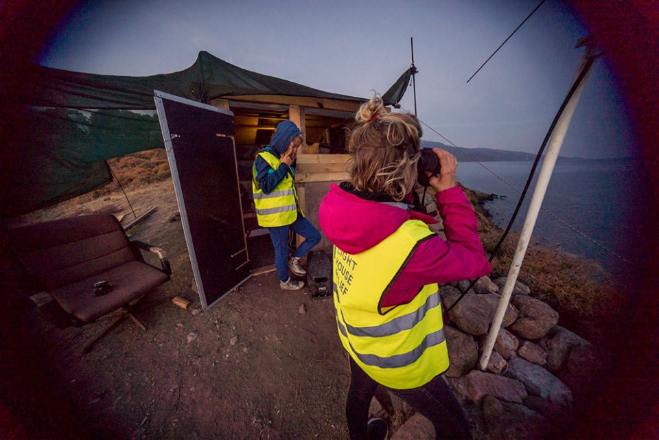
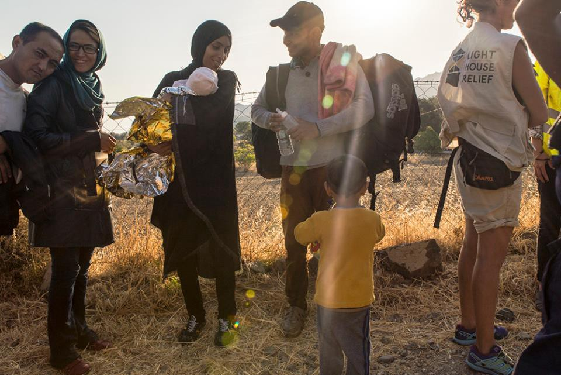
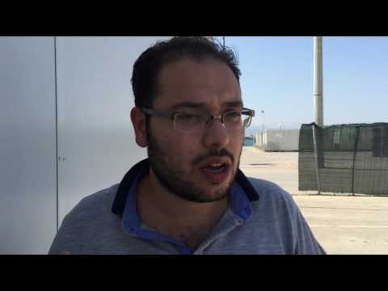
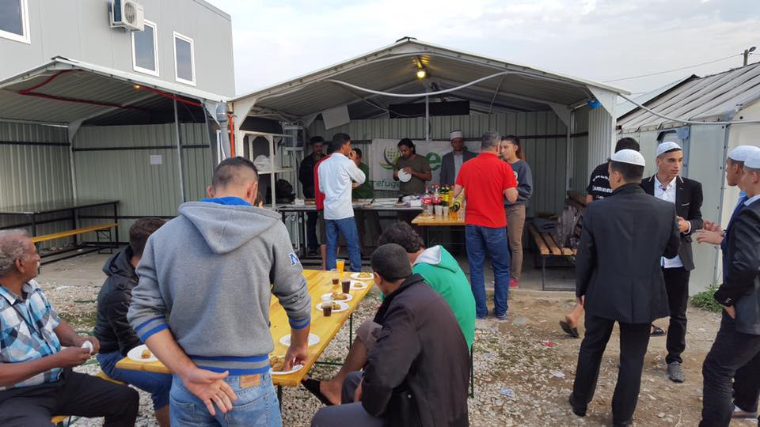
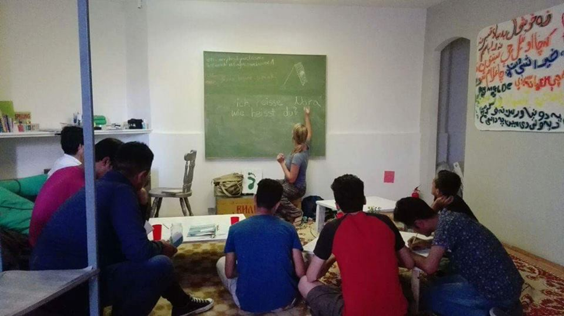
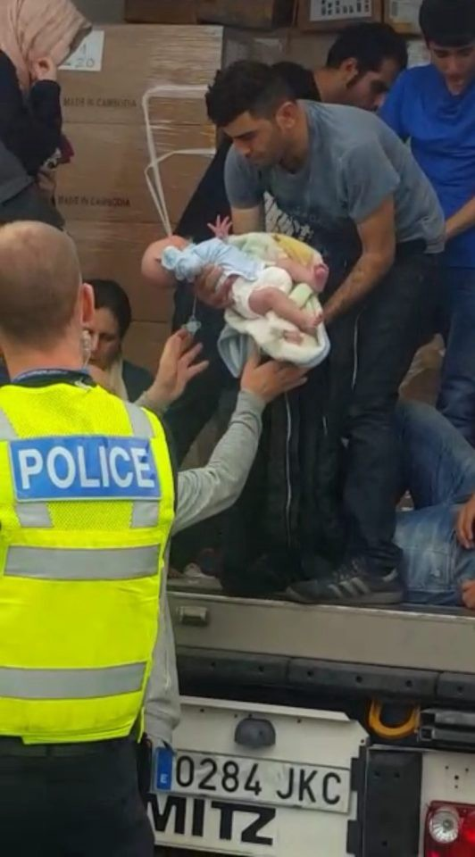

### AYS daily 12/09: Thousands rescued in the Mediterranean over the weekend

#### General
### **3400 people rescued in Mediterranean over the weekend**

This weekend saw the another surge of rescues in the Mediterranean, with 3400 people saved in just two days\. These rescues form part of a wave of migrations that began in August and is still ongoing\.
### **Healthy baby boy born on board of the rescue ship**

To make these numbers more real, we would like to share a statement from MSF, whose staff has delivered a healthy baby boy onboard one of the rescue ships:

“A healthy baby boy was born today on board MV Aquarius, a search and rescue vessel run in partnership between MSF and SOS Mediterranee\. He was born at 7:00 am ship’s time in international waters to Nigerian parents, who have called him Newman Otas\. His parents, Otas and Faith, and older brothers Victory, seven, and Rollres, five, were rescued from an overcrowded rubber boat 24 hours previously\.”

Welcome Newman Otas\! Photo: MSF
#### Syria
### **No help for Syrians waiting on humanitarian aid**

As Russia, the United States and others brokered a ceasefire deal on the 9th of September, humanitarian aid organizations state that they need more real assurances in order to help inside the besieged areas where UN estimates over half of million people are in dire need of help\. These organizations are still reluctant to enter with the Red Cross, stating that “fundamentally, action must follow on from these decisions and pledges so that humanitarian agencies… can safely access communities and assess and respond to their needs, in an independent and impartial manner\.” For more responses from humanitarian aid organizations, follow this [link](http://bit.ly/2cg763O) \.
### **Crowdfunding campaign for medical aid destined for Syria**

Refugee Aid Network and One Ummah are crowdfunding money to send a container of medical aid and supplies to Syria\. For more information on action and donations, follow this [link](http://www.refugeeaidnetwork.org.uk/) \.
#### Greece
### **93 new arrivals on Greek islands**

The official number of new arrivals to Greek islands as of 8:00 o’clock A\.M\. is 93, but during the day volunteers reported much more activity that will be reflected in tomorrow’s official statements\. The volunteers in Lesvos would like to thank the rescue teams, saying that today they were more prepared than usual\. Due to the religious holiday, it had been expected expected that Turkish controls would loosen up a bit and more people would be able to set sail\. Volunteers in Lesvos received a group of 72 people, among whom were many children who arrived on a dinghy\.

They warn that with the winter months approaching, crossings will only become more difficult and dangerous\. More resources, as well as more vigilance from the people on the Greek side, will certainly be needed\.

New arrivals to Lesvos\. Photo: Light house relief

If you are able to help, please donate to some of the teams working on the islands such as Lighthouse Relief\. For donations follow this link : [http://bit\.ly/2cayo8U](http://bit.ly/2cayo8U) \. Also, they are calling for volunteers in Skala Sikaminias, so if you are interested and able, [check them out and apply](http://bit.ly/2cmQi7W) \.
### **Overcrowding in camps on the islands**

With new arrivals coming every day, many shelters on the islands have once again become overcrowded\. Sometimes there are almost two times more people than the official capacity\. Currently, there are approximately 13,080 people are living in camps whose capacity is only 7450\. As Ekhathimerini news reports, “Thousands of migrants have been cooped up in overcrowded reception centers on the Aegean islands for weeks or even months awaiting a decision on their applications for asylum\.”

This situation has sparked prompted unrest at the reception center in Kos today\. It seems that a group of young men started burning mattresses in protest\. Fortunately, the fire was put out immediately and nobody was injured\. There are reports of another protests against living conditions and detention in camps in Greek islands; one was held in Moria, as reported by Lesvosnews\.gr\.
### **Life in the camps is nothing but dust, containers and concrete**

If you are curious to see how exactly people live in camps inside Greece, take a look at this video of conditions in Skaramangas camp:

If you’d like to help make these conditions more habitable, please that donate to the organization that has made this video [through their crowdfunding campaign](http://bit.ly/2bNxwXx) \.

More news from Skaramangas: it is being governed by the Ministry of Migration Policy and we have received a statement from a volunteer saying that if you wish to enter as a volunteer you have to request official permission\. Moreover, if refugees wish to gain access to the camp in order to get help and necessities, they also have to register\.
### Urgent call for a report on \(non\) educating children in Greece

While school has started, many still do not have access to it\. Please, if you have any information on the violation of this fundamental right to education, which all children should enjoy, contact Electra on FB [Electra Leda Koutra](https://www.facebook.com/electra.koutra) or via e\-mail \(electrakoutra@yahoo\.gr\) \.

A report on these violations is being drafted\.
### **LGBT safe space in Athens**

In more constructive news, if you are or know a LGBT friend that needs a safe place to learn English or do some other activities in Athens, check out this Facebook page: [LGBT Refugees Athens](https://www.facebook.com/LGBTrefugeesathens/?hc_location=ufi) \.
### **If you have an interview scheduled, UNCR can transport you**

Also, if you have received an invitation to an interview for asylum in Greece, you can contact UNHCR and they will provide transport\. This was reported by Mobile Info Team for Refugees and we would love to receive info whether or not it really works\.

If you have lost track of the locations of Greek camps, follow [this link](http://bit.ly/2c4DakQ) in order to download a UNHCR map of camp sites\.
#### Macedonia
### **Celebrating Eid**

Organization Legis has posted pictures of celebration of Eid today in Macedonia\. Take a look:

Photo: Legis
#### Serbia
### **German lessons in Belgrade**

Some useful news and nice news coming from Serbia today\. The first German lesson in the Daily center for refugees were held today in Belgrade in Jug Bogdanova 17B\.

Photo: Refugee foundation Serbia
#### Italy/ Switzerland
### **Protest on the border**

With the Italian and Swiss border becoming increasingly difficult to cross, clashes between the No Border Group and the police in Chiasso broke out yesterday afternoon\. A group of people gathered to protest against the policy of ejecting migrants from Switzerland\. The crowd, about 250 people from Switzerland and abroad, as reported by police, walked to the city centre, with a stop at the international station, where protests threw paper bombs and smoke bombs\. The group then moved to the border\.
#### France
### **University of Lille offering a number of scholarships for those stuck in the Jungle**

We also have some good news from France\. It seems that the University of Lille has stepped up and come to the Jungle in Calais, offering a certain amount of university scholarships for refugees\. As one of the people stranded in the jungle has stated: “I hope all of the colleges do that\.” We join him in this hope\.
### **Dunkirk refugee center for women needs help**

In other news from France, Dunkirk refugee center for women is asking for donations to celebrate Eid\. If you can help, please follow the [link](https://www.facebook.com/events/178760525882678/) \.
### **More migrants on the streets of Paris**

Also, volunteers are reporting from the streets of Paris where they claim more women and children are sleeping in the Jaurès area\. For a complete report, turn to this [link](http://bit.ly/2cS3MYd) \.
#### U\.K\.
### **Religious leader urging U\.K\. government to be more humane and prevent tragedies by allowing family reunification**

More than 200 religious leaders in U\.K\. have urged their government to receive those trying to reunite with their families in U\.K\. and thus avoid more tragedy\. The letter says, as BBC reports: “Under the present immigration rules, a British doctor of Syrian origin could not bring her parents from a refugee camp in Lebanon — even though they were refugees and she could support and house them\. A Syrian child who arrived alone in the UK could not bring his parents from a refugee camp in Jordan — even if the child were recognised a refugee and even though his parents were themselves refugees\.”

Families of refugees, they add, “can currently be reunited only by resorting to desperately unsafe irregular journeys, sometimes ending in avoidable tragedies”\. For more on the statistics, as well as British government representatives’ calculated response, follow the [link](http://www.bbc.com/news/uk-37328151) \.
### **Britain’s smallest immigrant**

Also, just to highlight the insensitive arrogance of the U\.K\. government, today a 20\-day\-old baby was fortunately saved from the back of a lorry where people had snuck into to cross into English territory\. The papers are calling her “Britain’s smallest immigrant\.”

_Converted [Medium Post](https://areyousyrious.medium.com/thousands-rescued-in-the-mediterranean-over-the-weekend-e34e68fbc67b) by [ZMediumToMarkdown](https://github.com/ZhgChgLi/ZMediumToMarkdown)._
