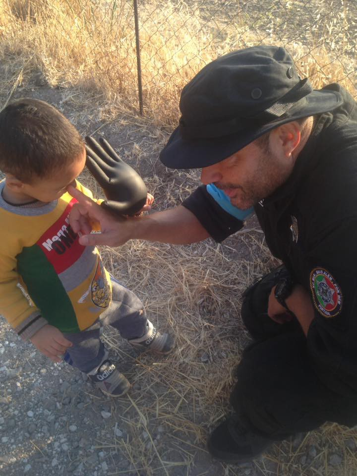

### AYS NEWS DIGEST 13\.09\.2016: Speed up, Europe\! Winter is coming

_More than 60,000 refugees stranded in Greece while the country is struggling with decisions, finances and divisions\. Back to school — not for everyone\! UNHCR urges speeding up the registration of candidates for relocation\. Refugees drown in Danube\. Foreign minister of Luxembourg suggests expelling Hungary from the EU\. Horrible conditions in Italian ‘welcome centre’\. French planning to close Calais and relocate its residents in France\. Pressure from all sides ahead of the New York UN Summit_

Photo: Through Refugee Eyes
#### **AFGHANISTAN**
### Afghanistan overwhelmed as refugees return from Pakistan

As many as 5,000 refugees are forced to return each day from Pakistan\. UN’s earlier estimates were around 400,000 internally displaced people, but the reality will include 600,000 more people than the UN’s Humanitarian Response Plan projected for this year, [Irin](http://www.irinnews.org/news/2016/09/13/afghanistan-overwhelmed-refugees-return-pakistan?utm_source=dlvr.it&utm_medium=twitter) states\. The current government is facing political infighting, an economic collapse, and insurgencies on multiple fronts\. It will need all the help it can get to deal with the ever\-growing number of Afghans with nowhere to live\.
#### MEDITERRANEAN

**294,450** migrants and refugees entered Europe by sea in 2016 through 12 September, arriving mostly in Greece and Italy, where 126,931 migrants or refugees have arrived during 2016, according to the IOM [report](https://www.iom.int/news/migrant-arrivals-mediterranean-reach-294450-deaths-sea-3207) \.

**3207** refugee deaths in the sea have been documented by IOM’s [Missing Migrants Project](http://missingmigrants.iom.int/) , including at least nine bodies washed ashore off Libya last week, as reported by Libya’s Coast Guard\.
#### GREECE
### 60,042 refugees were in Greece today\.

143 new arrivals were documented this morning on Lesvos, while Chios received 40 refugees and is currently housing more than 3 times more guests than it has capacities\. Later, during the day, north of the Aegean island of Samos 49 refugees were saved in a search and rescue operation following a call to emergency services\.

Greek islands were officially hosting **13171** refugee on Tuesday morning, according to the data provided by the Greek government\.

One of the boats that arrived this morning had 29 children abroad\. One of the Portuguese Frontex officers made sure to bring back smiles on their faces with hand glove balloons\. \(Photo: Isabel Cardenas Rodriguez\)
### **Tensions among politicians following those among refugees**

Odysseas Voudouris, the general secretary for refugees in the Interior Ministry resigned today\. Voudouris criticized Migration Policy Minister Yiannis Mouzalas over the handling of the refugee crisis, accusing him of not implementing regulations aimed at improving the management of reception centers\. 
In related development to the recent protest on Kos, island that hosts 1540 refugees at the moment, European Justice Commissioner Vera Jourova on Monday urged Greece to improve conditions for 1,500 unaccompanied migrant children\.
### **Parents against education for everyone?**

Last week, parents of the children at the 1st Primary School in Oraiokastro took an unanimous decision not to allow refugee children enroll ‘their’ school\. This Tuesday, the same happened at another school in the area \(the 5th Primary school\) \.

Even though the refugee children are yet to start school by the end of this month, the parents association has said its members would occupy the building in protest if refugees from nearby camps are allowed to attend lessons\.

“Fortunately this is the reaction of a very small minority of parents,” Education Minister Nikos Fylis said, adding that health concerns were “unjustified” as an immunization program is included in the school integration scheme, [Ekathimerini](http://www.ekathimerini.com/211998/article/ekathimerini/news/migration-official-quits-amid-fears-over-tension) reports\.

First day of school in Athens \(Photo by Eiman, Afghanistan\)

Photo: Refugee Accommodation Space City Plaza

> „Yesterday marked an important day for all children, but it’s even more important for the children living in Refugee Accommodation Space City Plaza\. For the children who arrived in Greece, running away from war and wretchedness, the first day of school in not only a landmark in their education, but it is also a landmark for starting a new life in another society\. In spite of the problems in some of the schools \(which must be overcome by the end of the week\), yesterday, the bell also rang for refugee children\. Those who have fought and are fighting for the equitable social integration of refugees cannot but be satisfied\. We mustn’t, of course, forget that the struggle for education and for the avoidance of marginalization of refugee children has only just begun\. A difficult struggle, made even more difficult due to the exclusion of refugee children living in detention centers, and due to staff shortages and lack of funding in the education system\. Yet we will fight this fight with determination and boldness\. 

> We live together, we struggle together, we will win together\!“ 

### **Making progress — day by day**

[Elpida](https://medium.com/@AreYouSyrious/ays-special-elpida-humanity-dignity-and-community-ad03b19f8950#.9elbve5gw) Home which currently hosts 200 refugees in a converted warehouse invited **Hot Food Idomeni** to set up their first communal kitchen\. 30 families are cooking for themselves at 12 kitchen stations and the HFI team is currently in the process of setting up a Farmers Market or Free Shop to serve this lively kitchen\. The home will eventually house another 600 people and they plan to provide enough kitchen space for everyone\.

[**InterVolve — International Volunteers**](https://www.facebook.com/InterVolve-International-Volunteers-219418945063168/?hc_ref=PAGES_TIMELINE&fref=nf) are preparing for winter months\. Just as they are about to finish working on their storage ‘boutique’ in Softex, they also announce and remind that they are in a need for help\. If you can contribute, here is [the list](https://drive.google.com/drive/folders/0B1nwHRSdkNdZcWNUdWEzN3hoUms) of useful donations\.
#### **Commentary: With funding, infrastructure, and a stable government, why are we failing refugees in Greece? — doubts of an [aid worker](https://www.theguardian.com/global-development-professionals-network/2016/sep/13/secret-aid-worker-greece-has-exposed-the-aid-communitys-failures)**

> If any response has called into question whether the humanitarian sector is still fit for purpose, it’s the response to the refugee crisis in Greece\.
 

> When it comes to our shortcomings, we have become very comfortable with, and rely upon the shopping list of excuses that we find ourselves using in Haiti, Afghanistan, Iraq, the Democratic Republic of Congo and the other contexts we’re flown into\.
 

> But in Greece we are without the humanitarian excuse list to fall back on\.
 

> In Greece the aid community is being exposed\. Our exposure is further compounded when we are unfavourably compared to organised and efficient groups of volunteers who work with less and achieve more\. 

#### BULGARIA

The Bulgarian border police have found the bodies of two Iraqis — a young man and a boy — who drowned while attempting to cross the River Danube to Romania by boat, while four other people, including children, are considered missing\. It remains unclear, according to [Balkan Insider](http://www.balkaninsight.com/en/article/two-migrants-drown-in-the-danube-river-four-others-missing-09-13-2016-1) , why the accident was not announced publicly in the period from Thursday, when six people including four children reportedly went missing, to Sunday, when the two dead bodies were discovered\.
#### SERBIA

Hot Food Idomeni decided to offer their help to the Miksaliste Centre which is situated near to the bus station in Belgrade\. It provides a drop in center for information, social welfare, basic medical referral, food and NFI distribution, mainly focusing on families, women and children including unaccompanied minors\.

> We are currently serving up to 500 freshly cooked meals a day there with a team of 5 or 6 and will maintain and expand this mission as necessary throughout the winter\. 

In the meantime, first news of possible pushbacks to Serbia are reaching us, as more and more people are waiting in Serbian camps to get on the waiting lists for later possibility of passing through Hungary, with a lot of uncertainty and in poor conditions\.
#### EU — HUNGARY
### Red card for Hungary?

Tuesday’s edition of Die Welt newspaper carried an interview with the foreign minister of Luxembourg, Jean Asselborn, in which he called for Hungary to be “temporarily, or in the worst case, permanently” excluded from the European Union, [Deutsche Welle](http://m.dw.com/en/luxembourg-foreign-minister-calls-for-hungary-to-be-booted-from-eu/a-19546637) reports\. Criticized from many sides, Hungary holds onto to their [propaganda](https://www.hrw.org/news/2016/09/13/hungarys-xenophobic-anti-migrant-campaign) and policies towards the people fleeing war\. Asselborn said refugees are being treated “nearly as bad as animals” and that anyone hoping to breach Hungary’s “ever longer, ever taller” fence may face the worst\.
### Rearranging EU finances

To compensate for the higher expenses on migration and jobs, the [EU agreed](http://www.ekathimerini.com/211983/article/ekathimerini/news/eu-to-slash-funds-to-eastern-europe-to-step-up-migration-budget) to cut other spending and slash funds destined for the least developed regions of the bloc\. Eastern European countries accepted the proposed budget as it also includes spending reductions in several sectors, including agriculture and research\. As we reported earlier, European Commission proposed to increase funds to address the migrant crisis in the EU and this budget for 2017 was fully backed by EU governments\.
Hopefully, this seemingly clear supportive attitude towards the refugees will reflect also in the decisions of the EC and actions taken by all of the member states alike\.
### ITALY
### Horrible conditions in Italy’s third largest reception centre

An Italian journalist spent a week at Cara di Borgo Mezzanone close to Foggia in the south of Italy, a reception centre for asylum seekers, third one in size in Italy and wrote a journal under the title: „ [Seven days in hell](http://espresso.repubblica.it/inchieste/2016/09/12/news/sette-giorni-all-inferno-diario-di-un-finto-rifugiato-nel-ghetto-di-stato-1.282517) “\.
In it he stresses out the financial facts: “this place receives a significant amount of money from the state: 22€ per person, that makes 14,000€ every 24 hours\.” Similar to some Greek camps, the police and army officials don’t move from the entrance premises and in the week he spent there \- he hasn’t encountered a single one of them\. Girls, women and children are afraid to go to the bathroom alone, most of the young people seem afraid even when they are sleeping\. 
The camp itself is supposedly closed, there is no emergency exit for an estimate of about 1,000 people staying in the camp, but through illegal holes anyone can come in\. And they do\.
In a long text that elaborates the life there in detail, calling it hell, he [states](http://www.repubblica.it/politica/2016/09/13/news/rifugiati_il_governo_fermi_l_inferno_del_cara_di_foggia-147661762/?ref=drnh7-1) openly:

> „The refugees should be assisted with competence and sensibility and not like that\. The president and the Council must provide an immediate inspection in there\.“ 

#### FRANCE
### Plans to close Calais and resettle its residents

A silent plan of distribution and housing of around 12,000 refugees from the Calais Jungle has been revealed by the French newspaper [Le Figaro](http://www.lefigaro.fr/actualite-france/2016/09/12/01016-20160912ARTFIG00252-le-plan-du-gouvernement-pour-repartir-les-migrants-de-calais-dansles-regions.php?redirect_premium,) \. According to their findings, these people, most of who didn’t come there with the intention to stay in France, but would rather join their families or friends in the UK, will be resettled in the so called reception and orientation centres around France, excluding the Paris area that is, along with Calais, one of the focal points of the refugees\.

Refugee Women’s Centre, a safe space for the women and children of La Linière refugee camp in Dunkirk, northern France, is looking for volunteers\. Their current volunteers are leaving in a month time and all women volunteers willing to join them can contact [sarah\.benabou@hotmail\.fr](mailto:sarah.benabou@hotmail.fr) or [refugeeswomenscentre@gmail\.com](mailto:refugeeswomenscentre@gmail.com)

Photo: Kitchen in Calais
#### UK
### [Solidarity with Refugees](https://www.facebook.com/Solidaritywithrefugees/) invite everyone to a march of solidarity with the refugees

Many British people have responded to the tragedy they see unfolding on their doorstep with extraordinary displays of humanity and generosity\. 80% of Britons want their government to do more to help\. Polls now show that 1 in 4 of Brits would welcome a refugee in their own home\. 
 We want to tell the government that we are waiting to help\. The UK should be leading the way and working with other states to give refugees safe, legal routes to asylum, ending the trade in people smuggling\.

> Last year, in the week of our demonstration, the government agreed to resettle 20,000 Syrian refugees\. We know that public pressure can make a difference\. So save the day to help refugees on September 17th: [Join us](https://www.facebook.com/events/1563121147327378/) and make your voice heard\! 

### UN
 
World leaders and the responsibility on refugee crisis

Ahead of the upcoming UN Summit that will take place on September 19 in New York, expectations, hopes and anticipations are many\.
From [petitions](https://act.one.org/sign/education_refugees_int/) calling for greater responsibility for the children’s future in regards to education to [initiatives](https://www.thunderclap.it/projects/46845-america-welcomes-refugees) urging the American congress to pass the legislation that would enable funding to protect refugees in the US and overseas\.
The American president Obama used the opportunity while congratulating the Muslim holiday of Eid al\-Adha to remind the American people of their commitment to welcome the stranger with empathy and open heart, [calling for acceptance of refugees](http://www.washingtontimes.com/news/2016/sep/12/obama-marks-muslim-holiday-call-accept-refugees/?utm_source=RSS_Feed&utm_medium=RSS) \.

Syrian girl in a refugee camp, cleaning her shoes to wear them for the feast of Eid \(Photo: Mohamad Hadi Almadani\)

UN Secretary\-General Ban Ki\-moon had proposed a Global Compact on Refugees that would have asked governments to commit to welcoming 10% of the world’s refugees annually\.
However, member states stripped the UN proposals of any substance, making sure there was nothing obligating them to take in specific numbers of people\. 
The Global Compact on Refugees will now not be agreed before 2018\. Instead, states will issue the “New York Declaration” with token commitments but bereft of concrete responsibility\-sharing measures, Amnesty International [claims](https://www.amnesty.org/en/latest/news/2016/09/world-leaders-have-shirked-responsibility-on-refugee-crisis/?utm_source=twitter&utm_medium=quote&utm_term=World+leaders+have+completely+failed+to+agree+a+plan+to+protect+the+world%25u2019s+21+million+refugees&utm_campaign=social) \.
#### GENERAL
### Relocation — now

At the press conference held this Tuesday in Geneva, the [UNHCR](http://www.unhcr.org/news/briefing/2016/9/57d7bf1b4/unhcr-urges-european-states-increase-pledges-pace-expand-relocation-asylum.html) spokesperson urged European States to increase pledges, pace and expand relocation of asylum\-seekers\.

4776 asylum\-seekers have been relocated from Greece and Italy, only

Based on nationalities of those pre\-registered there are around 19,000 persons who could be eligible for relocation in mainland Greece\. UNHCR encourages the Greek Asylum Service to further speed up the registration of candidates for relocation\.

UNHCR is calling on States to increase pledges, including for unaccompanied and separated children, speed up the registration and transfers of candidates, and for more nationalities fleeing war and persecution to have access to the scheme\. They are also calling upon the EU and Member States to revisit the eligibility criteria by lowering the threshold for relocation candidates to include additional nationalities likely in need of protection\.
### **Recognizing qualifications held by refugees — applying, studying, working**

Many refugees bring with them competencies and skills acquired through studies and work experience in their country of origin and intend to seek opportunities to commence higher education, continue further studies and join the labour market\.
European Network of Information Centres in the European Region and National Academic Recognition Information Centres in the European Union have some [**advice**](http://www.enic-naric.net/recognise-qualifications-held-by-refugees.aspx) on what you can do if you should receive an application from a refugee with or without documentation of the qualifications obtained\. 
 If you are a refugee looking to continue or start education, find a job in your field etc\., you can find detailed information on policies and procedures for the recognition of qualifications held by refugees, information about university and post\-secondary non\-university education and other information in the special section for each of the countries with contact information to reach the institution of your interest\.

_Converted [Medium Post](https://areyousyrious.medium.com/speed-up-europe-winter-is-coming-dd80587a74dd) by [ZMediumToMarkdown](https://github.com/ZhgChgLi/ZMediumToMarkdown)._
