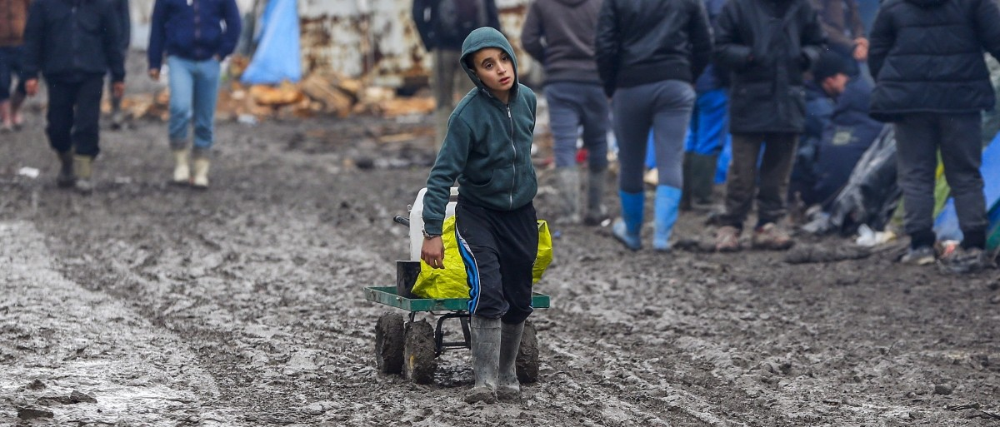
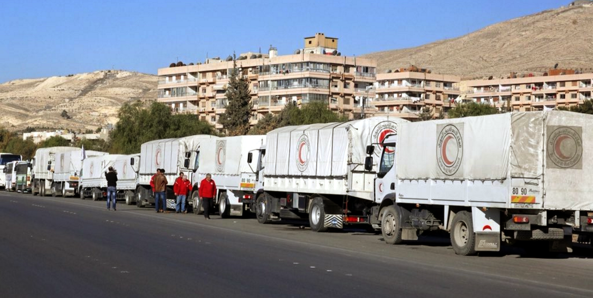
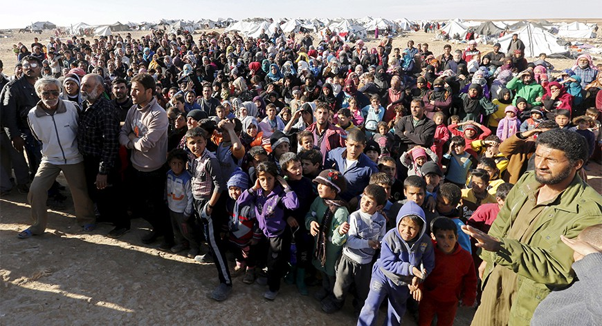
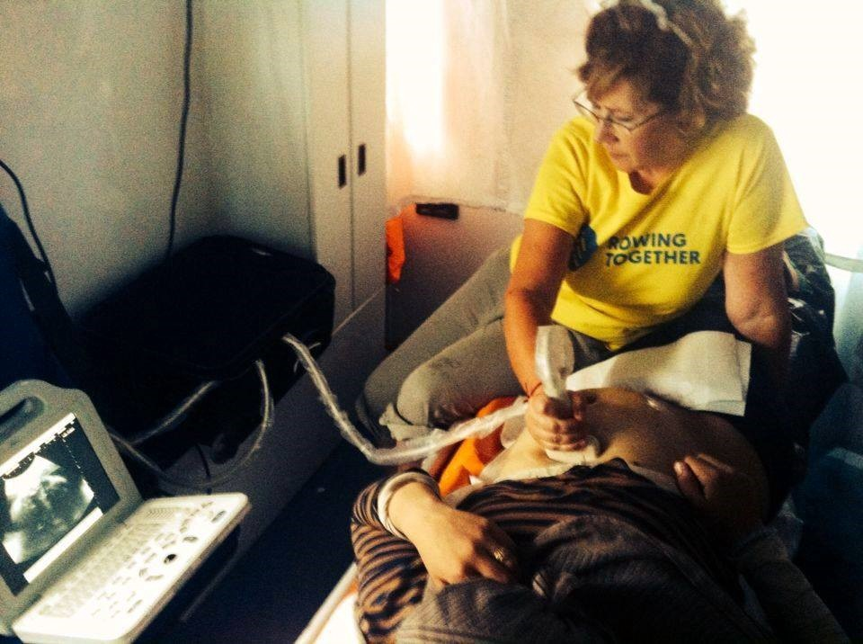
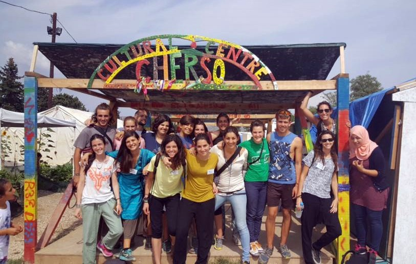
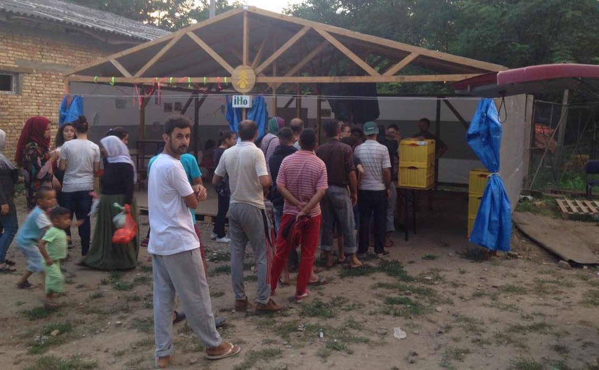
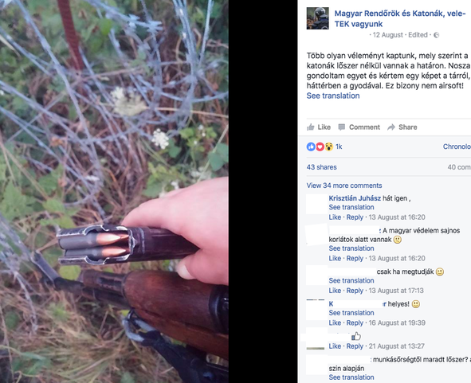
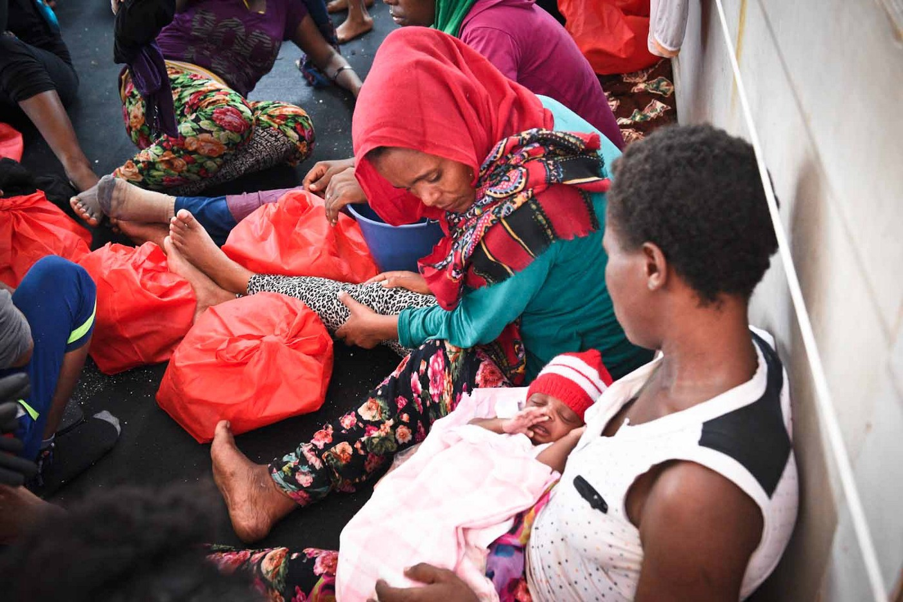
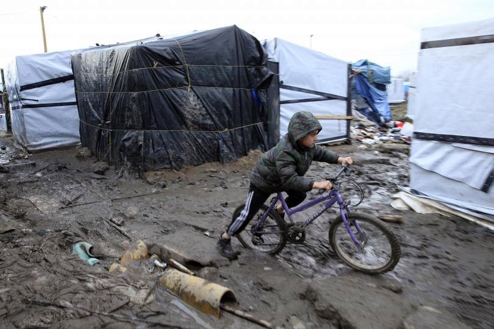
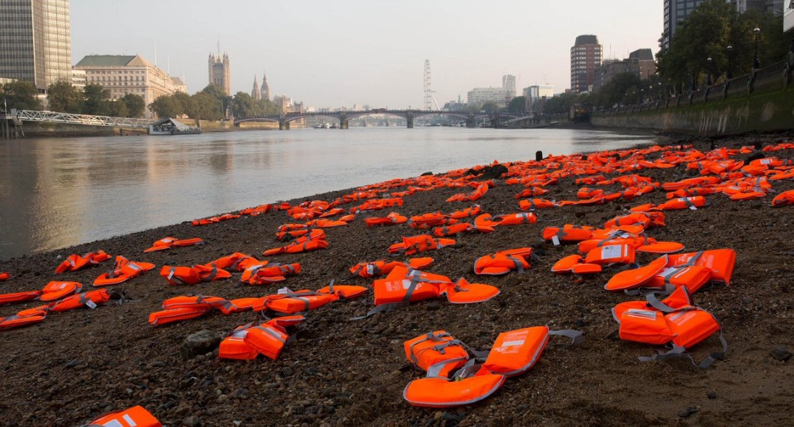

### AYS digest 15/9: What what will become of unaccompanied minors in Calais?
#### Assad forces block aid delivery to Aleppo\. 75,000 refugees trapped on Syria\-Jordan border\. New anti\-refugee riots expected on Chios\. Extremist militias patrolling Hungarian border\. UK Foreign Secretary says EU should turn back refugee boats from Italy\. MSF issues a warning about plans of further dismantling of Calais camp\.

#### SYRIA
### Assad forces block aid delivery to Aleppo, “peace deal” might trigger a new wave of the refugees

The aid delivery to rebel\-held eastern Aleppo, where about 300,000 people are living under siege, is still blockaded by government forces\. Across Syria 19 towns are still without humanitarian assistance, according to the UN, that amounts to some **600,000 people who are in dire need of food and medical assistance** \. Only a week after [73 Syrian aid groups have stopped their cooperation with UN](https://medium.com/@AreYouSyrious/ays-digest-73-syrian-ngos-have-stopped-cooperation-with-un-d966a1c40234#.qe4ixipzk) , explaining how Syrian government in Damascus has a significant influence on the performance of UN agencies and their partners, the [UN has called on the Syrian government](http://www.aljazeera.com/news/2016/09/syria-urges-government-aleppo-aid-trucks-160915084635557.html) to “immediately” allow life\-saving aid into eastern Aleppo\. While the “big players” such as UN, but also American and Russian governments, debate over the Syrian issue, people are dying not only from bombs, but also of food deprivation and lack of basic medical support\. In our recent report, we have mentioned the alarming increase of teen suicide attempts in the besieged city of Madaya\.

Convoys of aid waiting in no\-man’s land for permission to travel onwards towards Aleppo\. Photo: Mete Sohtaoğlu

Despite the alleged ceasefire, Syrian Observatory for Human Rights reports on [military operations on multiple locations](http://www.syriahr.com/en/?cat=26) , including Aleppo province and Homs\. In an [important article](https://www.alaraby.co.uk/english/comment/2016/9/14/scratching-the-surface-of-syrias-ceasefire) published in The New Arab, our colleague Sam Hamad elaborates on the fragile ceasefire and how it looks on the ground\. According to our estimations, there is a possibility of a whole new wave of movement as a result of this “peace deal”, as Assad\-Iran\-Russia will be looking for depopulation of all rebel strongholds\. US turned down Turkey’s offer of a safe zone in the North, using the area seized from Daesh\. So where else will the people cleansed from rebel areas go? how can Idlib, for example, take most of the remaining population of Daraya with so little resources and with the chance of it being cleansed or attacked extremely high?
#### JORDAN
### 75,000 refugees trapped in desert no man’s land in dire conditions, Amnesty international warns

[Video footage](https://adam.amnesty.org/asset-bank/action/viewAsset?id=232528) and [satellite images](https://adam.amnesty.org/asset-bank/images/assetbox/6c1c3b2d-2df7-4be5-b093-72675f60eb65/assetbox.html) showing makeshift grave sites and burial mounds offer a rare glimpse inside a desert no man’s land between Jordan and Syria where tens of thousands of refugees who have been virtually cut off from humanitarian aid for two months are stranded, said Amnesty International\. The video footage was obtained from [Tribal Council of Palmyra and Badia](https://www.facebook.com/%D9%85%D8%AC%D9%84%D8%B3-%D8%B9%D8%B4%D8%A7%D8%A6%D8%B1-%D8%AA%D8%AF%D9%85%D8%B1-%D9%88%D8%A7%D9%84%D8%A8%D8%A7%D8%AF%D9%8A%D8%A9-%D8%A7%D9%84%D8%B3%D9%88%D8%B1%D9%8A%D8%A9-1299824710081548/?hc_ref=PAGES_TIMELINE&fref=nf) , which has a network of activists operating inside the area known as the berm, and independently verified using satellite imagery\.

Syrian refugees stuck at the Jordanian\-Syrian border wait to cross into Jordan in the Hadalat area, Jan\. 14, 2016\.

Fresh accounts gathered by the organization, paint a desperate picture of human suffering and highlight the tragic consequences of the world’s failure to share responsibility for the global refugee crisis\. Next week, world leaders will gather in New York for [two high\-level summits to discuss refugees](https://www.amnesty.org/en/latest/news/2016/09/world-leaders-have-shirked-responsibility-on-refugee-crisis/) \.
#### REFUGEE RIGHTS
### UNHCR says 3\.7 million of the 6 million school\-age children under its mandate have no school to go to

UNHCR, the UN Refugee Agency, released [a report](http://www.unhcr.org/news/press/2016/9/57d7d6f34/unhcr-reports-crisis-refugee-education.html) today showing that more than half — 3\.7 million — of the 6 million school\-age children under its mandate have no school to go to\.

> **1\.75 million refugee children are not in primary school and 1\.95 million adolescents are not in secondary school, the report found\. Refugees are five times more likely to be out of school than the global average\.** 

“Refugee education is sorely neglected, when it is one of the few opportunities we have to transform and build the next generation so they can change the fortunes of the tens of millions of forcibly displaced people globally”, said Filippo Grandi, UN High Commissioner for Refugees\.
#### GREECE
### Important info for refugees now on youtube

Refucomm has uploaded [informative films and audio files](https://www.youtube.com/channel/UCgxoiWtizRFBdJhInUeNllw) to Youtube, for refugees who don’t read or don’t understand English\. The films are available in Arabic and Farsi, with Urdu coming in the next few days\. They inform about the registration process, asylum interview and other important topics, so please share the link to those who might need it\!

**No new arrivals to Greece were reported by volunteer teams** , but government numbers say 21 new refugees were registered on Kos today\.
### New right\-wing riots expected on Chios

Last night’s protests attrasted 800 residents who rallied against the refugees\. Photo: Euronews

Following yesterday’s right\-wing riots on Chios, when riot police had to intervene to keep a crowd of 800 people from approaching two refugee camps, new protest is announced for Friday, 16th of September\. Volunteers on the ground say the same group of thugs leads all the extremist riots, but they have never seen any of them arrested, while several volunteers were taken in to police station yesterday after trying to prevent the mob from approaching the refugees in Souda camp\. Both volunteers and refugees are adviset to try to remain calm and not engage in potential conflict\. You can find a disturbing volunteer report from yesterday’s demonstrations [here](https://www.facebook.com/izzy.ellis/posts/10153952037268481) \.
### **Rowing Together needs** gynaecologist in the North

Spanish [NGO Rowing Together](http://Rowing Together) working in Northern Greece needs a gynaecologist volunteer between September 22th and October 6th\. If you are available or know how to help, please contact [Victoria Diaz](https://www.facebook.com/victoria.diazmuscio) on Facebook\.
### Default C\-sections remain a problem: stitched\-up refugee women often returned to dirty camps

Hundreds of pregnant women are left without basic medical care in camps throughout the greece\. Last night, a woman went into labour in Vasillika camp and was rushed to the hospital where she will probably get a default C\-section, as many other refugee women who were stitched up and returned to dirty camps with newborn babies and wounds under their bellies\.

### Earth Refugee needs volunteers in Sounio

Earth Refugee group is seeking volunteers to support current projects at Sounio refugee camp, located two hours by bus from Athens\. Tasks include teaching English, food preparation, swimming and dance lessons, distribution of aid and children’s and women’s activities\. Volunteers must be able to work for a minimum of 11 consecutive days and proficiency in English is required\. A bed in a shared cabin within the camp is provided to all volunteers for the duration of their stay and meals are provided by the Greek Navy three times per day\. Please fill out [their form](https://docs.google.com/forms/d/e/1FAIpQLSdgTPA86W8-mxZdGaQOYI0yK81tCJREOz5D717x5hZjPNsdgQ/viewform?c=0&w=1) with your contact details, skills, and availability, and the team will contact you with more information\.
### Urgent call for volunteers in Cherso Camp

The open Cultural Center is running short of volunteers for the month of October\. They invite everybody with experience with kids and with arts, sports and music skills to join in\. If you are interested, please contact them through [their facebook page](http://www.facebook.com/OpenCulturalCenter) or send them an [email](mailto:openculturalcenter@gmail.com) \.

OCC project build schools/ cultural centers for refugees in Greece and operates them together with refugees
### Number of refugees in camps drops on daily basis

Following our reports about refugees who are leaving the camps and continuing their trip irregularly after loosing hope in EU administration, official numbers of camp residents in Greece keep dropping on daily basis: Today, Lesvos had 33 fewer officially registered refugees than yesterday, Chios 20 less\. Daily drops have been registered in the mainland as well: Skaramagas dropped from 3450 yesterday to 3286 today \(official capacity is 3200\), and we couldn’t track the people who left the camp in the official statistic of the refugees in Greece\. Attiki total dropped from 8757 to 8593 people\. Andravida also dropped from 246 to 215, but has a capacity of 300\. Larissa “lost” 9 residents\. We have also noticed the increase of UNHCR host families from 269 to 284 and hotel accommodations from 2562 to 2617, but apartment accommodation dropped from 4692 to 4684 today\.
#### BALKANS
### New wave of refugees gets stuck in Serbia

Refugees waiting at Kelebija border crossing are supported by IHO/NorthStar volunteer teams\. Photo: NorthStar

According to both volunteers and police reports, new wave of refugees from Bulgaria and Macedonia is putting increasing pressure on Serbia\. Captain Jovan Krivokapić of the joint army and police forces tasked with halting them has confirmed the significant rise in the past 15 days\.

“ Last night we caught a group of 50 along with their smugglers at Vranjska Banja south of Dimitrovgrad”, he told state TV\.

At the moment, thousands are stranded in Serbia, following attempts to enter Hungary, which takes in 30 people per day, and Croatia, which is officially closed for new arrivals\. The number of reported push\-backs from Croatia to Serbia is also on the rise\. Government’s response to irregular flow of the refugees seems to be closing off most of the refugee camps\. Refugees in some facilities are reportedly counted every night, and volunteers have a very hard time getting in\.
#### HUNGARY
### Violence continues on the anniversary of the Hungarian\-Serbian border closure

According to the Migszol update from 5 August to 5 September that was published today, the month has been characterized by increasingly r [uthless violence](http://www.migszol.com/blog/greetings-from-belgrade-from-the-other-side-of-the-fence) at the Serbian\-Hungarian border, ever\-growing aggressive propaganda against migrants of all kinds now that the national referendum is drawing closer, and the heated international relations between European states because of the insecure EU\-Turkey deal\.

Support page for Hungarian police and soldiers shows a loaded gun in August 2016\.

After [implementing the push\-back law](http://www.migszol.com/blog/the-catastrophic-consequences-of-the-8km-law-and-violence-at-the-hungarian-serbian-border) in the beginning of July, border violence by unconfirmed border groups has escalated\. Migszol receives reports of volunteers in Serbia witnessing clear signs of abuse on the people they help\. Among them are severe bruises, dog assaults and bleeding, on daily basis\. The silence by the authorities and lack of all political debate is incredible considering the mounting evidence that was provided\. At the same time, the tension and violence at the Hungarian\-Serbian border is escalating\. Self\-organized groups guarding the border have posted pictures of [loaded guns](https://www.facebook.com/ittvagyunkveletek/photos/a.1633782660238475.1073741828.1633659206917487/1764998513783555/?type=3&theater) and [dogs they are using at](https://www.facebook.com/ittvagyunkveletek/videos/1766038503679556/) their patrols\.
#### MEDITERRANEAN
### UK Foreign Secretary says EU should turn back refugee boats, prevent them from reaching Italy

A European Union naval force deployed in the Mediterranean should turn back migrant boats after they leave Libya and prevent them from reaching Italy, Foreign Secretary Boris Johnson said on Thursday, [according to Reuters](http://uk.mobile.reuters.com/article/UKNews1/idUKKCN11L2D4) \. Italy is on the frontline of Europe’s migrant crisis, taking in more than 400,000 refugees over the past three years, many of them saved from rickety boats pushed out to sea by people smugglers based in north Africa\.

> “I think \(the boats\) should be turned back as close to the shore as possible so they don’t reach the Italian mainland and that there is more of a deterrent,” Johnson said, speaking alongside his Italian counterpart Paolo Gentiloni\. “I think I am right in saying we have turned back about 200,000 migrants,” Johnson said, before a nearby diplomat hastily corrected him\. “Sorry, saved, saved\. Thank you\. We have saved 200,000 migrants and turned back 240 boats\.” 

Around 200,000 refugees have been saved in the Mediterranean\. Photo: MSF Sea

It should be noted it is illegal to turn back refugee boats once they reach international waters and a U\.N\. \-backed government in Libya has not invited European ships into its territorial waters, saying this would undermine its own state\-building efforts\.
#### FRANCE
### MSF: With the Calais ‘Jungle’ about to be dismantled, what will become of unaccompanied minors?

Our colleagues from MSF have published [an much needed statement](http://www.msf.org/en/article/france-calais-%E2%80%98jungle%E2%80%99-about-be-dismantled-what-will-become-unaccompanied-minors) about the situation in Calais camp\. We’re quoting the most important part:

> In March 2016, the southern part of the ‘Jungle’ was forcibly evacuated and demolished\. The first stage of dismantling the camp was executed in a climate of violence, as the refugees, refusing to abandon their shelters, put up resistance\. The threat of yet another eviction is now hanging over thousands of people who have spent the past six months crammed into what is left of the ‘Jungle’\. There are currently almost 7,000 people living in the camp according to police reports, but over 9,000 according to other organisations\. What alternative are they being offered? France’s regional prefects have been ordered to create accommodation for 9,000 to 12,000 people by the end of the year, who will be housed in reception and orientation centres throughout the country\. 

> “Many refugees in Calais don’t trust this strategy,” explains Franck Esnée, MSF’s head of mission for France\. “They’ve received only partial information, and not always in a language they can understand\. They’ll have to change the plans they had for their future and apply for asylum in France, which wasn’t an option they’d envisaged\. Ultimately, what they really want is to go to the UK”\. 

**There are 861 unaccompanied foreign minors among the refugees currently living in Calais, 627 of them in the ‘Jungle’ itself\. According to MSF data, the youngest is only 10 years old\.**

> “We’re seeing that no specific arrangements have been made for these children for when the camp is dismantled\. None at all,” Franck Esnée, MSF’s head of mission for France\. “We have every right to ask, where are these minors going to live? Will they be with children their own age? How many of them together? Will they be accommodated with adults? What kind of protection will they get? And what about access to essential services such as healthcare and education?” 

#### INTERNATIONAL
### HIAS: “Refugees started arriving from Jordan to Europe after World Food Program cut them off”

Mark Hetfield, the president and CEO of HIAS — the oldest refugee agency in the world, spoke yesterday at the Foreign Press Center in New York\. AYS correspondent Marija Sajkas attended the event\.

> “The biggest enemy to an orderly migration process is a backlog where people are not having their claims assessed\. We advocate for a larger amount of investment in those countries that are hosting refugees and displaced people in the region\. It’s no coincidence that the number of refugees who were leaving Jordan to come to Europe last summer happened at the same time as the World Food Program cut 350,000 of them off from food assistance” said Mr\. Hetfield concluding that “there needs to be a lot more assistance to keep refugees safe where they are”\. He also said that the world leaders need to hear that “the refugees are going to come whether you invite them to come or not…in a way, they will vote with their feet”\. 

According to HIAS, there are 60 million displaced people in the world right now — about 20 million refugees, 40 million internally displaced, and only about 1 percent of the world’s refugees are resettled in a year\. HIAS’s will address these issues at the the coming UN and the U\.S\. refugee and migrant summits scheduled for September 19th and 20th this year\. AYS will also have the opportunity to forward our pleas to the attendees of the summit\.
#### UK
### Hundreds of life jackets “wash up” on the Thames

Hundreds of life jackets on the bank of the Thames today to highlight the plight of refugees\. Photo: Sara Firth

Around 300 lifejackets were placed on the banks of the River Thames by the charities UK Action Aid and Islamic Relief to draw attention to the ongoing refugee crisis, in London\. While Boris Johnson talks nonsense in his visit to Italy, the charities hope to raise awareness of the number of people who have been forced to flee war\-torn countries and make dangerous journeys across the Mediterranean in search of safety in Europe\.
#### USA
### InterAction Announces $1\.2 Billion Refugee And Humanitarian Assistance Pledge

InterAction — the largest U\.S\. alliance of international nongovernmental organizations — announced a commitment today by 31 of its members\* to collectively invest over $1\.2 billion in private resources on global humanitarian assistance efforts over the next three years\.

> “The American people have a long, proud tradition of aiding others in times of great need\. Today’s global refugee crisis is no exception,” said InterAction CEO Sam Worthington\. “InterAction is proud to represent 31 of its members in making this important humanitarian assistance pledge\. Today’s announcement represents a down payment on the ongoing commitment of U\.S\. civil society to work together with public and private partners to help displaced populations in a time of historic humanitarian need\.” 

### Gov\. Mike Pence’s illegal treatment of Syrian Refugees challenged before a federal appeals court

Today, Indiana officials went before a federal appeals court in Chicago to defend Gov\. Mike Pence’s outrageous order to block Syrian refugees from settling in Indiana by denying them aid for social services\. Editorial board of New York Times published an [harsh comment](http://mobile.nytimes.com/2016/09/15/opinion/mike-pences-illegal-treatment-of-syrian-refugees.html?em_pos=small&emc=edit_ty_20160915&nl=opinion-today&nl_art=2&nlid=73429109&ref=headline&te=1&_r=0&referer) following the event\.

_Converted [Medium Post](https://areyousyrious.medium.com/ays-digest-15-9-what-what-will-become-of-unaccompanied-minors-in-calais-bdd4f821b92c) by [ZMediumToMarkdown](https://github.com/ZhgChgLi/ZMediumToMarkdown)._
