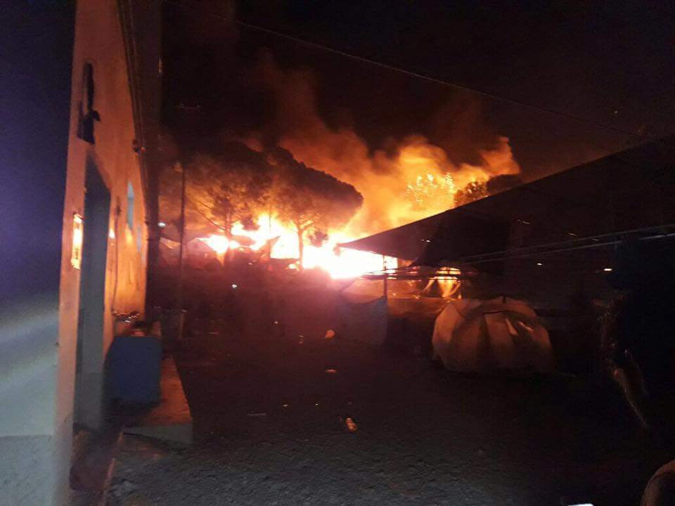
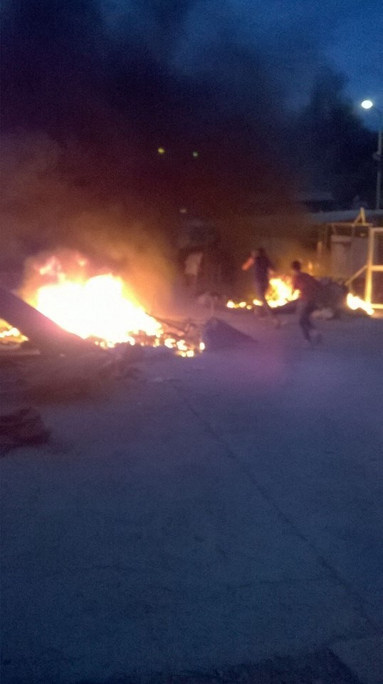
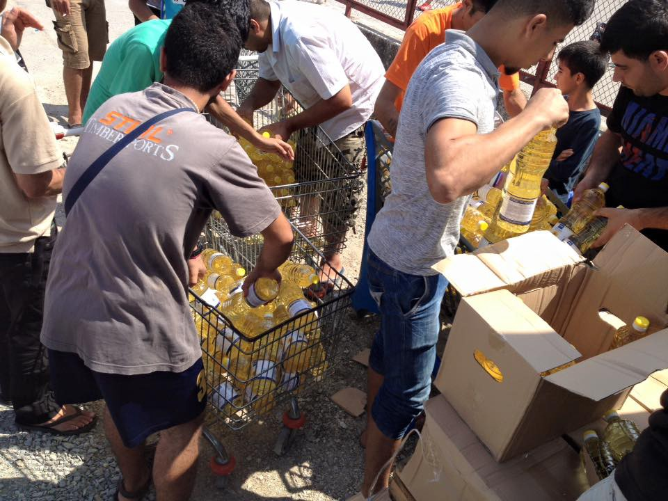
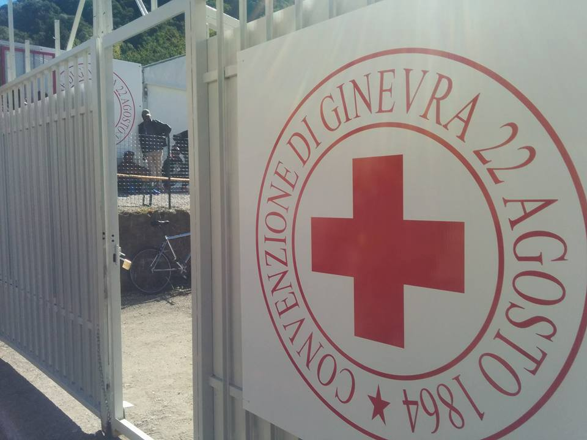
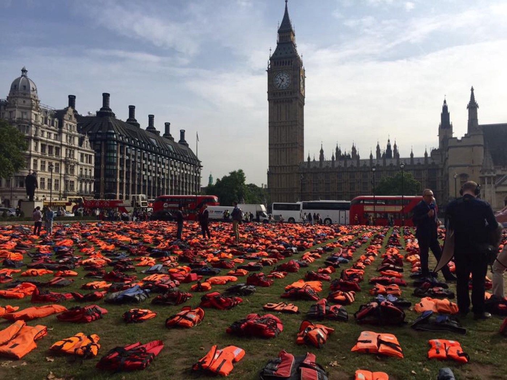

### AYS digest 19/9: Overcrowding, despair, and riots, or self\-determination?

Fire raging in Moria camp in Lesvos after clashes
#### General
### **UN Summit to hear report on why people run away from home\.**

On Tuesday, the UN Summit for Refugees and Migrants will hear the findings of the MEDMIG research project\. This project has identified the reasons why refugees and migrants left their home countries to make the dangerous journey across the Mediterranean in 2015\. It is one of the largest studies of its kind\.

As part of the Economic and Social Research Council \(ESRC\) \-funded ‘Unravelling the Mediterranean Migration Crisis’ \(MEDMIG\) project, researchers interviewed 500 refugees and migrants about their experiences\. According to their findings, 88% of those arriving in Greece via the Eastern Mediterranean route said that they left their homes because of persecution, violence, death threats or human rights abuse\. Of this group, more than a quarter said the ‘Islamic State’ group \(IS\) played a significant part in their decision to leave, with many being detained, tortured or forced to watch beheadings\. 66% of those arriving in Italy mentioned factors that could be described as ‘forced migration,’ including violence, death threats and religious persecution\. Those from West and East Africa most commonly left because of the threat posed by militia groups and terrorist organisations or indefinite forced conscription in Eritrea\. Over 75% of those who crossed via Libya experienced physical violence, and over a quarter spoke of experiences related to the death of fellow travellers\.
### **New Country of origin info from EASO**

The European Asylum Support Office \(EASO\) has published a Country of Origin Information \(COI\) report on recruitment by armed groups in Afghanistan\. This report aims to help relevant authorities evaluate asylum claims made by Afghans arriving in Europe\. You can find more [here](https://coi.easo.europa.eu) \.
### **Pharmaceutical giant to lower the price of medicine for refugees\.**

In a David and Goliath kind of story, MSF has successfully pressured GlaxoSmithKline into cutting the price of its pneumococcal vaccine when administered to refugees\.
#### Syria
### **UN convoy in or just outside Syria?**

Today, Stephen O’Brian, head of the humanitarian office of the UN, stated that their convoy was not able to enter the Aleppo area\. The convoy was bringing supplies to feed 185 000 people for a month in the besieged city\. Later today, we received conflicting and disturbing reports on this matter\. We will expand our reporting tomorrow once more information is published\.
### **Data on displacement in Syria**

Impact Initiatives has published a trove of data depicting the displacement of people in Syria\. For access to the full document, follow this [link](http://bit.ly/2daSRt6) , or tune into their [Facebook page](https://www.facebook.com/IMPACT.init/) \.
#### Turkey
### **No US for highly educated Syrians stuck in Turkey**

In an alarming turn of events, Turkey has stopped the relocation of highly educated refugees from Syria to the United States, despite the US approving their relocations\. For more about the implications of this decision, follow the [link](https://www.theguardian.com/world/2016/sep/19/turkey-syrian-refugees-resettlement-blocked-us-degrees?CMP=twt_gu) \.
#### Greece
### **More people in the already severely overcrowded islands**

As the overall number of people stranded in Greece continues to inch upwards, while relocation programs proceed at a snail’s pace, we take a look at the overall statistics\.

In Chios, the number of refugees has reached an all\-time high\. Almost 4 000 people currently reside in its reception centers, exceeding the official capacity by 336%\. As AYS has reported previously, this overcrowding creates a breeding ground for clashes, unrest and all sorts of mental and physical problems that can accompany such ill treatment of people\.

On the mainland, these numbers fluctuate, with the number of people in northern Greece dropping from 16935 to 16188 over the last twenty days \(from 1st of September until today\) \. For example, the population of camp Giannitsa dropped from housing 295 to none; it seems that it is being closed\. Schisto decreased from 1100 to 850 people, while Scaramangas increased from 3200 to 3450\. The number of voluntary returns increased from 42 at the beginning of the month to 81 today\.

As for today, there were 210 arrivals up to 8 o’clock this morning\. Volunteers have reported that three boats containing approximately 80 people landed on Lesvos this morning, who will be included in tomorrow’s numbers\. Fortunately, nobody was hurt and everyone arrived safely\.
### **Numbers in the islands reach an all time high**

Over the weekend, 308 people arrived in the northern Aegean islands over this weekend\. For the first time since the border closings, more than 10 000 are stranded in the northern Aegean islands\. Taking the other islands into consideration, a tota of 13 536 people are currently stuck in Greek island centers\.
### **NGOs asked to leave Kara Tepe**

It seems that on Lesvos, the government tried to build another camp without the knowledge of local municipality\. As a result, the municipality, that by law has a jurisdiction over the camps, stopped the construction\. They have also asked all the NGO’s to move from Kara Tepe camp\. For more follow the [link](http://www.amna.gr/english/article/15144/Lesvos-municipality-asks-NGOs-in-Kara-Tepe-camp-to-leave) \.
### **Volunteers needed\!**

With these increasing number of arrivals, the volunteer group om Samos is announcing through all reliable channels that they urgently need more volunteers\. Please, if you are willing and able, contact them [here](https://samosvolunteers.wordpress.com/) \.

Another call for volunteers has come from Earth refugee crew, working at Sounia camp\. They have prepared a form for you to fill if you are able to volunteer at the site, two hours outside Athens\. If you are available to help, please follow this [link](https://docs.google.com/forms/d/e/1FAIpQLSdgTPA86W8-mxZdGaQOYI0yK81tCJREOz5D717x5hZjPNsdgQ/viewform?c=0&w=1) and fill out the form\. Earth will be grateful\.
### **From peaceful protest to burning the camp — info on Moria**

The combination of overcrowded centers and absurdly attenuated asylum interview scheduling has created the perfect storm for protests to erupt\. One of those happened today in Moria camp\. An initially peaceful atmosphere devolved into clashes between different national groups, most notably Syrian and Afghan\.

Currently, we are receiving reports that camp the has nearly entirely burned to the ground, with police unable to stop the conflagration\. According to our sources, NGO offices and tents have been destroyed, but the FRS and family compound are still standing\. Some refugees have fled and are either sleeping in the streets or being hosted in Mytilene now\. Those whose tents were not destroyed are apparently still in the camp\. There is no information on the response of authorities\.

We will try to provide more clarification tomorrow\.

Moria burning
### **With solidarity and organization, people take over two camps in the Greek mainland**

In news that bring hope, we bring you stories from two camps in Greek mainland\. In Lete Derveni, as were have reported, people were increasingly disillusioned by the empty promises of UNHCR and IOM to meet their basic needs\. Refugees and independent volunteers raised their voices in protest and petitioned these big organizations to leave and let them, through their organized bodies for decision making, organize the camp\. In an unprecedented turn of events, they succeeded\. Currently, decisions in the camp are made by refugees and independent volunteers\.

In Oraiokastro, a council consisting of community leaders and well\-educated refugees has also stood up\. This group also approachdd tbe NGOs working in their camp to demand a say in decisions being made on their behalf\. As they put it: “You cannot make decisions about this camp, and about which organizations can enter or not, without consulting us\. We will have a say in what happens in the camp from now on, because it is about our lives\.” From reports in the field, they have succeeded in taking control over this part of their lives\.

We support these moves for dignity and control over one’s lives more than we can express in words, and will continue to follow this story\. We hope that these kinds of self\-organization and internal democratic procedures will spread, giving people a say even in such dire circumstances as the camps\. Power to them and all of us rooting over here\! Follow them on their [FB page](https://www.facebook.com/The-Voices-of-Oraiokastro-1627523520892089/?fref=ts) \.

Selforganized food distribution in Oraiokastro
### **Info on interviews and relocations**

The announcement of interview dates has created a messy situation throught Greece\. RefuComm is doing its best to shed light on these issues and provide concrete information\. If you are located in mainland Greece and have any questions on dates, places, duplicate appointments, please turn to this [post](https://www.facebook.com/notes/refucomm-communication-and-information-for-refugees/greece-mainland-full-registration-update-19th-september-2016-%D9%87%D8%A7%D9%85-%D8%AC%D8%AF%D8%A7-%D8%A8%D8%AE%D8%B5%D9%88%D8%B5-%D8%AA%D8%B3%D8%AC%D9%8A%D9%84/313859768965832?hc_location=ufi) for useful information\.

Also, we recommend closely following the various Immigrant and refugee support groups on Facebook, most notably the one from Athens, for detailed information on the procedures\.
### RefuComm needs translators

RefuComm urgently needs help translating from English to Greek and vice versa\. Please [contact them](https://www.facebook.com/refucomm/) if you are able to translate between these two languages\.
#### Italy
### **New camp in Como**

A new camp has opened in Como, Italy\. The camp can host up to 300 people and is run by Red Cross\. It seems to be furnished with air\-conditioned containers\. No fingerprints will be taken in the camp and people can enter and leave freely between the hours of 7:30 and 22h\. If people leave the camp for more than 72 hours at a time, however, they will not have access to it again\. For more information,follow the [link](https://www.facebook.com/osservatoriomigranticomo/posts/829364483864923?hc_location=ufi) \.

New camp in Como is led by Red cross
### **Tailoring workshop in Milan**

If you are in Milan, a tailoring workshop will be held next week\. The goal of this project is to help migrants learn new skills, but also to provide a space for them to socialize and learn the language\.

The course will take place on Monday and Wednesday morning, by Spazio Arte in Sesto San Giovanni \(Milan\), in a bigger room next to the old one\. Starting 29th September \(date to be confirmed\), a new course for beginners in tailoring will take place and will last all day long\. It will begin with around 10 people, privileging women trainees\. If you know a migrant woman in the Milan area, please let her know\.

For mothers, we can arrange on\-site baby\-sitting services\. If necessary, we’ll call a cultural and language mediator\. People can now apply\. The workshop is completely free, but consistent attendance and determination are necessary\. Please PM Silvia Rossetti for any question\. If you are interested, you can also join the group on [Facebook](https://www.facebook.com/groups/874964709185709/) \.
### **The Left must push for a more sustainable and humane approach to migration in Europe — a letter from mayor of Milan**

Continuing our focus on Milan, leftist mayor Giuseppe Sala had an interesting message for Europe and Italy today\. He feels that Europe is at its wit’s end with disastrous policies that are pushing people into despair\. Italy and other countries should do more to insure that regions are better prepared to receive and integrate people escaping war, persecution and poverty\. According to Sala singles, left\-wing forces in Europe must push for more humane and socially responsible approach to the migrant crisis, especially in Italy, where there is a constant increase of people arriving from the Mediterranean\.

We bring you an excerpt from [his letter](http://milano.repubblica.it/cronaca/2016/09/19/news/titolo_non_esportato_da_hermes_-_id_articolo_4575097-148053885/) : “It’s not easy, but a new push for facing the matter has to come from the Left, through planning that involves the regional administrations\. Milan is doing everything possible\. In the last three years, we welcomed 100,000 refugees\. But it’s necessary that the government also works to ease some of this burden on the city\. We need a serious and planned integration policy, one that is equipped with adequate budgetary resources\.”

Hopefully, these words will resonate with real action soon\.
#### Serbia
### **Long\-term volunteer needed in Horgos and Kelebija**

Fresh Response Serbia is seeking an experienced NFI \(non\-food item\) volunteer to help them with their organization in the northern Serbia/Hungary transit zones, and at the camps of Horgos and Kelebija\. This post is for someone who can commit to longer periods of at least a month\. If you are able to help and meet these criteria, please contact Fresh Response via [Facebook\.](https://www.facebook.com/freshresponseserbia/)
#### France
### **Increased numbers in the Jungle — September census**

We bring you the appalling numbers from Calais\. The [September census](https://www.facebook.com/HelpRefugeesUK/#) conducted by Help Refugees/L’Auberge des Migrants states that there are staggering 10,188 people living in the Jungle, a 12% increase from last month\.

Among this total, 1179 are children, of whom 1022 are on their own\. On average, 11 unaccompanied minors arrive in the Calais camp every day\. In the past month, there has been a 51% increase in unaccompanied minors\. The youngest is still 8 years old\. Not one child has been brought to the UK under Dubs amendment, despite it passing in May\.
### Donations needed in Calais

Given this increasimgly dire situation, those working in the Jungle are in need of more resources\. To donate physical goods please email [calaisdonations@gmail\.com](mailto:calaisdonations@gmail.com) \. To buy the most needed items for camp to be delivered straight to the Calais warehouse, please click [here](http://bit.ly/2cDQMdg) \. To donate to Refugee Youth Service, which provides assistance for children and youths living in the Jungle, please visit [this site](http://bit.ly/2dbVBX5) \.
#### U\.K\.
### **People saying this, government saying that**

Finally, we bring you pictures from Europe’s far west, that is, the U\.K\. As As we previously reported, the people of London are protesting for more humane policies regarding refugees\. They want people to be received in U\.K\., rather than risking their \(usually very young\) lives trying to cross the English Channel\.

Theresa May, the Conservative prime minister, addressed the UN on Monday, spouting the usual clichés: establishing first\-safe countries, recognizing the distinction between economic migrants and refugees, etc\. For more on the insufficiency of these statements, read\. the Free Movement law blog’s response [here](https://www.freemovement.org.uk/outline-of-theresa-mays-un-summit-speech-on-refugees/?utm_source=FM+master+list&utm_campaign=72dc728511-RSS_EMAIL_CAMPAIGN_WEEKLY&utm_medium=email&utm_term=0_792133aa40-72dc728511-116246221&mc_cid=72dc728511&mc_eid=7d3903d315) \.

Meanwhile, in her ownbackyard, protesters have laid thousands of used life jackets in Parliament Square to try and prompt a real conversation on those issues\. Clearly, the establishment is not listening to the streets — or even looking at them\.

_Converted [Medium Post](https://areyousyrious.medium.com/ays-digest-19-9-overcrowding-despair-riots-or-selforganization-512393f8ccb3) by [ZMediumToMarkdown](https://github.com/ZhgChgLi/ZMediumToMarkdown)._
