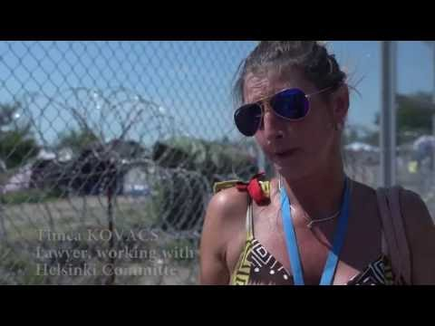

### AYS DAILY DIGEST 24–25/09: \#borderscankill
#### European officials more concerned about crisis situation than actual victims of the refugee crisis\. Horror in both Syria and Yemen as death tolls mount\. Bureaucratic labyrinth in Greece leaves refugees out in the cold, literally\. Pushbacks at Idomeni to be reported as violation of human rights\. Possible integration in Bulgaria, and a chance to help\. Ignored escalating crisis in Serbia: food poisoning and hollow promises\. Increased violence documented in Austria\. Afghans protest institutionalized discrimination in Germany\. Refugee helpers punished in Denmark\.

Another summit on refugees passed, and we have learned nothing new\. Leaders did not agree on how to stop this humanitarian crisis or how to help all these people who are left alone in inhumane conditions in different camps around Europe or just left out in the open, and winter is coming\. The same as last year, few people are making adequate preparations for the harsh conditions; instead opting for ignorance and hand\-wringing as a solution\.

This summit was held in Vienna and prime ministers of Albania, Bulgaria, Croatia, Germany, Greece, Hungary, Macedonia, Serbia, and Slovenia participated, as well as the European Council President Donald Tusk and EU migration commissioner Dimitris Avramopoulos, and Romania’s Interior Minister Petre Tobă\. Despite the call from the group of leaders from Nordic countries to EU to warn Hungry because of its treatment of people who are on their journey toward the north of Europe, they did nothing\.

Even more, Donald Tusk asked for closure of the Balkan route “for good”\.

> “Since the first days of the migration crisis, I have had no doubt that the main key to its resolution is restoring effective control of the EU’s external borders,” Tusk said in a statement upon arriving at a high\-profile migration summit in Vienna\.
 

> “Obviously, an essential precondition for achieving this goal is close cooperation with our partners in the Balkans and Turkey,” he said\. “\(But\) we need to confirm — politically and in practice — that the Western Balkan route of irregular migration is closed for good,” he told like there are no human beings on this route\. 

Austrian Chancellor Christian Kern, called for “massively improving” the security of the bloc’s external borders, alongside a “Marshall Plan” for Africa, which would include providing more resources to aid refugees located south of the Mediterranean\. If only these officials were half as concerned about refugees as they are about the conditions of fences\.

People on the street of Vienna were sending different messages saying refugees are welcome\.

Photo by Karin T\.

Amnesty International warned again that refugees should be protected, not pushed back\.

> “Fences, asylum caps, push\-backs will do nothing to stop asylum seekers from trying to flee conflict and violence\. What Europe needs is political leadership capable of offering a human response based on solidarity,” AI warns\. 

Refugees spoke, too\. Our friend and photographer Abdulaziz started thecampaign \#borderscankill several days ago\. People around the world joined taking pictures of themselves holding sign \#borderscankill\. This week, Abdulaziz spent time in Frakapor camp with a family of four in the tent they have been assigned\. Abdulrahman and Shindara Tobal who are the parents of two beautiful children; Brevan who is now 4\-years\-old and Ahmed who is 2\-years\-old\. This is their story:

> “We lived in Aleppo and left three years ago when the bombing increased\. The regime and ISIS didn’t care if their attacks killed children and we were so scared to lose Brevan\. She was only 1\-year at the time\. We fled to Turkey and found work, a place to stay even\. We were living there and were blessed with Ahmed while being there\. Shortly after, the situation in Turkey started deteriorating\. It became worse and worse to be a Syrian in Turkey\. We worked as many hours as possible but had to face the fact that Turkey wouldn’t be a safe place for our children to grow up, as a conflict between Turks and refugees became really bad\. It was the 2nd of February that we reached Greece\. Getting off the boat, I was overwhelmed with thankfulness\. I thought Brevan and Ahmed were finally safe, that we would soon be able to rebuild a home and life for our family\. Then the borders were closed and we spent the winter in Idomeni camp\. After spending almost 7 months here, we have just been given out the first appointment at the asylum office\. It is the 27th of April in 2017\. I get angry now when I hear organizations or governments claiming that children have rights here\. It will be our second winter in a tent and we talk about how to get our children through all of this, shielding them so they won’t be damaged\. I just don’t know if that is even realistic\. It is really difficult to explain life here\. You can’t imagine if you haven’t lived it yourself\. If humanity is the aim, we would be able to go to Europe and re\-build a life or be able to return to Syria to live the life that would be left\. We are unsure if we will be kept here until governments decide to send us back anyway\. All we want is safety for Brevan and Ahmed\. That they are okay\.” 

“Abdulrahaman became quiet, he said I’d like to add something : “I feel as if we are being judged\. I’d wish someone would talk to us before passing judgment on us\. We are regular humans with ethics\. We don’t wish harm upon anyone\. Is that what people think? That we are dangerous? I don’t know what to believe anymore\.” Photo and story by Through Refugee Eyes

Follow the campaign and contribute by tagging \#borderscankill and liking “Through Refugee Eyes” on Facebook\.
### SYRIA

A UN aid convoy going into an Aleppo neighborhood\.

According to journalist [**Abdussamad Dagül**](https://www.facebook.com/AbdussamadDaguel/?fref=nf) :

> Hospitals now in [\#Aleppo](https://www.facebook.com/hashtag/aleppo?source=feed_text&story_id=1253480248036351) don’t have the capacity to accept and treat all wounded civilians, because of their massive numbers flooding to the medical points\. Doctors are also unable to move them out of the targeted districts because of the siege\. 

Dagül also reports the use of bunker buster bombs which have completely destroyed and disfigured entire neighborhoods, twisting them beyond recognition\. In four days, 373 people have been killed\.
### YEMEN
### 329 civilians have been brutally murdered in the last 2 months\.

Saudi Arabia has been brutally bombing Yemen for almost two years, and the results continue to show\. The UN recently stated that at least 10,000 people have died as a result of the conflict, the majority of civilian casualties being the handiwork of the Saudi coalition\. In the last two months, 329 civilians were killed\. Most civilian casualties come as the result of airstrikes on crowded residential areas\. Despite international outcry, the Saudi coalition continues to receive support from its western backers — namely the US and the UK\. Just a few days ago, the American senate approved a new one billion dollar arms deal with the Saudis, weapons that will no doubt contribute to many more deaths\. The UK is similarly enabling Saudi crimes, having already contributed 72 million pounds worth of arms and agreeing to sell an additional 3 billion over the future\. It is the most blatant of hypocrisies that the powers supposedly calling for an end to the Assad regime because of its blatant disrespect of human lives continue to turn turn a blind eye, nay, enable, the killing which strikes terror into the hearts of the Yemeni people\.
### GREECE

A Syrian man sits in a tent in Ritsona Camp\. Photo Credit: Petros Giannakouris

There is no solution for people who are arriving now to Greece\. Capacities on islands are overcrowded, to find accommodation in Athens is becoming harder, and those who are responsible — authorities, UN and the EU — are doing little to nothing to help\.

Even more, they do not help even when people are finally on their way to leave Greece\. Mother with four children was able to join their father in Germany thanks to helping from volunteers\. They will meet for the first time after one year\.

Volunteers are warning that that in Athens, where people are coming for interviews, there is no accommodation and families are sleeping on the streets\.

> “Please make sure that families understand that unless they are coming for relocation \(where they will most likely be provided accommodation\) for other interviews, families should only arrange to be in Athens for one or two nights \(duration of interview process\) and then go back to the camp/location that they came from\. Every camp/squat in Athens is full to capacity and we are struggling to find accommodation\.” 

For all of you looking for information about relocation, visit the [RefuComm](http://react-text: 564 https://www.facebook.com/notes/refucomm-communication-and-information-for-refugees/syria-fast-track-procedures-for-aslyum-in-greece-23092016/323510458000763) site\. Today they publish about Syria fast\-track processing that under the Greek mainland ‘regular procedure’ has been applied since 23 September 2014 for Syrian nationals who wish to lodge an asylum application for the first time before the Asylum Service and who hold original passports, these passports can also be expired original passports\. Under the ‘Syria Fast Track’ procedure, both full registration and decisions on asylum applications take place on the same day\. The main idea of Syria fast track is also that if people come from Syria they are in obvious need of international protection \( the recognition rate of Syrians in Greece is 99%\) — thus it is easy to grant to make the decision to grant asylum seeker’s ‘refugee status’\.
#### Help if you can

Elpida needs volunteers\. Elpida infrastructure team, [Together for Better Days](http://togetherforbetterdays.org/donate/) , decided to build a men’s space in this camp\. They need more camps to complete and every penny makes a difference\. They also call for builders, carpenters, and constructors\. [Want to join](http://togetherforbetterdays.org/volunteer/) ?

A friend of our friend [Chris Andflowers](https://www.facebook.com/profile.php?id=100010949321328&fref=nf) would like to practice German, mainly conversation and translation\. He already knows the basics of grammar\. If there is any German native speaker or someone who knows German pretty well that can help him out, please get in touch with Chris\.
#### Education, Growth, and Dignity

Refugee Accommodation and Solidarity Space City Plaza handed out blankets the other day in order to help people combat dropping temperatures\. In their words: “Dignified living conditions are a fundamental right, not a luxury\.”

In this spirit, the Khora Community Center in Athens will be opening on October 3rd\. There is an event for those interested in attending the grand opening and seeing the fruits of 3 months of intensive labor and careful planning\. Learn more about the event [here](https://www.facebook.com/events/1579177052387655/) \.

Emergency Response Centre International wrapped up week two in their educational initiative projects in northern Greece\. The pupils were very eager and are greatly enjoying this return to some normalcy\.

Photo Credit: ERCI
### MACEDONIA

Legis filed a complaint against Macedonia in the European Court of Human Rights regarding the collective expulsion that took place on March 14th in the context of the March of Hope from Idomeni\.

> “Illegal push\-backs or forced returns at EU borders represent a flagrant violation of fundamental human rights and refugee laws\. In the Spanish enclaves of [Ceuta](https://www.ecchr.eu/en/our_work/international-crimes-and-accountability/migration/ceuta.html) and [Melilla](https://www.ecchr.eu/en/our_work/international-crimes-and-accountability/migration/melilla.html) on the northern coast of Africa, refugees and migrants are repeatedly subjected to brutal violence from border guards\. Anyone attempting to enter these Spanish cities — and thereby reach EU territory — is immediately deported to Morocco without any examination of their right to asylum\.
 

>  
 

> This practice of unlawful and often brutal push\-backs has now become a model for border protection along the EU’s outer limits as well as in neighboring and transit states\. This was demonstrated for example by the expulsions from the Former Yugoslav Republic of Macedonia \(FYROM\) to the border camp [Idomeni](https://www.ecchr.eu/en/international-crimes-and-accountability/migration/idomeni.html) in Greece\.” 

For the full report, click below\.

### BULGARIA
### Asylum seekers to be integrated in in Bulgaria, and a way to help volunteer efforts\.

According to Novinite, Bulgarian municipalities with bad demographic indicators may now integrate refugees permanently\. Three municipalities are currently working on the project,

“In the summer, the Cabinet approved a decree on the integration of refugees, according to which municipalities will sign contracts with the State Agency for Refugees and the foreigners themselves\. Municipalities will receive European funds for every refugee but will undertake the obligation to find them accommodation, work, and provide education and health care\.”

It is a good sign that the refugees themselves will also have to sign the contract, indicating that they will give their consent to participate in this project; however, demographic indicators alone do not show whether the new host communities will be welcoming, so it is of crucial importance that community outreach include the host communities and foster positive relationships between the newly forged community\.

In more news from Bulgaria, increasing numbers have resulted in busier times inside of camps in Bulgaria\. The Refugee Play School in Harmanli is providing children with needed attention and educational programming\. Please [support this long\-running, unique project](https://www.gofundme.com/refugeeplayschool) as dedicated volunteers seek to support displaced children\.
### SERBIA
### International, regional, local media numb to escalating crisis in Serbia\.

The situation in Serbia is still off the radar of big international media, but attract little attention by the local or regional media, as well as the activist in Serbia\. Volunteers who are helping people in need informed us that around 40 people have been rejected around entering Krnjaca camp because they are the single man\. Many of these people have been sleeping in Krnjaca camp before and on Saturday night they were forced to sleep outside with no blankets, warm clothing nor idea where to go\.

At the same time, more people arrived today to Belgrade\.

Miksaliste

Disturbing updates from Preševo camp in Serbia where reports of food contamination or rot resulted in refugees refusing food\. At least one individual reported eating the chicken that smelled horrible anyway, but then reported serious sickness shortly after consumption\. Unlike other camps in Serbia, residents in Preševo Camp are not allowed to leave the camp\. Refugees are given promises of being let outside of the camp, to be allowed to go to the market, but faith in these promises wane as people are continued to be penned up inside the walls\.

Possibly contaminated chicken in Preševo Camp\.
### HUNGARY
### More willful ignorance on display in Hungarian courts as ‘all migrants look quite the same\.’

An activist from Hungary are still following the trial of Ahmed H\. On Friday it was another day in the courtroom for this refugee who has been charged with terrorism\.

“After over four hours of testimonies that mainly proved nobody was sure of what happened that day in Röszke, that everything was chaotic, and that the witnesses couldn’t be sure of who is guilty because “all migrants look quite the same as they have a beard and black hair”, Ahmed is now charged with a life sentence, instead of 20 years of jail\. His next court hearing will happen on October 28th\. This trial is ridiculing what we call a juridical system and is the ultimate political toy of fear mongering, aiming to prove by force and fault that “migrants” are terrorists\. We will not let this go, we will spread the word and support Ahmed H stronger than ever from now on\! Join us in showing that this is not justice, this is a show trial\!”

Please watch the above short documentary for the full information on the Röszke 11, who continue in this fight\.
### AUSTRIA
### Austrian government statistics reveal twofold rise in attacks against centers for asylum seekers\.

In 2015, there was a total of 25 attacks against centers\. In the first 6 months of 2016, there had already been 26 such attacks, ranging from hateful posts on the internet, to arson and acid attacks\. The situation in Austria is particularly tense given the near\-victory of the presidency by the candidate of the Freedom Party, a far right nationalist group\. Another election for the post is scheduled to take place on December 4, and with the Freedom Party’s marginal loss, the results of the election are anybody’s guess\.

The rise of far\-right wing parties is widespread throughout Europe, having recently been stoked by xenophobic attitudes against refugees\. These anxieties have caused in neighboring Germany the far\-right Alternative for Germany \(AfD\) party, previously an extremely marginal group, to come in second place in the parliament of the Mecklenburg\-Vorpommern Bundesland\.
### GERMANY
### Afghans protest discriminatory asylum system\.

Hundreds of Afghans gathered in Hamburg today to demonstrate against discriminatory behavior of German authority in processing their asylum claims in Germany\. They also called on the Afghan government to withdraw the decision of signing MOU that will encourage forced return of Afghan refugees back to Afghanistan\.

Photo Abdul Ghafoor
### DENMARK
### Danish couple fined over 5,000 euro for helping refugees\.

A disturbing new development has come from Denmark which has officially convicted a Danish couple of “people smuggling” for giving refugees rides and some small food items\. The woman who did not know she was breaking the law transported the family from the south of Denmark to Copenhagen, not ever crossing international boundaries\. They were initially prosecuted under the Danish Aliens Act in March, but appealed their sentence\. Now the Danish High Court has upheld the sentence and increased the penalty by five hundred British pound\. They now must pay 5,700 British pounds for their act of kindness\.
### FINLAND
### 15 thousand gather in Helsinki to protest racism\.

In the aftermath of the death of a man at the hands of neo\-Nazi radicals, 15 thousand have taken to the streets of Helsinki in a protest against fascist violence\. Thousands more participated in similar demonstrations across the country\. Among the participants is the current Premier of the country, Juha Sipila, who vowed that the government will soon be tackling such groups\.

_Converted [Medium Post](https://areyousyrious.medium.com/ays-daily-digest-24-25-09-borderscankill-bddfb7acd057) by [ZMediumToMarkdown](https://github.com/ZhgChgLi/ZMediumToMarkdown)._
