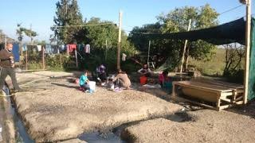
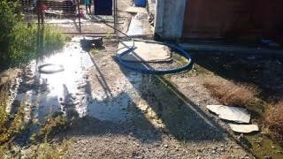
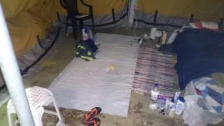

### Letter from Sindos Karamanlis residents to the Minister of Migration in Greece

Photo from Sindos Karamanlis camp

Inspired by the [letter from Elliniko stadium](https://medium.com/@AreYouSyrious/letter-from-the-heads-of-141-families-in-the-elliniko-camp-baseball-site-689989d7a1d8#.qpr5tox9s) that was published last week, AYS was approached by the residents and volunteers of Sindos Karamanlis camp, who have asked us to also publish their letter to the Minister of Migration, Mr Ioannis Mouzalas\. We are humbled by their initiative\.

Solidarity always\!

_Dear Minister,_

_For nearly eight months we have been suffering from the tragic situation in Greece; we have witnessed the harshest weather conditions from the coldest of winters in Idomeni to the scorching heat of summer and yet again we find ourselves on winter’s door living in the poorest conditions in a military camp\. We are yet to experience any of the human rights you so eloquently speak of\._

_We, the residents of Sindos Karamanlis camp require the most basic needs in order to live temporarily like a human being:_

_1\. Better quality food and if possible, an alternative could be a weekly food allowance so we could purchase our own fresh food\._

_2\. With winter approaching, we need hot water in the camp showers\._

_3\. In case of a medical emergency, we are forced to wait two hours or more for an ambulance\. We ask that response times are faster as this could cause a fatality\._

_4\. We desperately need a machine to kill mosquitos as we are located near a swamp and sewers; the camp is infested, all of the children are covered in severe scars from top to bottom\._

_5\. We need cooking equipment\._

_6\. Speed up the Relocation and Reunification procedures because we are dying slowly\._

_7\. Allow access to independent volunteers and journalists into the camp\._

_8\. The concrete flooring in the warehouse is extremely cold, we desperately need to insulate the inside of the tents with warm rugs for the upcoming winter months\._

_9\. We need more blankets\._

_10\. We need heaters in the camp\._

_11\. We need to repair the roof of the warehouse because the rain leaks into the tents\. We wouldn’t wish this life on anyone and kindly ask you to meet our basic needs\. Signed, residents of Sindos Karamanlis camp\._

_The residents of Sindos Karamanlis camp are asking just gor the most basic needs “in order to live temporarily like a human being”\._

_Converted [Medium Post](https://areyousyrious.medium.com/letter-from-sindos-karamanlis-residents-to-the-minister-of-migration-in-greece-6f0ac609e98b) by [ZMediumToMarkdown](https://github.com/ZhgChgLi/ZMediumToMarkdown)._
