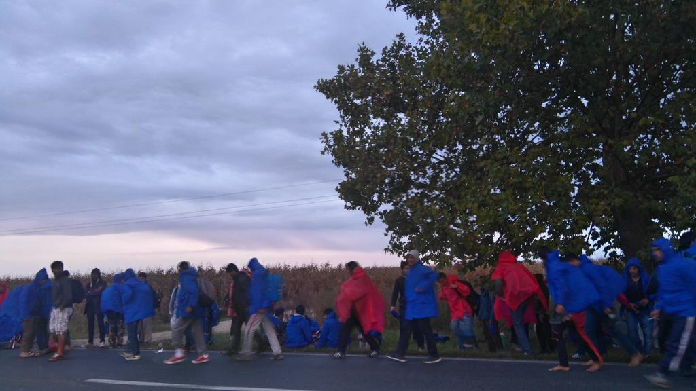
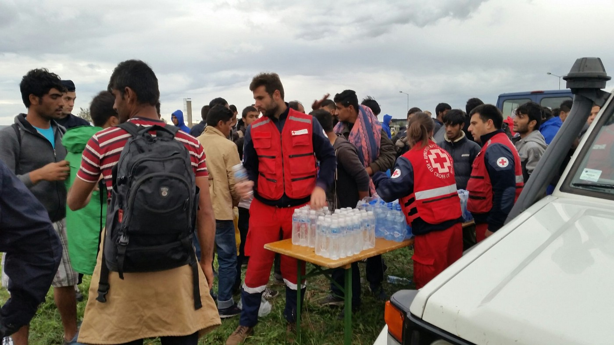
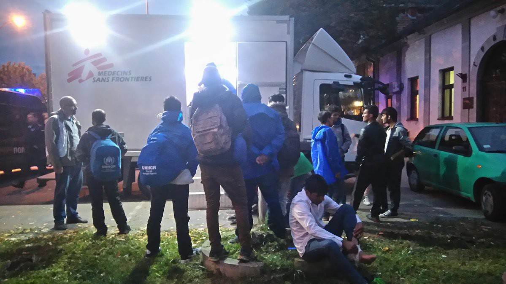
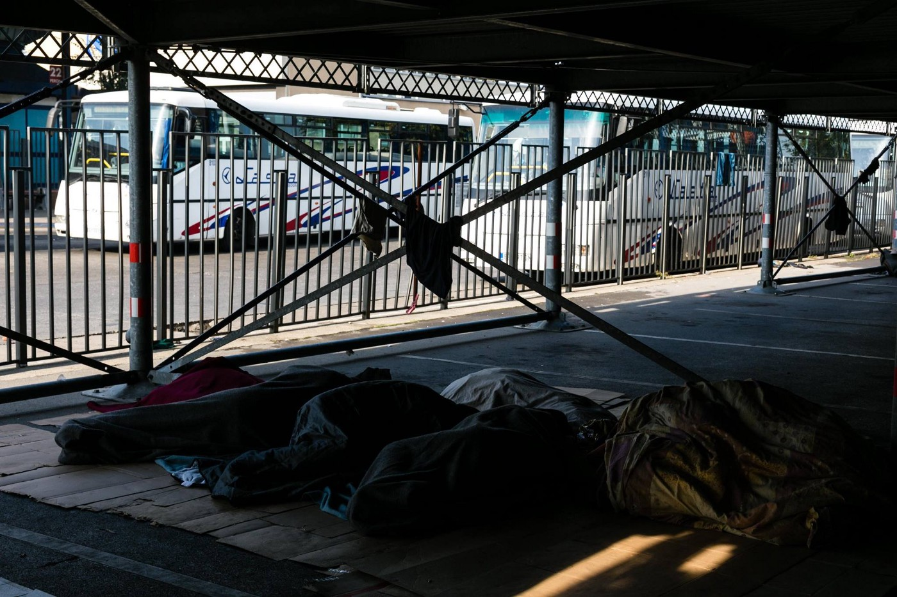
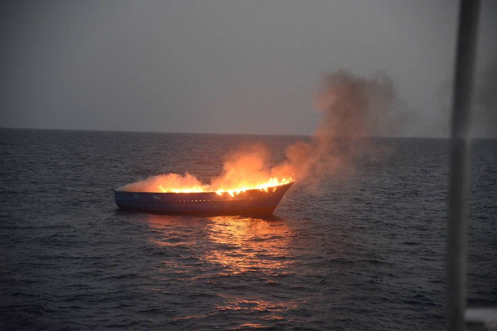
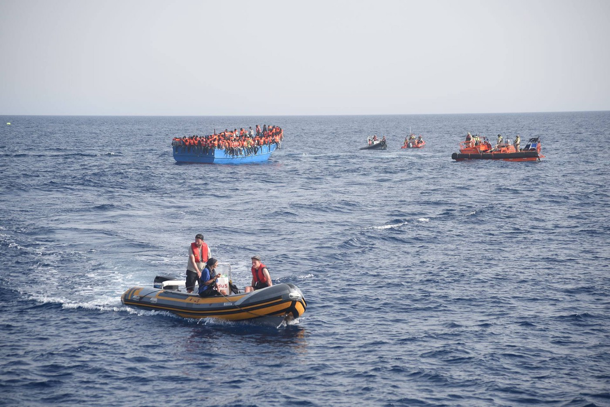
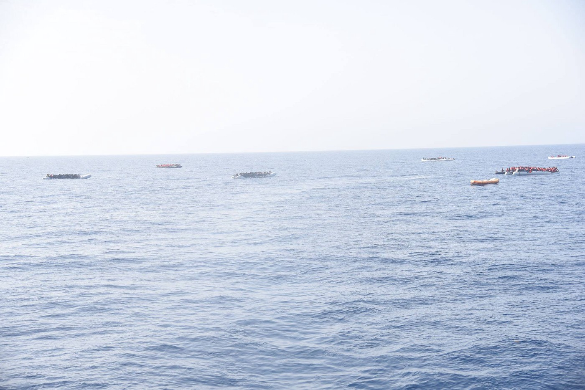
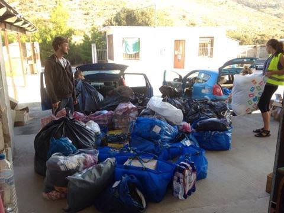
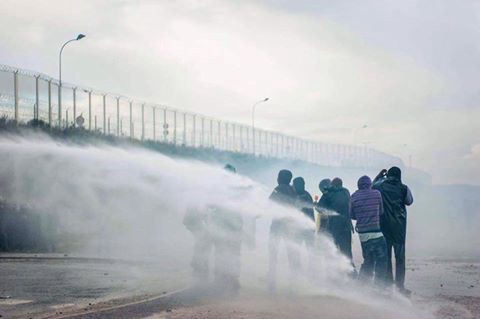

### AYS Digest 04/10: Refugees return to Belgrade after marching towards Hungarian border

_Between 150 and 300 of the refugees who tried to walk towards the Serbian border with Hungary are returning to Belgrade\. More than 1,800 refugees rescued off the Libyan coast\. 280 new refugees registered in Greece and camps remain overcrowded\. Donations needed in Calais, especially for unaccompanied minors\._

Photo by Patricia Otuka\-Karner

Between 300 and 400 refugees have started walking from Belgrade to the Hungarian border today, asking for the borders to open and holding banners saying “we don’t need food, water or anything, we want you to open the borders”\.

It all started in the morning\. After the protest in Belgrade park, one group decided to march to the border while the other group decided to stay, leading to violence against those who didn’t want to join the march\. Seven refugees were injured, as well as two workers from Info Park and one from Caritas\.

During the march, the Serbian Red Cross quickly began providing food, water and raincoats, while MSF provided primary health care\. Two international activists marched with the refugees and live\-Tweeted about the protest\.

Photo by Caroline Haga

Photo by Patricia Otuka\-Karner

According to those activists, as of midnight, 200 people arrived in Indjija, around 150 km from the border, with 100 of them deciding to go back because of the heavy rain and cold weather\. Serbian State TV said around 150 have camped near the road\. They have decided to go back to Belgrade around 5 in the morning, after the police woke them up\.

Local organizations and several long\-term volunteers from Belgrade have expressed their concern about the role of a small group of foreign activists in the march, but those who marched with the refugees said they were only accompanying the march and documenting the events, describing it as self\-organized movement of the refugees\. Local press and police also claimed the activists have encouraged, if not led the protest and the march\.

UNHCR says that around 5,700 refugees are stuck in Serbia at the moment, up from 3,000 during the last protest in July\. Many refugees are sleeping rough in the streets of Belgrade, with UNHCR stating that at least 700 stay in the city during the day\. Their living conditions have deteriorated as well, with the city of Belgrade destroying squatted facilities, while official camps are often overcrowded\. There is a serious concern this protest will be further used against the refugees and volunteers in the Park\.

Photo by Mette Flansmose

According to [The Guardian](http://Serbian%20president,%20Tomislav%20Nikolić.) , Serbian president Tomislav Nikolić said on Tuesday that Serbia would deploy its army to seal off the borders with Macedonia and Bulgaria, to stop refugees from coming in from those countries\.
#### Mediterranean
### At least 9 people drowned off Lampedusa

More than 6,000 refugees were rescued off the coast of Libya on Monday\. The vessels included five converted fishing boats and two rafts, with the remainder being overcrowded rubber dinghies\. At least nine people died and one pregnant woman and a child were airlifted to a hospital on the Italian island of Lampedusa\.

Seawatch says that refugees are trying to reach Europe before the coming winter and reports that it participated in the rescue of 281 people, many in critical condition\.

Photos by Seawatch

Photos by Seawatch

Rescues continued today, with the Italian coastguard says it helped 1,800 people on 16 different boats\. An AFP journalist says he counted at least 22 dead in a wooden boat with around 1,000 refugees on board\. Seawatch assisted at least 120 people on nine different rubber boats today, providing life vests and medical help\. No other rescue boats were in sight and the crew was working at full capacity\.

Photo by Seawatch
#### Greece
### 280 refugees arrive in Greece

280 people were registered up to 7:30AM this morning — one in Lesvos, six in Kos, 17 in Kalymnos, 89 in Samos and 167 in Chios\.

Volunteers say 89 people arrived in Chios today, with some having to put up their tents on the beach given the lack of place in the camp\. As of this morning, Chios hosts 4,047 people for a maximum capacity of only 1,100\.

In Samos, there are currently 1,704 refugees despite a maximum capacity of only 850\. Volunteers report on a spike in arrivals, as September saw 400 people reach the island, while 114 have already arrived in the first four days of October\.

Samos Volunteers has provided a full set of clothes and new underwear for each of the new arrivals and continues to provide clothes for those who are already living in the camp\.

New clothes and items for refugees\. Photo by Samos Volunteers

Donations and new volunteers are needed, given the unusual number of people coming to Samos\.

You can find out more on their [website](https://samosvolunteers.wordpress.com/2016/09/05/volunteers-info/) \.
#### France
### Donations needed before Calais eviction

Officials have said the Calais eviction will start before the end of the year and many volunteers believe it could begin before the end of this month\.

Whatever the date may be, the announcement of the Jungle’s dismantlement has raised two critical issues for volunteers:

On one hand, donations are down as people expect the eviction to start very soon and therefore do not believe aid is needed anylonger\. On the other hand, once the eviction starts, refugees will have to be provided with essential items, especially backpacks in particular, in order to travel in a dignified way\. Unaccompanied minors in particular need help, as the French government has made no plans so far to host them — only adult refugees are will be hosted in “Welcome and Orientation Centres” \(CAO\) \.

Help4Refugee recalls that during the last demolitions, more than 300 children went missing and remain unaccounted for\. The organization is therefore [calling for donations](https://www.gofundme.com/4refugeechildren) , in order to provide children with waterproof shoes, clothes, tents, sleeping bags, blankets, backpacks and a phone, in order to remain in contact with authorized volunteers once the eviction starts\.

French media, including [Le Point](http://www.lepoint.fr/societe/calais-ou-iront-les-mineurs-apres-le-demantelement-de-la-jungle-03-10-2016-2073273_23.php) , say that French authorities are negotiating with the UK to accelerate family reunification procedures, with Pierre Henry of “France Terre D’asile” saying around 25% of unaccompanied minors in Calais have family in the UK\.

Other organisations say systems are being put in place to host unaccompanied minors in France, with the president of the Pas\-de\-Calais region Michel Dagbert saying a “national platform for the distribution \(of unaccompanied minors\) across France is being considered”\.

Photo by Belgium Kitchen

However, as long as the camp is not dismantled, the distribution of aid is still necessary\. The Belgium Kitchen is therefore calling for help, as it says it has not received help for some time\. You can donate to their project [here](https://www.chuffed.org/project/belgiumkitchenincalais) \.
#### Syria
### US suspends ceasefire talks with Russia

The US State Department has announced the formal suspension of talks with Russia over Syria, because of the Russian military’s role in the assault on Aleppo\. [Reuters](http://www.reuters.com/article/us-mideast-crisis-usa-russia-idUSKCN1231X3?feedType=RSS&feedName=worldNews) notes this could trigger deeper US consideration of military options such as providing more support to Syrian rebel groups\. The New York Times says France is pushing for a UN Security Council to adopt a toughly worded resolution, that calls on the Syrian government to halt aerial bombardments and let in humanitarian aid\. The paper also says the gulf between Russia and the Western powers on the Security Council over Syria now appears to be as wide as it has been in years\.
#### Afghanistan
### Human rights organizations warn against EU\-Afghanistan deal

[DW](http://www.dw.com/en/rights-groups-warn-on-deportations-ahead-of-afghanistan-talks/a-35952278) says Human rights organizations warned against making support for Afghanistan conditional on Kabul’s acceptance of returned migrants, with Pro Asyl director Günther Burkhardt saying this would be a “complete blackmail of the Afghan government,” and describing such deportations as “irresponsible” given the “desolate” security situation in Afghanistan\.

Burkhardt also said it was shocking to witness “the breathtaking speed with which the European Union is jettisoning human rights,” saying that the deal made it possible to deport even unaccompanied minors\.

Under a deal, signed on Monday, the EU will bear the costs of returning the migrants, including travel expenses and re\-integration programs, while Kabul has promised to readmit citizens and supply travel documents for migrants without papers within a month\.

Meanwhile, an Amnesty International report accuses wealthy countries of failing to accept enough refugees\. The report claims ten mostly poor countries have accepted half of all refugees, with Jordan hosting 2\.7m, Turkey 2\.5m and Pakistan 1\.6m\.
#### Romania
### Romanian border police arrests 16 Iraqis

[The Guardian](https://www.theguardian.com/world/2016/oct/04/serbia-refugees-hungarian-border-macedonia-bulgaria?utm_source=twitterfeed&utm_medium=twitter) reports Romanian border police said they were investigating 16 Iraqi citizens, including six children, they found in two boats on the Danube river early on Tuesday\. The Danube forms the border between southern Romania and Bulgaria\. The people told police they had traveled through Turkey and then into Bulgaria and wanted to reach Germany\. They said each family had paid €35,000\.
#### Switzerland
### Contact list for Switzerland updated

Welcome to Europe has updated its [contact lists for Switzerland](http://www.w2eu.info/switzerland.fr/articles/switzerland-contacts.fr.html) , including legal help centres, medical centres and educational institutes\.

In recent days, it has also updated its [contact list for Turkey](http://w2eu.info/turkey.en/articles/turkey-contacts.en.html) [and information on asylum in Turkey](http://w2eu.info/turkey.en/articles/turkey-asylum.en.html) \.

_Converted [Medium Post](https://areyousyrious.medium.com/refugees-return-to-belgrade-after-marching-towards-hungarian-border-b65275c72325) by [ZMediumToMarkdown](https://github.com/ZhgChgLi/ZMediumToMarkdown)._
