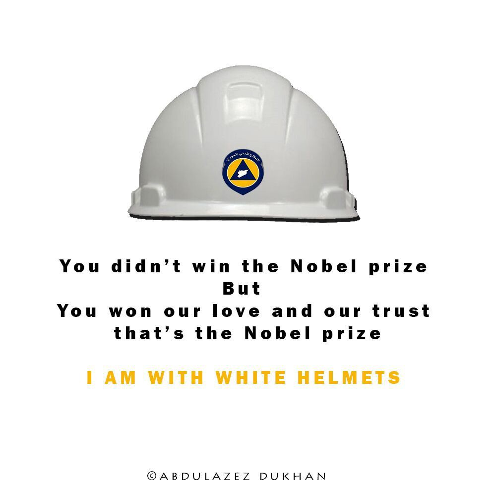
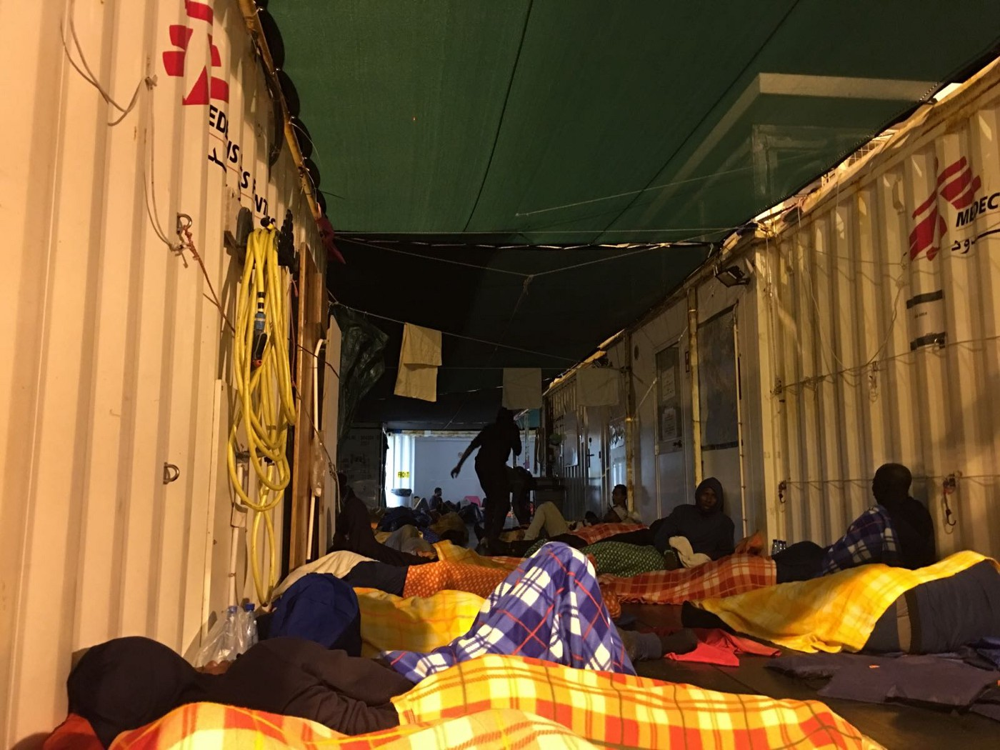
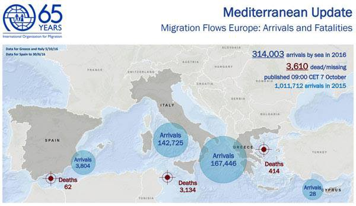
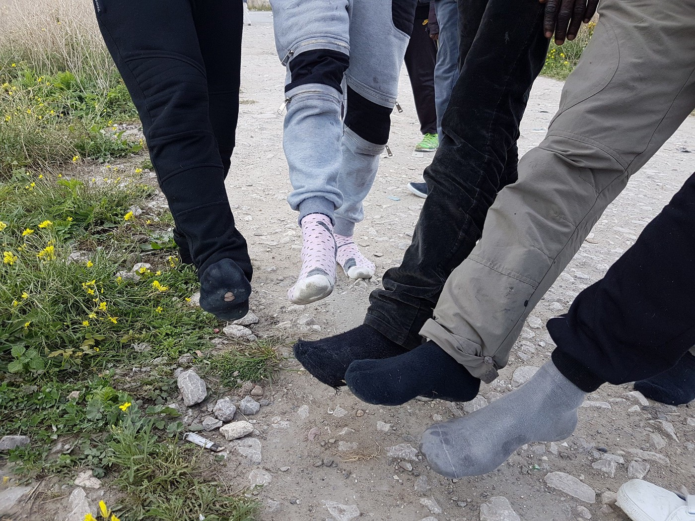

### AYS DIGEST 7/10: Heroes of Peace — The White Helmets

### FEATURE

Almost half of people who were killed in the war in Syria are civilians\. People who are living in war\-affected areas are afraid for their lives and lives of their children\. In search for peace and freedom, they are forced to leave their homes\. For many people in Syria, as well as many other countries where wars are raging, or people lives are in danger for other reasons, Europe represents a dream, a place where they will finally be safe and have a future\. But, European borders are closed and strictly watched\.

On October 6, [the European Border and Coast Guard Agency was officially launched](http://europa.eu/rapid/press-release_IP-16-3281_en.htm) \. The ceremony was held at the Bulgarian border with Turkey\. The task of this new agency is to “closely monitor the EU’s external borders and work together with Member States to quickly identify and address any potential security threats to the EU’s external borders”\.

Executive Director of the European Border and Coast Guard Agency, Fabrice Leggeri, said: _“This is a historic moment and I am very proud to see Frontex become the European Border and Coast Guard Agency\. The new Agency mandate has the wider scope and new powers that will allow it to act effectively\. The Agency will conduct stress tests at the external borders to identify vulnerabilities before a crisis hits\. It will now also be able to offer operational support to neighboring non\-EU countries who ask for assistance at their border and share intelligence on cross\-border criminal activities with national authorities and European agencies in support of criminal investigations\. It also has a key role at Europe’s maritime borders through its new coast guard functions\.”_

The main tasks of the European Border and Coast Guard Agency are to:
 • monitor migratory flows and carry out risk analysis;
 • monitor the management of the external borders of the EU;
 • provide operational and technical assistance to the Member States;
 • support search and rescue operations;
 • play an enhanced role in returns of third\-country nationals who do not have the right to stay on the EU territory;
 • support — together with other EU agencies — national authorities of the Member States carrying out coast guard functions\.

The Agency will have the mandate to work in cooperation with third countries, “in particular, neighbouring countries and countries of origin and transit for irregular migration”\. The can also send “deploy liaison officers” to these countries\.

We looked into EU success in tackling this humanitarian crisis so far\. Read AYS Special Report on 200 days of EU\-Turkey deal\.

### Mediterranean

This morning, German boat crew saved lives of 126 people from the sea\. They are all safe now\.

After rescue\. Photo by MSF Sea\.

IOM reports that 314,003 migrants and refugees entered Europe by the sea in 2016 on 5 October, arriving mostly in Greece and Italy\.

> “The total is well below the number of arrivals at this point in 2015, by which some 518,181 migrants and refugees had made the journey\. However, the death toll in 2016 is higher\. This year some 3,610 people have drowned or been reported missing in incidents off Egypt, Libya, Greece, Italy, Turkey, Morocco, and Spain\. In 2015 at this time, the total was 3,029\. For the whole of 2015, IOM’s Missing Migrants Project calculated 3,673 people were confirmed dead or missing\.” 

IOM Rome reported Thursday that 11,432 migrants were rescued in the Channel of Sicily this week\. After the peak arrivals of Monday \(6,000\) and Tuesday \(5,000\), arrivals slowed by mid\-week\. On Wednesday just 363 migrants were rescued\. Some 38 bodies were recovered, including 22 victims of asphyxiation\.

So far in 2016 the Italian Ministry of Interior has registered 142,725 arrivals by sea, up 6 percent from the same time last year\.
### Greece
#### New arrivals are officially registered in Greece

_Lesvos: 32_ 
_Samos: 158_ 
_Leros: 4_ 
_Chios: 46_ 
_**Total: 240**_

Some people also left Greece\. Officially, 11 returned to Turkey, on their own will hopefully\.

A number of residents in Cherso dropped from 1667 to 1567, and in Nea Kavala from 1875 to 1775\.

Greece government deported 55 people yesterday and 10 today, as it is stated in the official registration info sheet\. According to clarification, 10 Syrians — eight men and two women — were returned to Turkey\. Eight withdrew their requests for international protection status, and two did not request asylum\.

[No Border Kitchen Lesvos](https://www.facebook.com/NBKLesvos/) protest deportations claiming that more is to come\. They also warn about the [deal made between the EU and Afghanistan](https://medium.com/@AreYouSyrious/ays-03-10-eu-afghan-deal-death-awaits-in-the-safe-country-571bc4143e8#.4lmiijcrw) according to which many people who left the country and are now in Europe, could be returned\.

> “We don’t see any positive developments coming in the future\. Most people stay trapped in Greece\. While some groups of people might be able to go to the mainland and get asylum there they will still be forced to stay in Greece against their wish\. The fact that they are denied freedom of movement and a choice in which country they want to claim asylum and therefore live \(legally\), remains true for all people\. Groups of people, who are falsely categorized as unpolitical, economic migrants will more and more be deported back to countries outside of Europe\. 

> What the European governments deliberately ignore is the fact that there are no unpolitical migrants\. All people have their reasons, and many of them have been created by Europe itself\. Europe´s leaders close their eyes to these realities\. When they classify Afghanistan and Turkey as safe enough to process deportations they clearly show that the EU is not ready to welcome refugees but only ready to welcome people as the exploitable labor force to stabilize its own economy and make Europes rich even richer\. 

> We demand freedom of movement for all\! Stop EU\-Turkey deal and stop all deportations\! 

> No one is illegal\!” 

In total, there were 60136 people in Greece today\. The number is much higher if all the people who are not registered are counted\. According to some estimations that number could be up to 8000\.
### IMPORTANT WARNING

> Air traffic controllers in Greece have scheduled 24\-hr repeated strike actions between October 9 and October 13\. As a result of the scheduled strikes, flights to and from all Greek airports will be canceled during these dates\. 

[The Mobil Info Team](https://www.facebook.com/mobileinfoteam/) reminds today to about [quality of food in Greek camps](https://www.facebook.com/mobileinfoteam/photos/a.1800063030222418.1073741830.1796286800600041/1850159475212773/?type=3&theater) that is still unsatisfactory\.

_“We got rice for the last 14 days\. We’re so tired of rice\. There’s a farmer nearby and we started giving it to him to feed his chickens\. We collected all the unwanted rice and gave it to him for 2 days\. On the third day, we went to the farmer but he said he couldn’t take the rice\. We worried that maybe the police had been and spoken to him and told him not to take it\. We asked him about this but he said “No\. The chickens won’t eat it\.”_ 
_Young man, Liti Derveni camp_

Over 50\.000 people are living in camps around Greece\. Some of them are there for a very long time, at least since February this year\. Life in camps does not even resemble ordinary life\. it is hard, sad, unbearable most of the times\. But love always finds its way\. This is video from the wedding in Karamanlis camp\. Congratulations from our side, too\.

### Call for Solidarity

Volunteer [Farhad Timur](https://www.facebook.com/ftimuri) posted a call for an optometrist who could volunteer some time at Lesvos to do eye tests\. Contact him if you can help\.
#### Taking care of teeth at the squats

Group of dentists volunteers issued an important reminder for all volunteers

> “We know that there are now many children and adults with noticeably black and decaying teeth and swollen gums\. As many of you will be aware, we have for a while, been trying to get dental care for families as this is becoming an area of increasing concern throughout Greece\. We really only have one dedicated unit up the North that is providing dental care\. 

> We know that volunteers when bringing donations, want to put a smile on the kids’ faces\. This is natural; however, because of the concern about dental hygiene, it is probably better not to bring sugary drinks, sweets or chocolate bars\. Whilst these may be a quick energy supplement, it is actually not good for their overall health, never mind for their teeth and gums\. And for some kids the level of sugar isn’t necessarily helpful for their behavior and emotions — too much sugar can make kids hyperactive \(moms and dads will recognize this :\- \) \) 

> So, please can we ask that volunteers be aware of what they are buying\. If in doubt, check with the Squat leaders regarding the food that is running low and use the money to buy items that are needed \(e\.g\. cooking oil, tins of beans, pay towards bread debts at bakery etc\) \. 

> We are slowly making progress on the dental situation but it is going to be very slow progress so in the meantime, please help us help families to keep the teeth shining white and their gums healthy\.” 

### Serbia

The number of migrants and refugees in Belgrade is getting higher daily\.

](assets/6fbbfb06cb72/1*8I80JB2jy_2dt7b78yNv3Q.jpeg)

Photo by [**Daily news about Refugees**](https://www.facebook.com/refugees11/?hc_ref=PAGES_TIMELINE&fref=nf)

According to some estimation, there are more than 1700 people now in this city, and huge number among them are forced to stay out in open\. Volunteers are serving hot food and beverages during the day and trying to provide people with warm clothes\. They need help and calling for more volunteers to come\. If you can, please go\. You can also help with donations\.

_If you are not in Serbia and would like to send a donation, rules are strict\. True, sometimes stuff gets through without anything, other times not\. If people want to officially donate and send a convoy through Serbia, be prepared for a long paperwork process\._

**These are main takeaways that several coordinators for aid organizations have agreed on\.**

If you do smaller donations, often you can ignore the process altogether, but if you say you are bringing donations at the border, they will probably demand you start the process, which is pretty intense\.

> 1\. New items and used items are processed differently\. 
 

> 2\. Used clothing should have a certificate of dry cleaning\. Used clothing will also have to undergo a sanitary inspection\. This inspection process does not happen at every border, so make sure to talk to your donation destination for advice on how this procedure would go\. 
 

> 3\. All items for aid should be accompanied by a certificate of donation\. 

> **Details on the certificate are given below\.** 

> Certificate of donation with the following information:
 

> − The recipient of humanitarian aid \(MUST BE A REGISTERED SERBIAN ORGANIZATION\. It is not sufficient for it to be an international one\) 
 

> − Specification of goods with the exact quantities \(units of measurement, individual weight by an article, total weight\) \. The amount is measured by the type of article, not by box or bag\. 
 

> − Value of goods \(every item and total\), 
 

> − Transport information \(mode of transportation, vehicle plate number, type, capacity\) 
 

> − Specified border crossing and estimated time of departure and arrival at the Serbian border, 
 

> − If legal persons are sending humanitarian aid on their own behalf, an invoice or statement claiming that the shipment is the humanitarian aid with the list of goods inside must be submitted with the declaration for export\. 

Regardless, individuals wishing to go through this procedure should definitely consult with their target organization well in advance so that there is time to organize\.
### Hungary
#### Absurdity from the border

Meanwhile, on September 29, [the Italian Council of State has delivered its first judgments suspending transfers of asylum seekers to Hungary and Bulgaria](http://www.asylumineurope.org/news/29-09-2016/italy-council-state-suspends-transfers-hungary-and-bulgaria) under the Dublin Regulations in order to prevent violations of fundamental rights\. I the case of Hungary, they concluded that:

> “On the basis of deficiencies in the asylum procedure and reception conditions, the Court found that the transfer of the asylum seeker to Hungary would violate Article 4 of the EU Charter of Fundamental Rights\.” 

In the case of Bulgaria, the decision to transfer asylum seekers to this country was annulled on account of risks of inhuman or degrading treatment contrary to Article 4 of the EU Charter of Fundamental Rights\.
### Bulgaria

The situation in Bulgaria remains tense but kept far away from the eyes of people in the rest of the EU\. Some of the volunteers we contacted in this country told us that they do not feel to talk about conditions in camps or issues they are facing daily\. Hate crimes are on the rise all over the country\. This Friday, the movement Natsionalna Sportiva \(National Resistance\) called for a protest march “against migrants who have taken over the streets of the capital”\. The plan was that the protest will pass the places where migrants have been placed\.

At the same time, people from Greece are being relocated to Bulgaria, sometimes against their will\. Some even refused to go\. Nevertheless, organized centers for refugees are overcrowded and working beyond their total capacity, the Bulgarian news agency Novinite reported\. Dimitar Kirov, a senior official of the State Agency for Refugees \(DAB\), e said that 5,568 people are currently accommodated at the centers, where the capacity is around 5100–5200\.
### France

[**Refugee Info Bus**](https://www.facebook.com/RefugeeInfoBus/photos/a.1756184407950313.1073741828.1756144974620923/1841172002784886/?type=3&theater)

_“A few of our refugee friends got stopped in town by the French police\. Before being told to “Go Jungle” they all had their shoes taken from them\.”_

### Germany

[A small boy and his mother ended up in hospital](https://www.thelocal.de/20161007/5-year-old-hospitalized-in-racist-attack-in-east-germany) in the town of Merseburg, Saxony\-Anhalt, after two men entered his home carrying weapons and shouting racist insults\. Police have arrested the two men and are investigating whether there was a racist motive to the crime\.

In Sebnitz, also Saxony\-Anhalt, some [teenagers have threatened three Syrian children](http://www.spiegel.de/panorama/justiz/sebnitz-in-sachsen-jugendliche-bedrohen-fluechtlingskinder-mit-messer-a-1115686.html) , aged 5, 8 and 11, with a knife and hit them when the children left the bus on Thursday evening\. The children reported, that the teenagers shouted right\-wing slogans\.

The police found some teenagers, between 15 and 20 years old, who could be the attackers\. Investigations are ongoing\.

_Converted [Medium Post](https://areyousyrious.medium.com/ays-digest-7-10-heroes-of-peace-the-white-helmets-6fbbfb06cb72) by [ZMediumToMarkdown](https://github.com/ZhgChgLi/ZMediumToMarkdown)._
