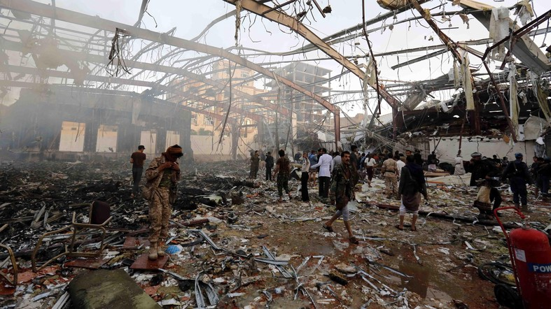
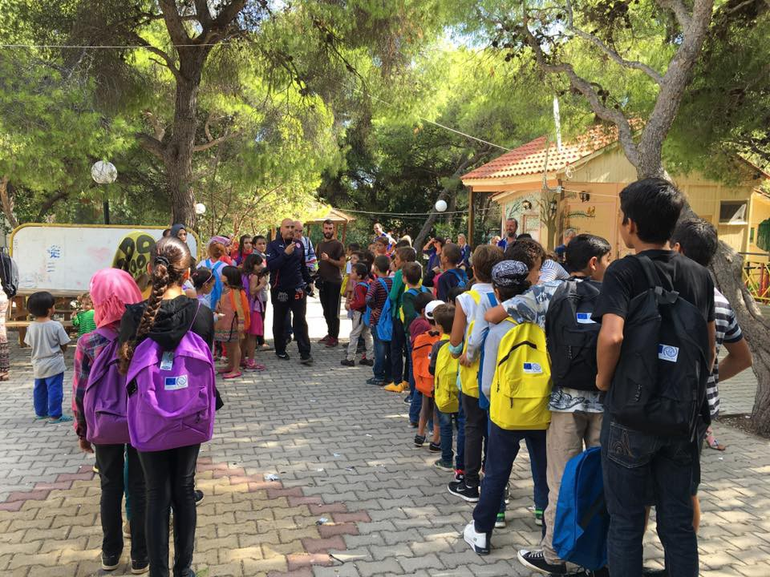
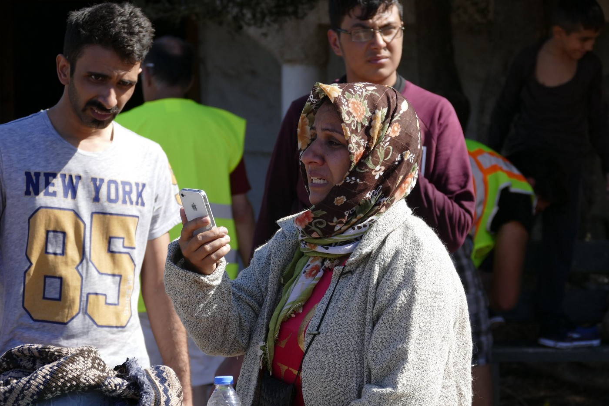
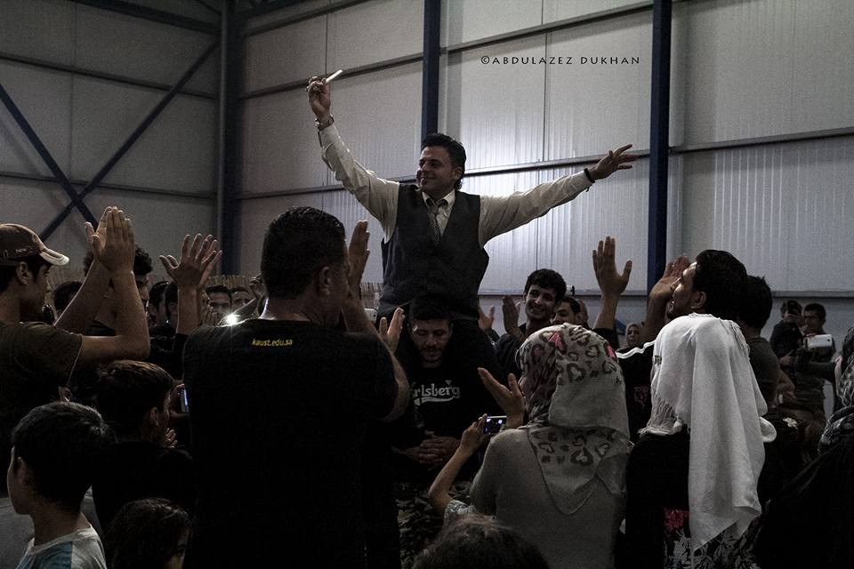
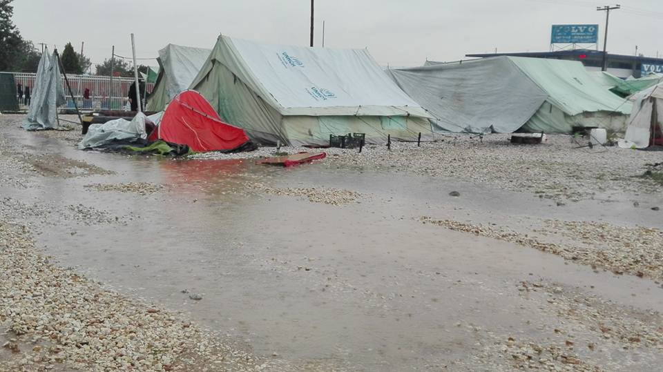
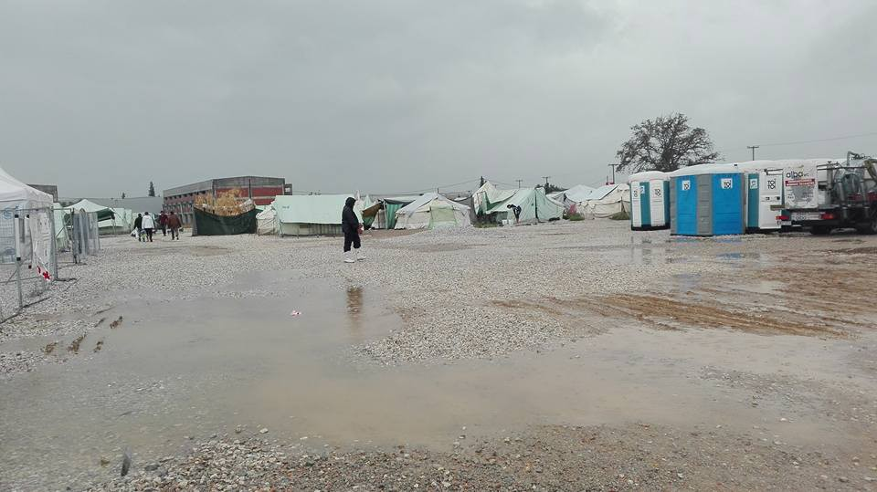
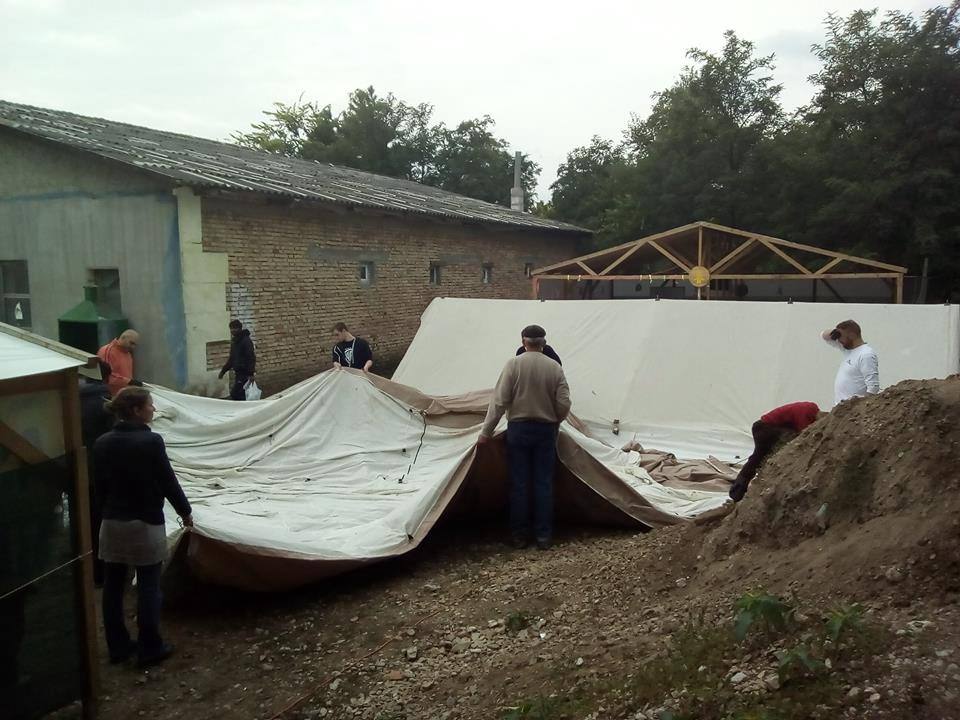
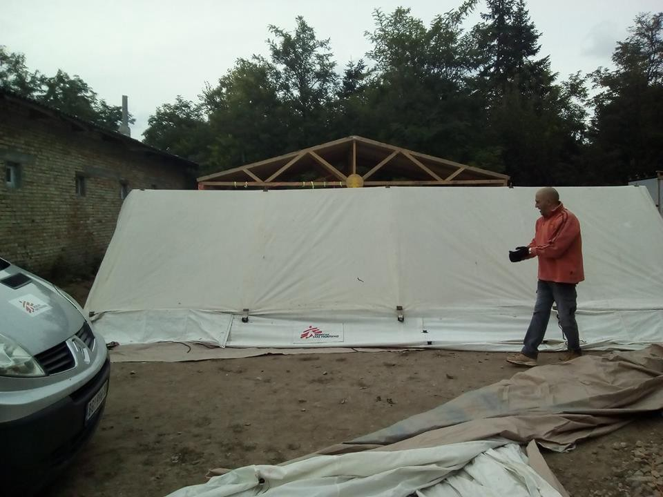
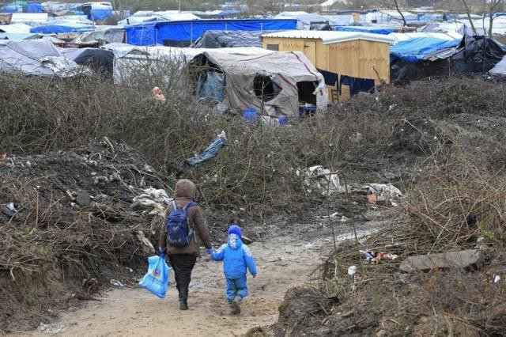

### AYS DIGEST DOUBLE FEATURE 09–10/10 — America condemns the brutal attack that killed at least 140 in Yemen, but let’s not forget who supplies the weapons\.

_Today 1500 children enrolled in afternoon school programs in Greece, but over 18,000 still await placement/ New routes from Turkey emerging / Schedule change for those who have appointments on 12th of December / With the cold and rain here again, donations needed in Greece, France and Hungary / Kelebija community center coming along / France mkes a list of children living in the Jungle — which Britain has previously called upon them to do as a condition of accepting them into the UK / 100 people rescued off the coast of Spain on Saturday_

The aftermath of Saturday’s attack\. Photo Credit; AFP
#### Feature: Yemen

An act of incredible treachery: the bombing of a funeral\. This tragedy unfolded on Saturday, when Saudi coalition airstrikes targeted the funeral of the father of one of the ministers of the Houthi rebel government\. At least 155 people have been reported killed, and over 500 injured, making this one of the single most destructive attacks in the Saudis’ Western\-backed war against the rebel government of Yemen\. So blood\-curdling was this act that the Saudis have come out pledging to launch an investigation, even as they deny any responsibility for the bombing\. Even the US, which generally keeps quiet on its allies’ despicable conduct throughout this intervention, has issued a condemnation\. But what do these words mean when the United States is itself the enabler of this crime, as well as countless others?

The Saudi coalition’s intervention in Yemen began on March 26 after Houthi rebels rose up against the internationally\-backed Hadi government\. While the Saudis are the driving force behind the attacks, the coalition also includes the UAE, Qatar, Kuwait, Morocco, Egypt, Jordan, Bahrain, and Sudan\. The US and Britain, although not members of the coalition, back its efforts, and have provided personnel in the control room to aid the coalition in its guiding of airstrikes\. But perhaps more importantly, the two countries are the main suppliers of weapons which enable these atrocities to go on\.

The US has condemned the attack and has warned that its cooperation with the coalition is ‘is not a blank check\.’ What does this mean in practice? As recently as August, the US agreed to sell the Saudis over 1 billion dollars worth of weapons\. The action passed through Congress in September largely unopposed\. This latest deal starts is only a drop in the bucket, though, given that the US has authorized over 22 billion dollars’ worth of weapons sales to the Saudis since March 2015\. Officials within the State Department themselves admit that the coalition’s airstrikes are largely indiscriminate and account for massive loss of life\. So why then does the aid continue to flow?

The UK is no better\. In the aftermath of the attack, the Conservative government has said that it will not halt its weapon flow into Saudi Arabia, and that it will continue to support the coalition and its relationship with Saudi Arabia\. The country has sold 4 billion dollars' worth of weapons to the Saudis since the bloody intervention\.

Rarely a week passes without news of a new atrocity coming out of Yemen\. Saturday’s attack has caused the most damage thus far, but it’s hardly unique\. Horrific reports of egregious offenses have surfaced since the very beginnings of the campaign\. The Guardian reported on September 15 that the coalition is responsible for 8,600 air strikes since the beginning of the intervention, of which at least 3,158 hit non\-military sites, including schools, hospitals, markets, and mosques\. Some particularly notorious attackeds include the targetting of a market in Mastaba in March 2016 and a wedding in Al\-Wahijah in September 2015, which killed at least 97 and 131 people respectively\.

There are fears within the US government that its stout backing of Saudi efforts may constitute a war crime, and open up routes of legal action against it\. Although US government lawyers have stopped short of reaching such a conclusion, the writing on the wall is clear\. Reuters reports that one email references the results of the 2013 war crime ruling against Liberian president Charles Taylor\. It does not need to be proven that the defendant participated in a particular crime to be deemed liable for war crimes\. Simply, “practical assistance, encouragement, or moral support,” is sufficient\.

Children in Lavirio camp going to school\. Photo: Earth refugee
#### Feature: Greece

Today marks a start of a programme of enrolling refugee children in Greek schools\. Only 20 schools are a part of this programme so far, but the number will supposedly rise in the coming weeks\. Children will attend afternoon classes, with lessons as held from 2pm to 6pm\. As Kathimerini reports “Some 1,500 child refugees are to start lessons at Greek schools on Monday afternoon at 20 schools with another 20,000 refugee children to be inducted into classes at other schools in due course\.” This number represents just a fraction of the number of children that are eligible to receive an education in Greece\. We are not certain if this has something to do with Greek parents initiatives that wanted to prevent kids going to school, or whether there is only a technical reason for such a small number to actually enroll, but it is said that by the end of the month 10 000 more are to follow with the rest enrolling at some later date\.

Regarding local resistance to refugee children attending schools, we do not have concrete information about how widespread these concerns are throughout Greece\. According to reports, it does seem confined to small municipalities and villages in the north of the country\. For example, in one of the villages in this region, police had to escort refugee children to the entrance\. Parents protested outside the schools, shouted insults and horrible lies about their children being in danger of rape or diseases from those coming from the Middle East and Africa\. Official government statements assure people of Greece that no child will be enrolled before it is vaccinated\.

In comments to the state television network ERT on Sunday, Education Minister Nikos Filis said, “Greek society is ready to embrace the children of refugees,” describing opposition by parents at some schools across the country as “isolated cases\.” As for those that managed to get enrolled, Kathimerini reports that the Greek chapter of the International Organization for Migration commissioned 12 buses to transport refugee children from reception centers to local schools\.

In order to not paint an overly dark picture of the current situation, we bring you footage from one of Greek schools where teachers and students wholeheartedly welcomed their new schoolmates\. Beware, such lovely solidarity can bring a bit of a tear in your eye\.

“We should all love each other\!” says the heart
“⁠⁠⁠Can I have a pencil please?” says one child
“Yes, why not, here you go\!” says the other

“Welcome to our country\. “

As the organization Together for Better Days reports: “Today was a big day for the children of Elpida — their 1st day at Greek school\! They arrived to children and teachers clapping and wishing them a warm welcome\. The local kids drew pictures for them\. While there is still so much to be done for the thousands of refugee children living in terrible conditions around Europe, this is a moment of light in the darkness\. Well done Greece\! Thank you for taking care of these kids in a beautiful way\. The feedback was overall very positive and they are excited to go back tomorrow\.”
#### Syria
### Russia vetoed Security Council resolution to end flights over Aleppo, offers its own alternative\.

The draft resolution, proposed by France, would have banned military flights over Aleppo and initiated a ceasefire to allow for humanitarian aid to enter the besieged city\. Russia vetoed the measure, and then proceeded to propose its own draft for a ceasefire, which did not address Russian and Assadist forces’ brutal attacks against rebel\-occupied East Aleppo\. The Russian draft failed to pass as well\.
#### Turkey
### WARNING: Refugees in Istanbul are being targeted by burglars\!

The following message was shared on Facebook:

“FOR YOUR SAFETY, SYRIANS ETC\. IN ISTANBUL PLEASE SHARE:

Burglaries in Istanbul: there seems to be a rise in burglaries and robberies, and it seems that these burglars and robbers are also targeting Syrians and especially non\-Turkish speakers\.

Definitely Syrians should stay away in or be very careful in: Aksaray, Taksim, Tarlabaşı, and Dolapdere\.

The offenders know there is little to no help provided for non Turkish or non\- Turkish speaking people\.

PLEASE SHARE AND KEEP AN EYE ON YOUR BELONGINGS\.
THIS INFO COMES FROM AN INFORMED RELIABLE SOURCE\. TAKE IT SERIOUSLY PLEASE\.”
#### Greece

Refugee woman who landed in Lesvos calls her loved ones to let them know that she safely made the crossing\. Photo Credit: Giorgos Kosmopoulos
### **New routes from Turkey emerging**

It seems that new refugee routes are emerging\. For the first time since EU/Turkey deal, people have landed on the island of Milos\. According to official government reports, as of 8 o’clock in the morning 111 people have landed on the island, which had not seen a large influx of refugees before\. Coupled with reports from Saturday that 131 people were rescued of the coast of the south Peloponnese, it seems that boats are now trying to reach the coast of Italy directly from Turkey, which is a long and dangerous journey\.
### **160 new arrivals today**

As for today, 160 people in total arrived to the Greek islands from Turkish shores: 1 to Lesvos and 48 to Chios, in addition to aforementioned 111 to Milos\. The total number of refugees in Greece is much the same as it was last week, with slight changes from Friday\. In the camps, [\#Cherso](https://www.facebook.com/hashtag/cherso?source=feed_text&story_id=1761269404090425) has seen thr number of people dropping by 300, with 1567 people accounted for on Friday and only 1267 on Monday\. [\#NeaKavala](https://www.facebook.com/hashtag/neakavala?source=feed_text&story_id=1761269404090425) had the same net decrease of 300 people, from 1775 people on Friday to 1475 on Monday\. The number of self\-settled people increased from 7600 on Friday to 8450 on Monday, a net increase 850 people\.

In the week of October 3–8, 678 people arrived on the islands, a daily average of 93\. The daily average for the month of September was 98\.3 arrivals daily, showing a slight decrease\. The specific totals for this week’s arrivals are as follows:

Lesvos: 104
Chios: 378
Samos: 325
Leros: 4
Kos: 9
Kalymnos: 17

Refugees stranded in Greece celebrate a wedding\. Photo Credit: Abdulaziz Dukhan
### **Important: schedule change for appointments on the 12th of December**

There has been a change in a appointment dates for interviews\. Please note that those with appointments scheduled for December 12th should come on December 2nd instead\. You should receive information about this change via SMS, but also please turn to [http://refucomm\.com/](http://refucomm.com/) for more detailed info\.
### **Cold and rain coming again\.**

For all of us who remember the rainy days of last fall and winter, it’s safe to say that we feel a chill down our spine when we see it is coming again, and conditions on the ground have not changed\. There are no words to describe what those most affected by this weather feel, but InterVolve — international volunteers based in Softex camp — tell us,“It’s raining cats and dogs today in [\#Softex](https://www.facebook.com/hashtag/softex?source=feed_text&story_id=350133058658422) \. The whole camp is flooding and most of the tents are not waterproof\. This is just the start of the rainy season and it will get way worse\. People are in desperate need of raincoats and rain boots\. It costs only 6 EUR per pair of rain boots, so please consider donating to help them stay dry\.”

Please donate if you are able to\.

Softex

Softex
#### Serbia
### **Kelebija community center**

In more constructive news, North Star is hard at work constructing a cultural centre in Kelebija\. They also thank MSF for their help\. If we were to judge by the pictures, things seem to be progressing nicely\. All the best, guys\!

Kelebija cultural community center

Kelebijy cultural community center
### Info Park is forced to evacuate the park following permit cancellation\.

Even as it is getting cold in Serbia, and with over a thousand people still seeking aid, Info Park must move out of the park\. In a [Facebook post](https://www.facebook.com/media/set/?set=a.1105472649506998.1073741887.885932764794322&type=3) , the group describes their situation\. No more food is being allowed in the park, as authorities say that food is drawing refugees into Belgrade, and therefore its distribution must be halted\.

Needless to say, this is an extremely cruel decision\. Itremains unclear what will become of the refugees currently in Belgrade\.
#### Hungary
### **Donations needed on the border**

As the weather worsens, especially in the northern sections of the migrant route, MigSzol Szeged posted a message along with a video about the need to work together more on assuring the donations are distributed and arrive to places that need them most\. We bring you the message in full:

“With the help of SOS Children’s Villages Hungary, clothes and other donations were delivered to the people waiting in front of the Tompa Transit Zone, which were gladly accepted by the refugees\. The circumstances at Tompa are still bad, and the situation is further worsened by the difficult accessibility of the camp and the ever colder weather\. We could fulfill most needs and requests so far from the supplies of MigSzol Szeged and our cooperating partners, such as SOS Children’s Villages, but different Serbian civilian and governmental organizations \(such as MSF, UNHCR Serbia, Serbian Red Cross, the Serbian Government’s Commissariat for Refugees and Migration, along with other local and international associations\) also provide a lot of help\.”

#### France
### **No country for children — France made a list, Britain to act on it**

Jungle, February this year

As the stories of Jungle demolition increase, France has urged Britain to take up its responsibilities and relocate unaccompanied minors with family ties in the U\.K\. There are estimated 1,000 unaccompanied children in the Jungle with 178 whose proven family connections in thr U\.K\. make them directly eligible for relocation\. As per usual, however, action is slow, with both Britain and France accusing the other of not doing enough\.

In a move to speed up the process, French Interior Minister Bernard Cazeneuve stated today that the French government has prepared a list of children for relocation, a list that Britain has previously claimed France was slow to make\. British home secretary Amber Rudd said today, “The UK government has made clear its commitment to resettle vulnerable children under the Immigration Act and ensure that those with links to the UK are brought here using the Dublin regulation\.” Rudd also indicated that the Red Cross would be involved in resettlement operations\.

We will wait to see if this list ever reached the home secretary’s hands and whether children will be relocated in due time\. We can only hope that all these words will lead to decisive action on behalf of these innocent children\.
### **The Jungle still exists, and needs volunteers and donations**

In other news from Calais, the Jungle that is still alive and kicking\. Calais4Calais founder Claire Moseley posted a message today stating that they have urgent need of both donated winter gear, and experienced volunteers to distribute it: “We need any volunteers who are experienced in difficult distributions to come over in the next few days\. Many people in the camp have no winter gear — no proper shoes, no coats, no warm clothes\. Once they are dispersed around the country it will be hard, if not impossible, for us to get to them\. We are distributing as much winter gear as possible before the weekend\. The camp is tense, people are scared, distributing right now is very hard\. We need people who are disciplined and experienced\. Please get in touch if you can help\.”
### **A man and a woman die trying to reach U\.K\.**

In horrible turn of events, an Eritrean man has died after he and his partner got hit by a British car on the A16 highway last night\. It is the 14th death since the beginning of the year\.
### **Troubles in Dunkirk**

In other bad news, Utopia 56 organization has reported from Dunkirk camp, “They’re not accepting anyone in the camp since Thursday\. Even the two families that were left outside today, with kids aged 2–8\.”
#### U\.K\.
### **Collect at your local garage and send it out into the world — call for donations from U\.K\.**

A van network is sending a message for aid collection\. As winter approaches, there is an increasing need for aid and projects like this one\. Please read their message in full:

“There are containers of aid leaving from across the nation that desperately need your support\. We don’t have enough aid\. Help fill containers by running a small local collection\. It is an easy way to contribute\. You don’t need a warehouse\. If you can run a collection we can place the aid — you will not be sat with it for long\. A van network is happy to collect goods \(not just a couple of bags\) but a room or Garage full\. Winter is coming and refugees are more vulnerable this year than ever before\. Think snow and sub zero temperatures\. Children shoes and boots — all sizes — high quality — Box by size, tie with strong elastic band\. Adult winter shoes and boots — all sizes — high quality — Box by size, tie with strong elastic band\. Children clothes kits — underwear, trousers, vests, T\-shirts, jumpers — by age i\.e\. 2–3 3–4 through to Teenage\. Warm adults winter clothing — same as children\. Kits preferred but not essential\. Sized as S/M/L/XL\. Hats, gloves, scarves\. Sleeping bags, blankets, duvets, mattresses\. Rugs, camping mats…”
#### Spain
### **Spanish route still active — 100 people rescued on Saturday**

We rarely report from Spain’s borders, but that does not mean that this long\-standing migrant route is any less lively than the more well known ones\. As reported by The Local Es, more than 100 African migrants were saved from the Mediterranean off the coast of Spain on Saturday after attempting the perilous crossing to Europe on a rickety boat\. Rescuers transported 56 people from Sub\-Saharan Africa to Malaga, a spokeswoman said, while 32 other Africans, including 17 women, were taken to the port of Motril, 100 kilometers \(60 miles\) further east\. Sixteen other migrants, originally from North Africa, were taken to Cartagena, 400 kilometers northeast of Malaga\.

For a video of the rescue follow this [link](https://www.thelocal.es/20161009/more-than-100-migrants-rescued-off-spain-in-one-day) \.

_Converted [Medium Post](https://areyousyrious.medium.com/ays-digest-10-10-some-of-the-kids-enrolled-in-greek-schools-majority-still-awaits-9b4168764b20) by [ZMediumToMarkdown](https://github.com/ZhgChgLi/ZMediumToMarkdown)._
