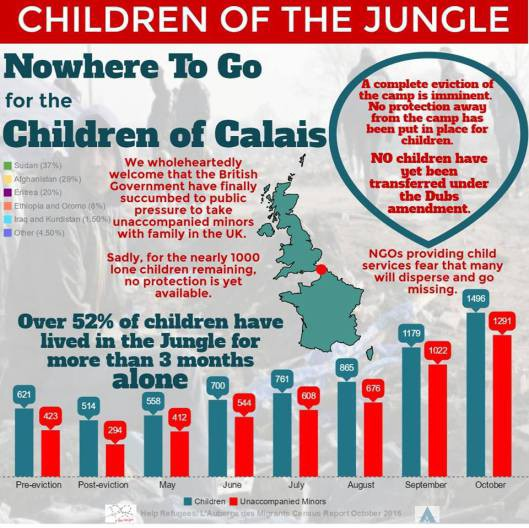
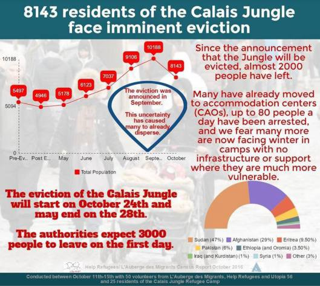
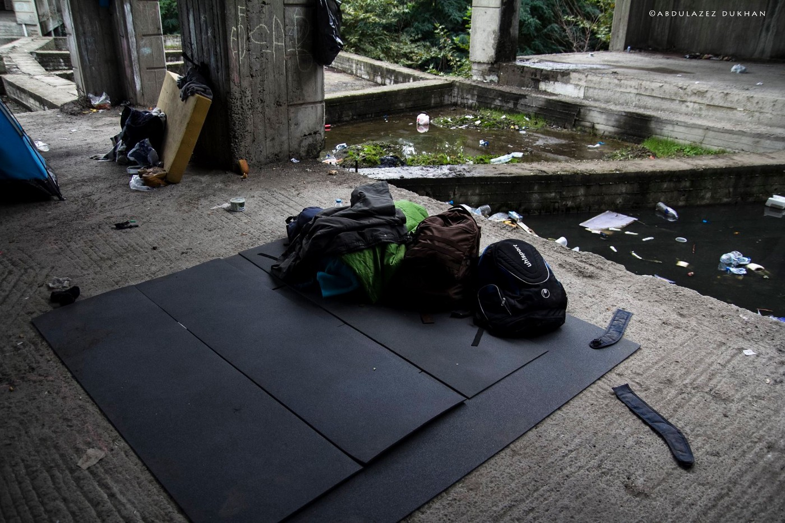
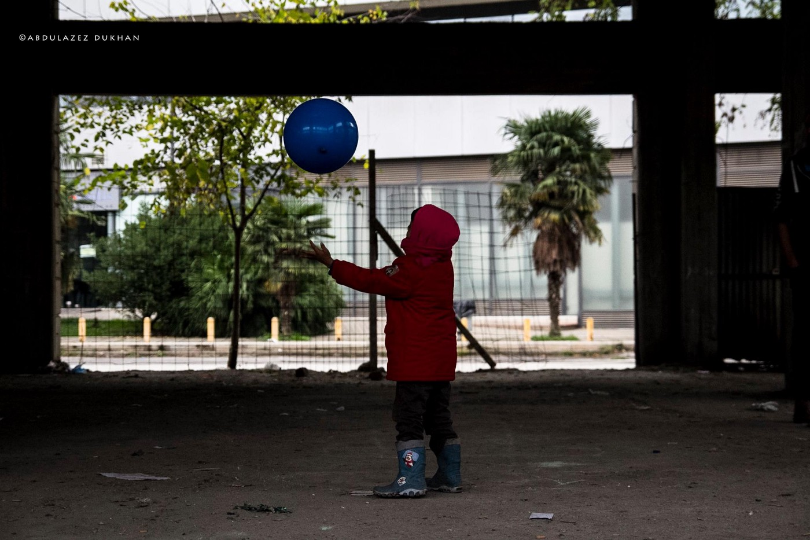
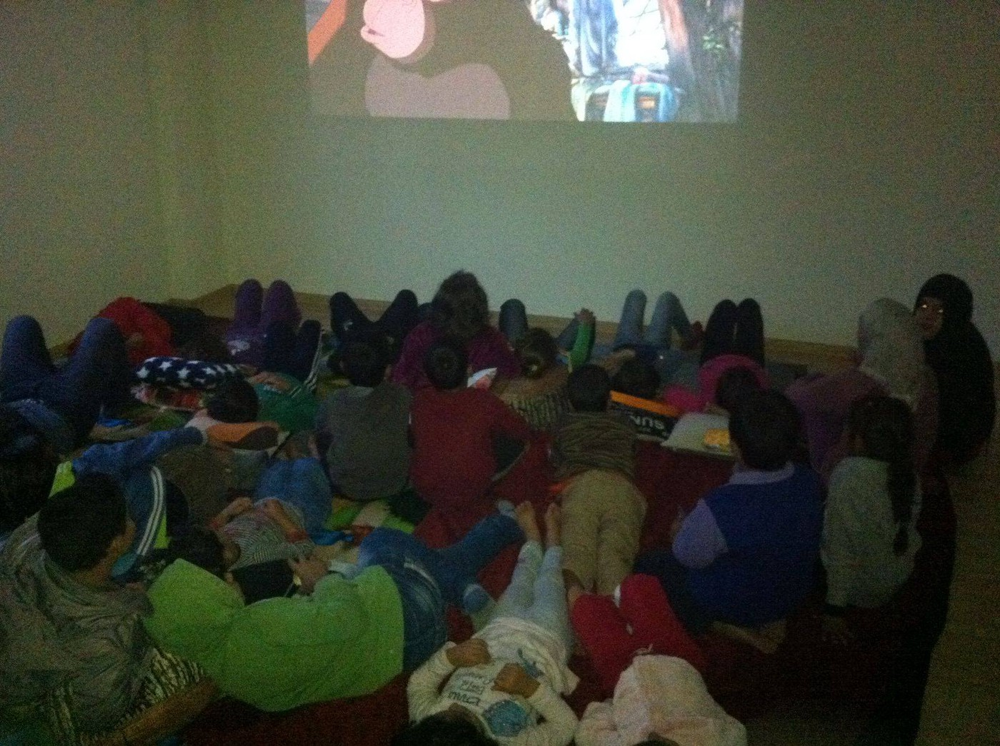

### AYS DAILY DIGEST 23/10: Liberté, égalité, fraternité, but not for everybody\. Definitely not for people of Calais

_Clashes between police and residents of the Jungle before the eviction//Volunteers are sending alarming messages about inhuman treatment of people from the camp//Future of unaccompanied children uncertain//More arrivals to Greece and Serbia and more help needed//Italy is begging for help while after another 5,700 people arrived between Friday and Saturday_

](assets/a448e8a0f73e/1*yyskOdhCZ3TtBb3PRKENgg.jpeg)

Another restless night in Calais\. Night before the eviction\. Photo by [@David\_Churchill](http://twitter.com/David_Churchill)
### Calais eviction

On October 24th, Monday, at 8 am, soldiers and riot police will enter refugee camp in Calais and the eviction will start\. By the end of the week, what was a temporary residence for about 10\.000 people will be bulldozers\. What will happen with them it is still uncertain\.

French government plan is to relocate people to newly created centers around the country, but many are skeptical about this plan\. Clare Moseley, the founder of the [Care4Calais](https://www.facebook.com/care4calais/) , told [the media](https://www.theguardian.com/world/2016/oct/23/france-prepares-to-demolish-calais-refugee-camp) that people who refused to leave Calais are risked to be arrested and deported\. At the same time, she expresses her concern about the wellbeing of the inhabitants when they reach the new centers, which she said ranged from apartments for families to buildings such as converted barns or disused schools\.

Many people did not want to wait for the eviction but left on their own, heading toward the French coast, some to Paris or towards Italy\. But nobody really knows what will happen with all these people who already suffered enough\.

> For all the people who are facing eviction from Calais, here is info document about your right \( [PDF file](https://calaismigrantsolidarity.files.wordpress.com/2010/12/know-your-rights-in-france-english.pdf) \) \. 

Calais census by Help Refugees and L’Auberge des Migrants

The biggest victims of this negligence are unaccompanied children\. After many negotiations and public outrage, UK started accepting some of them\. Unfortunately, even when they arrive, it is not clear what will happen to them\. [The Observer](https://www.theguardian.com/world/2016/oct/22/anger-panicking-home-office-houses-refugee-children-detention-centre-calais) reports about newly arrived child refugees who are being forced to live in a controversial former detention center _“because the Home Office refused to enact a resettlement strategy to safely house unaccompanied minors\.”_

Day before the eviction, all the reports from the field are alarming\. [Calais Action](https://www.facebook.com/calaisaction/) volunteers Caroline Gregory reports about the huge hangar that will be used to process thousands of people in a matter of hours on Monday, concluding _“This looks like an inhuman way to process human beings\.”_ And it is\.

Previously it was explained that all the people in the camp will have to come to a hangar where they will be separated into families, adults, unaccompanied minors and vulnerable individuals, including elderly people and single women\. After that, they will be sent by bus to a network of 450 reception centers across the country\.

This weekend was tense and dangerous in the Jungle\.

 by Gabriel Tizon](assets/a448e8a0f73e/1*eNXC-a0Bz8vQDDV8zYRAwA.jpeg)

Tension in the refugee camp of Calais “the jungle”, due to the imminent eviction\. Authorities announced the eviction and demolition of the camp for the end of the month\. People are trapped in between the borders, traveling for months, living under terrible conditions, and now under the threat of deportation\. [Photo](https://www.facebook.com/artagainstproject/) by Gabriel Tizon

> CALL FOR VOLUNTEERS 
 

> [The MSF Women’s Centre](http://react-text: 566 http://www.msf.org/.../france-msf-denounces-decision...) needs people on the ground to ensure space continues to provide as much as support as possible during what is going to be a difficult period\.
 

> The camp has recently been closed to all new arrivals, including families with young children\. They are left to fend for themselves\. Families in the camp are being denied blankets despite the freezing weather\. The eviction of Calais Jungle planned to begin tomorrow is likely to mean a lot more displaced people in the area with nowhere to go\.
 

> Please email [refugeewomenscentre@gmail\.com](mailto:refugeewomenscentre@gmail.com) if you are able to come out\. 

Describing atmosphere during the weekend, volunteers from the [Refugee Info Bus](https://www.facebook.com/RefugeeInfoBus/) wrote about _“fear, resignation, and frustration, at not knowing what will happen,”_ inside of the camp\.

> “Hotels, camping sites, and hostels have been told that they must provide the passport details to the local prefecture, of all guests\. They have stated that they will not tolerate anyone providing accommodation to ‘activists’ or ‘migrants\.’ The full force of the law is being inflicted on refugees, as the authorities are on the cusp of erasing the more visible face of this “refugee crisis,” from the Calais landscape\.” 

We stand together in solidarity with all residents of the Calais Jungle, hoping that the EU will finally remember values they promote — solidarity, dignity and humanity\. [The European Convention on Human Rights](http://www.echr.coe.int/Documents/Convention_ENG.pdf) in its Article 5 provides that everyone has the right to liberty and security\. Or it is just for the privileged?

Calais census by Help Refugees and L’Auberge des Migrants
### Greece

Today, 20 people arrived at Lesvos, 57 to Samos, 7 to Tilos \(for the first time since EU\-Turkey deal people arrived at this island\) \. Three boats arrived at Chios carrying 64 people\.

Our friend Abdulzez brings a [story about Afghan refugees in Greece today](https://www.facebook.com/throughrefugeeeyes/posts/379880675735042) \.

By Through refugee eyes

**What it’s like to be an Afghan refugee in Greece?**

_Four months ago, when the police closed Idomini — the border between Macedonia and Greece \- Afghan refugees were denied asylum into Europe\. Now they are waiting in Greece and living wherever they can, including in a building next to the train station, where they are often kicked out of by police\. The building has no doors or windows and is just open to cold\. They sleep on the ground or in tents\. Families huddle together on thin mats on the cement to keep warm\. Volunteers distribute food to the refugees every day, but I asked one of the refugees what would happen if the volunteers didn’t show up one day, and he said “ we will go hungry\. We don’t have money to get food and we don’t have a way to make money”\._

_“After a long trip from Afganistan to Greece, it’s really difficult to go back to Afghanistan” said one refugee\. Many of the refugees have tried several times to cross the border on their own, but they keep on getting caught and sent back\. So they are stuck, living illegally without papers and a way to get where they want to go\. When I asked one of them what he hoped for in his situation, he said “ We hope so we can find a big country to live in with our brothers and sisters “_

_These refugees are people just trying to get on with their lives\. What can be done? What would you do if you were them?_

By Through refugee eyes

> [The Mobile Info Team for refugees in Greece](https://www.facebook.com/refugee.info/posts/1186467154746763) is running free legal sessions for asylum in Thessaloniki\. The session is provided ever Tuesday from 7 to 9 pm at Mikropolis Social Space library \(Vasileos Irakliou 20, 2nd floor, on the left\) \. 

In Kavala our friends from the [Northern Lights Aid](http://www.northernlightsaid.org) began with cinema evenings, every Wednesday and Friday\.

Photo by Northern Lights Aid

They are also planning to start screening educational films for adults, but they need your help to do this\.

Want to volunteer or contribute towards these projects?
[www\.northernlightsaid\.org](http://www.northernlightsaid.org) 
VIPPS: 14852 / NORTHERN LIGHTS AID
PAYPAL: [charlotte@northernlightsaid\.no](mailto:charlotte@northernlightsaid.no) 
Bank: DNB
BIC: DNBANOKKXXX
IBAN: NO2515037110989
Kontonummer/Account number: 1503\.71\.10989
### Italy

[Media are reporting](http://react-text: 230 http://www.primocanale.it/.../nuova-tragedia-al-confine..) about a death of a young refugee on Saturday\. He was killed by a car along motorway A8 at Mentone \(close to Sainte\-Agnes\) \.

The incident happened after a series of warning calls from different drivers to the police, referring to a person walking in the wrong way on the road\.

A similar episode happened last 7th October, in a tunnel right after Ventimiglia, where a 17\-year\-old Eritrean migrant woman was killed by a truck while trying to cross the border to France walking on the motorway with her brothers and a friend\. On the same route, another migrant fell and died from a highway a few days before\.

The Italian Coast Guard says 5,700 people were rescued from dozens of small boats and rubber dinghies between Friday and Saturday\. Premier Matteo Renzi is begging for help from his European partners\. _“We cannot go on this way\.”_ He called for financial penalties for eastern European countries that refuse to take in migrants\.
### Serbia

Today in [Miksaliste](https://www.facebook.com/RefugeeAidMiksaliste/) there was 11 men, 22 women, and 386 kids\.

_Converted [Medium Post](https://areyousyrious.medium.com/ays-daily-digest-23-10-libert%C3%A9-%C3%A9galit%C3%A9-fraternit%C3%A9-but-not-for-everybody-a448e8a0f73e) by [ZMediumToMarkdown](https://github.com/ZhgChgLi/ZMediumToMarkdown)._
