### AYS Digest 26\.10: Calais children with nowhere to sleep

_Children left without shelter after Calais fires\. Hungary builds new fence at its border with Serbia\. Record 3,800 die in the Mediterranean\. Deportation of a pregnant woman from Austria to Croatia suspended\._

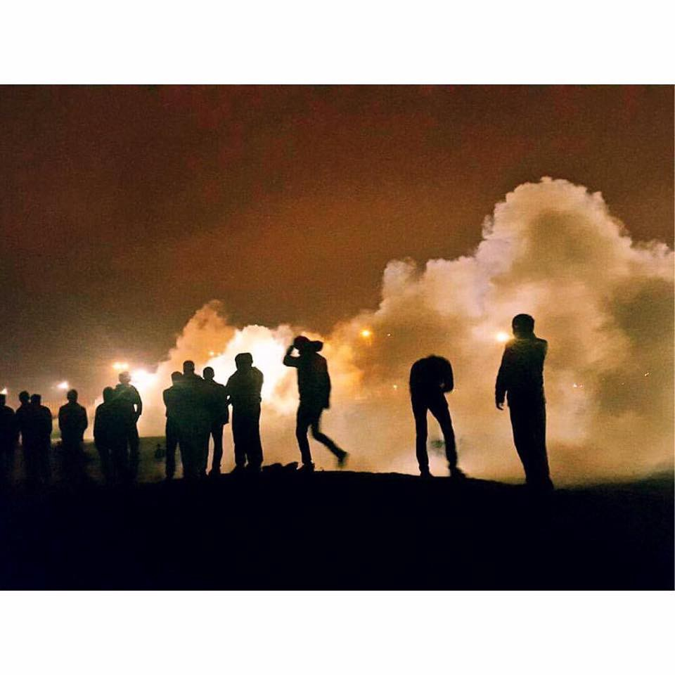

### Children left without shelter after Calais fires

Large fires broke out in Calais yesterday night and continued on today, leaving up to 100 unaccompanied minors without a safe place to sleep and volunteers frantically searching for shelters\.

Calais Action says “ _As night approached, some minors were not allowed to enter the container camp because they did not have a registration wristband as registrations had been cancelled\. The Women’s and Children’s Center reported that the manager of the Jules Ferry Centre refused to let unregistered children into the empty space there to sleep as not having a wristband was a “security concern”\. Some were taken to the warehouse to register, but many still remained outside\. Volunteer groups including Heart for Refugees, Help 4 Refugee Children and L’Auberge helped bring food, blankets, and take those minors left outside the containers to a place of safety in camp_ \.”

Volunteers say the warehouse, where registration takes place, was opened to children unable to sleep in the container camp, but the prefecture refused to take in several kids, forcing volunteers to scramble to find another place for them to sleep\. Help Refugees says “ dozens of children slept on the cold ground in front of the containers they were supposed to be housed in\. Another 40 slept in a school\.”

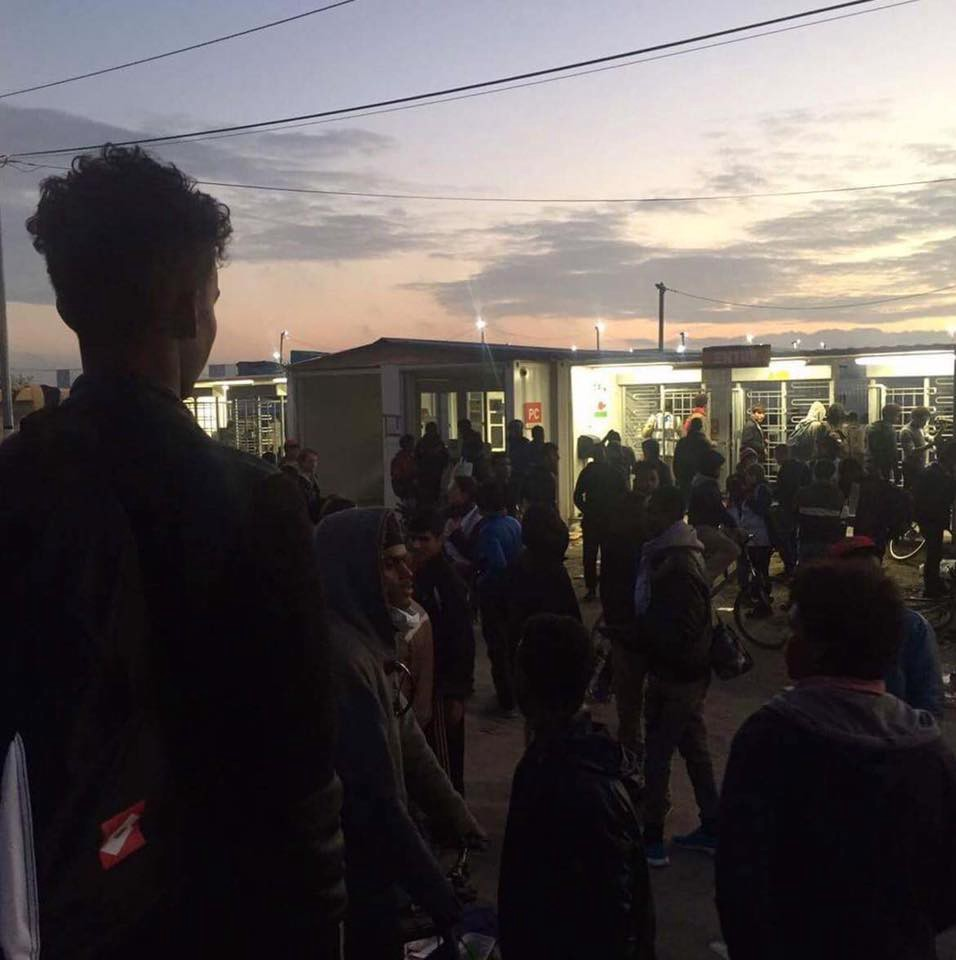

Photo by Refugee Infobus

Around noon today, authorities began to turn children away from registration according to Help Refugees, and asked unaccompanied children to go back to the jungle, were fires were still going on\. The containers were reportedly full\. According to [L’Express,](http://L’Express) the prefecture justified the early closure by insisting that a lot of adults had tried to enter the centre\.

Le Monde reports that on Tuesday, Franck Esnée of MSF saw around one third of those trying to enter the temporary reception centre \(CAP\) be rejected, because an employee of France Terre d’Asile thought they didn’t look young enough\. Le Monde had been the witness of a similar scene on Monday, with the director of France Terre d’Asile himself asking one person to remove his hoodie, and then preventing him from entering the queue towards registration\. The claims have been denied by France Terre d’Asile\. The Pas\-de\-Calais prefect Fabienne Buccio had previously promised that minors whose age is disputed would have the right to an interview to prove how old they are\.

Le Monde also reports that some kids were robbed of the bracelet that allowed them to sleep in the CAP, while others were left on their own devices, as their brothers or uncles left for CAOs\.

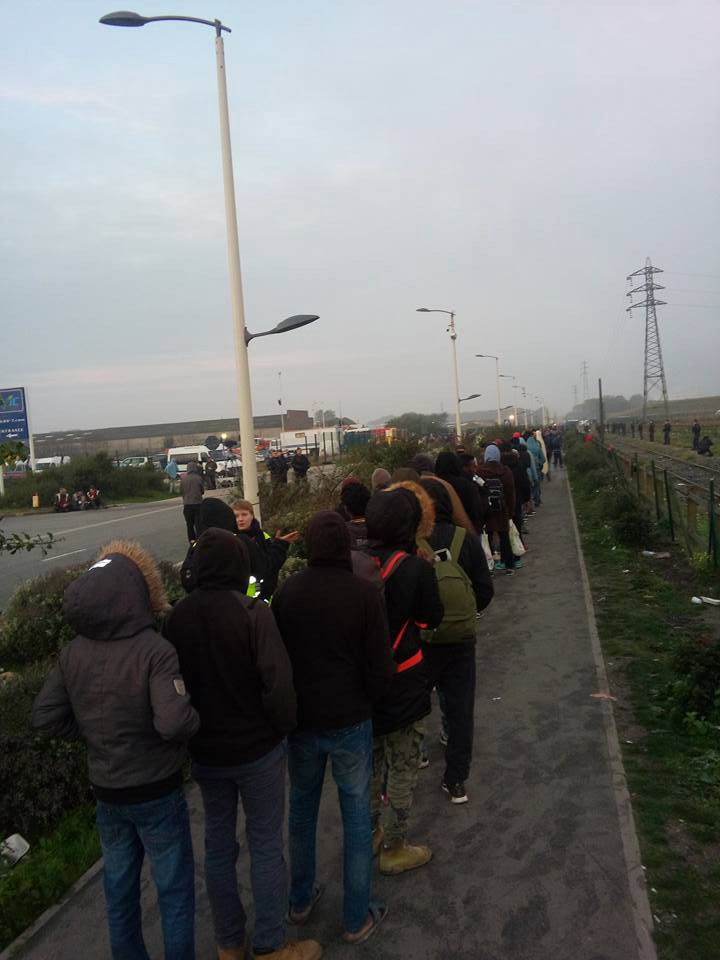

The queue for the minors registration this morning\. Photo by Ifty Patel

France Terre D’Asile director Pierre Henry said that 1,400 kids were registered over the last three days, despite a census of only 1,291 unaccompanied minors, saying numbers got inflated as adults were declared to be minors and more minors came to the camp in recent days\. However, the census was criticized by Jonny Willis of Refugee Youth Service a few weeks ago, saying “it’s ridiculous to try to do a census like this in a place like this in just two days”, while several unaccompanied minors said they had not been registered during the census\.

Help Refugees says around 300 kids were turned away, and Save the Children says around 100 were still in the queue when registration closed\. Unaccompanied minors are supposed to be sheltered in the CAP while French and British asylum experts process their case and examine their potential transfer to the UK\.

Yesterday night, some children had to sleep in the community mosques, while others were forced to sleep under a bridge, according to Help Refugees\.

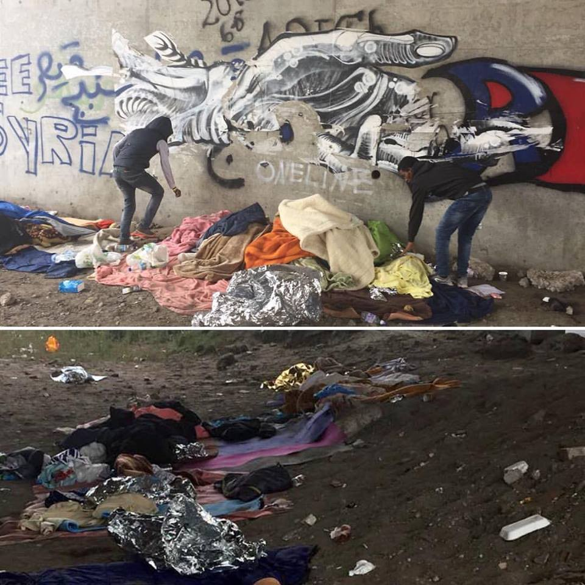

Photo by Help Refugees

As the NGOs had feared, the camp’s destruction is leaving children without protection\.

It is truly incomprehensible that no solution was found for unaccompanied minors beforehand\. Unaccompanied minors, who have a right to come to the UK either through family reunification or under the Dubs amendment, and whom the French state is obliged to protect, are still sleeping in the jungle amidst fires, chaos, and confusion\.

Both the British and French authorities have failed to protect these children\. The Dubs Amendment was passed in May but the first “Dubs children” arrived in the UK only four days ago, and between April and September, only 70 minors joined their family in the UK, despite their legitimate claim to reunification\.

Calais Action says “ _the French authorities have underestimated, underplanned and poorly executed the registrations, and failed in their duty to safeguard the minors in the camp\. The British authorities have failed to hold them to account, and to implement the Dubs Amendment in sufficient time to identify and transfer vulnerable people out of camp BEFORE demolitions\.”_

In an interview with _[Le Monde](http://abonnes.lemonde.fr/europe/article/2016/10/26/calais-une-dizaine-de-centres-d-accueil-pour-mineurs-vont-etre-ouverts_5020910_3214.html)_ , the region’s prefect Fabienne Buccio said one bus with unaccompanied minors left at 18:00h today towards a special “welcome and orientation center” for children in Meurthe\-et\-Moselle, while another will leave for Charente\-Maritime later tonight\. She adds that around ten other centers will open in the upcoming days but insists that negotiations continue with the UK so that children can enter the country through family reunification or the Dubs amendment\.
### Volunteers dismiss the prefect Fabienne Buccio’s claim that “there are no more migrants in the camp”\.

InfoBus says today’s and yesterday’s fires destroyed community centers, restaurants, and shelters\. Among the destruction were structures such as Baloo’s Youth Centre, the Women and Children’s bus and Hummingbird Project’s safe space for young people\. One 17 year old was injured and taken to the hospital\.

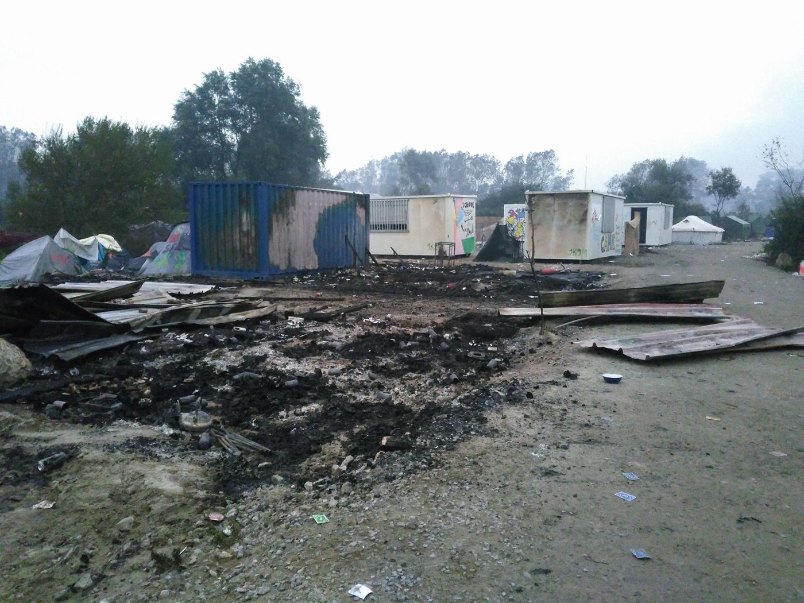

Photo by the Hummingbird Project

Many of the fires were contained by volunteers, before official firefighters got there\.

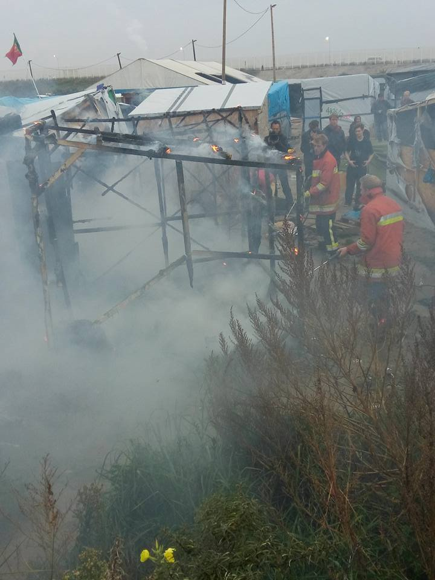

Photo by Ifty Patel

Refugee Infobus says police prevented anyone from entering the camp during the fire and many were left without nothing\. Police allowed people back into the camp around 4PM\. Infobus says more than 50% of the camp’s infrastructure remains intact\. Some will sleep in the surviving tents, and others will sleep outside the camp\.

[Les Echos](http://www.lesechos.fr/politique-societe/societe/0211433148468-jungle-de-calais-ou-en-est-on-2038079.php#) reports that according to the prefecture, 4,457 have left the camp for “welcome and orientation centers”\. Calais Action said that people had been queuing at the warehouse since 2am today to escape the fires and be first in line for registration\.

The region’s prefect Fabienne Buccio claimed that the camp’s eviction had been successful, saying “there are no more migrants in the camp” and adding “”our mission has been fulfilled\.” Her message was rapidly propagated by newspapers including the BBC despite volunteers’ denials, as hundreds of refugees are still there\.

Refugee Infobus reported that authorities had said the last bus would leave at 8pm, despite many people remaining, and the French authorities having said that registration would continue as long as needed\. The fear is that many refugees could be stranded in the camp despite being willing to go to CAOs\.
### Many refugees unwilling to leave

Not everyone is willing to leave for French CAOs, with many still hoping to reach the UK\. [Al Jazeera](http://www.aljazeera.com/news/2016/10/refugees-fear-separation-calais-eviction-161026051030988.html) reports that about 40 Syrians are holding out in Calais as they hope to join immediate family in England\. Yamin, from Damascus, says “We have families in England\. My wife is in England too\. The French government is giving us just one month in the refugee centers and after that we don’t know what it’ll do\. We still have the same issues, we have to go to England but how, we don’t know”\. Mohamed Khalid, from Aleppo, wants to reunite with his wife and four children, saying “I don’t want to stay in France because I have no one here”\. The refugees fear that by claiming asylum in France, they would have to undergo a lengthy asylum process that would prevent them from permanently settling with their families in the UK\.

Women in Calais have also staged a protest, demanding to reach the UK\.

[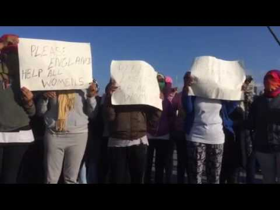](http://www.youtube.com/watch?v=iRZQEpvbkto)

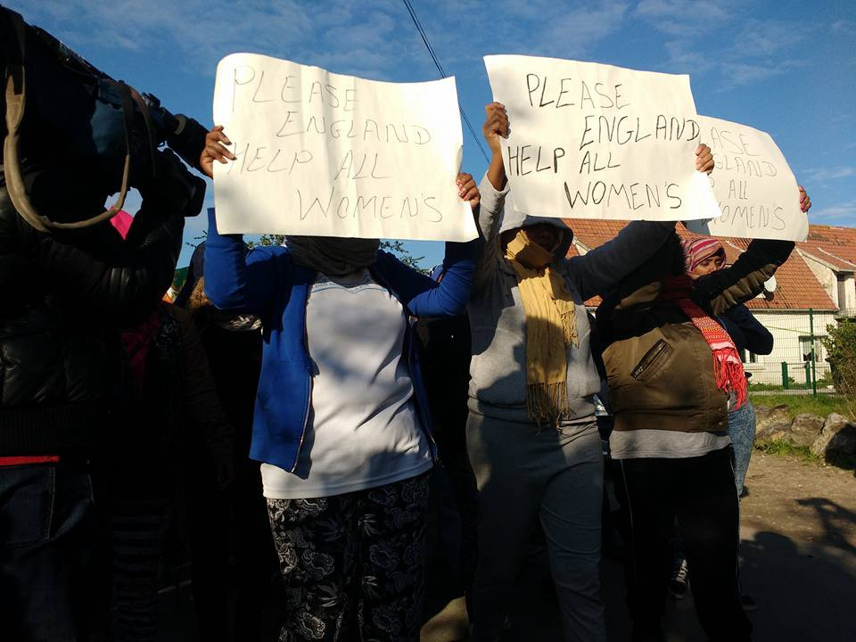

Photo by Annie Patricia Gavrilescu

François Guennec, of L’Auberge des Migrants, believes between 3,000 and 4,000 refugees could have left on their own design\. Several refugees from Calais have already arrived in Brussels and Parisian volunteers expect people to arrive soon\.

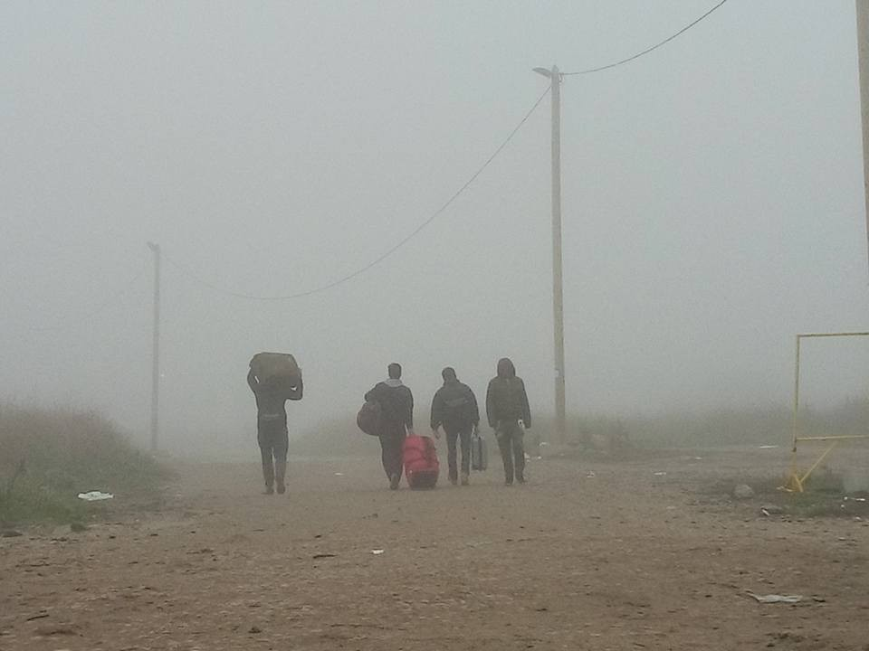

Photo by Ifty Patel
### How You Can Help

**Organizations on the ground can call on people to take action** by contacting their local MPs, media, and Amber Rudd and Theresa May to pressure them into finding a solution that protects these children immediately\.

[**Phone Credit for Refugees**](https://www.facebook.com/groups/1709109339334305/) **still needs donors\.** They provide refugees with phone credit, enabling them to stay in contact with friends and family\. This also keeps unaccompanied minors safe and connected, giving them “the only safety net they have”\.

**Stay informed about French “welcome and orientation centers” \(CAO\)** by following this [Facebook page,](https://www.facebook.com/Info-CAO-484548968414251/) which provides volunteers across France with resources and information\.

Thank you Refugee Infobus, Help Refugees, Care4Calais, Calais Action and many others for their solidarity with refugees and the invaluable information they continue to provide\.

#### Greece
### Clashes reported in the Vial hotspot of Chios

KeeptalkingGreece reports on clashes in the hot spot of Vial on the island of Chios\. The website says incidents broke out after a group of refugee women protested the slow asylum procedures outside the mobile offices of EASO\. The dispute quickly escalated, with an asylum worker, a policeman, and a female refugee injured [during the clashes\.](http://news.in.gr/greece/article/?aid=1500110841)

More than 15,000 refugees are trapped on Greek islands, with most refugee camps packed to double their capacity\.

[Ekathimerini](http://www.ekathimerini.com/213185/article/ekathimerini/news/pm-to-chair-crisis-meeting-after-unrest-at-migrant-centers) reports Prime Minister Tsipras will hold a meeting on Monday to discuss the situation on the islands and at mainland camps\.
### Updated Info at W2EU in Arabic, Farsi and English

The Welcome to Greece Guide is now available in Arabic, Farsi as well as English\.

The guide includes:
 1\) a chapter on the situation on the islands for all refugees since the EU\-Turkey deal on 20th of March 
 2\) info for those on the mainland 
 3\) detailed information on family reunification and relocation
 4\) useful contacts mainly in Athens and Thessaloniki\.

Arabic: [http://w2eu\.info/greece\.ar\.html](http://l.facebook.com/l.php?u=http%3A%2F%2Fw2eu.info%2Fgreece.ar.html&h=-AQHBJREBAQHVF2NxT3WXSdhR76ObgKMzkX_AZZYZk5ea0w&enc=AZMVxyhx6CzrVibqeCJ58IgsF04xvKPYnDUVa0Xqo3ZXlYngAZOQJ19T0-SRdunUwIY-WiNqnwBYIRNW_CXaX6414BEtbTBSfF0QuUEvC0OBxIJfJMg5Wq-RtBpx5J49hBukephL2v0F6B6AG9dQ1or0p6Gm6OWcB0bKJGVGhZna3JbZHWscTy3NUNyC_Xa_LVY&s=1) 
 Farsi: [http://w2eu\.info/greece\.fa\.html](http://w2eu.info/greece.fa.html) 
 English: [http://w2eu\.info/greece\.en\.html](http://l.facebook.com/l.php?u=http%3A%2F%2Fw2eu.info%2Fgreece.en.html&h=_AQHLSUTQAQEf94on7ZSZFtN5UJTsy8bSiMOuS__1rdomqA&enc=AZPD-TAIEinUQvfEiVJr-aRz307fxT01sUXEHuuMbREaacn0lKZZMvru8poUxgmTzOfi6jyYvLx1hyixPgmDf-OkyCetVus1SixLzU54R9t57RZsrtV-XdeAVVsycS4ApJ_zAmUFGQoApOdukaAFuOz9i5GB8JWCBSrK9dyeKm4BYE8zQ94K_aZZskjDpidU_0o&s=1)
### New Volunteers needed
- ERCI is looking for volunteers to join its team at [Elpída Home](https://www.facebook.com/elpidafactory/) , a humane refugee accommodation facility in the outskirts of Thessaloniki Northern Greece, to help run its daily routine while optimizing the residents’ daily lives and well being\. More information on the team’s [website](http://t%20http://www.ercintl.org/volunteer/) \.
- Arabic, Farsi, English speakers are needed for the remote support of young refugees looking to learn new skills online\. The role involves reviewing current online resources, defining a study plan, and checking on them once a week\. More information available on [Greecevol](http://greecevol.info/task.list.php?ID=354) \.

#### Serbia

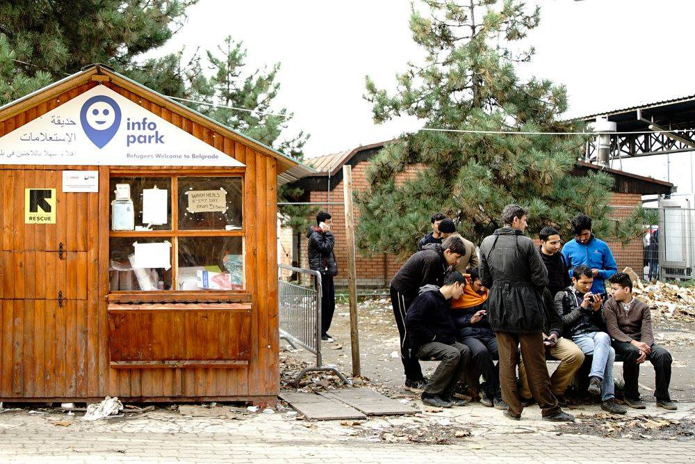

Photo by Lazara Marinkovic

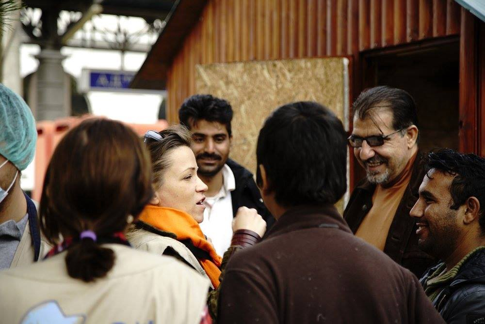

Photo by Lazara Marinkovic
### Info Park’s last day

Today was the last day for Info Park’s hut in the Bristol Park of Belgrade\.

Info Park says “ _In 13 months in this location, Info Park has serviced tens of thousands of refugees with information, connectivity, food, humanitarian aid, tickets and logistical support\. There was laughter, there were tears, we enjoyed the sunshine, got hit by snow and pouring rains, we played football and danced but also witnessed tensions, sickness, and despair\. A lot of people worked, helped, and supported us along the way and I thank them all\.”_

Info Park will continue its work, albeit in another form, starting November\.
#### Hungary
### Hungary starts building new fence

[Euronews](http://www.euronews.com/2016/10/26/hungary-builds-new-fence-to-keep-out-refugees?utm_source=dlvr.it&utm_medium=gplus) reports that Hungary has started building a new fence on its southern border with Serbia as part of its efforts to keep migrants and refugees from freely entering the country\.

The government said the new fence which will have electronic surveillance equipment, and was needed in case a new surge of people moving towards Western Europe appears\.

Last year, Hungary built fences protected with razor wire along some 175 kilometers of its border with Serbia and shorter sections on the border with Croatia\.
### Trial of Ahmad H\. starts on Friday

[FreetheRozke11](http://freetheroszke11.weebly.com/) says the last trial of Ahmad H, one of the Röszke 11 accused of violating the border fence during a mass disturbance, will take place on the 28th of October\.

_Freethe Rozke11 says “the Syrian man is accused of terrorism, and — as the judge said on the last trial — he can be sentenced to life\-long imprisonment\._

_In the last months we organized several demonstrations in Hungary along with solidarity demonstrations in other countries\. During this time we had to face with the extremely corrupt and biased approach of the court and generally the Hungarian legal system, and the police repression against our activity\._ 
_Two weeks ago, just before the trial, Ahmad’s lawyer resigned and we had to work very hard to find a new lawyer\. The NGO’s which provide free legal help — that is a very limited number in Hungary — ultimately didn’t take the case\. At the moment Ahmad has a state lawyer, who is apparently trying to do his best\. He would like to postpone the trial and get different narratives of the happenings than the current ones, that is mostly the testimony of the police\. For that we are looking for video materials, photos, and personal testimonies from people \(journalists, activists\) who were present at the border on the 16th of September 2015\._

_We will organize a smaller demonstration in Budapest on the 28th of October at Deák Square\. At the same time demonstrations will take place in Vienna, in Berlin and in Malmö\. On the 3rd of November we plan to organize another demonstration and press conference”\._

The group suggests several actions to support Ahmad H:
- _“Contact us if you were on the Röszke/Horgos border when the protest happened, and if you could provide video materials or/and you’d be willing to give testimony at the court\! Contact people who were there\! The deadline is the day of the trial, that is the 28th of October 9:00, but the lawyer wants to send the details before\. He needs nothing other than the name and address of the witness”_
- _Come to the demonstration to Budapest\! After all the confusing information about the trial we couldn’t make a wider international call to protest, but we really would appreciate it if you could join us on the 28th of November\. Write us if you can come\!”_
- _Organize solidarity demonstrations in your city, for example in front of the Hungarian Embassy\!_
- _Share the information to NGO’s/groups etc\.”_

#### Austria
### Deportation from Austria to Croatia suspended

The European Court of Human Rights has suspended the deportation of a pregnant woman from Austria to Croatia and wants to further investigate the level of medical access of refugees have in the country — if more detailed information is available on the extent of, or lack of medical services, many other deportations could be suspended\. In the claim, the legal representative quoted the recent report from Porin published in Novosti\. The court’s ruling shows that deportations can be inadmissible even if there are no systematic deficiencies in the country’s asylum system — individual circumstances can be enough to prevent a deportation, if the circumstances mean that basic rights could be violated\.
#### Mediterranean
### Deaths rise in the Mediterranean despite drop in people making the journey

The [INYT](http://www.nytimes.com/2016/10/26/world/europe/migrants-mediterranean-deaths-united-nations.html?_r=1) covers UNHCR figures showing deaths among migrants crossing the Mediterranean from North Africa to Europe are to overtake the fatalities last year despite a sharp fall in the number making the journey\. The figures show at least 3,740 people had died by the start of this week, compared with 3,771 in the whole of 2015\. UNHCR spokesperson William Spindler said of the situation, ‘this is by far the worst we have ever seen\.’

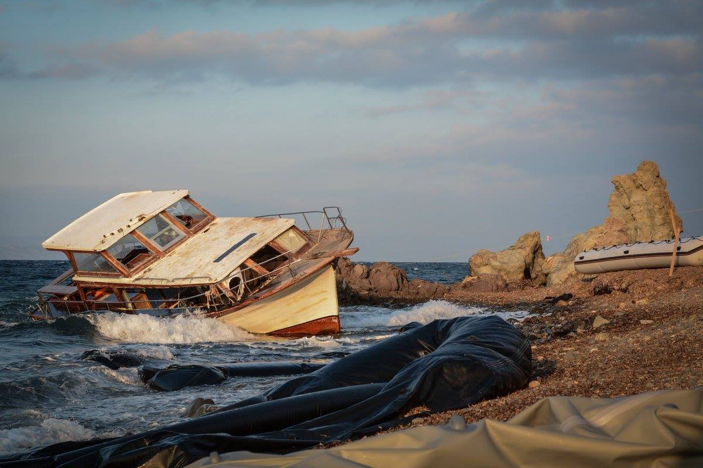

Photo by Irish Emergency Logistics Team

According to [Reuters](http://uk.mobile.reuters.com/article/worldNews/idUKKCN12Q1N3) , twenty\-five refugees were found dead in the bottom of a rubber boat after apparently suffocating from inhaling fuel\. The boat was rescued 25 miles off the coast of Libya by MSF and carried 106 survivors\.

MSF said on Twitter:

**_“Sea rescue operations are becoming a race through a maritime graveyard and our rescue boats are powerless to stop the loss of life”\._**

_Converted [Medium Post](https://areyousyrious.medium.com/children-left-without-shelter-after-large-fires-in-the-jungle-dd9301cff389) by [ZMediumToMarkdown](https://github.com/ZhgChgLi/ZMediumToMarkdown)._
