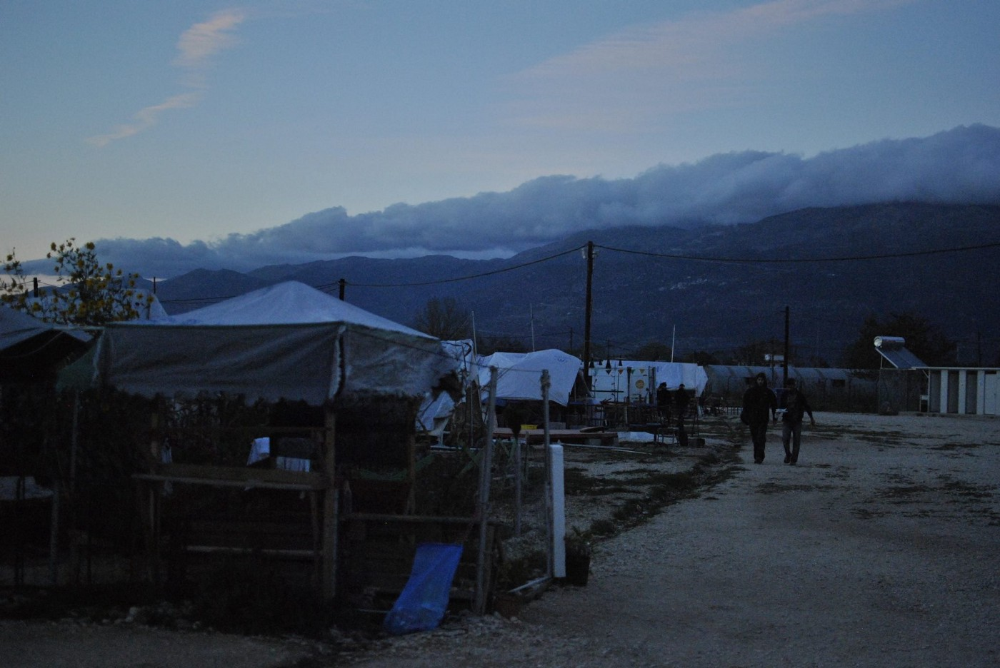
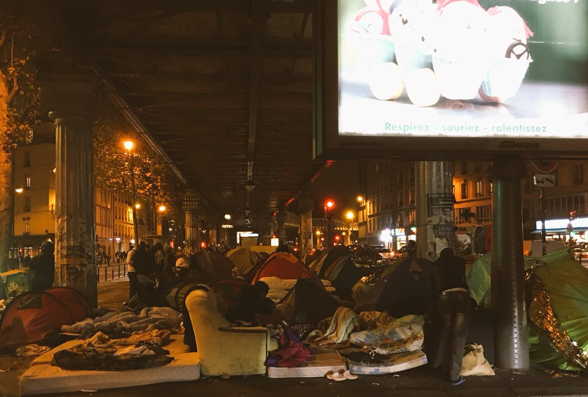
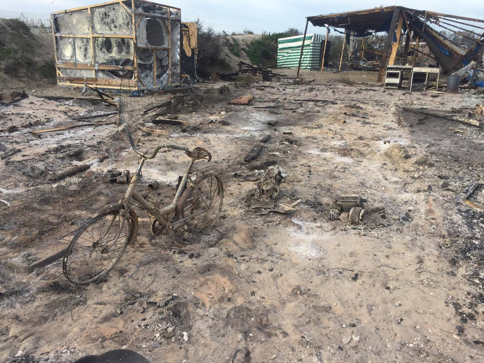

### AYS Daily News Digest 28/10: Political ping\-pong comes at a high cost to the most vulnerable

_A year after the Aegean tragedy, NATO expanding its mission in the Aegean sea / AI investigation proves Greece forced illegal returns of Syrians to Turkey / Röszke11 Ahmad H\. trial a symbol of absurd extent of criminalizing refugees / Calais evacuation plan reveals itself as a failure and danger for the youngest refugees / France and the UK continue dispute over the responsibility for the Jungle minors / Croatia continues receiving “Dublin” deportations from EU countries_

 \)](assets/c57f67499f43/1*IYaNa0Q9WmrYHScBR2xyJQ.jpeg)

A young Calais resident during the Jungle evacuation \(Photo credit: [Art Against](https://www.facebook.com/artagainstproject/) \)
#### SEA
### In spite of a general, deliberate lack of action — still saving lives accross the Mediterranean, one year later

In the afternoon on Wednesday October 28, 2015, a large wooden boat carrying around 300 people sank off the coast of Eftalou, about 2\.5km from the shore of the island Lesvos in Greece\. Dozens died that day\. 
Eric Kempson from Lesvos reflects on the tragedy:

> Even though this is a tough day for all of us, I look back at the bravery of so many individuals and I am proud to know them all and want to offer our thanks for them putting their lives on hold to be here and to answer the plea for help\. Our thoughts are with all those lost and our hearts are with their families and loved ones\. Sadly the sea has claimed **3930** people since January 2016, this is the human cost of [\#FortressEurope](https://www.facebook.com/hashtag/fortresseurope?source=feed_text&story_id=1235819693155429) \. 
 

> We and others remain here and will continue to help suffering human beings forced to make the treacherous and sometimes fatal journey to a safer life\. 

### NATO expanding its mission in Aegean

NATO defense ministers meeting in Brussels have agreed to cooperate with the EU in further cracking down on human smuggling in the Aegean Sea\. The alliance’s Secretary\-General Jens Stoltenberg said the mission that began last February will be expanded\. NATO’s new maritime security mission in the Mediterranean, known as Operation Sea Guardian, will operate in support of Operation Sophia, the EU’s anti\-smuggling mission, [Ekathimerini](http://www.kathimerini.gr/881084/article/epikairothta/politikh/synexizontai-oi-epixeirhseis-toy-nato-sto-aigaio) reports\.
#### GREECE
### Greece forced illegal returns to Turkey

An investigation has confirmed the accounts of Syrians who were rescued in Greek waters, taken to the Greek islands and then deported to Turkey\. The refugees claim they were falsely told that they were being transferred to Athens; instead they were flown under escort of officers from the EU border agency \(Frontex\) to Adana, Turkey, in a violation of international and EU law\.

We [reporte](https://medium.com/@AreYouSyrious/ays-news-digest-21-10-countless-people-in-dangerous-conditions-while-the-official-processes-go-16a3b19823b0#.sb89pmf13) d about these cases, which have now drawn the attention of major organizations: the UNHCR expressed “serious concern” over the handling and whereabouts of the people\. [Amnesty International](https://www.amnesty.org/en/latest/news/2016/10/greece-evidence-points-to-illegal-forced-returns-of-syrian-refugees-to-turkey/) has also seen official documents recording the intention to apply for asylum for eight members of this group and is investigating two additional cases of individuals returned on the same flight\.

> This is at best incompetence, and at worst a cynical attempt by authorities, under ever\-growing pressure from the European Union, to remove Syrian refugees from the country at any cost\. 

> — John Dalhuisen, Amnesty International 

Cold days arriving, camp Katsikas \(Photo: Muhammad Ali\)
#### Calls for volunteers

**Athens** : [The Schoolbox Project](http://www.schoolboxproject.org/) urgently needs volunteers that are available November 1–10:

“ Calling all credentialed teachers, art therapists, occupational therapists, psychologists, musicians, social work professionals, 1:1 educational aids , translators, sports coaches and basic volunteers with experience with children\! We are a mobile schoolhouse and art and play center that delivers all services through a lens of trauma informed care\.”
Exceptions to minimum time requirements can be made if you are available during this window\. Please visit their [Facebook page](https://www.facebook.com/theschoolboxproject/?ref=page_internal) or website for more information and write schoolboxvolunteers@gmail\.com with interest\.

**Samos** : Samos Volunteers needs help to run multiple English classes in the camp at various levels, ranging from beginners all the way to advanced and they are growing everyday\. Consider coming to help them keep up with the great demand for English lessons by submitting your application on their [website](https://samosvolunteers.org/2016/09/05/volunteers-info/) \.

Please check out the [**GreeceVol**](http://www.greecevol.info/task.list.php) website to find all updates on volunteering needs and opportunities in Greece\!

 **\)**](assets/c57f67499f43/1*BOl5EylmtCC18_hOsjchjg.jpeg)

Red Noses International mission in Greece has ended \(Photo: [**Red Noses International**](https://www.facebook.com/rednosesinternational/) **\)**
#### HUNGARY
### **Unprecedented treatment by the authorities — international support and media attention needed**

Today was the first trial of Ahmad H\. from the Röszke11\. The judge in the case refused most of the 25 defense’s suggested witnesses, mostly journalists and activists, while only allowing a policeman to testify\. At the trial’s next meeting on November 30, the judge but will examine the new, better video material for the next trial\.

In the meantime, activists and many supporters are determined to use this time to raise awareness and protest against the unjust treatment of Ahmad, one of the 11 people arrested among the several thousands who protested the closed borders in September of last year\. For more information on the case, follow the [Migszol](https://www.facebook.com/migszolcsoport/?ref=page_internal) group\.
### Hungary’s vilification of refugees continues

Hungary will sue the European Commission and resist mandatory migrant resettlement quotas if Brussels does not take them off the agenda, Prime Minister Viktor Orban said on Friday, [Reuters](http://uk.reuters.com/article/uk-hungary-orban-idUKKCN12S0RV) reports\. “This will be a big battle, and for this we need the \(amended\) constitution,” he said\. After having built a 175 km\-long razor wire fence last year, Hungary is now [building a new](http://will have electronic surveillance equipment, is needed in case of a new surge of people moving toward Western Europe.) fence on the border with Serbia\. It will have electronic surveillance equipment, according to the government\. They claim it is needed in case of a new surge of people moving toward Western Europe, they claim\.
### FRANCE
#### PARIS

Between the Stalingrad and Jaurès metro stations, there is a growing number of people who came from Calais and other parts of the\. country, joining those who were already staying there\.

 \)](assets/c57f67499f43/1*mjhpcWhaofO39PxMgh4Bzw.jpeg)

Tents and sleeping places around the Stalingrad Metro station in Paris on the night from Thursday to Friday \(Photo: [Remy Buisine](https://twitter.com/RemyBuisine) \)

This Friday morning, the area was raided by the police, who were checking IDs and asylum papers of people who have been staying in tents in the cold streets\. Afterwards, the people tried to set up their tents on the same messy and inhospitable ground again\.

According to our sources, some refugees who seek asylum in France have been staying in such provisional camps in the city for six weeks now, but have been told there is not enough places to accommodate them in reception centres of the city\. The city authorities [claim](http://uk.businessinsider.com/migrants-forced-to-leave-calais-pitching-tents-on-the-streets-of-paris-2016-10?IR=T) the state has the responsibility to take care of these people, not the city of Paris\. Reuters reports that Paris has plans to open two migrant centers that would host up to 1,000 people\.

 **\)**](assets/c57f67499f43/1*50PnrxLT_h7CgUH6ojsLmw.jpeg)

The morning of Friday, October 28, in Paris \(Photo: [**Rose Lecat**](https://www.facebook.com/rose.lecat) **\)**

 **\)**](assets/c57f67499f43/1*W3C4xqcQdbQgHkZX3KClfw.jpeg)

This Friday morning in Paris, an area that has a large number of women staying in the refugee tents \(Photo: [**Rose Lecat**](https://www.facebook.com/rose.lecat) **\)**
#### CALAIS
### Jungle evacuation — a systematic failure

Bulldozers continue to work their way through through the Calais camp as the forced evacuation continues and the last buses come to take the residents of the Jungle to reception centres across the country\. People waiting in the cold for the announced buses were still being served tea and food by the Refugee Community Kitchen, Calais Kitchens and One Spirit Ashram Kitchen teams\. Volunteers were doing their best to provide help, sleeping bags and blankets, and to support those who are still waiting in Calais, especially the young refugees, children and minors, who once more spent the night out in the open, in demolished campsite area\. Vulnerable children slept under bridges, outside warehouses and in the Jungle camp itself, which has become an increasingly volatile environment\.

_“It’s disappointing to see this being reported as a ‘success’ when so many vulnerable children have been left behind and so many more have run away\. We may never know where they’ve gone,”_ the [Save the Children](http://www.savethechildren.org.uk/2016-10/children-calais-still-sleeping-rough-fires-burn-jungle) team warns\.

Calais Jungle demolition, day 4 \(Photo: Abdul Afzali\)

> We knew when they told us it would take three days that this was far\-fetched\.
 

> But we were given so many assurances that children would be prioritized, and we had to believe this and try to help the process work\. 
 

> \(…\) Now, on Friday, I am left feeling confused\. Why force a 5 day job into 3 days? Why not make sure children were out before bringing in the digger? Why put so many children in danger?
 

> — [continue reading](http://blogs.savethechildren.org.uk/2016/10/frontline-calais-put-many-children-danger/) the reaction in a blog post by J\. Willis of the RYS 

#### Everything about this operation has put children in danger

According to volunteer organisations on site, some volunteers assisting the evacuation were told to rush already traumatized children onto buses\. Under penalty arrest, the young people were forced to board the buses taking them to unknown destinations unknown\. Shipping containers provided by the French government, house over 1500 young people in a fenced\-off section of the camp\. They are now full and it is clear that once more, there will be young people spending the night on the cold ground of Calais\.

> Volunteers are [calling on](https://www.facebook.com/RefugeeInfoBus/videos/1853156161586470/) the UK and French government to urgently find a solution for hundreds of vulnerable children, sleeping on the street, next to the destroyed Jungle, for the 4th night in a row\. 

](assets/c57f67499f43/1*MfT1sNR7nEtHQ9Y5rgvMTw.jpeg)

Photo: [**Help Refugees**](https://www.facebook.com/HelpRefugeesUK/)
### Dispersion of responsibility issue continues

Media and NGO reports of the children’s treatment triggered protests of British home secretary Amber Rudd, who told her French counterpart, Bernard Cazeneuve, on Thursday, that children remaining in Calais had to be properly protected\. Cazeneuve later issued a statement saying he was surprised by Rudd’s declaration\. He [reportedly](https://euobserver.com/migration/135705) said France had given shelter to 1,451 minors since 17 October, and reminded Britain of its legal duty to take those children that have family links or other connections to the UK\. The renewed pressure on the UK to take more Calais refugees came 24 hours after that statement\.

> We’ve done Britain’s work in tending to the adults\. The least they can do is take care of the isolated minors \(…\) \. 

> — The head of Ofpra, France’s refugee agency 

According to [The Guardian](https://www.theguardian.com/world/2016/oct/28/calais-france-rebukes-britain-over-abandoned-refugee-children) , lawyers representing some of the children who are eligible to travel to the UK have expressed concern about their inability to contact children currently in the camp area\. They warn that a few of these children have either left what remains of the camp to try their luck elsewhere in France, or have been dispersed by the French authorities even though their names are on a list to come to England\.

](assets/c57f67499f43/1*oshkXuQm9ROx0Ph5mO6q3Q.jpeg)

Photo: [**Legal Shelter — La Cabane Juridique**](https://www.facebook.com/legalsheltercalais/)
#### UK
### British councils call on the Home Office to provide finances and help

British councils are asking for more financial help so they can better plan support for refugee children over the next few years\. Council chiefs are struggling to find homes for three Syrian refugee families in North Somerset, due to spiralling property rents\. [The council says](http://www.bristolpost.co.uk/council-struggles-to-find-homes-for-syrian-refugee-families-because-the-cost-of-rent-is-too-high/story-29846732-detail/story.html) it will now have to review its decision to take in refugees due to the struggle in finding them suitable, and affordable, properties\.

Eight London councils \(Camden, Ealing, Hammersmith & Fulham, Hounslow, Islington, Lambeth, Lewisham and Redbridge\) have [reportedly](https://www.theguardian.com/world/2016/oct/27/eight-london-councils-call-for-more-help-to-care-for-refugee-children?CMP=share_btn_tw) written to the home secretary, Amber Rudd, calling on the Home Office to provide more financial and casework support to ensure they can properly care for unaccompanied refugee children arriving from France\. [Brent Council](http://www.kilburntimes.co.uk/news/brent_council_takes_in_eight_children_from_refugee_camp_in_calais_1_4753549?utm_medium=Social_Icon&utm_source=Twitter&utm_campaign=in_article_social_icons) currently has 150 unaccompanied asylum\-seeking children in its care — one the highest number in London\.

> Despite the ongoing cuts to local government funding, we hope that other local authorities will follow the example set in Brent and make further provision to support these unaccompanied children\. I am extremely proud that here in Brent we are continuing to play our part, providing support for those most in need\. Our borough — the most culturally diverse in the country — has always welcomed people from across the world\. — Brent Council’s cabinet member for children and young people 

#### SERBIA

Refugee Aid Mikalište is trying to do everything they can to help all who visit them in Belgrade\. The pressure on Mikalište has increased due to the recent removal of the Info Park stand and the fact that there are not enough other places to get help\. Mikalište thanks the people who live in the street for their patience and understanding\.

](assets/c57f67499f43/1*PVxyLQp_SKrS1a4B3b1eqA.jpeg)

Photo: [Refugee Aid Miksalište](https://www.facebook.com/RefugeeAidMiksaliste/?fref=nf)
#### CROATIA

Although Slovenia is building a new fence on the border with Croatia, Croatian authorities have stated Croatia will not follow examples of its neighbors\. No fence will be erected on the Croatian side of the border\. However, they also said that they will increase the police presence in the border regions, as a measure of precaution in case of a surge of larger groups trying to cross illegally\. The Welcome Refugee Support Initiative has expressed concern over this attitude, accompanied by rhetoric that described refugees as a “wave,” a “threat” and similar terms\. The Initiative has also expressed concern over the case of a family is being held in the Ježevo detention centre\.

The daily movement of people in Croatia occurs in both directions: many people are still trying to travel through the country to reach other parts of Europe, while others have been sent back to Croatia from countries like Austria, Switzerland, Sweden, Germany, in accordance with the Dublin regulations\. However, NGOs in Croatia are hoping that the [recent case](https://www.thelocal.at/20161027/ecj-puts-brakes-on-deportation-of-iraqi-refugee-family) of suspended deportation from Austria could set a precedent that will prevent other deportation decisions from being carried out\.
#### ITALY
### “Fears cannot be fed by lies\. Welcoming is a duty”

The mayor of the Italian town of Montegrotto has responded angrily to local protests against the arrival of 15 refugee women with children\. “I am always open to dialogue with my citizens, but this behaviour is unbearable as a basis to build the foundations for migration,” he stated\. “We have the duty of receiving them, not a favour we’re doing\. So let’s do it properly\.” He points to the already existing model of integration, a funded project that seeks to provide employment of these people as a concrete basis for their integration in the community, Il Mattino di Padova [reports](http://mattinopadova.gelocal.it/padova/cronaca/2016/10/27/news/basta-con-gli-spauracchi-denuncio-chi-semina-odio-1.14317462) \.

 \)](assets/c57f67499f43/1*Kbgi4eGpZptd9vta3JGbkQ.jpeg)

Rome’s Baobab volunteers team and their refugee friends together on a guided tour of the historic city centre of Rome \(Photo: [Baobab Experience](https://www.facebook.com/BaobabExperience/?ref=page_internal) \)
#### SYRIA
### Nobody is keen on taking credits for deaths

— UN Secretary\-General Ban Ki\-moon demanded an immediate probe into Wednesday’s attack on a school in Idlib, which he said “may amount to a war crime\.”
 — Naturally, Russia has denied any role in the air strikes on the school, which according to the UN children’s agency UNICEF killed 22 students and six teachers\. “Who is responsible? In any case it is not the opposition, as to bomb you must have planes\. It is either the Syrians, the regime of Bashar al\-Assad, or the Russians,” the French Foreign Minister explained later\.
 — EU leaders agreed last week to increase sanctions against Assad’s regime, citing the continuing devastating attacks on Aleppo\. Syrian rebels counter\-attacked the army and its allies on Friday, aiming to break a weeks\-long siege on the eastern part of the city, Reuters [reports](http://www.reuters.com/article/us-mideast-crisis-syria-offensive-idUSKCN12S0QP) \. Whatever the outcome of these events, it will surely have an impact on civilians from that area, likely causing further displacement\.

_Converted [Medium Post](https://areyousyrious.medium.com/ays-daily-news-digest-28-10-political-ping-pong-costing-the-most-vulnerable-ones-c57f67499f43) by [ZMediumToMarkdown](https://github.com/ZhgChgLi/ZMediumToMarkdown)._
