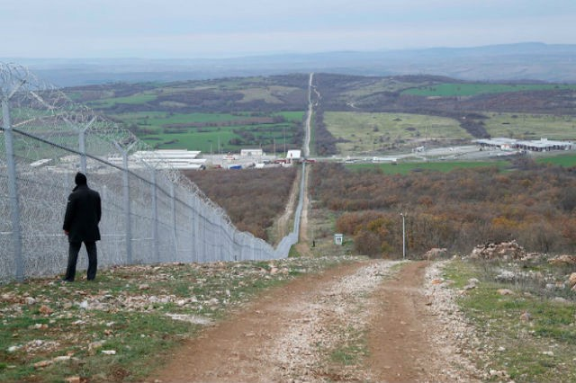
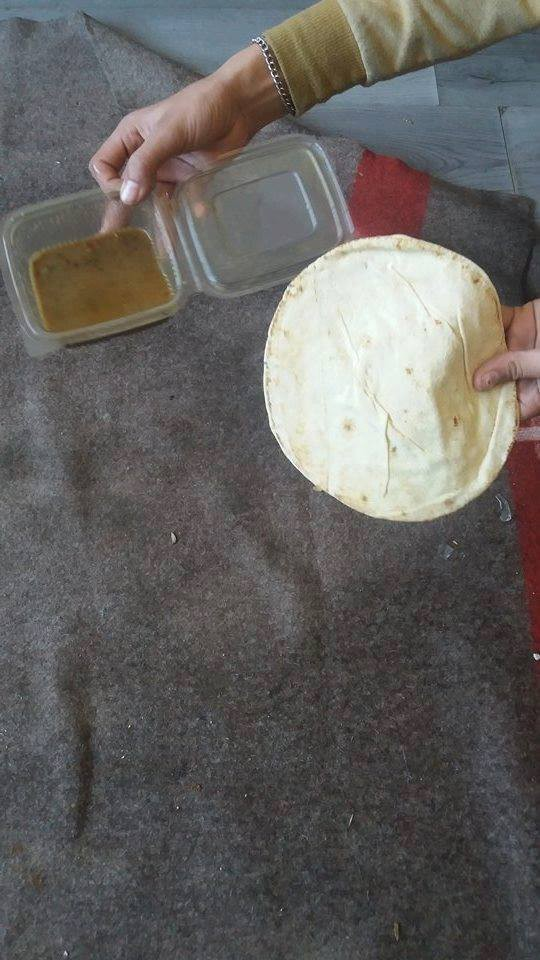
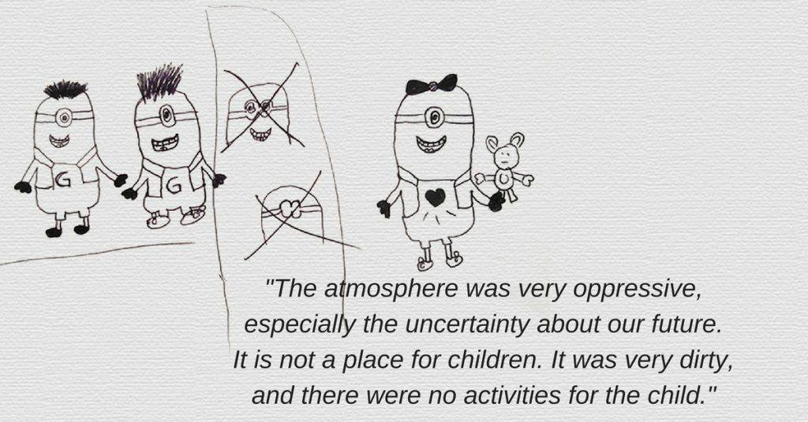
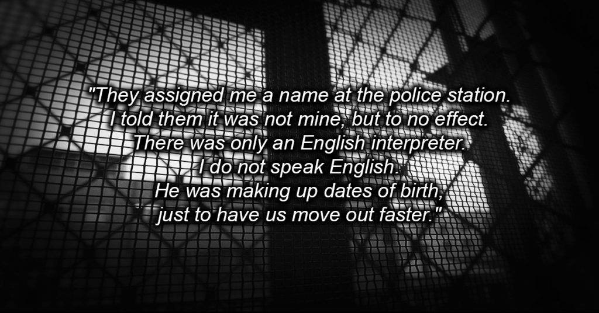

### AYS SPECIAL: Bulgaria: Is there no end to the recurring nightmare for Refugees?

_The treatment of refugees in Bulgaria is once again creeping back into the news with stories of human rights violations that are gut wrenchingly familiar\. Together with RefuComm we compiled available information about the situation in this country where many refugees from Greece are relocated, often against their wishes\._

Bulgarian border\. Photo by Balkan Insight\.

\(By Sharon Silvey, director of [Refucomm](http://www.refucomm.org) \. \)

This is nothing new\. Research into conditions for refugees in Bulgarian detention centers and camps have prompted demands for investigation from human rights organizations such as Amnesty International and Human Rights Watch for many years\. Their research is always alarming, pointing out to number of problems that have to be resolved\. Yet, this EU member state goes unpunished for evidenced violations of the basic human rights of refugees\.

**Investigations with no results**

A simple search on the internet will give anyone who is interested, access to report after report, recurring news stories repeating the plight of, and the despicable abuse of, refugees in Bulgaria\.

There are hundreds of documented testimonials from refugees, which speak of border police brutality, the killing and torturing of refugees, the denial of access to basic human rights\. These testimonials are painstakingly gathered by human rights organizations, journalists and individuals, reports are written, recommendations are made\.

As a result, every now and then, there is a flurry of media reporting and the stories go viral\. His has been going on for years\.

The evidence is presented to those in charge of investigating the claims in Europe who promptly ignore them and file them away\. Then everything goes quiet again, until the next time someone remembers Bulgaria and decides to demand an investigation that goes nowhere\.

Why?

Because the Bulgarians simply deny the evidence and refuse to carry out an investigation\. It appears that denial and a refusal to investigate is all that is required to enable a country to flout European regulations and laws decided by the European Union\.

There are no consequences to Bulgaria, no call for their removal from the European Union, no independent investigations, therefore the horrendous treatment of refugees goes unchecked\. Inaction by the European Union, and even a glowing report last year from the previous Prime Minister of the UK on Bulgaria’s ‘effective’ border controls, gives the Bulgarians increased confidence and carte blanche from Europe to abuse and violate refugees\.

**Conditions at the Border**

It is very clear for a broader public in Europe that Bulgarian border control ‘policy’ includes the hunting, killing, robbing and beating of refugees at the borders\. Last year, I worked with Amnesty, Oxfam and Human Rights Watch to gather evidence from hundreds of refugees who came to Serbia from Bulgaria who had been subjected to border police brutality and torture\. \(see some of the reports [here](http://www.dw.com/en/refugees-opting-for-bulgaria-route-exposed-to-violence/a-18842978) and [here](https://www.amnesty.org/en/documents/eur15/3058/2015/en/) \)

Twice in the last five years, the Bulgarian government have blamed the killing of refugees at their border on bullets that mysteriously ‘ricochet’ off the sky\. On both occasions, there were witnesses who insisted that the shootings were deliberate\. I, myself have video statements testifying that the killings were deliberate\. I took the statements last year at the Bulgarian/Serbian border in Dimitrovgrad\.

The Bulgarians carried out internal investigations on both occasions and people involved told us that refugees who attempted to make witness statements testifying to the truth were threatened in police custody\. The EU did not intervene with their own investigations on either occasion\.

**Refugee Hunting on the borders**

There have been many vigilante groups ‘hunting’ refugees on the border\. Indeed it appears to be a popular international ‘sport’ reminiscent of a Nazi era\. Last April one of these hunting groups, part of the nationalist Organization for the Protection of Bulgarian Citizens, was issued an award by Bulgaria’s Chief of border police for detaining 23 refugees near the country’s border with Turkey\. Police Chief Angelov told Bulgarian TV “I want to encourage them, because they have reacted very appropriately”\.

This encouragement from the authorities has given other, rather unsavory people, permission and confidence to form their own’ hunting parties’\. [Border police even offer training and advice to the vigilante hunters](http://www.novinite.com/articles/171443/Bulgaria's+Border+Police+Instructs+Hunters+on+Dealing+with+Refugees) \.

Far from denouncing these groups, the authorities and the people of Bulgaria consider the hunters to be ‘Super\-Heros’\. Some of them, like Dinko Valev, became an [overnight TV sensation when he detailed a violent encounter with a group of Syrian refugees trying to move across the border](http://www.bbc.com/news/magazine-35919068) \.

Undeterred by this threat, and no doubt spurred on by the potential accolade of receiving an award from the right wing Bulgarian government, hate fuelled [extremists from the UK, have travelled to Bulgaria](http://www.mirror.co.uk/news/uk-news/britain-first-extremist-filmed-joining-9113539) to join in with the ‘sport’ \.

**Conditions in the camps**

In April this year, after most of the refugees walked out of the camps in Bulgaria to go to Germany and the rest of Europe, and before the borders closed in March, the camps in Bulgaria were almost empty\. [Recent reports indicate](http://www.novinite.com/articles/176628/Bulgaria's+Migrant+Centers+'Overcrowded') that the camps in Bulgaria have filled again and are seriously over capacity\.

I recently spoke with a contact inside an open camp who wishes to remain anonymous for fear of reprisals\. Camp capacity is 2700, and it is estimated that some 3,600 people are inside\.

> “The camp slowly started to fill up again in July but it was in August that the numbers went up dramatically\. There are thousands of refugees here and it’s very tense, they are mostly Afghanis\. Conditions are really bad\. There is a lack of food, food is served twice a day but it’s not good food\. Conditions are unsanitary\. People sleep on moldy mattresses and washing facilities are scarce\. The sinks need replacing\. It’s cold\. There is no one to help\. We have one Red Cross woman who is really helpful but overwhelmed, UNHCR turn up occasionally but don’t seem to do anything\. One NGO have just put a container in for their use and are now present but it’s not enough\. We need help here\. People need nutritious food, clothes, blankets, there are many, many children who need support\.” 

Another contact with access to several camps told me the same story\.

> “Conditions are really miserable, camps are overcrowded, food is scarce\. There are two meals a day, small portions\. The evening meal Is supposed to include breakfast for the next day but it is also a small portion\. This way the authorities can say they are providing three meals a day , which is actually not the case\. People used to complain about the quality, now complaints are always about the quantity\. The current wave of refugees has very little money to supplement their diets\. There is no heating, they have one blanket each and people can’t sleep at night\. People are unhealthy, they have scabies and fleas and many cases of leishmanial \(from sandflies\) \. People take out mattresses and blankets hoping that the cold and light will kill the infestations\. Despite the camp management being fully aware of the infestation, there has been no spraying or pest control\. “ 

> “Medical care is practically non\-existent\. Only new arrivals get checked\. No medical care exists after that\. Only when we have an emergency are people taken to the hospital\. There is no care at all for pregnant women\.” 

> “NGOs here are scarce\. Camp management makes it very difficult for them\. We are inconvenient witnesses to their treatment of the refugees\. We need help and resources, but it is difficult when camp management do not want anyone here “ 

> “We need more clothes warm clothes, there is a small donation centre run by the church but it is only available to Syrian refugees\. Afghans are told to go away and not provided with anything\.” 

> “There is no place for people to pray, they are not even provided with prayer mats\. They did try to make a space for prayer but Caritas, the Christian organization, closed it down\.” 

> “We desperately need to improve food, donation space, we need a warehouse with an unbiased team, we need education activities, people to run them and most of all we need medical help and help for the pregnant mums\.” 

Unfortunately, even if more help were offered, history shows that the Bulgarians do not allow access to NGOs in Bulgarian camps easily\. Permission is hard to get\. Independent volunteers in the camps were removed in 2014\. Witnesses are not wanted\. Recently, the camp manager in Harmanli was removed\. There is now a camp manager who, it is reported, is unpleasant and doesn’t like NGOs\.

As one of the only NGOs allowed in the camps, I thought that maybe there would be some information and a cry for help on the UNHCR Bulgaria website\. Nothing, the reports are old\. It is out of date and an inaccurate, it is not a reflection of the seriousness of conditions in the camps in Bulgaria\.

**Detention Centres**

Official figures — 1772 people in detention — 148% of capacity\.

For years, it has been well documented, and recommendations have been made \(and ignored\) that conditions in detention centres in Bulgaria are well below EU regulation standards\. [The Bulgarian Helsinki Committee, one of the only active NGOs present in the camps and detention centres reports](http://www.bghelsinki.org/en/news/bg/single/violence-vermin-and-overcrowding-persist-bulgarian-prisons/) \.

> “Aside from the poor physical conditions in the detention centers, there are many recent reports that indicate denial of information for refugees about the processes, mismanaged asylum claims, denial of returns to own countries for those who request it\. These recent reports make substantiated claims about unaccompanied minors, children and families languishing in horrible conditions in detention centres for months with no access to translators or information\.” 

[HEAR project recently conducted the research](http://hear.farbg.eu/evidence-collection/case-studies/a-family-with-a-nine-year-old-daughter/) highlighting in their report the ’non\-information‘ strategy of the Bulgarian authorities and the desperation of the refugees\.

HEAR project\.

It also reiterated that the practice of waiting in detention centres, behind bars for months, until refugees are brought to an open camp like Harmanli, still exists, despite previous reports and recommendations that this inhumane practice should cease\. Often, unaccompanied kids are placed in detention, which is a serious violation of their rights\.

Similar [experiences were recently shared in a report by the Center for Legal Aid \(CLA\)](http://detainedinbg.com/blog/2016/09/22/final-report-who-gets-detained-increasing-the-transparency-and-accountability-of-bulgarias-detention-practices-of-asylum-seekers-and-migrants/) who said\.

> “With regard to the conditions of detention, almost all of the interviewed detainees complained about the complete lack of information and the resulting state of uncertainty in which they were kept\. They also complained that there was no predictability about what awaited them, especially in terms of their length of stay\. Among the basic complaints are also the lack of interpreters and inadequate opportunities for communication, difficult access to medical care, and lack of information about their rights and the rules\. Some detainees were complaining about the insufficient amount of food they received, as well as the insufficient access to hot water and the locking of rooms at night without access to toilets\. Several interviewees informed us of verbal and physical threats against the detainees by staff\.” 

HEAR project\.

And the animosity isn’t exclusively reserved for the refugees\. A few days ago the Chairman of the Bulgaria Helsinki Committee was attacked outside a hotel in Sofia

[BHC made a statement to say](http://www.bghelsinki.org/en/news/press/single/bhc-strongly-condemns-attack-its-chairman-krassimir-kanev/) _“ Over the years, staff members have been repeatedly harassed and threatened because of their work in defense of human rights in Bulgaria, but until now there have not been any cases of physical assault\.”_

**Accountability deficit**

Every time I read one of these reports, or write a story about it as I am now, my questions are always the same\. Who exactly is accountable? Why is this happening again? Why are the reports and recommendations ignored? How long is this going to be allowed to continue before someone does something? Where is the EU? Where is the UN?

I even find myself checking if Bulgaria is still in the EU because I find it totally incomprehensible that they are\.

This year, I have two new questions\.

Why is Bulgaria on the list of relocation counties from Greece if it so obviously can’t handle, and doesn’t want the refugees it already has? Shouldn’t Bulgaria be removed from the list of options? Should the option be replaced with a country who can demonstrate more respect for people’s basic human rights? Many of my friends in Greece, who are offered Bulgaria as a relocation choice, are recoiling in horror and refusing to go and who can blame them?

In Greece, one of the consequences of refusing a country that has accepted you on the relocation programme, is to be ejected from the EU funded accommodation which is part of the relocation package\. This is the consequence of refusing a country that is quite obviously an unacceptable option\.

Given the current situation in Bulgaria, how and why can EU states justify sending people back to Bulgaria under the Dublin III regulations?

_Converted [Medium Post](https://medium.com/are-you-syrious/ays-special-bulgaria-is-there-no-end-to-the-recurring-nightmare-for-refugees-c62448f2ac14) by [ZMediumToMarkdown](https://github.com/ZhgChgLi/ZMediumToMarkdown)._
