### AYS digest 31/10: MSF tells it like it is — stories from Greece and beyond

Comparing September and October numbers for Greece / MSF issued a report on vulnerable people in a Greek and EU system of encampment / Volunteers needed in Greece / Clearing out makeshift camp on the streets of Paris — city and government cleaning show/ 1500 unaccompanied minors still in the Jungle / Millions of Yemenis displaced due to ongoing scarcely reported war

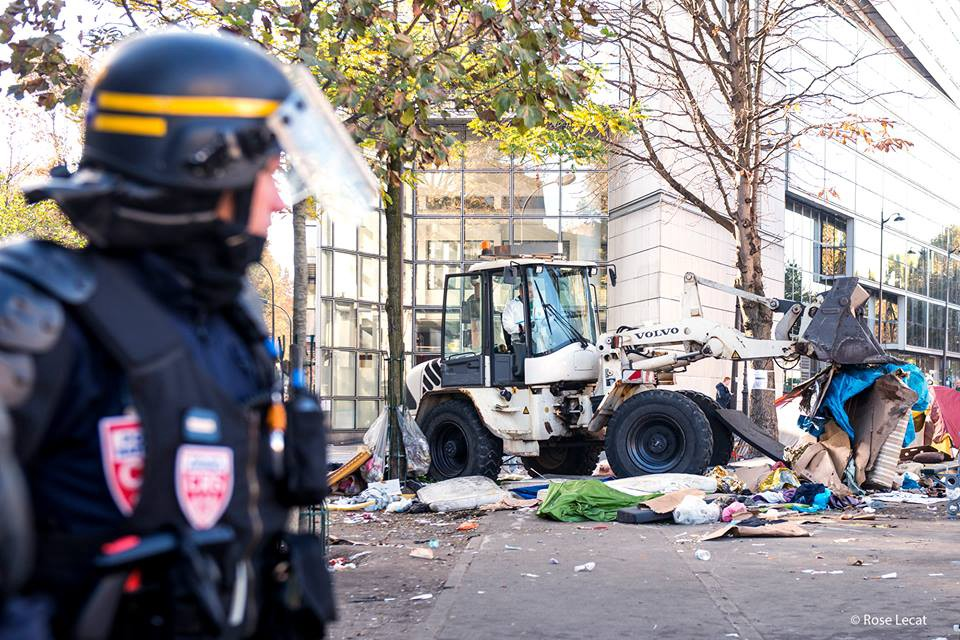

Cleaning the streets of Paris\. Photo: Rose Lecat
#### Greece
### **A month of more arrivals than departures**

As the end of the month is here, we bring the comparative data for Greek camps between the end of September and the end of October\. In the frame of this month there have been 2895 new arrivals on Greek islands, with majority of people landing on Samos\. Hotspots on 5 Greek islands are unbelievably overcrowded with overpassing capacity in some places for more than three times\. In totality, there are currently 15844 refugees stranded on the islands and official capacity is only 8085\. For more graphic data here is a [link](https://docs.google.com/spreadsheets/d/1xWVKJMQ3z90m8CsZMNFC7TAyjRgA3puRHFbwZ8YIjUk/pubchart?oid=1756125977&format=interactive) to interactive graph of comparison of arrival numbers in September and October\.

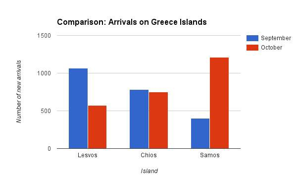

Mainland, on the other hand, has seen a decrease in numbers with 2691 people less in camps, but there has been an increase in numbers in UNHCR hotels with 1343 more residents\. In total there is an increase of 703 more people stranded in Greece making for a total number of 61178\. There has also been an increase of voluntary returns when September and October are compared with 103 voluntary returns in September and 242 in October\. There have been 107 deportations to Turkey from Greece this month\.
### **MSF issued a report on encampment system in Greece and what it those to those most vulnerable**

Behind this dry numbers there is a certain increase of human suffering and despair that is detailed in recently published MSF 2016 report on Greece: “Vulnerable People Get Left Behind”\. By the MSF research, many of those coming to Greek shores are not initially properly processed as to determine whether they suffer from mental or physical problems due to the fact that the interviews are short and are done by the personnel that is not sufficiently trained to recognize those signs\. Therefore, vulnerable people are placed in the camps where their state deteriorates rapidly stemming possible prospects of future integration and healing\.

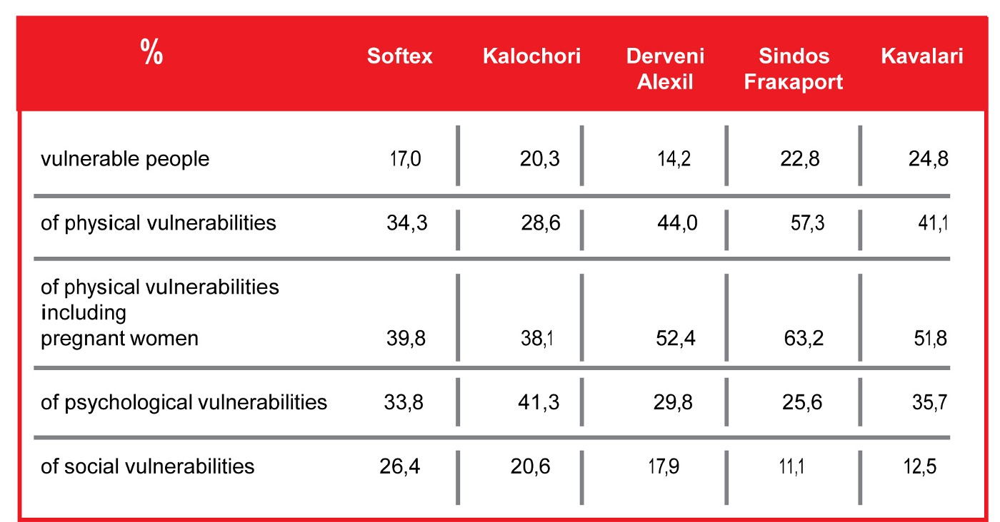

Data: MSF

In the report, MSF states that “despite the huge amount of funds made available, Greek Authorities, the European Union and humanitarian actors have failed to establish humane and dignified reception conditions, guarantee protection and deliver humanitarian aid to a proper standard\.” They especially concentrate on vulnerable people, whether they suffer mental, physical or social difficulties and state that “the current situation reflects the overall poor capacity of the Greek welfare system and the slowness of actors to offer appropriate support and accommodation to very vulnerable people\.” Due to the EU\-Turkey deal, as we all know, people are forced to spend extended periods of time in camps all over Greece which “exacerbates the stress and suffering of those that have already been through traumatic experiences\. The final stage of their journey is put on hold indefinitely, and they are subjected to a reality that is fraught with uncertainty\. Whilst on the move most people are able to focus on the journey and are able to put on hold processing the events that have happened to them\. Once in Greece they are forced to confront their traumatic experiences in substandard conditions with inadequate support\. This increases anxiety and depression\.” The islands are severely overcrowded, but to add insult to injury, extremely vulnerable people such as mentally and physically impaired or mothers with newborn children are persistently and systematically being denied adequate shelter\. They sleep in squalid surroundings, afraid for their safety and health due to infestation of insects and snakes, as we have reported many times\. MSF therefore is sometimes referring people, when possible, into volunteer run shelters stating that: “The volunteer groups are one of the main actors that provide a response to the refugees’ needs by trying to fill the gaps that are not covered by the government and/or by humanitarian agencies, or simply propose alternative ways to welcome people \(mix with the host community, etc\. \) \. We welcome and applaud these initiatives but it is ultimately the State’s responsibility to provide suitable accommodation for those who are stranded in Greece\.”

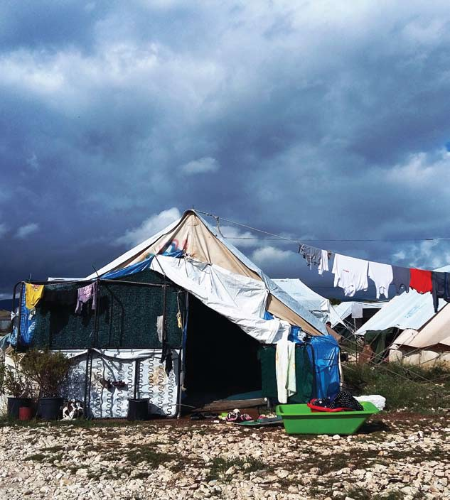

Katsikas, Sptember 2016\. Photo: MSF

They add that “considering the plight of very vulnerable people, specialized care is an urgent need, particularly early identification of cases and adequate referrals\. There are some people with specific vulnerabilities who should not be in camps; they need to be accommodated in specialized facilities with appropriate medical and protection follow up\.”

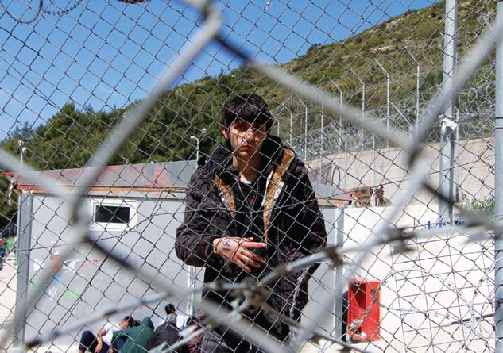

Samos\. March 2016\. Photo: MSF

On the basis of the work done by MSF mental health teams, they established that “the psychological well\-being of the vast majority of our patients is compounded by the daily stressors of displacement, such as: The living conditions in the camp; The lack of legal information and assistance; The uncertainty about the future;The feeling of insecurity; The isolation and discrimination; The destruction of the family entity;” and finally recommend that both Greek authorities and EU officials should 1\) Consider alternatives to the current encampment system 2\) Fund programs to cover the needs of the vulnerable people 3\) Provide effective access to healthcare 4\) Develop and strengthen safe and legal channels to other European countries

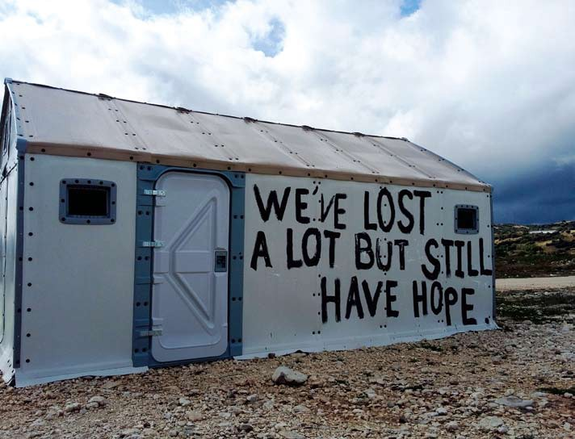

The report is filled with testimonies of people stranded in camps where one can find information how the highly bureaucratized system of registration is cheating people out of their dignity, how the situation is overworking health care professionals in Greek hospitals and in the end creating humanitarian crises with no visible resolve\. Finally they state that “relocation should also be strengthened and speeded\-up: whereas in September 2015, the European Union pledged to relocate 66,400 people from Greece, this has not been translated into practice\. As of the 14th October, of the meagre 16,532 places pledged by EU Member states for relocation, only 4,716 persons have been relocated from Greece\.”

**Solidarity concert in City Plaza Hotel in Athens — 1st of November, 21h**

To follow up on more brighter events that are happening in Greece, at one of the places of “alternative to the current encampment system”, we are publishing an invitation to the solidarity concert that is going to be held in City Plaza Hotel tomorrow, 1st of November, starting at 21h\.

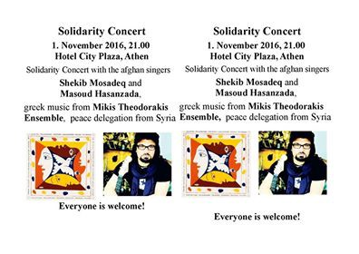

City Plaza Hotel solidarity concert — everybody is welcome\!

**Volunteers needed in Greece**

Also there are two calls for volunteers that are circling as of today\. Doliana Solidarity Project \( [dolianasolidarity\.org](http://l.facebook.com/l.php?u=http%3A%2F%2Fdolianasolidarity.org%2F&h=RAQGFnKkK) \) is seeking sports/physical education staff\. There is free accommodation and those who are interested should be able to come to Doliana by the 18th of November for training\. If you are one of them contact them via Erica’s e\-mail [erica\.turley@gmail\.com](mailto:erica.turley@gmail.com)

Another call is from Skaramngas where they are in need for a volunteer who drives and has access to a car in order to drive the children in need of dental care from the camp to Athens\. If you see your self as driving little miss sunshines, please fill out this [form](https://docs.google.com/forms/d/e/1FAIpQLSf13-ixQzfU7ugyAxuGF9r6GMByJq7eQVwmK-U3xjBwsVUJLQ/viewform?c=0&w=1) and a coordinator will contact you\.
#### **France**
### **Paris report: Police are thieves on the streets**

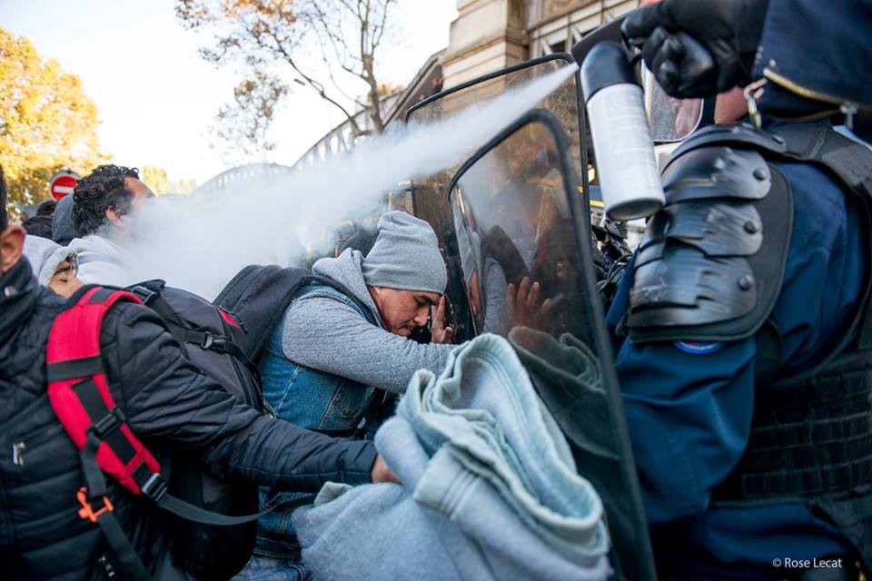

Photo: Rose Lecat

As Calais “Jungle” has been emptied out, Paris is in a turmoil that was to expected to happen as we and many others indicated\. With thousands sleeping rough on the streets, the city is urging the government to clear the city from thousands of refugees so as that thousands of tourists can walk freely\. Today, police carried out one of such actions with no purpose or resolve in a blatant show of power and basic disregard for human lives\. As Reuters reports “French riot police swooped on a makeshift migrant camp in northeast Paris on Monday, sparking a brief standoff at a site where numbers have soared since the closure of the Jungle shanty town in the northern port city of Calais\. The operation, largely consisting of identity checks on some of an estimated 2,500 migrants sleeping rough around a canal and railway bridge near Paris’s Stalingrad metro station, came as pressure mounts on the government to shut the camp\.”

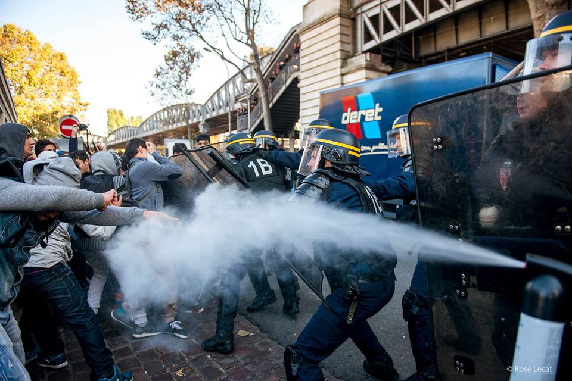

In the end the area was cleaned and as the volunteers on the ground report, people are back and have settled on the streets once again since there is no other place to go at the moment\. This makes this operation even more bizarre as it only made turmoil without resolution\.

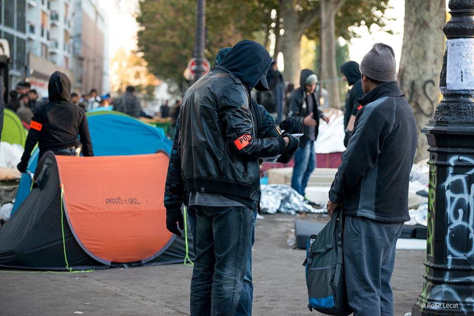

Photo: Rose Lecat

In other news from the city of love, volunteers report that those who have been provided with accommodation sleep in overcrowded and filthy hotel rooms and food is scarce\. We do not speak here of all the provided accommodation facilities, but for weeks, there have been fragmented reports from different places stating that the shelters, even when they are provided are far from dignified\.
### **Jungle or the surface of the moon — only unaccompanied minors left standing**

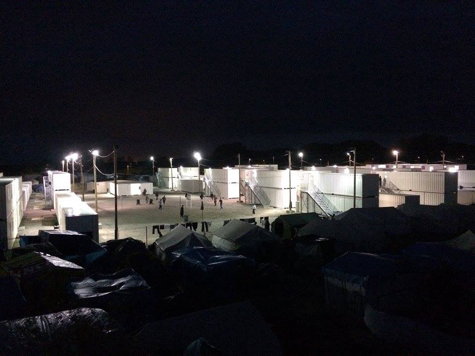

Container camp with 1500 unaccompanied minors still residing in the jungle\. Photo: help refugees

Moving further more to the west, as the Jungle has been made into the surface of the moon, around 1500 unaccompanied minors are still left without resettlement plan and sleeping in shipping containers on the site where the jungle has been\. Calais Kitchen, Refugee community kitchen and Little Ashram Kitchen are trying to provide food and water to the stranded minors who are fenced off in the area which, by the reports, proves to be difficult since the area is guarded and not many passes are issued for entrance\.

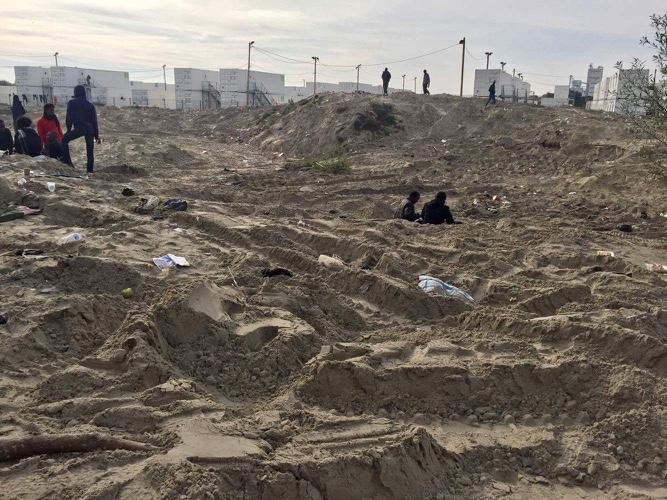

Jungle after the “clean up”

Help refugees also sends this message which we bring in full: “Children have NO IDEA what is happening to them and volunteers equally don’t know what to say and themselves are not allowed into the containers\. There appear to be very few responsible and appropriate adults in the containers\- without doubt not the standard for this number of minors\. The children are incredibly stressed and confused\. There were still some minors who were having to sleep outside the CAP not having been let in and once again being watched over by volunteers\. There are approx 30 UA females left in camp \(the youngest is 12\) at the Jules Ferry centre, the youngest is 12\. The centre is still also housing 500 vulnerable women\. Again NO sign of French officials, British officials or any official NGO\. Staff in the Jules ferry also say they have no idea what is going on, the women and girls are again highly stressed and confused\. Francoise Hollande implied over the weekend that the children would be moved to CAO’s and asked the British to oversee this move and eventually take the children\. This seems at odds to the information the Home office itself has put out\. PLEASE email/ tweet your MP and demand Amber Rudd comments on this situation and finds a solution immediately\.”
### **Refugee info bus hopes that all are safe and if you need legal advice — feel free to contact them**

For all of those who have left the Jungle, Refugee bus info wishes safety and hopes they have landed all right\. They are also sending a message that if anybody needs some legal advice, they are available\. For a version of this message in Arabic follow this [link](https://www.facebook.com/RefugeeInfoBus/photos/a.1756184407950313.1073741828.1756144974620923/1854945651407521/?type=3&theater)
#### Germany
### **All Syrians that ask for asylum should be granted one since they are deemed refugees after a class action suit went into people’s favor**

The administrative court of Münster \(North Rine\-Westphalia\) has ruled that Syrians in Germany basically have the right of refugee protection\. The application for asylum itself would lead to political persecution by the government of Assad\. Asylum seekers are seen as enemies of the government\.

Earlier Syrians in Germany generally got the refugee protection, which fits to the convention of Geneva\. Nowadays more and more Syrians only receive subsidiary protection, which makes until 2018 unable to ask for family reunion \(exception: Dublin III\) \. Only at the administrative court of Münster 700 refugees sued against this subsidiary protection\.

All Syrian returnees would have to expect to face political persecution, the court explained\. With “notable probability” they were interrogated under torture, to say their reasons for leaving the country and give information about the scene in exile\. The reason would be that the Syrian government sees all asylum seekers as enemies of the government\. This was shown by the use of violence\. It’d make no difference, if the refugees leave Syria legally or illegally\.
#### Yemen
### **No country for peace**

As we endlessly hope for ending of wars in the middle east, they seem to be escalating in places that are not usually reported on as focal points of conflict\. Stephen O’Brien was briefing the UNSC on Yemen today, says since his last UNSC briefing, humanitarian situation has become worse, 80% of Yemenis, 21\.2M, are in need of some form of aid\. thousands killed, tens of 1000s injured, 3M\+ forced to leave home, 7M suffer daily anxiety of not knowing where their next meal comes from\. Yemen is one step away from famine\. Over 2M people are malnourished nationwide\.

_Converted [Medium Post](https://areyousyrious.medium.com/ays-digest-31-10-msf-tells-it-like-it-is-stories-from-greece-and-beyond-4971a69c8a83) by [ZMediumToMarkdown](https://github.com/ZhgChgLi/ZMediumToMarkdown)._
